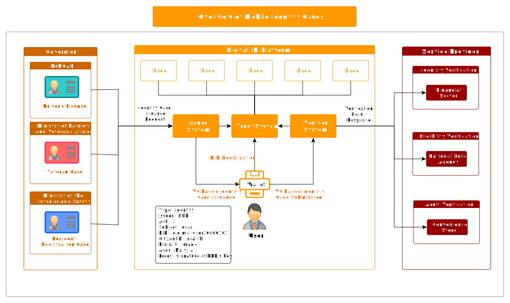
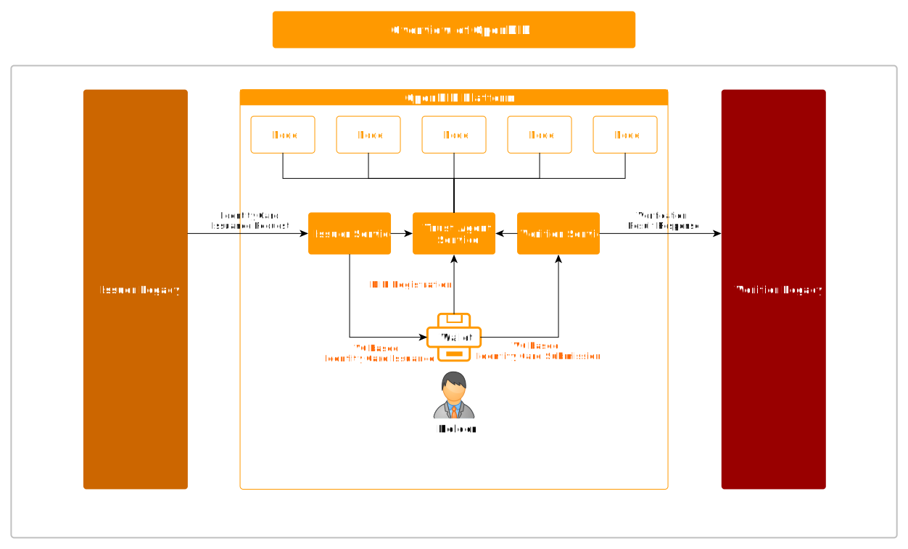
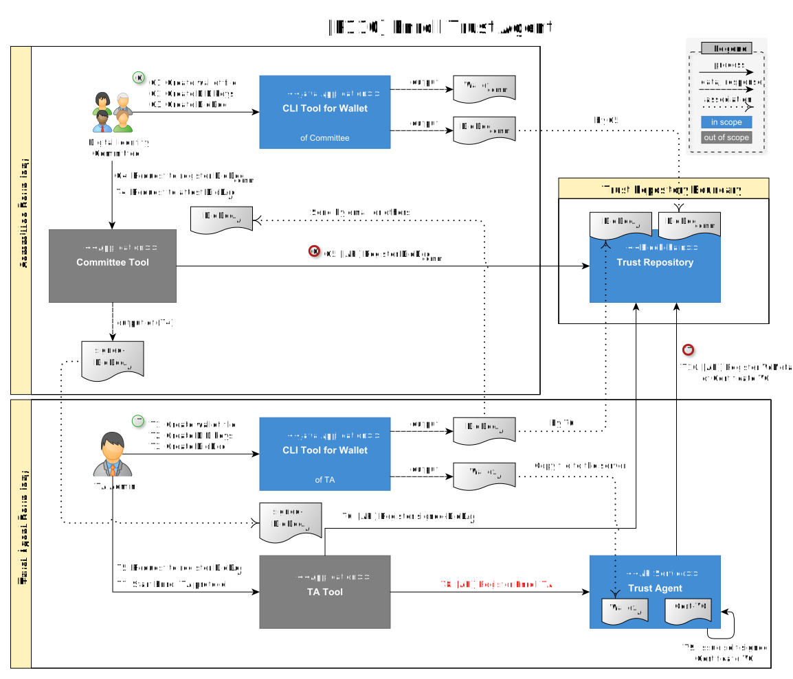
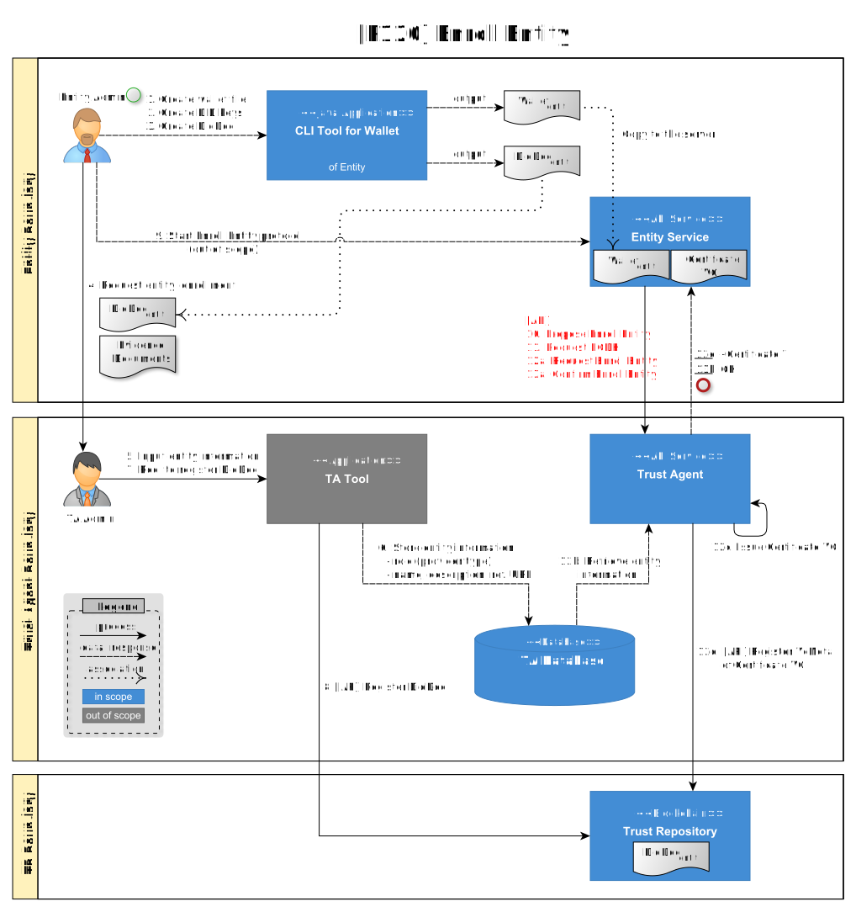
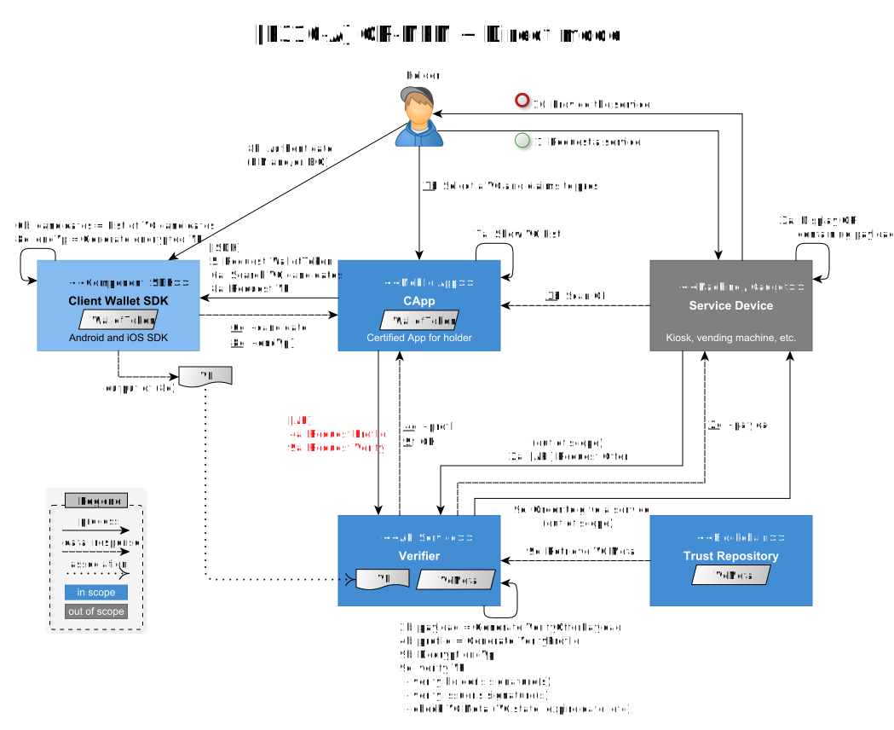
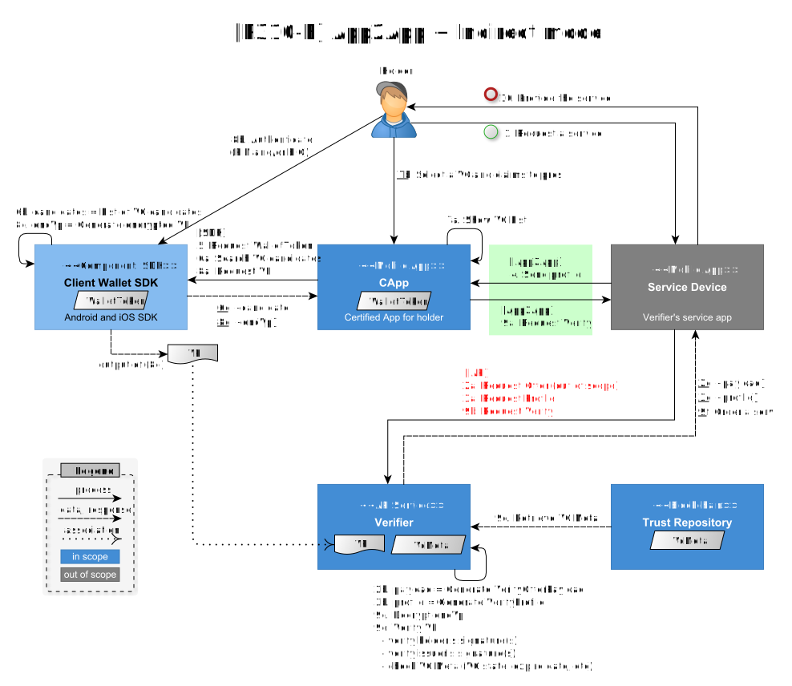
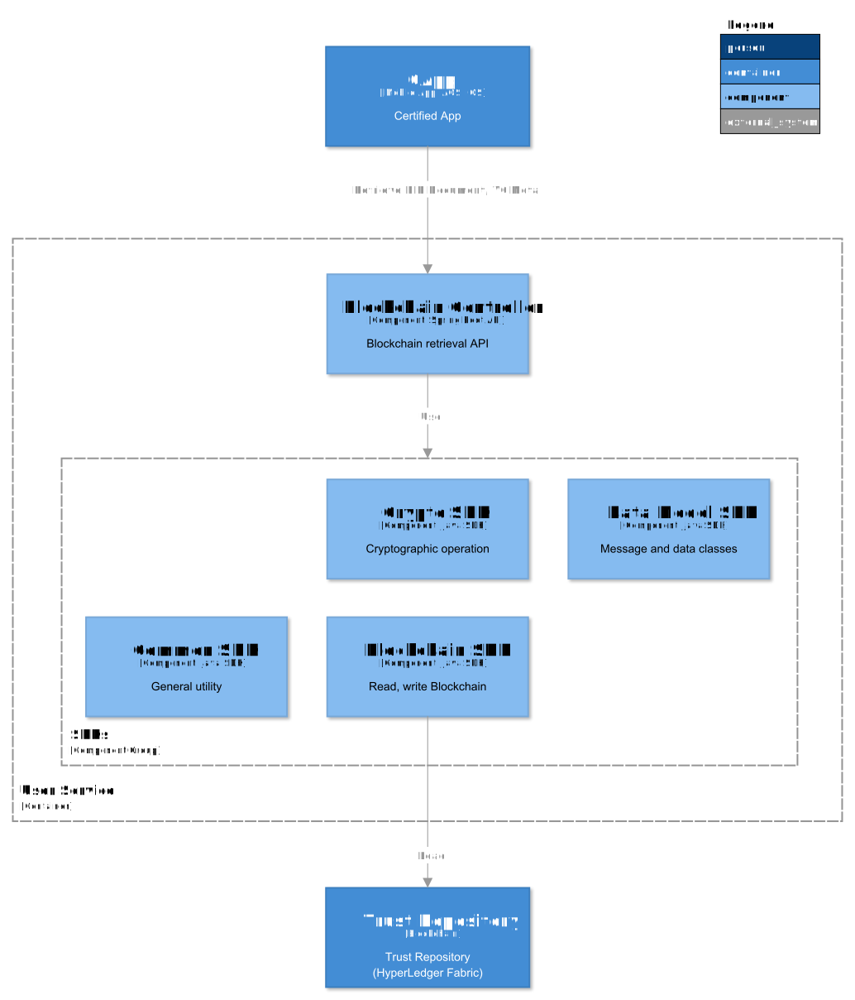

---
puppeteer:
    pdf:
        format: A4
        displayHeaderFooter: true
        landscape: false
        scale: 0.8
        margin:
            top: 1.2cm
            right: 1cm
            bottom: 1cm
            left: 1cm
    image:
        quality: 100
        fullPage: false
---

Software Architecture
==

- Topic: Explanation of Software Architecture using the C4 model  
- Author: Kang Young-ho 
- Date: 2024-09-03  
- Version: v1.0.0  

Table of Contents
---

<!-- TOC tocDepth:2..4 chapterDepth:2..6 -->
  - [1. Overview](#1-overview)
    - [1.1. C4 Model](#11-c4-model)
    - [1.2. Reference Documents](#12-reference-documents)
  - [2. Digital ID Platform](#2-digital-id-platform)
    - [2.1. Open DID](#21-open-did)
  - [3. System Context Diagram](#3-system-context-diagram)
    - [3.1. OpenDID](#31-opendid)
    - [3.2. Holder](#32-holder)
    - [3.3. Issuer Legacy](#33-issuer-legacy)
    - [3.4. Issuer](#34-issuer)
    - [3.5. Verifier Legacy](#35-verifier-legacy)
    - [3.6. Verifier](#36-verifier)
  - [4. Container Diagram](#4-container-diagram)
    - [4.1. Core](#41-core)
    - [4.2. Wallet](#42-wallet)
    - [4.3. Certified App](#43-certified-app)
    - [4.4. Issuer](#44-issuer)
    - [4.5. Verifier](#45-verifier)
    - [4.6. Supplements](#46-supplements)
  - [5. Component Diagram](#5-component-diagram)
    - [5.1. Trust Agent](#51-trust-agent)
      - [5.1.1. Enroll Controller](#511-enroll-controller)
      - [5.1.2. Issuance Controller](#512-issuance-controller)
      - [5.1.3. List Controller](#513-list-controller)
    - [5.2. Issuer Service](#52-issuer-service)
      - [5.2.1. Issuance Controller](#521-issuance-controller)
      - [5.2.2. VC Controller](#522-vc-controller)
    - [5.3. Verifier Service](#53-verifier-service)
      - [5.3.1. Verify Controller](#531-verify-controller)
    - [5.4. Certified App (CApp)](#54-certified-app-capp)
      - [5.4.1. DID Module](#541-did-module)
      - [5.4.2. VC Module](#542-vc-module)
      - [5.4.3. VP Module](#543-vp-module)
    - [5.5. Wallet Service](#55-wallet-service)
    - [5.6. CApp Service](#56-capp-service)
    - [5.7. User Service](#57-user-service)
    - [5.8. Notification Service](#58-notification-service)

<!-- /TOC -->

## 1. Overview

This document explains the software architecture of OpenDID using the C4 model.

### 1.1. C4 Model

The C4 model is a methodology for creating diagrams that visualize software system architecture. As its name suggests, the C4 model uses four primary types of diagrams—Context, Container, Component, and Code—to clearly represent the structure of a system from various perspectives. Each diagram describes the system from a specific viewpoint to help stakeholders easily understand the system’s structure and interactions.

This four-step approach enables a hierarchical understanding of the entire system, making it a useful tool for both developers and non-technical stakeholders. In this document, the Code-level structure is omitted.

### 1.2. Reference Documents

| Reference Name | Document Name | Location |
| -------------- | ------------- | -------- |
| [C4-MODEL] | The C4 model for visualising software architecture | https://c4model.com/ |
| [DATA-SPEC] | (OpenDID) Data Specification | [Data Specification](https://github.com/OmniOneID/did-doc-architecture/blob/main/docs/data%20standard/data%20specification/Data%20Specification.md?ref_type=heads) |
| [USER-REG] | (OpenDID) User Registration | [User Registration](https://github.com/OmniOneID/did-doc-architecture/blob/main/docs/concepts/User%20Registration.md?ref_type=heads) |
| [ISSUE-VC] | (OpenDID) VC Issuance | [VC Issuance](https://github.com/OmniOneID/did-doc-architecture/blob/main/docs/concepts/VC%20Issuance.md?ref_type=heads) |
| [PRESENT-VP] | (OpenDID) VP Presentation | [VP Presentation](https://github.com/OmniOneID/did-doc-architecture/blob/main/docs/concepts/Presentation%20of%20VP.md?ref_type=heads) |
| [VC-FORMAT] | (OpenDID) VC Format | [VC Format](https://github.com/OmniOneID/did-doc-architecture/blob/main/docs/data%20standard/verifiable%20credential%20format/VC%20format.md?ref_type=heads) |

## 2. Digital ID Platform

The Digital ID Platform utilizes blockchain-based Decentralized Identity (DID) technology to issue, manage, and verify mobile identity cards (e.g., driver's licenses, mobile veteran cards, and mobile resident registration cards). Through this system, users can securely manage their identities and verify them for necessary services.

The Digital ID Platform consists of the following key components:

- **Issuing System (Issuer)**: Issues identity cards based on user requests.
- **Verification System (Verifier)**: Verifies the user’s identity card.
- **Trust System**: Helps platform participants establish a **trust chain** among themselves.
- **Verifiable Data Registry (Trust Repository)**: A blockchain-based storage system that manages decentralized identifiers (DIDs) and Verifiable Credentials (VCs).
- **User**: An individual who receives and verifies identity cards.

The government issues identity cards based on **Verifiable Credentials (VC)** at the user’s request through the **Issuing System**. Users then present their identity information using VC-based identity cards to the **Verification System** as requested by **Service Providers**.

All participants must generate **DIDs** to join the Digital ID Platform and register them in the **Trust Repository** through the **Trust System**.

### 2.1. Open DID

**OpenDID** is an open-source project for a Digital ID platform, enabling organizations, developers, and government agencies to easily implement Digital ID systems and issue identity cards to users.

## 3. System Context Diagram

The System Context Diagram illustrates the overall context of the system, depicting interactions between the system and external entities, as well as the roles of key users and relationships with external systems.

The diagram highlights the core features of OpenDID: **User Registration**, **VC Issuance**, and **VP Presentation**.

1. **User Registration**: Every Holder must complete the registration process, which involves creating a DID and registering the DID Document in the Trust Repository through OpenDID’s Trust System.
2. **VC Issuance**: When a Holder requests a VC through Issuer Legacy, the system sends the necessary data to OpenDID, which generates the VC and provides it to the Holder.
3. **VP Presentation**: When a Holder receives a VP request from Verifier Legacy, they generate a VP and submit it to OpenDID. OpenDID verifies the VP and forwards it to Verifier Legacy, which confirms the Holder’s identity to provide services.

The core functions of OpenDID include:
- Lifecycle management of DID Documents that form the trust chain.
- Secure storage and usage of private keys and documents.
- Issuance of VCs as identity cards.
- Management of VC lifecycles.
- VP submission and verification.

Additionally, the system provides extra features to enhance user convenience:
- User Registration (Sign-up, user registration)
- Report Lost and Found
- Request Termination (for DID Documents)
- VC Deletion and Reissuance
- Cancel Membership

The implementation of these extra features may vary based on the policies or requirements of each OpenDID implementation.

<!-- The core functions of the DID-based digital ID system, OpenDID, are as follows:

- Manage the lifecycle of DID Documents that form the basis of the trust chain.
- Securely store and use private keys and documents.
- Issue VCs as identity cards.
- Manage the lifecycle of VCs.
- Submit and verify VPs.

A user who holds an issued VC is referred to as a Holder. 
Additional features are provided to help Holders conveniently utilize the core functions:

- User registration (Sign-up, user registration)
- Report lost and found (Report lost and found)
- Request termination of DID Documents (Request termination)
- Delete and reissue VCs
- Cancel membership

The implementation of these additional features may vary depending on the policies or requirements of each OpenDID implementation. 
Thus, they should be viewed as examples adopted by specific implementations rather than fixed features. -->

### 3.1. OpenDID

OpenDID serves as the target system, offering the following services to participants:

- to Holder:
    - User registration
    - Issuance and presentation of identity cards
    - Reporting lost or recovered mobile devices
    - Requesting the termination of DID Documents
    - Membership cancellation
- to Issuer:
    - Sending IssueOffers to Holders
    - Issuing VCs to Holders
    - Managing the status of VCs
- to Verifier:
    - Providing VerifyOffers to Service Devices
    - Receiving and verifying VPs from Holders

Further details about OpenDID components are provided in the Container Diagram.

### 3.2. Holder

The Holder is an individual possessing identity cards issued by an Issuer, generally referred to as a user. In a broader sense, users may also include administrators of Trust Agents, Issuers, and Verifiers. Unless specified otherwise, however, the term user is synonymous with Holder.

### 3.3. Issuer Legacy
Issuer Legacy refers to legacy systems previously used for identity management, such as issuing identity cards or maintaining identity information. These systems supply the necessary data to OpenDID for VC issuance. Legacy systems can interact with OpenDID through APIs or SDKs provided by OpenDID.

Examples include:

- Physical ID issuance systems: Legacy government systems that previously issued physical IDs (e.g., resident registration cards, driver’s licenses) can act as Issuer Legacy systems, providing data for mobile identity issuance through OpenDID.
- Identity information management institutions: Organizations that do not issue physical IDs but manage user identity information (e.g., name, date of birth, national ID number) can also serve as Issuer Legacy systems.

Issuer Legacy can encompass various organizations or systems and supports VC issuance by interacting with OpenDID based on identity information.

### 3.4. Issuer

The Issuer generally refers to the API service within OpenDID responsible for issuing VCs. However, it may also encompass Issuer Legacy systems. Legacy Issuer systems act as data sources for the issuance process and may share administrators with the new Issuer Service.

Multiple Issuers can exist within a single OpenDID implementation, and additional Issuers can be added or removed during system operation.

### 3.5. Verifier Legacy
Verifier Legacy refers to legacy systems used to verify the identity of Holders and provide services based on the verification. It receives and verifies Verifiable Presentations (VPs) through OpenDID.

Examples include:
- Financial institution identity verification systems: Banks and insurance companies use legacy systems to verify user identities and offer services based on that verification.
- Government identity verification systems: Legacy government systems can also act as Verifier Legacy, verifying VPs submitted through OpenDID to offer services.

### 3.6. Verifier

The Verifier generally refers to the API service within OpenDID responsible for verifying VPs. Similar to the Issuer, multiple Verifiers can exist within a single OpenDID implementation, and they can be added or removed as needed during system operation.

## 4. Container Diagram

The Container Diagram illustrates the major containers within the system (e.g., API applications, databases) and explains their interactions and data flows. This diagram does not refer to Docker containers but instead depicts the logical components of the system.

The diagram categorizes containers as follows:

| Group                       | Containers                                   | Multiple |
| --------------------------- | -------------------------------------------- | :------: |
| **Core**                    | • Trust Agent                             |          |\
|                             | • Trust Repository (Blockchain network)   |          |\
|                             | • Notification Service                       |          |
| **Wallet**                  | • Client wallet (SDK, Mobile App, Cloud)  |    Y     |\
|                             | • Wallet Service (for client wallet)         |          |
| **Certified App** (CApp) | • CApp (Mobile App for holder)            |    Y     |\
|                             | • CApp Service                               |          |
| **Issuer**                  | • Issuer Service                          |    Y     |\
|                             | • Issuer Legacy                              |          |
| **Verifier**                | • Verifier Service                        |    Y     |\
|                             | • Verifier Legacy                            |          |
| **Supplements**             | • User Service                            |          |\
|                             | • CLI Tool for Wallet                        |          |

### 4.1. Core

The Core group contains the essential components for operating the Digital ID system:

- Trust Repository:
    - A blockchain-based storage system that prevents hacking and tampering.
    - Stores DID Documents and VC metadata.
- Trust Agent:
    - Authorized by the Digital Identity Committee to operate the trust chain and perform the following tasks:
        - Registering DID Documents.
        - Registering entities (e.g., Issuers, Verifiers) and issuing Certificate VCs.
        - Registering client wallets.
        - User registration and membership cancellation.
    - Provides additional services:
        - Registering and retrieving VC Plans.
        - Performing Know Your Customer (KYC) procedures.
- Notification Service:
    - Sends emails and push notifications from servers to CApps.
    - Issuers and Verifiers can operate their own Notification Services if needed.

In addition to the core functions, the following providers’ services may also be integrated into the Trust Agent, depending on the implementation policies.

- KYC provider
- Notification provider
- List provider
- Log and backup provider

### 4.2. Wallet

The Wallet group includes elements related to the user’s client wallet:

- Client wallet
    - File wallet
    - Mobile app wallet
    - Cloud wallet
- Wallet Service:
    - Signs the client wallet’s registration information with the Trust Agent’s signature for authenticity.
    - Used solely for client wallet registration.

Each domain must have at least one Wallet group. A domain refers to an OpenDID implementation that operates a unique DID method and a Trust Agent.

### 4.3. Certified App

The Certified App (CApp) group involves mobile applications for users:

- CApp:
    - A mobile app operated by a CApp Provider registered as a business.
    - Must use the client wallet provided by a registered Wallet Provider.
- CApp Service:
    - Signs token seed information to generate WalletTokens and ServerTokens, proving the app’s authenticity.
    - CApp Services must sign every interaction with client wallets or Trust Agent services.

Each domain must have at least one CApp group.

### 4.4. Issuer

The Issuer group contains elements related to identity issuance:

- Issuer Service:
    - A server implementing the Issuer API using the OpenDID SDK.
    - Alternatively, Issuer Legacy systems may add Issuer APIs to their infrastructure.
- Issuer Legacy:
    - Legacy servers that store and manage the personal data necessary for identity issuance.

Each domain must have at least one Issuer group.

### 4.5. Verifier

The Verifier group consists of components for identity verification:

- Verifier Service:
    - A server implementing the Verifier API using the OpenDID SDK.
    - Verifier APIs can also be integrated into Verifier Legacy systems.
- Verifier Legacy:
    - Legacy systems used to confirm identities and provide tailored services to users.
    - Various identity verification services exist, and the Verifier Service is one of them.

Each domain must have at least one Verifier group.

### 4.6. Supplements

The Supplements group includes auxiliary or temporary functions:

- User Service:
    - Provides APIs for CApps to access the Trust Repository.
    - Required only when HyperLedger Fabric (HLF) is used as the blockchain.
        - HLF uses certificate-based access control, which does not distinguish between read and write permissions.
        - User Service can receive certificates to provide read-only access for detailed access control.
- CLI Tool for Wallet:
    - A wallet tool for entities like Issuers and Verifiers.
    - Provides the following functions:
        - Create wallets.
        - Generate ECC/RSA key pairs for DIDs.
        - Create DID Documents.
- Usage Scenario
    - The entity administrator creates a wallet, key pairs for DID, and a DID Document.  
    - The wallet file is copied to the Provider Service server to configure the server wallet.  
    - The DID Document is sent to the TA administrator to request registration in the Trust Repository.  
    - The Provider Service invokes the entity registration protocol with the Trust Agent.

## 5. Component Diagram

The Component Diagram outlines the major components within each container and their relationships. It focuses on components rather than detailing specific interactions.

The OpenDID SDK is used across all containers and includes the following types:

| SDK                    | Functionality                                       | Notes |
| ---------------------- | --------------------------------------------------- | ----- |
| Core SDK               | • Create DID Documents                           | Supports DID, VC, VP |
|                        | • Create VCs                                      |       |
|                        | • Create and verify VPs                             |       |
| Common SDK             | • General utilities                                 | Date and string functions |
| Crypto SDK             | • Symmetric encryption/decryption                | For encryption, signing, hashing |
|                        | • Public key signing/verification                |       |
|                        | • Generate key pairs (ECC, RSA)                  |       |
|                        | • Multibase encoding/decoding                    |       |
| Data Model SDK         | • Provides data models for JSON documents and APIs | JSON ↔ Java Class conversion |
| Blockchain SDK         | • Manage DID Document lifecycles (create/update/delete/revoke)  | For blockchain operations |
|                        | • Register and retrieve VC metadata             |       |
| Server Wallet SDK      | • Initialize/connect/disconnect wallets         | For DID key management |
|                        | • Generate DID key pairs                         |       |
|                        | • Sign and verify using DID keys                |       |
|                        | • Key exchange                                     |       |
| Client Wallet SDK      | • Manage client wallets (lock/unlock)           | For DID and VC management |
|                        | • Create, store, and retrieve DID Documents     |       |
|                        | • Store and retrieve VCs                           |       |

### 5.1. Trust Agent

The Trust Agent implements registration, issuance, and listing APIs using the OpenDID SDK.

| API Group           | Functionality                                        | Notes |
| ------------------- | ---------------------------------------------------- | ----- |
| Enroll Controller   | • Register and update DID Documents               | Builds the trust chain and manages users |
|                     | • Register entities                               |       |
|                     | • Register wallets                                |       |
|                     | • Register and deregister users                   |       |
|                     | • Report lost and recovered mobile devices        |       |
|                     | • Request DID Document termination                   |       |
| Issuance Controller | • Mediate VC issuance                             | Issuers handle issuance and status updates |
|                     | • Mediate VC status updates                          |       |
| List Controller     | • Retrieve information                            | Handles list services |
|                     | &nbsp;&nbsp;- VC category list                    |       |
|                     | &nbsp;&nbsp;- VC Plan list by category            |       |
|                     | &nbsp;&nbsp;- VC Plan details                     |       |
|                     | &nbsp;&nbsp;- Allowed CApp packages for wallets  |       |
|                     | &nbsp;&nbsp;- Certificate VCs by DID                 |       |

#### 5.1.1. Enroll Controller

The Enroll Controller is responsible for registration-related functions.  
The types of entities eligible for registration are as follows.

1. Entity: Trust Agent, Issuers, Verifiers and the other providers such as Wallet Provider, CApp Provider
2. Client Wallet
3. User (Holder)

The table below describes the identifier type (Id type), whether the entity owns a DID, and whether it holds a certificate VC for each entity.

| Subject         | Identifier Type   | Owns DID | Owns Certificate VC |
| --------------- | ----------------- | -------- | ------------------- |
| Trust Agent     | did               | Y        | Y (role="Tas")      |
| Issuer          | did               | Y        | Y (role="Issuer")   |
| Verifier        | did               | Y        | Y (role="Verifier")   |
| Other providers | did               | Y        | Y (role=...)        |
| Client Wallet   | walletId, did     | Y        | N                   |
| User            | personId(PII), did | Y       | N                   |
| CApp            | appId             | N        | N                   |

Since CApps do not own DIDs, they must rely on attestation signatures from CApp Providers to prove authenticity.

■ Procedure for Registering an Entity’s DID Document

Entities that own a DID must first register their DID Document in the Trust Repository.  
The demo implementation provides the `<<Java Application>> CLI Tool for Wallet`, allowing providers to generate their server wallets and DID Documents.  
The steps for registering a provider’s DID Document are as follows:

1. (Provider Admin): Create a DID Document using the CLI Tool for Wallet.
2. (Provider Admin): Send the following documents to the Trust Agent Admin via email or other means:
    - DID Document  
    - Evidence documents (e.g., business registration certificate)  
3. (TA Admin): Review the submitted documents and enter the provider information into the system using the TA Tool.
4. (TA Admin): Register the provider’s DID Document in the Trust Repository using the TA Tool.

■ Certificate VC

All providers, including the Trust Agent, must receive a Certificate VC from the Trust Agent.  
The Certificate VC contains the following claims:

- `subject` (DN = Distinguished Name): Information about the entity.  
- `role` (ROLE_TYPE): The role of the entity (e.g., "Tas", "Issuer", "Verifier").  

A DID Document alone does not indicate what role the entity performs.  
Therefore, the Trust Agent issues a Certificate VC upon provider registration to certify the role of the entity.

The storage and retrieval methods for issued Certificate VCs are beyond the scope of this document. However, the demo implementation provides a function to retrieve a Certificate VC using the provider’s DID.

■ Trust Agent Registration

Registering the Trust Agent is a unique process performed once per domain.  
The TA Admin uses the CLI Tool for Wallet to generate a DID Document, which is then sent to the committee for registration in the Trust Repository.  
This process is outside the scope of this document but is illustrated as one example.

■ Entity Registration

■ User Registration / Deregistration

The user registration process consists of the following steps:

1. Register the Client Wallet
     
2. Register the User  
     

For more details on user registration, refer to the [USER-REG] document.

Users can request membership cancellation through the CApp or the TA Portal website.  
The specific actions required by the Trust Agent upon membership cancellation are not outlined in this document, as they may vary based on DID policies or implementation requirements.  
However, common actions include:

- Revoke the user’s DID Document (termination may be requested by the user).  
- Revoke all VCs issued to the user. 
- Delete the user’s personal information.

■ Reporting Lost or Recovered Mobile Devices

If a user loses the mobile device with the installed CApp, they can report the loss via the TA Portal website.  
Upon receiving the report, the Trust Agent performs the following actions:

- Deactivate the user’s DID Document (ACTIVATED → DEACTIVATED).  
- Suspend all VCs issued to the user (ACTIVE → INACTIVE).  
- Change the status of the CApp and client wallet to "Lost."

If the lost device is recovered, the user can report the recovery through the CApp or the TA Portal website.  
Upon receiving the recovery report, the Trust Agent performs the following actions:

- Reactivate the user’s DID Document (DEACTIVATED → ACTIVATED).  
- Restore all VCs issued to the user (INACTIVE → ACTIVE).  
- Change the status of the CApp and client wallet to "Normal."

■ Request for DID Document Termination

A termination request is submitted when a user believes their account has been compromised and requests that VPs issued under that DID no longer be validated.  
A termination start date must be provided with the request, and any VPs submitted before that date will be considered valid.

Upon receiving the termination request, the Trust Agent performs the following action:

- Terminate the user’s DID Document (* → TERMINATED).

#### 5.1.2. Issuance Controller

The Issuance Controller mediates the issuance and status updates of VCs for Holders. Although Issuers handle issuance directly, it is often impractical for CApps to communicate with Issuers due to the following reasons:

- Issuer systems are often part of internal networks in public institutions, isolated from the internet.
- They are connected only to a limited number of trusted servers for security.
- Establishing connections requires complex procedures such as firewall configurations and certificate installations.

To address these challenges, the Trust Agent acts as an intermediary for VC issuance.

■ VC Issuance Mediation

In the diagram below, the API calls made by the CApp to the Trust Agent (2a, 3, 5, 6a, 10a) represent the VC issuance mediation process. Both issuer-initiated and user-initiated issuance processes are supported.

■ VC Status Updates

*[NOT yet documented]*

#### 5.1.3. List Controller

The List Controller handles list services typically managed by a List Provider. The demo implementation integrates these services into the Trust Agent but may separate them into a dedicated List Service in the future.

Relevant details are available in the [ISSUE-VC] document. Essential but currently unimplemented features in the demo include:

- VC Plan registration
- VC Plan Issuer registration

This information is stored in the List Provider's database, not in the Trust Repository. The Trust Agent in the demo provides the following list services:

1. VC Category List: Categories of issuable VCs.
1. VC Plan List for a Category: Available VC Plans under a specific category.
1. VC Plan Information: Details about a specific VC Plan.
1. Allowed CApp Package List for Wallets: Package IDs of CApps that can use specific wallets.
1. Certificate VCs by DID: Retrieve certificate VCs using provider DIDs.

### 5.2. Issuer Service

The Issuer Service implements VC issuance and management APIs using the OpenDID SDK.

| API Group           | Functionality    | Notes |
| ------------------- | ---------------- | ----- |
| Issuance Controller | VC Issuance      |       |
| VC Controller       | VC Status Update |       |

The [ISSUE-VC] document outlines the complete issuance process:

1. Preparation:
    - (A) Planning: Define and publish Claims and VC schemas.
    - (B) Registration: Register VC Plans and VC Plan Issuers.
2. Issuance:
    - (C) Initiation
        - Issuer initiated
        - User initiated
    - (D) Issuance

The initial steps focus on data models without defining APIs, leaving implementation up to each provider. How personal data stored in Issuer Legacy systems is transferred to the Issuer Database is also beyond this document’s scope.

#### 5.2.1. Issuance Controller

The Issuance Controller is a VC issuance API invoked by the Trust Agent, not the CApp.  
The following process diagram shows the sequence of standard API calls among the CApp, client wallet, Trust Agent, and Issuer Service.  
API calls are indicated in orange.

The following four APIs, invoked by the Trust Agent, represent the functions provided by the Issuance Controller:

- Inspect Propose Issue: Inspect the issuance request from the CApp.
- Generate Issue Profile: Create the IssueProfile.
- Issue VC: Issue the VC.
- Complete VC: Complete the VC issuance protocol.

■ Issuer initiated

The diagram below illustrates how Issuers initiate issuance by sending an IssueOfferPayload (as a QR code or push message) to one or more users. This demo showcases one way to implement this process, but other implementations are possible. However, the data model of the payload must comply with standards.

■ User initiated

The following diagram demonstrates how users initiate issuance by selecting a VC and Issuer.

■ VC Issuance Process

The diagram below illustrates the (D) Issuance stage. While the Trust Agent can perform KYC, the Issuer may also conduct KYC independently before generating an Issue Profile, as it requires identifying the user.

#### 5.2.2. VC Controller

The VC Controller manages the VC lifecycle. Additional details are provided in the [VC-FORMAT] document. API definitions for VC lifecycle management are not currently available.

*[NOT yet documented]*

### 5.3. Verifier Service

The Verifier Service implements the VP submission API using the OpenDID SDK.

| API Group         | Functionality                     | Notes |
| ----------------- | ---------------------------------- | ----- |
| Verify Controller | • Create VerifyOffer            |       |\
|                   | • Receive and verify VP submissions |       |

The [PRESENT-VC] document outlines the complete VP submission process:

1. Preparation Procedure
   - (A) Planning Stage
     - Define services and service devices.  
     - Define the transmission media and message formats for Verify Offers.
2. Submission Procedure
   - (B) Offering Stage
   - (C) Presentation Stage

The steps from (A) to (B) only define data models, without specifying APIs. Implementations must develop the APIs independently.

Summary of the VP Submission Process

1. The user requests a service from the Service Provider.  
2. The VerifyOfferPayload is sent to the user's CApp.  
3. The CApp obtains the VerifyProfile from the Verifier Service.  
   - The VerifyProfile contains E2E request information required for VP encryption.  
4. The CApp generates the VP after user authentication.  
5. The CApp submits the encrypted VP to the Verifier Service.  
6. The Verifier Service decrypts and verifies the VP, then provides the service to the user.

Steps 2, 3, and 4 may involve various methods depending on the transmission media, mode, and the type of service device.

■ Transmission Media, Modes, and Service Devices

Transmission media include QR codes, push messages, app-to-app communication, NFC, and Bluetooth.

Modes:
- Direct: CApps submit directly to the Verifier.
- Indirect: Submissions are routed through service devices.
- Proxy(Currently unsupported): A third-party server mediates submissions.

The table below summarizes typical submission scenarios based on media and mode.

| Media(↓) / Mode(→) | Direct           | Indirect           | Proxy           |
| ------------------ | ---------------- | ------------------ | --------------- |
| QR                 | QR-MPM + Direct  |                    | QR-CPM + Proxy  |
| PUSH               | PUSH + Direct    |                    | PUSH + Proxy    |
| App2App            | App2App + Direct | App2App + Indirect | App2App + Proxy |

- QR-MPM (Merchant Presented Mode): The service device displays a QR code, and the CApp scans it.
- QR-CPM (Customer Presented Mode): The CApp displays a QR code, and the service device scans it.
- App2App: Communication between apps installed on the same mobile device.

#### 5.3.1. Verify Controller

The Verify Controller is an API designed for submitting encrypted VPs through various channels.

- Request Profile: Request a VerifyProfile.
- Request Verify: Submit a VP and request verification.

■ Example: QR-MPM + Direct Mode

The following diagram illustrates a scenario where the Verifier Service receives a VP submission through QR-MPM in direct mode.

■ Example: App2App + Indirect Mode

This diagram depicts a scenario where a service app acts as the intermediary for VerifyOffer requests and VP submissions.

### 5.4. Certified App (CApp)

A Certified App (CApp) is a mobile application built using the OpenDID SDK (available for Android and iOS). It consists of the following modules:

| Module     | Functionality            | Notes |
| ---------- | ------------------------ | ----- |
| DID Module | • Identity-related features |      |
| VC Module  | • VC issuance and status updates | |
| VP Module  | • VP submission          |      |

These modules are conceptual categories. In practice, software modules may be more diverse and interconnected. Only file-based wallets are considered for the client wallet in this case.

#### 5.4.1. DID Module

The DID Module manages identity-related tasks:

- Create, lock/unlock, and register wallets
- Create user DIDs and manage user registration/membership cancellation
- Authenticate users for DID key usage (PIN or biometric authentication)
- Change DID statuses
- Report lost or recovered devices
- Retrieve information (e.g., DID Documents, VC metadata) from the Trust Repository

#### 5.4.2. VC Module

The VC Module handles tasks related to VCs:

- Issue, delete, and reissue VCs
- Retrieve VCs and update their statuses
- Support additional functions (e.g., KYC) required for issuance

#### 5.4.3. VP Module

The VP Module manages tasks related to VPs:

- Receive VerifyOffers (via QR scan, push messages, etc.)
- Create VPs
- Submit VPs based on the transmission media, mode, and type of service device

### 5.5. Wallet Service

The Wallet Service implements the following functions using the OpenDID SDK:

- Client wallet attestation:
    - Signs the DID Document of the client wallet to confirm its authenticity with the Trust Agent.

Since only the data model is defined, providers must implement the API. Refer to the [USER-REG] and [DATA-SPEC] documents for more details.

### 5.6. CApp Service

The CApp Service implements the following functions using the OpenDID SDK:

- CApp attestation:
    - Signs WalletTokenSeed information provided by the client wallet to generate WalletTokens.
    - Signs appId information to generate ServerTokens, confirming the CApp's authenticity.

As with the Wallet Service, only the data model is defined. Providers must implement the API. Refer to the [USER-REG] and [DATA-SPEC] documents for further information.

### 5.7. User Service

The User Service provides APIs for mobile users, implemented using the OpenDID SDK.

| API Group             | Functionality                 | Notes |
| --------------------- | ------------------------------ | ----- |
| Blockchain Controller | • Retrieve information from the blockchain | |

### 5.8. Notification Service

A standard API for the Notification Service is not yet defined.

[NOT yet documented]

