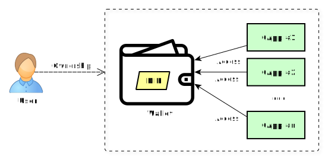
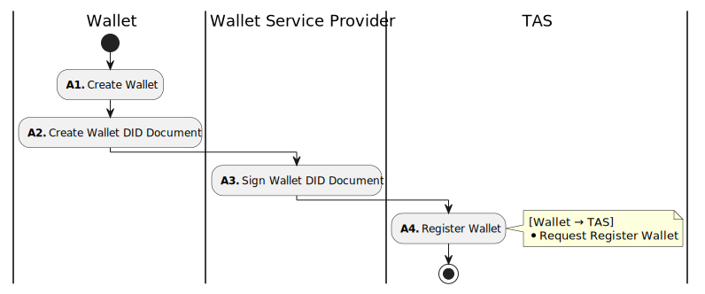
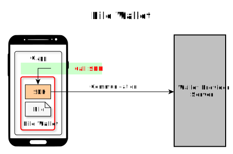
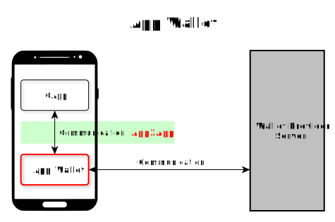
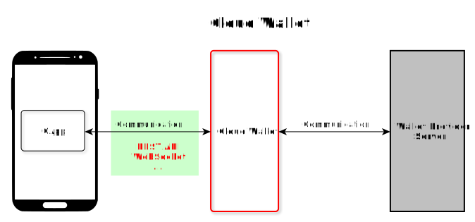
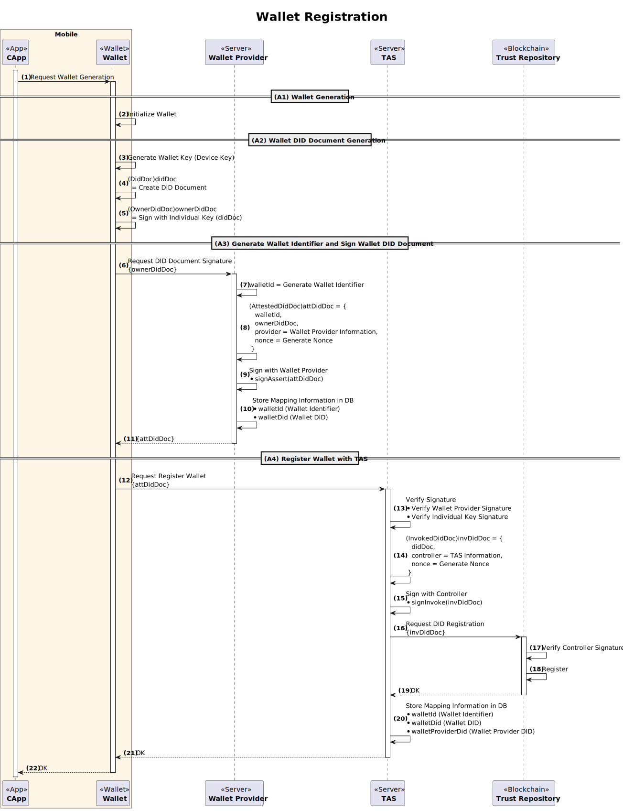
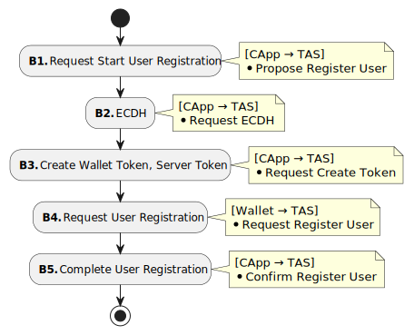
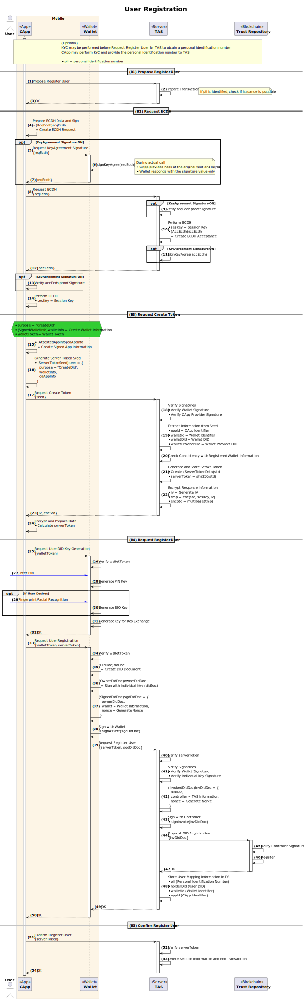

---
puppeteer:
    pdf:
        format: A4
        displayHeaderFooter: true
        landscape: false
        scale: 0.8
        margin:
            top: 1.2cm
            right: 1cm
            bottom: 1cm
            left: 1cm
    image:
        quality: 100
        fullPage: false
---

User Registration
==

- Subject: Explanation of the concept of user registration
- Author: OpenSource Development Team
- Date: 2024-10-18
- Version: v1.0.0

| Version | Date       | Changes         |
| ------- | ---------- | --------------- |
| v1.0.0  | 2024-10-18 | Initial version |

<br>

Table of Contents
---

<!-- TOC tocDepth:2..4 chapterDepth:2..6 -->

- [1. Overview](#1-overview)
    - [1.1. Reference Documents](#11-reference-documents)
- [2. General Matters](#2-general-matters)
    - [2.1. Data Types and Constants](#21-data-types-and-constants)
    - [2.2. DID Policy](#22-did-policy)
      - [2.2.1. Examples of DID Policy](#221-examples-of-did-policy)
- [3. Wallet Registration Procedures](#3-wallet-registration-procedures)
    - [3.1. Types of Wallets](#31-types-of-wallets)
      - [3.1.1. File Wallet](#311-file-wallet)
      - [3.1.2. App Wallet](#312-app-wallet)
      - [3.1.3. Cloud Wallet](#313-cloud-wallet)
    - [3.2. Wallet Functions](#32-wallet-functions)
    - [3.3. Detailed Procedures](#33-detailed-procedures)
- [4. User Registration Procedures](#4-user-registration-procedures)
    - [4.1. Detailed Procedures](#41-detailed-procedures)

<!-- /TOC -->


<div style="page-break-after: always;"></div>

## 1. Overview

This document explains the overall concept of user registration in OpenDID.
The user registration procedure is as follows:

1. (A) Wallet Registration Procedure
    - (A1) Create Wallet
    - (A2) Create Wallet DID Document
    - (A3) Generate Wallet Identifier and Sign Wallet DID Document
    - (A4) Register Wallet in TAS - Request Register Wallet
1. (B) User Registration Procedure
    - (B1) Request start of user registration - `[API] Propose Register User`
    - (B2) ECDH (Establish Secure Session) - `[API] Request ECDH`
    - (B3) Create wallet token, server token - `[API] Request Create Token`
    - (B4) Request user registration - `[API] Request Register User`
    - (B5) Confirm user registration - `[API] Confirm Register User`

### 1.1. Reference Documents

| Reference Name   | Document Name                              | Location |
| ---------------- | ------------------------------------------- | -------- |
| [OSD]            | OpenDID Schema Definition Language          |          |
| [DATA-SPEC]      | (OpenDID) Data Specification                |          |
| [DIDDOC-FORMAT]  | (OpenDID) DID Document format               |          |


<div style="page-break-after: always;"></div>

## 2. General Matters

### 2.1. Data Types and Constants

Items not defined here refer to `[DATA-SPEC]`.

```c#
def enum WALLET_TYPE: "wallet type"
{
    "FileWallet", "AppWallet", "CloudWallet"
}

def object DidDoc: "DID Document"
{
    //---------------------------------------------------------------------------
    // Meta
    //---------------------------------------------------------------------------
    + array(url)   "@context"   : "JSON-LD context", value(["https://www.w3.org/ns/did/v1"])
    + did          "id"         : "DID owner's did"
    + did          "controller" : "DID controller's did"
    + utcDatetime  "created"    : "created datetime"
    + utcDatetime  "updated"    : "last updated datetime"
    + didVersionId "versionId"  : "DID version id"
    + bool         "deactivated": "true: deactivated, false: activated", default(false)

    //---------------------------------------------------------------------------
    // DID key list
    //---------------------------------------------------------------------------
    + array(object) "verificationMethod": "list of DID keys with public key values", min_count(1)
    {
        + didKeyId     "id"                : "key id. ex: 'pin'"
        + DID_KEY_TYPE "type"              : "key type"
        + did          "controller"        : "key controller's did"
        + multibase    "publicKeyMultibase": "public key value"
        //--- Non-standard fields ---
        + AUTH_TYPE    "authType"          : "required authentication to use the key"
    }

    // Lists of keys by purpose
    // - All 'didKeyId' must be declared in '~/verificationMethod[]/id'
    - array(didKeyId) "assertionMethod"     : "list of assertion key names", emptiable(false)
    - array(didKeyId) "authentication"      : "list of authentication key names", emptiable(false)
    - array(didKeyId) "keyAgreement"        : "list of key agreement key names", emptiable(false)
    - array(didKeyId) "capabilityInvocation": "list of capability invocation key names", emptiable(false)
    - array(didKeyId) "capabilityDelegation": "list of capability delegation key names", emptiable(false)

    //---------------------------------------------------------------------------
    // Service endpoint
    //---------------------------------------------------------------------------
    - array(object) "service": "list of services", min_count(1)
    {
        + didServiceId     "id"             : "service id"  // ex: "homepage"
        + DID_SERVICE_TYPE "type"           : "service type"
        + array(url)       "serviceEndpoint": "list of service URLs", min_count(1)
    }
}

def object OwnerDidDoc: "DID Document with the owner proofs"
{
    @spread(DidDoc)  // Includes all members from the DidDoc object to avoid redundancy

    //---------------------------------------------------------------------------
    // Proof - Non-standard fields
    //---------------------------------------------------------------------------
    // Required only when the DID owner requests registration/modification with the controller
    + select(1)
    {
        // when the number of keys = 1
        ^ Proof        "proof" : "owner proof"
        // when the number of keys >= 2
        ^ array(Proof) "proofs": "list of owner proofs", min_count(2)
    }
}

def object AttestedDidDoc: "Provider attested DID Document - Attestation signature attached"
{
    + walletId  "walletId"   : "wallet id"
    + multibase "ownerDidDoc": "multibase(OwnerDidDoc)"
    + Provider  "provider"   : "provider information"
    + multibase "nonce"      : "provider nonce", byte_length(16)
    // Proof from the provider managing the device or user that will use the DID Document
    + AssertProof "proof"    : "provider's attestation proof"
}

def object SignedDidDoc: "Wallet signed DID Document - Wallet signature attached"
{
    + multibase "ownerDidDoc": "multibase(OwnerDidDoc)"
    + object    "wallet"     : "wallet information"
    {
        + walletId "id" : "wallet id"
        + did      "did": "wallet DID"
    }
    + multibase   "nonce": "wallet nonce", byte_length(16)
    + AssertProof "proof": "wallet proof - wallet signature"
}

def object InvokedDidDoc: "Controller signed DID Document - Invocation signature attached"
{
    + multibase   "didDoc"    : "multibase(DidDoc)"
    + Provider    "controller": "controller information"
    + multibase   "nonce"     : "controller nonce", byte_length(16)
    + InvokeProof "proof"     : "controller's invocation proof"
}
```

### 2.2. DID Policy

The decision on what constraints to apply regarding DID is called the "DID Policy."
The wallet registration and user registration procedures are directly affected by these DID policies,
so it is necessary to clearly define and understand the DID policies.

The items of the DID policy are as follows:

- Public DID Policy
    - Real Name: The individual can be _identified_ by the DID value
    - Anonymous: The individual cannot be _identified_ by the DID value
- One Person One-DID Policy
    - Only one active DID is allowed per individual identified by identity verification
    - When a new DID is created, all existing DIDs and VCs are automatically revoked
- One Person One-Wallet Policy
    - Only one wallet is allowed per individual even if multiple CApps are permitted
    - Need to determine if multiple devices can access the cloud wallet
    - Need to determine if multiple CApps can access the app wallet
- One Person One-Device (CApp) Policy
    - Only one device (or CApp) is allowed per individual
    - Reinstalling the CApp will automatically revoke or invalidate all existing DIDs and VCs
- Others

#### 2.2.1. Examples of DID Policy

Below is a table of DID policies established by a certain domain.

| Category | Policy  | Identifier Type | Description                       |
| -------- | ------- | --------------- | --------------------------------- |
| Public   | Real Name |               | Individual identified by DID value |
| DID      | One-DID  | `did`          | Only one DID allowed per person   |
| Wallet   | One-Wallet | `walletId`   | Only one wallet allowed per person |
| CApp     | Multiple-CApp | `appId`   | Multiple CApps can be used        |

Since the "One-DID" and "One-Wallet" policies apply per person, only one DID can be created in one wallet.
This means that neither multiple wallets can be created nor multiple DIDs can be created in one wallet.
However, with the "Multiple-CApp" policy, multiple CApps can access and use one wallet.
If a file wallet is used, it is effectively the same as "One-CApp."



<div style="page-break-after: always;"></div>

## 3. Wallet Registration Procedures

The wallet registration procedure is shown in the figure below.



### 3.1. Types of Wallets

The types of wallets and their current standard adoption status are as follows.

| Type                           | Description                                    | Standard |
| ------------------------------ | ---------------------------------------------- | :------: |
| File Wallet     | Exists as a file and SDK within the CApp       |    Y     |
| App Wallet        | Exists as a separate app on the mobile device  |    N     |
| Cloud Wallet| Exists as an online service                    |    N     |

#### 3.1.1. File Wallet

A File Wallet is a wallet that is used by calling an SDK obtained from the wallet provider within the CApp.
Since the wallet exists within the CApp, only one CApp can access the wallet.
In other words, multiple CApps cannot share the wallet and it can only be used exclusively.

The regulations on communication between the SDK and the wallet provider's server are beyond the scope of this document.



#### 3.1.2. App Wallet

An App Wallet is a wallet installed as an app on the same mobile device where the CApp is installed.
The CApp and the App Wallet communicate via App2App method, and the specific method for this is currently undecided.
Multiple CApps can share one App Wallet.



**■ Considerations**

- Can the App Wallet installed on another device be accessed?
- When multiple CApps share:
    - Can a VC issued by one CApp be accessed by another CApp?
    - Is it necessary to lock/unlock the wallet per CApp?
- Is backup/recovery of the App Wallet possible?

#### 3.1.3. Cloud Wallet

A Cloud Wallet is a wallet provided by the wallet provider in the form of an online service.
Since it exists online, it must inherently provide backup/recovery functionality.
The method of communication between the CApp and the Cloud Wallet is currently undecided as it is not yet adopted as a standard.



**■ Considerations**

- What are the authentication methods for access from the CApp?
- What are the user authentication methods for backup/recovery?
- How is the security of communication data between the CApp and the Wallet ensured?
- When multiple CApps share:
    - Can a VC issued by one CApp be accessed by another CApp?
    - Is it necessary to lock/unlock the wallet per CApp?

### 3.2. Wallet Functions

Regardless of the type, wallets must provide the following functions.

1. Hold its own DID and register it in the Trust Repository
    - The wallet provider guarantees the authenticity of the wallet DID Document
1. User DID Document related functions
    - Request for new creation and registration
    - Request for change and registration: key replacement, service addition, etc.
    - Request for revocation/termination
1. Secure storage of all keys
    - Store wallet keys and user keys in a secure area
    - Utilize the secure area provided by the operating system
1. Separation of wallet keys and user keys
    - Wallet keys and user keys must be conceptually separated (even if physically stored in the same location)
    - The access paths for key generation and use must differ by type (refer to authentication methods below)
1. Key usage compliance with authentication methods
    - User keys can be used after user authentication according to the specified authentication method at the time of generation
    - Wallet keys can be used after wallet token authentication and any other authentication specified by the wallet
1. Wallet token generation/verification
    - Determine if the current state of the wallet can accommodate the purpose requested by the CApp
    - Generate a wallet token that can identify the purpose requested by the CApp
    - Verify if the wallet token submitted can perform the requested function by the CApp
    - Manage to ensure only one wallet token exists at a time
1. VC related functions
    - Request VC issuance from TAS and securely store the issued VC in the wallet
    - Provide the VC to the CApp after appropriate wallet token verification
1. VP related functions
    - Generate and encrypt the VP after appropriate wallet token verification (submission is performed by the CApp)

### 3.3. Detailed Procedures



<div style="page-break-after: always;"></div>

## 4. User Registration Procedures

The user registration procedure is shown in the figure below.



The omitted part in the above procedure is the KYC (Know Your Customer) process.
The method and timing of performing KYC may vary depending on the DID policy or the KYC performing entity.

### 4.1. Detailed Procedures

