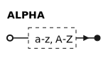
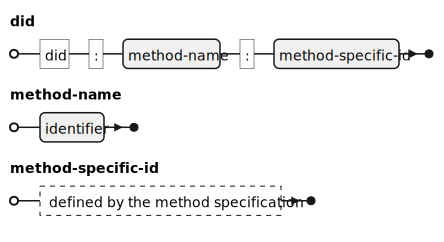
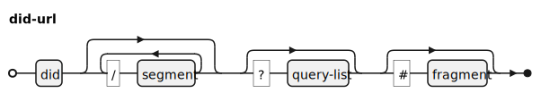
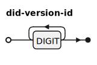
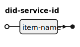
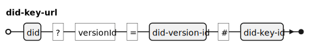
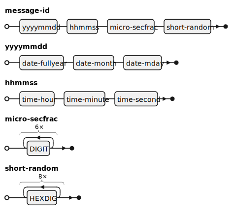
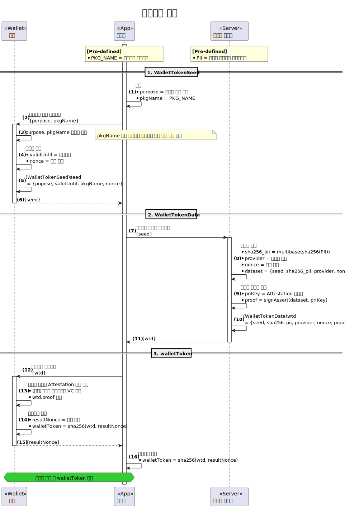
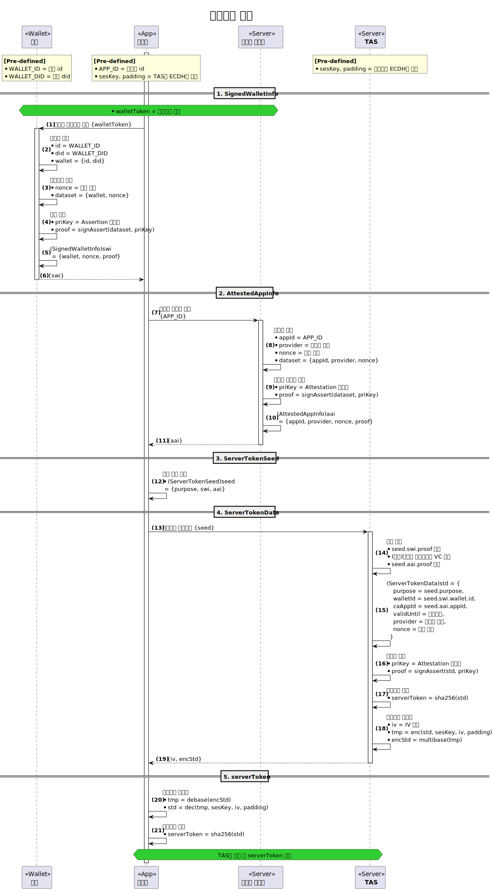

---
puppeteer:
    pdf:
        format: A4
        displayHeaderFooter: true
        landscape: false
        scale: 0.8
        margin:
            top: 1.2cm
            right: 1cm
            bottom: 1cm
            left: 1cm
    image:
        quality: 100
        fullPage: false
---

데이터 명세서 (Data Specification)
==

- 주제: 주요 데이터의 구조 및 요건
- 작성: 강영호
- 일자: 2024-09-03
- 버전: v1.0.0

| 버전   | 일자       | 변경 내용 |
| ------ | ---------- | --------- |
| v1.0.0 | 2024-09-03 | 초기 작성 |


<div style="page-break-after: always;"></div>

목차
---

<!-- TOC tocDepth:2..3 chapterDepth:2..6 -->

- [1. 개요](#1-개요)
    - [1.1. 표기법](#11-표기법)
- [2. 데이터 타입](#2-데이터-타입)
    - [2.1. General](#21-general)
    - [2.2. DID Document](#22-did-document)
    - [2.3. VC, VP](#23-vc-vp)
    - [2.4. OpenDID Implementation](#24-opendid-implementation)
- [3. 상수](#3-상수)
    - [3.1. General](#31-general)
    - [3.2. DID Document](#32-did-document)
    - [3.3. VC, VP](#33-vc-vp)
    - [3.4. Profile](#34-profile)
    - [3.5. OpenDID Implementation](#35-opendid-implementation)
- [4. 데이터 구조](#4-데이터-구조)
    - [4.1. General](#41-general)
    - [4.2. DID Document](#42-did-document)
    - [4.3. VC Schema](#43-vc-schema)
    - [4.4. VC, VP](#44-vc-vp)
    - [4.5. Profile](#45-profile)
    - [4.6. OpenDID Implementation](#46-opendid-implementation)

<!-- /TOC -->


<div style="page-break-after: always;"></div>

## 1. 개요

본 문서는 OpenDID의 여러 엔티티가 공통으로 사용하는 아래와 같은 주요 데이터에 대하여 정의한다.

- 주요 데이터 타입: UTC datetime, mulibase 등
- DID Document, VC Schema, VC, VP, Profile 등 표준문서 구조
- API 명세서에서 공용으로 사용하는 데이터 구조
- Wallet Token(월렛토큰), Server Token(서버토큰) 등 특수한 자료의 구조

DID Document, VC, VP format 등 핵심적인 데이터는 별도의 문서로 상세하게 설명한다.
본 문서와 개별 문서의 내용이 상이한 경우에는 본 문서를 기준으로 한다.

### 1.1. 표기법

#### 1.1.1. OSD

데이터 타입이나 데이터 구조를 정의하기 위해 OSD (OpenDID Schema Definition Language)
문법을 사용한다.

#### 1.1.2. EBNF Diagram

데이터 타입 등의 구성을 구체적으로 표현하기 위해 EBNF(Extended Backus-Naur Form)
형식을 그림으로 변환하여 직관적으로 이해하기 쉽도록 구성하였다.

아래는 본문에서 사용한 terminal과 non-terminal을 정의하였다.

**■ Terminal**




<div style="page-break-after: always;"></div>

## 2. 데이터 타입

본 장은 OpenDID에서 공통으로 사용하는 데이터 타입을 정의한다.

```c#
// General
def string identifier   : "identifier", regex(/[a-zA-Z_][0-9a-zA-Z_]*?/)
def string itemName     : "item name", regex(/[0-9a-zA-Z_\-\.]+/)
def string uuid         : "UUID"
def string utcDatetime  : "UTC datetime"
def string multibase    : "Multibase"
def string url          : "URL"
def string namespaceId  : "namespace id"
def string personId     : "PII - Personally Identifiable Information"

// DID Document
def string did          : "DID id. ex: 'did:omn:12345678abcdefg'"
def string didUrl       : "DID URL"
def string didVersionId : "DID version id. ex: '1', '2'", regex(/[0-9]+/)
def string didKeyId     : "DID key id"
def string didServiceId : "DID service id"
def string didKeyUrl    : "DID key URL"
def string didServiceUrl: "DID service URL"

// VC, VP, Profile
def string vcId      : "VC id"
def string vpId      : "VP id"
def string claimCode : "Claim code"
def string vcAttachId: "VC attachment id"
def string vcDigest  : "W3C subresource integrity"

// OpenDID Implementation
def string messageId       : "Message id"
def string errorCode       : "Error code"
def string appId           : "Client application id", length(20)
def string walletServiceId : "Wallet service id"
def string walletId        : "Wallet id", length(20)
def string refId           : "Reference id", length(20)
def string vcPlanId        : "VC plan id", length(20)
```

### 2.1. General

#### 2.1.1. identifier

Java 언어의 변수명과 같은 식별자 이름이다.
알파벳 대소문자, 숫자, 언더바로만 구성되며, 첫 글자는 숫자로 시작할 수 없다.


[예시]

- "reqMsg123"
- "_res"
- "attach_ref_num"

#### 2.1.2. itemName

`itemName`은 `identifer`와 비슷한 용도로 사용되지만 허용하는 문자의 범위가 더 넓다.
첫 글자 상관없이 아래와 같은 종류의 문자로 구성된다.

- 알파벳 대소문자
- 숫자
- 언더바("_")
- 대시("-")
- 점(".")


[예시]

- "userDid"
- "DAT_ISSUE_PROFILE"
- "a.b.c.d.1"
- "010-1234-5678"

#### 2.1.3. uuid

UUID(Universally Unique Identifier)는 소프트웨어 구축에 쓰이는 식별자 표준으로,
개방 소프트웨어 재단(OSF)이 분산 컴퓨팅 환경(DCE)의 일부로 표준화하였다.
고유한 식별자를 만들기 위해 사용하며 OpenDID 프로젝트에서는 다음과 같은 용도로 사용할 수 있다.

- 인가앱, 월렛 등 장치 식별자
- 트랜잭션을 식별하기 위한 거래코드
- 메시지 식별자
- 기타 다른 것과 구분이 필요하여 특정 항목에 이름을 부여하는 경우


[예시]

- "44b70956-cd24-11ed-afa1-0242ac120002"
- "6dcdde42-c0d9-4f79-82fb-128a94ce709b"
- "7148d5c1-31a1-4ecd-87f9-b7b533b80692"


#### 2.1.4. utcDatetime

UTC(Coordinated Universal Time)는 세계협정시라고 하며, 전세계가 공통의 시간을 유지할 수 있도록 동기화된 과학적 시간의 표준이다.
시간값 뒤에 시간대를 표시하여 전세계 어디서나 동일한 시간을 표현할 수 있다.

시간대는 `+09:00`와 같이 `+` 기호로 표현할 수 있으며, `Z`는 `+00:00`을 의미한다.
시간대가 없는 것은 로컬 시간을 의미한다.


[예시]

- "2021-07-19T17:40:00Z"
- "2021-07-19T17:40:00.000Z"
- "2021-07-19T17:40:00+09:00"


#### 2.1.5. multibase

Multibase는 데이터의 인코딩 방식을 표준화하는 기술로, 이진 데이터를 텍스트로 변환하는 과정에서 사용된다.
예를 들어, base16은 16진수를 기반으로 데이터를 표현하고, base58btc는 Bitcoin 주소와 같은 문자열을 만들 때 사용된다.
Multibase는 각 인코딩 방식을 구분하고 지원하기 위해 아래 표와 같이 각 방식에 접두사를 부여한다.

|  Encoding   | Prefix |    Description     |
| ----------- | :----: | ------------------ |
| base16      |   f    | hexadecimal        |
| base16upper |   F    | hexadecimal        |
| base58btc   |   z    | base58 bitcoin     |
| base64      |   m    | rfc4648 no padding |
| base64url   |   u    | rfc4648 no padding |


[예시]

```
"f4d756c74696261736520697320617765736f6d6521205c6f2f" # f base16
"F4D756C74696261736520697320617765736F6D6521205C6F2F" # F base16upper
"zYAjKoNbau5KiqmHPmSxYCvn66dA1vLmwbt"                 # z base58btc
"mVGhlIHFBvdmVyIDEzIGxhenkgZG9ncy4="                  # m base64
"uaHR0cHM6Ly9rby53aWtpcGVkaWEub3Jn"                   # u base64url
```

#### 2.1.6. url

URL(Uniform Resource Locator)은 인터넷 상 위치한 자원에 접근하기 위한 주소이다.

[예시]

- http://example.com/user/12345

#### 2.1.7. namespaceId

Namespace는 이름의 논리적 그룹이다.
여기서는 내용에 대한 규칙은 별도의 정하지 않고 형식만 정의한다.


[예시]

- "org.iso.18013.5"
- "org.opendid.v1"
- "kr.ac.myschoool.v1"

#### 2.1.8. personId

`personId`는 사용자인 사람을 식별하기 위한 식별자로서 각 국가나 지역마다 서로 다르다.
대한민국의 경우 CI (Connected Information)라는 이름의 HMAC 해시값을 사용한다.

본 문서에서는 `personId`의 형태에 대해 명시하지 않으나 다음의 제약조건에 대해서 정의한다.

- (고유성) 자연인을 식별할 수 있는 고유한 식별자이어야 한다.
- (가변성) 한 사람이 일생동안 단 하나의 식별자만 가지는 것은 아니다.
- (조합성) 이름, 사회보장번호 등 여러 개의 식별자를 하나로 조합하여 생성할 수도 있다.

[예시]

- 대한민국: "wEi9oYSuekQGxT9MV4rKHG4CO+Zrp+onhLIIuembI8jx/0PLF5Ne3oMBxvUFlN4UmsgjeNErZfmpCVUFHsv8nq=="


### 2.2. DID Document

DID Document와 관련한 데이터 타입은 "DID Document format" 문서에 선언된 것을 여기에 취합하였다.
상세한 용례는 상기 문서를 참조한다.

#### 2.2.1. did

`did`는 DID의 id 문자열이다.



[예시]

- "did:omn:userid1234"
- "did:example:abcdefg1234567890"

#### 2.2.2. didUrl

자세한 내용은 https://www.w3.org/TR/did-core/#did-url-syntax 참조.
<br>(반복 가능한 복잡한 부분은 이해를 위해 생략함)



[예시]

- "did:example:123456/path"
- "did:example:123456?versionId=1"
- "did:example:123456#public-key-0"

#### 2.2.3. didVersionId

DID Document의 `versionId`에만 사용되는 값으로, "1"부터 시작하는 십진수 문자열이다.
`versionId`는 DID Document 포맷 버전이 아닌 개별 문서의 변경이력을 관리하기 위한 버전이다.



#### 2.2.4. didKeyId

`didKeyId`는 DID Document 내에서 키를 식별하는 이름이다.


[예시]

- "pin"
- "assert"

#### 2.2.5. didServiceId

`didServiceId`는 DID Document 내에서 서비스를 식별하는 이름이다.



- "homepage"
- "certificate-vc"

#### 2.2.6. didKeyUrl

`didKeyUrl`은 DID key locator이다.
`did`, `versionId` 및 `didKeyId`를 결합하여 이전 버전의 키까지도 유일하게 식별할 수 있다.



- `versionId` 지정하여 어떤 버전의 키인지 명시

[예시]

- "did:example:123456?versionId=2#pin"

#### 2.2.7. didServiceUrl

`didServiceUrl`은 DID service locator이다.
`did`, `versionId` 및 `didServiceId`를 결합하여 이전 버전의 서비스까지도 유일하게 식별할 수 있다.


- `versionId` 지정하여 어떤 버전의 서비스인지 명시

[예시]

- "did:example:123456?versionId=2#homepage"

### 2.3. VC, VP

VC와 관련한 데이터 타입은 "VC format" 문서에 선언된 것을 여기에 취합하였다.
상세한 용례는 상기 문서를 참조한다.

#### 2.3.1. vcId

개별 VC 문서를 식별하기 위한 식별자로 UUID 형식을 사용한다.

#### 2.3.2. vpId

개별 VP 문서를 식별하기 위한 식별자로 UUID 형식을 사용한다.

#### 2.3.3. claimCode

Namespace와 클레임 이름을 합한 클레임 식별자이다.

[예시]

- "org.iso.18013.5.1.family_name"
- "org.opendid.v1.pii"
- "just_claim_name" (default namespace)


#### 2.3.4. vcAttachId

첨부파일의 항목을 식별하기 위한 식별자이다.

#### 2.3.5. vcDigest

W3C에서 정의한 subresource integrity로서 해시 알고리즘과 해시값으로 구성된다.

- 형식: "`{hashAlgorithm}`-`{hashBase64}`"
    - `{hashAlgorithm}`: "sha384", "sha512"
    - `{hashBase64}`: Base64로 인코딩한 해시값

[예시]

- "sha384-PVLvPvchRHSzXhxkQu6GhGYwlJhTf2JV7tuviGmRlFEJP14GXBQd08OeVhC0Y5TA"

### 2.4. OpenDID Implementation

#### 2.4.1. messageId

`messageId`는 API 요청문 전송 시 클라이언트가 생성하는 메시지 식별자이다.
디버깅, 문의대응 등의 용도로 개발자간 특정 메시지를 식별하는 것이 주목적이다.
아래 규칙은 권고사항이며 반드시 따라야 하는 것은 아니다.
그러나 권고사항을 따르지 않을 때는 `messageId`가 중복되지 않도록 클라이언트 별 자체 규칙을 적용하여야 한다.

`messageId`는 다음의 규칙을 따른다.

> 일자(8자리) + 시간(6자리) + 마이크로초(6자리) + 랜덤16진수(8자리)

공백이나 기호는 모두 제외하고 숫자로만 구성한다.
시간은 전세계 어디서나 동일한 시간을 사용해야 하므로 UTC+0를 사용한다.



[예시]

- "202303241738241234561234ABCD"
- "2023113001001156789088888888"
- "2023121900000122222233333333"


#### 2.4.2. errorCode

API 요청 처리 중 오류 발생 시 미리 정의된 오류코드를 응답한다.
상세한 오류코드 규칙은 별도의 문서를 참조한다.


#### 2.4.3. appId

인가앱 등 모바일 앱을 식별하기 위한 고유 식별자이다.
특정 인가앱이 사용되는 동안 타 인가앱과 `appId`가 중복되지 않아야 하며,
생성규칙은 인가앱 사업자가 정의한다.

구성은 `identifier`와 동일하나 길이가 20자로 제한된다.
`appId`임을 쉽게 구별하기 위해 "AID"와 같은 prefix를 첨부하는 것을 추천한다.

[예시]

- "AID202405tH7zLC1vJaobi"

#### 2.4.4. walletServiceId

월렛 종류별 구현체를 식별하기 위한 고유 식별자이다.
월렛 사업자는 월렛 서비스를 구현한 후 목록 사업자에 이를 등록하여야 하며,
해당 월렛 서비스를 이용할 수 있는 인가앱의 목록도 등록하여야 한다.
월렛 서비스 등록 시 목록 사업자가 `walletServiceId` 타입의 식별자를 할당한다.

생성규칙은 목록 사업자가 정의하며, 별도의 제약조건은 본 문서에서 정의하지 않는다.

#### 2.4.5. walletId

모바일 월렛을 식별하기 위한 고유 식별자이다.
특정 월렛이 사용되는 동안 타 월렛과 `walletId`가 중복되지 않아야 하며,
생성규칙은 월렛 사업자가 정의한다.

구성은 `identifier`와 동일하나 길이가 20자로 제한된다.
`walletId`임을 쉽게 구별하기 위해 "WID"와 같은 prefix를 첨부하는 것을 추천한다.

[예시]

- "WID202405RcM2sq3oztWqt"

#### 2.4.6. refId

TAS 및 발급 사업자가 발급하는 참조번호로서 발급을 수행하는 특정 시점에 발급
트랜잭션을 유일하게 식별하기 위한 식별자로 사용된다.
생성규칙은 TAS 및 발급 사업자가 정의한다.

구성은 `identifier`와 동일하나 길이가 20자로 제한된다.
`refId`임을 쉽게 구별하기 위해 "RID"와 같은 prefix를 첨부하는 것을 추천한다.

[예시]

- "RID202405qNVgiWgtPLRQ5"

#### 2.4.7. vcPlanId

VC Plan을 식별하기 위한 고유 식별자이다.
특정 VC Plan이 사용되는 동안 타 VC Plan과 중복되지 않아야 하며,
생성 규칙은 목록 사업자가 정의한다.

구성은 `identifier`와 동일하나 길이가 20자로 제한된다.
`vcPlanId`임을 쉽게 구별하기 위해 "VPI"와 같은 prefix를 첨부하는 것을 추천한다.

[예시]

- "VPI202405RcM2sq3oztWqt"


<div style="page-break-after: always;"></div>

## 3. 상수

### 3.1. General

```c#
def enum ENCODING: "character encoding"
{
    "UTF-8", // ... 
}

def enum LANGUAGE: "언어 코드"
{
    "ko", "en", "fr", "jp", // ...
}

def enum LOGO_IMAGE_TYPE: "logo image type"
{
    "jpg", "png"
}
```

### 3.2. DID Document

```c#
def enum AUTH_TYPE: "인증수단"
{
    1: "Free - 무인증",
    2: "PIN - 비밀번호 인증",
    4: "BIO - 생체인증",
}

def enum DID_KEY_TYPE: "DID key type"
{
    "RsaVerificationKey2018",
    "Secp256k1VerificationKey2018",
    "Secp256r1VerificationKey2018",
}

def enum DID_SERVICE_TYPE: "service type"
{
    "LinkedDomains"     : "site URL",
    "CredentialRegistry": "URL to query verifiable credentials",
}
```

### 3.3. VC, VP

```c#
def enum VC_TYPE: "VC 타입"
{
    "VerifiableCredential": "VC",
    "CertificateVC"       : "TAS가 발급하는 가입증명서 VC",
}

def enum VP_TYPE: "VP 타입"
{
    "VerifiablePresentation": "VP",
}

def enum CLAIM_TYPE: "클레임 타입"
{
    "text", "image", "document",
}

def enum CLAIM_FORMAT: "클레임 포맷"
{
    // text
    "plain", "html", "xml", "csv",
    
    // image
    "png", "jpg", "gif",
    
    // document
    "txt", "pdf", "word",
}

def enum LOCATION: "클레임 원본 데이터 위치"
{
    "inline": "VC 내 'value'에 값 포함",
    "remote": "외부 링크 URL",
    "attach": "별도의 첨부파일",
}

def enum PROOF_TYPE: "proof type"
{
    "RsaSignature2018",
    "Secp256k1Signature2018",
    "Secp256r1Signature2018",
}

def enum PROOF_PURPOSE: "proof purpose"
{
    "assertionMethod",
    "authentication",
    "keyAgreement",
    "capabilityInvocation",
    "capabilityDelegation",
}

def enum PRESENCE: "evidence presence"
{
    "Physical": "인쇄본 서류와 같은 물리적 증거",
    "Digital" : "전자적으로 읽기 및 검증이 가능한 디지털 증거 ",
}

def enum EVIDENCE_TYPE: "evidence type"
{
    "DocumentVerification": "서류 검증",
}

def enum CREDENTIAL_SCHEMA_TYPE: "credential schema type"
{
    "OsdSchemaCredential": "OSD VC Schema",
}
```

### 3.4. Profile

```c#
def enum PROFILE_TYPE: "profile type"
{
    "IssueProfile" : "발급 요청 정보",
    "VerifyProfile": "검증 요청 정보",
}

def enum OFFER_TYPE: "offer type"
{
    "IssueOffer"     : "발급 오퍼 정보",
    "VerifyOffer"    : "제출 오퍼 정보",
    "RestoreDidOffer": "DID 복구 오퍼 정보",
}

def enum PRESENT_MODE: "VP 제출 모드"
{
    "Direct"  : "direct mode",
    "Indirect": "indirect mode",
    "Proxy"   : "proxy mode",    // 현재 미지원
}
```

### 3.5. OpenDID Implementation

OpenDID 구현 상 필요한 상수이다.

```c#
def enum ROLE_TYPE: "role type"
{
    "Tas"                 : "TAS",
    "Wallet"              : "월렛",
    "Issuer"              : "발급 사업자",
    "Verifier"            : "검증 사업자",
    "WalletProvider"      : "월렛 사업자",
    "AppProvider"         : "인가앱 사업자",
    "ListProvider"        : "목록 사업자",
    "OpProvider"          : "OP 사업자",
    "KycProvider"         : "KYC 사업자",
    "NotificationProvider": "알림 사업자",
    "LogProvider"         : "로그 사업자",
    "PortalProvider"      : "포털 사업자",
    "DelegationProvider"  : "위임 사업자",
    "StorageProvider"     : "저장소 사업자",
    "BackupProvider"      : "백업 사업자",
    "Etc"                 : "기타 사업자",
}

def enum ECC_CURVE_TYPE: "ECC curve type"
{
    "Secp256k1",
    "Secp256r1",
}

def enum SYMMETRIC_CIPHER_TYPE: "symmetric cipher type"
{
    "AES-128-CBC",
    "AES-128-ECB",
    "AES-256-CBC",
    "AES-256-ECB",
}

def enum SYMMETRIC_PADDING_TYPE: "symmetric padding type"
{
    "NOPAD",
    "PKCS5",
}

def enum VERIFY_AUTH_TYPE: "(u4)제출용 인증수단"
{
    0x00000000: "인증수단 제한없음",
    0x00000001: "무인증",
    0x00000002: "PIN",
    0x00000004: "BIO",
    0x00000006: "PIN or BIO",
    0x00008006: "PIN and BIO,
}

def enum VC_STATUS: "생애주기 - VC상태"
{
    "ACTIVE"  : "정상",
    "INACTIVE": "중지",
    "REVOKED" : "폐기",
}

def enum DIDDOC_STATUS: "생애주기 - DID Document 상태"
{
    "ACTIVATED"  : "활성",
    "DEACTIVATED": "비활성",
    "REVOKED"    : "폐기",
    "TERMINATED" : "말소",
}

def enum WALLET_TOKEN_PURPOSE: "wallet token purpose"
{
    1: "Personalize - 개인화",
    2: "Depersonalize - 비개인화",
    3: "PersonalizeAndConfigLock - 개인화 + 월렛잠금 설정(PIN/BIO)",
    4: "ConfigLock - 월렛잠금 설정(PIN/BIO)",
    
    5: "CreateDid - DID 발급",
    6: "UpdateDid - DID 갱신",
    7: "RestoreDid - DID 복구",
    8: "IssueVc - VC 발급",
    9: "RevokeVc - VC 폐기",
    10: "PresentVp - VP 제출",

    11: "ListVc - VC 목록 조회",
    12: "DetailVc - VC 상세정보 조회",

    13: "CreateDidAndIssueVc - DID 발급 + VC 발급",
    14: "ListVcAndPresentVp - VC 목록 조회 + VP 제출",
}

def enum SERVER_TOKEN_PURPOSE: "server token purpose"
{
    5: "CreateDid - DID 발급",
    6: "UpdateDid - DID 갱신",
    7: "RestoreDid - DID 복구",
    8: "IssueVc - VC 발급",
    9: "RevokeVc - VC 폐기",
    10: "PresentVp - VP 제출",
    13: "CreateDidAndIssueVc - DID 발급 + VC 발급",
}
```

<div style="page-break-after: always;"></div>

## 4. 데이터 구조

### 4.1. General

#### 4.1.1. Proof(s)

##### 4.1.1.1. Proof

```C#
def object Proof: "general proof"
{    
    + PROOF_TYPE    "type"              : "proof type"
    + utcDatetime   "created"           : "proof 생성 일시"
    + didKeyUrl     "verificationMethod": "proof 서명에 사용한 key URL"
    + PROOF_PURPOSE "proofPurpose"      : "proof purpose"
    + multibase     "proofValue"        : "서명값"
}
```

##### 4.1.1.2. AssertProof

```C#
def object AssertProof: "assertion proof"
{    
    + PROOF_TYPE    "type"              : "proof type"
    + utcDatetime   "created"           : "proof 생성 일시"
    + didKeyUrl     "verificationMethod": "proof 서명에 사용한 key URL"
    + PROOF_PURPOSE "proofPurpose"      : "proof purpose", value("assertionMethod")
    + multibase     "proofValue"        : "서명값"
}
```

##### 4.1.1.3. AuthProof

```C#
def object AuthProof: "authentication proof"
{    
    + PROOF_TYPE    "type"              : "proof type"
    + utcDatetime   "created"           : "proof 생성 일시"
    + didKeyUrl     "verificationMethod": "proof 서명에 사용한 key URL"
    + PROOF_PURPOSE "proofPurpose"      : "proof purpose", value("authentication")
    + multibase     "proofValue"        : "서명값"
}
```

##### 4.1.1.4. KeyAgreeProof

```C#
def object KeyAgreeProof: "key agreement proof"
{    
    + PROOF_TYPE    "type"              : "proof type"
    + utcDatetime   "created"           : "proof 생성 일시"
    + didKeyUrl     "verificationMethod": "proof 서명에 사용한 key URL"
    + PROOF_PURPOSE "proofPurpose"      : "proof purpose", value("keyAgreement")
    + multibase     "proofValue"        : "서명값"
}
```

##### 4.1.1.5. InvokeProof

```C#
def object InvokeProof: "invocation proof"
{    
    + PROOF_TYPE    "type"              : "proof type"
    + utcDatetime   "created"           : "proof 생성 일시"
    + didKeyUrl     "verificationMethod": "proof 서명에 사용한 key URL"
    + PROOF_PURPOSE "proofPurpose"      : "proof purpose", value("capabilityInvocation")
    + multibase     "proofValue"        : "서명값"
}
```

##### 4.1.1.6. DelegateProof

```C#
def object DelegateProof: "delegation proof"
{    
    + PROOF_TYPE    "type"              : "proof type"
    + utcDatetime   "created"           : "proof 생성 일시"
    + didKeyUrl     "verificationMethod": "proof 서명에 사용한 key URL"
    + PROOF_PURPOSE "proofPurpose"      : "proof purpose", value("capabilityDelegation")
    + multibase     "proofValue"        : "서명값"
}
```

#### 4.1.2. Entity

##### 4.1.2.1. Provider

```c#
def object Provider: "provider 정보"
{
    + did "did"      : "provider DID"
    + url "certVcRef": "provider 가입증명서 VC URL"
}
```

##### 4.1.2.2. ProviderDetail

```c#
def object ProviderDetail: "provider 상세 정보"
{
    @spread(Provider)

    + string     "name"       : "provider 이름"
    - string     "description": "provider 설명", default(""), emptiable(true)
    - LogoImage  "logo"       : "provider 로고 이미지"
    - url        "ref"        : "provider 참조정보 URL(홈페이지 등)"
}
```

#### 4.1.3. Etc

```c#
def object LogoImage: "logo image data"
{
    + LOGO_IMAGE_TYPE "format": "image format"
    + select(1)
    {
        ^ url       "link"      : "logo image URL - 이미지를 다운로드할 URL"
        ^ multibase "value"     : "multibase(image) - 이미지 원본의 multibase"
    }
}
```

### 4.2. DID Document

DID Document를 보유하는 주체는 다음과 같다.

- 사업자(Provider): TAS, 발급 사업자, 검증 사업자, 월렛 사업자 등
- 월렛
- 사용자(Holder)

사업자의 DID Document를 생성/등록/변경하는 것은 본 문서의 범위 밖이다.
여기서는 월렛과 사용자의 DID Document와 관련된 데이터 구조에 대하여 설명한다.

**월렛 DID Document 등록 절차**

사용자 월렛의 경우 장치키(Device Key)의 사용방안으로 DID Document를 사용한다.
장치는 스스로를 증명할 수 없으므로 이 장치를 배포하고 운영하는 사업자가 증명을 대신하여야 한다.
그러므로 다음과 같은 절차로 DID Document 등록을 위한 자료를 생성한다.

| 순서 | 장치(월렛)                      | 장치 사업자                               | TAS                                 | 신뢰저장소           |
| :--: | ------------------------------- | ----------------------------------------- | ----------------------------------- | -------------------- |
|  1   | 월렛 DidDoc 생성<br>(키 생성)   |                                           |                                     |                      |
|  2   | OwnerDidDoc 생성<br>(키별 서명) |                                           |                                     |                      |
|  3   |                                 | AttestedDidDoc 생성<br>(OwnerDidDoc 서명) |                                     |                      |
|  4   |                                 |                                           | 사업자 서명 검증                    |                      |
|  5   |                                 |                                           | 키별 서명 검증                      |                      |
|  6   |                                 |                                           | InvokedDidDoc 생성<br>(DidDoc 서명) |                      |
|  7   |                                 |                                           |                                     | Controller 서명 검증 |
|  8   |                                 |                                           |                                     | DidDoc 등록          |

**사용자 DID Document 등록/갱신 절차**

사용자 DID Document는 월렛의 장치키(Device Key)로 서명하여 TAS에게 등록 및 갱신을 요청한다.

| 순서 | 월렛                                       | TAS                                 | 신뢰저장소           |
| :--: | ------------------------------------------ | ----------------------------------- | -------------------- |
|  1   | (등록 시만)사용자 DidDoc 생성<br>(키 생성) |                                     |                      |
|  2   | OwnerDidDoc 생성<br>(키별 서명)            |                                     |                      |
|  3   | SignedDidDoc 생성<br>(OwnerDidDoc 서명)    |                                     |                      |
|  4   |                                            | 월렛 서명 검증                      |                      |
|  5   |                                            | 키별 서명 검증                      |                      |
|  6   |                                            | InvokedDidDoc 생성<br>(DidDoc 서명) |                      |
|  7   |                                            |                                     | Controller 서명 검증 |
|  8   |                                            |                                     | DidDoc 등록/갱신     |

**사용자 DID Document 복구 절차**

사용자 DID Document 복구는 분실 신고에 의해 `DEACTIVATED`로 비활성화된 것을 `ACTIVATED` 상태로 활성화하는 것을 의미한다.
`DidDoc:/~deactivated` 속성만 변경할 때는 `versionId`가 바뀌지 않는다.

| 순서 | 월렛               | TAS                                 | 신뢰저장소           |
| :--: | ------------------ | ----------------------------------- | -------------------- |
|  1   |                    | 인가앱에 RestoreDidOffer 전송       |                      |
|  2   | TAS에 Restore 요청 |                                     |                      |
|  3   |                    | 신뢰저장소에 등록된 DidDoc 조회     |                      |
|  4   |                    | InvokedDidDoc 생성<br>(DidDoc 서명) |                      |
|  5   |                    |                                     | Controller 서명 검증 |
|  6   |                    |                                     | DidDoc 갱신          |

#### 4.2.1. DidDoc

DID Document의 순수 정보만을 포함한 원문의 데이터 구조이다.

```c#
def object DidDoc: "DID Document"
{
    //---------------------------------------------------------------------------
    // Meta
    //---------------------------------------------------------------------------
    + array(url)   "@context"   : "JSON-LD context", value(["https://www.w3.org/ns/did/v1"])
    + did          "id"         : "DID owner's did"
    + did          "controller" : "DID controller's did"
    + utcDatetime  "created"    : "created datetime"
    + utcDatetime  "updated"    : "last updated datetime"
    + didVersionId "versionId"  : "DID version id"
    + bool         "deactivated": "true: deactivated, false: activated", default(false)

    //---------------------------------------------------------------------------
    // DID key list
    //---------------------------------------------------------------------------
    + array(object) "verificationMethod": "list of DID key with public key value", min_count(1)
    {
        + didKeyId     "id"                : "key id. ex: 'pin'"
        + DID_KEY_TYPE "type"              : "key type"
        + did          "controller"        : "key controller's did"
        + multibase    "publicKeyMultibase": "public key value"
        //--- 이하 비표준 항목 ---
        + AUTH_TYPE    "authType"          : "required authentication to use the key"
    }

    // 용도별 키 목록
    // - 모든 'didKeyId'는 '~/verificationMethod[]/id'에 선언되어 있어야 함
    - array(didKeyId) "assertionMethod"     : "list of Assertion key name", emptiable(false)
    - array(didKeyId) "authentication"      : "list of Authentication key name", emptiable(false)
    - array(didKeyId) "keyAgreement"        : "list of Key Agreement key name", emptiable(false)
    - array(didKeyId) "capabilityInvocation": "list of Capability Invocation key name", emptiable(false)
    - array(didKeyId) "capabilityDelegation": "list of Capability Delegation key name", emptiable(false)

    //---------------------------------------------------------------------------
    // Service endpoint
    //---------------------------------------------------------------------------
    - array(object) "service": "list of service", min_count(1)
    {
        + didServiceId     "id"             : "service id"  // ex: "homepage"
        + DID_SERVICE_TYPE "type"           : "service type"
        + array(url)       "serviceEndpoint": "list of URL to the service", min_count(1)
    }
}
```

#### 4.2.2. OwnerDidDoc

`DidDoc`에 소유자 키 서명을 추가한 것이다.

```c#
def object OwnerDidDoc: "DID Document with the owner proofs"
{
    @spread(DidDoc)  // DidDoc 객체 내 모든 멤버를 포함하라는 의미 (중복선언 방지)

    //---------------------------------------------------------------------------
    // Proof - 비표준 항목
    //---------------------------------------------------------------------------
    // DID 소유자가 controller에 등록/수정을 요청할 때만 필요
    + select(1)
    {
        // when 키개수 = 1
        ^ Proof        "proof" : "owner proof"
        // when 키개수 >= 2
        ^ array(Proof) "proofs": "list of owner proof", min_count(2)
    }
}
```

#### 4.2.3. AttestedDidDoc

DID Document 소유자가 주체가 아닌 장치 등이어서 직접 controller에게 등록 요청을 하지 못하는 경우
해당 장치를 관리하는 사업자가 대신 서명한 문서의 데이터 구조이다.

```c#
def object AttestedDidDoc: "Provider attested DID Document - Attestation 서명 첨부"
{
    + walletId  "walletId"   : "wallet id"
    + mulitbase "ownerDidDoc": "multibase(OwnerDidDoc)"
    + Provider  "provider"   : "provider 정보"
    + multibase "nonce"      : "provider nonce", byte_length(16)
    // DID Document를 사용할 장치 또는 사용자를 관리하는 사업자의 증명
    + AssertProof "proof"    : "provider's attestation proof"
}
```

#### 4.2.4. SignedDidDoc

월렛이 holder의 DID Document를 서명하여 controller에게 등록을 요청하기 위한 문서의 데이터 구조이다.

```c#
def object SignedDidDoc: "Wallet signed DID Document - 월렛 서명 첨부"
{
    + mulitbase "ownerDidDoc": "multibase(OwnerDidDoc)"
    + object    "wallet"     : "wallet information"
    {
        + walletId "id" : "wallet id"
        + did      "did": "wallet DID"
    }
    + multibase   "nonce": "wallet nonce", byte_length(16)
    + AssertProof "proof": "wallet proof - 월렛 서명"
}
```

#### 4.2.5. InvokedDidDoc

TAS와 같은 controller가 신뢰저장소에 DidDoc의 등록을 요청하기 위한 문서의 데이터 구조이다.
이 때 증명은 반드시 capabilityInvocation 키로 서명하여야 한다.

```c#
def object InvokedDidDoc: "Controller signed DID Document - Invocation 서명 첨부"
{
    + mulitbase   "didDoc"    : "multibase(DidDoc)"
    + Provider    "controller": "controller 정보"
    + multibase   "nonce"     : "controller nonce", byte_length(16)
    + InvokeProof "proof"     : "controller's invocation proof"
}
```

#### 4.2.6. RestoreDidOfferPayload

```c#
def object RestoreDidOfferPayload: "DID 복구 offer payload"
{
    + uuid       "offerId": "복구 offer id", emptiable(false)
    + OFFER_TYPE "type"   : "offer type", value("RestoreDidOffer")
    + did        "did"    : "복구할 사용자 DID"
}
```

### 4.3. VC Schema

#### 4.3.1. ClaimDef

```c#
def object ClaimDef: "클레임 정의"
{
    + identifier   "id"         : "클레임 식별자"
    + string       "caption"    : "클레임 이름"
    + CLAIM_TYPE   "type"       : "클레임 타입"
    + CLAIM_FORMAT "format"     : "클레임 포맷"
    - bool         "hideValue"  : "클레임 값 숨김 여부", default(false)
    - LOCATION     "location"   : "클레임 원본 위치", default("inline")
    - bool         "required"   : "필수 클레임 여부", default(true)
    - string       "description": "클레임 설명", default("")
    - object       "i18n"       : "기타 언어의 클레임 이름"
    {
        + string $lang: "기타언어 클레임 이름", variable_type(LANGUAGE), min_extend(1)
    }
}
```

#### 4.3.2. VcSchema

클레임은 네임스페이스 별로 묶어서 선언하여야 하며, 디폴트 네임스페이스는 `id`가 빈문자열이다.

```c#
def object VcSchema: "VC schema"
{
    + url    "@id"        : "VC schema URL"
    + url    "@schema"    : "VC Schema format URL"
    + string "title"      : "VC Schema 이름"
    + string "description": "VC Schema 설명"

    + object "metadata"   : "VC metadata"
    {
        + LANGUAGE "language"     : "VC 기본 언어"
        + string   "formatVersion": "VC format 버전"
    }

    + object "credentialSubject": "credentialSubject 내 클레임 정보"
    {
        + array(object) "claims": "namespace 별 클레임"
        {
            + object "namespace": "클레임 namespace"
            {
                + namespaceId "id"  : "클레임 namespace", emptiable(true)
                + string      "name": "namespace 이름"
                - url         "ref" : "namespace에 대한 정보 페이지 URL"
            }
            + array(ClaimDef) "items": "클레임 정의 목록", min_count(1)
        }
    }
}
```

- `~/@id`: JSON 인코딩된 VC schema URL
- `~/@schema`: VC Schema format을 정의한 파일의 URL
- `~/credentialSubject/claims[]/namespace`
    - `id`: 네임스페이스 식별자
        - 하나의 VC Schema 내에서는 네임스페이스 `id`가 중복되어 나타나지 않아야 한다.
        - 값이 빈문자열("")인 경우도 허용하며, 이를 디폴트 네임스페이스라 한다.
    - `ref`: 해당 네임스페이스에 대해 자세한 정보를 조회할 수 있는 인터넷 페이지 URL


### 4.4. VC, VP

#### 4.4.1. Claim

```C#
def object Claim: "VC claim object"
{
    + claimCode    "code"     : "클레임 코드"
    + string       "caption"  : "클레임 이름"
    + string       "value"    : "클레임 값"
    + CLAIM_TYPE   "type"     : "클레임 타입"
    + CLAIM_FORMAT "format"   : "클레임 포맷"
    - bool         "hideValue": "클레임 값 숨김 여부", default(false)
    - LOCATION     "location" : "클레임 원본 위치", default("inline")
    - vcDigest     "digestSRI": "클레임 값의 해시", default(null)
    - object       "i18n"     : "다국어 정보"
    {
        + object $lang: "언어별 정보", variable_type(LANGUAGE), min_extend(1)
        {
            + string   "caption"  : "클레임 이름"
            - string   "value"    : "클레임 값"
            - vcDigest "digestSRI": "클레임 값의 해시"
        }
    }
}
```

#### 4.4.2. VcAttach

```c#
def object VcAttach: "VC 첨부파일"
{
    + object $attachId: "첨부 데이터", variable_type(vcAttachId), min_extend(1)
    {
        + multibase "value": "multibase로 변환한 데이터"
    }
    
    + AssertProof "proof": "첨부파일에 대한 이슈어 서명"
}
```

#### 4.4.3. Vc

```c#
// Verifiable Credentials
def object Vc: "VC object"
{
    //---------------------------------------------------------------------------
    // Credential Metadata
    //---------------------------------------------------------------------------
    + array(url)     "@context": "JSON-LD context", value(["https://www.w3.org/ns/credentials/v2"])
    + vcId           "id"      : "VC id"
    + array(VC_TYPE) "type"    : "VC 타입 목록"
    + object         "issuer"  : "이슈어 정보"
    {
        + did    "id"  : "이슈어 did"
        - string "name": "이슈어 이름", emptiable(false)
    }
    + utcDatetime   "issuanceDate" : "발급일시"
    + utcDatetime   "validFrom"    : "유효기간 시작 일시"
    + utcDatetime   "validUntil"   : "유효기간 종료 일시"
    + ENCODING      "encoding"     : "VC 파일 인코딩", default("UTF-8")
    + string        "formatVersion": "VC 형식 버전", default("1.0")
    + LANGUAGE      "language"     : "VC 파일 언어 코드"
    + array(object) "evidence"     : "evidence"
    {
        - url           "id"      : "해당 evidence에 대한 (추가)정보 조회를 위한 URL"
        + EVIDENCE_TYPE "type"    : "evidence 타입"
        + did           "verifier": "evidence 검증자"

        // Evidence 타입별 데이터
        + select(1)
        {
            ^ group // when type == "DocumentVerification"
            {
                + string   "evidenceDocument": "증거서류 명칭"
                + PRESENCE "subjectPresence" : "주체의 출현 방식"
                + PRESENCE "documentPresence": "서류의 출현 방식"
                - object   "attribute"       : "서류 부가정보. 예: 면허번호", emptiable(false)
                {
                    - string $key: "string 타입 key-value pair", $min_extend(1)
                }
            }
        }
    }
    + object "credentialSchema": "credential schema"
    {
        + url                    "id"  : "VC Schema URL"
        + CREDENTIAL_SCHEMA_TYPE "type": "VC Schema format type"
    }

    //---------------------------------------------------------------------------
    // Claim(s)
    //---------------------------------------------------------------------------
    + object "credentialSubject": "credential subject"
    {
        + did          "id"    : "subject did"
        + array(Claim) "claims": "클레임 목록", min_count(1)
    }

    //---------------------------------------------------------------------------
    // Proof(s)
    //---------------------------------------------------------------------------
    + object "proof": "VC에 대한 이슈어 서명"
    {
        @spread(AssertProof)
        + array(multibase) "proofValueList": "개별 클레임에 대한 서명"
    }
}
```

#### 4.4.4. Vp

```c#
def object Vp: "VP object"
{
    //---------------------------------------------------------------------------
    // Presentation Metadata
    //---------------------------------------------------------------------------
    + array(url)     "@context"     : "JSON-LD context"
        , value(["https://www.w3.org/ns/credentials/v2"])
    + vpId           "id"           : "VP id"
    + array(VP_TYPE) "type"         : "VP 타입 목록"
    + did            "holder"       : "Holder did"
    + utcDatetime    "validFrom"    : "VP 유효기간 시작 일시"
    + utcDatetime    "validUntil"   : "VP 유효기간 종료 일시"
    + multibase      "verifierNonce": "verifier nonce", byte_length(16)

    //---------------------------------------------------------------------------
    // Verifiable Crendential(s)
    //---------------------------------------------------------------------------
    + array(object) "verifiableCredential": "VC 목록"
    {
        //--- Credential Metadata ---
        // VC의 모든 Metadata 포함
        // ...생략...

        //--- Claim(s) ---
        + object "credentialSubject": "credential subject"
        {
            + did          "id"    : "subject did"
            // 선택된 클레임만 포함
            + array(Claim) "claims": "클레임 목록", min_count(1)
        }

        //--- Proof(s) ---
        + object "proof": "VC에 대한 이슈어 서명"
        {
            + PROOF_TYPE    "type"              : "proof type"
            + utcDatetime   "created"           : "proof 생성 일시"
            + didKeyUrl     "verificationMethod": "proof 서명에 사용한 key URL"
            + PROOF_PURPOSE "proofPurpose"      : "proof purpose", value("assertionMethod")
            + select(1)
            {
                // when 전체 클레임 제출
                ^ multibase        "proofValue"    : "전체 클레임에 대한 서명값"
                // when 선택된 클레임만 제출
                // 선택된 클레임에 대한 개별서명만 순서대로 포함
                ^ array(multibase) "proofValueList": "개별 클레임에 대한 서명값 목록"
            }
        }
    }

    //---------------------------------------------------------------------------
    // Proof(s)
    //---------------------------------------------------------------------------
    // VERIFY_AUTH_TYPE이 "PIN and BIO"와 같이 2개 이상의 사용자 인증을 수행한 경우
    // "proof"가 아닌 "proofs" 배열에 담아야 한다.
    + select(1)
    {
        // when 사용자인증회수 = 1
        ^ AssertProof        "proof" : "holder proof = VP에 대한 홀더 서명"
        // when 사용자인증회수 >= 2
        ^ array(AssertProof) "proofs": "list of holder proof", min_count(2)
    }
}
```

#### 4.4.5. VcMeta

```c#
def object VcMeta: "VC Metadata"
{
    + vcId     "id"              : "VC id"
    + Provider "issuer"          : "이슈어 정보"
    + did      "subject"         : "Subject did"
    + object   "credentialSchema": "Credential schema"
    {
        + url                    "id"  : "VC Schema URL"
        + CREDENTIAL_SCHEMA_TYPE "type": "VC Schema format type"
    }
    + VC_STATUS   "status"       : "VC 상태"
    + utcDatetime "issuanceDate" : "발급일시"
    + utcDatetime "validFrom"    : "유효기간 시작 일시"
    + utcDatetime "validUntil"   : "유효기간 종료 일시"
    + string      "formatVersion": "VC 형식 버전", default("1.0")
    + LANGUAGE    "language"     : "VC 파일 언어 코드"
}
```

### 4.5. Profile

#### 4.5.1. IssueProfile

```c#
def object IssueProfile: "Issue Profile"
{
    //--------------------------------------------------------------------------
    // Profile Metadata
    //--------------------------------------------------------------------------
    + uuid         "id"         : "profile id"
    + PROFILE_TYPE "type"       : "profile type", value("IssueProfile)
    + string       "title"      : "profile 제목"
    - string       "description": "profile 설명", default(""), emptiable(true)
    - LogoImage    "logo"       : "발급에 대한 로고 이미지"
    + ENCODING     "encoding"   : "인코딩", default("UTF-8")
    + LANGUAGE     "language"   : "언어 코드"

    //--------------------------------------------------------------------------
    // Profile Contents
    //--------------------------------------------------------------------------
    + object "profile": "profile contents"
    {
        + ProviderDetail "issuer": "issuer 정보"

        + object "credentialSchema": "VC Schema 정보"
        {
            + url                    "id"   : "VC Schema URL"
            + CREDENTIAL_SCHEMA_TYPE "type" : "VC Schema format type"
            - multibase              "value": "VC Schema를 multibase로 인코딩한 값"
        }

        + object "process": "발급 수행방법"
        {
            + array(url) "endpoints"  : "발급 API endpoint 목록"
            + ReqE2e     "reqE2e"     : "E2E 요청 정보(proof 없음)"
            + multibase  "issuerNonce": "issuer nonce", byte_length(16)
        }
    }

    //--------------------------------------------------------------------------
    // Proof
    //--------------------------------------------------------------------------
    + AssertProof "proof": "profile에 대한 issuer 서명"
}
```

#### 4.5.2. VerifyProfile

```c#
def object VerifyProfile: "Verify Profile"
{
    //--------------------------------------------------------------------------
    // Profile Metadata
    //--------------------------------------------------------------------------
    + uuid         "id"         : "profile id"
    + PROFILE_TYPE "type"       : "profile type", value("VerifyProfile)
    + string       "title"      : "profile 제목"
    - string       "description": "profile 설명", default(""), emptiable(true)
    - LogoImage    "logo"       : "제출에 대한 로고 이미지"
    + ENCODING     "encoding"   : "인코딩", default("UTF-8")
    + LANGUAGE     "language"   : "언어 코드"

    //--------------------------------------------------------------------------
    // Profile Contents
    //--------------------------------------------------------------------------
    + object "profile": "profile contents"
    {
        + ProviderDetail "verifier": "verifier 정보"

        + object "filter": "제출할 VC 선택을 위한 필터"
        {
            + array(object) "credentialSchemas": "제출 가능한 VC Schema 별 claim 및 issuer"
            {
                // VC Schema information
                + url                    "id"        : "VC Schema URL"
                + CREDENTIAL_SCHEMA_TYPE "type"      : "VC Schema format type"
                - multibase              "value"     : "VC Schema를 multibase로 인코딩한 값"
                // Claim constraints
                - bool             "presentAll"    : "전체 claim 제출 여부", default(false)
                - array(claimCode) "displayClaims" : "화면 출력 claim 목록", emptiable(false)
                - array(claimCode) "requiredClaims": "필수 제출 claim 목록", emptiable(false)
                - array(did)       "allowedIssuers": "허용된 issuer의 did 목록", emptiable(false)
            }
        }

        + object "process": "VP 제출방법"
        {
            - array(url)       "endpoints"    : "제출 API endpoint 목록"
            + ReqE2e           "reqE2e"       : "E2E 요청 정보(proof 없음)"
            + multibase        "verifierNonce": "verifier nonce", byte_length(16)
            - VERIFY_AUTH_TYPE "authType"     : "제출용 인증수단"
        }
    }

    //--------------------------------------------------------------------------
    // Proof
    //--------------------------------------------------------------------------
    + AssertProof "proof": "profile에 대한 verifier 서명"
}
```

- `~/profile/filter/credentialSchemas`: VC Schema 별 제출 조건
    - `presentAll`: 전체 claim 제출 여부
        - true: 전체 제출
            - `displayClaims` 값은 무시되고 전체 claim이 화면에 보여야 함
            - `requiredClaims` 값은 무시되고 전체 claim이 필수 제출이어야 함
        - false: 부분 제출 허용
    - `displayClaims`
        - 선택/필수 여부와 무관하게 사용자 화면에 보여줄 claim 목록
        - `requiredClaims`에 포함된 항목일 경우 선택 해제를 하지 못하도록 해야 함
        - `displayClaims`에 없으나 `requiredClaims`에는 있는 항목의 제출 여부는 TAS의 정책으로 결정
        - 미지정의 경우 모든 claim을 화면에 표시
    - `requiredClaims`
        - 반드시 제출해야 하는 claim 목록
        - 미지정의 경우 필수 제출 claim 없음
    - `allowedIssuers`
        - 제출 가능한 Issuer did 목록
        - 미지정의 경우 모든 Issuer를 허용
- `~/profile/process/endpoints`: VP를 제출할 검증 사업자 API endpoint 목록
    - 제출 모드가 "Direct"인 경우 enpoints는 필수

### 4.6. OpenDID Implementation

#### 4.6.1. ECDH

ECDH 요청과 수락 시 KeyAgreement 키로 서명하는 것은 선택사항이다.

##### 4.6.1.1. ReqEcdh

```c#
def object ReqEcdh: "ECDH request data"
{
    + did            "client"     : "클라이언트 DID"
    + multibase      "clientNonce": "대칭키 생성용 nonce", byte_length(16)
    + ECC_CURVE_TYPE "curve"      : "ECC curve type"
    + multibase      "publicKey"  : "키교환용 client 공개키"
    - object         "candidate"  : "클라이언트 측 알고리즘 후보"
    {
        + array(SYMMETRIC_CIPHER_TYPE) "ciphers": "cipher type", default(["AES-256-CBC"])
    }
    - KeyAgreeProof "proof": "client's key agreement proof"
}
```

##### 4.6.1.2. AccEcdh

```c#
def object AccEcdh: "ECDH acceptance data"
{
    + did                    "server"     : "서버 DID"
    + multibase              "serverNonce": "대칭키 생성용 nonce", byte_length(16)    
    + multibase              "publicKey"  : "키교환용 server 공개키"
    + SYMMETRIC_CIPHER_TYPE  "cipher"     : "cipher type"
    + SYMMETRIC_PADDING_TYPE "padding"    : "padding type"
    - KeyAgreeProof          "proof"      : "server's key agreement proof"
}
```

#### 4.6.2. E2E 암호화

E2E 요청과 수락 시 KeyAgreement 키로 서명하는 것은 선택사항이다.

##### 4.6.2.1. ReqE2e

```c#
def object ReqE2e: "E2E request data"
{
    + multibase              "nonce"    : "E2E 대칭키 생성용 nonce", byte_length(16)
    + ECC_CURVE_TYPE         "curve"    : "ECC curve type"
    + multibase              "publicKey": "E2E 암호화용 서버 공개키"
    + SYMMETRIC_CIPHER_TYPE  "cipher"   : "cipher type"
    + SYMMETRIC_PADDING_TYPE "padding"  : "padding type"
    - KeyAgreeProof          "proof"    : "key agreement proof"
}
```

- `proof`: 상위 객체에서 서명을 수행하는 경우 생략 가능

##### 4.6.2.2. AccE2e

```c#
def object AccE2e: "E2E acceptance data"
{
    + multibase     "publicKey": "E2E 암호화용 클라이언트 공개키"
    + multibase     "iv"       : "E2E 암호화용 initial vector", byte_length(16)
    - KeyAgreeProof "proof"    : "key agreement proof"
}
```


#### 4.6.3. DID Auth

##### 4.6.3.1. DidAuth

```c#
def object DidAuth: "DID Auth Data"
{
    + did       "did"      : "인증 대상자의 DID"
    + multibase "authNonce": "DID Auth 용 nonce", byte_length(16)
    + AuthProof "proof"    : "authentication proof"
}
```

#### 4.6.4. Token

OpenDID에서 정의하는 토큰은 다음 두 가지가 있다.

- 월렛토큰: 인가앱이 월렛에 접근하기 위해 사용
- 서버토큰: 인가앱이 TAS에 접근하기 위해 사용

토큰값 자체는 3자가 주고받은 받은 데이터로 SHA256 해시를 수행한 결과값이다.
토큰이 생성된 후 인가앱은 월렛이나 TAS에 토큰값을 전달하여 purpose에 맞는 권한을 획득한다.

월렛토큰 생성 절차는 다음과 같다.



서버토큰 생성 절차는 다음과 같다.



##### 4.6.4.1. WalletTokenSeed

인가앱이 월렛에 월렛토큰 생성 요청 시 월렛이 생성하여 인가앱으로 전달하는 데이터이다.

```c#
def object WalletTokenSeed: "wallet token seed"
{
    + WALLET_TOKEN_PURPOSE "purpose"   : "token 사용 목적"
    + utcDatetime          "validUntil": "token 만료 일시"
    + string               "pkgName"   : "인가앱 패키지명"
    + multibase            "nonce"     : "wallet nonce", byte_length(16)
}
```

##### 4.6.4.2. WalletTokenData

```c#
def object WalletTokenData: "wallet token data"
{
    + WalletTokenSeed "seed"      : "wallet token seed"
    + multibase       "sha256_pii": "multibase(sha256(personId)) - hashed PII"
    + Provider        "provider"  : "월렛 사업자 정보"
    + multibase       "nonce"     : "provider nonce", byte_length(16)
    + AssertProof     "proof"     : "provider proof - 월렛 사업자 서명"
}
```

##### 4.6.4.3. SignedWalletInfo

```c#
def object SignedWalletInfo: "signed wallet information"
{
    + object "wallet": "wallet information"
    {
        + walletId "id" : "wallet id"
        + did      "did": "wallet DID"
    }
    + multibase   "nonce": "wallet nonce", byte_length(16)
    + AssertProof "proof": "wallet proof - 월렛 서명"
}
```

##### 4.6.4.4. AttestedAppInfo

```c#
def object AttestedAppInfo: "attested app information"
{
    + appId       "appId"   : "인가앱 id"
    + Provider    "provider": "인가앱 사업자 정보"
    + multibase   "nonce"   : "provider nonce", byte_length(16)
    + AssertProof "proof"   : "provider proof - 인가앱 사업자 서명"
}
```

##### 4.6.4.5. ServerTokenSeed

```c#
def object ServerTokenSeed: "server token seed"
{
    + SERVER_TOKEN_PURPOSE "purpose"   : "token 사용 목적"
    + SignedWalletInfo     "walletInfo": "signed wallet information"
    + AttestedAppInfo      "caAppInfo" : "attested caApp information"
}
```

##### 4.6.4.6. ServerTokenData

여기서 사업자는 기본적으로 TAS이나 그 외 사업자가 될 수도 있다.

```c#
def object ServerTokenData: "server token data"
{
    + SERVER_TOKEN_PURPOSE "purpose"   : "token 사용 목적"
    + walletId             "walletId"  : "wallet id"
    + appId                "caAppId"   : "인가앱 id"
    + utcDatetime          "validUntil": "token 만료 일시"
    + Provider             "provider"  : "사업자 정보"
    + multibase            "nonce"     : "provider nonce", byte_length(16)
    + AssertProof          "proof"     : "provider proof - 사업자 서명"
}
```

#### 4.6.5. VC 발급

##### 4.6.5.1. VcPlan

```c#
def object VcPlan: "VC plan 정보"
{
    + vcPlanId      "vcPlanId"   : "VC plan id"
    + string        "name"       : "VC plan 이름"
    + string        "description": "VC plan 설명"
    - url           "ref"        : "참조 페이지 URL"
    - LogoImage     "logo"       : "로고 이미지"
    - utcDatetime   "validFrom"  : "발급가능 시작일시"
    - utcDatetime   "validUntil" : "발급가능 종료일시"
    - array(string) "tags"       : "검색을 위한 해시태그 목록"
    
    + object "credentialSchema": "VC Schema 정보"
    {
        + url                    "id"  : "VC Schema URL"
        + CREDENTIAL_SCHEMA_TYPE "type": "VC Schema format type"
    }

    + object "option": "옵션 설정"
    {
        + bool "allowUserInit"    : "사용자에 의한 발급 개시 허용 여부"
        + bool "allowIssuerInit"  : "이슈어에 의한 발급 개시 허용 여부"
        + bool "delegatedIssuance": "대표 발급자에 의한 위임발급 여부"
    }

    // ~/option/delegatedIssuance (위임발급) 값에 따라 선택적
    + select(1)
    {
        // when 위임발급 = true
        ^ did "delegator": "위임(대표) 발급자 DID"

        // when 위임발급 = false
        ^ array(did) "allowedIssuers": "VC plan 사용이 허용된 발급 사업자 DID 목록"
    }

    // manager는 향후 plan의 내용이나 이슈어 정보를 수정할 권한을 가진 사업자를 의미
    + did "manager": "VC plan 관리 권한을 가진 엔티티"
}
```

##### 4.6.5.2. IssueOfferPayload

```c#
def object IssueOfferPayload: "issue offer payload"
{
    + uuid        "offerId"   : "발급 offer id"
    + OFFER_TYPE  "type"      : "offer type", value("IssueOffer")
    + vcPlanId    "vcPlanId"  : "VC plan id"
    + did         "issuer"    : "issuer DID"
    - utcDatetime "validUntil": "발급가능 종료일시"
}
```

##### 4.6.5.3. ReqVc

```c#
def object ReqVc: "VC 발급요청 정보"
{
    + refId  "refId"  : "참조번호"
    + object "profile": "profile 정보"
    {
        + uuid      "id"         : "issue profile id"
        + multibase "issuerNonce": "issuer nonce", byte_length(16)
    }
}
```

#### 4.6.6. VC 폐기

##### 4.6.6.1. ReqRevokeVc

```c#
def object ReqRevokeVc: "VC 폐기요청 정보"
{
    + vcId      "vcId"       : "VC id"
    + multibase "issuerNonce": "issuer nonce", byte_length(16)

    // VERIFY_AUTH_TYPE이 "PIN and BIO"와 같이 2개 이상의 사용자 인증을 수행한 경우
    // "proof"가 아닌 "proofs" 배열에 담아야 한다.
    + select(1)
    {
        // when 사용자인증회수 = 1
        ^ AssertProof        "proof" : "holder proof"
        // when 사용자인증회수 >= 2
        ^ array(AssertProof) "proofs": "list of holder proof", min_count(2)
    }
}
```

#### 4.6.7. VP 제출

##### 4.6.7.1. VerifyOfferPayload

```c#
def object VerifyOfferPayload: "제출 offer payload"
{
    - uuid         "offerId"   : "제출 offer id", emptiable(false)
    + OFFER_TYPE   "type"      : "offer type", value("VerifyOffer")
    + PRESENT_MODE "mode"      : "제출 모드"
    + itemName     "device"    : "응대장치 식별자"
    + itemName     "service"   : "서비스 식별자"
    - array(url)   "endpoints" : "검증 사업자 API endpoint 목록"
    - utcDatetime  "validUntil": "제출가능 종료일시"
    - bool         "locked"    : "offer 잠김 여부", default(false)
}
```

- `offerId`: (Optional)verify offer id
    - 매 offer마다 개별 거래에 대한 식별이 필요하거나 dynamic QR 사용 시 `offerId` 지정
    - `offerId`는 응대장치가 서버에 제출 거래 시작을 요청하여 획득 가능
    - 담배 자판기에서 결제 전 성인인증 등과 같이 거래 식별이 분명한 경우는 `offerId`가 불필요하나 검증 사업자가 `offerId` 제공여부를 결정
- `device`: 응대장치 식별자
    - 검증 사업자의 어떤 장치에서 verify offer를 제공하였는지를 확인하기 위한 식별자
    - 예를 들어, 기기번호 'W130-213' 자판기에서 QR을 표시한 경우 기기번호를 `device`에 지정하여 VP 제출 완료시 검증 사업자 서버에서 자판기로 바로 회신 가능
    - 웹서비스와 같이 특정 응대장치가 없는 경우 "WEB-BROWSER"와 같은 이름을 사용하여 브라우저에서 요청함을 확인
- `service`: 검증 사업자에 의해 지정된 서비스명
    - VP 제출에 의해 제공받는 서비스에 대한 식별자
    - 예: "login", "signup", "account-transfer", "login.did"
- `endpoints`: `mode` = "Direct"인 경우 필수
- `locked`: endpoint로 API 호출 시 passcode 필요 여부
    - `offerId`가 없이 고정된 값을 사용하는 경우 재사용 방지를 위해 passcode 설정을 위한 용도
    - 예를 들어, 고객민원 창구 "16"번에서 static QR을 비치하여 VP 제출을 받으려는 경우 아래와 같이 설정 가능
        - {`offerId` 없음, `device`="16", `locked`=true, ...} 로 설정한 QR을 인쇄하여 창구에 부착
        - 창구 PC가 서버에 `device` 값과 함께 verify offer를 요청하여 passcode "1234"를 할당받음
        - 창구 직원이 고객에게 "QR 스캔하시고 1234를 입력하세요."라고 안내
        - 고객 모바일에서 검증 사업자 서버로 VerifyProfile 요청 시 고객이 입력한 passcode를 전달
        - 검증 사업자 서버는 창구번호와 passcode가 일치할 경우 VerifyProfile을 생성하여 응답

##### 4.6.7.2. VpCandidate

월렛이 인가앱으로부터 (VerifyProfile)profile을 수신 후 filter 조건에 맞는
VC를 검색하여 VpCandidate의 배열로 응답한다.

```c#
def object VpCandidate: "제출 후보 VC"
{
    + Vc               "vc"            : "후보 VC"
    - array(claimCode) "displayClaims" : "후보 claim 목록", emptiable(false)
    - array(claimCode) "requiredClaims": "필수 claim 목록", emptiable(false)
}
```

