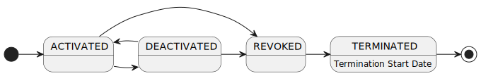
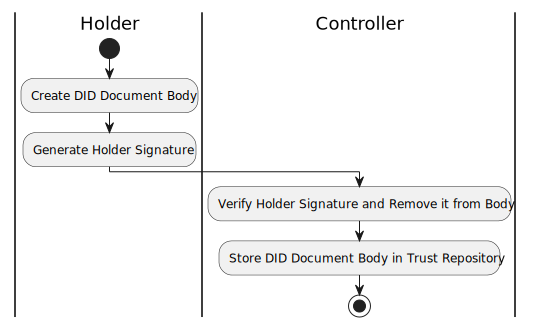

---
puppeteer:
    pdf:
        format: A4
        displayHeaderFooter: true
        landscape: false
        scale: 0.8
        margin:
            top: 1.2cm
            right: 1cm
            bottom: 1cm
            left: 1cm
    image:
        quality: 100
        fullPage: false
---

DID Document format
==

- Subject
    - Definition of DID Document types by entity
    - Definition of keys and management data used in each DID Document
- Author: Youngho Kang
- Date: 2024-09-03
- Version: v1.0.0


Revision History
---

| Version | Date       | Changes                                      |
| ------- | ---------- | -------------------------------------------- |
| v1.0.0  | 2024-09-03 | Initial version                                        |


<div style="page-break-after: always;"></div>

Table of Contents
---

<!-- TOC tocDepth:2..3 chapterDepth:2..6 -->

- [1. Overview](#1-overview)
    - [1.1. Notation](#11-notation)
    - [1.2. Reference Documents](#12-reference-documents)
- [2. General Matters](#2-general-matters)
    - [2.1. Key Usage (Verification Relationship)](#21-key-usage-verification-relationship)
    - [2.2. Authentication Type (authType)](#22-authentication-type-authtype)
    - [2.3. DID Document Lifecycle](#23-did-document-lifecycle)
    - [2.4. Key Lifecycle](#24-key-lifecycle)
    - [2.5. DID Document Structure](#25-did-document-structure)
- [3. DID Document Specifications by Entity](#3-did-document-specifications-by-entity)
    - [3.1. Holder DID Document](#31-holder-did-document)
    - [3.2. Wallet DID Document](#32-wallet-did-document)
    - [3.3. TAS DID Document](#33-tas-did-document)
    - [3.4. Provider DID Document](#34-provider-did-document)

<!-- /TOC -->

<div style="page-break-after: always;"></div>

## 1. Overview

This document describes the DID Documents used in OpenDID.
The basic rules comply with W3C's `[DID-v1.0]`.

The following must adhere to what is defined in this document:

- Types and usage of keys, names, algorithms
- Service endpoint

The following are _outside the scope of this document_ and can be freely defined by the implementation:

- Key validity period and key rotation methods
- Procedures for creating and modifying DID Documents

### 1.1. Notation

#### 1.1.1. JSON Data Notation

When defining document formats or input/output data in JSON format, follow the rules in `[OSD]`.

#### 1.1.2. Official and Other Notations

##### 1.1.2.1. JSON Member Reference

The rules for referencing specific members or values within a JSON formatted document are as follows.

■ Sample JSON

```json
{
    "name": "value",
    "array": ["A", "B", "C"],
    "obj": {
        "attr1": "value1",
        "attr2": "value2"
    }
}
```
- Use slashes to represent parent/child relationships, similar to Unix paths.
- Use `~` for the top-level path in the document, akin to the Unix home path.
    - `~/name`, `~/obj/attr`
- Use `.` and `..` for relative paths.
    - `.`: Same level as the subject being described
    - `..`: One level above the subject being described
- Arrays are denoted with `[<index>]`.
    - `~/array[0]` → "A"

### 1.2. Reference Documents

| Reference Name     | Document Name                                  | Location                             |
| ------------------ | ---------------------------------------------- | ------------------------------------ |
| [DID-v1.0]         | Decentralized Identifiers (DIDs) v1.0          | https://www.w3.org/TR/did-core/      |
| [DID-IMPL-v1.0]    | DID Implementation Guide v1.0                  | https://www.w3.org/TR/did-imp-guide/ |
| [OSD]              | OpenDID Schema Definition Language             |                                      |
| [DATA-SPEC]        | (OpenDID) Data Specification                   |                                      |


<div style="page-break-after: always;"></div>

## 2. General Matters

### 2.1. Key Usage (Verification Relationship)

The key usages defined in `[DID-v1.0]` are as follows, and this specification adheres to them.
That is, keys must be declared according to their intended usage and must be used only for that purpose.

| Name                 | Identifier            | Description                            |
| -------------------- | --------------------- | -------------------------------------- |
| Assertion            | `assertionMethod`     | Proof signing                          |
| Authentication       | `authentication`      | Authenticate the DID Subject           |
| Key Agreement        | `keyAgreement`        | Key exchange for encrypted communication |
| Capability Invocation| `capabilityInvocation`| Perform cryptographic functions (e.g., update DID Document) |
| Capability Delegation| `capabilityDelegation`| Delegate cryptographic functions to a third party |

### 2.2. Authentication Type (authType)

Authentication type refers to what authentication must be performed to use the corresponding key.
Authentication types are set as int32 type numbers with bitwise meanings as shown in the table below.

| b32 ~ b4 |  b3   |  b2   |  b1   | Description        |
| :------: | :---: | :---: | :---: | ------------------ |
|    -     | **x** | **x** | **x** | **Authentication Type** |
|    -     |   0   |   0   |   1   | 0x0001: No Authentication |
|    -     |   0   |   1   |   0   | 0x0002: PIN        |
|    -     |   1   |   0   |   0   | 0x0004: BIO        |

- No Authentication: Use the key without authentication
- PIN: Use the key after entering a PIN
- BIO: Use the key after fingerprint or FaceID recognition

### 2.3. DID Document Lifecycle

The lifecycle of a DID Document is as shown in the table and diagram below.

| Status Value   | Status Name | `~/deactivated` | Description                                                              |
| -------------- | ----------- | :-------------: | ------------------------------------------------------------------------ |
| `ACTIVATED`    | Active      |     `false`     | • Usable state<br>• Can transition to inactive or revoked state          |
| `DEACTIVATED`  | Inactive    |     `true`      | • Temporarily suspended by Controller<br>• Can transition back to active |
| `REVOKED`      | Revoked     |       N/A       | • No longer in use, permanently revoked<br>• Cannot transition to other states |
| `TERMINATED`   | Terminated  |       N/A       | • Not usable even for non-repudiation<br>• Termination start date must be specified |



DID Documents must be managed within the Trust Repository in the following two distinct lists:

- Active List (DID In-service List)
- Revocation List (DID Revocation List)

The following rules apply regarding the lifecycle of DID Documents:

1. Register the DID Document in the active list upon initial registration.
2. Move to the revocation list upon revocation.
3. DID Documents transferred to the revocation list cannot be returned to the active list.
4. Only DID Documents in the active list can have the `deactivated` value changed.
5. The `deactivated` value can be changed by the Controller without the consent of the DID owner.
6. The `versionId` remains unchanged when only the `deactivated` value is changed.
7. When changing values other than `deactivated`, the following conditions must be met:
    - The `versionId` must increase.
    - Verify the owner's signature to confirm consent.
8. Termination is a form of revocation but with additional conditions:
    - A termination start date must be specified upon request.
    - After the termination start date, the keys cannot be used for any purpose.

### 2.4. Key Lifecycle

The key lifecycle follows the DID Document lifecycle and applies the following rules:

- For non-repudiation, keys can be used to verify signatures regardless of key status.
- When the key status is `ACTIVATED`, it can be used for any purpose.
- When the key status is `DEACTIVATED`, usage depends on the verifier's policy.
- When the key status is `REVOKED`, it cannot be used for any purpose other than non-repudiation.
- When the key status is `TERMINATED`, it cannot be used even for non-repudiation purposes after the termination start date.

| Purpose / Status       | ACTIVATED | DEACTIVATED          | REVOKED | TERMINATED                      |
| ---------------------- | --------- | -------------------- | ------- | ------------------------------ |
| VC Issuer Signature Verification | Yes       | Depends on verifier policy | No      | No                             |
| VP Holder Signature Verification | Yes       | Depends on verifier policy | No      | No                             |
| Non-repudiation Signature Verification | Yes       | Yes                    | Yes     | No (after termination start date) |

### 2.5. DID Document Structure

For data types, constants, and object definitions not specified in this document, refer to `[DATA-SPEC]`.

#### 2.5.1. Data Types and Constants

```c#
def string did          : "DID id. ex: 'did:omn:123'"
def string didVersionId : "DID version id. ex: '1', '2'", regex(/[0-9]+/)
def string didKeyId     : "DID key id. ex: 'pin'"
def string didServiceId : "DID service id. ex: 'homepage'"
def string didKeyUrl    : "DID key URL. ex: 'did:omn:123?versionId=1#pin'"
def string didServiceUrl: "DID service URL. ex: 'did:omn:123?versionId=1#homepage'"

def enum AUTH_TYPE: "Authentication Type"
{
    1: "Free - No Authentication",
    2: "PIN - Password Authentication",
    4: "BIO - Biometric Authentication",
}

def enum DID_KEY_TYPE: "DID Key Type"
{
    "RsaVerificationKey2018",
    "Secp256k1VerificationKey2018",
    "Secp256r1VerificationKey2018",
}

def enum PROOF_TYPE: "Proof Type"
{
    "RsaSignature2018",
    "Secp256k1Signature2018",
    "Secp256r1Signature2018",
}

def enum PROOF_PURPOSE: "Proof Purpose"
{
    "assertionMethod",
    "authentication",
    "keyAgreement",
    "capabilityInvocation",
    "capabilityDelegation",
}

def enum DID_SERVICE_TYPE: "Service Type"
{
    "LinkedDomains"     : "site URL",
    "CredentialRegistry": "URL to query verifiable credentials",
}
```

#### 2.5.2. `DidDoc` object

```c#
def object DidDoc: "DID Document"
{
    //---------------------------------------------------------------------------
    // Meta
    //---------------------------------------------------------------------------
    + array(url)   "@context"   : "JSON-LD context", value(["https://www.w3.org/ns/did/v1"])
    + did          "id"         : "DID owner's DID"
    + did          "controller" : "DID controller's DID"
    + utcDatetime  "created"    : "created datetime"
    + utcDatetime  "updated"    : "last updated datetime"
    + didVersionId "versionId"  : "DID version ID"
    + bool         "deactivated": "true: deactivated, false: activated", default(false)

    //---------------------------------------------------------------------------
    // DID key list
    //---------------------------------------------------------------------------
    + array(object) "verificationMethod": "list of DID keys with public key values", min_count(1)
    {
        + didKeyId     "id"                : "key ID, e.g., 'pin'"
        + DID_KEY_TYPE "type"              : "key type"
        + did          "controller"        : "key controller's DID"
        + multibase    "publicKeyMultibase": "public key value"
        //--- Non-standard fields ---
        + AUTH_TYPE    "authType"          : "required authentication to use the key"
    }

    // Key lists by purpose
    // - All 'didKeyId' must be declared in '~/verificationMethod[]/id'
    - array(didKeyId) "assertionMethod"     : "list of Assertion key names", emptiable(false)
    - array(didKeyId) "authentication"      : "list of Authentication key names", emptiable(false)
    - array(didKeyId) "keyAgreement"        : "list of Key Agreement key names", emptiable(false)
    - array(didKeyId) "capabilityInvocation": "list of Capability Invocation key names", emptiable(false)
    - array(didKeyId) "capabilityDelegation": "list of Capability Delegation key names", emptiable(false)

    //---------------------------------------------------------------------------
    // Service endpoint
    //---------------------------------------------------------------------------
    - array(object) "service": "list of services", min_count(1)
    {
        + didServiceId     "id"             : "service ID"  // e.g., "homepage"
        + DID_SERVICE_TYPE "type"           : "service type"
        + array(url)       "serviceEndpoint": "list of URLs to the service", min_count(1)
    }
}
```

#### 2.5.3. OwnerDidDoc

This is a `DidDoc` with the owner's key signatures added.

```c#
def object OwnerDidDoc: "DID Document with the owner proofs"
{
    @spread(DidDoc)  // Include all members from the DidDoc object to avoid duplicate declarations

    //---------------------------------------------------------------------------
    // Proof - Non-standard fields
    //---------------------------------------------------------------------------
    // Required only when the DID owner requests registration/modification to the controller
    + select(1)
    {
        // when number of keys = 1
        ^ Proof        "proof" : "owner proof"
        // when number of keys >= 2
        ^ array(Proof) "proofs": "list of owner proofs", min_count(2)
    }
}
```
`~/proofs[]` are generated for all keys except those used for Key Agreement.

Proofs must be included when the DID owner requests registration or modification to the controller. However, when stored in the Trust Repository by the controller, proofs are verified and then removed, so they do not appear when the DID Document is queried.



<div style="page-break-after: always;"></div>

## 3. DID Document Specifications by Entity

### 3.1. Holder DID Document

The Holder refers to the entity that receives VCs from Issuers and TAS, typically referred to as "users."

#### 3.1.1. Main Attributes

- `~/controller`: TAS

#### 3.1.2. Public Keys

| id         | Name  | Required | Authentication | Usage                            | Description                            |
| ---------- | ----- | :------: | -------------- | -------------------------------- | -------------------------------------- |
| `pin`      | PIN Key |   Y    | 2 (PIN)        | • Assertion<br>• Authentication | Used with PIN input                    |
| `bio`      | BIO Key |   N    | 4 (BIO)        | • Assertion<br>• Authentication | Used with fingerprint or FaceID        |
| `keyagree` | Key Agreement | Y | 1 (No Authentication) | • Key Agreement                 | ECC public key for key exchange        |

#### 3.1.3. Service

`~/service` provides means for communication with the DID Subject.
The Holder can register their homepage URL if desired.

| id         | type          | Required | Description       |
| ---------- | ------------- | :------: | ----------------- |
| `homepage` | LinkedDomains |    N     | Homepage URL      |

### 3.2. Wallet DID Document

Defines the DID Document rules for the Holder's wallet.

#### 3.2.1. Main Attributes

- `~/controller`: TAS

#### 3.2.2. Public Keys

| id         | Name  | Required | Authentication | Usage          | Description                                                  |
| ---------- | ----- | :------: | -------------- | -------------- | ------------------------------------------------------------ |
| `assert`   | Signature Key | Y | 1 (No Authentication) | • Assertion      | Signs data for Wallet Token creation (replaces Wallet attestation key) |
| `auth`     | Authentication Key | Y | 1 | • Authentication | Used for DID Auth and other authentication                  |
| `keyagree` | Key Agreement | Y | 1 | • Key Agreement  | ECC public key for key exchange                               |


### 3.3. TAS DID Document

#### 3.3.1. Main Attributes

- `~/controller`: TAS

#### 3.3.2. Public Keys

| id         | Name  | Required | Authentication | Usage                   | Description                          |
| ---------- | ----- | :------: | -------------- | ---------------------- | ------------------------------------ |
| `assert`   | Signature Key | Y | 1 (No Authentication) | • Assertion             | Used for VC issuance signatures      |
| `auth`     | Authentication Key | Y | 1 | • Authentication        | Used for DID Auth and other authentication      |
| `invoke`   | Invocation Key | Y | 1 | • Capability Invocation | Used for performing management functions         |
| `keyagree` | Key Agreement | Y | 1 | • Key Agreement         | ECC public key for key exchange                  |

#### 3.3.3. Service

`~/service` provides means for communication with the DID Subject.
The Holder can register their homepage URL if desired.

| id         | type          | Required | Description       |
| ---------- | ------------- | :------: | ----------------- |
| `homepage` | LinkedDomains |    N     | Homepage URL      |

### 3.4. Provider DID Document

Defines the DID Document rules for all providers except Holder, Wallet, and TAS.

#### 3.4.1. Main Attributes

- `~/controller`: TAS

#### 3.4.2. Public Keys

| id         | Name  | Required | Authentication | Usage          | Description                          |
| ---------- | ----- | :------: | -------------- | -------------- | ------------------------------------ |
| `assert`   | Signature Key | Y | 1 (No Authentication) | • Assertion      | Used for VC issuance signatures      |
| `auth`     | Authentication Key | Y | 1 | • Authentication | Used for DID Auth and other authentication      |
| `keyagree` | Key Agreement | Y | 1 | • Key Agreement  | ECC public key for key exchange                  |

#### 3.4.3. Service

`~/service` provides means for communication with the DID Subject.
The Holder can register their homepage URL if desired.

| id         | type          | Required | Description       |
| ---------- | ------------- | :------: | ----------------- |
| `homepage` | LinkedDomains |    N     | Homepage URL      |