---
puppeteer:
    pdf:
        format: A4
        displayHeaderFooter: true
        landscape: false
        scale: 0.8
        margin:
            top: 1.2cm
            right: 1cm
            bottom: 1cm
            left: 1cm
    image:
        quality: 100
        fullPage: false
---

OpenDID Schema Definition Language
==

- Subject: Syntax definition for expressing JSON data format
- Author: Open Source Development Team, Kang Young-ho
- Date: 2024-09-03
- Version: v1.0.0

Revision History
---

| Version | Date       | Change Details         |
| ------- | ---------- | ---------------------- |
| v1.0.0  | 2024-09-03 | Initial version        |


<div style="page-break-after: always;"></div>

Table of Contents
---

<!-- TOC tocDepth:2..4 chapterDepth:2..6 -->

- [1. Overview](#1-overview)
- [2. Basic Rules](#2-basic-rules)
    - [2.1. Data Types](#21-data-types)
    - [2.2. User-Defined Types](#22-user-defined-types)
    - [2.3. Message Definitions](#23-message-definitions)
        - [2.3.1. Member Definitions](#231-member-definitions)
        - [2.3.2. Member Group Definitions](#232-member-group-definitions)
        - [2.3.3. Exclusive Choice Definitions](#233-exclusive-choice-definitions)
    - [2.4. Annotation](#24-annotation)
    - [2.5. Comments](#25-comments)
    - [2.6. Examples](#26-examples)
        - [2.6.1. Request Message](#261-request-message)
        - [2.6.2. Response Message](#262-response-message)
        - [2.6.3. Other Examples](#263-other-examples)
- [3. Recommendations](#3-recommendations)
    - [3.1. Naming Convention Recommendations](#31-naming-convention-recommendations)
- [4. Syntax](#4-syntax)
    - [4.1. Types](#41-types)
    - [4.2. Literals and Identifiers](#42-literals-and-identifiers)
    - [4.3. User Type Declarations](#43-user-type-declarations)
        - [4.3.1. `string` User Type Declarations](#431-string-user-type-declarations)
        - [4.3.2. `int` User Type Declarations](#432-int-user-type-declarations)
        - [4.3.3. `float` User Type Declarations](#433-float-user-type-declarations)
        - [4.3.4. `bool` User Type Declarations](#434-bool-user-type-declarations)
        - [4.3.5. `enum` Type Declarations](#435-enum-type-declarations)
        - [4.3.6. `object` User Type Declarations](#436-object-user-type-declarations)
        - [4.3.7. `array` User Type Declarations](#437-array-user-type-declarations)

<!-- /TOC -->


<div style="page-break-after: always;"></div>

## 1. Overview

JSON (JavaScript Object Notation) is a text-based format for representing structured data based on JavaScript object syntax.
It is widely used in web development due to its simplicity and readability compared to XML.

However, JSON has some limitations:

- Increased data size.
- Limited data types.
- Difficulty specifying constraints.

This document aims to alleviate these drawbacks and minimize confusion between developers and operators by defining a notation for JSON data formats.
The following aspects, which are hard to express with JSON syntax alone, are clearly defined:

- optional/mandatory attribute
- data grouping (including optional/mandatory per data group)
- default value
- array cardinality
- value range (e.g., 1~100)
- enumeration
- variable item names
- select & multiple select


<div style="page-break-after: always;"></div>

## 2. Basic Rules

### 2.1. Data Types

| Type     | Description  | Example            |
| -------- | ------------ | ------------------ |
| `string` | String       | `"abcABC가나다"`   |
| `int`    | Integer      | `123`              |
| `float`  | Floating point | `10.5`          |
| `bool`   | Boolean      | `true`, `false`    |
| `enum`   | Enumeration  |                    |
| `object` | Object       | `{...}`            |
| `array`  | Array        | `[...]`            |

### 2.2. User-Defined Types

User-defined types can be declared with the `def` statement.

1. Basic types (string, int, float, bool)
2. Enum types
3. Object types
4. Array types

```c#
def string uuid : "UUID string", length(36)
def int    score: "Score", min_value(0), max_value(100)

def enum COLOR: "Selectable colors"
{
    "FF0000": "Red",
    "00FF00": "Green",
    "0000FF": "Blue",
}

def enum AUTH_TYPE: "Authentication type"
{
    1: "No Authentication", 2: "PIN", 3: "BIO"
}

def object Proof: "Proof object"
{
    + string "kid"  : "Key id"
    + string "alg"  : "signature algorithm"
    + string "sig"  : "signature value"
    - int    "nonce": "nonce"
}

def object SampleObject: "Sample object"
{
    + array(object) "aList": "List of something"
    {
        + string "a": "A"
        - string "b": "B"
        + string "c": "C"
    }
    - array(Proof) "proof": "List of proof", min_count(1), max_count(3)
}
```

### 2.3. Message Definitions

JSON messages can be defined in one of the following two ways:

- User-defined object type: `def object ...`
- User-defined array type: `def array(?) ...`

#### 2.3.1. Member Definitions

Child items within an object are called members, and these are the following types of members:

- Simple member: basic type or user-defined type derived from a basic type
- Object member
- Array member
- Group: a collection of two or more members grouped together
- Select: one or more members selected exclusively

Each member definition is prefixed with a presence symbol indicating whether it is mandatory or optional.

- Presence symbol:
    - `+`: mandatory
    - `-`: optional

#### 2.3.2. Group Definitions

To group two or more members into one collective unit, use the `group` statement.

```c#
def object Obj: "sample object"
{
    + string "address": "user's home address"
    - group
    {
        + string "given_name" : "given name"
        + string "family_name": "family name"
        - int    "age"        : "age"
    }
}
```

#### 2.3.3. Exclusive Choice Definitions

To express that 1 to n members out of a group appear exclusively, use the `select` statement.
Within the `select` statement, the `^` symbol is used instead of the presence symbol to indicate exclusivity.

```c#
def object Obj: "sample object"
{
    + select(1)   // select(1..2) means 1 to 2
    {
        ^ string "mobile": "mobile phone number"
        ^ string "email" : "email address"
    }
}
```

### 2.4. Annotation

This is a static program comment that functions similarly to annotations in the Java language. It is used to flexibly extend the language. The currently defined annotations are as follows:

- `@spread(ObjectType)`: Inherits an existing object, i.e., unfolds the members of an existing defined object within the current object.

■ @spread Example

```c#
// Define a shape object with common properties x and y coordinates for all shapes
def object Shape: "Shape"
{
    + int "x": "x coordinate"
    + int "y": "y coordinate"
}

// Define a rectangle object that includes x, y coordinates from shape and adds width and height
def object Rectangle: "Rectangle"
{
    @spread(Shape)  // Inherit shape object

    + int "width" : "Width"
    + int "height": "Height"
}

// Define a circle object that includes x, y coordinates from shape and adds radius
def object Circle: "Circle"
{
    @spread(Shape)

    + float "radius": "Radius"
}
```

Similar to the use of inheritance in object-oriented programming, it fundamentally includes the definition of the parent object and can be useful when defining additional attributes.

### 2.5. Comments

The usage of comments follows Java syntax.

- Single-line comment: `//`
- Multi-line comment: `/*` ~ `*/`


### 2.6. Examples

#### 2.6.1. Request Message

**Existing Notation**

```json
{
    // <Header>
    "id"          : "<message-id> message id",
    "type"        : "<message-type> message type",
    "txId?"       : "<uuid> transaction id",
    "cmdId?"      : "<uuid> command id",
    "callbackUrl?": "<multibase-string> URL to send asynchronous responses",
    "expireDate?" : "<utc-datetime> expiration date",

    // <Body>
    "data": {
        // ...
    },

    // <Footer>
    "supplements?": [
        {
            "supId"     : "<string> supplement item id",
            "desc?"     : "<string> description of the content",
            "mediaType?": "<media-type>",
            "format?"   : "<string>",
            "data": {
                "multibase?": "<multibase-string>",
                "links?"    : ["<multibase-string[]> URL to fetch data"],
                "json?"     : {}
            }
        }
        // ...
    ]
}
```

**New Notation**

```c#
// User-defined types
def string messageId  : "message id string", length(28)
def string messageType: "message type string"
def string uuid       : "UUID string"
def string multibase  : "multibase string"
def string utcDatetime: "UTC datetime string"

def enum MEDIA_TYPE: "media type enum"
{
    "image"   : "images such as png, jpg, gif",
    "video"   : "videos such as mp4",
    "document": "documents such as pdf, doc, xls",
    "etc"     : "the others",
}

def object Supplement: "additional information"
{
    + string     "supId"    : "supplement item id"
    - string     "desc"     : "description of the contents"
    - MEDIA_TYPE "mediaType": "media type"
    - string     "format"   : "data format"
    + object     "data"     : "contents"
    {
        + select(1)
        {
            ^ multibase        "multibase": "contents in multibase"
            ^ array(multibase) "links"    : "URL to fetch data", min_count(1)
            ^ object           "json"     : "contents in JSON", emptiable(false) {...}
        }
    }
}

// Request message
def object RequestMessage: "request message"
{
    // Header
    + messageId   "id"        : "message id"
    + messageType "type"      : "message type"
    - uuid        "txId"      : "transaction id"
    - uuid        "cmdId"     : "command id"
    - utcDatetime "expireDate": "expiration date"

    // Body
    + object "data": "message body", emptiable(true) {...}

    // Footer
    - array(Supplement) "supplements": "list of additional items", min_count(1)
}
```

#### 2.6.2. Response Message

**Existing Notation**

```json
{
    // <Header>
    "status": "<enum-res-status> ['success', 'command', 'error']",
    "txId?" : "<uuid> transaction id",

    // <Body>
    "data?": { /* ... */ },
    "command?": {
        "cmdId"   : "<uuid> command id",
        "protoId" : "<string> protocol id",
        "protoUrl": "<multibase-string> URL to invoke",
        "param"   : { /* parameters */ }
    },
    "error?": {
        "code": "<string> error code",
        "desc": "<string> error description",
        "message": "<string> error message for end users"
    },

    // <Footer>
    "supplements?": [ { /* ditto */ } ]
}
```

**New Notation**

```c#
// User-defined types
def enum RES_STATUS: "response status"
{
    "success", "command", "error"
}

// Response message
def object ResponseMessage: "response message"
{
    // Header
    + RES_STATUS "status": "response status"
    - uuid       "txId"  : "transaction id"
    
    // Body
    + select(1)
    {
        // status is 'success'
        ^ group
        {
            + object            "data"       : "normal response", emptiable(true) {...}
            - array(Supplement) "supplements": "list of supplement", min_count(1)
        }

        // status is 'command'
        ^ object "command": "command response"
        {
            + uuid      "cmdId"    : "command id"
            + string    "protoId"  : "protocol id"
            + multibase "protolUrl": "URL to invoke"
            + object    "param"    : "command parameters", emptiable(true) {...}
        }

        // status is 'error'
        ^ object "error": "error response"
        {
            + string "code"   : "error code"
            + string "desc"   : "error description"
            + string "message": "error message for end users"
        }
    }
}
```


#### 2.6.3. Other Examples

**propose-dh-ecies**

```c#
def enum AES_TYPE: "AES key length"
{
    "AES128", "AES256"
}

def enum ECC_ALG_TYPE: "ECC algorithm type"
{
    "secp256k1", "secp256r1"
}

def object RequestProposeDhEcies: "request of propose-dh-ecies"
{
    + messageId   "id"   : "message id"
    + messageType "type" : "message type", value("omn-di/1.0/propose-dh-ecies")
    + uuid        "cmdId": "command id"
    + object      "data" : "message body"
    {
        - object "candidate": "available algorithm list of the client"
        {
            + array(AES_TYPE)     "aesTypeList": "available AES algorithm list", default(["AES256"])
            + array(ECC_ALG_TYPE) "algTypeList": "available ECC algorithm list", default(["secp256r1"])
        }
    }
}

def object ResponseProposeDhEcies: "response of propose-dh-ecies"
{
    // Header
    + RES_STATUS "status": "response status", value("success")
    + uuid       "txId"  : "transaction id"

    // Body
    + object "data": "response data"
    {
        + bool "useDidKey": "false: create temp key, true: use DID key of client"
        + select(1)
        {
            // when using DID key
            ^ group
            {
                + string "da" : "server's DA"
                + string "kid": "ECC key id in the DID Document"
            }

            // when using temporary key
            ^ multibase "pubKey": "server's temporary key"
        }
        + multibase "nonce": "nonce", byte_length(16)
    }
}
```

**VC claim object**

```c#
def string claimCode: "Claim code"
def string vcDigest : "W3C subresource integrity"

def enum CLAIM_TYPE: "Claim type"
{
    "text", "image", "document",
}

def enum CLAIM_FORMAT: "Claim format"
{
    // text
    "plain", "html", "xml", "csv",
    
    // image
    "png", "jpg", "gif",
    
    // document
    "txt", "pdf", "word",
}

def enum LOCATION: "Claim source data location"
{
    "inline": "Value included in 'value' within VC",
    "remote": "External link URL",
    "attach": "Separate attachment file",
}

def object Claim: "VC claim object"
{
    + claimCode    "code"     : "Claim code"
    + string       "caption"  : "Claim name"
    + string       "value"    : "Claim value"
    + CLAIM_TYPE   "type"     : "Claim type"
    + CLAIM_FORMAT "format"   : "Claim format"
    - bool         "hideValue": "Whether to hide the claim value", default(false)
    - LOCATION     "location" : "Location of the original claim data", default("inline")
    - vcDigest     "digestSRI": "Hash of the claim value", default(null)
    - object       "i18n"     : "Claim names in other languages"
    {
        + object $lang: "Claim name in other languages", variable_type(LANGUAGE), min_extend(1)
        {
            + string   "caption"  : "Claim name"
            - string   "value"    : "Claim value"
            - vcDigest "digestSRI": "Hash of the claim value"
        }
    }
}
```
<div style="page-break-after: always;"></div>

## 3. Recommendations

### 3.1. Naming Convention Recommendations

It is recommended, but not mandatory, to follow the naming conventions for user-defined types as outlined below:

| Type   | Naming Convention           | Example                                               |
| ------ | --------------------------- | ----------------------------------------------------- |
| Basic  | lowerCamelCase              | `def string didKeyId: "DID key id"`                   |
| Enum   | UPPER_SNAKE_CASE            | `def enum CLAIM_TYPE: "claim type" {...}`             |
| Object | UpperCamelCase (PascalCase) | `def object RequestMessage: "request message" {...}`  |
| Array  | ^^                          | `def array(int) AuthType: "auth type"`                |

<div style="page-break-after: always;"></div>

## 4. Syntax

### 4.1. Types

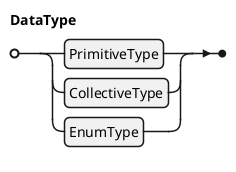

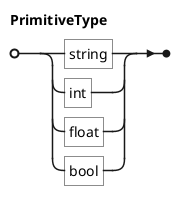

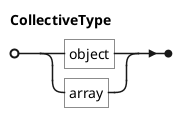

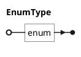

### 4.2. Literals and Identifiers

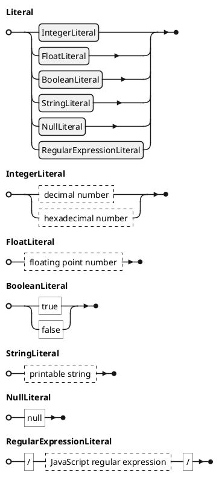
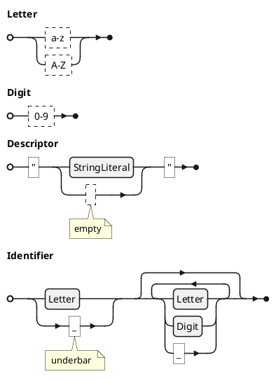


### 4.3. User Type Declarations

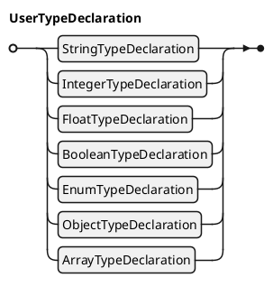

#### 4.3.1. `string` User Type Declaration

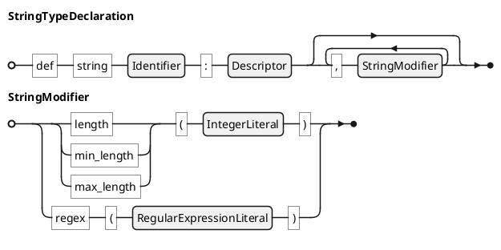

- `length`: fixed number of characters
- `min_length`: minimum number of characters
- `max_length`: maximum number of characters
- `regex`: regular expression

**Examples**

```c#
def string messageId: "message id string", length(28)

def string userId: "user ID",
    min_length(4), max_length(30),  // allowed length is 4-30
    regex(/[a-zA-Z0-9]+/)           // only alphabets and numbers allowed
```


#### 4.3.2. `int` User Type Declarations

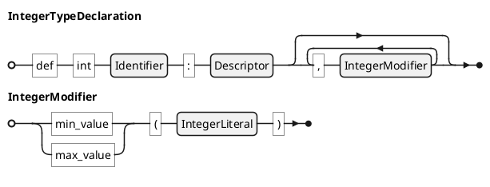

- `min_value`: minimum value
- `max_value`: maximum value

#### 4.3.3. `float` User Type Declarations

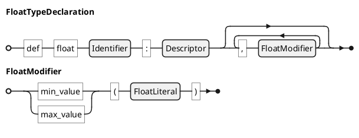

- `min_value`: minimum value
- `max_value`: maximum value

#### 4.3.4. `bool` User Type Declarations

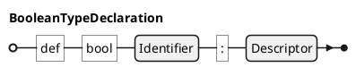

#### 4.3.5. `enum` Type Declarations

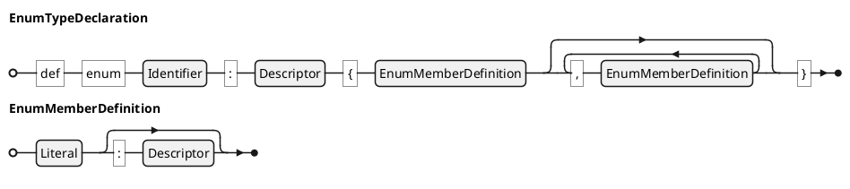

#### 4.3.6. `object` User Type Declarations

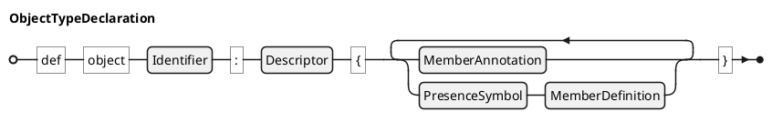

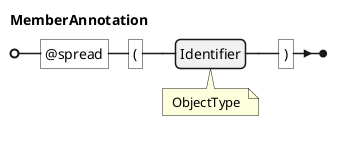

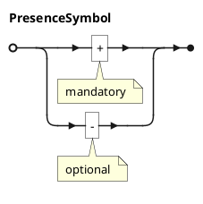

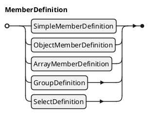

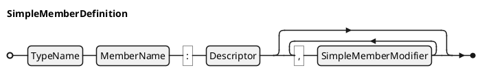

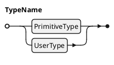
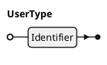
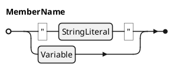
```plantuml
@startebnf
Variable = "$", Identifier;
@endebnf
```
<br>

```plantuml
@startebnf
SimpleMemberModifier = ("default" | "value" | "min_value" | "max_value") , "(", Literal, ")"
    | ("length" | "byte_length" | "min_length" | "max_length" | "min_byte_length" | "max_byte_length"), "(", IntegerLiteral, ")"
    | "regex", "(", RegularExpressionLiteral, ")"
    | ("min_extend" | "max_extend"), "(", IntegerLiteral, ")"
    | "variable_type", "(", UserName, ")"
    ;
@endebnf
```

- `default`: default value
- `value`: fixed value
- `min_value`, `max_value`: minimum, maximum value
- `length`: fixed length
- `byte_length`: fixed length in bytes
- `min_byte_length`, `max_byte_length`: minimum, maximum length in bytes
- `regex`: regular expression condition
- `min_extend`, `max_extend`: minimum, maximum frequency of objects that can appear in the extension part
- `variable_type`: explicitly specifies the type of the extension variable. Default is "string"

```plantuml
@startebnf
ObjectMemberDefinition = "object", MemberName, ":", Descriptor
                       , {",", ObjectMemberModifier}
                       , "{"
                       , ("..." | {PresenceSysmbol, MemberDefinition}-)
                       , "}"
                       ;
@endebnf
```

```plantuml
@startebnf
ObjectMemberModifier = ("default" | "value"), "(", "{", ? object value expression ? , "}", ")"
                     | "emptiable", "(", BooleanLiteral, ")"
                     | ("min_extend" | "max_extend"), "(", IntegerLiteral, ")"
                     | "variable_type", "(", UserName, ")"
                     ;

@endebnf
```

- `default`: default value
    - Example: default({"age": 16, "name": "James"})
- `value`: fixed value
- `emptiable`: allows empty value (`{}`)
- `min_extend`, `max_extend`: minimum, maximum frequency of objects that can appear in the extension part
- `variable_type`: explicitly specifies the type of the extension variable. Default is "string"

```plantuml
@startebnf
ArrayMemberDefinition = ObjectArrayMemberDefinition | TypedArrayMemberDefinition;
@endebnf
```

```plantuml
@startebnf
ObjectArrayMemberDefinition = "array", "(", "object", ")", MemberName, ":", Descriptor
                            , {",", ArrayMemberModifier}
                            , "{"
                            , ("..." | {PresenceSysmbol, MemberDefinition}-)
                            , "}"
                            ;
@endebnf
```

```plantuml
@startebnf
TypedArrayMemberDefinition = "array", "(", TypeName, ")", MemberName, ":", Descriptor
                           , {",", TypedArrayMemberModifier}
                           ;
@endebnf
```

```plantuml
@startebnf
ArrayMemberModifier = ("count" | "min_count" | "max_count"), "(", IntegerLiteral, ")"
                    | "emptiable", "(", BooleanLiteral, ")"
                    | ("min_extend" | "max_extend"), "(", IntegerLiteral, ")"
                    | "variable_type", "(", UserName, ")"
                    ;
@endebnf
```

- `count`: fixed number of array items
- `min_count`, `max_count`: minimum, maximum number of items
- `emptiable`: allows empty array (`[]`)
- `min_extend`, `max_extend`: minimum, maximum frequency of objects that can appear in the extension part
- `variable_type`: explicitly specifies the type of the extension variable. Default is "string"

```plantuml
@startebnf
TypedArrayMemberModifier = ArrayMemberModifier
                         | ("default" | "value"), "(", "[", Literal, {",", Literal}, "]", ")"
                         | "oneof", "(", Literal, {",", Literal}, ")"
                         ;
@endebnf
```

- `default`: default value
- `value`: fixed value
- `oneof`: list of candidates that can appear as values in the array (used instead of enum definition)

```plantuml
@startebnf
GroupDefinition = "group", "{", {PresenceSysmbol, MemberDefinition}-, "}";
@endebnf
```

```plantuml
@startebnf
SelectDefinition = "select", "(", IntegerLiteral, ["..", IntegerLiteral] , ")"
                 , "{", {"^", MemberDefinition}-, "}"
                 ;
@endebnf
```

```c#
select(1)  // Only one item can be included. Must have more than one member.
{
    ^ string "a": "A"
    ^ string "b": "B"
}

select(1..3)  // 1 to 3 items can be included. Must have more than three members.
{
    ^ string "a": "A"
    ^ string "b": "B"
    ^ string "c": "C"
}
```

#### 4.3.7. `array` User Type Declarations

```plantuml
@startebnf
ArrayTypeDeclaration = ObjectArrayTypeDeclaration | TypedArrayTypeDeclaration;
@endebnf
```

```plantuml
@startebnf
ObjectArrayTypeDeclaration = "def", "array", "(", "object", ")", Identifier, ":", Descriptor
                           , {",", ArrayModifier}
                           , "{"
                           , ("..." | {PresenceSysmbol, MemberDefinition}-)
                           , "}"
                           ;
@endebnf
```

```plantuml
@startebnf
TypedArrayTypeDeclaration = "def", "array", "(", TypeName, ")", Identifier, ":", Descriptor
                          , {",", TypedArrayModifier}
                          ;
@endebnf
```

```plantuml
@startebnf
ArrayModifier = ("count" | "min_count" | "max_count"), "(", IntegerLiteral, ")";
@endebnf
```

- `count`: fixed number of array items
- `min_count`, `max_count`: minimum, maximum number of items

```plantuml
@startebnf
TypedArrayModifier = ArrayModifier
                   | "oneof", "(", Literal, {",", Literal}, ")"
                   ;
@endebnf
```

**Examples**

```c#
def array(object) UserInfoList: "user information array", min_count(1)
{
    + string "name"      : "name"
    + string "birth_date": "date of birth"
    - string "ci"        : "CI"
}

def array(string) SelectedColors: "selected colors", count(2), oneof("RED", "GREEN", "BLUE", "YELLOW")
```