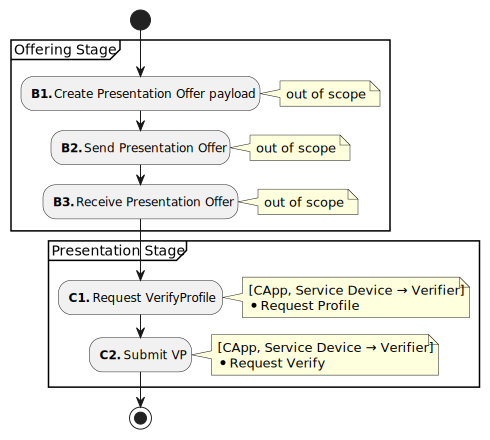
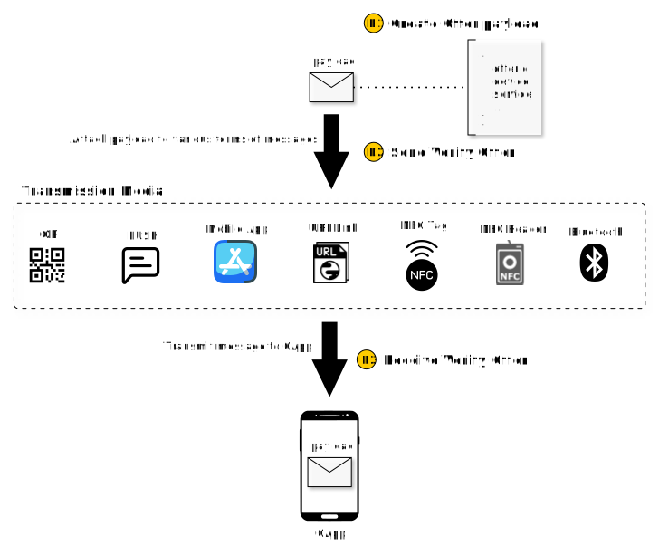
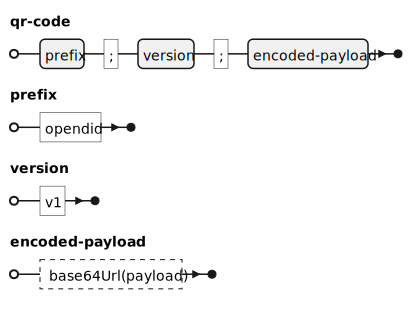
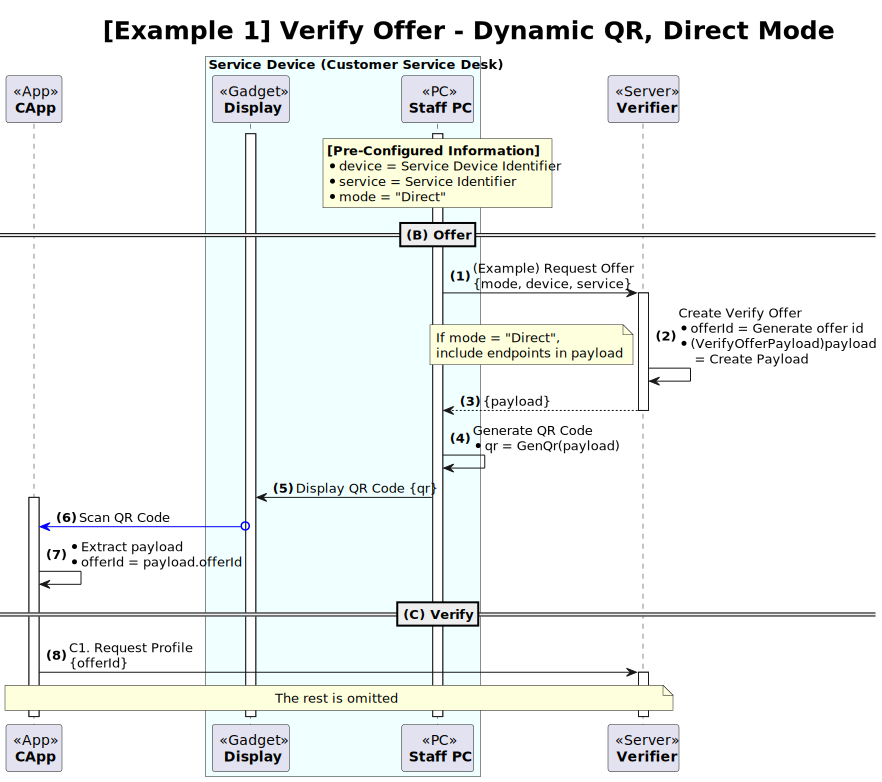
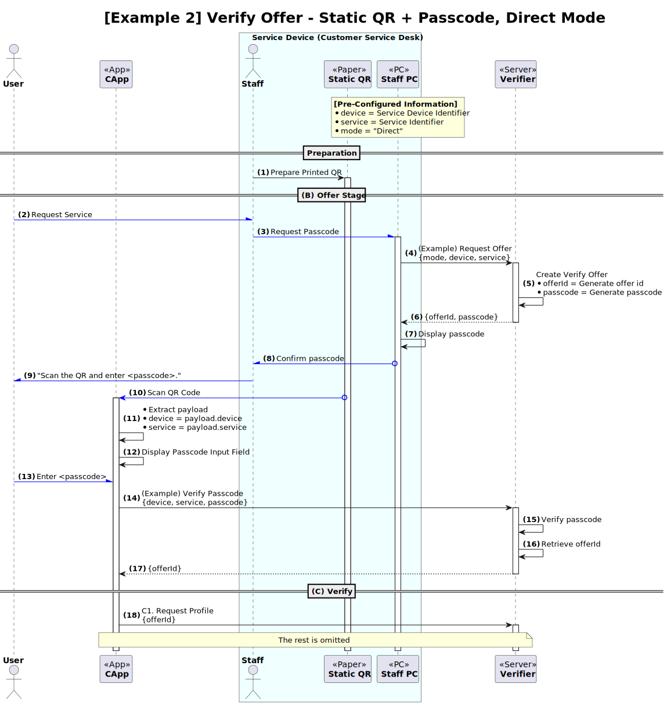
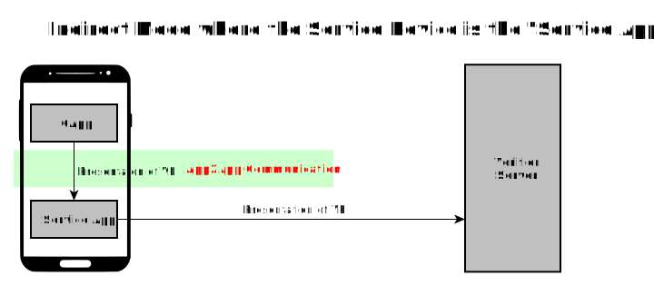
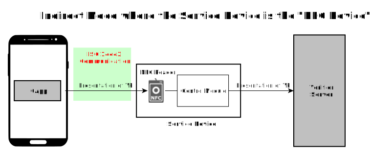
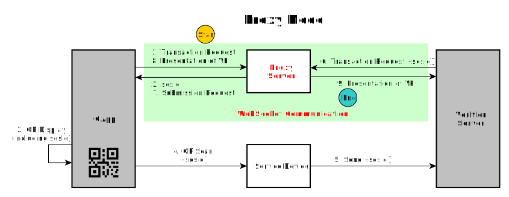
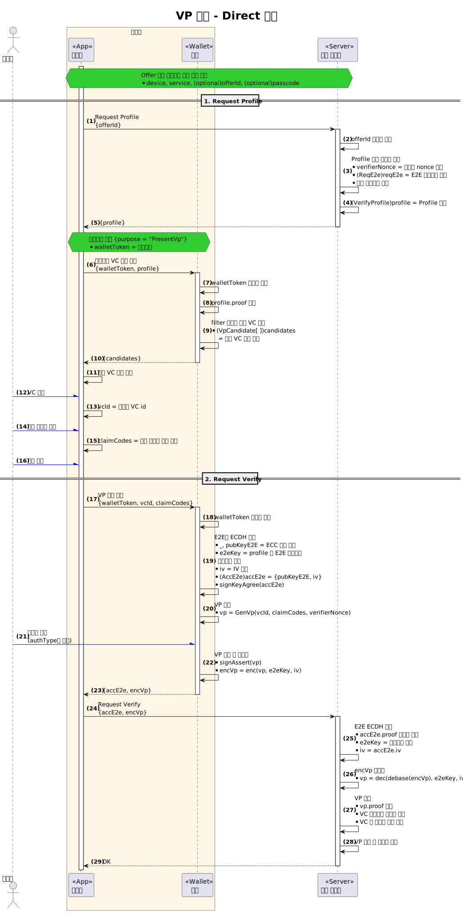

---
puppeteer:
    pdf:
        format: A4
        displayHeaderFooter: true
        landscape: false
        scale: 0.8
        margin:
            top: 1.2cm
            right: 1cm
            bottom: 1cm
            left: 1cm
    image:
        quality: 100
        fullPage: false
---

Presentation of VP
==

- Subject: Explanation of the concept of VP presentation
- Author: OpenSource Development Team
- Date: 2024-10-18
- Version: v1.0.0

| Version | Date       | Changes         |
| ------- | ---------- | --------------- |
| v1.0.0  | 2024-10-18 | Initial version |

<br>

Table of Contents
---

<!-- TOC tocDepth:2..4 chapterDepth:2..6 -->

- [1. Overview](#1-overview)
    - [1.1. Reference Documents](#11-reference-documents)
- [2. General Matters](#2-general-matters)
    - [2.1. Data Types and Constants](#21-data-types-and-constants)
- [3. Preparation Procedure](#3-preparation-procedure)
    - [3.1. Service Definition](#31-service-definition)
    - [3.2. Device of Service Definition](#32-device-of-service-definition)
    - [3.3. Definition of transmission media and message format for Verify offer](#33-definition-of-transmission-media-and-message-format-for-verify-offer)
- [4. Presentation Procedures](#4-presentation-procedures)
    - [4.1. Offer](#41-offer-stage)
        - [4.1.1. VerifyOfferPayload](#411-verifyofferpayload)
        - [4.1.2. Example using QR code](#412-example-using-qr-code)
    - [4.2. Presentation](#42-presentation-stage)
        - [4.2.1. Presentation Modes](#421-presentation-modes)
        - [4.2.2. Example of Direct Mode](#422-example-of-direct-mode)

<!-- /TOC -->

<div style="page-break-after: always;"></div>

## 1. Overview

This document explains the overall concept of VP presentation in OpenDID.
The VP presentation sequence is as follows:

1. Preparation Procedures
    - (A) Planning
        - (A1) Service Definition
        - (A2) Device of Service Definition
        - (A3) Definition of transmission media and message format for Verify offer
1. Presentation Procedures
    - (B) Offering
        - (B1) Creation of Verify offer payload
        - (B2) Transmission of Verify offer
        - (B3) Receipt of Verify offer
    - (C) Presentation
        - (C1) Request VerifyProfile
        - (C2) VP Presentation

### 1.1. Reference Documents

| Reference Name | Document Name                                | Location |
| ---------------| --------------------------------------------- | -------- |
| [OSD]          | OpenDID Schema Definition Language           |          |
| [DATA-SPEC]    | (OpenDID) Data Specification                 |          |
| [VC-FORMAT]    | (OpenDID) VC Format                          |          |
| [VP-FORMAT]    | (OpenDID) VP Format                          |          |
| [PROFILE-FORMAT]| (OpenDID) Profile Format                    |          |

<div style="page-break-after: always;"></div>

## 2. General Matters

### 2.1. Data Types and Constants

Items not defined here refer to `[DATA-SPEC]`.

```c#
def enum PRESENT_MODE: "VP Presentation Modes"
{
    "Direct"  : "direct mode",
    "Indirect": "indirect mode",
    "Proxy"   : "proxy mode",  // Currently unsupported
}
```

<div style="page-break-after: always;"></div>

## 3. Preparation Procedure

The preparation procedure for VP presentation and verification involves the following steps:

- (A1) Service Definition
- (A2) Device of Service Definition
- (A3) Definition of transmission media and message format for Verify offer

### 3.1. Service Definition

A service refers to the tangible or intangible benefits a user receives from a verifier by submitting a VP.
Examples of services are listed below.

| Service Name | Description                                    |
| ------------ | ---------------------------------------------- |
| Sign Up      | Register as a member.                          |
| Login        | Log in to the system.                          |
| Age Verification | Verify the user's age to purchase alcohol. |
| Identity Verification | Verify the user's identity to issue an access pass. |

The content provided to the user can vary depending on the verifier, even for the same age verification.
Therefore, the verifier must define what information the user will submit and what services the verifier will provide.
Upon defining the service, the following items are specified.

1. Service Identifier
2. Basic Service Information
    - Name, Description, Logo, Reference Site URL
3. VP Policy
    - (VC Schema) What VC is submitted?
    - (`allowedIssuers`) Which issuers' VCs are allowed?
    - (`requiredClaims`) What are the mandatory claims to be submitted?
    - (`displayClaims`) What claims can the user choose to submit?
    - (`authType`) What type of authentication is required for VP presentation?

### 3.2. Device of Service Definition

A device of service refers to an object that assists or intermediates VP presentation between the CApp and the verifier's server.
Examples of devices of service are listed below.

| Category    | Device of Service                                           |
| ----------- | ----------------------------------------------------------- |
| Mechanical  | Vending machine, kiosk, tablet, PC + monitor, NFC reader, Bluetooth device |
| Software    | Browser, verifier service app, PUSH solution                |
| Printed     | Printed QR code                                             |
| Others      | NFC tag, RFID tag                                           |

For each service, the verifier defines the linked devices of service as follows:

- Define the categories of devices of service to be provided.
- Assign device identifiers where necessary for individual devices.
    - For example, if each customer service desk is equipped with a separate device, assign an identifier to identify which desk it is.

### 3.3. Definition of transmission media and message format for Verify offer

The purpose of the Verify offer is as follows:

- Identify individual VP presentation transactions.
    - What service is being requested from which device of service?
- Provide the API endpoint for the VerifyProfile request.

This document defines only the `VerifyOfferPayload` format for the payload.
How to transmit the payload through various transmission media is outside the scope of this document.
It is up to the verifier and the CApp provider to agree on the message format and transmission method.

<div style="page-break-after: always;"></div>

## 4. Presentation Procedures

The presentation procedures are illustrated in the diagram below.



### 4.1. Offer

The offer is illustrated in the diagram below.



- (B1) Create Verify offer payload
    - Generate payload data in the `VerifyOfferPayload` format.
    - Typically, the payload is generated for each VP presentation transaction and includes an `offerId`.
    - A fixed payload can be reused without changes, with two cases:
        - Locked: Passcode submission required when requesting `offerId`
        - Unlocked: `offerId` request without passcode
- (B2) Transmit Verify offer
    - Transmit the payload through the designated interface.
    - This may vary by message format or interface.
- (B3) Receive Verify offer
    - Extract the payload from the received message.

The offer does not define a standard API but specifies the data format for the payload.
Therefore, the method of transmitting the payload to the CApp is outside the scope of this document.
However, the entity requesting the VerifyProfile for the presentation procedure must obtain the `offerId` in advance.
Generally, the CApp is this entity, but in some cases, the device of service may request the VerifyProfile and provide it to the CApp.

#### 4.1.1. VerifyOfferPayload

```c#
def object VerifyOfferPayload: "Verify offer payload"
{
    - uuid         "offerId"   : "Verify offer id", emptiable(false)
    + OFFER_TYPE   "type"      : "offer type", value("VerifyOffer")
    + PRESENT_MODE "mode"      : "Presentation mode"
    + itemName     "device"    : "Device of service identifier"
    + itemName     "service"   : "Service identifier"
    - array(url)   "endpoints" : "List of verifier API endpoints"
    - utcDatetime  "validUntil": "Valid until date and time"
    - bool         "locked"    : "Offer locked status", default(false)
}
```

- `offerId`: (Optional) Verify offer id
    - Specify `offerId` for identifying individual transactions for each offer or when using dynamic QR codes.
    - The `offerId` can be obtained by the device of service by requesting the server to start the transaction.
- `device`: Device of service identifier
    - Identifier to confirm which device provided the verify offer.
    - For example, if a vending machine with device number 'W130-213' displays a QR code, specify the device number in `device` so that the verifier server can respond directly to the vending machine upon VP presentation completion.
    - In the case of a web service with no specific device, use a name like "WEB-BROWSER" to indicate that the request is from a browser.
- `service`: Service name specified by the verifier
    - Identifier for the service provided by VP presentation.
    - Examples: "login", "signup", "account-transfer", "login.did"
- `endpoints`: List of URLs for calling verifier APIs
    - Required if `mode` is "Direct".
- `locked`: Whether a passcode is required when calling the API via endpoint
    - Used to set a passcode to prevent reuse when using fixed values without an `offerId`.
    - For example, if a static QR code is displayed at customer service desk "16" to receive VP presentations, it can be configured as follows:
        - Print the QR with settings like {`offerId` is empty, `device`="16", `locked`=true, ...} and attach it to the desk.
        - The desk PC requests the verify offer from the server with the `device` value and is assigned passcode "1234".
        - The desk staff instructs the customer to "Scan the QR code and enter 1234."
        - The customer's mobile device sends a VerifyProfile request to the verifier server, including the entered passcode.
        - The verifier server responds with the `offerId` if the device number and passcode match.

#### 4.1.2. Example using QR code

To explain the offer more concretely, an example using QR codes is provided.
The following two QR code methods are applied.

1. Dynamic QR
    - The QR code changes each time.
    - A display device is needed to show the QR code to the user.
2. Static QR + passcode
    - The QR code is fixed as there is no variable information in the payload, so it can be printed on paper and attached.
    - Passcode submission/verification is required when requesting `offerId`.

Both QR code formats are defined as follows.<br>
<span style="color:red">
(This is only an example and should not be considered a standard.)
</span>



**■ payload**

```json
{
    "type": "VerifyOffer",
    "mode": "Direct",
    "device": "N13-08",
    "service": "permission",
    "endpoints": ["https://example.com/vp"],
    "locked": true
}
```

According to the above definitions, the QR code has been generated with actual values applied.

**■ encoded-payload**

※ Line breaks added for convenience

```
ewogICAgInR5cGUiOiAiVmVyaWZ5T2ZmZXIiLAogICAgIm1vZGUiOiAiRGlyZWN0IiwKICAgICJk
ZXZpY2UiOiAiTjEzLTA4IiwKICAgICJzZXJ2aWNlIjogInBlcm1pc3Npb24iLAogICAgImVuZHBv
aW50cyI6IFsiaHR0cHM6Ly9leGFtcGxlLmNvbS92cCJdLAogICAgImxvY2tlZCI6IHRydWUKfQ
```

**■ qr-code**

※ Line breaks added for convenience

```
opendid;v1;
ewogICAgInR5cGUiOiAiVmVyaWZ5T2ZmZXIiLAogICAgIm1vZGUiOiAiRGlyZWN0IiwKICAgICJk
ZXZpY2UiOiAiTjEzLTA4IiwKICAgICJzZXJ2aWNlIjogInBlcm1pc3Npb24iLAogICAgImVuZHBv
aW50cyI6IFsiaHR0cHM6Ly9leGFtcGxlLmNvbS92cCJdLAogICAgImxvY2tlZCI6IHRydWUKfQ
```

**■ QR Image**


##### 4.1.2.1. Verify Offer - Dynamic QR Procedure



##### 4.1.2.2. Verify Offer - Static QR + passcode Procedure



### 4.2. Presentation

The presentation involves obtaining the VerifyProfile and submitting the encrypted VP.
The summary of the presentation is as follows:

1. (CApp) Obtain VerifyOfferPayload
    - Can be obtained through various methods such as QR, PUSH, etc. (out of scope)
1. (CApp) Obtain VerifyProfile
    - If `mode` = "Direct":
        - (CApp) Call the API at the endpoint specified in VerifyOfferPayload
    - If `mode` = "Indirect":
        - (CApp) Request profile from the service device
        - (Service Device) Request profile from the verifier
1. (CApp, Wallet) Generate wallet token
1. (User) Select VCs and claims to submit
1. (CApp) Request the wallet to generate VP
1. (Wallet) Generate and encrypt VP with user's consent
1. Submit VP
    - If `mode` = "Direct":
        - (CApp) Call the API at the endpoint specified in VerifyProfile
    - If `mode` = "Indirect":
        - (CApp) Submit VP to the service device
        - (Service Device) Submit VP to the verifier
1. (Verifier) Decrypt and verify VP, then provide the service

#### 4.2.1. Presentation Modes

Presentation modes refer to the methods of submitting the VP, and they are as follows:

| Mode       | Description                                | Supported |
| ---------- | ------------------------------------------ | --------- |
| `Direct`   | CApp directly submits to the verifier      | Supported |
| `Indirect` | CApp indirectly submits via service device | Supported |
| `Proxy`    | Presentation is intermediated by a third-party server | Not Supported |

##### 4.2.1.1. Direct Mode

In Direct mode, the CApp directly calls the `Request Verify` API at the endpoint specified in the profile.


##### 4.2.1.2. Indirect Mode

In Indirect mode, the CApp submits the VP to the service device, and the service device calls the `Request Verify` API to submit the VP.
The service device must have a means to directly communicate with the CApp to use this mode.

■ Example of App2App



■ Example of NFC



##### 4.2.1.3. Proxy Mode

In Proxy mode, the VP is submitted through a server (Proxy server or intermediary server) that intermediates the data exchange between the CApp and the verifier server.

When the CApp selects the VC to be submitted and displays a QR code, the service device scans the QR code and delivers it to the verifier server to proceed with the transaction. The verifier server needs a way to reach the CApp.
Since servers have fixed communication endpoints while mobile apps do not, the server cannot directly access the CApp.
Therefore, the CApp forms a session with the proxy server, gets assigned a session id (`sesId`), and conveys this to the verifier to enable data exchange through the proxy server.
The diagram below explains the Proxy mode procedure.



Proxy mode is only introduced conceptually and is currently not supported.

#### 4.2.2. Example of Direct Mode

