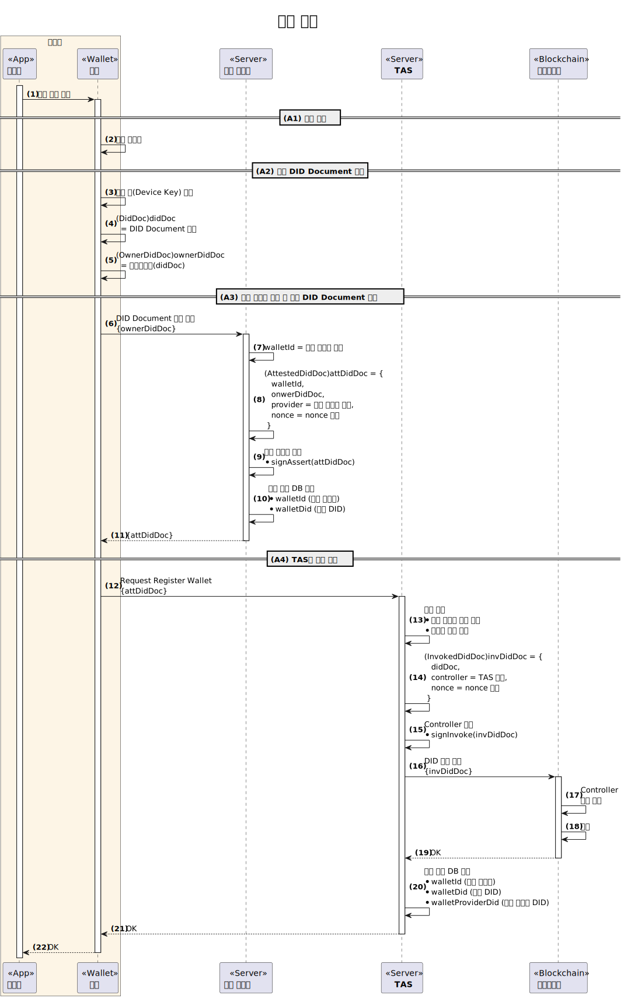

---
puppeteer:
    pdf:
        format: A4
        displayHeaderFooter: true
        landscape: false
        scale: 0.8
        margin:
            top: 1.2cm
            right: 1cm
            bottom: 1cm
            left: 1cm
    image:
        quality: 100
        fullPage: false
---

사용자 등록
==

- 주제 : 사용자 등록의 개념 설명
- 작성 : 오픈소스개발팀
- 일자 : 2024-10-18
- 버전 : v1.0.0

| 버전 | 일자       | 변경         |
| ------- | ---------- | --------------- |
| v1.0.0  | 2024-10-18 | 최초 작성 |

<br>


목차
---

<!-- TOC tocDepth:2..4 chapterDepth:2..6 -->

- [1. 개요](#1-개요)
    - [1.1. 참조문서](#11-참조문서)
- [2. 공통사항](#2-공통사항)
    - [2.1. 데이터 타입 및 상수](#21-데이터-타입-및-상수)
    - [2.2. DID 정책](#22-did-정책)
        - [2.2.1. DID 정책의 사례](#221-did-정책의-사례)
- [3. 월렛 등록 절차](#3-월렛-등록-절차)
    - [3.1. 월렛의 종류](#31-월렛의-종류)
        - [3.1.1. 파일 월렛](#311-파일-월렛)
        - [3.1.2. 앱 월렛](#312-앱-월렛)
        - [3.1.3. 클라우드 월렛](#313-클라우드-월렛)
    - [3.2. 월렛의 기능](#32-월렛의-기능)
    - [3.3. 상세 절차](#33-상세-절차)
- [4. 사용자 등록 절차](#4-사용자-등록-절차)
    - [4.1. 상세 절차](#41-상세-절차)

<!-- /TOC -->


<div style="page-break-after: always;"></div>

## 1. 개요

본 문서는 OpenDID의 사용자 등록에 대한 전반적인 개념을 설명한다.
사용자 등록 절차는 다음과 같다.

1. (A) 월렛 등록 절차
    - (A1) 월렛 생성
    - (A2) 월렛 DID Document 생성
    - (A3) 월렛 식별자 생성 및 월렛 DID Document 서명
    - (A4) TAS에 월렛 등록 - Request Register Wallet
1. (B) 사용자 등록 절차
    - (B1) 사용자 등록 시작 요청 - Propose Register User
    - (B2) ECDH (보안 세션 수립) - Request ECDH
    - (B3) 월렛토큰, 서버토큰 생성 - Request Create Token
    - (B4) 사용자 등록 요청 - Request Register User
    - (B5) 사용자 등록 완료 - Confirm Register User

### 1.1. 참조문서

| 참조명           | 문서명                                      | 위치 |
| ---------------- | ------------------------------------------- | ---- |
| [OSD]            | OpenDID Schema Definition Language          |      |
| [DATA-SPEC]      | (OpenDID) 데이터 명세서(Data Specification) |      |
| [DIDDOC-FORMAT]  | (OpenDID) DID Document format               |      |


<div style="page-break-after: always;"></div>

## 2. 공통사항

### 2.1. 데이터 타입 및 상수

여기에 정의되지 않은 항목은 `[DATA-SPEC]`을 참조한다.

```c#
def enum WALLET_TYPE: "wallet type"
{
    "FileWallet", "AppWallet", "CloudWallet"
}

def object DidDoc: "DID Document"
{
    //---------------------------------------------------------------------------
    // Meta
    //---------------------------------------------------------------------------
    + array(url)   "@context"   : "JSON-LD context", value(["https://www.w3.org/ns/did/v1"])
    + did          "id"         : "DID owner's did"
    + did          "controller" : "DID controller's did"
    + utcDatetime  "created"    : "created datetime"
    + utcDatetime  "updated"    : "last updated datetime"
    + didVersionId "versionId"  : "DID version id"
    + bool         "deactivated": "true: deactivated, false: activated", default(false)

    //---------------------------------------------------------------------------
    // DID key list
    //---------------------------------------------------------------------------
    + array(object) "verificationMethod": "list of DID key with public key value", min_count(1)
    {
        + didKeyId     "id"                : "key id. ex: 'pin'"
        + DID_KEY_TYPE "type"              : "key type"
        + did          "controller"        : "key controller's did"
        + multibase    "publicKeyMultibase": "public key value"
        //--- 이하 비표준 항목 ---
        + AUTH_TYPE    "authType"          : "required authentication to use the key"
    }

    // 용도별 키 목록
    // - 모든 'didKeyId'는 '~/verificationMethod[]/id'에 선언되어 있어야 함
    - array(didKeyId) "assertionMethod"     : "list of Assertion key name", emptiable(false)
    - array(didKeyId) "authentication"      : "list of Authentication key name", emptiable(false)
    - array(didKeyId) "keyAgreement"        : "list of Key Agreement key name", emptiable(false)
    - array(didKeyId) "capabilityInvocation": "list of Capability Invocation key name", emptiable(false)
    - array(didKeyId) "capabilityDelegation": "list of Capability Delegation key name", emptiable(false)

    //---------------------------------------------------------------------------
    // Service endpoint
    //---------------------------------------------------------------------------
    - array(object) "service": "list of service", min_count(1)
    {
        + didServiceId     "id"             : "service id"  // ex: "homepage"
        + DID_SERVICE_TYPE "type"           : "service type"
        + array(url)       "serviceEndpoint": "list of URL to the service", min_count(1)
    }
}

def object OwnerDidDoc: "DID Document with the owner proofs"
{
    @spread(DidDoc)  // DidDoc 객체 내 모든 멤버를 포함하라는 의미 (중복선언 방지)

    //---------------------------------------------------------------------------
    // Proof - 비표준 항목
    //---------------------------------------------------------------------------
    // DID 소유자가 controller에 등록/수정을 요청할 때만 필요
    + select(1)
    {
        // when 키개수 = 1
        ^ Proof        "proof" : "owner proof"
        // when 키개수 >= 2
        ^ array(Proof) "proofs": "list of owner proof", min_count(2)
    }
}

def object AttestedDidDoc: "Provider attested DID Document - Attestation 서명 첨부"
{
    + walletId  "walletId"   : "wallet id"
    + mulitbase "ownerDidDoc": "multibase(OwnerDidDoc)"
    + Provider  "provider"   : "provider 정보"
    + multibase "nonce"      : "provider nonce", byte_length(16)
    // DID Document를 사용할 장치 또는 사용자를 관리하는 사업자의 증명
    + AssertProof "proof"    : "provider's attestation proof"
}

def object SignedDidDoc: "Wallet signed DID Document - 월렛 서명 첨부"
{
    + mulitbase "ownerDidDoc": "multibase(OwnerDidDoc)"
    + object    "wallet"     : "wallet information"
    {
        + walletId "id" : "wallet id"
        + did      "did": "wallet DID"
    }
    + multibase   "nonce": "wallet nonce", byte_length(16)
    + AssertProof "proof": "wallet proof - 월렛 서명"
}

def object InvokedDidDoc: "Controller signed DID Document - Invocation 서명 첨부"
{
    + mulitbase   "didDoc"    : "multibase(DidDoc)"
    + Provider    "controller": "controller 정보"
    + multibase   "nonce"     : "controller nonce", byte_length(16)
    + InvokeProof "proof"     : "controller's invocation proof"
}
```

### 2.2. DID 정책

DID 관련하여 어떤 제약조건을 적용할 것인가에 대한 의사결정을 "DID 정책"이라고 한다.
월렛 등록, 사용자 등록 절차는 이러한 DID 정책에 직접적인 영향을 받으므로
DID 정책을 명확하게 정의하고 이해하는 것이 필요하다.

DID 정책의 항목은 다음과 같다.

- 공개 DID 정책
    - 실명: DID 값으로 개인을 식별할 수 _있음_
    - 익명: DID 값으로 개인을 식별할 수 _없음_
- 1인 1-DID 정책
    - 본인확인에 의해 식별된 개인 1인당 활성 DID는 1개만 허용
    - 새로 DID를 생성하면 기존 DID 및 VC는 모두 자동 폐기됨
- 1인 1-월렛 정책
    - 개인 1인당 여러 개의 인가앱을 허용하더라도 월렛은 1개만 허용
    - 클라우드 월렛을 사용할 경우 여러 단말에서 접근가능한지 결정 필요
    - 앱 월렛을 사용할 경우 여러 인가앱에서 접근가능한지 결정 필요
- 1인 1-단말(인가앱) 정책
    - 개인 1인당 단말(혹은 인가앱)은 1개만 허용
    - 인가앱을 재설치하면 기존 DID 및 VC는 모두 자동 폐기 또는 무효화 됨
- 기타

#### 2.2.1. DID 정책의 사례

아래는 어떤 도메인이 수립한 DID 정책표이다.

| 구분   | 정책     | 식별자 타입 | 설명                       |
| ------ | -------- | ----------- | -------------------------- |
| 공개   | 실명     |             | DID 값으로 개인 식별       |
| DID    | 1-DID    | `did`       | 인당 1개의 DID만 허용      |
| 월렛   | 1-월렛   | `walletId`  | 인당 1개의 월렛만 허용     |
| 인가앱 | N-인가앱 | `appId`     | 여러 개의 인가앱 사용 가능 |

1인당 "1-DID", "1-월렛" 정책이므로 하나의 월렛에 하나의 DID만 생성이 가능하다.
즉, 여러 개의 월렛을 생성할 수도 없을 뿐더러 하나의 월렛에 여러 개의 DID를 생성할 수도 없다.
그러나 "N-인가앱" 정책이므로 하나의 월렛에 여러 개의 인가앱이 접근하여 사용할 수 있다.
그러나 파일 월렛을 사용한다면 사실상 "1-인가앱"과 마찬가지이다.


<div style="page-break-after: always;"></div>

## 3. 월렛 등록 절차

월렛 등록 절차는 아래 그림과 같다.


### 3.1. 월렛의 종류

월렛의 종류 및 현재 표준으로 채택 여부는 아래 표와 같다.

| 종류                            | 설명                                           | 표준 |
| ------------------------------- | ---------------------------------------------- | :--: |
| File Wallet<br>(파일 월렛)      | 인가앱 내부에 파일과 SDK로 존재                |  Y   |
| App Wallet<br>(앱 월렛)         | 인가앱이 설치된 모바일 장치에 별도 앱으로 존재 |  N   |
| Cloud Wallet<br>(클라우드 월렛) | 온라인 서비스 형태로 존재                      |  N   |

#### 3.1.1. 파일 월렛

파일 월렛은 월렛 사업자로부터 획득한 SDK를 인가앱 내부에서 호출하여 사용하는 월렛이다.
월렛이 인가앱 내에 존재하므로 하나의 인가앱만 해당 월렛에 접근이 가능하다.
즉, 두 개 이상의 인가앱이 월렛을 공유할 수 없고 독점적으로만 사용 가능하다.

SDK와 월렛 사업자 서버간의 통신에 대한 규정은 본 문서의 범위 밖이다.


#### 3.1.2. 앱 월렛

앱 월렛은 인가앱이 설치된 동일한 모바일 기기에 앱 형태로 설치된 월렛이다.
인가앱과 앱 월렛간은 App2App 방식으로 통신하며 이에 대한 구체적인 방법은 현재 미정이다.
두 개 이상의 인가앱이 하나의 앱 월렛을 공유할 수 있다.


**■ 고려사항**

- 다른 기기에 설치된 앱 월렛에 접근이 가능한가?
- 여러 인가앱이 공유 시
    - 어떤 인가앱에서 발급받은 VC를 다른 인가앱에서 접근 가능한가?
    - 인가앱별 월렛 잠금/해제가 필요한가?
- 앱 월렛의 백업/복구가 가능한가?

#### 3.1.3. 클라우드 월렛

클라우드 월렛은 월렛 사업자가 온라인 서비스 형태로 제공하는 월렛이다.
온라인에 존재하므로 백업/복구 기능을 기본적으로 제공하여야 한다.
현재 표준으로 채택된 방식이 아니므로 인가앱과 클라우드 월렛에 대한 통신 방법 등은 미정이다.


**■ 고려사항**

- 인가앱으로부터 접근에 대한 인증수단은 무엇인가?
- 백업/복구에 대한 사용자 인증수단은 무엇인가?
- 인가앱과 월렛간 통신 데이터 보안은 어떻게 보장하는가?
- 여러 인가앱이 공유 시
    - 어떤 인가앱에서 발급받은 VC를 다른 인가앱에서 접근 가능한가?
    - 인가앱별 월렛 잠금/해제가 필요한가?

### 3.2. 월렛의 기능

월렛은 그 종류와 무관하게 다음의 기능을 제공하여야 한다.

1. 월렛 자신의 DID를 보유하고 신뢰저장소에 등록
    - 월렛 DID Document의 진본성을 월렛 사업자가 보장
1. 사용자 DID Document 관련 기능
    - 신규 생성 및 등록 요청
    - 변경 및 등록 요청: 키 교체, 서비스 추가 등
    - 폐기/말소 요청
1. 모든 키의 안전한 저장
    - 월렛 키, 사용자 키를 안전한 영역에 저장
    - 운영체제가 제공하는 안전영역을 이용
1. 월렛 키와 사용자 키의 분리
    - 월렛 키와 사용자 키는 (물리적으로 같은 위치에 저장하더라도) 개념적으로 분리 필요
    - 키의 생성과 사용에 대한 접근 경로가 종류별로 달라야 함(아래 인증수단 참조)
1. 인증수단 준수에 의한 키 사용
    - 사용자 키는 생성 시 지정한 인증수단에 맞게 사용자 인증 후 사용 가능
    - 월렛 키는 월렛토큰 인증 및 기타 월렛이 지정한 인증 완료 후 사용 가능
1. 월렛토큰 생성/검증
    - 현재 월렛의 상태가 인가앱이 요청한 purpose를 수용할 수 있는지 판단
    - 인가앱이 요청한 purpose를 식별할 수 있는 월렛토큰 생성
    - 인가앱이 요청한 기능을 수행할 수 있는 월렛토큰을 제출하였는지 검증
    - 한 순간에 하나의 월렛토큰만 존재하도록 관리
1. VC 관련 기능
    - TAS에 VC 발급을 요청하고 발급 받은 VC를 월렛 내에 안전하게 저장
    - 적절한 월렛토큰 검증 후 인가앱에 VC 제공
1. VP 관련 기능
    - 적절한 월렛토큰 검증 후 VP 생성 및 암호화 (제출은 인가앱이 수행)

### 3.3. 상세 절차




<div style="page-break-after: always;"></div>

## 4. 사용자 등록 절차

사용자 등록 절차는 아래 그림과 같다.


상기의 절차에서 생략된 것은 KYC(Know Your Customer, 본인확인) 과정이다.
KYC 수행은 DID 정책이나 KYC 수행 주체에 따라 방법이나 시점이 달라질 수 있다.

### 4.1. 상세 절차


