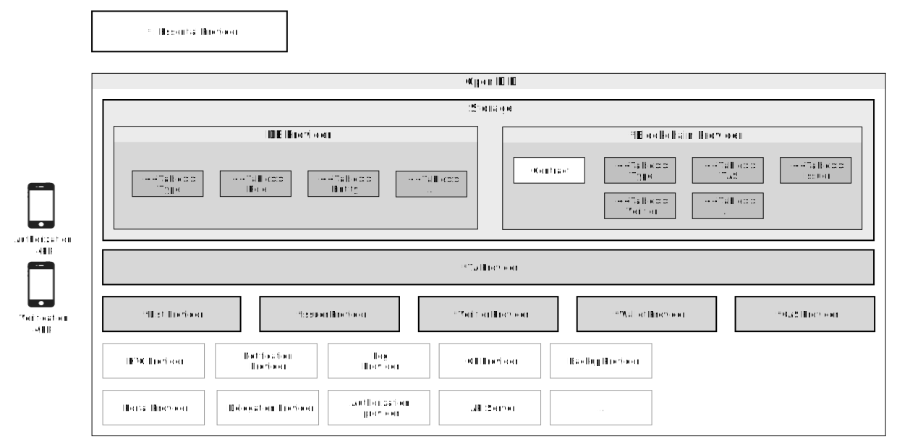

# Open DID 구성도

- 주제 : Open DID 구성도
- 작성 : 오픈소스개발팀
- 일자 : 2024-10-18
- 버전 : v1.0.0

| 버전 | 일자       | 변경         |
| ------- | ---------- | --------------- |
| v1.0.0  | 2024-10-18 | 최초 작성 |

 

본 문서에서는 Open DID 시스템을 구성하는 주요 요소들에 관해 설명하고, 전체 구성도를 제공합니다.

## Open DID 구성 요소
Open DID 시스템의 구성 요소로는 엔티티, 서비스, 사업자가 있습니다. 사업자는 엔티티를 조합하여 서비스를 제공하는데, 아래 그림은 이러한 구성 요소들이 어떻게 구조화되어 있는지를 보여줍니다. 

### 엔티티 (Entity)
엔티티는 하나의 기능을 수행하는 요소입니다. 각 엔티티는 특정 역할을 담당하는데, Open DID의 주요 엔티티는 아래와 같습니다.
* **TA** : 신뢰 관계를 구축하기 위해 모든 사업자를 Open DID 시스템에 등록하는 역할을 수행합니다.
* **Issuer** : 사용자의 신분 혹은 자격 정보를 보유하며, 사용자에게 디지털 신분증을 발급할합니다.
* **Verifier** : 사용자의 디지털 신분증을 요청하고 검증한 후, 서비스를 제공합니다.

### 서비스 (Service)
서비스는 여러 엔티티의 기능을 조합하여 제품으로 제공한 것을 말합니다. 서비스는 Server, App, SDK 등 다양한 형태로 제공될 수 있습니다. 다음은 서비스의 예입니다.
* **디지털 신분증 발급 및 관리 서비스**
    * **엔티티** : Issuer, Wallet, Notification
    * **설명** : 사용자의 디지털 신분증을 발급하고 관리할 수 있는 서비스입니다. Issuer 엔티티는 사용자의 신분 정보에 기반한 디지털 신분증을 발급 및 갱신하며, Wallet 엔티티는 발급된 디지털 신분증을 안전하게 저장하고 관리합니다. Notification Entity는 사용자가 신분증 발급 및 갱신과 관련된 알림을 받을 수 있도록 지원합니다.

* **알림 및 로그 관리 서비스**
    * **엔티티** : Notification, Log, Storage
    * **설명** : 시스템 내에서 발생하는 이벤트와 관련된 알림을 관리하고, 모든 로그 데이터를 수집 및 저장하여 필요한 통계 데이터를 제공합니다. Notification 엔티티는 사용자가 설정한 방법으로 알림을 전송하며, Log 엔티티는 이벤트 로그를 기록하고 저장합니다. 저장소 엔티티는 이러한 데이터를 안전하게 저장하고 관리합니다.

* **통합 보안 및 인증 서비스**
    * **엔티티** : KYC, OP
    * **설명** : 사용자 인증과 권한 관리를 위한 서비스를 제공합니다. KYC 엔티티는 사용자의 신원을 확인하고 인증하며, OP 엔티티는 인증된 정보를 기반으로 안전한 토큰을 발급하고, 사용자에게 권한을 부여합니다.

## 전체 구성도
아래의 그림은 Open DID의 전체 구성도 입니다. Open DID를 구성하는 엔티티를 명확히 보여주기 위해, 각 사업자가 하나의 서비스를 제공하고, 그 서비스는 하나의 엔티티의 기능만 제공하는 것으로 가정합니다.

### 사업자 (Provider)
사업자는 여러서비스를 조합하여 제공하는 주체를 말합니다.

#### TAS 사업자
1.	Entity 등록: 모든 Entity의 신원을 인증한 후 OPEN DID 시스템에 등록하고, 해당 Entity에 대하여 적절한 권한을 부여한다.
2.	보안 정책 관리: OPEN DID 시스템의 Entity들이 신뢰관계를 구축하기 위한 보안 정책을 관리하고 적용한다.

#### 발급 사업자
1.	디지털 신분증 발급: 사용자의 신분 혹은 자격 정보를 소유하고 있으며, 사용자에게 디지털 신분증을 발급할 수 있다.
2.	디지털 신분증 갱신: 사용자의 신원 정보가 변경되거나 신분증의 유효 기간이 만료되면, 새로운 신분증을 생성하거나 갱신하여 업데이트 할 수 있다.
3.	디지털 신분증 폐기: 사용자의 취소나 신청 철회 시 디지털 신분증을 폐기 할 수 있다.

#### 검증 사업자
1.	디지털 신분증 검증: 사용자의 디지털 신분증을 요청하고 검증한 후, 사용자가 서비스를 이용할 권한이 있는지 확인한다.
2.	서비스 제공: 유효한 디지털 신분증을 가진 사용자에게 서비스를 제공한다.

#### 검색 사업자
1.	월렛 목록 제공: 사용자가 자신의 디지털 신분증을 관리할 수 있는 월렛의 목록을 제공한다.
2.	월렛 정보 제공: 월렛에 대한 상세 정보를 제공(기능, 보안 수준 등)하여 사용자가 선택할 때 참고할 수 있게 한다.

#### 인가앱 사업자
1.	앱 상태 확인: 사용자의 앱이 정상적인 상태인지 확인하고, 신뢰할 수 있는 앱인지 확인한다.
2.	월렛 신뢰정보 제공: 사용자가 요청한 앱에 대한 신뢰성 정보를 제공한다.

#### OP 사업자
1.	토큰 제공: 사용자가 제공한 신뢰성 정보를 검증하고, 사용자에게 안전하고 유효한 토큰을 제공한다.
2.	토큰별 권한 관리: 사용자에게 발급된 토큰별로 권한을 부여한다.

#### Wallet 사업자
1.	키 저장소 연동: 타입에 맞는(디바이스 / 클라우드) 월렛 키를 저장할 저장소(HSM, File, Vault)와 연동하는 인터페이스를 제공한다.
2.	월렛 상태 확인: 사용자의 월렛이 정상적인 상태인지 확인하고, 신뢰할 수 있는 월렛인지 확인한다.
3.	월렛 신뢰정보 제공: 사용자가 요청한 월렛에 대한 신뢰성 정보를 제공한다.
4.	Crypto 기능 제공 : 암호화/복호화, 서명/서명검증, 인코딩/디코딩 기능을 제공한다.

#### 목록 사업자
1.	발급사업자 목록 제공: VC 발급을 위한 발급사업자의 목록을 제공한다.
2.	VC 목록 제공: VC 발급을 위한 VC의 목록을 제공한다.

#### KYC 사업자
1.	사용자 인증: 디지털 신분증을 이용하기 위한 사용자의 인증을 수행한다.
2.	신원정보 제공: 디지털 신분증을 이용하기 위한 대상의 신원정보를 제공한다.

#### Notification 사업자
1.	사용자 알림 기능 제공: E-mail, SMS, Push 등을 통하여 사용자에게 메시지를 전송한다.
2.	데이터 및 토큰 관리: 알림기능을 위한 데이터 및 토큰을 관리한다.

#### Log 사업자
1.	로그 기록: 시스템에서 발생하는 이벤트에 대한 로그를 수집하고 저장하는 기능을 수행한다.
2.	통계 제공: 저장된 로그를 통하여 통계 데이터를 추출하여 사용자에게 제공한다.

#### 포털 사업자
1.	웹 포털 서비스 제공 : VC 발급 및 VP 제출 서비스를 이용하기 위한 웹 포털 서비스를 제공한다.

#### 위임 사업자
1.	VC 발급 위임: VC 발급을 위한 권한을 위임 받아 수행하는 기능을 제공한다.
2.	VP 제출 위임: VP 제출을 위한 권한을 위임 받아 수행하는 기능을 제공한다.

#### 저장소 (블록체인 사업자)
1.	블록체인 플랫폼 제공: 각 Entity의 필요한 데이터를 저장하고 관리하기 위한 블록체인 플랫폼을 제공한다.
2.	데이터 관리: DID Doc, VC Meta등의 데이터를 저장하고 관리한다.

#### 저장소 (DBMS 사업자)
1.	공용 데이터베이스 제공: 각 Entity의 필요한 데이터를 저장하고 관리하기 위한 공용 DB를 제공한다.
2.	데이터 관리: 공개키, VC Meta등의 데이터를 저장하고 관리한다.

#### 백업 사업자
1.	데이터 백업: 월렛, VC등 백업이 필요한 데이터를 저장하고 관리하는 기능을 제공한다.
