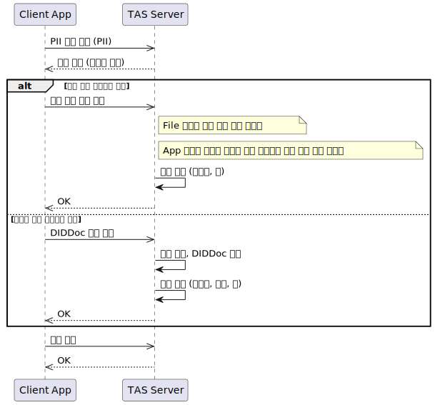
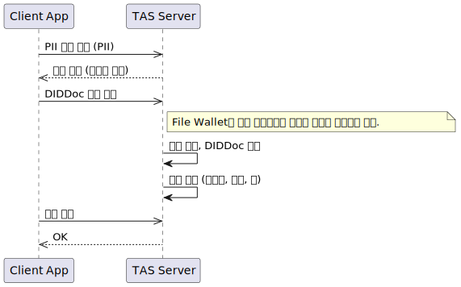
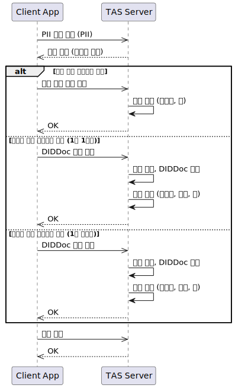

# PII

- 주제 : PII 관리
- 작성 : 오픈소스개발팀
- 일자 : 2024-10-18
- 버전 : v1.0.0

| 버전 | 일자       | 변경         |
| ------- | ---------- | --------------- |
| v1.0.0  | 2024-10-18 | 최초 작성 |

 

## 개요
`TAS`는 `User`의 PII(Personally Identifiable Information)를 저장해야 합니다. PII를 전달받으면 다음과 같이 활용할 수 있습니다.

1. User 등록 프로토콜 중에서 `User`가 이미 등록되어 있는 사용자인지 확인할 수 있습니다.
2. VC 발급 프로토콜 중에서 `TAS`가 `Issuer`에게 PII를 전달할 수 있습니다.

그러나 현재 PII를 받는 과정은 OpenDID의 범위 밖에 있기 때문에, TAS API에는 PII 관련 내용이 포함되어 있지 않습니다.

따라서 `TAS`가 PII를 어떻게 받을 것이고, 어떻게 활용할 것인지에 대한 명확한 설계가 필요합니다.

## PII 사용 시나리오
### PII의 목적
#### 사용자 식별
- `[TAS]` User가 이미 등록된 사용자(User)인지 확인할 수 있습니다.

#### VC 발급에 사용
- `[TAS → Issuer]` VC 발급 시 PII를 전달할 수 있습니다.
  - **정확한 인증:** 사용자의 정확한 신원을 확인하고 인증할 수 있습니다.
  - **신뢰성 강화:** PII를 통해 기발급된 VC 식별자를 관리하며 부정 발급을 방지할 수 있습니다.

### PII를 언제 받아야 하는가?
- `[Wallet → TAS]` DID Document를 전송하기 전에 PII를 받아야 합니다.

## 설계 고려사항
### 데이터 수집 및 저장
- **데이터 보호:** 수집된 PII는 암호화하여 안전하게 저장하고 접근 권한을 제한해야 합니다.
- **법적 준수:** 데이터 수집 및 저장 과정에서 관련 법규와 규정을 준수해야 합니다.
- **데이터 최소화:** 필요한 최소한의 PII만 수집하여 데이터 보호의 원칙을 따릅니다.

### 데이터 활용
- **목적 제한:** 수집된 PII는 명시된 목적 외에는 사용되지 않아야 합니다.
- **사용자 동의:** PII 사용에 대해 사용자로부터 명확한 동의를 받아야 합니다.
- **투명성 제공:** 사용자가 자신의 PII가 어떻게 사용되는지 알 수 있도록 투명성을 제공해야 합니다.

### 데이터 삭제
- **데이터 파기:** 사용자 요청 시 PII를 안전하게 삭제할 수 있는 절차를 마련해야 합니다.
- **데이터 보존:** 법적 요구사항에 따라 일정 기간 동안 데이터를 보존해야 할 경우, 이를 명확히 사용자에게 안내해야 합니다.

## Sequence Diagram
[wallet.md](./wallet.md) 정책 참고

### 공통

### File Wallet

### App Wallet

### Cloud Wallet
