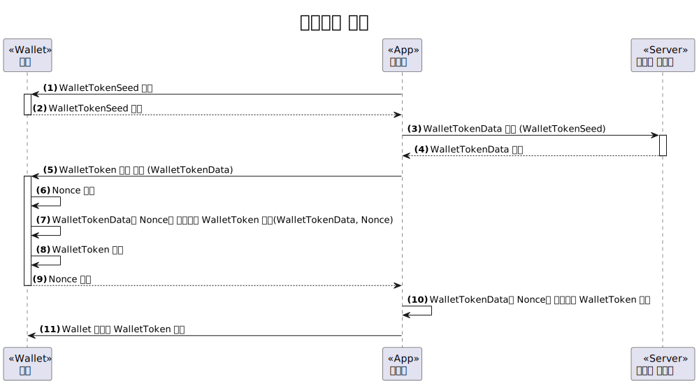
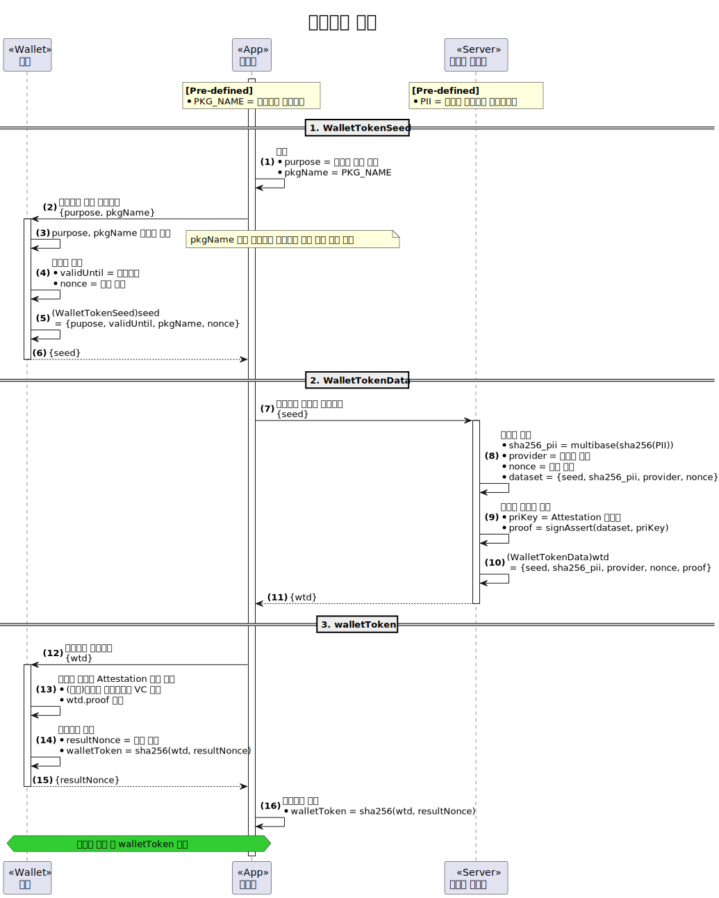
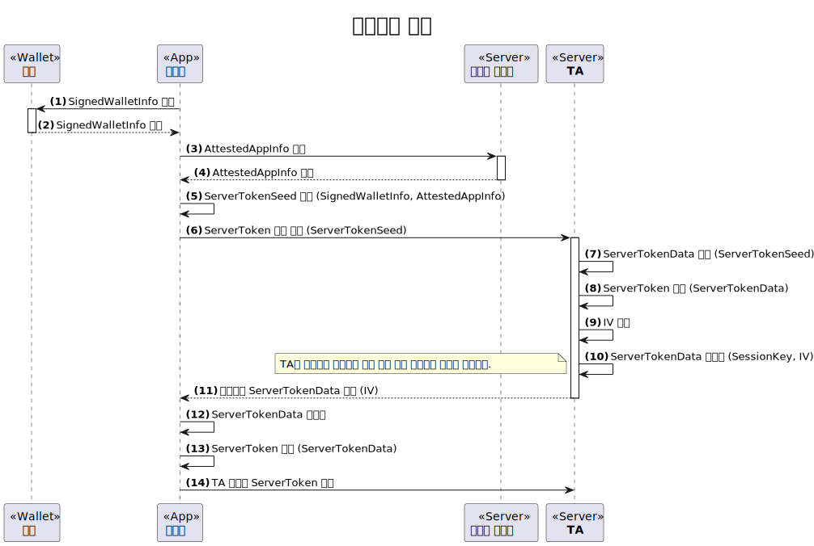
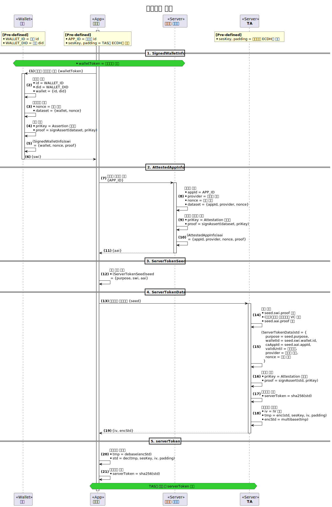

# Open DID Token

- Subject: Open DID Token
- Author: OpenSource Development Team
- Date: 2024-10-18
- Version: v1.0.0

| Version | Date       | Changes         |
| ------- | ---------- | --------------- |
| v1.0.0  | 2024-10-18 | Initial version |

<br>

Open DID uses various tokens to verify client permissions.
This document details the functions and data specifications of the tokens used in Open DID, and systematically organizes the token issuance process.

## Reference Documents

| Reference Name | Document Name                                         | Location                               |
| ---------------| ------------------------------------------------------| -------------------------------------- |
| [OSD]          | OpenDID Schema Definition Language                    |                                        |
| [DATA-SPEC]    | (OpenDID) Data Specification                          |                                        |

## Necessity of Tokens
Tokens are necessary to maintain security and authentication within the Open DID system. The following are the primary reasons for needing tokens:
- **Security**: Tokens are used to securely transmit and store user credentials, protecting sensitive information from exposure.
- **Authentication**: Tokens facilitate the establishment and maintenance of trust between server and client. Issuers can authenticate the client sending the request via tokens.
- **Authorization**: Tokens enable granting access to specific resources or functionalities, aiding in fine-grained access control management.

## Types of Tokens
The tokens used in Open DID include Wallet Token and Server Token.

### Wallet Token
Wallet Token is a token that allows an app to access a wallet, and it is issued by the wallet.

#### Wallet Token Terminology
* **Wallet Token Seed**: An initial seed value generated by the wallet and delivered to the app.
* **Wallet Token Data**: Data generated by the CApp service and delivered to the app, based on the WalletTokenSeed. This is the primary data for generating the Wallet Token.
* **Nonce**: A one-time value generated by the wallet, used in combination with WalletTokenData to generate the Wallet Token.
* **Wallet Token**: A token granting access to the wallet, used by the app to interact with the wallet.

#### Wallet Token Issuance Process
Below is a summary diagram of the Wallet Token issuance process.



1. The CApp requests the WalletTokenSeed from the wallet.
2. The wallet generates the WalletTokenSeed and delivers it to the CApp.
3. The CApp requests the WalletTokenData from the CApp service.
4. The CApp service generates the WalletTokenData and delivers it to the CApp.
5. The CApp requests the wallet to generate a wallet token.
6. The wallet generates a nonce.
7. The wallet combines the nonce with WalletTokenData to generate the Wallet Token.
8. The wallet stores the Wallet Token.
9. The wallet delivers the Wallet Token to the app.
10. The CApp combines the WalletTokenData and nonce to generate the Wallet Token.
11. The CApp submits the Wallet Token whenever it uses the wallet.

#### Detailed Wallet Token Issuance Process


#### Wallet Token Data
Below are the data specifications necessary for generating a Wallet Token. For more details, please refer to [DATA-SPEC].

##### WalletTokenSeed

```c#
def object WalletTokenSeed: "wallet token seed"
{
    + WALLET_TOKEN_PURPOSE "purpose"   : "token usage purpose"
    + utcDatetime          "validUntil": "token expiration date and time"
    + string               "pkgName"   : "CApp package name"
    + multibase            "nonce"     : "wallet nonce", byte_length(16)
}
```

##### WalletTokenData

```c#
def object WalletTokenData: "wallet token data"
{
    + WalletTokenSeed "seed"      : "wallet token seed"
    + multibase       "sha256_pii": "multibase(sha256(personId)) - hashed PII"
    + Provider        "provider"  : "wallet provider information"
    + multibase       "nonce"     : "provider nonce", byte_length(16)
    + AssertProof     "proof"     : "provider proof - wallet provider signature"
}
```

### Server Token
Server Token is a token that allows an app to access services like TA (Trusted Application), issued by the service server.

#### Server Token Terminology
* **Signed Wallet Info**: Signed wallet information provided by the wallet to the CApp, used by TA to verify the wallet.
* **Attested App Info**: Certified app information provided by the CApp service to the CApp, used by TA to verify the CApp.
* **Server Token Seed**: Initial seed value generated by the CApp and delivered to TA, serving as the basis for creating ServerTokenData.
* **Server Token Data**: Data generated by TA and delivered to the CApp, based on the ServerTokenSeed. This is the primary data for generating the Server Token.
* **IV**: Initialization Vector used in the encryption process.
* **Session Key**: Session key between TA and the CApp, exchanged before the server token issuance.
* **Server Token**: A token granting access to the server, used by the CApp to interact with the server.

#### Server Token Issuance Process



1. The CApp requests the SignedWalletInfo from the wallet.
2. The wallet generates the SignedWalletInfo and delivers it to the CApp.
3. The CApp requests the AttestedAppInfo from the CApp service.
4. The CApp service generates the AttestedAppInfo and delivers it to the CApp.
5. The CApp generates the ServerTokenSeed.
6. The CApp requests TA to generate the ServerToken.
7. TA generates the ServerTokenData.
8. TA generates the ServerToken.
9. TA generates the IV.
10. TA encrypts the ServerTokenData.
11. TA delivers the encrypted ServerTokenData to the CApp.
12. The CApp decrypts the ServerTokenData.
13. The CApp generates the ServerToken.
14. The CApp submits the ServerToken whenever it requests TA.

#### Detailed Server Token Issuance Process



#### Server Token Data
Below are the data specifications necessary for generating a Server Token. For more details, please refer to [DATA-SPEC].


##### SignedWalletInfo

```c#
def object SignedWalletInfo: "signed wallet information"
{
    + object "wallet": "wallet information"
    {
        + walletId "id" : "wallet id"
        + did      "did": "wallet DID"
    }
    + multibase   "nonce": "wallet nonce", byte_length(16)
    + AssertProof "proof": "wallet proof - wallet signature"
}
```

##### AttestedAppInfo

```c#
def object AttestedAppInfo: "attested app information"
{
    + appId       "appId"   : "CApp id"
    + Provider    "provider": "CApp provider information"
    + multibase   "nonce"   : "provider nonce", byte_length(16)
    + AssertProof "proof"   : "provider proof - CApp provider signature"
}
```

##### ServerTokenSeed

```c#
def object ServerTokenSeed: "server token seed"
{
    + SERVER_TOKEN_PURPOSE "purpose"   : "token usage purpose"
    + SignedWalletInfo     "walletInfo": "signed wallet information"
    + AttestedAppInfo      "caAppInfo" : "attested CApp information"
}
```

##### ServerTokenData

```c#
def object ServerTokenData: "server token data"
{
    + SERVER_TOKEN_PURPOSE "purpose"   : "token usage purpose"
    + walletId             "walletId"  : "wallet id"
    + appId                "caAppId"   : "CApp id"
    + utcDatetime          "validUntil": "token expiration date and time"
    + Provider             "provider"  : "provider information"
    + multibase            "nonce"     : "provider nonce", byte_length(16)
    + AssertProof          "proof"     : "provider proof - provider signature"
}
```