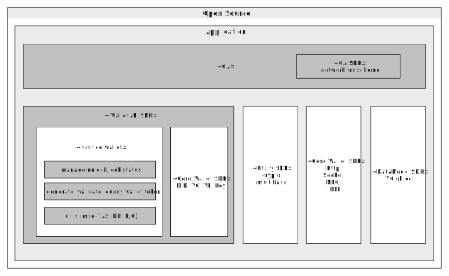

# Wallet
<!-- Individual documents may be merged in the future, so the table of contents is not used. -->

- Subject: Explanation of Wallet Interface
- Author: OpenSource Development Team
- Date: 2024-10-18
- Version: v1.0.0

| Version | Date       | Changes         |
| ------- | ---------- | --------------- |
| v1.0.0  | 2024-10-18 | Initial version |

<br>

Users can create their wallet to securely store and use their digital ID and identity certificates. The wallet supports the following types:

```code
- Local Wallet: Initially supports app-based wallets on smartphones and will expand to TEE-based wallets through collaboration with device manufacturers in the future.
- Remote Wallet: Supports cloud-based wallets for mobility adaptation, functionality scalability, and inclusiveness.
```

### 1. Wallet Classification


|          | Certified App + SDK | Wallet Standalone App | Cloud Wallet |
|----------|----------|----------|----------|
|   Type   |   File   |   File   |   HSM/File   |
|   Relationship (Certified App : Wallet) |   1:1   |   N:1   |   N:1   |
|   Wallet Installation (Initialization)  |   Generated upon installation of CApp (embedded)   |   Install wallet app via deeplink, obtain invocation info of wallet app (AOS: package name, iOS: url scheme)   |   Obtain URL info of wallet, if additional authentication (e.g., FIDO) is required, invoke FIDO authentication app provided by wallet operator to register users (requires CApp modification whenever a cloud wallet is added to list of operators)   |
|   Wallet Creation  |   Create wallet file within CApp, generate and manage device key pairs, create data db table   |   Create wallet file within wallet app, generate and manage device key pairs, create data DB table   |   Create file or generate device key pairs via HSM, add row to Cloud Wallet DB   |
|   Wallet Deletion  |   Restore to pre-initialization state (delete wallet file, delete DB)   |   Delete wallet app   |   Delete row registered in wallet management table (DB)   |
<br>

### 2. Wallet Function (I/F)



#### Define functions for the following features in the wallet interface, with different implementations based on wallet classification:
* Separate service area of wallet (wallet lock, token) and core area (Key, DID, VC, VP)
* For cloud wallet, communicate directly from CApp (requires comm SDK in CApp)
* Wallet lock/unlock
    * Access control for creating objects like DID, VC, VP, and deleting wallets (separate from user authentication required for deletion even when locked)
    * If optional, wallet remains unlocked until passcode is set
    * Wallet inquiry
        * Retrieve wallet management data
    * Wallet deletion
        * Restore wallet to pre-initialization state
        
<br>


### 3. Wallet Management Data
* Manage mobile wallet management data (token, lock) in DB tables
* Manage package info of CApp
* Manage wallet tokens
* Manage wallet ID, CApp package info, wallet status (lock, unlock), wallet token via DB or File

<br>

### 4. Wallet Token Purpose Management
|  | Wallet Token | Server Token |
|----------|----------|----------|
|   Personalized  |   O   |      |
|   Non-personalized |   O   |      |
|   Personalized & Wallet Lock  |   O   |      |
|   Wallet Lock  |   O   |      |
|   DID Issuance  |   O   |   O   |
|   DID Renewal  |   O   |   O   |
|   VC Issuance  |   O   |   O   |
|   DID Issuance & Credential Presentation  |   O   |   O   |
|   VC Deletion  |   O   |   O   |
|   VP Presentation  |   O   |   O   |
|   VC List Query  |   O   |      |
|   VC Details Query  |   O   |      |
|   DID Creation & VC Issuance  |   O   |   O   |

<!-- Empty line for spacing -->
<br>
