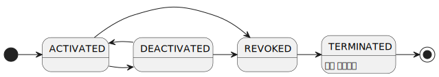
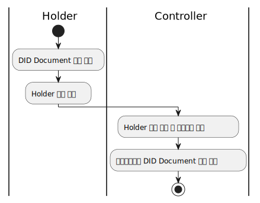

---
puppeteer:
    pdf:
        format: A4
        displayHeaderFooter: true
        landscape: false
        scale: 0.8
        margin:
            top: 1.2cm
            right: 1cm
            bottom: 1cm
            left: 1cm
    image:
        quality: 100
        fullPage: false
---

DID Document format
==

- 주제
    - 엔티티 별 DID Document 종류 정의
    - DID Document 별 사용되는 키 및 관리 데이터 정의
- 작성: 강영호
- 일자: 2024-09-03
- 버전: v1.0.0


개정이력
---

| 버전   | 일자       | 변경 내용                                |
| ------ | ---------- | ---------------------------------------- |
| v1.0.0 | 2024-09-03 | 초안                                     |


<div style="page-break-after: always;"></div>

목차
---

<!-- TOC tocDepth:2..3 chapterDepth:2..6 -->

- [1. 개요](#1-개요)
    - [1.1. 표기법](#11-표기법)
    - [1.2. 참조문서](#12-참조문서)
- [2. 공통 규정](#2-공통-규정)
    - [2.1. 키 용도 (Verification Relationship)](#21-키-용도-verification-relationship)
    - [2.2. 인증수단 (authType)](#22-인증수단-authtype)
    - [2.3. DID Document 생애주기](#23-did-document-생애주기)
    - [2.4. 키 생애주기](#24-키-생애주기)
    - [2.5. DID Document 구조](#25-did-document-구조)
- [3. 엔티티 별 DID Document 명세](#3-엔티티-별-did-document-명세)
    - [3.1. Holder DID Document](#31-holder-did-document)
    - [3.2. Wallet DID Document](#32-wallet-did-document)
    - [3.3. TAS DID Document](#33-tas-did-document)
    - [3.4. Provider DID Document](#34-provider-did-document)

<!-- /TOC -->

<div style="page-break-after: always;"></div>

## 1. 개요

본 문서는 OpenDID에서 사용하는 DID Document에 대하여 설명한다.
기본적인 규정은 W3C의 `[DID-v1.0]`을 준수한다.

아래 사항에 대해서는 본 문서에서 정의한 것을 준수하여야 한다.

- 사용하는 키의 종류 및 용도, 이름, 알고리즘
- Service endpoint

아래 사항은 _본 문서의 범위 밖_ 이므로 구현체에 따라 자유롭게 정의할 수 있다.

- 키의 유효기간 및 키 세대교체 방법
- DID Document의 생성 및 변경 절차


### 1.1. 표기법

#### 1.1.1. JSON 데이터 표기법

문서형식이나 입출력 데이터를 JSON 형식으로 정의 시 별도 문서인 `[OSD]`의 규정을 따른다.

#### 1.1.2. 공식 및 기타 표기

##### 1.1.2.1. JSON 멤버 참조

JSON 형식으로 정의된 문서 내 특정 멤버나 값을 참조하는 규칙은 다음과 같다.

■ 샘플 JSON

```json
{
    "name": "value",
    "array": ["A", "B", "C"],
    "obj": {
        "attr1": "value1",
        "attr2": "value2"
    }
}
```

- 유닉스 경로와 같이 슬래시로 부모/자식 관계를 나타낸다.
- 문서의 최상위 경로는 유닉스의 home path와 같이 `~`을 사용한다.
    - `~/name`, `~/obj/attr`
- 상대적 경로는 `.`, `..`을 사용한다.
    - `.`: 설명하고 있는 대상과 같은 계층
    - `..`: 설명하고 있는 대상의 상위 계층
- 배열은 `[<index>]`로 표시한다.
    - `~/array[0]` → "A"

### 1.2. 참조문서

| 참조명          | 문서명                                      | 위치                                 |
| --------------- | ------------------------------------------- | ------------------------------------ |
| [DID-v1.0]      | Decentralized Identifiers (DIDs) v1.0       | https://www.w3.org/TR/did-core/      |
| [DID-IMPL-v1.0] | DID Implementation Guide v1.0               | https://www.w3.org/TR/did-imp-guide/ |
| [OSD]           | OpenDID Schema Definition Language          |                                      |
| [DATA-SPEC]     | (OpenDID) 데이터 명세서(Data Specification) |                                      |


<div style="page-break-after: always;"></div>

## 2. 공통 규정

### 2.1. 키 용도 (Verification Relationship)

`[DID-v1.0]`에 정의된 키 용도는 아래 목록과 같으며, 본 규격은 이를 준수한다.
즉, 용도에 맞게 키를 선언하고 해당 용도로만 키를 사용하도록 강제한다.


| 이름                  | 식별자                 | 설명                                   |
| --------------------- | ---------------------- | -------------------------------------- |
| Assertion             | `assertionMethod`      | proof 서명                             |
| Authentication        | `authentication`       | DID Subject를 인증                     |
| Key Agreement         | `keyAgreement`         | 암호화 통신을 위한 키교환              |
| Capability Invocation | `capabilityInvocation` | 암호화 기능 수행(DID Document 갱신 등) |
| Capability Delegation | `capabilityDelegation` | 암호화 기능을 제3자에게 위임           |


### 2.2. 인증수단 (authType)

인증수단은 해당 키를 사용하기 위하여 어떤 인증을 수행해야 하는지를 의미한다.
인증수단은 아래 표와 같이 비트로 의미부여한 int32 타입의 숫자로 설정한다.

| b32 ~ b4 |  b3   |  b2   |  b1   | 설명           |
| :------: | :---: | :---: | :---: | -------------- |
|    -     | **x** | **x** | **x** | **인증수단**   |
|    -     |   0   |   0   |   1   | 0x0001: 무인증 |
|    -     |   0   |   1   |   0   | 0x0002: PIN    |
|    -     |   1   |   0   |   0   | 0x0004: BIO    |

- 무인증: 인증없이 키 사용
- PIN: PIN 입력 후 키 사용
- BIO: 지문이나 FaceID 인식 후 키 사용

### 2.3. DID Document 생애주기

DID Document의 생애주기는 아래 표 및 그림과 같다.

| 상태값        | 상태명 | `~/deactivated` | 설명                                                                      |
| ------------- | ------ | :-------------: | ------------------------------------------------------------------------- |
| `ACTIVATED`   | 활성   |     `false`     | • 사용이 가능한 상태<br>• 비활성, 폐기 상태로 전이 가능                   |
| `DEACTIVATED` | 비활성 |     `true`      | • Controller에 의해 사용이 일시 중단된 상태<br>• 활성 상태로 전이 가능    |
| `REVOKED`     | 폐기   |       N/A       | • 더이상 사용하지 않아 폐기한 상태<br>• 다른 상태로 전이 불가능           |
| `TERMINATED`  | 말소   |       N/A       | • 부인방지로도 사용하지 못하도록 말소한 상태<br>• 말소 시작일자 지정 필요 |




DID Document는 신뢰저장소 내에서 아래의 두 가지 구분된 목록으로 관리되어야 한다.

- 정상 목록(DID In-service List)
- 폐기 목록(DID Revocation List)

DID Document의 생애주기와 관련하여 아래의 규칙을 적용한다.

1. 최초 DID Document 등록 시 정상 목록에 등록한다.
1. 폐기 시 폐기 목록으로 이관한다.
1. 폐기 목록으로 이관된 DID Document는 정상 목록으로 되돌릴 수 없다.
1. 정상 목록에 있는 DID Document만 `deactivated` 값을 변경할 수 있다.
1. `deactivated`는 DID 소유자의 동의없이 Controller에 의해 변경이 가능하다.
1. `deactivated` 값만 변경할 때는 `versionId`는 그대로 유지한다.
1. `deactivated` 이외 값을 변경할 때는 다음 조건을 만족하여야 한다.
    - `versionId`가 증가해야 한다.
    - DID 소유자의 서명을 검증하여 동의여부를 확인하여야 한다.
1. 말소는 폐기의 한 형태이나 다음과 같은 추가 조건이 부가된다.
    - 말소 요청 시 말소 시작일자가 지정되어야 한다.(말소 요청일과는 별개)
    - 말소 시작일자 이후로는 모든 용도의 키 사용이 중지된다.

### 2.4. 키 생애주기

키 생애주기는 DID Document의 생애주기에 따르며 아래 규칙을 적용한다.

- 부인방지를 위해 서명을 검증할 때는 키 상태와 무관하게 사용이 가능하다.
- 키 상태가 `ACTIVATED`일 때는 어떤 용도로든 사용이 가능하다.
- 키 상태가 `DEACTIVATED`일 때는 Verifier의 정책에 따른다.
- 키 상태가 `REVOKED`일 때는 부인방지 이외의 용도로 사용할 수 없다.
- 키 상태가 `TERMINATED`일 때는 부인방지 용도로도 사용할 수 없다.

| 용도 / 상태          | ACTIVATED | DEACTIVATED          | REVOKED | TERMINATED                      |
| -------------------- | --------- | -------------------- | ------- | ------------------------------ |
| VC 이슈어 서명 검증  | 가능      | Verifier 정책에 따름 | 불가능  | 불가능                         |
| VP Holder 서명 검증  | 가능      | Verifier 정책에 따름 | 불가능  | 불가능                         |
| 부인방지용 서명 검증 | 가능      | 가능                 | 가능    | 불가능<br>(말소 시작일자 이후) |


### 2.5. DID Document 구조

본 문서 명시되지 않은 데이터 타입, 상수 및 객체 정의는 `[DATA-SPEC]`을 참조한다.

#### 2.5.1. 데이터 타입 및 상수

```c#
def string did          : "DID id. ex: 'did:omn:123'"
def string didVersionId : "DID version id. ex: '1', '2'", regex(/[0-9]+/)
def string didKeyId     : "DID key id. ex: 'pin'"
def string didServiceId : "DID service id. ex: 'homepage'"
def string didKeyUrl    : "DID key URL. ex: 'did:omn:123?versionId=1#pin'"
def string didServiceUrl: "DID service URL. ex: 'did:omn:123?versionId=1#homepage'"

def enum AUTH_TYPE: "인증수단"
{
    1: "Free - 무인증",
    2: "PIN - 비밀번호 인증",
    4: "BIO - 생체인증",
}

def enum DID_KEY_TYPE: "DID key type"
{
    "RsaVerificationKey2018",
    "Secp256k1VerificationKey2018",
    "Secp256r1VerificationKey2018",
}

def enum PROOF_TYPE: "proof type"
{
    "RsaSignature2018",
    "Secp256k1Signature2018",
    "Secp256r1Signature2018",
}

def enum PROOF_PURPOSE: "proof purpose"
{
    "assertionMethod",
    "authentication",
    "keyAgreement",
    "capabilityInvocation",
    "capabilityDelegation",
}

def enum DID_SERVICE_TYPE: "service type"
{
    "LinkedDomains"     : "site URL",
    "CredentialRegistry": "URL to query verifiable credentials",
}
```

#### 2.5.2. `DidDoc` object

```c#
def object DidDoc: "DID Document"
{
    //---------------------------------------------------------------------------
    // Meta
    //---------------------------------------------------------------------------
    + array(url)   "@context"   : "JSON-LD context", value(["https://www.w3.org/ns/did/v1"])
    + did          "id"         : "DID owner's did"
    + did          "controller" : "DID controller's did"
    + utcDatetime  "created"    : "created datetime"
    + utcDatetime  "updated"    : "last updated datetime"
    + didVersionId "versionId"  : "DID version id"
    + bool         "deactivated": "true: deactivated, false: activated", default(false)

    //---------------------------------------------------------------------------
    // DID key list
    //---------------------------------------------------------------------------
    + array(object) "verificationMethod": "list of DID key with public key value", min_count(1)
    {
        + didKeyId     "id"                : "key id. ex: 'pin'"
        + DID_KEY_TYPE "type"              : "key type"
        + did          "controller"        : "key controller's did"
        + multibase    "publicKeyMultibase": "public key value"
        //--- 이하 비표준 항목 ---
        + AUTH_TYPE    "authType"          : "required authentication to use the key"
    }

    // 용도별 키 목록
    // - 모든 'didKeyId'는 '~/verificationMethod[]/id'에 선언되어 있어야 함
    - array(didKeyId) "assertionMethod"     : "list of Assertion key name", emptiable(false)
    - array(didKeyId) "authentication"      : "list of Authentication key name", emptiable(false)
    - array(didKeyId) "keyAgreement"        : "list of Key Agreement key name", emptiable(false)
    - array(didKeyId) "capabilityInvocation": "list of Capability Invocation key name", emptiable(false)
    - array(didKeyId) "capabilityDelegation": "list of Capability Delegation key name", emptiable(false)

    //---------------------------------------------------------------------------
    // Service endpoint
    //---------------------------------------------------------------------------
    - array(object) "service": "list of service", min_count(1)
    {
        + didServiceId     "id"             : "service id"  // ex: "homepage"
        + DID_SERVICE_TYPE "type"           : "service type"
        + array(url)       "serviceEndpoint": "list of URL to the service", min_count(1)
    }
}
```

#### 2.5.3. OwnerDidDoc

`DidDoc`에 소유자 키 서명을 추가한 것이다.

```c#
def object OwnerDidDoc: "DID Document with the owner proofs"
{
    @spread(DidDoc)  // DidDoc 객체 내 모든 멤버를 포함하라는 의미 (중복선언 방지)

    //---------------------------------------------------------------------------
    // Proof - 비표준 항목
    //---------------------------------------------------------------------------
    // DID 소유자가 controller에 등록/수정을 요청할 때만 필요
    + select(1)
    {
        // when 키개수 = 1
        ^ Proof        "proof" : "owner proof"
        // when 키개수 >= 2
        ^ array(Proof) "proofs": "list of owner proof", min_count(2)
    }
}
```

`~/proofs[]`는 키 용도가 Key Agreement가 아닌 모든 키에 대해 생성한다.

proof는 DID 소유자가 controller에게 등록 및 수정을 요청할 때는 반드시 포함하나
controller에 의해 신뢰저장소에 저장할 때에는 검증 후 이를 제거하고 저장하므로 DID Document를
조회하였을 때는 이 proof 값이 나타나지 않는다.




<div style="page-break-after: always;"></div>

## 3. 엔티티 별 DID Document 명세

### 3.1. Holder DID Document

Holder는 발급 사업자 및 TAS로부터 VC를 발급받는 주체를 말하여, 보통 "사용자"라는 용어로 칭한다.

#### 3.1.1. 주요 속성

- `~/controller`: TAS

#### 3.1.2. 공개키

| id         | 이름   | 필수 | 인증수단   | 용도                            | 설명                            |
| ---------- | ------ | :--: | ---------- | ------------------------------- | ------------------------------- |
| `pin`      | PIN키  |  Y   | 2 (PIN)    | • Assertion<br>• Authentication | PIN 입력으로 키 사용            |
| `bio`      | BIO키  |  N   | 4 (BIO)    | • Assertion<br>• Authentication | 지문 or FaceID 인증으로 키 사용 |
| `keyagree` | 키교환 |  Y   | 1 (무인증) | • Key Agreement                 | 키교환을 위한 ECC 공개키 서명   |


#### 3.1.3. Service

`~/service`는 DID Subject와 커뮤니케이션 하기 위한 수단을 제공한다.
Holder가 원하는 경우 Holder의 홈페이지 URL을 등록할 수 있다.

| id               | type               | 필수 | 설명                |
| ---------------- | ------------------ | :--: | ------------------- |
| `homepage`       | LinkedDomains      |  N   | 홈페이지 URL        |


### 3.2. Wallet DID Document

Holder wallet에 대한 DID Document 규칙을 정의한다.

#### 3.2.1. 주요 속성

- `~/controller`: TAS

#### 3.2.2. 공개키

| id         | 이름   | 필수 | 인증수단   | 용도             | 설명                                                            |
| ---------- | ------ | :--: | ---------- | ---------------- | --------------------------------------------------------------- |
| `assert`   | 서명키 |  Y   | 1 (무인증) | • Assertion      | Wallet Token 생성용 데이터 서명<br>(Wallet attestation 키 대체) |
| `auth`     | 인증키 |  Y   | 1          | • Authentication | DID Auth 등 인증 시 사용                                        |
| `keyagree` | 키교환 |  Y   | 1          | • Key Agreement  | 키교환을 위한 ECC 공개키 서명                                   |


### 3.3. TAS DID Document

#### 3.3.1. 주요 속성

- `~/controller`: TAS

#### 3.3.2. 공개키

| id         | 이름   | 필수 | 인증수단   | 용도                    | 설명                          |
| ---------- | ------ | :--: | ---------- | ----------------------- | ----------------------------- |
| `assert`   | 서명키 |  Y   | 1 (무인증) | • Assertion             | VC 발급 등 서명 시 사용       |
| `auth`     | 인증키 |  Y   | 1          | • Authentication        | DID Auth 등 인증 시 사용      |
| `invoke`   | 수행키 |  Y   | 1          | • Capability Invocation | 관리기능 수행 시 사용         |
| `keyagree` | 키교환 |  Y   | 1          | • Key Agreement         | 키교환을 위한 ECC 공개키 서명 |


#### 3.3.3. Service

`~/service`는 DID Subject와 커뮤니케이션 하기 위한 수단을 제공한다.
Holder가 원하는 경우 Holder의 홈페이지 URL을 등록할 수 있다.

| id               | type               | 필수 | 설명                |
| ---------------- | ------------------ | :--: | ------------------- |
| `homepage`       | LinkedDomains      |  N   | 홈페이지 URL        |


### 3.4. Provider DID Document

Holder, Wallet, TAS를 제외한 모든 사업자에 대한 DID Document 규칙을 정의한다.

#### 3.4.1. 주요 속성

- `~/controller`: TAS

#### 3.4.2. 공개키

| id         | 이름   | 필수 | 인증수단   | 용도             | 설명                          |
| ---------- | ------ | :--: | ---------- | ---------------- | ----------------------------- |
| `assert`   | 서명키 |  Y   | 1 (무인증) | • Assertion      | VC 발급 등 서명 시 사용       |
| `auth`     | 인증키 |  Y   | 1          | • Authentication | DID Auth 등 인증 시 사용      |
| `keyagree` | 키교환 |  Y   | 1          | • Key Agreement  | 키교환을 위한 ECC 공개키 서명 |


#### 3.4.3. Service

`~/service`는 DID Subject와 커뮤니케이션 하기 위한 수단을 제공한다.
Holder가 원하는 경우 Holder의 홈페이지 URL을 등록할 수 있다.

| id               | type               | 필수 | 설명                |
| ---------------- | ------------------ | :--: | ------------------- |
| `homepage`       | LinkedDomains      |  N   | 홈페이지 URL        |

