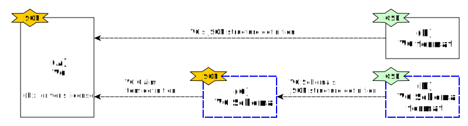

---
puppeteer:
    pdf:
        format: A4
        displayHeaderFooter: true
        landscape: false
        scale: 0.8
        margin:
            top: 1.2cm
            right: 1cm
            bottom: 1cm
            left: 1cm
    image:
        quality: 100
        fullPage: false
---
VC Schema format
==

- Subject
    - Definition of VC Schema Structure
- Author: Kang Young-ho
- Date: 2024-09-03
- Version: v1.0.0

Revision History
---

| Version | Date       | Changes         |
| ------- | ---------- | --------------- |
| v1.0.0  | 2024-09-03 | Initial version |


<div style="page-break-after: always;"></div>

Table of Contents
---

<!-- TOC tocDepth:2..4 chapterDepth:2..6 -->

- [VC Schema format](#vc-schema-format)
  - [Revision History](#revision-history)
  - [Table of Contents](#table-of-contents)
  - [1. Overview](#1-overview)
    - [1.1. Reference Documents](#11-reference-documents)
  - [2. VC Schema Structure](#2-vc-schema-structure)
    - [2.1. Data Types and Constants](#21-data-types-and-constants)
    - [2.2. `ClaimDef` object](#22-claimdef-object)
    - [2.3. `VcSchema` object](#23-vcschema-object)
  - [3. Example](#3-example)
    - [3.1. Woosan University Student ID VC](#31-woosan-university-student-id-vc)
    - [3.2. `https://woosan.ac.kr/schema/student_id_v2.json`](#32-httpswoosanackrschemastudent_id_v2json)
    - [3.3. `https://opendid.org/schema/vc.osd`](#33-httpsopendidorgschemavcosd)

<!-- /TOC -->


<div style="page-break-after: always;"></div>


## 1. Overview

This document defines the structure and related information of the VC (Verifiable Credentials) Schema used in OpenDID.

The VC Schema includes the following information.

- VC title and description
- VC metadata (version, language)
- Claims to be issued

The VC Schema format defines the method to write the VC Schema in JSON format.
Similarly, the VC format defines the method to write the VC in JSON format.
The relationship is illustrated in the diagram below.



- (A) VC
    - A certificate issued by the issuer to the holder
- (B) VC format
    - Definition of the structure of the VC
- (C) VC Schema
    - Information on which claims a specific VC has
- (D) VC Schema format
    - Definition of the structure of the VC Schema

The purpose of this document is to define the VC Schema format, which is a document format for defining VC Schemas.
All formats are defined in OSD (OpenDID Schema Definition Language).

### 1.1. Reference Documents

| Reference Name | Document Name                             | Location |
| -------------- | ----------------------------------------- | -------- |
| [OSD]          | OpenDID Schema Definition Language        |          |
| [DATA-SPEC]    | (OpenDID) Data Specification              |          |
| [VC-FORMAT]    | (OpenDID) VC format                       |          |


<div style="page-break-after: always;"></div>


## 2. VC Schema Structure

For items not defined here, refer to `[DATA-SPEC]`.

### 2.1. Data Types and Constants

```c#
def string identifier : "identifier", regex(/[a-zA-Z_][0-9a-zA-Z_]*?/)
def string url        : "URL"
def string namespaceId: "namespace id"

def enum CLAIM_TYPE: "Claim Type"
{
    "text", "image", "document",
}

def enum CLAIM_FORMAT: "Claim Format"
{
    // text
    "plain", "html", "xml", "csv",

    // image
    "png", "jpg", "gif",
    
    // document
    "txt", "pdf", "word",
}

def enum LOCATION: "Claim Source Data Location"
{
    "inline": "Value included in 'value' within VC",
    "remote": "External link URL",
    "attach": "Separate attachment",
}

def enum LANGUAGE: "Language Code"
{
    "ko", "en"
}
```

### 2.2. `ClaimDef` object

The `ClaimDef` object is used to define the claims that will be included in the VC Schema.
It differs from the `Claim` object in the following aspects:

- `id` vs `code`
    - Claim `code` = Claim `namespace` + Claim `id`
- Only `ClaimDef` has the `required` and `description` attributes.

```c#
def object ClaimDef: "Claim Definition"
{
    + identifier   "id"         : "Claim Identifier"
    + string       "caption"    : "Claim Name"
    + CLAIM_TYPE   "type"       : "Claim Type"
    + CLAIM_FORMAT "format"     : "Claim Format"
    - bool         "hideValue"  : "Hide Claim Value", default(false)
    - LOCATION     "location"   : "Claim Source Location", default("inline")
    - bool         "required"   : "Required Claim", default(true)
    - string       "description": "Claim Description", default("")
    - object       "i18n"       : "Claim Name in Other Languages"
    {
        + string $lang: "Claim Name in Other Language", variable_type(LANGUAGE), min_extend(1)
    }
}
```

### 2.3. `VcSchema` object

The `VcSchema` is the VC Schema object.
Claims should be declared grouped by namespace, with the default namespace having an `id` of an empty string.

```c#
def object VcSchema: "VC schema"
{
    + url    "@id"        : "VC schema URL"
    + url    "@schema"    : "VC Schema format URL"
    + string "title"      : "VC Schema Name"
    + string "description": "VC Schema Description"

    + object "metadata"   : "VC metadata"
    {
        + LANGUAGE "language"     : "VC Default Language"
        + string   "formatVersion": "VC Format Version"
    }

    + object "credentialSubject": "Claim Information within CredentialSubject"
    {
        + array(object) "claims": "Claims by Namespace"
        {
            + object "namespace": "Claim Namespace"
            {
                + namespaceId "id"  : "Claim Namespace", emptiable(true)
                + string      "name": "Namespace Name"
                - url         "ref" : "Information Page URL for Namespace"
            }
            + array(ClaimDef) "items": "List of Claim Definitions", min_count(1)
        }
    }
}
```

- `~/@id`: JSON encoded VC schema URL
- `~/@schema`: URL of the file defining the VC Schema format
- `~/credentialSubject/claims[]/namespace`
    - `id`: Namespace identifier
        - The namespace `id` should not be duplicated within a single VC Schema.
        - An empty string value (`""`) is allowed, which is referred to as the default namespace.
    - `ref`: URL of the web page providing detailed information about the namespace


<div style="page-break-after: always;"></div>

## 3. Example

This chapter provides additional explanations with specific examples to help understand complex concepts such as VC and VC Schema.
The scenario is as follows:

- The issuer, "Woosan University," issues a "Woosan University Student ID VC" to the student "Hong Gil-dong."
- The claims in the student ID VC are decided as follows:
    - (ISO/IEC 18013 standard) Family name, Given name, Date of birth, Age, Portrait
    - (OpenDID v1 standard) Personal identifier
    - (Woosan University v2 standard) Student ID, School name, Logo image
- These claims are written in JSON according to the OpenDID VC Schema format.
- The OpenDID VC Schema format is identified by `https://opendid.org/schema/vc.osd`.
- The VC Schema is written and registered at `https://woosan.ac.kr/schema/student_id_v2.json`.

### 3.1. Woosan University Student ID VC

```json
{
    "@context": [
        "https://www.w3.org/ns/credentials/v2"
    ],
    "id": "07f99562-fb73-4377-b5d3-82025873539f",
    "type": ["VerifiableCredential", "StudentIdCredential"],
    "issuer": "did:example:woosanuniv",
    "issuanceDate": "2010-01-01T19:23:24Z",
    "credentialSubject": {
        "id": "did:example:ebfeb1f712ebc6f1c276e12ec21",
        "claims": [
            {
                "code": "org.iso.18013.5.family_name",
                "caption": "Family Name",
                "value": "Hong",
                "type": "text",
                "format": "plain"
            },
            {
                "code": "org.iso.18013.5.given_name",
                "caption": "Given Name",
                "value": "Gil-dong",
                "type": "text",
                "format": "plain"
            },
            {
                "code": "org.iso.18013.5.portrait",
                "caption": "Portrait",
                "type": "image",
                "format": "jpg",
                "value": "..."
            }
            // ...omitted for brevity...
        ]
    },
    "credentialSchema": {
        "id": "https://woosan.ac.kr/schema/student_id_v2.json",
        "type": "OsdSchemaCredential"
    }
}
```

### 3.2. `https://woosan.ac.kr/schema/student_id_v2.json`

```json
{
    "@id": "https://woosan.ac.kr/schema/student_id_v2.json",
    "@schema": "https://opendid.org/schema/vc.osd",
    "title": "Woosan University Student ID",
    "description": "Woosan University Student ID VC",
    "metadata": {
        "language": "ko",
        "formatVersion": "1.0"
    },
    "credentialSubject": {
        "claims": [
            {
                "namespace": {
                    "id"  : "org.iso.18013.5",
                    "name": "ISO/IEC 18013-5:2021 - Personal identification",
                    "ref" : "https://www.iso.org/standard/69084.html"
                },
                "items": [
                    {"id": "family_name", "caption": "Family Name", "type": "text", "format": "plain"},
                    {"id": "given_name", "caption": "Given Name", "type": "text", "format": "plain"},
                    {"id": "birth_date", "caption": "Date of Birth", "type": "text", "format": "plain"},
                    {"id": "age_in_years", "caption": "Age", "type": "text", "format": "plain", "required": false},
                    {"id": "portrait", "caption": "Portrait", "type": "image", "format": "jpg"}
                ]
            },
            {
                "namespace": {
                    "id"  : "org.opendid.v1",
                    "name": "OpenDID v1",
                    "ref" : "http://opendid.org/schema/v1/claim"
                },
                "items": [
                    {
                        "id": "pii", "caption": "Personal Identifier", "type": "text", "format": "plain",
                        "hideValue": false,
                        "i18n": {
                            "en": "Personally Identifiable Information"
                        },
                        "description": "Different personal identifiers for each country, with CI used in Korea."
                    }
                ]
            },
            {
                "namespace": {
                    "id"  : "kr.ac.woosan.v2",
                    "name": "Woosan University Claims v2"
                },
                "items": [
                    {"id": "student_id", "caption": "Student ID", "type": "text", "format": "plain"},
                    {"id": "school_name", "caption": "School Name", "type": "text", "format": "plain"},
                    {"id": "school_logo", "caption": "Logo Image", "type": "image", "format": "png", "location": "remote", "required": false}
                ]
            },
            {
                "namespace": {
                    "id"  : "",
                    "name": "(default)"
                },
                "items": [
                    // ...omitted for brevity...
                ]
            }
        ]
    }
}
```

### 3.3. `https://opendid.org/schema/vc.osd`

```c#
def string identifier : "identifier", regex(/[a-zA-Z_][0-9a-zA-Z_]*?/)
def string url        : "URL"
def string namespaceId: "namespace id"

def enum CLAIM_TYPE: "Claim Type"
{
    "text", "image", "document",
}

def enum CLAIM_FORMAT: "Claim Format"
{
    // text
    "plain", "html", "xml", "csv",

    // image
    "png", "jpg", "gif",
    
    // document
    "txt", "pdf", "word",
}

def enum LOCATION: "Claim Source Data Location"
{
    "inline": "Value included in 'value' within VC",
    "remote": "External link URL",
    "attach": "Separate attachment",
}

def enum LANGUAGE: "Language Code"
{
    "ko", "en"
}

def object ClaimDef: "Claim Definition"
{
    + identifier   "id"         : "Claim Identifier"
    + string       "caption"    : "Claim Name"
    + CLAIM_TYPE   "type"       : "Claim Type"
    + CLAIM_FORMAT "format"     : "Claim Format"
    - bool         "hideValue"  : "Hide Claim Value", default(false)
    - LOCATION     "location"   : "Claim Source Location", default("inline")
    - bool         "required"   : "Required Claim", default(true)
    - string       "description": "Claim Description", default("")
    - object       "i18n"       : "Claim Name in Other Languages"
    {
        + string $lang: "Claim Name in Other Language", variable_type(LANGUAGE), min_extend(1)
    }
}

def object VcSchema: "VC schema"
{
    + url    "@id"        : "VC schema URL"
    + url    "@schema"    : "VC Schema format URL"
    + string "title"      : "VC Schema Name"
    + string "description": "VC Schema Description"

    + object "metadata"   : "VC metadata"
    {
        + LANGUAGE "language"     : "VC Default Language"
        + string   "formatVersion": "VC Format Version"
    }

    + object "credentialSubject": "Claim Information within CredentialSubject"
    {
        + array(object) "claims": "Claims by Namespace"
        {
            + object "namespace": "Claim Namespace"
            {
                + namespaceId "id"  : "Claim Namespace", emptiable(true)
                + string      "name": "Namespace Name"
                - url         "ref" : "Information Page URL for Namespace"
            }
            + array(ClaimDef) "items": "List of Claim Definitions", min_count(1)
        }
    }
}
```
