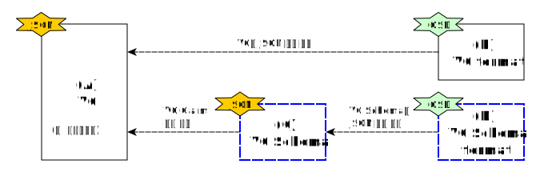

---
puppeteer:
    pdf:
        format: A4
        displayHeaderFooter: true
        landscape: false
        scale: 0.8
        margin:
            top: 1.2cm
            right: 1cm
            bottom: 1cm
            left: 1cm
    image:
        quality: 100
        fullPage: false
---

VC Schema format
==

- 주제
    - VC Schema 구조 정의
- 작성: 강영호
- 일자: 2024-09-03
- 버전: v1.0.0

개정이력
---

| 버전   | 일자       | 변경 내용 |
| ------ | ---------- | --------- |
| v1.0.0 | 2024-09-03 | 초안      |


<div style="page-break-after: always;"></div>

목차
---

<!-- TOC tocDepth:2..4 chapterDepth:2..6 -->

- [VC Schema format](#vc-schema-format)
  - [개정이력](#개정이력)
  - [목차](#목차)
  - [1. 개요](#1-개요)
    - [1.1. 참조문서](#11-참조문서)
  - [2. VC Schema 구조](#2-vc-schema-구조)
    - [2.1. 데이터 타입 및 상수](#21-데이터-타입-및-상수)
    - [2.2. `ClaimDef` object](#22-claimdef-object)
    - [2.3. `VcSchema` object](#23-vcschema-object)
  - [3. 예시](#3-예시)
    - [3.1. 우산대 학생증 VC](#31-우산대-학생증-vc)
    - [3.2. `https://woosan.ac.kr/schema/student_id_v2.json`](#32-httpswoosanackrschemastudent_id_v2json)
    - [3.3. `https://opendid.org/schema/vc.osd`](#33-httpsopendidorgschemavcosd)

<!-- /TOC -->


<div style="page-break-after: always;"></div>

## 1. 개요

본 문서는 OpenDID에서 사용하는 VC(Verifiable Crendentials) Schema의 구조와 관련 정보를 정의한다.

VC Schema는 다음의 정보를 포함한다.

- VC 제목 및 설명
- VC metadata (버전, 언어)
- 발급할 클레임

VC Schema format은 VC Schema를 JSON 형식으로 작성하기 위한 방법을 정의한다.
이와 마찬가지로 VC format은 VC를 JSON 형식으로 작성하기 위한 방법을 정의한다.
이 관계를 아래 그림으로 나타내었다.



- (A) VC
    - 이슈어가 holder에게 발급해주는 증명서
- (B) VC format
    - VC의 구조에 대한 정의
- (C) VC Schema
    - 특정 VC가 어떤 클레임을 가지는지에 대한 정보
- (D) VC Schema format
    - VC Schema의 구조에 대한 정의

본 문서는 VC Schema를 정의하기 위한 문서 형식인 VC Schema format을 정의하는 것을 목적으로 한다.
format은 모두 OSD (OpenDID Schema Definition Language)로 정의한다.

### 1.1. 참조문서

| 참조명      | 문서명                                      | 위치 |
| ----------- | ------------------------------------------- | ---- |
| [OSD]       | OpenDID Schema Definition Language          |      |
| [DATA-SPEC] | (OpenDID) 데이터 명세서(Data Specification) |      |
| [VC-FORMAT] | (OpenDID) VC format                         |      |


<div style="page-break-after: always;"></div>

## 2. VC Schema 구조

여기에 정의되지 않은 항목은 `[DATA-SPEC]`을 참조한다.

### 2.1. 데이터 타입 및 상수

```c#
def string identifier : "identifier", regex(/[a-zA-Z_][0-9a-zA-Z_]*?/)
def string url        : "URL"
def string namespaceId: "namespace id"

def enum CLAIM_TYPE: "클레임 타입"
{
    "text", "image", "document",
}

def enum CLAIM_FORMAT: "클레임 포맷"
{
    // text
    "plain", "html", "xml", "csv",

    // image
    "png", "jpg", "gif",
    
    // document
    "txt", "pdf", "word",
}

def enum LOCATION: "클레임 원본 데이터 위치"
{
    "inline": "VC 내 'value'에 값 포함",
    "remote": "외부 링크 URL",
    "attach": "별도의 첨부파일",
}

def enum LANGUAGE: "언어 코드"
{
    "ko", "en"
}
```

### 2.2. `ClaimDef` object

`ClaimDef` object는 VC Schema에 포함될 클레임을 정의하는데 사용된다.
`Claim` object와는 다음의 부분에서 차이가 있으니 주의하여야 한다.

- `id` vs `code`
    - Claim `code` = Claim `namespace` + Claim `id`
- `required`, `description` 속성은 `ClaimDef`만 가지고 있다.

```c#
def object ClaimDef: "클레임 정의"
{
    + identifier   "id"         : "클레임 식별자"
    + string       "caption"    : "클레임 이름"
    + CLAIM_TYPE   "type"       : "클레임 타입"
    + CLAIM_FORMAT "format"     : "클레임 포맷"
    - bool         "hideValue"  : "클레임 값 숨김 여부", default(false)
    - LOCATION     "location"   : "클레임 원본 위치", default("inline")
    - bool         "required"   : "필수 클레임 여부", default(true)
    - string       "description": "클레임 설명", default("")
    - object       "i18n"       : "기타 언어의 클레임 이름"
    {
        + string $lang: "기타언어 클레임 이름", variable_type(LANGUAGE), min_extend(1)
    }
}
```

### 2.3. `VcSchema` object

`VcSchema`는 VC Schema object이다.
클레임은 네임스페이스 별로 묶어서 선언하여야 하며, 디폴트 네임스페이스는 `id`가 빈문자열이다.

```c#
def object VcSchema: "VC schema"
{
    + url    "@id"        : "VC schema URL"
    + url    "@schema"    : "VC Schema format URL"
    + string "title"      : "VC Schema 이름"
    + string "description": "VC Schema 설명"

    + object "metadata"   : "VC metadata"
    {
        + LANGUAGE "language"     : "VC 기본 언어"
        + string   "formatVersion": "VC format 버전"
    }

    + object "credentialSubject": "credentialSubject 내 클레임 정보"
    {
        + array(object) "claims": "namespace 별 클레임"
        {
            + object "namespace": "클레임 namespace"
            {
                + namespaceId "id"  : "클레임 namespace", emptiable(true)
                + string      "name": "namespace 이름"
                - url         "ref" : "namespace에 대한 정보 페이지 URL"
            }
            + array(ClaimDef) "items": "클레임 정의 목록", min_count(1)
        }
    }
}
```

- `~/@id`: JSON 인코딩된 VC schema URL
- `~/@schema`: VC Schema format을 정의한 파일의 URL
- `~/credentialSubject/claims[]/namespace`
    - `id`: 네임스페이스 식별자
        - 하나의 VC Schema 내에서는 네임스페이스 `id`가 중복되어 나타나지 않아야 한다.
        - 값이 빈문자열("")인 경우도 허용하며, 이를 디폴트 네임스페이스라 한다.
    - `ref`: 해당 네임스페이스에 대해 자세한 정보를 조회할 수 있는 인터넷 페이지 URL


<div style="page-break-after: always;"></div>

## 3. 예시

본 장에서는 VC, VC Schema 등 복잡한 개념의 이해를 돕기 위해 구체적인 예를 들어 추가로 설명한다.
상황은 다음과 같다.

- 이슈어인 "우산대학교"가 학생 "홍길동"에게 "우산대 학생증 VC"를 발급한다.
- 학생증 VC 내 클레임은 아래 목록과 같이 하기로 결정하였다.
    - (ISO/IEC 18013 표준) 성, 이름, 생년월일, 연령, 증명사진
    - (OpenDID v1 표준) 개인식별자
    - (우산대 v2 표준) 학번, 학교명, 로고이미지
- 상기 클레임을 OpenDID VC Schema format에 맞춰 VC Schema를 JSON으로 작성한다.
- OpenDID VC Schema format은 `https://opendid.org/schema/vc.osd`로 식별된다.
- VC Schema를 작성하여 `https://woosan.ac.kr/schema/student_id_v2.json`에 등록하였다.

### 3.1. 우산대 학생증 VC

```json
{
    "@context": [
        "https://www.w3.org/ns/credentials/v2",
    ],
    "id": "07f99562-fb73-4377-b5d3-82025873539f",
    "type": ["VerifiableCredential", "StudentIdCredential"],
    "issuer": "did:example:woosanuniv",
    "issuanceDate": "2010-01-01T19:23:24Z",
    "credentialSubject": {
        "id": "did:example:ebfeb1f712ebc6f1c276e12ec21",
        "claims": [
            {
                "code": "org.iso.18013.5.family_name",
                "caption": "성",
                "value": "홍",
                "type": "text",
                "format": "plain",
            },
            {
                "code": "org.iso.18013.5.given_name",
                "caption": "이름",
                "value": "길동",
                "type": "text",
                "format": "plain",
            },
            {
                "code": "org.iso.18013.5.portrait",
                "caption": "증명사진",
                "type": "image",
                "format": "jpg",
                "value": "..."
            },
            // ...생략...
        ]
    },
    "credentialSchema": {
        "id": "https://woosan.ac.kr/schema/student_id_v2.json",
        "type": "OsdSchemaCredential"
    }
}
```

### 3.2. `https://woosan.ac.kr/schema/student_id_v2.json`

```json
{
    "@id": "https://woosan.ac.kr/schema/student_id_v2.json",
    "@schema": "https://opendid.org/schema/vc.osd",
    "title": "우산대 학생증",
    "description": "우산대학교 학생증 VC",
    "metadata": {
        "language": "ko",
        "formatVersion": "1.0"
    },
    "credentialSubject": {
        "claims": [
            {
                "namespace": {
                    "id"  : "org.iso.18013.5",
                    "name": "ISO/IEC 18013-5:2021 - Personal identification",
                    "ref" : "https://www.iso.org/standard/69084.html"
                },
                "items": [
                    {"id": "family_name", "caption": "성", "type": "text", "format": "plain"},
                    {"id": "given_name", "caption": "이름", "type": "text", "format": "plain"},
                    {"id": "birth_date", "caption": "생년월일", "type": "text", "format": "plain"},
                    {"id": "age_in_years", "caption": "연령", "type": "text", "format": "plain",
                        "required": false},
                    {"id": "portrait", "caption": "증명사진", "type": "image", "format": "jpg"}
                ]
            },
            {
                "namespace": {
                    "id"  : "org.opendid.v1",
                    "name": "OpenDID v1",
                    "ref" : "http://opendid.org/schema/v1/claim"
                },
                "items": [
                    {
                        "id": "pii", "caption": "개인식별자", "type": "text", "format": "plain",
                        "hideValue": false,
                        "i18n": {
                            "en": "Personally Identifiable Information"
                        },
                        "description": "국가마다 서로 다른 개인식별자로서 한국은 CI를 사용함"
                    }
                ]
            },
            {
                "namespace": {
                    "id"  : "kr.ac.woosan.v2",
                    "name": "Woosan University Claims v2"
                },
                "items": [
                    {"id": "student_id", "caption": "학번", "type": "text", "format": "plain"},
                    {"id": "school_name", "caption": "학교명", "type": "text", "format": "plain"}
                    {"id": "school_logo", "caption": "로고이미지", "type": "image", "format": "png",
                        "location": "remote", "required": false}
                ]
            },
            {
                "namespace": {
                    "id"  : "",
                    "name": "(default)"
                },
                "items": [
                    // ...생략...
                ]
            }
        ]
    }
}
```


### 3.3. `https://opendid.org/schema/vc.osd`

```c#
def string identifier : "identifier", regex(/[a-zA-Z_][0-9a-zA-Z_]*?/)
def string url        : "URL"
def string namespaceId: "namespace id"

def enum CLAIM_TYPE: "클레임 타입"
{
    "text", "image", "document",
}

def enum CLAIM_FORMAT: "클레임 포맷"
{
    // text
    "plain", "html", "xml", "csv",

    // image
    "png", "jpg", "gif",
    
    // document
    "txt", "pdf", "word",
}

def enum LOCATION: "클레임 원본 데이터 위치"
{
    "inline": "VC 내 'value'에 값 포함",
    "remote": "외부 링크 URL",
    "attach": "별도의 첨부파일",
}

def enum LANGUAGE: "언어 코드"
{
    "ko", "en"
}

def object ClaimDef: "클레임 정의"
{
    + identifier   "id"         : "클레임 식별자"
    + string       "caption"    : "클레임 이름"
    + CLAIM_TYPE   "type"       : "클레임 타입"
    + CLAIM_FORMAT "format"     : "클레임 포맷"
    - bool         "hideValue"  : "클레임 값 숨김 여부", default(false)
    - LOCATION     "location"   : "클레임 원본 위치", default("inline")
    - bool         "required"   : "필수 클레임 여부", default(true)
    - string       "description": "클레임 설명", default("")
    - object       "i18n"       : "기타 언어의 클레임 이름"
    {
        + string $lang: "기타언어 클레임 이름", variable_type(LANGUAGE), min_extend(1)
    }
}

def object VcSchema: "VC schema"
{
    + url    "@id"        : "VC schema URL"
    + url    "@schema"    : "VC Schema format URL"
    + string "title"      : "VC Schema 이름"
    + string "description": "VC Schema 설명"

    + object "metadata"   : "VC metadata"
    {
        + LANGUAGE "language"     : "VC 기본 언어"
        + string   "formatVersion": "VC format 버전"
    }

    + object "credentialSubject": "credentialSubject 내 클레임 정보"
    {
        + array(object) "claims": "namespace 별 클레임"
        {
            + object "namespace": "클레임 namespace"
            {
                + namespaceId "id"  : "클레임 namespace", emptiable(true)
                + string      "name": "namespace 이름"
                - url         "ref" : "namespace에 대한 정보 페이지 URL"
            }
            + array(ClaimDef) "items": "클레임 정의 목록", min_count(1)
        }
    }
}
```


