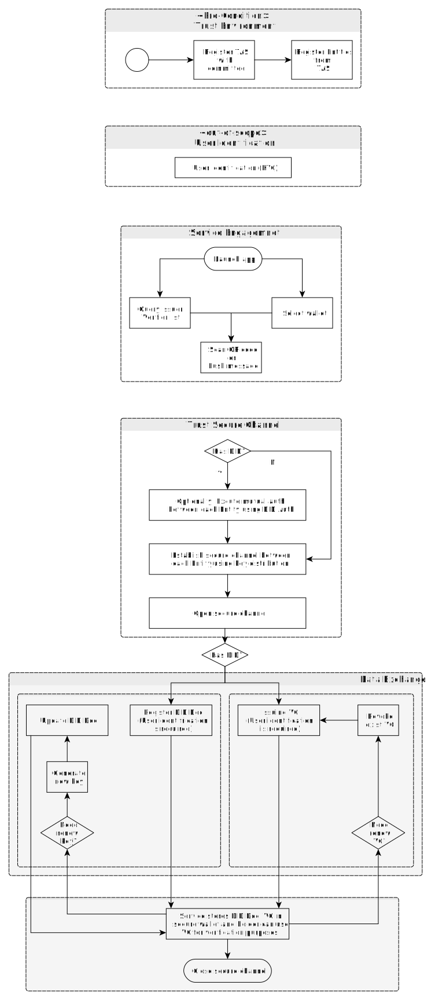
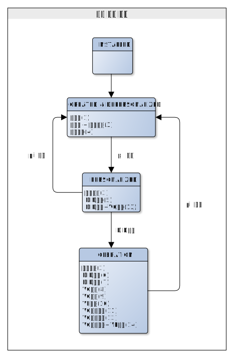
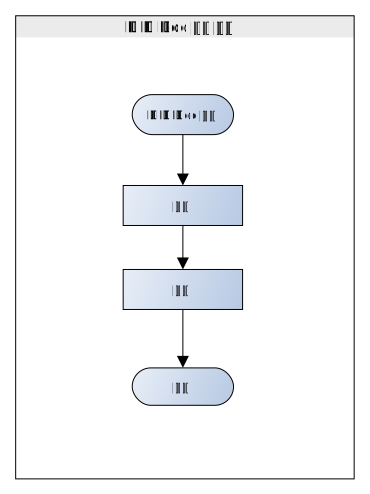
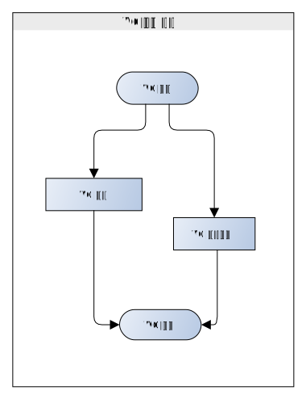

# Wallet 생명 주기

- 주제 : Wallet 생명 주기
- 작성 : 오픈소스개발팀
- 일자 : 2024-10-18
- 버전 : v1.0.0

| 버전 | 일자       | 변경         |
| ------- | ---------- | --------------- |
| v1.0.0  | 2024-10-18 | 최초 작성 |

 

아래 그림은 OpenDID 프로토콜에서 지원하는 일반적인 작업 흐름을 말합니다. 구체적인 작업 흐름은 발급 정책에 따라 결정되며 사용자는 월랫을 설치하고 DID/VC 발급 과정까지 각 단계별 등록 절차 및 서비스 연결 그리고 어플리케이션을 실행하여 안전한 통신 채널 하에 월랫에 DID Document, VC를 저장합니다.

월랫과 DID Document, VC는 각각의 생명주기를 가지며 자세한 내용은 아래 상세설명을 참고하세요.

## 생명주기 상세 설명
월랫은 생명 **주기별 4단계** 상태를 가진다.
 

### 1. 월랫 생명 주기별 상태
* `INSTALLED`
* `CREATED & DEPERSONALIZED`
* `PERSONALIZED`
* `OPERATION`

#### - INSTALLED
월랫 앱 설치 상태를 의미

### - CREATED & DEPERSONALIZED
월랫 생성(DB, file)과 사용자가 바인딩 되지 않은 상태 의미
 
사용자 바인딩(PII등록)과 월랫 잠금 기능은 부가적으로 함께 사용 가능

#### - PERSONALIZED
사용자 정보가 바인딩 된 상태로 DID발급 및 VC발급 수행 가능
 
사용자 정보(PII) 삭제 시 2번(CREATED & DEPERSONALIZED) 단계로 월렛 상태 변경

#### - OPERATION
DID가 발급된 상태며 DID/ VC 관련 모든 기능을 수행 가능
 
사용자 정보(PII) 삭제 시 2번(CREATED & DEPERSONALIZED) 단계로 월렛 상태 변경  
 

---

### 2. DID 생명 주기
DID는 생명 **주기별 5단계** 상태를 가진다.
 

<!-- 한줄 띄기 입니다. -->

### * 월랫 생명 주기별 상태
* `DID Document 등록`
* `DID Document 갱신`
* `DID Document 상태 변경`
* `DID Document 폐기`
* `DID Document 말소`
 

#### - DID Document 등록
DID Document를 초기 발급한다.
 
해당 기능은 CA, Entity가 요청

#### - DID Document 갱신
키 추가, SEP 추가 등의 이유로 DID Document를 갱신한다.
 
해당 기능은 CA, Entity가 요청

#### - DID Document 상태변경
DID Document를 활성화/ 비활성화 시킨다.
 
해당 기능은 TAS가 요청

#### - DID Document 폐기
DID Document를  폐기한다 (부인방지 목적 등으로 사용 가능)
 
해당 기능은 TAS가 요청

#### - DID Doc 말소
DID Document를 말소한다. (어떠한 목적으로도 사용 불가능)
 
해당 기능은 TAS가 요청

---

### 3. VC 생명 주기
VC(Verifiable Credential)는 생명 **주기별 4단계** 상태를 가진다.
 

<!-- 한줄 띄기 입니다. -->

### * 월랫 생명 주기별 상태
* `VC 발행`
* `VC 재발급`
* `VC 상태변경`
* `VC 폐기`
 

#### - VC 발행
VC(Verifiable Credential)를 초기 발급한다.
 
해당기능은 CA가 요청

#### - VC 재발급
VC(Verifiable Credential)를 재발급한다.
 
해당기능은 CA가 요청

#### - VC 상태변경
VC(Verifiable Credential)를 활성화/ 비활성 시킨다.
 
해당기능은 Issuer가 요청

#### - VC 폐기
VC(Verifiable Credential)를 폐기한다.
 
해당기능은 Issuer가 요청

