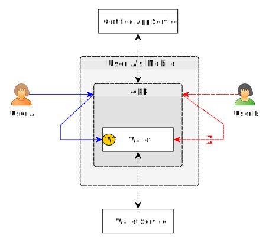
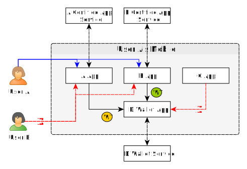
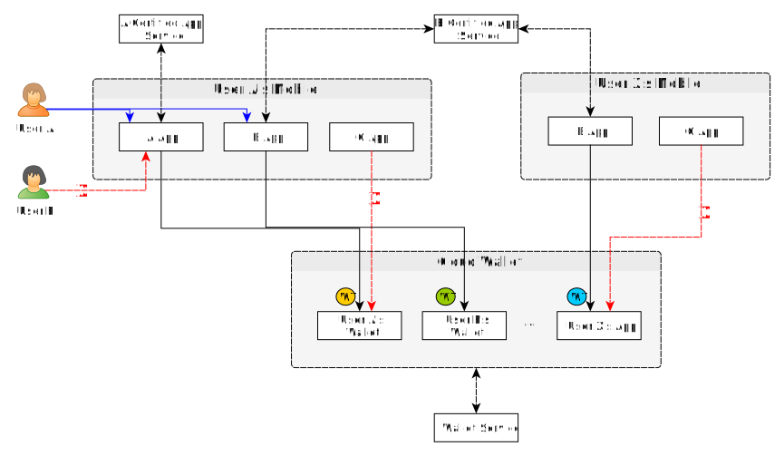
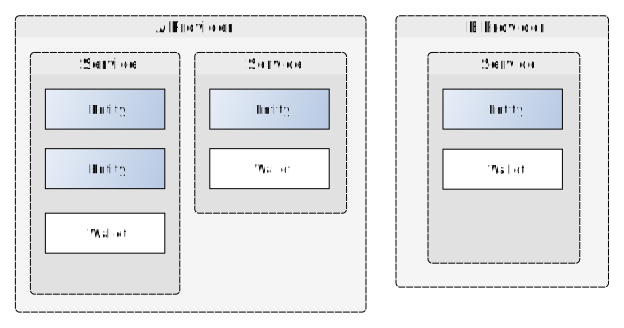
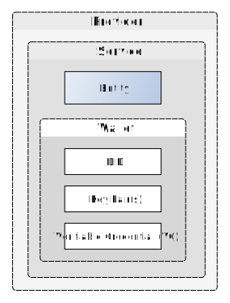
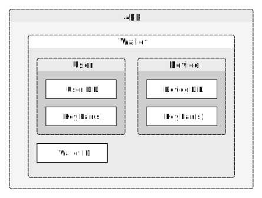

# Wallet

- Subject: Explanation of Wallet
- Author: OpenSource Development Team
- Date: 2024-10-18
- Version: v1.0.0

| Version | Date       | Changes         |
| ------- | ---------- | --------------- |
| v1.0.0  | 2024-10-18 | Initial version |

 

A Wallet is a software or hardware-based repository that securely stores and manages important data such as digital identities, credentials, and cryptographic keys. Wallets support individuals or organizations in maintaining trusted identities in the digital world and safely accessing or performing transactions with various services.

This document describes the Wallet used in Open DID.

## Open DID's Wallet
The Wallet in Open DID refers to the Wallet provided by a Wallet provider registered in the Open DID system. Wallet providers can offer Wallets in the following three forms:
* File: A file-based Wallet that exists separately for each app.
* App: A Wallet provided as a separate app, which can be used jointly by multiple apps on a single device.
* Cloud: A cloud-based Wallet.

## Wallet Token
Within the Wallet, sensitive information such as the user's keys and mobile IDs are stored. To ensure the data within the Wallet is securely stored and used, access to the Wallet must be controlled. The Wallet verifies whether the App is authorized and who the user is, then issues a Wallet Token to the App. The App uses the issued Wallet Token to access the Wallet.

The process for issuing a Wallet Token is as follows:
1. App Verification: The Wallet verifies whether the App is an authorized App through the Certified App Service. (The Certified App Service must be registered in the Open DID system)
2. User Verification: The Wallet verifies whether the User can access the Wallet through the Certified App Service.
3. Wallet Token Generation: The Wallet generates the Wallet Token.

The Wallet Token has a validity period and can only be used within that period.

The Wallet must issue a Wallet Token for each purpose the App intends to use the Wallet, known as the Wallet Purpose. The lifecycle of the Wallet Token must be managed according to the Wallet Purpose with the following constraints:
* Single Token Use: The Wallet cannot issue multiple Wallet Tokens simultaneously; only one Wallet Token can be valid at a time.
* Token Renewal: To issue a Wallet Token for a different Wallet Purpose, the existing Wallet Token must be revoked before issuing a new one.

## Operation by Wallet Type
### File Wallet
A File Wallet is where the server or app holds the Wallet in a file form. Each app must have a separate Wallet, and cannot access other apps' Wallets.

The following image illustrates an example where User A accesses a File Wallet on their mobile device. When User A logs into the App and accesses the Wallet, they receive a Wallet Token to access the Wallet. Conversely, User B, even if logged into the App, cannot access the Wallet as they fail the User verification for the Wallet, hence no Wallet Token is issued.

### App Wallet
An App Wallet is where the Wallet is provided in the form of an App. Multiple apps on a single device can use the same App Wallet. This allows users to manage data with one Wallet instead of setting up a separate Wallet for each app.

The following image illustrates an example where User A accesses an App Wallet on their mobile device. Only authorized apps (A app, B app) and permitted users (User A) can access the Wallet.

### Cloud Wallet
A Cloud Wallet is provided on a cloud basis, allowing users to access it from anywhere, offering high flexibility and convenience.

The following image illustrates an example where User A accesses a Cloud Wallet on their mobile device. Only authorized apps (A app, B app) and permitted users (User A) can access the Wallet.

## Wallet Data
Servers and apps comprising Open DID possess Wallets. This chapter explains the data stored in the Wallet.

**Note:** To focus on Wallet Data, **this chapter assumes a File Wallet.**

### Server Wallet
The Wallet of a server securely stores and manages the service information. Each service unit has its Wallet. 
In the following image, Provider A offers two services, thus having two Wallets, whereas Provider B offers one service and thus has one Wallet.

#### Wallet Data
The Wallet of a server stores the DID and key pairs specified in the service's DID Document. It also stores the membership certificate received after registration through the TA in Open DID.

* DID: The DID of the service registered in the Open DID system.
* Key Pair(s): The public key and its corresponding private key specified in the service's DID Document.
* Membership Certificate (VC): The VC issued through the TA, proving registration in the Open DID system. This certificate plays a crucial role in ensuring the service's reliability and integrity.

### App Wallet
The Wallet of an app securely stores and manages user and device information.

#### Wallet Data
The Wallet of an app stores two types of data.
First is the DID and key pairs specified in the user's DID Document. Second is the DID and key pairs specified in the device's DID Document. Devices represent wallets, which must also be registered in the Open DID system, similar to users.

* User DID: The DID of the user registered in the Open DID system.
* User Key Pair(s): The public key and its corresponding private key specified in the user's DID Document.
* Device DID: The DID of the device (Wallet) registered in the Open DID system.
* Device Key Pair(s): The public key and its corresponding private key specified in the Wallet's DID Document.
* Wallet ID: The unique identifier of the Wallet.