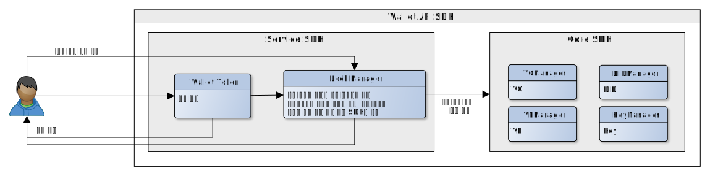
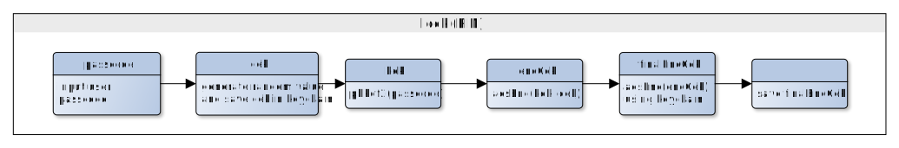
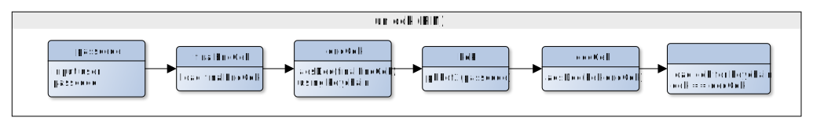
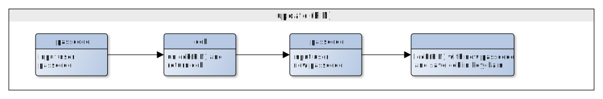

# 월랫 잠금
<!-- 개별 문서는 향후에 병합될 수 있으므로, 목차는 사용하지 않습니다. -->

- 주제 : 월렛 잠금
- 작성 : 오픈소스개발팀
- 일자 : 2024-10-18
- 버전 : v1.0.0

| 버전 | 일자       | 변경         |
| ------- | ---------- | --------------- |
| v1.0.0  | 2024-10-18 | 최초 작성 |

<br>

인가앱(CA)으로 부터 받은 passcode 기반으로 cek(content encrypt key)를 생성,변경, 조회하는 역할을 한다. 
<br>
cek는 서비스 월랫에서 관리하며 월랫 lock/ unlock시 사용된다.
인가앱에서 passcode 입력 화면을 구현하고 passcode는 등록, 변경시 인가앱에서 매칭시킨다.

잠금 형태의 월랫과 잠금형태가 아닌 월랫의 방식은 아래와 같이 사용자 인증 유무에 따라 동작한다.



잠금 형태의 지갑을 설정하기 위해서 사용자의 패스코드 등록과 인증에 대한 기술적 로직을 아래에서 설명한다.

* 용어
    * cek = content encrpytion key
    * kek = key encryption key
    * pbkdf = password-based key derivation function

### 1. 월랫 잠금 (PIN) 



### 예제
```code
let sacObject = SecAccessControlCreateWithFlags(kCFAllocatorDefault
                                                , kSecAttrAccessibleWhenUnlockedThisDeviceOnly
                                                , []
                                                , &errorRef)
        
let queryForDelete: [CFString: Any] = [kSecClass: kSecClassGenericPassword, kSecAttrService: "KEY_PIN_CHAIN_DATA"]
        
var status = SecItemDelete(queryForDelete as CFDictionary)
WalletLogger.shared.debug("item delete status: \(status)")

var cek: NSMutableData
if self.seedKey == nil {
    cek = NSMutableData(length: 32)!
    _ = SecRandomCopyBytes(kSecRandomDefault, 32, cek.mutableBytes)
}  else {
    cek = NSMutableData(data: self.seedKey!)
}

let salt = try MultibaseUtils.decode(encoded: "f6c646576656c6f7065726c3139383540676d61696c2e636f6d")
 
let kek = try CryptoUtils.pbkdf2(password: passcode.data(using: .utf8)!, salt: salt, iterations: 2048, derivedKeyLength: 32)

WalletLogger.shared.debug("======[H] kek: \(MultibaseUtils.encode(type: MultibaseType.base16, data: kek))")
        
let iv = try MultibaseUtils.decode(encoded: "z75M7MfQsC4p2rTxeKxYh2M")
        
let encCek = try CryptoUtils.encrypt(plain: cek as Data, info: CipherInfo(cipherType: SymmetricCipherType.aes256CBC, padding: SymmetricPaddingType.pkcs5), key: kek, iv: iv)

WalletLogger.shared.debug("======[H] encCek: \(MultibaseUtils.encode(type: MultibaseType.base16, data: encCek))")
        
let finalEncCek = try SecureEncryptor.encrypt(plainData: encCek as Data)
```
<br>

### 2. 월랫 잠금해제 (PIN)


<br>
### 예제
```code
let finalEncCek = try MultibaseUtils.decode(encoded: CoreDataManager.shared.selectUser()!.finalEncKey)

WalletLogger.shared.debug("======[H] finalEncCek: \(MultibaseUtils.encode(type: MultibaseType.base16, data: finalEncCek))")

let encCek = try SecureEncryptor.decrypt(cipherData: finalEncCek)
WalletLogger.shared.debug("======[H] encCek: \(MultibaseUtils.encode(type: MultibaseType.base16, data: encCek))")

let salt = try MultibaseUtils.decode(encoded: "f6c646576656c6f7065726c3139383540676d61696c2e636f6d")
let kek = try CryptoUtils.pbkdf2(password: passcode.data(using: .utf8)!, salt: salt, iterations: 2048, derivedKeyLength: 32)

WalletLogger.shared.debug("======[H] kek: \(MultibaseUtils.encode(type: MultibaseType.base16, data: kek))")

let iv = try MultibaseUtils.decode(encoded: "z75M7MfQsC4p2rTxeKxYh2M")
let decCek = try CryptoUtils.decrypt(cipher: encCek, info: CipherInfo(cipherType: SymmetricCipherType.aes256CBC, padding: SymmetricPaddingType.pkcs5), key: kek, iv: iv)

WalletLogger.shared.debug("======[H] decCek: \(MultibaseUtils.encode(type: MultibaseType.base16, data: decCek))")


var dataTypeRef: CFTypeRef?

let query: [CFString: Any] = [
    kSecClass: kSecClassGenericPassword,
    kSecAttrService: "KEY_PIN_CHAIN_DATA",
    kSecReturnData: true
]

let status = SecItemCopyMatching(query as CFDictionary, &dataTypeRef)
WalletLogger.shared.debug("item matching status : \(status)")


let cek = dataTypeRef as! Data
WalletLogger.shared.debug("======[H] load cek: \(MultibaseUtils.encode(type: MultibaseType.base16, data: cek))")

if cek as Data == decCek {
    return cek as Data
}
```


### 3. 월랫 PIN 변경 (TO-DO)




