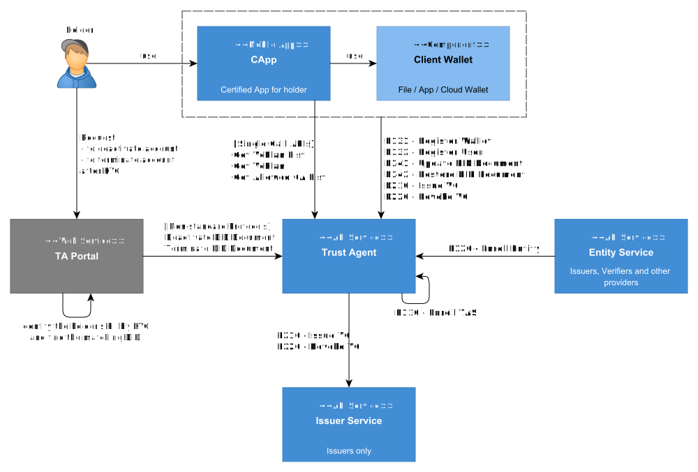

---
puppeteer:
    pdf:
        format: A4
        displayHeaderFooter: true
        landscape: false
        scale: 0.8
        margin:
            top: 1.2cm
            right: 1cm
            bottom: 1cm
            left: 1cm
    image:
        quality: 100
        fullPage: false
---

TAS API
==

- 일자: 2024-09-03
- 버전: v1.0.0

<!-- TOC tocDepth:2..3 chapterDepth:2..6 -->

목차
---

- [1. 개요](#1-개요)
- [2. 용어 설명](#2-용어-설명)
- [3. API 목록](#3-api-목록)
  - [3.1. 순차 API](#31-순차-api)
  - [3.2. 단일호출 API](#32-단일호출-api)
- [4. P110 - TAS 등록 프로토콜](#4-p110---tas-등록-프로토콜)
  - [4.1. Request Enroll TAS](#41-request-enroll-tas)
- [5. P120 - Entity 등록 프로토콜](#5-p120---entity-등록-프로토콜)
  - [5.1. Propose Enroll Entity](#51-propose-enroll-entity)
  - [5.2. Request ECDH](#52-request-ecdh)
  - [5.3. Request Enroll Entity](#53-request-enroll-entity)
  - [5.4. Confirm Enroll Entity](#54-confirm-enroll-entity)
- [6. P131 - 월렛 등록 프로토콜](#6-p131---월렛-등록-프로토콜)
  - [6.1. Request Register Wallet](#61-request-register-wallet)
- [7. P132 - 사용자 등록 프로토콜](#7-p132---사용자-등록-프로토콜)
  - [7.1. Propose Register User](#71-propose-register-user)
  - [7.2. Request ECDH](#72-request-ecdh)
  - [7.3. Request Create Token](#73-request-create-token)
  - [7.4. Retrieve KYC](#74-retrieve-kyc)
  - [7.5. Request Register User](#75-request-register-user)
  - [7.6. Confirm Register User](#76-confirm-register-user)
- [8. P141 - 사용자 DID Document 갱신 프로토콜](#8-p141---사용자-did-document-갱신-프로토콜)
  - [8.1. Propose Update DidDoc](#81-propose-update-diddoc)
  - [8.2. Request ECDH](#82-request-ecdh)
  - [8.3. Request Create Token](#83-request-create-token)
  - [8.4. Request Update DidDoc](#84-request-update-diddoc)
  - [8.5. Confirm Update DidDoc](#85-confirm-update-diddoc)
- [9. P142 - 사용자 DID Document 복구 프로토콜](#9-p142---사용자-did-document-복구-프로토콜)
  - [9.1. Offer Restore DidDoc (Push)](#91-offer-restore-diddoc-push)
  - [9.2. Offer Restore DidDoc (Email)](#92-offer-restore-diddoc-email)
  - [9.3. Propose Restore DidDoc](#93-propose-restore-diddoc)
  - [9.4. Request ECDH](#94-request-ecdh)
  - [9.5. Request Create Token](#95-request-create-token)
  - [9.6. Request Restore DidDoc](#96-request-restore-diddoc)
  - [9.7. Confirm Restore DidDoc](#97-confirm-restore-diddoc)
- [10. P210 - VC 발급 프로토콜](#10-p210---vc-발급-프로토콜)
  - [10.1 Offer Issue VC (QR)](#101-offer-issue-vc-qr)
  - [10.2 Offer Issue VC (Push)](#102-offer-issue-vc-push)
  - [10.3 Offer Issue VC (Email)](#103-offer-issue-vc-email)
  - [10.4. Propose Issue VC](#104-propose-issue-vc)
  - [10.5. Request ECDH](#105-request-ecdh)
  - [10.6. Request Create Token](#106-request-create-token)
  - [10.7. Request Issue Profile](#107-request-issue-profile)
  - [10.8. Request Issue VC](#108-request-issue-vc)
  - [10.9. Confirm Issue VC](#109-confirm-issue-vc)
- [11. P220 - VC 폐기 프로토콜](#11-p220---vc-폐기-프로토콜)
  - [11.1. Propose Revoke VC](#111-propose-revoke-vc)
  - [11.2. Request ECDH](#112-request-ecdh)
  - [11.3. Request Create Token](#113-request-create-token)
  - [11.4. Request Revoke VC](#114-request-revoke-vc)
  - [11.5. Confirm Revoke VC](#115-confirm-revoke-vc)
- [12. 단일 호출 API](#12-단일-호출-api)
  - [12.1. Get VcPlan List](#121-get-vcplan-list)
  - [12.2. Get VcPlan](#122-get-vcplan)
  - [12.3. Get Allowed CA List](#123-get-allowed-ca-list)
  - [12.4. Send Email](#124-send-email)
  - [12.5. Send push](#125-send-push)
  - [12.6. Update Push Token](#126-update-push-token)
  - [12.7. Get Certificate Vc](#127-get-certificate-vc)
  - [12.8. Get Vc Schema](#128-get-vc-schema)
  - [12.9. Update DidDoc Deactivated](#129-update-diddoc-deactivated)
  - [12.10. Update DidDoc Revoked](#1210-update-diddoc-revoked)
- [A. Non-standard Object Definitions](#a-non-standard-object-definitions)
  - [A.1. Constant](#a1-constant)
  - [A.2. EmailTemplate Object](#a2-emailtemplate-object)
  - [A.3. FcmNotification Object](#a3-fcmnotification-object)

## 1. 개요

본 문서는 Trust Agent (TA 또는 TAS)가 제공하는 API를 정의한다.



- 상기 그림에서는 Trust Agent가 제공하거나 혹은 Trust Agent가 호출하는 프로토콜(Protocol)과 API를 표기하였으며, API는 가독성을 위하여 표준 API (Standard API)만을 표기하였다.
- 각 용어는 2장에서 설명하며, API 목록과 호출 예시 등은 3장 이후부터 확인할 수 있다.

<div style="page-break-after: always; margin-top: 50px;"></div>

## 2. 용어 설명
- 프로토콜 (Protocol)
  - 특정 기능을 수행하기 위해 정해진 순서에 따라 호출해야 하는 `순차 API`의 집합이다. API 호출 순서를 엄격히 따라야 하며, 순서가 잘못될 경우 예상하지 못한 결과가 발생할 수 있다.
  - 프로토콜은 P로 시작하고, 3자리 숫자로 구성된다. 
    - 예시: P110 - TAS 등록 프로토콜
- 순차 API (Sequential API)
  - 특정 기능(프로토콜)을 수행하기 위해 정해진 순서대로 호출하는 일련의 API를 말한다. 각 API는 순차적으로 호출되어야 하며, 순서가 잘못될 경우 제대로 동작하지 않을 수 있다.
  - 그러나 일부 프로토콜에서는 같은 호출 순서를 가진 API가 존재할 수 있으며, 이 경우 하나의 API를 선택하여 호출할 수 있다.
    - 예시: 'P142 - 사용자 DID Document 복구 프로토콜'에서는 1번 호출 순서에서 `offer-restore-did-push`와 `offer-restore-did-email` 중 하나를 선택하여 호출할 수 있다.
- 단일 호출 API (Single Call API)
  - 일반적인 REST API처럼 순서에 관계없이 독립적으로 호출 가능한 API를 의미한다.
- 표준 API (Standard API)
  - API 문서에서 명확하게 정의된 API로, 모든 구현체에서 일관된 방식으로 제공되어야 한다. 표준 API는 시스템 간 상호 운용성을 보장하며, 사전에 정의된 스펙에 따라 동작해야 한다.
- 비표준 API (Non-Standard API)
  - 구현체마다 필요에 따라 다르게 정의되거나 커스터마이징될 수 있는 API이다. 본 문서에서 제공하는 비표준 API는 한 가지 예시일 뿐이며, 각 구현체에 맞춰 다르게 구현될 수 있다. 이 경우, 구현체별 별도의 문서화가 필요하다.
  - 예를 들어, 이메일 전송 기능은 시스템에 따라 구현 방법이 달라질 수 있으며, `send-email` API와 같은 비표준 API는 각 구현체에서 필요한 방식으로 재정의할 수 있다.

<div style="page-break-after: always; margin-top: 50px;"></div>

## 3. API 목록

### 3.1. 순차 API

#### 3.1.1. P110 - TAS 등록 프로토콜
| Seq | API                  | URL                        | Description | 표준API |
| --- | -------------------- | -------------------------- | ----------- | ------- |
| 1   | `request-enroll-tas` | /api/v1/request-enroll-tas | TAS 등록    | Y       |

<div style="page-break-after: always; margin-top: 40px;"></div>

#### 3.1.2. P120 - Entity 등록 프로토콜
| Seq | API                     | URL                               | Description           | 표준API |
| --- | ----------------------- | --------------------------------- | --------------------- | ------- |
| 1   | `propose-enroll-entity` | /api/v1/propose-enroll-entity | Entity 등록 시작 요청 | Y       |
| 2   | `request-ecdh`          | /api/v1/request-ecdh          | ECDH 요청             | Y       |
| 3   | `request-enroll-entity` | /api/v1/request-enroll-entity | Entity 등록 요청      | Y       |
| 4   | `confirm-enroll-entity` | /api/v1/confirm-enroll-entity | Entity 등록 완료      | Y       |

<div style="page-break-after: always; margin-top: 40px;"></div>

#### 3.1.3. P131 - Wallet 등록 프로토콜
| Seq | API                       | URL                                 | Description | 표준API |
| --- | ------------------------- | ----------------------------------- | ----------- | ------- |
| 1   | `request-register-wallet` | /api/v1/request-register-wallet | 월렛 등록   | Y       |

<div style="page-break-after: always; margin-top: 40px;"></div>

#### 3.1.4. P132 - 사용자 등록 프토토콜
| Seq | API                     | URL                               | Description           | 표준API |
| --- | ----------------------- | --------------------------------- | --------------------- | ------- |
| 1   | `propose-register-user` | /api/v1/propose-register-user | 사용자 등록 시작 요청 | Y       |
| 2   | `request-ecdh`          | /api/v1/request-ecdh          | ECDH 요청             | Y       |
| 3   | `request-create-token`  | /api/v1/request-create-token  | 서버토큰 생성 요청    | Y       |
| 4   | `retrieve-kyc`          | /api/v1/retrieve-kyc          | KYC 결과 회신 요청    | N       |
| 5   | `request-register-user` | /api/v1/request-register-user | 사용자 등록 요청      | Y       |
| 6   | `confirm-register-user` | /api/v1/confirm-register-user | 사용자 등록 완료      | Y       |

<div style="page-break-after: always; margin-top: 40px;"></div>

#### 3.1.5. P141 - 사용자 DID Document 갱신 프토토콜
| Seq | API                     | URL                               | Description                        | 표준API |
| --- | ----------------------- | --------------------------------- | ---------------------------------- | ------- |
| 1   | `propose-update-diddoc` | /api/v1/propose-update-diddoc | 사용자 DID Document 갱신 시작 요청 | Y       |
| 2   | `request-ecdh`          | /api/v1/request-ecdh          | ECDH 요청                          | Y       |
| 3   | `request-create-token`  | /api/v1/request-create-token  | 서버토큰 생성 요청                 | Y       |
| 4   | `request-update-diddoc` | /api/v1/request-update-diddoc | 사용자 DID Document 갱신 요청      | Y       |
| 5   | `confirm-update-diddoc` | /api/v1/confirm-update-diddoc | 사용자 DID Document 갱신 완료      | Y       |

<div style="page-break-after: always; margin-top: 40px;"></div>

#### 3.1.6. P142 - 사용자 DID Document 복구 프토토콜
| Seq | API                       | URL                                 | Description                            | 표준API |
| --- | ------------------------- | ----------------------------------- | -------------------------------------- | ------- |
| 1   | `offer-restore-did-push`  | /api/v1/offer-restore-did/push  | 사용자 DID Document Offer 요청 (Push)  | N       |
| 1   | `offer-restore-did-email` | /api/v1/offer-restore-did/email | 사용자 DID Document Offer 요청 (Email) | N       |
| 2   | `propose-restore-user`    | /api/v1/propose-restore-user    | 사용자 DID Document 복구 시작 요청     | Y       |
| 3   | `request-ecdh`            | /api/v1/request-ecdh            | ECDH 요청                              | Y       |
| 4   | `request-create-token`    | /api/v1/request-create-token    | 서버토큰 생성 요청                     | Y       |
| 5   | `request-restore-user`    | /api/v1/request-restore-user    | 사용자 DID Document 복구 요청          | Y       |
| 6   | `confirm-restore-user`    | /api/v1/confirm-restore-user    | 사용자 DID Document 복구 완료          | Y       |

<div style="page-break-after: always; margin-top: 40px;"></div>

#### 3.1.7. P210 - VC 발급 프로토콜
| Seq | API                     | URL                               | Description                | 표준API |
| --- | ----------------------- | --------------------------------- | -------------------------- | ------- |
| 1   | `offer-issue-vc-qr`     | /api/v1/offer-issue-vc/qr     | VC 발급 Offer 요청 (QR)    | N       |
| 1   | `offer-issue-vc-push`   | /api/v1/offer-issue-vc/push   | VC 발급 Offer 요청 (Push)  | N       |
| 1   | `offer-issue-vc-email`  | /api/v1/offer-issue-vc/email  | VC 발급 Offer 요청 (Email) | N       |
| 2   | `propose-issue-vc`      | /api/v1/propose-issue-vc      | VC 발급 시작 요청          | Y       |
| 3   | `request-ecdh`          | /api/v1/request-ecdh          | ECDH 요청                  | Y       |
| 4   | `request-create-token`  | /api/v1/request-create-token  | 서버토큰 생성 요청         | Y       |
| 5   | `request-issue-profile` | /api/v1/request-issue-profile | Issue Profile 요청         | Y       |
| 6   | `request-issue-vc`      | /api/v1/request-issue-vc      | VC 발급 요청               | Y       |
| 7   | `confirm-issue-vc`      | /api/v1/confirm-issue-vc      | VC 발급 완료               | Y       |

<div style="page-break-after: always; margin-top: 40px;"></div>

#### 3.1.8. P220 - VC 폐기 프로토콜

| Seq. | API                    | URL                              | Description        | 표준API |
| :--: | ---------------------- | -------------------------------- | ------------------ | ------- |
|  1   | `propose-revoke-vc`    | /api/v1/propose-revoke-vc    | VC 폐기 시작 요청  | Y       |
|  2   | `request-ecdh`         | /api/v1/request-ecdh         | ECDH 요청          | Y       |
|  3   | `request-create-token` | /api/v1/request-create-token | 서버토큰 생성 요청 | Y       |
|  4   | `request-revoke-vc`    | /api/v1/request-revoke-vc    | VC 폐기 요청       | Y       |
|  5   | `confirm-revoke-vc`    | /api/v1/confirm-revoke-vc    | VC 폐기 완료       | Y       |

<div style="page-break-after: always; margin-top: 50px;"></div>

### 3.2. 단일호출 API
| API                         | URL                               | Description                | 표준API |
| --------------------------- | --------------------------------- | -------------------------- | ------- |
| `send-email`                | /noti/api/v1/send-email           | 이메일 발송                | N       |
| `send-push`                 | /noti/api/v1/send-push            | Push 전송                  | N       |
| `update-push-token`         | /api/v1/update-push-token         | Push 토큰 업데이트         | N       |
| `get-vcplan-list`           | /list/api/v1/vcplan/list          | 모든 VC Plan 목록 조회     | Y       |
| `get-vcplan`                | /list/api/v1/vcplan/id            | VC Plan 조회               | Y       |
| `get-allowed-ca-list`       | /list/api/v1/allowed-ca/list      | 월렛에 허용된 CA 목록 조회 | Y       |
| `get-certificate-vc`        | /api/v1/certificate-vc            | 가입증명서 조회            | N       |
| `get-vcschema`              | /api/v1/vc-schema                  | VC 스키마 조회             | N       |
| `update-diddoc-deactivated` | /api/v1/update-diddoc-deactivated | DIDDoc 비활성화            | N       |
| `update-diddoc-revoked`     | /api/v1/update-diddoc-revoked     | DIDDoc 폐기                | N       |

> **주의사항**
> 
> - 현재 Trust Agent는 Noti 사업자와 List 사업자의 역할도 함께 수행하고 있다. URL이 `noti`와 `list`로 시작하는 API들은 이러한 기능을 제공하는 API들이다.
> - 사업자 간의 역할을 명확하게 구분하고 혼동을 방지하기 위해, 각 사업자의 API는 **context path**를 구별하여 구성하는 것이 좋다.
>   - Trust Agent API: `/tas/api/~`
>   - List API: `/list/api/~`

<div style="page-break-after: always; margin-top: 50px;"></div>

## 4. P110 - TAS 등록 프로토콜

| Seq. | API                  | Description | 표준API |
| :--: | -------------------- | ----------- | ------- |
|  1   | `request-enroll-tas` | TAS 등록    | Y       |

<div style="page-break-after: always; margin-top: 40px;"></div>

### 4.1. Request Enroll TAS

사전에 등록된 정보를 바탕으로 TAS 가입증명서 VC를 발급한다.
정보 등록 시 할당된 비밀번호를 입력으로 받아 권한을 확인한다.

| Item          | Description                  | Remarks |
| ------------- | ---------------------------- | ------- |
| Method        | `POST`                       |         |
| Path          | `/api/v1/request-enroll-tas` |         |
| Authorization | -                            |         |

<div style="page-break-after: always; margin-top: 30px;"></div>

#### 4.1.1. Request

**■ Headers**

| Header              | Value                            | Remarks |
| ------------------- | -------------------------------- | ------- |
| + `Content-Type`    | `application/json;charset=utf-8` |         |

**■ Path Parameters**

N/A

**■ Query Parameters**

N/A

**■ Body**

```c#
def object M110_RequestEnrollTas: "Request Enroll TAS 요청문"
{
    //--- Common Part ---
    + messageId "id": "message id"

    //--- Data Part ---
    + object "request": "request information"
    {
        + string "password": "사전에 배포된 비밀번호"
    }
}
```

- `~/request`
    - `password`: 비밀번호의 구성은 각 구현에 따른다.

<div style="page-break-after: always; margin-top: 30px;"></div>

#### 4.1.2. Response

TAS는 본 요청을 받아 TAS용 가입증명서를 발급하고 게시 주소를 응답한다.
TAS 등록을 위해 필요한 데이터는 다음과 같다.

- Subject DN: DN(Distinguished Name) 형태의 주체 정보
- Role: "Tas"로 고정
- Evidence 정보
- 가입증명서 VC 게시 주소

**■ Process**

1. 수행 권한 확인
    - `~/request/password`가 사전에 지정한 값과 일치하는지 확인
1. 현재 등록 가능한 상태인지 확인
1. 발급을 위한 데이터 조회
    - subject, role, evidence, 가입증명서 VC 게시 주소 등
1. 가입증명서 VC 발급
    - 가입증명서 VC 게시

**■ Status 200 - Success**

```c#
def object _M110_RequestEnrollTas: "Request Enroll TAS 응답문"
{
    //--- Common Part ---
    + uuid "txId": "transaction id"

    //--- Data Part ---
    + url "certVcRef": "TAS 가입증명서 VC URL"
}
```

**■ Status 400 - Client error**

|     Code     | Description     |
| :----------: | --------------- |
| SSRVTRA12010 | 비밀번호 불일치합니다. |

**■ Status 500 - Server error**

|     Code     | Description                                        |
| :----------: | -------------------------------------------------- |
| SSRVTRA13001 | TAS의 DID Document가 등록되지 않았습니다.          |
| SSRVTRA13003 | TAS가 이미 등록된 상태입니다.                      |
| SSRVTRA18515 | VC 생성에 실패했습니다.                            |
| SSRVTRA15004 | VC 메타데이터 게시에 실패했습니다.                 |
| SSRVTRA13006 | 'propose-enroll-tas' API 요청 처리에 실패했습니다. |

<div style="page-break-after: always; margin-top: 30px;"></div>

#### 4.1.3. Example

**■ Request**

```shell
curl -v -X POST "http://${Host}:${Port}/tas/api/v1/request-enroll-tas" \
-H "Content-Type: application/json;charset=utf-8" \
-d @"data.json"
```

```json
//data.json
{
    "id": "2024123111223312345600000001",
    "request": {
        "password": "VoOyEuOyal"
    }
}
```

**■ Response**

```http
HTTP/1.1 200 OK
Content-Type: application/json;charset=utf-8

{
    "txId": "7a25a59a-3c5a-4d47-9e55-bbc9fa85a92c",
    "certVcRef": "https://opendid.org/cert/tas_v1"
}
```

<div style="page-break-after: always; margin-top: 50px;"></div>

## 5. P120 - Entity 등록 프로토콜

| Seq. | API                   | Description           | 표준API |
| :--: | --------------------- | --------------------- | ------- |
|  1   | propose-enroll-entity | Entity 등록 시작 요청 | Y       |
|  2   | request-ecdh          | ECDH 요청             | Y       |
|  3   | request-enroll-entity | Entity 등록 요청      | Y       |
|  4   | confirm-enroll-entity | Entity 등록 완료      | Y       |

### 5.1. Propose Enroll Entity

각종 사업자의 entity 등록 거래를 시작한다.

| Item          | Description                     | Remarks |
| ------------- | ------------------------------- | ------- |
| Method        | `POST`                          |         |
| Path          | `/api/v1/propose-enroll-entity` |         |
| Authorization | -                               |         |

<div style="page-break-after: always; margin-top: 30px;"></div>

#### 5.1.1. Request

**■ Headers**

| Header           | Value                            | Remarks |
| ---------------- | -------------------------------- | ------- |
| + `Content-Type` | `application/json;charset=utf-8` |         |

**■ Path Parameters**

N/A

**■ Query Parameters**

N/A

**■ Body**

```c#
def object M120_ProposeEnrollEntity: "Propose Enroll Entity 요청문"
{
    //--- Common Part ---
    + messageId "id": "message id"
}
```

<div style="page-break-after: always; margin-top: 30px;"></div>

#### 5.1.2. Response

거래코드를 생성하고 DID Auth를 위한 난수를 생성한다.

**■ Process**

1. `txId` = 거래코드 생성
1. `authNonce` = DID Auth 용 16-byte nonce 생성
1. `txId`, `authNonce` 저장

**■ Status 200 - Success**

```c#
def object _M120_ProposeEnrollEntity: "Propose Enroll Entity 응답문"
{    
    //--- Common Part ---
    + uuid "txId": "transaction id"

    //--- Data Part ---
    + multibase "authNonce": "TAS nonce for DID Auth", byte_length(16)
}
```

**■ Status 400 - Client error**

N/A

**■ Status 500 - Server error**

|     Code     | Description                                           |
| :----------: | ----------------------------------------------------- |
| SSRVTRA14005 | 'propose-enroll-entity' API 요청 처리에 실패했습니다. |

<div style="page-break-after: always; margin-top: 30px;"></div>

#### 5.1.3. Example

**■ Request**

```shell
curl -v -X POST "http://${Host}:${Port}/tas/api/v1/propose-enroll-entity" \
-H "Content-Type: application/json;charset=utf-8" \
-d @"data.json"
```

```json
//data.json
{
    "id":"20240905105721157000631bff19"
}
```

**■ Response**

```http
HTTP/1.1 200 OK
Content-Type: application/json;charset=utf-8

{
   "txId":"b86855ad-6793-4e15-bd1c-d44c01a87ee8",
   "authNonce":"mxbrrv9EupAFUumfyXD9Vag"
}
```

<div style="page-break-after: always; margin-top: 40px;"></div>

### 5.2. Request ECDH

세션 암호화를 위한 키교환을 수행한다.

| Item          | Description            | Remarks |
| ------------- | ---------------------- | ------- |
| Method        | `POST`                 |         |
| Path          | `/api/v1/request-ecdh` |         |
| Authorization | -                      |         |

<div style="page-break-after: always; margin-top: 30px;"></div>

#### 5.2.1. Request

**■ Headers**

| Header           | Value                            | Remarks |
| ---------------- | -------------------------------- | ------- |
| + `Content-Type` | `application/json;charset=utf-8` |         |

**■ Path Parameters**

N/A

**■ Query Parameters**

N/A

**■ Body**

```c#
def object M120_RequestEcdh: "ECDH 요청문"
{
    //--- Common Part ---
    + messageId "id"  : "message id"
    + uuid      "txId": "transaction id"

    //--- Data Part ---
    + ReqEcdh "reqEcdh": "ECDH request data"
}
```

- `~/reqEcdh`
    - `client`: 클라이언트 DID
    - `clientNonce`: 클라이언트가 생성한 난수
    - `curve`: ECDH용 ECC 곡선 타입 (클라이언트가 하나를 지정)
    - `publicKey`: 상기 `curve` 유형으로 생성한 임시키쌍의 공개키
    - `candidate` 
        - `ciphers`: 클라이언트가 지원하는 cipher 알고리즘 목록

<div style="page-break-after: always; margin-top: 30px;"></div>

#### 5.2.2. Response

**■ Process**

1. 거래코드 확인
1. `~/reqEcdh/proof` 서명 검증
1. 클라이언트 요청값(`~/reqEcdh`) 정합성 확인 및 cipher 알고리즘 선택
    - `cipherAlg` = cipher 알고리즘 선택
    - `padding` = 패딩 방식 선택
1. ECIES 세션키 생성
    - `clientNonce` = `~/reqEcdh/clientNonce`
    - `severNonce` = 16-byte nonce 생성
    - `mergedNonce` = sha256(serverNonce, clientNonce)
    - `clientPubKey` = `~/reqEcdh/publicKey`
    - `serverPubKey`, `serverPriKey` = `~/reqEcdh/curve` 타입의 서버 임시키쌍 생성
    - `sesKey` = ecies(serverPriKey, clientPubKey, mergedNonce, cipherAlg)
1. ECDH 정보 저장
    - 클라이언트 DID, 거래코드
    - `sesKey`, `cipherAlg`, `padding`
1. ECDH 수락 데이터 생성 및 서명

**■ Status 200 - Success**

```c#
def object _M120_RequestEcdh: "Request ECDH 응답문"
{    
    //--- Common Part ---
    + uuid "txId": "transaction id"
    
    //--- Data Part ---
    + AccEcdh "accEcdh": "ECDH acceptance data"
}
```

- `~/accEcdh`
    - `server`: 서버 DID
    - `serverNonce`: 서버가 생성한 난수
    - `publicKey`: 서버가 생성한 임시키쌍의 공개키(`serverPubKey`)
    - `cipher`: 클라이언트의 후보 중 서버가 선택한 cipher 알고리즘
    - `padding`: 서버가 선택한 패딩 방식

**■ Status 400 - Client error**

|     Code     | Description                                               |
| :----------: | --------------------------------------------------------- |
| SSRVTRA16519 | 클라이언트 Nonce 처리 실패: 잘못된 Nonce입니다.           |
| SSRVTRA16000 | 트랜잭션을 찾지 못했습니다: 트랜잭션이 존재하지 않습니다. |
| SSRVTRA16001 | 트랜잭션 처리 실패: 트랜잭션이 유효하지 않습니다.         |
| SSRVTRA16002 | 트랜잭션 처리 실패: 트랜잭션이 만료되었습니다.            |
| SSRVTRA16510 | 서명 검증 실패: 서명이 유효하지 않습니다.                 |
| SSRVTRA16511 | 서명 검증에 실패했습니다.                                 |
| SSRVTRA12008 | 지원되지 않는 Cipher Type 입니다.                         |

**■ Status 500 - Server error**

|     Code     | Description                                  |
| :----------: | -------------------------------------------- |
| SSRVTRA16504 | Nonce 생성에 실패했습니다.                   |
| SSRVTRA16506 | 세션키 생성에 실패했습니다.                  |
| SSRVTRA16521 | 'request-ecdh' API 요청 처리에 실패했습니다. |

<div style="page-break-after: always; margin-top: 30px;"></div>

#### 5.2.3. Example

**■ Request**

```shell
curl -v -X POST "http://${Host}:${Port}/tas/api/v1/request-ecdh" \
-H "Content-Type: application/json;charset=utf-8" \
-d @"data.json"
```

```json
//data.json
{
   "id":"202409051057215930001a8e8722",
   "txId":"b86855ad-6793-4e15-bd1c-d44c01a87ee8",
   "reqEcdh":{
      "client":"did:omn:issuer",
      "clientNonce":"mazS27bP/XeZl1EDoF4E6sw",
      "curve":"Secp256r1",
      "publicKey":"zp7E4rrt57ELyyDfNWhMpLeeCK9i6T4bq26PmKihkxK66",
      "candidate":{
         "ciphers":[
            "AES-128-CBC",
            "AES-128-ECB",
            "AES-256-CBC",
            "AES-256-ECB"
         ]
      },
      "proof":{
         "type":"Secp256r1Signature2018",
         "created":"2024-09-05T10:57:21.392505Z",
         "verificationMethod":"did:omn:issuer?versionId=1#keyagree",
         "proofPurpose":"keyAgreement",
         "proofValue":"mICxEbCOvZ3rVWtb33O4MREY+I53TZh1LV4mEZKjxYLTYUIzbzzB+zA6DD47saZFWTYuces4ZlEMNp/WyEUz6Kps"
      }
   }
}
```

**■ Response**

```http
HTTP/1.1 200 OK
Content-Type: application/json;charset=utf-8

{
   "id":"202409051057215930001a8e8722",
   "txId":"b86855ad-6793-4e15-bd1c-d44c01a87ee8",
   "reqEcdh":{
      "client":"did:omn:issuer",
      "clientNonce":"mazS27bP/XeZl1EDoF4E6sw",
      "curve":"Secp256r1",
      "publicKey":"zp7E4rrt57ELyyDfNWhMpLeeCK9i6T4bq26PmKihkxK66",
      "candidate":{
         "ciphers":[
            "AES-128-CBC",
            "AES-128-ECB",
            "AES-256-CBC",
            "AES-256-ECB"
         ]
      },
      "proof":{
         "type":"Secp256r1Signature2018",
         "created":"2024-09-05T10:57:21.392505Z",
         "verificationMethod":"did:omn:issuer?versionId=1#keyagree",
         "proofPurpose":"keyAgreement",
         "proofValue":"mICxEbCOvZ3rVWtb33O4MREY+I53TZh1LV4mEZKjxYLTYUIzbzzB+zA6DD47saZFWTYuces4ZlEMNp/WyEUz6Kps"
      }
   }
}
```

<div style="page-break-after: always; margin-top: 40px;"></div>

### 5.3. Request Enroll Entity

DID Auth 서명 검증 후 Entity 용 가입증명서 VC를 발급하고,
VC를 세션키로 암호화하여 응답한다.

| Item          | Description                     | Remarks |
| ------------- | ------------------------------- | ------- |
| Method        | `POST`                          |         |
| Path          | `/api/v1/request-enroll-entity` |         |
| Authorization | -                               |         |

<div style="page-break-after: always; margin-top: 30px;"></div>

#### 5.3.1. Request

**■ Headers**

| Header           | Value                            | Remarks |
| ---------------- | -------------------------------- | ------- |
| + `Content-Type` | `application/json;charset=utf-8` |         |

**■ Path Parameters**

N/A

**■ Query Parameters**

N/A

**■ Body**

```c#
def object M120_RequestEnrollEntity: "Request Enroll Entity 요청문"
{
    //--- Common Part ---
    + messageId "id"  : "message id"
    + uuid      "txId": "transaction id"

    //--- Data Part ---
    + DidAuth "didAuth": "DID Auth data"
}
```

- `~/didAuth`
    - `did`: 등록을 요청하는 entity의 DID
    - `authNonce`: `_M120_ProposeEnrollEntity:~/authNonce`

<div style="page-break-after: always; margin-top: 30px;"></div>

#### 5.3.2. Response

이전에 서버가 보낸 `authNonce`를 포함하여 authentication proof를 검증한 후
가입증명서 VC를 발급한다.

**■ Process**

1. 거래코드 확인
1. DID Auth 검증
    - `authNonce`와 `_M120_ProposeEnrollEntity:~/authNonce` 일치여부 확인
    - `didAuth/proof` 서명 검증
1. 발급을 위한 데이터 조회
    - subject, role, evidence
1. `vc` = 가입증명서 VC 발급
1. VC 세션키 암호화
    - `iv` = 16-byte IV 생성
    - `encVc` = multibase(enc(vc, sesKey, iv, padding))

**■ Status 200 - Success**

```c#
def object _M120_RequestEnrollEntity: "Request Enroll Entity 응답문"
{    
    //--- Common Part ---
    + uuid      "txId": "transaction id"
    + multibase "iv"  : "세션키 암복호화 IV"

    //--- Data Part ---
    + multibase "encVc": "암호화된 가입증명서 VC"
}
```

**■ Status 400 - Client error**

|     Code     | Description                                               |
| :----------: | --------------------------------------------------------- |
| SSRVTRA16000 | 트랜잭션을 찾지 못했습니다: 트랜잭션이 존재하지 않습니다. |
| SSRVTRA16001 | 트랜잭션 처리 실패: 트랜잭션이 유효하지 않습니다.         |
| SSRVTRA16002 | 트랜잭션 처리 실패: 트랜잭션이 만료되었습니다.            |
| SSRVTRA16510 | 서명 검증 실패: 서명이 유효하지 않습니다.                 |
| SSRVTRA16511 | 서명 검증에 실패했습니다.                                 |
| SSRVTRA16509 | DID Auth 검증에 실패했습니다.                             |
| SSRVTRA14006 | 요청한 DID와 등록을 요청한 Entity와 일치하지 않습니다.    |
| SSRVTRA16520 | 'authNonce' 가 일치하지 않습니다.                         |

**■ Status 500 - Server error**

|     Code     | Description                                           |
| :----------: | ----------------------------------------------------- |
| SSRVTRA16510 | 서명 검증 실패: 서명이 유효하지 않습니다.             |
| SSRVTRA16511 | 서명 검증에 실패했습니다.                             |
| SSRVTRA16509 | DID Auth 검증에 실패했습니다.                         |
| SSRVTRA18515 | VC 생성에 실패했습니다.                               |
| SSRVTRA15004 | VC 메타데이터 게시에 실패했습니다.                    |
| SSRVTRA10004 | 데이터 암호화에 실패했습니다.                         |
| SSRVTRA14007 | 'request-enroll-entity' API 요청 처리에 실패했습니다. |

<div style="page-break-after: always; margin-top: 30px;"></div>

#### 5.3.3. Example

**■ Request**

```shell
curl -v -X POST "http://${Host}:${Port}/tas/api/v1/request-enroll-entity" \
-H "Content-Type: application/json;charset=utf-8" \
-d @"data.json"
```

```json
//data.json
{
   "id":"202409051057218230006d1055cf",
   "txId":"b86855ad-6793-4e15-bd1c-d44c01a87ee8",
   "didAuth":{
      "did":"did:omn:issuer",
      "authNonce":"mxbrrv9EupAFUumfyXD9Vag",
      "proof":{
         "type":"Secp256r1Signature2018",
         "created":"2024-09-05T10:57:21.813619Z",
         "verificationMethod":"did:omn:issuer?versionId=1#auth",
         "proofPurpose":"authentication",
         "proofValue":"mH9aszl/8gg+HLq0KLp3nHPOwmWNjL+KWOTXdtfAFvCfmPC40cten2OuclmkYKu9+ucRdljU4CVvF+hLMt0CEyYM"
      }
   }
}
```

**■ Response**

```http
HTTP/1.1 200 OK
Content-Type: application/json;charset=utf-8

{
   "txId":"b86855ad-6793-4e15-bd1c-d44c01a87ee8",
   "iv":"mJITQJzWHqXkZLWScaC8xqw",
   "encVc":"mJ2uwCQMr4GFiLW+sgVBflh9NGZ+AZ+7Pua00E9vWIS5sBDQrBnl5Zc9wUAml9fXbCmaQgTmgVFytjr2n5wEJsumqgjYRcv+DjmJEDCxXPogsMPMVrBLwjhy2pTE163oAplLE5YOgEe437H7xXY1ok00NzgkNlVsWCUrz3aBv+yKukuV1Rq9Dhe05JBFvrwBOwNnoaXEQ1SScaQCD+XsGzvYMqBcR1VcoR1Kaadpkr9iQm11wXz+Q8FhTwQ1mFbXWcmZaWcBtUUdGHYIu2z+wuCTwYszwCAIz1etDxqMYmgPYT0c5UPuk9dZ8TDfK4qTBSW1m+o7sfk1ctyNMrnJLK5gkG9A1mi9kLBa8lM0UPo2pLBnTHCplCS49PdziknsBRN284y6DQ9SKYLFMkNJ1u4YBg6sC4gKyrL3e4Q+haDvtdqBAxKSE5W63k9Vx3NsNAGrytE3Z63sv2qMM0F4x2cRgx0Vx3LCErVw+/1//R8ZD049ON+LsywdE/NI+I55jt8tXOBlHuTMBus3QKErsxdi/mX15WnQc7LGpKcEFJ9Fad6bthSzybBw7qUDo5bMUBWeBr3r68/jowgDKD0R4ddcT9vTUuHNBgwTjomFyllJWXzy5eImowmjORlIieLcqlYbGmbViCZ281xTk5pQB7gc993eLEQyx2bSjruhLcFhqDMOg/eHV504yDwhIZ6Wnr1IYJ2Y8evJhTkqaJAAkMVG1lScgmzEPvPUNGcqQHfSMD2XMGKtjHJOBJ5axlEYbtV53r/p89a8aibLSNow1m8Nou4mXKNmJPeQA60rIqAAsF9MzmjWkT3Z056ei6qWX8xRpUX+ww4Z9uPoYtHHRcSJjEzW2QTenqTF+H3WZtxGutI3O+68BkCmXkQrc9a0yriLTWK9DEPgPgw0/oxV/haGJxo5S8boq/8AS8UAKR/+Nn5PWUkvOyiCFASKt4ue1YKhrpftRAIO21huAoVAYhcv0gj3f+gQbZsDLOFA7/2HZOlxcge7aig+vE85Flk0aumqgHuQhj0aRy59YtjWdcNKlui0TKvlXYdpe+itqTuY0inh1DUAdWslBRZJTnOgsLjVICowMLOZXXYshg4qG2uoB4lZjNxXXmwge/i+CdhE0QxyiO1phrO/owkEK2pkXGS8Wb2zDd4XiIoR8nvCo0M5nsYWDGBq9npJvNdtNjE4+kok+JclHAuj3CDDuNUOUcoBKHZ2ok0egZF2aOVpF6Ov3MQDTNHVvgKO0PGfKuzVSCstCl5fAPXInxn9dl2uoXbO2UXQdq/TBo8otMvOfP9ohh1M/1xMvN3//llTsWQFjlhXmcUfRvSEY53a3DXbj1D72QlbrJGgxbDfcDBiYWtGmJfwSzpLozDHp/Tnmgj069wde97nNGOr1yqsbkW/T3r2LBMBs/fkm3xpTOmW/LDJuaw7XRqrvJZxFoyrRWCWBUHaJsJA3GbFzo92x+uADs4k7NhhvEhDw+Gi9oCj/yAloZ9202pzLuRFJrGViGWNdvZkuuhJ2uNRQypSKtmDm7/qZZxE5rl8MsdP3kI/yme8Y02voClyi6UV6duWab2fkbBv5kYSyHB1e1o183uO6uoxtPrNG/kaSCZ98TXF5to8xMOPfvhGVE8EHV0UBiRAzFOljMPHs5JIJQxXe2e+ssSHzge1qFgzihl7xrxp2U4ljI/0V+c7igEzLw+9/FC/+B4oHx+RhuSGyuCHFSdoa/u03/W8hHH7j07473NQXuApfY0CVP2JKeLS68hNUq90IACmbVOlW330IebZ+6ed2hukZl3RXqnF9a9t4thhq95AxvY2i9Mz2E2O+TuYBdP90CjsgfF6IcVR1fHT2AW+m3UIeLDdPMp7/oUyMxVBOEK30Xo723G8Umrr6f5X+vEFk4MlVJl6up5p/YTzzuJfk"
}
```

<div style="page-break-after: always; margin-top: 40px;"></div>

### 5.4. Confirm Enroll Entity

Entity 등록 거래를 종료한다.

| Item          | Description                     | Remarks |
| ------------- | ------------------------------- | ------- |
| Method        | `POST`                          |         |
| Path          | `/api/v1/confirm-enroll-entity` |         |
| Authorization | -                               |         |

<div style="page-break-after: always; margin-top: 30px;"></div>

#### 5.4.1. Request

**■ Headers**

| Header           | Value                            | Remarks |
| ---------------- | -------------------------------- | ------- |
| + `Content-Type` | `application/json;charset=utf-8` |         |

**■ Path Parameters**

N/A

**■ Query Parameters**

N/A

**■ Body**

```c#
def object M120_ConfirmEnrollEntity: "Confirm Enroll Entity 요청문"
{
    //--- Common Part ---
    + messageId "id"  : "message id"
    + uuid      "txId": "transaction id"

    //--- Data Part ---
    + vcId "vcId": "VC id"
}
```

- `~/vcId`: 발급받은 가입증명서 VC의 id

<div style="page-break-after: always; margin-top: 30px;"></div>

#### 5.4.2. Response

가입증명서 VC id 일치여부 확인 후 Entity 등록 프로토콜을 종료한다.

**■ Process**

1. 거래코드 확인
1. `vcId` 일치여부 확인

**■ Status 200 - Success**

```c#
def object _M120_ConfirmEnrollEntity: "Confirm Enroll Entity 응답문"
{
    //--- Common Part ---
    + uuid "txId": "transaction id"
}
```

**■ Status 400 - Client error**

|     Code     | Description                                               |
| :----------: | --------------------------------------------------------- |
| SSRVTRA16000 | 트랜잭션을 찾지 못했습니다: 트랜잭션이 존재하지 않습니다. |
| SSRVTRA16001 | 트랜잭션 처리 실패: 트랜잭션이 유효하지 않습니다.         |
| SSRVTRA16002 | 트랜잭션 처리 실패: 트랜잭션이 만료되었습니다.            |
| SSRVTRA18500 | VC ID가 일치하지 않습니다.                                |

**■ Status 500 - Server error**

N/A

#### 5.4.3. Example

**■ Request**

```shell
curl -v -X POST "http://${Host}:${Port}/tas/api/v1/confirm-enroll-entity" \
-H "Content-Type: application/json;charset=utf-8" \
-d @"data.json"
```

```json
//data.json
{
   "id":"20240905105724406000f16623c3",
   "txId":"b86855ad-6793-4e15-bd1c-d44c01a87ee8",
   "vcId":"d0a11e31-5068-491e-8de3-24bad1463f08"
}
```

**■ Response**

```http
HTTP/1.1 200 OK
Content-Type: application/json;charset=utf-8

{
    "txId":"b86855ad-6793-4e15-bd1c-d44c01a87ee8"
}
```

<div style="page-break-after: always; margin-top: 50px;"></div>

## 6. P131 - 월렛 등록 프로토콜

| Seq. | API                       | Description | 표준API |
| :--: | ------------------------- | ----------- | ------- |
|  1   | `request-register-wallet` | Wallet 등록 | Y       |

### 6.1. Request Register Wallet

사용자용 모바일 월렛을 생성하고 TAS에 등록하는 절차이다.
처리 순서는 다음과 같다.

- 월렛 DID Document 생성하고 키별 proof 추가
- 월렛 사업자가 월렛 식별자와 DID Document에 대해 서명
- TAS에 등록
    - 등록된 월렛 사업자인지 확인
    - 월렛 사업자 서명과 DID Document 내 서명을 검증
    - DID Document를 신뢰저장소에 등록
    - 월렛을 TAS에 등록

| Item          | Description                       | Remarks |
| ------------- | --------------------------------- | ------- |
| Method        | `POST`                            |         |
| Path          | `/api/v1/request-register-wallet` |         |
| Authorization | -                                 |         |

<div style="page-break-after: always; margin-top: 30px;"></div>

#### 6.1.1. Request

**■ Headers**

| Header              | Value                            | Remarks |
| ------------------- | -------------------------------- | ------- |
| + `Content-Type`    | `application/json;charset=utf-8` |         |

**■ Path Parameters**

N/A

**■ Query Parameters**

N/A

**■ Body**

```c#
def object M131_RequestRegisterWallet: "Request Register Wallet 요청문"
{
    //--- Common Part ---
    + messageId "id": "message id"

    //--- Data Part ---
    + AttestedDidDoc "attestedDidDoc": "provider attested DID Document"
}
```

- `~/attestedDidDoc`
    - `walletId`: 월렛이 생성한 월렛 식별자
    - `ownerDidDoc`: Wallet DID 키 별 서명이 추가된 DID Document
    - `provider`: 월렛 사업자 정보
        - `did`: 월렛 사업자 DID
        - `certVcRef`: 월렛 사업자 가입증명서 VC URL
    - `proof`: 등록 요청 정보에 대해 월렛 사업자가 서명

<div style="page-break-after: always; margin-top: 30px;"></div>

#### 6.1.2. Response

TAS는 월렛 사업자의 서명을 확인한 후 DID Document를 신뢰저장소에 등록하고
`walletId`를 식별자로 하여 월렛을 등록한다.

**■ Process**

1. 월렛 사업자 관련 확인
    - `~/attestedDidDoc/provider/did`가 등록된 운영중인 사업자가 맞는지 확인
    - (OPTIONAL)`~/attestedDidDoc/provider/certVcRef` 가입증명서 VC 검증
1. Attestation proof 검증
    - `~/attestedDidDoc/proof/verificationMethod`가 상기 provider의 DID와 일치하는지 확인
    - 서명 검증(원문은 요청문 전체가 아닌 `~/attestedDidDoc` 이다)
1. walletId 중복여부 등 확인
1. DID 키 서명 검증
    - (OwnerDidDoc)`ownerDidDoc` 내 proofs 서명 검증
    - (DidDoc)`didDoc` = DID Document 원문 추출
1. DID Document를 신뢰저장소에 등록
    - (InvokedDidDoc)`invokedDidDoc` = `didDoc`에 대해 TAS 서명 첨부
    - 신뢰저장소 등록
1. 월렛 등록정보 매핑하여 저장
    - `walletId`, wallet DID, wallet provider DID

**■ Status 200 - Success**

```c#
def object _M131_RequestRegisterWallet: "Request Register Wallet 응답문"
{
    //--- Common Part ---
    + uuid "txId": "transaction id"
}
```

**■ Status 400 - Client error**

|     Code     | Description                                 |
| :----------: | ------------------------------------------- |
| SSRVTRA17500 | 월렛 사업자가 등록되지 않았습니다.          |
| SSRVTRA14003 | Entity가 등록 완료된 상태가 아닙니다.       |
| SSRVTRA18510 | 가입증명서 VC를 찾을 수 없습니다.           |
| SSRVTRA12007 | Provider DID가 일치하지 않습니다.           |
| SSRVTRA18511 | 유효하지 않은 가입증명서 VC의 Issuer입니다. |
| SSRVTRA16510 | 서명 검증 실패: 서명이 유효하지 않습니다.   |
| SSRVTRA16511 | 서명 검증에 실패했습니다.                   |
| SSRVTRA17501 | Wallet ID가 이미 존재합니다.                |
| SSRVTRA16516 | DID Document 키 서명 검증에 실패했습니다.    |

**■ Status 500 - Server error**

|     Code     | Description                                             |
| :----------: | ------------------------------------------------------- |
| SSRVTRA18017 | Invoked Document 생성에 실패했습니다.                   |
| SSRVTRA18016 | DID Document 등록에 실패했습니다.                       |
| SSRVTRA17510 | 'request-register-wallet' API 요청 처리에 실패했습니다. |

<div style="page-break-after: always; margin-top: 30px;"></div>

#### 5.4.3. Example

**■ Request**

```shell
curl -v -X POST "http://${Host}:${Port}/tas/api/v1/request-register-wallet" \
-H "Content-Type: application/json;charset=utf-8" \
-d @"data.json"
```

```json
//data.json
{
   "id":"6dcdde42-c0d9-4f79-82fb-128a94ce709b",
   "attestedDidDoc":{
      "ownerDidDoc":"ueyJAY29udGV4dCI6WyJodHRwczovL3d3dy53My5vcmcvbnMvZGlkL3YxIl0sImFzc2VydGlvbk1ldGhvZCI6WyJhc3NlcnQiXSwiYXV0aGVudGljYXRpb24iOlsiYXV0aCJdLCJjb250cm9sbGVyIjoiZGlkOm9tbjp0YXMiLCJjcmVhdGVkIjoiMjAyNC0wOS0wNVQwODoxMToxMloiLCJkZWFjdGl2YXRlZCI6ZmFsc2UsImlkIjoiZGlkOm9tbjo0R052ZUxrdmJ1R29naVdKbXRNa3ZocWV0QUQzIiwia2V5QWdyZWVtZW50IjpbImtleWFncmVlIl0sInByb29mcyI6W3siY3JlYXRlZCI6IjIwMjQtMDktMDVUMDg6MTE6MTJaIiwicHJvb2ZQdXJwb3NlIjoiYXNzZXJ0aW9uTWV0aG9kIiwicHJvb2ZWYWx1ZSI6Im1IOTA0MFdUL1Z3SHZFL1dIdXp3U1VsazJwOEwrRDlEeHJrcDEyMEllWEkrK1dpTHV1TCtvVklFeEJvMXdDaU8rZEdjZUY3T01nT1AyU0tFODVIRmpPZjQ9IiwidHlwZSI6IlNlY3AyNTZyMVNpZ25hdHVyZTIwMTgiLCJ2ZXJpZmljYXRpb25NZXRob2QiOiJkaWQ6b21uOjRHTnZlTGt2YnVHb2dpV0ptdE1rdmhxZXRBRDM_dmVyc2lvbklkPTEjYXNzZXJ0In0seyJjcmVhdGVkIjoiMjAyNC0wOS0wNVQwODoxMToxMloiLCJwcm9vZlB1cnBvc2UiOiJhdXRoZW50aWNhdGlvbiIsInByb29mVmFsdWUiOiJtSDBpWnJXaWYrdzBmVlo1eWxHcHFTMGVMZGdKRGtKNVFjRFMycFJUc0g2eGVMa3pWd1JNRlB2cktZZGsvNng4Nm5XNjFER2JValdQV0NDQ2F3b3BTcldZPSIsInR5cGUiOiJTZWNwMjU2cjFTaWduYXR1cmUyMDE4IiwidmVyaWZpY2F0aW9uTWV0aG9kIjoiZGlkOm9tbjo0R052ZUxrdmJ1R29naVdKbXRNa3ZocWV0QUQzP3ZlcnNpb25JZD0xI2F1dGgifV0sInVwZGF0ZWQiOiIyMDI0LTA5LTA1VDA4OjExOjEyWiIsInZlcmlmaWNhdGlvbk1ldGhvZCI6W3siYXV0aFR5cGUiOjEsImNvbnRyb2xsZXIiOiJkaWQ6b21uOnRhcyIsImlkIjoia2V5YWdyZWUiLCJwdWJsaWNLZXlNdWx0aWJhc2UiOiJtQTNlTnViQ2hXTnRGTkhCVDdCREVTRm15Ulc1V0hRK1gyOFZmUGdnTWVDYkQiLCJ0eXBlIjoiU2VjcDI1NnIxVmVyaWZpY2F0aW9uS2V5MjAxOCJ9LHsiYXV0aFR5cGUiOjEsImNvbnRyb2xsZXIiOiJkaWQ6b21uOnRhcyIsImlkIjoiYXV0aCIsInB1YmxpY0tleU11bHRpYmFzZSI6Im1BaTdNQWE3MEwxSGdnd0t4MER1V0NoQWVEOGpodlZkVklKSDBjemJSc0tnbSIsInR5cGUiOiJTZWNwMjU2cjFWZXJpZmljYXRpb25LZXkyMDE4In0seyJhdXRoVHlwZSI6MSwiY29udHJvbGxlciI6ImRpZDpvbW46dGFzIiwiaWQiOiJhc3NlcnQiLCJwdWJsaWNLZXlNdWx0aWJhc2UiOiJtQXFMWitISDl5S0FOSENyYU1sSGU0eFAySCtkTHpnYUpFc1pIWG54dVh4d3AiLCJ0eXBlIjoiU2VjcDI1NnIxVmVyaWZpY2F0aW9uS2V5MjAxOCJ9XSwidmVyc2lvbklkIjoiMSJ9",
      "provider":{
         "did":"did:omn:wallet",
         "certVcRef":"http://192.168.3.130:8095/wallet/api/v1/certificate-vc"
      },
      "nonce":"462cf788a0de320fbc289fa2e6034605",
      "proof":{
         "type":"Secp256r1Signature2018",
         "created":"2024-09-05T17:11:11.612228Z",
         "verificationMethod":"did:omn:wallet?versionId=1#assert",
         "proofPurpose":"assertionMethod",
         "proofValue":"mH21MpWJ4O2CrFa9zQKMnATapF/S2ySIBiqdK9SAKYogqCKlug0XcYPdh0rT/mTOm6u8pteftNzwE7RQmHkt5S8A"
      }
   }
}
```

**■ Response**

```http
HTTP/1.1 200 OK
Content-Type: application/json;charset=utf-8

{
    "txId":"83edab98-b704-4303-b7fa-0d46e55d163b"
}
```

<div style="page-break-after: always; margin-top: 50px;"></div>

## 7. P132 - 사용자 등록 프로토콜

| Seq. | API                   | Description           | 표준API |
| :--: | --------------------- | --------------------- | ------- |
|  1   | propose-register-user | 사용자 등록 시작 요청 | Y       |
|  2   | request-ecdh          | ECDH 요청             | Y       |
|  3   | request-create-token  | 서버토큰 생성 요청    | Y       |
|  4   | retrieve-kyc          | KYC 결과 회신 요청    | N       |
|  5   | request-register-user | 사용자 등록 요청      | Y       |
|  6   | confirm-register-user | 사용자 등록 완료      | Y       |

### 7.1. Propose Register User

사용자 등록 거래를 시작한다.

| Item          | Description                     | Remarks |
| ------------- | ------------------------------- | ------- |
| Method        | `POST`                          |         |
| Path          | `/api/v1/propose-register-user` |         |
| Authorization | -                               |         |


<div style="page-break-after: always; margin-top: 30px;"></div>

#### 7.1.1. Request

**■ Headers**

| Header           | Value                            | Remarks |
| ---------------- | -------------------------------- | ------- |
| + `Content-Type` | `application/json;charset=utf-8` |         |

**■ Path Parameters**

N/A

**■ Query Parameters**

N/A

**■ Body**

```c#
def object M132_ProposeRegisterUser: "Propose Register User 요청문"
{
    //--- Common Part ---
    + messageId "id": "message id"
}
```

<div style="page-break-after: always; margin-top: 30px;"></div>

#### 7.1.2. Response

거래코드를 생성하고 사용자 등록 거래를 시작한다.

**■ Process**

1. `txId` = 거래코드 생성
1. `txId` 저장

**■ Status 200 - Success**

```c#
def object _M132_ProposeRegisterUser: "Propose Register User 응답문"
{    
    //--- Common Part ---
    + uuid "txId": "transaction id"
}
```

**■ Status 400 - Client error**

N/A

**■ Status 500 - Server error**

|     Code     | Description                                           |
| :----------: | ----------------------------------------------------- |
| SSRVTRA17008 | 'propose-register-user' API 요청 처리에 실패했습니다. |

<div style="page-break-after: always; margin-top: 30px;"></div>

#### 7.1.3. Example

**■ Request**

```shell
curl -v -X POST "http://${Host}:${Port}/tas/api/v1/propose-register-user" \
-H "Content-Type: application/json;charset=utf-8" \
-d @"data.json"
```

```json
//data.json
{
    "id":"20240905165727669000CDD0FA74"
}
```

**■ Response**

```http
HTTP/1.1 200 OK
Content-Type: application/json;charset=utf-8

{
    "txId":"61e4164d-939d-4252-b2f4-5026c8225a3b"
}
```

<div style="page-break-after: always; margin-top: 40px;"></div>

### 7.2. Request ECDH

세션 암호화를 위한 키교환을 수행한다.

| Item          | Description            | Remarks |
| ------------- | ---------------------- | ------- |
| Method        | `POST`                 |         |
| Path          | `/api/v1/request-ecdh` |         |
| Authorization | -                      |         |

#### 7.2.1. Request

**■ Headers**

| Header           | Value                            | Remarks |
| ---------------- | -------------------------------- | ------- |
| + `Content-Type` | `application/json;charset=utf-8` |         |

**■ Path Parameters**

N/A

**■ Query Parameters**

N/A

**■ Body**

```c#
def object M132_RequestEcdh: "ECDH 요청문"
{
    //--- Common Part ---
    + messageId "id"  : "message id"
    + uuid      "txId": "transaction id"

    //--- Data Part ---
    + ReqEcdh "reqEcdh": "ECDH request data"
}
```

- `~/reqEcdh`
    - `client`: 클라이언트 DID
    - `clientNonce`: 클라이언트가 생성한 난수
    - `curve`: ECDH용 ECC 곡선 타입 (클라이언트가 하나를 지정)
    - `publicKey`: 상기 `curve` 유형으로 생성한 임시키쌍의 공개키
    - `candidate` 
        - `ciphers`: 클라이언트가 지원하는 cipher 알고리즘 목록

<div style="page-break-after: always; margin-top: 30px;"></div>

#### 7.2.2. Response

**■ Process**

1. 거래코드 확인
1. `~/reqEcdh/proof` 서명 검증
1. 클라이언트 요청값(`~/reqEcdh`) 정합성 확인 및 cipher 알고리즘 선택
    - `cipherAlg` = cipher 알고리즘 선택
    - `padding` = 패딩 방식 선택
1. ECIES 세션키 생성
    - `clientNonce` = `~/reqEcdh/clientNonce`
    - `severNonce` = 16-byte nonce 생성
    - `mergedNonce` = sha256(serverNonce, clientNonce)
    - `clientPubKey` = `~/reqEcdh/publicKey`
    - `serverPubKey`, `serverPriKey` = `~/reqEcdh/curve` 타입의 서버 임시키쌍 생성
    - `sesKey` = ecies(serverPriKey, clientPubKey, mergedNonce, cipherAlg)
1. ECDH 정보 저장
    - 클라이언트 DID, 거래코드
    - `sesKey`, `cipherAlg`, `padding`
1. ECDH 수락 데이터 생성 및 서명

**■ Status 200 - Success**

```c#
def object _M132_RequestEcdh: "Request ECDH 응답문"
{    
    //--- Common Part ---
    + uuid "txId": "transaction id"
    
    //--- Data Part ---
    + AccEcdh "accEcdh": "ECDH acceptance data"
}
```

- `~/accEcdh`
    - `server`: 서버 DID
    - `serverNonce`: 서버가 생성한 난수
    - `publicKey`: 서버가 생성한 임시키쌍의 공개키(`serverPubKey`)
    - `cipher`: 클라이언트의 후보 중 서버가 선택한 cipher 알고리즘
    - `padding`: 서버가 선택한 패딩 방식

**■ Status 400 - Client error**

|     Code     | Description                                               |
| :----------: | --------------------------------------------------------- |
| SSRVTRA16519 | 클라이언트 Nonce 처리 실패: 잘못된 Nonce입니다.           |
| SSRVTRA16000 | 트랜잭션을 찾지 못했습니다: 트랜잭션이 존재하지 않습니다. |
| SSRVTRA16001 | 트랜잭션 처리 실패: 트랜잭션이 유효하지 않습니다.         |
| SSRVTRA16002 | 트랜잭션 처리 실패: 트랜잭션이 만료되었습니다.            |
| SSRVTRA16510 | 서명 검증 실패: 서명이 유효하지 않습니다.                 |
| SSRVTRA16511 | 서명 검증에 실패했습니다.                                 |
| SSRVTRA12008 | 지원되지 않는 Cipher Type 입니다.                         |

**■ Status 500 - Server error**

|     Code     | Description                                  |
| :----------: | -------------------------------------------- |
| SSRVTRA16504 | Nonce 생성에 실패했습니다.                   |
| SSRVTRA16506 | 세션키 생성에 실패했습니다.                  |
| SSRVTRA16521 | 'request-ecdh' API 요청 처리에 실패했습니다. |

<div style="page-break-after: always; margin-top: 30px;"></div>

#### 7.2.3. Example

**■ Request**

```shell
curl -v -X POST "http://${Host}:${Port}/tas/api/v1/request-ecdh" \
-H "Content-Type: application/json;charset=utf-8" \
-d @"data.json"
```

```json
//data.json
{
   "id":"202409051657277950001BB998C7",
   "txId":"61e4164d-939d-4252-b2f4-5026c8225a3b",
   "reqEcdh":{
      "client":"did:omn:2kEDLDEjCxNUCPBL4VMJ7hmDAdHc",
      "clientNonce":"zBAW92K2iAdSxNDwAw3H3Xx",
      "curve":"Secp256r1",
      "publicKey":"z2BFUEHLriaZHCWowJ2u5zhdX5xfMXQuBbUzCUYo5btwg7",
      "proof":{
         "type":"Secp256r1Signature2018",
         "created":"2024-09-05T07:57:27Z",
         "verificationMethod":"did:omn:2kEDLDEjCxNUCPBL4VMJ7hmDAdHc?versionId=1#keyagree",
         "proofPurpose":"keyAgreement",
         "proofValue":"z3rUktt9bdVsZ65sbN9oReDNK7YE9jJLHmt5DzCDedYAwrx5Dym47QbpTRnx3UWwnYyQ669W7LqYD6ULq827f2izPa"
      }
   }
}
```

**■ Response**

```http
HTTP/1.1 200 OK
Content-Type: application/json;charset=utf-8

{
   "txId":"61e4164d-939d-4252-b2f4-5026c8225a3b",
   "accEcdh":{
      "server":"did:omn:tas",
      "serverNonce":"mG7HZMlbiFRZ8xRimSMKiDg",
      "publicKey":"mAjCb4gPcBIzLlCXCDaAB+MGCxRh6LouwBI4tTqVkQb/b",
      "cipher":"AES-256-CBC",
      "padding":"PKCS5",
      "proof":{
         "type":"Secp256r1Signature2018",
         "created":"2024-09-05T10:57:21.788620Z",
         "verificationMethod":"did:omn:tas#keyagree",
         "proofPurpose":"keyAgreement",
         "proofValue":"mHwUcQPenuvmgl+4enG0dwBiQ+IZxTIF3X9c0PRCZuXTHBPNL0iC6R7dG5+AUXKd5nbWb6ZsCtPccVL+me7wU+34"
      }
   }
}
```

<div style="page-break-after: always; margin-top: 40px;"></div>

### 7.3. Request Create Token

인가앱이 TAS에게 서버토큰 생성을 요청한다.

| Item          | Description                    | Remarks |
| ------------- | ------------------------------ | ------- |
| Method        | `POST`                         |         |
| Path          | `/api/v1/request-create-token` |         |
| Authorization | -                              |         |

#### 7.3.1. Request

서버토큰을 생성하기 위해서는 아래와 같은 토큰시드를 넘겨줘야 한다.

- `(ServerTokenSeed)seed`
    - `purpose`: "CreateDid" 또는 "CreateDidAndIssueVc"
    - `walletInfo`: 서명된 월렛정보 (월렛 SDK 호출하여 획득)
    - `caAppInfo`: 서명된 인가앱정보 (인가앱 사업자 API 호출하여 획득)

자세한 내용은 [DATA-SPEC]을 참조한다.

**■ Headers**

| Header           | Value                            | Remarks |
| ---------------- | -------------------------------- | ------- |
| + `Content-Type` | `application/json;charset=utf-8` |         |

**■ Path Parameters**

N/A

**■ Query Parameters**

N/A

**■ Body**

```c#
def object M132_RequestCreateToken: "Request Create Token 요청문"
{
    //--- Common Part ---
    + messageId "id"  : "message id"
    + uuid      "txId": "transaction id"

    //--- Data Part ---
    + ServerTokenSeed "seed": "server token seed"
}
```

- `~/seed`
    - `purpose`: 토큰 사용 목적
    - `walletInfo`: 서명된 월렛 정보
    - `caAppInfo`: 서명된 인가앱 정보

<div style="page-break-after: always; margin-top: 30px;"></div>

#### 7.3.2. Response

클라이언트가 넘겨준 seed 내 서명 검증 후 서버토큰 데이터를 생성하여 응답한다.
응답 데이터는 세션키로 암호화한다.

**■ Process**

1. 거래코드 확인
1. purpose 유효성 확인
1. `~/seed` 내 proof 서명 검증
    - `walletInfo.proof` 월렛 서명 검증
    - `caAppInfo.proof` 월렛 사업자 서명 검증
1. 데이터 준비
    - 토큰 유효일시 설정
    - 기타 난수 등 생성
1. 상기 데이터를 서명하여 `(ServerTokenData)std` 생성
1. 서버토큰 생성하여 저장
    - `serverToken` = sha256(std)
1. 응답 데이터 준비
    - `encStd` = multibase(enc(std, sesKey, iv, padding))

**■ Status 200 - Success**

```c#
def object _M132_RequestCreateToken: "Request Create Token 응답문"
{    
    //--- Common Part ---
    + uuid      "txId": "transaction id"
    + multibase "iv"  : "세션키 암복호화 IV"
    
    //--- Data Part ---
    + multibase "encStd": "multibase(enc((ServerTokenData)std))"
}
```

- `~/encStd`: 암호화된 서버토큰 데이터

**■ Status 400 - Client error**

|     Code     | Description                                               |
| :----------: | --------------------------------------------------------- |
| SSRVTRA16000 | 트랜잭션을 찾지 못했습니다: 트랜잭션이 존재하지 않습니다. |
| SSRVTRA16001 | 트랜잭션 처리 실패: 트랜잭션이 유효하지 않습니다.         |
| SSRVTRA16002 | 트랜잭션 처리 실패: 트랜잭션이 만료되었습니다.            |
| SSRVTRA12005 | 지원하지 않는 'token purpose' 입니다.                     |
| SSRVTRA17502 | Wallet을 찾을 수 없습니다: Wallet이 등록되지 않았습니다.  |
| SSRVTRA16510 | 서명 검증 실패: 서명이 유효하지 않습니다.                 |
| SSRVTRA16511 | 서명 검증에 실패했습니다.                                 |
| SSRVTRA18510 | 가입증명서 VC를 찾을 수 없습니다.                         |
| SSRVTRA12007 | Provider DID가 일치하지 않습니다.                         |
| SSRVTRA18511 | 유효하지 않은 가입증명서 VC의 Issuer입니다.               |
| SSRVTRA18519 | VC 검증에 실패했습니다.                                   |

**■ Status 500 - Server error**

|     Code     | Description                                          |
| :----------: | ---------------------------------------------------- |
| SSRVTRA19000 | 서버 토큰 생성에 실패했습니다.                       |
| SSRVTRA19001 | 서버 토큰 데이터를 암호화하는 데 실패했습니다.       |
| SSRVTRA19005 | 'request-create-token' API 요청 처리에 실패했습니다. |

<div style="page-break-after: always; margin-top: 30px;"></div>

#### 7.3.3. Example

**■ Request**

```shell
curl -v -X POST "http://${Host}:${Port}/tas/api/v1/request-create-token" \
-H "Content-Type: application/json;charset=utf-8" \
-d @"data.json"
```

```json
//data.json
{
   "id":"202409051657283100001C7EAC45",
   "txId":"61e4164d-939d-4252-b2f4-5026c8225a3b",
   "seed":{
      "purpose":5,
      "walletInfo":{
         "wallet":{
            "id":"WID202409fZzUMQO359p",
            "did":"did:omn:2kEDLDEjCxNUCPBL4VMJ7hmDAdHc"
         },
         "nonce":"zBkNQ6fiQ6hM772BJRDHGW8",
         "proof":{
            "type":"Secp256r1Signature2018",
            "created":"2024-09-05T07:57:28Z",
            "verificationMethod":"did:omn:2kEDLDEjCxNUCPBL4VMJ7hmDAdHc?versionId=1#assert",
            "proofPurpose":"assertionMethod",
            "proofValue":"z3uLoJjDsTMvK7RFW28Eeq46MKDe8uUcEnbsiRMez98bqfX2B13zEohNoNq6TXagJ2uUt7GJrHBEAbzE5V42FT3hqp"
         }
      },
      "caAppInfo":{
         "appId":"202409G2u67yk1X8l",
         "provider":{
            "did":"did:omn:cas",
            "certVcRef":"http://192.168.3.130:8094/cas/api/v1/certificate-vc"
         },
         "nonce":"mcUm9ylVEgYk/NalyZbOjoA",
         "proof":{
            "type":"Secp256r1Signature2018",
            "created":"2024-09-05T16:57:27.893047Z",
            "verificationMethod":"did:omn:cas?versionId=1#assert",
            "proofPurpose":"assertionMethod",
            "proofValue":"mILBzHDclcVNpLm/y7sjd+cT8epOOXnF75kpmbg9cgZruYXQmvz2oC2E1by8+OJPPv3vG9NeB9zlzKEcR9GQEvQU"
         }
      }
   }
}
```

**■ Response**

```http
HTTP/1.1 200 OK
Content-Type: application/json;charset=utf-8

{
   "txId":"61e4164d-939d-4252-b2f4-5026c8225a3b",
   "iv":"m269B16J8Sl0jar6LJWcyWA",
   "encStd":"mHRB7lOr7fAeMMvhB9rOU5/wLMk7rSJZI0U0lpBrF8oOKEc1ctRC7/uTDmotpL1mF/hrjmqXMaQ39GnoLTefzmtrP82bAIpbTrxwU9cYmOvJNqUYswy8+9IX7jGRX0hto22oDlMn6LUC6SCJ/wmi/KrtnmLDkBY0gu629BES13vgY/b9sBcw7zA+CCV1St5szAYwmfwN4QubIIe4W/rVS//Ucz+azbMKYI7REmCNdpI3EPzYSc5L9Hd3E8PTYzmxfRj1OG56lAJeQHtH8/1kBgDXp+1zeT37X/dDTs0OlwckpD7yN/BltABQK/Wi8wRzmjj3S6F3zd2S5GphzfjEvJUMx4z6qXhTiH4FEtV/tJgl44G/hlWKw70OKdvuhBUSXlfgDF/PgMhhx5KgmhZUCMGev3M9y7CVugu38V6GYsmYuuYjQn1y7BRtnKrWuOaak0vSOv5MYg5qbUfHNAYmqZNFgjyJA4tBELWukeEi6raOzg2FO6ZesHR7jcArskWkqdVtQIyvuMavu4hNnQDeHbAfrnPe5NGaZjCZ2mA/vMCRo09qotFG2LfPb8+4tIbOUqA+DMQVfljKsxlr1s8z3Ghz9SJf/LhqAtxzXdHaYIiijCzMAy3ZJFHglrPnWMxtaw/cUghffdrNYgIE8EBu4VzHiZQ+sljachNrISOaiAW9yT0Gka5tEvetilmpi7YgL"
}
```

<div style="page-break-after: always; margin-top: 40px;"></div>

### 7.4. Retrieve KYC

사용자의 PII(Personally Identifiable Information)를 등록한다.

Trust Agent는 사용자의 개인 식별 정보(PII)를 등록해야 한다. 이를 위해 Trust Agent는 사용자에게 KYC(고객 신원 확인) 절차를 진행하여 PII를 얻어야 하지만, KYC 과정은 Open DID 시스템에서 지원하지 않는 기능이다. 따라서, Trust Agent는 사용자가 이미 KYC를 완료했다고 가정하고, retrieve-kyc API를 호출하기 전에 KYC의 결과로 생성된 kycTxId를 전달받아야 한다.

Trust Agent는 kycTxId를 사용하여 미리 연동된 KYC 서버로부터 사용자의 개인 식별 정보(PII)를 얻어야 한다. 이 과정에서 CAS가 KYC 서버 역할을 대신하여, 사용자의 PII를 제공하도록 한다.

| Item          | Description                | Remarks |
| ------------- | -------------------------- | ------- |
| Method        | `POST`                     |         |
| Path          | `/tas/api/v1/retrieve-kyc` |         |
| Authorization | -                          |         |

#### 7.4.1. Request

**■ HTTP Headers**

| Header           | Value                            | Remarks |
| ---------------- | -------------------------------- | ------- |
| + `Content-Type` | `application/json;charset=utf-8` |         |     

**■ Path Parameters**

N/A

**■ Query Parameters**

N/A

**■ HTTP Body**

```c#
def object RetrieveKyc: "Retrieve KYC 요청문"
{    
    //--- Common Part ---
    + messageId     "id"    : "message id"
    + uuid          "txId"  : "transaction id"

    //--- Data Part ---
    + multibase "serverToken"       : "multibase(serverToken)"
    + string    "kycTxId"           : "KYC 식별자"
}
```

<div style="page-break-after: always; margin-top: 30px;"></div>

#### 7.4.2. Response

**■ Process**
1. 거래코드 확인
1. 서버토큰 일치여부 확인 
1. KYC 서버로 PII 확인
1. pii 매핑하여 저장
    - pii, txId

**■ Status 200 - Success**

```c#
def object _RetrieveKyc: "Retrieve KYC 응답문"
{    
    + uuid  "txId": "transaction id"
}
```

**■ Status 400 - Client error**

| Code         | Description                                               |
| ------------ | --------------------------------------------------------- |
| SSRVTRA16000 | 트랜잭션을 찾지 못했습니다: 트랜잭션이 존재하지 않습니다. |
| SSRVTRA16001 | 트랜잭션 처리 실패: 트랜잭션이 유효하지 않습니다.         |
| SSRVTRA16002 | 트랜잭션 처리 실패: 트랜잭션이 만료되었습니다.            |
| SSRVTRA19004 | 토큰을 찾을 수 없습니다: 토큰이 등록되지 않았습니다.      |
| SSRVTRA19002 | 토큰 처리에 실패했습니다: 토큰이 만료되었습니다.          |
| SSRVTRA19003 | 인증에 실패했습니다: 제공된 토큰이 유효하지 않습니다.     |

**■ Status 500 - Server error**

| Code         | Description                                           |
| ------------ | ----------------------------------------------------- |
| SSRVTRA17018 | 'retrieve-kyc' API 요청 처리에 실패했습니다. |

<div style="page-break-after: always; margin-top: 30px;"></div>

#### 7.4.3. Example

**■ Request**

```shell
curl -v -X POST "http://${Host}:${Port}/tas/api/v1/retrieve-kyc" \
-H "Content-Type: application/json;charset=utf-8" \
-d @"data.json"
```

```json
//data.json
{
   "id":"61e4164d-939d-4252-b2f4-5026c8225a3b",
   "txId":"b28a35a0",
   "serverToken":"mCpmk2VhUL6Q8aBerIxm1CaGv86eWoH7toZQKhz8Te6g",
   "kycTxId":"b28a35a0"
}
```

**■ Response**

```http
HTTP/1.1 200 OK
Content-Type: application/json;charset=utf-8

{
    "txId":"61e4164d-939d-4252-b2f4-5026c8225a3b"
}
```

<div style="page-break-after: always; margin-top: 40px;"></div>

### 7.5. Request Register User

- 전송: 월렛 → TAS

월렛이 사용자 DID Document를 생성하고 등록을 요청하기 위한 서명된 등록 요청 데이터를
생성하여 TAS에 직접 등록을 요청한다.


| Item          | Description                     | Remarks |
| ------------- | ------------------------------- | ------- |
| Method        | `POST`                          |         |
| Path          | `/api/v1/request-register-user` |         |
| Authorization | -                               |         |

#### 7.5.1. Request

**■ Headers**

| Header           | Value                            | Remarks |
| ---------------- | -------------------------------- | ------- |
| + `Content-Type` | `application/json;charset=utf-8` |         |

**■ Path Parameters**

N/A

**■ Query Parameters**

N/A

**■ Body**

```c#
def object M132_RequestRegisterUser: "Request Register User 요청문"
{
    //--- Common Part ---
    + messageId "id"  : "message id"
    + uuid      "txId": "transaction id"

    //--- Data Part ---
    + multibase    "serverToken" : "multibase(serverToken)"
    + SignedDidDoc "signedDidDoc": "wallet signed DID Document"
}
```

- `~/serverToken`: 이전에 생성한 서버토큰
- `~/signedDidDoc`: 월렛이 생성한 월렛 서명 사용자 DID Document

<div style="page-break-after: always; margin-top: 30px;"></div>

#### 7.5.2. Response

**■ Process**

1. 거래코드 확인
1. 서버토큰 일치여부 확인
1. 월렛 서명 검증
    - `~/signedDidDoc/proof` 검증
1. DID 키 별 서명 검증
    - `~/signedDidDoc/ownerDidDoc/proofs` 검증
1. `didDoc` = DidDoc 원문 추출
1. 신뢰저장소에 DidDoc 등록
    - (InvokedDidDoc)idd = TAS 서명하여 신뢰저장소 등록 요청 데이터 생성
1. 사용자 매핑 정보 저장
    - pii (개인식별자)
    - holderDid (Holder DID)
    - walletId (월렛 식별자)
    - appId (인가앱 식별자)

**■ Status 200 - Success**

```c#
def object _M132_RequestRegisterUser: "Request Register User 응답문"
{    
    //--- Common Part ---
    + uuid "txId": "transaction id"
}
```

**■ Status 400 - Client error**

|     Code     | Description                                                   |
| :----------: | ------------------------------------------------------------- |
| SSRVTRA16000 | 트랜잭션을 찾지 못했습니다: 트랜잭션이 존재하지 않습니다.     |
| SSRVTRA16001 | 트랜잭션 처리 실패: 트랜잭션이 유효하지 않습니다.             |
| SSRVTRA16002 | 트랜잭션 처리 실패: 트랜잭션이 만료되었습니다.                |
| SSRVTRA19004 | 토큰을 찾을 수 없습니다: 토큰이 등록되지 않았습니다.          |
| SSRVTRA19002 | 토큰 처리에 실패했습니다: 토큰이 만료되었습니다.              |
| SSRVTRA19003 | 인증에 실패했습니다: 제공된 토큰이 유효하지 않습니다.         |
| SSRVTRA17502 | Wallet을 찾을 수 없습니다: Wallet이 등록되지 않았습니다.      |
| SSRVTRA16510 | 서명 검증 실패: 서명이 유효하지 않습니다.                     |
| SSRVTRA16511 | 서명 검증에 실패했습니다.                                     |
| SSRVTRA12006 | DID Document를 파싱하는 데 실패했습니다.                      |
| SSRVTRA17000 | 사용자 DID 등록에 실패했습니다: 사용자 DID가 이미 존재합니다. |
| SSRVTRA16516 | DID Document 키 서명 검증에 실패했습니다.    |

**■ Status 500 - Server error**

|     Code     | Description                                                |
| :----------: | ---------------------------------------------------------- |
| SSRVTRA18017 | Invoked Document 생성에 실패했습니다.                   |
| SSRVTRA18016 | DID Document 등록에 실패했습니다.                       |
| SSRVTRA17009 | 'request-register-user' API 요청 처리에 실패했습니다. |

<div style="page-break-after: always; margin-top: 30px;"></div>

#### 7.5.3. Example

**■ Request**

```shell
curl -v -X POST "http://${Host}:${Port}/tas/api/v1/request-register-user" \
-H "Content-Type: application/json;charset=utf-8" \
-d @"data.json"
```

```json
//data.json
{
   "id":"20240905165736842000502ABE65",
   "txId":"61e4164d-939d-4252-b2f4-5026c8225a3b",
   "serverToken":"mCpmk2VhUL6Q8aBerIxm1CaGv86eWoH7toZQKhz8Te6g",
   "signedDidDoc":{
      "ownerDidDoc":"z5HwRWXrRb8sLAdWBxZtQcN9JR588dnpvojhXG2BCRYC9CX9Xpq6RokkvXzGQYYCqAKC2EkFPgaA3TzWCsCvVUZnk6Cz33Xbyie2wsytg3mUQ5hvQnvRpqVucbrSCanHbc9JYVsT9knFqFqdSc9MsUitAHCo5H1uQGzEnSGUuGiatJeMzTEZmJAkfBSMSnAsZ3h5cYkW4S3XfqkpLPdX41r5ZG1UmkXE9TLNsnwCL9XP5D7K1ND6VTHi2Xqg82mFeynC64dje559VqQkUHMqNCviFa9NzkieS5jstDyCkiK5vafB4pgwWp7AJitQF7iHUw2o395UfRSwaqVYnYzis3oUiT79WxYQ1AbaYPS1fQNFjfQWpGgemXRTzjpnPcCaeC1n6aj3hgSoYsLuuuTDuz3knxw6nxW2nUVhnL8fTN68y88V373u1vnZ3edS6L8risucq8fTxPjaZ1zkJjbmNc4Wi99WVG7aYpYCdnpe6P1xaubkH7LNF7iYgTAcmHPLGLZnV8PU76Vzmbz4W9JtC3PBqCJnt8BrwrpW3CKVFBC17KYWA5PHvRKgwFkm4TE82gCsGdbZrN3GK8wS7Ugb3DiLvYydcuzm68JLZhqmkdH27DFCBFqyCHrAwNvM6gLNH9mKC9RnmqVAUYToD7TU3J6BabsD836tEEqQEobYTaTwbGwLCURRxYJELQ3ifcDbTXGTdfV9yBTe1sTrZPiAjbgzAz8vmiFLkUyqDPsDdyXznhBjZqXWK3cyvMCrRXg3JPoxFmHHM9exwz8LKWmVLCx9DYpirtrPPFPFy96qYHDFK3pANwfGLcjhLEXXPrbQrfubGpHQcXk3RNtU9WYErng8qNgnPFjbxNFSMwgwdbZVQKMaZz2aQMyqkZjK9JCcaxEJUBh5kTh12X1BAv9FtddFivF9xDjejRSmkqwSsTUPn2pG74ujmVn2vjLaaDou2ohWnDJKCi6eSZn91Lnvi8rBqEMvfwrKn6fYhCtPqUgArZHxaL9gXZPXKWPAbtjewa5JTbBqZZCW6v5jKeYc4Ans6CoiPRkHdHXKXqxSQ4yZU57zsBC7XyQwKyfkHyN6oW755qwdnwC5bW56H2RheTkgYXppMJQtBMZT95N5rpZRunc4zsJcDaQJ9yjPzThfSfHdZvB6Fq7wE7KM3UpgJiPKx165ipYyuSQq5C1HrZUY58PWFPd67Njp5LKJfg8EzaF4QZ3VGFd69p9nsEPsiggN6u17jZj5SokDYfkREWzQRReWQvYTjycubQwsmHZ1HmN58tAh9b8U6wYHmWEH6MVSVYaEcSQq2Uu3HXBtFXgb8ZtgqGUukByyPf3n3Evztd7i",
      "wallet":{
         "id":"WID202409fZzUMQO359p",
         "did":"did:omn:2kEDLDEjCxNUCPBL4VMJ7hmDAdHc"
      },
      "nonce":"zwnCp7CDerpkza7bPDNsx8",
      "proof":{
         "type":"Secp256r1Signature2018",
         "created":"2024-09-05T07:57:36Z",
         "verificationMethod":"did:omn:2kEDLDEjCxNUCPBL4VMJ7hmDAdHc?versionId=1#assert",
         "proofPurpose":"assertionMethod",
         "proofValue":"z3tCpV6S5SjZhdzsgfAHmSEq3wRp3xmPcaaq31Hz86Vq8hHpqJ1wEmWtV9cQsiN7aUaWhpbJjkLigPLqPUKUUtbn1s"
      }
   }
}
```

**■ Response**

```http
HTTP/1.1 200 OK
Content-Type: application/json;charset=utf-8

{
    "txId":"61e4164d-939d-4252-b2f4-5026c8225a3b"
}
```

<div style="page-break-after: always; margin-top: 40px;"></div>

### 7.6. Confirm Register User

사용자 등록 거래를 종료한다.

| Item          | Description                     | Remarks |
| ------------- | ------------------------------- | ------- |
| Method        | `POST`                          |         |
| Path          | `/api/v1/confirm-register-user` |         |
| Authorization | -                               |         |


#### 7.6.1. Request

월렛이 TAS를 통해 사용자의 DID Document 등록을 완료한 후 TAS 응답문의 `txId`를 회신한다.
인가앱은 서버토큰과 함께 `txId`를 거래코드에 담아 사용자 등록 완료를 요청한다.

**■ Headers**

| Header           | Value                            | Remarks |
| ---------------- | -------------------------------- | ------- |
| + `Content-Type` | `application/json;charset=utf-8` |         |

**■ Path Parameters**

N/A

**■ Query Parameters**

N/A

**■ Body**

```c#
def object M132_ConfirmRegisterUser: "Confirm Register User 요청문"
{
    //--- Common Part ---
    + messageId "id"  : "message id"
    + uuid      "txId": "transaction id"

    //--- Data Part ---
    + multibase "serverToken": "multibase(serverToken)"
}
```

- `~/txId`: `_M132_RequestRegisterUser.txId` (월렛으로부터 전달 받음)
- `~/serverToken`: 이전에 생성한 서버토큰

<div style="page-break-after: always; margin-top: 30px;"></div>

#### 7.6.2. Response

서버토큰, 거래코드 일치여부 확인 후 사용자 등록 프로토콜을 종료한다.

**■ Process**

1. 거래코드 확인
1. 서버토큰 일치여부 확인

**■ Status 200 - Success**

```c#
def object _M132_ConfirmRegisterUser: "Confirm Register User 응답문"
{
    //--- Common Part ---
    + uuid "txId": "transaction id"
}
```

**■ Status 400 - Client error**

|     Code     | Description                                               |
| :----------: | --------------------------------------------------------- |
| SSRVTRA16000 | 트랜잭션을 찾지 못했습니다: 트랜잭션이 존재하지 않습니다. |
| SSRVTRA16001 | 트랜잭션 처리 실패: 트랜잭션이 유효하지 않습니다.         |
| SSRVTRA16002 | 트랜잭션 처리 실패: 트랜잭션이 만료되었습니다.            |
| SSRVTRA19004 | 토큰을 찾을 수 없습니다: 토큰이 등록되지 않았습니다.      |
| SSRVTRA19002 | 토큰 처리에 실패했습니다: 토큰이 만료되었습니다.          |
| SSRVTRA19003 | 인증에 실패했습니다: 제공된 토큰이 유효하지 않습니다.     |
| SSRVTRA17502 | Wallet을 찾을 수 없습니다: Wallet이 등록되지 않았습니다.  |
| SSRVTRA16510 | 서명 검증 실패: 서명이 유효하지 않습니다.                 |
| SSRVTRA16511 | 서명 검증에 실패했습니다.                                 |

**■ Status 500 - Server error**

|     Code     | Description                                          |
| :----------: | ---------------------------------------------------- |
| SSRVTRA17010 | 'request-confirm-user' API 요청 처리에 실패했습니다. |

#### 7.6.3. Example

**■ Request**

```shell
curl -v -X POST "http://${Host}:${Port}/tas/api/v1/confirm-register-user" \
-H "Content-Type: application/json;charset=utf-8" \
-d @"data.json"
```

```json
//data.json
{
   "id":"202409051657391450005463C74A",
   "txId":"61e4164d-939d-4252-b2f4-5026c8225a3b",
   "serverToken":"mCpmk2VhUL6Q8aBerIxm1CaGv86eWoH7toZQKhz8Te6g"
}
```

**■ Response**

```http
HTTP/1.1 200 OK
Content-Type: application/json;charset=utf-8

{
    "txId":"61e4164d-939d-4252-b2f4-5026c8225a3b"
}
```

<div style="page-break-after: always; margin-top: 50px;"></div>

## 8. P141 - 사용자 DID Document 갱신 프로토콜

| Seq. | API                   | Description                        | 표준API |
| :--: | --------------------- | ---------------------------------- | ------- |
|  1   | propose-update-diddoc | 사용자 DID Document 갱신 시작 요청 | Y       |
|  2   | request-ecdh          | ECDH 요청                          | Y       |
|  3   | request-create-token  | 서버토큰 생성 요청                 | Y       |
|  4   | request-update-diddoc | 사용자 DID Document 갱신 요청      | Y       |
|  5   | confirm-update-diddoc | 사용자 DID Document 갱신 완료      | Y       |

### 8.1. Propose Update DidDoc

사용자 DID Document 갱신 거래를 시작한다.

| Item          | Description                     | Remarks |
| ------------- | ------------------------------- | ------- |
| Method        | `POST`                          |         |
| Path          | `/api/v1/propose-update-diddoc` |         |
| Authorization | -                               |         |


#### 8.1.1. Request

**■ Headers**

| Header           | Value                            | Remarks |
| ---------------- | -------------------------------- | ------- |
| + `Content-Type` | `application/json;charset=utf-8` |         |

**■ Path Parameters**

N/A

**■ Query Parameters**

N/A

**■ Body**

```c#
def object M141_ProposeUpdateDidDoc: "Propose Update DidDoc 요청문"
{
    //--- Common Part ---
    + messageId "id": "message id"

    //--- Data Part ---
    + did "did": "User DID to update"
}
```

<div style="page-break-after: always; margin-top: 40px;"></div>

#### 8.1.2. Response

거래코드를 생성하고 사용자 DID Document 갱신 거래를 시작한다.

**■ Process**

1. `txId` = 거래코드 생성
1. `did`가 변경 가능한 상태인지 확인
1. `authNonce` = DID Auth 용 16-byte nonce 생성
1. `authNonce` 저장
1. `txId`, `did` 저장

**■ Status 200 - Success**

```c#
def object _M141_ProposeUpdateDidDoc: "Propose Update DidDoc 응답문"
{    
    //--- Common Part ---
    + uuid "txId": "transaction id"

    //--- Data Part ---
    + multibase "authNonce": "TAS nonce for DID Auth", byte_length(16)
}
```

**■ Status 400 - Client error**

|     Code     | Description                                                     |
| :----------: | --------------------------------------------------------------- |
| SSRVTRA17003 | 요청 처리에 실패했습니다: 사용자 상태가 'Activated'가 아닙니다. |

**■ Status 500 - Server error**

|     Code     | Description                                           |
| :----------: | ----------------------------------------------------- |
| SSRVTRA17011 | 'propose-update-diddoc' API 요청 처리에 실패했습니다. |

<div style="page-break-after: always; margin-top: 40px;"></div>

#### 8.1.3. Example

**■ Request**

```shell
curl -v -X POST "http://${Host}:${Port}/tas/api/v1/propose-update-diddoc" \
-H "Content-Type: application/json;charset=utf-8" \
-d @"data.json"
```

```json
//data.json
{
   "id":"202409061024373320008E32CA36",
   "did":"did:omn:gagws6YDE6qAGac2MsjPkAQah3t"
}
```

**■ Response**

```http
HTTP/1.1 200 OK
Content-Type: application/json;charset=utf-8

{
   "txId":"cad7a1e8-0e27-47f3-b9dd-b6590a349852",
   "authNonce":"mXx4ZICWZNczC1jpFHXyxDA"
}
```

<div style="page-break-after: always; margin-top: 40px;"></div>

### 8.2. Request ECDH

세션 암호화를 위한 키교환을 수행한다.

| Item          | Description            | Remarks |
| ------------- | ---------------------- | ------- |
| Method        | `POST`                 |         |
| Path          | `/api/v1/request-ecdh` |         |
| Authorization | -                      |         |


#### 8.2.1. Request

**■ Headers**

| Header           | Value                            | Remarks |
| ---------------- | -------------------------------- | ------- |
| + `Content-Type` | `application/json;charset=utf-8` |         |

**■ Path Parameters**

N/A

**■ Query Parameters**

N/A

**■ Body**

```c#
def object M141_RequestEcdh: "ECDH 요청문"
{
    //--- Common Part ---
    + messageId "id"  : "message id"
    + uuid      "txId": "transaction id"

    //--- Data Part ---
    + ReqEcdh "reqEcdh": "ECDH request data"
}
```

- `~/reqEcdh`
    - `client`: 클라이언트 DID
    - `clientNonce`: 클라이언트가 생성한 난수
    - `curve`: ECDH용 ECC 곡선 타입 (클라이언트가 하나를 지정)
    - `publicKey`: 상기 `curve` 유형으로 생성한 임시키쌍의 공개키
    - `candidate` 
        - `ciphers`: 클라이언트가 지원하는 cipher 알고리즘 목록

<div style="page-break-after: always; margin-top: 30px;"></div>

#### 8.2.2. Response

**■ Process**

1. 거래코드 확인
1. `~/reqEcdh/proof` 서명 검증
1. 클라이언트 요청값(`~/reqEcdh`) 정합성 확인 및 cipher 알고리즘 선택
    - `client` = `M141_ProposeUpdateDidDoc:~/did`
    - `cipherAlg` = cipher 알고리즘 선택
    - `padding` = 패딩 방식 선택
1. ECIES 세션키 생성
    - `clientNonce` = `~/reqEcdh/clientNonce`
    - `severNonce` = 16-byte nonce 생성
    - `mergedNonce` = sha256(serverNonce, clientNonce)
    - `clientPubKey` = `~/reqEcdh/publicKey`
    - `serverPubKey`, `serverPriKey` = `~/reqEcdh/curve` 타입의 서버 임시키쌍 생성
    - `sesKey` = ecies(serverPriKey, clientPubKey, mergedNonce, cipherAlg)
1. ECDH 정보 저장
    - 클라이언트 DID, 거래코드
    - `sesKey`, `cipherAlg`, `padding`
1. ECDH 수락 데이터 생성 및 서명

**■ Status 200 - Success**

```c#
def object _M141_RequestEcdh: "Request ECDH 응답문"
{    
    //--- Common Part ---
    + uuid "txId": "transaction id"
    
    //--- Data Part ---
    + AccEcdh "accEcdh": "ECDH acceptance data"
}
```

- `~/accEcdh`
    - `server`: 서버 DID
    - `serverNonce`: 서버가 생성한 난수
    - `publicKey`: 서버가 생성한 임시키쌍의 공개키(`serverPubKey`)
    - `cipher`: 클라이언트의 후보 중 서버가 선택한 cipher 알고리즘
    - `padding`: 서버가 선택한 패딩 방식

**■ Status 400 - Client error**

|     Code     | Description                                               |
| :----------: | --------------------------------------------------------- |
| SSRVTRA16519 | 클라이언트 Nonce 처리 실패: 잘못된 Nonce입니다.           |
| SSRVTRA16000 | 트랜잭션을 찾지 못했습니다: 트랜잭션이 존재하지 않습니다. |
| SSRVTRA16001 | 트랜잭션 처리 실패: 트랜잭션이 유효하지 않습니다.         |
| SSRVTRA16002 | 트랜잭션 처리 실패: 트랜잭션이 만료되었습니다.            |
| SSRVTRA16510 | 서명 검증 실패: 서명이 유효하지 않습니다.                 |
| SSRVTRA16511 | 서명 검증에 실패했습니다.                                 |
| SSRVTRA12008 | 지원되지 않는 Cipher Type 입니다.                         |

**■ Status 500 - Server error**

|     Code     | Description                                  |
| :----------: | -------------------------------------------- |
| SSRVTRA16504 | Nonce 생성에 실패했습니다.                   |
| SSRVTRA16506 | 세션키 생성에 실패했습니다.                  |
| SSRVTRA16521 | 'request-ecdh' API 요청 처리에 실패했습니다. |

<div style="page-break-after: always; margin-top: 30px;"></div>

#### 8.2.3. Example

**■ Request**

```shell
curl -v -X POST "http://${Host}:${Port}/tas/api/v1/request-ecdh" \
-H "Content-Type: application/json;charset=utf-8" \
-d @"data.json"
```

```json
//data.json
{
   "id":"20240906102437450000382635A9",
   "txId":"cad7a1e8-0e27-47f3-b9dd-b6590a349852",
   "reqEcdh":{
      "client":"did:omn:3yybwkGEF46BXaqhXSJDhWE7ptN8",
      "clientNonce":"zW9wYU7dzYfwzYq2HsKTXrH",
      "curve":"Secp256r1",
      "publicKey":"zh7epe6WHeSYjQybGL3ctmaYRDtXR8uMyBoHWaMSEjqZT",
      "proof":{
         "type":"Secp256r1Signature2018",
         "created":"2024-09-06T01:24:37Z",
         "verificationMethod":"did:omn:3yybwkGEF46BXaqhXSJDhWE7ptN8?versionId=1#keyagree",
         "proofPurpose":"keyAgreement",
         "proofValue":"z3m3xwu53VLbznUa8CyAS4MvC54ueCw8zJq4UgWpeqYjfqzKa9evCbQEKqkXH5MBv6uaWWY1Ah8Ftbo6tRGwRoVvnA"
      }
   }
}
```

**■ Response**

```http
HTTP/1.1 200 OK
Content-Type: application/json;charset=utf-8

{
   "txId":"cad7a1e8-0e27-47f3-b9dd-b6590a349852",
   "accEcdh":{
      "server":"did:omn:tas",
      "serverNonce":"mG7HZMlbiFRZ8xRimSMKiDg",
      "publicKey":"mAjCb4gPcBIzLlCXCDaAB+MGCxRh6LouwBI4tTqVkQb/b",
      "cipher":"AES-256-CBC",
      "padding":"PKCS5",
      "proof":{
         "type":"Secp256r1Signature2018",
         "created":"2024-09-05T10:57:21.788620Z",
         "verificationMethod":"did:omn:tas#keyagree",
         "proofPurpose":"keyAgreement",
         "proofValue":"mHwUcQPenuvmgl+4enG0dwBiQ+IZxTIF3X9c0PRCZuXTHBPNL0iC6R7dG5+AUXKd5nbWb6ZsCtPccVL+me7wU+34"
      }
   }
}
```

<div style="page-break-after: always; margin-top: 40px;"></div>

### 8.3. Request Create Token

인가앱이 TAS에게 서버토큰 생성을 요청한다.

| Item          | Description                    | Remarks |
| ------------- | ------------------------------ | ------- |
| Method        | `POST`                         |         |
| Path          | `/api/v1/request-create-token` |         |
| Authorization | -                              |         |


#### 8.3.1. Request

서버토큰을 생성하기 위해서는 아래와 같은 토큰시드를 넘겨줘야 한다.

- `(ServerTokenSeed)seed`
    - `purpose`: "UpdateDid"
    - `walletInfo`: 서명된 월렛정보 (월렛 SDK 호출하여 획득)
    - `caAppInfo`: 서명된 인가앱정보 (인가앱 사업자 API 호출하여 획득)

자세한 내용은 [DATA-SPEC]을 참조한다.

**■ Headers**

| Header           | Value                            | Remarks |
| ---------------- | -------------------------------- | ------- |
| + `Content-Type` | `application/json;charset=utf-8` |         |

**■ Path Parameters**

N/A

**■ Query Parameters**

N/A

**■ Body**

```c#
def object M141_RequestCreateToken: "Request Create Token 요청문"
{
    //--- Common Part ---
    + messageId "id"  : "message id"
    + uuid      "txId": "transaction id"

    //--- Data Part ---
    + ServerTokenSeed "seed": "server token seed"
}
```

- `~/seed`
    - `purpose`: 토큰 사용 목적
    - `walletInfo`: 서명된 월렛 정보
    - `caAppInfo`: 서명된 인가앱 정보

<div style="page-break-after: always; margin-top: 30px;"></div>

#### 8.3.2. Response

클라이언트가 넘겨준 seed 내 서명 검증 후 서버토큰 데이터를 생성하여 응답한다.
응답 데이터는 세션키로 암호화한다.

**■ Process**

1. 거래코드 확인
1. purpose 유효성 확인
1. `~/seed` 내 proof 서명 검증
    - `walletInfo.proof` 월렛 서명 검증
    - `caAppInfo.proof` 월렛 사업자 서명 검증
1. 데이터 준비
    - 토큰 유효일시 설정
    - 기타 난수 등 생성
1. 상기 데이터를 서명하여 `(ServerTokenData)std` 생성
1. 서버토큰 생성하여 저장
    - `serverToken` = sha256(std)
1. 응답 데이터 준비
    - `encStd` = multibase(enc(std, sesKey, iv, padding))

**■ Status 200 - Success**

```c#
def object _M141_RequestCreateToken: "Request Create Token 응답문"
{    
    //--- Common Part ---
    + uuid      "txId": "transaction id"
    + multibase "iv"  : "세션키 암복호화 IV"
    
    //--- Data Part ---
    + multibase "encStd": "multibase(enc((ServerTokenData)std))"
}
```

- `~/encStd`: 암호화된 서버토큰 데이터

**■ Status 400 - Client error**

|     Code     | Description                                               |
| :----------: | --------------------------------------------------------- |
| SSRVTRA16000 | 트랜잭션을 찾지 못했습니다: 트랜잭션이 존재하지 않습니다. |
| SSRVTRA16001 | 트랜잭션 처리 실패: 트랜잭션이 유효하지 않습니다.         |
| SSRVTRA16002 | 트랜잭션 처리 실패: 트랜잭션이 만료되었습니다.            |
| SSRVTRA12005 | 지원하지 않는 'token purpose' 입니다.                     |
| SSRVTRA17502 | Wallet을 찾을 수 없습니다: Wallet이 등록되지 않았습니다.  |
| SSRVTRA16510 | 서명 검증 실패: 서명이 유효하지 않습니다.                 |
| SSRVTRA16511 | 서명 검증에 실패했습니다.                                 |
| SSRVTRA18510 | 가입증명서 VC를 찾을 수 없습니다.                         |
| SSRVTRA12007 | Provider DID가 일치하지 않습니다.                         |
| SSRVTRA18511 | 유효하지 않은 가입증명서 VC의 Issuer입니다.               |
| SSRVTRA18519 | VC 검증에 실패했습니다.                                   |

**■ Status 500 - Server error**

|     Code     | Description                                          |
| :----------: | ---------------------------------------------------- |
| SSRVTRA19000 | 서버 토큰 생성에 실패했습니다.                       |
| SSRVTRA19001 | 서버 토큰 데이터를 암호화하는 데 실패했습니다.       |
| SSRVTRA19005 | 'request-create-token' API 요청 처리에 실패했습니다. |

<div style="page-break-after: always; margin-top: 30px;"></div>

#### 8.3.3. Example

**■ Request**

```shell
curl -v -X POST "http://${Host}:${Port}/tas/api/v1/request-create-token" \
-H "Content-Type: application/json;charset=utf-8" \
-d @"data.json"
```

```json
//data.json
{
   "id":"202409051713135030009A02C148",
   "txId":"cad7a1e8-0e27-47f3-b9dd-b6590a349852",
   "seed":{
      "purpose":6,
      "walletInfo":{
         "wallet":{
            "id":"WID202409HFaOFhPdgvY",
            "did":"did:omn:3yybwkGEF46BXaqhXSJDhWE7ptN8"
         },
         "nonce":"z12N48Lbt8cBWtRWSBe41Z4",
         "proof":{
            "type":"Secp256r1Signature2018",
            "created":"2024-09-05T08:13:13Z",
            "verificationMethod":"did:omn:3yybwkGEF46BXaqhXSJDhWE7ptN8?versionId=1#assert",
            "proofPurpose":"assertionMethod",
            "proofValue":"z3oUFPoVwmjZ221gToC6BxFkwYpBQ4qb1AQhJwZBTUvKH4qvim9KfZ9ARGvxRJNGx7UH2j7Vx16uyXg35R4oeBCPT5"
         }
      },
      "caAppInfo":{
         "appId":"202409Btz6cMklY2a",
         "provider":{
            "did":"did:omn:cas",
            "certVcRef":"http://192.168.3.130:8094/cas/api/v1/certificate-vc"
         },
         "nonce":"mba89KNRDoJKr7eH6kv60mg",
         "proof":{
            "type":"Secp256r1Signature2018",
            "created":"2024-09-05T17:13:13.067488Z",
            "verificationMethod":"did:omn:cas?versionId=1#assert",
            "proofPurpose":"assertionMethod",
            "proofValue":"mIAX852dupvgF3P6JsvDNuWwjM1KrRySGBbnVrOzbXIcBE4T42/thIvHNXRZiocTFhCAt21QgUtJRCVCu1xse+lE"
         }
      }
   }
}
```

**■ Response**

```http
HTTP/1.1 200 OK
Content-Type: application/json;charset=utf-8

{
   "txId":"cad7a1e8-0e27-47f3-b9dd-b6590a349852",
   "iv":"z75M7MfQsC4p2rTxeKxYh2M",
   "encStd":"zHri4iJ8q2mcv4GKmrb3GgnsyY6hT93rbvQir1eAmnqvMrfRcRUTfs16NQvrReuV9hx76X5qSpQ19NVm78ca4jnRuDoqbDwAqmtGPLwUvVaLUFMh6oEXZzfQQ5ds6JHMDvcYpeKCHtmyfUb2W7DbhZNEg9D4Au5TqQomey9A2vWG9FrN91PUg9nfyt9NCfqX6s38JHvedKCjqixBiv4Gs5hk2HNN3aCuS5Y53ACGeADA3cKFHwpJZNYBubHN7QAraBFu5zjWRv4RgK46MnTmfyxXzPLucjeRg9qAUabCJWmb6RwWT1SoUFzk8CMoQtppfn8GDHfcUrhGHEFcU2PYu3kKr97NLGbrpdftha2wVprd4ZKD4YS78pLSeXKGGEsnWU5CatFN7ayZqTU5ZspwZ567SUohWfJZn3XXp9y938rDr5WW1RtWD6UsxFxSY14h7C694DUkNsZKJejcnBxLqdqxbeqRn8AMvx"
}
```

<div style="page-break-after: always; margin-top: 40px;"></div>

### 8.4. Request Update DidDoc

- 전송: 월렛 → TAS

월렛이 사용자 DID Document 갱신을 요청하기 위한 서명된 등록 요청 데이터를
생성하여 TAS에 직접 등록을 요청한다.

DID Document의 갱신은 생애주기 상태가 `ACTIVATED`인 경우에만 가능하며,
사용자의 요청에 의해 변경 가능한 항목은 다음과 같다.

- DID 키
- Service endpoint(추가/수정/삭제 등)

또한 아래의 항목은 무조건 최신의 값으로 변경되어야 하며,
TAS는 이전 DID Document와 비교하여 값의 유효성을 확인하여 한다.

- `~/updated`: 최종 변경 일시
    - 변경 전 문서(현재 신뢰 저장소에 등록된 문서)의 값보다 이후의 시간이어야 한다.
    - 가능하면 현재 시간과 큰 차이가 없는지 확인한다.
- `~/versionId`: 버전
    - 변경 전 문서보다 1 큰 값이어야 한다.

아래의 항목은 이전 문서와 동일하여야 한다.

- `~/@conctext`
- `~/id`
- `~/controller`
- `~/created`
- `~/deactivated`

DID Document의 변경을 사용자가 승인하였음을 확인하기 위해 DID Auth를 수행한다.

| Item          | Description                     | Remarks |
| ------------- | ------------------------------- | ------- |
| Method        | `POST`                          |         |
| Path          | `/api/v1/request-update-diddoc` |         |
| Authorization | -                               |         |

#### 8.4.1. Request

**■ Headers**

| Header           | Value                            | Remarks |
| ---------------- | -------------------------------- | ------- |
| + `Content-Type` | `application/json;charset=utf-8` |         |

**■ Path Parameters**

N/A

**■ Query Parameters**

N/A

**■ Body**

```c#
def object M141_RequestUpdateDidDoc: "Request Update DidDoc 요청문"
{
    //--- Common Part ---
    + messageId "id"  : "message id"
    + uuid      "txId": "transaction id"

    //--- Data Part ---
    + multibase    "serverToken" : "multibase(serverToken)"
    + DidAuth      "didAuth"     : "DID Auth data"
    + SignedDidDoc "signedDidDoc": "wallet signed DID Document"
}
```

- `~/serverToken`: 이전에 생성한 서버토큰
- `~/didAuth`: 사용자 인증 정보
- `~/signedDidDoc`: 월렛이 생성한 월렛 서명 사용자 DID Document

<div style="page-break-after: always; margin-top: 30px;"></div>

#### 8.4.2. Response

**■ Process**

1. 거래코드 확인
1. 서버토큰 일치여부 확인
1. DID Auth 검증
1. 월렛 서명 검증
    - `~/signedDidDoc/proof` 검증
1. DID 키 별 서명 검증
    - `~/signedDidDoc/ownerDidDoc/proofs` 검증
1. `didDoc` = DidDoc 원문 추출
    - `didDoc:~/id`와 `M141_ProposeUpdateDidDoc:~/did` 일치여부 확인
    - `didDoc:~/id`와 `~/didAuth.did` 일치여부 확인
1. DB에 저장된 사용자 매핑 정보 확인
    - holderDid (Holder DID)
    - walletId (월렛 식별자)
    - appId (인가앱 식별자)
1. 신뢰저장소에 DidDoc 등록
    - (InvokedDidDoc)idd = TAS 서명하여 신뢰저장소 등록 요청 데이터 생성
    - 신뢰저장소에 등록 요청

**■ Status 200 - Success**

```c#
def object _M141_RequestUpdateDidDoc: "Request Update DidDoc 응답문"
{    
    //--- Common Part ---
    + uuid "txId": "transaction id"
}
```

**■ Status 400 - Client error**

|     Code     | Description                                                                |
| :----------: | -------------------------------------------------------------------------- |
| SSRVTRA16000 | 트랜잭션을 찾지 못했습니다: 트랜잭션이 존재하지 않습니다.                  |
| SSRVTRA16001 | 트랜잭션 처리 실패: 트랜잭션이 유효하지 않습니다.                          |
| SSRVTRA16002 | 트랜잭션 처리 실패: 트랜잭션이 만료되었습니다.                             |
| SSRVTRA19004 | 토큰을 찾을 수 없습니다: 토큰이 등록되지 않았습니다.                       |
| SSRVTRA19002 | 토큰 처리에 실패했습니다: 토큰이 만료되었습니다.                           |
| SSRVTRA19003 | 인증에 실패했습니다: 제공된 토큰이 유효하지 않습니다.                      |
| SSRVTRA17502 | Wallet을 찾을 수 없습니다: Wallet이 등록되지 않았습니다.                   |
| SSRVTRA16510 | 서명 검증 실패: 서명이 유효하지 않습니다.                                  |
| SSRVTRA16511 | 서명 검증에 실패했습니다.                                                  |
| SSRVTRA12006 | DID Document를 파싱하는 데 실패했습니다.                                   |
| SSRVTRA12009 | Invalid DID Document version.                                              |
| SSRVTRA18006 | DID Document 처리 실패: 잘못된 updated 입니다.                             |
| SSRVTRA18007 | DID Document 처리 실패: 잘못된 context 입니다.                             |
| SSRVTRA18008 | DID Document 처리 실패: 잘못된 id 입니다.                                  |
| SSRVTRA18009 | DID Document 처리 실패: 잘못된 controller 입니다.                          |
| SSRVTRA18014 | DID Document 처리 실패: 잘못된 creation 입니다.                            |
| SSRVTRA18015 | DID Document 처리 실패: 잘못된 deactivated 입니다.                         |
| SSRVTRA17002 | 사용자를 찾을 수 없습니다: 사용자가 등록되지 않았습니다.                   |
| SSRVTRA16520 | 'authNonce' 가 일치하지 않습니다.                                          |
| SSRVTRA16516 | DID Document 키 서명 검증에 실패했습니다.                                  |
| SSRVTRA18018 | 요청 처리 실패: DID Document의 ID가 이전에 요청된 DID와 일치하지 않습니다. |
| SSRVTRA17005 | 앱 인증 실패: app ID가 일치하지 않습니다.                                  |
| SSRVTRA17508 | Wallet 인증 실패: Wallet ID가 일치하지 않습니다.                           |
    

**■ Status 500 - Server error**

|     Code     | Description                                             |
| :----------: | ------------------------------------------------------- |
| SSRVTRA18017 | Invoked Document 생성에 실패했습니다.                   |
| SSRVTRA18016 | DID Document 등록에 실패했습니다.                       |
| SSRVTRA17012 | 'request-update-diddoc' API 요청 처리에 실패했습니다. |

<div style="page-break-after: always; margin-top: 30px;"></div>

#### 8.4.3. Example

**■ Request**

```shell
curl -v -X POST "http://${Host}:${Port}/tas/api/v1/request-update-diddoc" \
-H "Content-Type: application/json;charset=utf-8" \
-d @"data.json"
```

```json
//data.json
{
   "id":"20240905165736842000502ABE65",
   "txId":"cad7a1e8-0e27-47f3-b9dd-b6590a349852",
   "serverToken":"mCpmk2VhUL6Q8aBerIxm1CaGv86eWoH7toZQKhz8Te6g",
   "signedDidDoc":{
      "ownerDidDoc":"z5HwRWXrRb8sLAdWBxZtQcN9JR588dnpvojhXG2BCRYC9CX9Xpq6RokkvXzGQYYCqAKC2EkFPgaA3TzWCsCvVUZnk6Cz33Xbyie2wsytg3mUQ5hvQnvRpqVucbrSCanHbc9JYVsT9knFqFqdSc9MsUitAHCo5H1uQGzEnSGUuGiatJeMzTEZmJAkfBSMSnAsZ3h5cYkW4S3XfqkpLPdX41r5ZG1UmkXE9TLNsnwCL9XP5D7K1ND6VTHi2Xqg82mFeynC64dje559VqQkUHMqNCviFa9NzkieS5jstDyCkiK5vafB4pgwWp7AJitQF7iHUw2o395UfRSwaqVYnYzis3oUiT79WxYQ1AbaYPS1fQNFjfQWpGgemXRTzjpnPcCaeC1n6aj3hgSoYsLuuuTDuz3knxw6nxW2nUVhnL8fTN68y88V373u1vnZ3edS6L8risucq8fTxPjaZ1zkJjbmNc4Wi99WVG7aYpYCdnpe6P1xaubkH7LNF7iYgTAcmHPLGLZnV8PU76Vzmbz4W9JtC3PBqCJnt8BrwrpW3CKVFBC17KYWA5PHvRKgwFkm4TE82gCsGdbZrN3GK8wS7Ugb3DiLvYydcuzm68JLZhqmkdH27DFCBFqyCHrAwNvM6gLNH9mKC9RnmqVAUYToD7TU3J6BabsD836tEEqQEobYTaTwbGwLCURRxYJELQ3ifcDbTXGTdfV9yBTe1sTrZPiAjbgzAz8vmiFLkUyqDPsDdyXznhBjZqXWK3cyvMCrRXg3JPoxFmHHM9exwz8LKWmVLCx9DYpirtrPPFPFy96qYHDFK3pANwfGLcjhLEXXPrbQrfubGpHQcXk3RNtU9WYErng8qNgnPFjbxNFSMwgwdbZVQKMaZz2aQMyqkZjK9JCcaxEJUBh5kTh12X1BAv9FtddFivF9xDjejRSmkqwSsTUPn2pG74ujmVn2vjLaaDou2ohWnDJKCi6eSZn91Lnvi8rBqEMvfwrKn6fYhCtPqUgArZHxaL9gXZPXKWPAbtjewa5JTbBqZZCW6v5jKeYc4Ans6CoiPRkHdHXKXqxSQ4yZU57zsBC7XyQwKyfkHyN6oW755qwdnwC5bW56H2RheTkgYXppMJQtBMZT95N5rpZRunc4zsJcDaQJ9yjPzThfSfHdZvB6Fq7wE7KM3UpgJiPKx165ipYyuSQq5C1HrZUY58PWFPd67Njp5LKJfg8EzaF4QZ3VGFd69p9nsEPsiggN6u17jZj5SokDYfkREWzQRReWQvYTjycubQwsmHZ1HmN58tAh9b8U6wYHmWEH6MVSVYaEcSQq2Uu3HXBtFXgb8ZtgqGUukByyPf3n3Evztd7i",
      "wallet":{
         "id":"WID202409fZzUMQO359p",
         "did":"did:omn:2kEDLDEjCxNUCPBL4VMJ7hmDAdHc"
      },
      "nonce":"mXx4ZICWZNczC1jpFHXyxDA",
      "proof":{
         "type":"Secp256r1Signature2018",
         "created":"2024-09-05T07:57:36Z",
         "verificationMethod":"did:omn:2kEDLDEjCxNUCPBL4VMJ7hmDAdHc?versionId=1#assert",
         "proofPurpose":"assertionMethod",
         "proofValue":"z3tCpV6S5SjZhdzsgfAHmSEq3wRp3xmPcaaq31Hz86Vq8hHpqJ1wEmWtV9cQsiN7aUaWhpbJjkLigPLqPUKUUtbn1s"
      }
   }
}
```

**■ Response**

```http
HTTP/1.1 200 OK
Content-Type: application/json;charset=utf-8

{
    "txId":"cad7a1e8-0e27-47f3-b9dd-b6590a349852"
}
```

<div style="page-break-after: always; margin-top: 40px;"></div>

### 8.5. Confirm Update DidDoc

사용자 DID Document 갱신 거래를 종료한다.

| Item          | Description                     | Remarks |
| ------------- | ------------------------------- | ------- |
| Method        | `POST`                          |         |
| Path          | `/api/v1/confirm-update-diddoc` |         |
| Authorization | -                               |         |


#### 8.5.1. Request

월렛이 TAS를 통해 사용자의 DID Document 등록을 완료한 후 TAS 응답문의 `txId`를 회신한다.

**■ Headers**

| Header           | Value                            | Remarks |
| ---------------- | -------------------------------- | ------- |
| + `Content-Type` | `application/json;charset=utf-8` |         |

**■ Path Parameters**

N/A

**■ Query Parameters**

N/A

**■ Body**

```c#
def object M141_ConfirmUpdateDidDoc: "Confirm Update DidDoc 요청문"
{
    //--- Common Part ---
    + messageId "id"  : "message id"
    + uuid      "txId": "transaction id"

    //--- Data Part ---
    + multibase "serverToken": "multibase(serverToken)"
}
```

- `~/txId`: `_M141_RequestUpdateDidDoc.txId` (월렛으로부터 전달 받음)
- `~/serverToken`: 이전에 생성한 서버토큰

<div style="page-break-after: always; margin-top: 30px;"></div>

#### 8.5.2. Response

서버토큰, 거래코드 일치여부 확인 후 사용자 DID Document 갱신 프로토콜을 종료한다.

**■ Process**

1. 거래코드 확인
1. 서버토큰 일치여부 확인

**■ Status 200 - Success**

```c#
def object _M141_ConfirmUpdateDidDoc: "Confirm Update DidDoc 응답문"
{
    //--- Common Part ---
    + uuid "txId": "transaction id"
}
```

**■ Status 400 - Client error**

|     Code     | Description                                               |
| :----------: | --------------------------------------------------------- |
| SSRVTRA16000 | 트랜잭션을 찾지 못했습니다: 트랜잭션이 존재하지 않습니다. |
| SSRVTRA16001 | 트랜잭션 처리 실패: 트랜잭션이 유효하지 않습니다.         |
| SSRVTRA16002 | 트랜잭션 처리 실패: 트랜잭션이 만료되었습니다.            |
| SSRVTRA19004 | 토큰을 찾을 수 없습니다: 토큰이 등록되지 않았습니다.      |
| SSRVTRA19002 | 토큰 처리에 실패했습니다: 토큰이 만료되었습니다.          |
| SSRVTRA19003 | 인증에 실패했습니다: 제공된 토큰이 유효하지 않습니다.     |
| SSRVTRA17502 | Wallet을 찾을 수 없습니다: Wallet이 등록되지 않았습니다.  |

**■ Status 500 - Server error**

|     Code     | Description                                           |
| :----------: | ----------------------------------------------------- |
| SSRVTRA17013 | 'confirm-update-diddoc' API 요청 처리에 실패했습니다. |

<div style="page-break-after: always; margin-top: 30px;"></div>

#### 8.5.3. Example

**■ Request**

```shell
curl -v -X POST "http://${Host}:${Port}/tas/api/v1/confirm-update-diddoc" \
-H "Content-Type: application/json;charset=utf-8" \
-d @"data.json"
```

```json
//data.json
{
   "id":"202409051657391450005463C74A",
   "txId":"cad7a1e8-0e27-47f3-b9dd-b6590a349852",
   "serverToken":"mCpmk2VhUL6Q8aBerIxm1CaGv86eWoH7toZQKhz8Te6g"
}
```

**■ Response**

```http
HTTP/1.1 200 OK
Content-Type: application/json;charset=utf-8

{
    "txId":"cad7a1e8-0e27-47f3-b9dd-b6590a349852"
}
```

<div style="page-break-after: always; margin-top: 50px;"></div>

## 9. P142 - 사용자 DID Document 복구 프로토콜

| Seq. | API                     | Description                            | 표준API |
| :--: | ----------------------- | -------------------------------------- | ------- |
|  1   | offer-restore-did-push  | 사용자 DID Document Offer 요청 (Push)  | N       |
|  1   | offer-restore-did-email | 사용자 DID Document Offer 요청 (Email) | N       |
|  2   | propose-restore-diddoc  | 사용자 DID Document 복구 시작 요청     | Y       |
|  3   | request-ecdh            | ECDH 요청                              | Y       |
|  4   | request-create-token    | 서버토큰 생성 요청                     | Y       |
|  5   | request-restore-diddoc  | 사용자 DID Document 복구 요청          | Y       |
|  6   | confirm-restore-diddoc  | 사용자 DID Document 복구 완료          | Y       |

### 9.1. Offer Restore DidDoc (Push)

DID Document 복구 세션 정보를 요청한다.

Trsut Agent는 Portal 사이트 등을 통해서 사용자의 인증을 진행하고, DID Document 복구 프로세스를 진행할 수 있다.
이 때의 복구 세션정보를 DID Restore Offer라고 칭한다. 

Offer의 종류는 3가지가 있으며, 각각 복구 세션 정보를 전달하는 방식이 다르다:
1. **offer-restore-vc-push**: Push 알림을 통해 복구 세션 정보를 전달.
2. **offer-restore-vc-email**: 이메일을 통해 복구 세션 정보를 전달.

해당 API는 DID Restore Offer의 Payload를 Push 메시지를 통해서 전송한다.

| Item          | Description                          | Remarks |
| ------------- | ------------------------------------ | ------- |
| Method        | `POST`                               |         |
| Path          | `/api/v1/offer-restore-did/push` |         |
| Authorization | -                                    |         |

#### 9.1.1. Request

**■ HTTP Headers**

| Header           | Value                            | Remarks |
| ---------------- | -------------------------------- | ------- |
| + `Content-Type` | `application/json;charset=utf-8` |         |     

**■ Path Parameters**

N/A

**■ Query Parameters**

N/A

**■ HTTP Body**

```c#
def object OfferRestoreDidPush: "Offer Restore DID Push 요청문"
{    
    //--- Common Part ---
    + messageId "id"        : "message id"

    //--- Data Part ---
    + string    "did"       : "사용자 DID"
}
```

<div style="page-break-after: always; margin-top: 30px;"></div>

#### 9.1.2. Response

**■ Process**
1. DID로 사용자 정보 확인
1. 사용자 DID Document가 '폐기' 상태인지 확인 
1. 사용자의 Push Token 조회
1. Push 메시지 발송
1. Offer 정보 DB 저장

**■ Status 200 - Success**

```c#
def object _OfferRestoreDidPush: "Offer Restore DID Push 응답문"
{    
    + uuid    "offerId"           : "복구 offer id"
}
```

**■ Status 400 - Client error**

| Code         | Description                                                       |
| ------------ | ----------------------------------------------------------------- |
| SSRVTRA17002 | 사용자를 찾을 수 없습니다: 사용자가 등록되지 않았습니다.          |
| SSRVTRA17014 | 요청 처리에 실패했습니다: 사용자 상태가 'Deactivated'가 아닙니다. |
| SSRVTRA17004 | 앱을 찾을 수 없습니다: 앱이 등록되지 않았습니다.                  |
| SSRVTRA17007 | Push 토큰을 조회할 수 없습니다.                                   |

**■ Status 500 - Server error**

| Code         | Description                                            |
| ------------ | ------------------------------------------------------ |
| SSRVTRA12003 | Push 데이터 생성에 실패하였습니다.                     |
| SSRVTRA13501 | FCM 메시지 전송에 실패했습니다.                        |
| SSRVTRA17019 | 'offer-restore-did-push' API 요청 처리에 실패했습니다. |

<div style="page-break-after: always; margin-top: 30px;"></div>

#### 9.1.3. Example

**■ Request**

```shell
curl -v -X POST "http://${Host}:${Port}/tas/api/v1/offer-restore-did/push" \
-H "Content-Type: application/json;charset=utf-8" \
-d @"data.json"
```

```json
//data.json
{
   "id":"202409061024378200004A6EE7C2",
   "did":"did:omn:gagws6YDE6qAGac2MsjPkAQah3t"
}
```

**■ Response**

```http
HTTP/1.1 200 OK
Content-Type: application/json;charset=utf-8

{
    "offerId":"aae54cdf-0412-4878-bd32-b9745dd60482"
}
```

<div style="page-break-after: always; margin-top: 40px;"></div>


### 9.2. Offer Restore DidDoc (Email)

DID Document 회수 세션 정보를 요청한다.

TA는 Portal 사이트 등을 통해서 사용자의 인증을 진행하고, DID Document 복구 프로세스를 진행할 수 있다.
이 때의 복구 세션정보를 DID Restore Offer라고 칭한다. 

Offer의 종류는 3가지가 있으며, 각각 복구 세션 정보를 전달하는 방식이 다르다:
1. **offer-restore-vc-push**: Push 알림을 통해 복구 세션 정보를 전달.
2. **offer-restore-vc-email**: 이메일을 통해 복구 세션 정보를 전달.


| Item          | Description                           | Remarks |
| ------------- | ------------------------------------- | ------- |
| Method        | `POST`                                |         |
| Path          | `/api/v1/offer-restore-did/email` |         |
| Authorization | -                                     |         |

#### 9.2.1. Request

**■ HTTP Headers**

| Header           | Value                            | Remarks |
| ---------------- | -------------------------------- | ------- |
| + `Content-Type` | `application/json;charset=utf-8` |         |     

**■ Path Parameters**

N/A

**■ Query Parameters**

N/A

**■ HTTP Body**

```c#
def object OfferRestoreDidEmail: "Offer Restore DID Email 요청문"
{    
    //--- Common Part ---
    + messageId     "id"    : "message id"

    //--- Data Part ---
    + string    "did"       : "사용자 DID"
    + string    "email"     : "사용자 이메일 주소"
}
```

<div style="page-break-after: always; margin-top: 30px;"></div>

#### 9.2.2. Response

**■ Process**
1. DID로 사용자 정보 확인
1. 사용자 DID Document가 '폐기' 상태인지 확인 
1. 이메일 발송
1. Offer 정보 DB 저장

**■ Status 200 - Success**

```c#
def object _OfferRestoreDidPush: "Offer Restore DID Push 응답문"
{    
    + uuid    "offerId"           : "복구 offer id"
}
```

**■ Status 400 - Client error**

| Code         | Description                                                       |
| ------------ | ----------------------------------------------------------------- |
| SSRVTRA17002 | 사용자를 찾을 수 없습니다: 사용자가 등록되지 않았습니다.          |
| SSRVTRA17014 | 요청 처리에 실패했습니다: 사용자 상태가 'Deactivated'가 아닙니다. |
| SSRVTRA13500 | 이메일 템플릿 조회가 실패했습니다.                                |
| SSRVTRA15504 | 이메일 전송에 실패했습니다.                                       |

**■ Status 500 - Server error**

| Code         | Description                                             |
| ------------ | ------------------------------------------------------- |
| SSRVTRA20020 | 'offer-restore-did-email' API 요청 처리에 실패했습니다. |

<div style="page-break-after: always; margin-top: 30px;"></div>

#### 9.2.3. Example

**■ Request**

```shell
curl -v -X POST "http://${Host}:${Port}/tas/api/v1/offer-restore-did/email" \
-H "Content-Type: application/json;charset=utf-8" \
-d @"data.json"
```

```json
//data.json
{
   "id":"202409061024378200004A6EE7C2",
   "did":"did:omn:gagws6YDE6qAGac2MsjPkAQah3t",
   "email":"test@example.com"
}
```

**■ Response**

```http
HTTP/1.1 200 OK
Content-Type: application/json;charset=utf-8

{
   "offerId":"aae54cdf-0412-4878-bd32-b9745dd60482"
}
```

<div style="page-break-after: always; margin-top: 40px;"></div>

### 9.3. Propose Restore DidDoc

사용자 DID Document 복구 거래를 시작한다.

| Item          | Description                      | Remarks |
| ------------- | -------------------------------- | ------- |
| Method        | `POST`                           |         |
| Path          | `/api/v1/propose-restore-diddoc` |         |
| Authorization | -                                |         |


#### 9.3.1. Request

**■ Headers**

| Header           | Value                            | Remarks |
| ---------------- | -------------------------------- | ------- |
| + `Content-Type` | `application/json;charset=utf-8` |         |

**■ Path Parameters**

N/A

**■ Query Parameters**

N/A

**■ Body**

```c#
def object M142_ProposeRestoreDidDoc: "Propose Restore DidDoc 요청문"
{
    //--- Common Part ---
    + messageId "id": "message id"

    //--- Data Part ---
    + uuid "offerId": "restore offer id"
    + did  "did"    : "User DID to restore"
}
```

<div style="page-break-after: always; margin-top: 30px;"></div>

#### 9.3.2. Response

거래코드를 생성하고 사용자 DID Document 복구 거래를 시작한다.

**■ Process**

1. `txId` = 거래코드 생성
1. TAS가 발송한 `RestoreDidOfferPayload`의 `offerId`와 `did`가 일치하는지 확인
1. `did`의 상태가 복구 가능한 상태인지 확인
    - 생애주기 상태가 `DEACTIVATED`가 아니면 에러
1. `authNonce` = DID Auth 용 16-byte nonce 생성
1. `authNonce` 저장
1. `txId`, `offerId`, `did` 저장

**■ Status 200 - Success**

```c#
def object _M142_ProposeRestoreDidDoc: "Propose Restore DidDoc 응답문"
{    
    //--- Common Part ---
    + uuid "txId": "transaction id"

    //--- Data Part ---
    + multibase "authNonce": "TAS nonce for DID Auth", byte_length(16)
}
```

**■ Status 400 - Client error**

|     Code     | Description                                                       |
| :----------: | ----------------------------------------------------------------- |
| SSRVTRA11001 | DID Offer 정보를 찾을 수 없습니다.                                |
| SSRVTRA12011 | 요청한 DID와 Offer의 DID가 일치하지 않습니다.                     |
| SSRVTRA17002 | 사용자를 찾을 수 없습니다: 사용자가 등록되지 않았습니다.          |
| SSRVTRA17014 | 요청 처리에 실패했습니다: 사용자 상태가 'Deactivated'가 아닙니다. |

**■ Status 500 - Server error**

|     Code     | Description                                                 |
| :----------: | ----------------------------------------------------------- |
| SSRVTRA17015 | 'propose-restore-diddoc' API 요청 처리에 실패했습니다. |

<div style="page-break-after: always; margin-top: 30px;"></div>

#### 9.3.3. Example

**■ Request**

```shell
curl -v -X POST "http://${Host}:${Port}/tas/api/v1/propose-restore-diddoc" \
-H "Content-Type: application/json;charset=utf-8" \
-d @"data.json"
```

```json
//data.json
{
   "id":"202409061024373320008E32CA36",
   "offerId":"aae54cdf-0412-4878-bd32-b9745dd60482",
   "did":"did:omn:gagws6YDE6qAGac2MsjPkAQah3t"
}
```

**■ Response**

```http
HTTP/1.1 200 OK
Content-Type: application/json;charset=utf-8

{
   "txId":"cad7a1e8-0e27-47f3-b9dd-b6590a349852",
   "authNonce":"mXx4ZICWZNczC1jpFHXyxDA"
}
```

<div style="page-break-after: always; margin-top: 40px;"></div>

### 9.4. Request ECDH

세션 암호화를 위한 키교환을 수행한다.

| Item          | Description            | Remarks |
| ------------- | ---------------------- | ------- |
| Method        | `POST`                 |         |
| Path          | `/api/v1/request-ecdh` |         |
| Authorization | -                      |         |


#### 9.4.1. Request

**■ Headers**

| Header           | Value                            | Remarks |
| ---------------- | -------------------------------- | ------- |
| + `Content-Type` | `application/json;charset=utf-8` |         |

**■ Path Parameters**

N/A

**■ Query Parameters**

N/A

**■ Body**

```c#
def object M142_RequestEcdh: "ECDH 요청문"
{
    //--- Common Part ---
    + messageId "id"  : "message id"
    + uuid      "txId": "transaction id"

    //--- Data Part ---
    + ReqEcdh "reqEcdh": "ECDH request data"
}
```

- `~/reqEcdh`
    - `client`: 클라이언트 DID
    - `clientNonce`: 클라이언트가 생성한 난수
    - `curve`: ECDH용 ECC 곡선 타입 (클라이언트가 하나를 지정)
    - `publicKey`: 상기 `curve` 유형으로 생성한 임시키쌍의 공개키
    - `candidate` 
        - `ciphers`: 클라이언트가 지원하는 cipher 알고리즘 목록

<div style="page-break-after: always; margin-top: 30px;"></div>

#### 9.4.2. Response

**■ Process**

1. 거래코드 확인
1. `~/reqEcdh/proof` 서명 검증
1. 클라이언트 요청값(`~/reqEcdh`) 정합성 확인 및 cipher 알고리즘 선택
    - `client` = `M142_ProposeRestoreDidDoc:~/did`
    - `cipherAlg` = cipher 알고리즘 선택
    - `padding` = 패딩 방식 선택
1. ECIES 세션키 생성
    - `clientNonce` = `~/reqEcdh/clientNonce`
    - `severNonce` = 16-byte nonce 생성
    - `mergedNonce` = sha256(serverNonce, clientNonce)
    - `clientPubKey` = `~/reqEcdh/publicKey`
    - `serverPubKey`, `serverPriKey` = `~/reqEcdh/curve` 타입의 서버 임시키쌍 생성
    - `sesKey` = ecies(serverPriKey, clientPubKey, mergedNonce, cipherAlg)
1. ECDH 정보 저장
    - 클라이언트 DID, 거래코드
    - `sesKey`, `cipherAlg`, `padding`
1. ECDH 수락 데이터 생성 및 서명

**■ Status 200 - Success**

```c#
def object _M142_RequestEcdh: "Request ECDH 응답문"
{    
    //--- Common Part ---
    + uuid "txId": "transaction id"
    
    //--- Data Part ---
    + AccEcdh "accEcdh": "ECDH acceptance data"
}
```

- `~/accEcdh`
    - `server`: 서버 DID
    - `serverNonce`: 서버가 생성한 난수
    - `publicKey`: 서버가 생성한 임시키쌍의 공개키(`serverPubKey`)
    - `cipher`: 클라이언트의 후보 중 서버가 선택한 cipher 알고리즘
    - `padding`: 서버가 선택한 패딩 방식

**■ Status 400 - Client error**

|     Code     | Description                                               |
| :----------: | --------------------------------------------------------- |
| SSRVTRA16519 | 클라이언트 Nonce 처리 실패: 잘못된 Nonce입니다.           |
| SSRVTRA16000 | 트랜잭션을 찾지 못했습니다: 트랜잭션이 존재하지 않습니다. |
| SSRVTRA16001 | 트랜잭션 처리 실패: 트랜잭션이 유효하지 않습니다.         |
| SSRVTRA16002 | 트랜잭션 처리 실패: 트랜잭션이 만료되었습니다.            |
| SSRVTRA16510 | 서명 검증 실패: 서명이 유효하지 않습니다.                 |
| SSRVTRA16511 | 서명 검증에 실패했습니다.                                 |
| SSRVTRA12008 | 지원되지 않는 Cipher Type 입니다.                         |

**■ Status 500 - Server error**

|     Code     | Description                                  |
| :----------: | -------------------------------------------- |
| SSRVTRA16504 | Nonce 생성에 실패했습니다.                   |
| SSRVTRA16506 | 세션키 생성에 실패했습니다.                  |
| SSRVTRA16521 | 'request-ecdh' API 요청 처리에 실패했습니다. |

<div style="page-break-after: always; margin-top: 30px;"></div>

#### 9.4.3. Example

**■ Request**

```shell
curl -v -X POST "http://${Host}:${Port}/tas/api/v1/request-ecdh" \
-H "Content-Type: application/json;charset=utf-8" \
-d @"data.json"
```

```json
//data.json
{
   "id":"20240906102437450000382635A9",
   "txId":"cad7a1e8-0e27-47f3-b9dd-b6590a349852",
   "reqEcdh":{
      "client":"did:omn:3yybwkGEF46BXaqhXSJDhWE7ptN8",
      "clientNonce":"zW9wYU7dzYfwzYq2HsKTXrH",
      "curve":"Secp256r1",
      "publicKey":"zh7epe6WHeSYjQybGL3ctmaYRDtXR8uMyBoHWaMSEjqZT",
      "proof":{
         "type":"Secp256r1Signature2018",
         "created":"2024-09-06T01:24:37Z",
         "verificationMethod":"did:omn:3yybwkGEF46BXaqhXSJDhWE7ptN8?versionId=1#keyagree",
         "proofPurpose":"keyAgreement",
         "proofValue":"z3m3xwu53VLbznUa8CyAS4MvC54ueCw8zJq4UgWpeqYjfqzKa9evCbQEKqkXH5MBv6uaWWY1Ah8Ftbo6tRGwRoVvnA"
      }
   }
}
```

**■ Response**

```http
HTTP/1.1 200 OK
Content-Type: application/json;charset=utf-8

{
   "txId":"cad7a1e8-0e27-47f3-b9dd-b6590a349852",
   "accEcdh":{
      "server":"did:omn:tas",
      "serverNonce":"mG7HZMlbiFRZ8xRimSMKiDg",
      "publicKey":"mAjCb4gPcBIzLlCXCDaAB+MGCxRh6LouwBI4tTqVkQb/b",
      "cipher":"AES-256-CBC",
      "padding":"PKCS5",
      "proof":{
         "type":"Secp256r1Signature2018",
         "created":"2024-09-05T10:57:21.788620Z",
         "verificationMethod":"did:omn:tas#keyagree",
         "proofPurpose":"keyAgreement",
         "proofValue":"mHwUcQPenuvmgl+4enG0dwBiQ+IZxTIF3X9c0PRCZuXTHBPNL0iC6R7dG5+AUXKd5nbWb6ZsCtPccVL+me7wU+34"
      }
   }
}
```

<div style="page-break-after: always; margin-top: 40px;"></div>

### 9.5. Request Create Token

인가앱이 TAS에게 서버토큰 생성을 요청한다.

| Item          | Description                    | Remarks |
| ------------- | ------------------------------ | ------- |
| Method        | `POST`                         |         |
| Path          | `/api/v1/request-create-token` |         |
| Authorization | -                              |         |


#### 9.5.1. Request

서버토큰을 생성하기 위해서는 아래와 같은 토큰시드를 넘겨줘야 한다.

- `(ServerTokenSeed)seed`
    - `purpose`: "RestoreDid"
    - `walletInfo`: 서명된 월렛정보 (월렛 SDK 호출하여 획득)
    - `caAppInfo`: 서명된 인가앱정보 (인가앱 사업자 API 호출하여 획득)

자세한 내용은 [DATA-SPEC]을 참조한다.

**■ Headers**

| Header           | Value                            | Remarks |
| ---------------- | -------------------------------- | ------- |
| + `Content-Type` | `application/json;charset=utf-8` |         |

**■ Path Parameters**

N/A

**■ Query Parameters**

N/A

**■ Body**

```c#
def object M142_RequestCreateToken: "Request Create Token 요청문"
{
    //--- Common Part ---
    + messageId "id"  : "message id"
    + uuid      "txId": "transaction id"

    //--- Data Part ---
    + ServerTokenSeed "seed": "server token seed"
}
```

- `~/seed`
    - `purpose`: 토큰 사용 목적
    - `walletInfo`: 서명된 월렛 정보
    - `caAppInfo`: 서명된 인가앱 정보

<div style="page-break-after: always; margin-top: 30px;"></div>

#### 9.5.2. Response

클라이언트가 넘겨준 seed 내 서명 검증 후 서버토큰 데이터를 생성하여 응답한다.
응답 데이터는 세션키로 암호화한다.

**■ Process**

1. 거래코드 확인
1. purpose 유효성 확인
1. `~/seed` 내 proof 서명 검증
    - `walletInfo.proof` 월렛 서명 검증
    - `caAppInfo.proof` 월렛 사업자 서명 검증
1. 데이터 준비
    - 토큰 유효일시 설정
    - 기타 난수 등 생성
1. 상기 데이터를 서명하여 `(ServerTokenData)std` 생성
1. 서버토큰 생성하여 저장
    - `serverToken` = sha256(std)
1. 응답 데이터 준비
    - `encStd` = multibase(enc(std, sesKey, iv, padding))

**■ Status 200 - Success**

```c#
def object _M142_RequestCreateToken: "Request Create Token 응답문"
{    
    //--- Common Part ---
    + uuid      "txId": "transaction id"
    + multibase "iv"  : "세션키 암복호화 IV"
    
    //--- Data Part ---
    + multibase "encStd": "multibase(enc((ServerTokenData)std))"
}
```

- `~/encStd`: 암호화된 서버토큰 데이터

**■ Status 400 - Client error**

|     Code     | Description                                               |
| :----------: | --------------------------------------------------------- |
| SSRVTRA16000 | 트랜잭션을 찾지 못했습니다: 트랜잭션이 존재하지 않습니다. |
| SSRVTRA16001 | 트랜잭션 처리 실패: 트랜잭션이 유효하지 않습니다.         |
| SSRVTRA16002 | 트랜잭션 처리 실패: 트랜잭션이 만료되었습니다.            |
| SSRVTRA12005 | 지원하지 않는 'token purpose' 입니다.                     |
| SSRVTRA17502 | Wallet을 찾을 수 없습니다: Wallet이 등록되지 않았습니다.  |
| SSRVTRA16510 | 서명 검증 실패: 서명이 유효하지 않습니다.                 |
| SSRVTRA16511 | 서명 검증에 실패했습니다.                                 |
| SSRVTRA18510 | 가입증명서 VC를 찾을 수 없습니다.                         |
| SSRVTRA12007 | Provider DID가 일치하지 않습니다.                         |
| SSRVTRA18511 | 유효하지 않은 가입증명서 VC의 Issuer입니다.               |
| SSRVTRA18519 | VC 검증에 실패했습니다.                                   |

**■ Status 500 - Server error**

|     Code     | Description                                          |
| :----------: | ---------------------------------------------------- |
| SSRVTRA19000 | 서버 토큰 생성에 실패했습니다.                       |
| SSRVTRA19001 | 서버 토큰 데이터를 암호화하는 데 실패했습니다.       |
| SSRVTRA19005 | 'request-create-token' API 요청 처리에 실패했습니다. |

<div style="page-break-after: always; margin-top: 30px;"></div>

#### 9.5.3. Example

**■ Request**

```shell
curl -v -X POST "http://${Host}:${Port}/tas/api/v1/request-create-token" \
-H "Content-Type: application/json;charset=utf-8" \
-d @"data.json"
```

```json
//data.json
{
   "id":"202409061024378200004A6EE7C2",
   "txId":"cad7a1e8-0e27-47f3-b9dd-b6590a349852",
   "seed":{
      "purpose":7,
      "walletInfo":{
         "wallet":{
            "id":"WID202409HFaOFhPdgvY",
            "did":"did:omn:3yybwkGEF46BXaqhXSJDhWE7ptN8"
         },
         "nonce":"zLJoyk4d9cKHK5gcqrYxsvm",
         "proof":{
            "type":"Secp256r1Signature2018",
            "created":"2024-09-06T01:24:37Z",
            "verificationMethod":"did:omn:3yybwkGEF46BXaqhXSJDhWE7ptN8?versionId=1#assert",
            "proofPurpose":"assertionMethod",
            "proofValue":"z3phZ31Z8jSYeRGZrwdggBz8L6sr69mQgu4k89HegX36AxqJLxqK6dYizFwCu5apUy3e958Rxha3MKwdhK1CtMihRR"
         }
      },
      "caAppInfo":{
         "appId":"202409Btz6cMklY2a",
         "provider":{
            "did":"did:omn:cas",
            "certVcRef":"http://192.168.3.130:8094/cas/api/v1/certificate-vc"
         },
         "nonce":"mr8H6sYyMnNHT3Urz6HQgaw",
         "proof":{
            "type":"Secp256r1Signature2018",
            "created":"2024-09-06T10:24:37.604775Z",
            "verificationMethod":"did:omn:cas?versionId=1#assert",
            "proofPurpose":"assertionMethod",
            "proofValue":"mIMrVCiyWS8Tp2rHUaaw0JfQfgfaIKB7n7mUTzFPRbqgsRQ/VtcfXq672G7pBLqctJEyaaZarvbOAiibJqdUFXLM"
         }
      }
   }
}
```

**■ Response**

```http
HTTP/1.1 200 OK
Content-Type: application/json;charset=utf-8

{
   "txId":"cad7a1e8-0e27-47f3-b9dd-b6590a349852",
   "iv":"z75M7MfQsC4p2rTxeKxYh2M",
   "encStd":"zHri4iJ8q2mcv4GKmrb3GgnsyY6hT93rbvQir1eAmnqvMrfRcRUTfs16NQvrReuV9hx76X5qSpQ19NVm78ca4jnRuDoqbDwAqmtGPLwUvVaLUFMh6oEXZzfQQ5ds6JHMDvcYpeKCHtmyfUb2W7DbhZNEg9D4Au5TqQomey9A2vWG9FrN91PUg9nfyt9NCfqX6s38JHvedKCjqixBiv4Gs5hk2HNN3aCuS5Y53ACGeADA3cKFHwpJZNYBubHN7QAraBFu5zjWRv4RgK46MnTmfyxXzPLucjeRg9qAUabCJWmb6RwWT1SoUFzk8CMoQtppfn8GDHfcUrhGHEFcU2PYu3kKr97NLGbrpdftha2wVprd4ZKD4YS78pLSeXKGGEsnWU5CatFN7ayZqTU5ZspwZ567SUohWfJZn3XXp9y938rDr5WW1RtWD6UsxFxSY14h7C694DUkNsZKJejcnBxLqdqxbeqRn8AMvx"
}
```

<div style="page-break-after: always; margin-top: 40px;"></div>

### 9.6. Request Restore DidDoc

- 전송: 월렛 → TAS

월렛이 사용자 DID Document 복구를 TAS에 직접 요청한다.

DID Document의 복구는 생애주기 상태가 `DEACTIVATED`인 경우에만 가능하다.
복구의 경우는 `DidDoc:~/deactivated`만 false로 변경되고 `DidDoc:~/versionId`를 포함한 그 어떤 값도 변경되지 않는다.

DID Document 복구를 사용자가 승인하였음을 확인하기 위해 DID Auth를 수행한다.

| Item          | Description                      | Remarks |
| ------------- | -------------------------------- | ------- |
| Method        | `POST`                           |         |
| Path          | `/api/v1/request-restore-diddoc` |         |
| Authorization | -                                |         |

#### 9.6.1. Request

**■ Headers**

| Header           | Value                            | Remarks |
| ---------------- | -------------------------------- | ------- |
| + `Content-Type` | `application/json;charset=utf-8` |         |

**■ Path Parameters**

N/A

**■ Query Parameters**

N/A

**■ Body**

```c#
def object M142_RequestRestoreDidDoc: "Request Restore DidDoc 요청문"
{
    //--- Common Part ---
    + messageId "id"  : "message id"
    + uuid      "txId": "transaction id"

    //--- Data Part ---
    + multibase "serverToken": "multibase(serverToken)"
    + DidAuth   "didAuth"    : "DID Auth data"
}
```

- `~/serverToken`: 이전에 생성한 서버토큰
- `~/didAuth`: 사용자 인증 정보

<div style="page-break-after: always; margin-top: 30px;"></div>

#### 9.6.2. Response

**■ Process**

1. 거래코드 확인
1. 서버토큰 일치여부 확인
1. DID Auth 검증
1. 복구된 DidDoc 생성
    - `didDoc` = 신뢰저장소에서 DidDoc 조회
    - `deactivated` = false로 변경
1. DB에 저장된 사용자 매핑 정보 확인
    - holderDid (Holder DID)
    - walletId (월렛 식별자)
    - appId (인가앱 식별자)
1. 신뢰저장소에 DidDoc 갱신
    - (InvokedDidDoc)idd = TAS 서명하여 신뢰저장소 갱신 요청 데이터 생성
    - DidDoc 갱신하고 활성화 상태로 변경 요청

**■ Status 200 - Success**

```c#
def object _M142_RequestRestoreDidDoc: "Request Restore DidDoc 응답문"
{    
    //--- Common Part ---
    + uuid "txId": "transaction id"
}
```

**■ Status 400 - Client error**

|     Code     | Description                                               |
| :----------: | --------------------------------------------------------- |
| SSRVTRA16000 | 트랜잭션을 찾지 못했습니다: 트랜잭션이 존재하지 않습니다. |
| SSRVTRA16001 | 트랜잭션 처리 실패: 트랜잭션이 유효하지 않습니다.         |
| SSRVTRA16002 | 트랜잭션 처리 실패: 트랜잭션이 만료되었습니다.            |
| SSRVTRA19004 | 토큰을 찾을 수 없습니다: 토큰이 등록되지 않았습니다.      |
| SSRVTRA19002 | 토큰 처리에 실패했습니다: 토큰이 만료되었습니다.          |
| SSRVTRA19003 | 인증에 실패했습니다: 제공된 토큰이 유효하지 않습니다.     |
| SSRVTRA16510 | 서명 검증 실패: 서명이 유효하지 않습니다.                 |
| SSRVTRA16511 | 서명 검증에 실패했습니다.                                 |
| SSRVTRA16520 | 'authNonce' 가 일치하지 않습니다.                         |
| SSRVTRA12011 | 요청한 DID와 Offer의 DID가 일치하지 않습니다.             |
| SSRVTRA17005 | 앱 인증 실패: app ID가 일치하지 않습니다.                 |
| SSRVTRA17508 | Wallet 인증 실패: Wallet ID가 일치하지 않습니다.          |
| SSRVTRA15003 | 블록체인에서 DID Document 업데이트에 실패했습니다.        |

**■ Status 500 - Server error**

|     Code     | Description                                                 |
| :----------: | ----------------------------------------------------------- |
| SSRVTRA17016 | 'request-restore-diddoc' API 요청 처리에 실패했습니다. |

<div style="page-break-after: always; margin-top: 30px;"></div>

#### 9.6.3. Example

**■ Request**

```shell
curl -v -X POST "http://${Host}:${Port}/tas/api/v1/request-restore-diddoc" \
-H "Content-Type: application/json;charset=utf-8" \
-d @"data.json"
```

```json
//data.json
{
   "id":"2024090610244042600051401B88",
   "txId":"cad7a1e8-0e27-47f3-b9dd-b6590a349852",
   "serverToken":"muIA3jnftOaSIZt499pH0Zr3CWNDhZ6bXMOCB6i74HgY",
   "didAuth":{
      "did":"did:omn:gagws6YDE6qAGac2MsjPkAQah3t",
      "authNonce":"mXx4ZICWZNczC1jpFHXyxDA",
      "proof":{
         "type":"Secp256r1Signature2018",
         "created":"2024-09-06T01:24:40Z",
         "verificationMethod":"did:omn:gagws6YDE6qAGac2MsjPkAQah3t?versionId=1#pin",
         "proofPurpose":"authentication",
         "proofValue":"z3ndb7oW3ZpCLKgewocEPFxx6iWgdqAwBMFT6p4Wf4a89HS9jDdAa67Cyo1SYyNYPQpgUk3E3DfKMVU61TzdftAn1Q"
      }
   }
}
```

**■ Response**

```http
HTTP/1.1 200 OK
Content-Type: application/json;charset=utf-8

{
    "txId":"cad7a1e8-0e27-47f3-b9dd-b6590a349852"
}
```

<div style="page-break-after: always; margin-top: 40px;"></div>

### 9.7. Confirm Restore DidDoc

사용자 DID Document 복구 거래를 종료한다.

| Item          | Description                      | Remarks |
| ------------- | -------------------------------- | ------- |
| Method        | `POST`                           |         |
| Path          | `/api/v1/confirm-restore-diddoc` |         |
| Authorization | -                                |         |


#### 9.7.1. Request

월렛이 TAS를 통해 사용자의 DID Document 등록을 완료한 후 TAS 응답문의 `txId`를 회신한다.

**■ Headers**

| Header           | Value                            | Remarks |
| ---------------- | -------------------------------- | ------- |
| + `Content-Type` | `application/json;charset=utf-8` |         |

**■ Path Parameters**

N/A

**■ Query Parameters**

N/A

**■ Body**

```c#
def object M142_ConfirmRestoreDidDoc: "Confirm Restore DidDoc 요청문"
{
    //--- Common Part ---
    + messageId "id"  : "message id"
    + uuid      "txId": "transaction id"

    //--- Data Part ---
    + multibase "serverToken": "multibase(serverToken)"
}
```

- `~/txId`: `_M142_RequestRestoreDidDoc.txId` (월렛으로부터 전달 받음)
- `~/serverToken`: 이전에 생성한 서버토큰

<div style="page-break-after: always; margin-top: 30px;"></div>

#### 9.7.2. Response

서버토큰, 거래코드 일치여부 확인 후 사용자 DID Document 복구 프로토콜을 종료한다.

**■ Process**

1. 거래코드 확인
1. 서버토큰 일치여부 확인

**■ Status 200 - Success**

```c#
def object _M142_ConfirmRestoreDidDoc: "Confirm Restore DidDoc 응답문"
{
    //--- Common Part ---
    + uuid "txId": "transaction id"
}
```

**■ Status 400 - Client error**

|     Code     | Description                                               |
| :----------: | --------------------------------------------------------- |
| SSRVTRA16000 | 트랜잭션을 찾지 못했습니다: 트랜잭션이 존재하지 않습니다. |
| SSRVTRA16001 | 트랜잭션 처리 실패: 트랜잭션이 유효하지 않습니다.         |
| SSRVTRA16002 | 트랜잭션 처리 실패: 트랜잭션이 만료되었습니다.            |
| SSRVTRA19004 | 토큰을 찾을 수 없습니다: 토큰이 등록되지 않았습니다.      |
| SSRVTRA19002 | 토큰 처리에 실패했습니다: 토큰이 만료되었습니다.          |
| SSRVTRA19003 | 인증에 실패했습니다: 제공된 토큰이 유효하지 않습니다.     |

**■ Status 500 - Server error**

|     Code     | Description                                                 |
| :----------: | ----------------------------------------------------------- |
| SSRVTRA17017 | 'confirm-restore-diddoc' API 요청 처리에 실패했습니다. |

<div style="page-break-after: always; margin-top: 30px;"></div>

#### 9.7.3. Example

**■ Request**

```shell
curl -v -X POST "http://${Host}:${Port}/tas/api/v1/confirm-restore-diddoc" \
-H "Content-Type: application/json;charset=utf-8" \
-d @"data.json"
```

```json
//data.json
{
   "id":"20240906102442670000A4A355AF",
   "txId":"cad7a1e8-0e27-47f3-b9dd-b6590a349852",
   "serverToken":"muIA3jnftOaSIZt499pH0Zr3CWNDhZ6bXMOCB6i74HgY"
}
```

**■ Response**

```http
HTTP/1.1 200 OK
Content-Type: application/json;charset=utf-8

{
    "txId":"cad7a1e8-0e27-47f3-b9dd-b6590a349852"
}
```

<div style="page-break-after: always; margin-top: 50px;"></div>

## 10. P210 - VC 발급 프로토콜

| Seq. | API                   | Description                | 표준API |
| :--: | --------------------- | -------------------------- | ------- |
|  1   | offer-issue-vc-qr     | VC 발급 Offer 요청 (QR)    | N       |
|  1   | offer-issue-vc-push   | VC 발급 Offer 요청 (Push)  | N       |
|  1   | offer-issue-vc-email  | VC 발급 Offer 요청 (Email) | N       |
|  2   | propose-issue-vc      | VC 발급 시작 요청          | Y       |
|  3   | request-ecdh          | ECDH 요청                  | Y       |
|  4   | request-create-token  | 서버토큰 생성 요청         | Y       |
|  5   | request-issue-profile | Issue Profile 요청         | Y       |
|  6   | request-issue-vc      | VC 발급 요청               | Y       |
|  7   | confirm-issue-vc      | VC 발급 완료               | Y       |


### 10.1 Offer Issue VC (QR)

VC 발급을 위해 발급 세션 정보를 요청하는 과정이다. Issuer(발급자)는 발급할 VC와 관련된 사용자의 정보를 미리 알고 있어, 발급 세션 정보를 인가앱에 제공할 수 있다. 이 발급 세션 정보는 Issue Offer라고 하며, 사용자는 이 정보를 통해 발급 절차를 시작할 수 있다.

예를 들어, 특정 기관의 직원만 발급받을 수 있는 공무원증과 같은 경우, 해당 직원의 정보는 이미 등록되어 있으며, 발급자는 이를 바탕으로 발급 세션을 생성하고 QR 코드를 통해 발급 링크를 제공할 수 있다. 사용자는 QR 코드를 스캔하여 VC 발급 절차를 시작할 수 있다.

Offer의 종류는 3가지가 있으며, 각각 발급 세션 정보를 전달하는 방식이 다르다:
1. **offer-issue-vc-qr**: QR 코드를 통해 발급 세션 정보를 전달.
2. **offer-issue-vc-push**: Push 알림을 통해 발급 세션 정보를 전달.
3. **offer-issue-vc-email**: 이메일을 통해 발급 세션 정보를 전달.

| Item          | Description                     | Remarks |
| ------------- | ------------------------------- | ------- |
| Method        | `POST`                          |         |
| Path          | `/tas/api/v1/offer-issue-vc/qr` |         |
| Authorization | -                               |         |

#### 10.1.1. Request

**■ HTTP Headers**

| Header           | Value                            | Remarks |
| ---------------- | -------------------------------- | ------- |
| + `Content-Type` | `application/json;charset=utf-8` |         |     

**■ Path Parameters**

N/A

**■ Query Parameters**

N/A

**■ HTTP Body**

```c#
def object OfferIssueVcQr: "Offer Issue VC QR 요청문"
{    
    //--- Common Part ---
    + messageId     "id"            : "message id"

    //--- Data Part ---
    + vcPlanId      "vcPlanId"      : "VC Plan ID"
    + did           "issuer"        : "Issuer DID"
}
```

<div style="page-break-after: always; margin-top: 30px;"></div>

#### 10.1.2. Response

**■ Process**
1. issuer로 Entity 정보 조회
1. issuer server로 OfferIssueVc 메시지 전송

**■ Status 200 - Success**

```c#
def object _OfferIssueVcQr: "Offer Issue VC QR 응답문"
{    
    + uuid                  "offerId"           : "VC 발급 offer id"
    + utcDatetime           "validUntil"        : "발급 가능 종료일시"
    + IssueOfferPayload     "issueOfferPayload" : "VC Plan ID" // 데이터 명세서 참고
}
```

**■ Status 400 - Client error**

| Code         | Description                                             |
| ------------ | ------------------------------------------------------- |
| SSRVISSXXXXX | Issuer_API 문서를 참고해 주세요.                        |
| SSRVTRA14001 | Issuer를 찾을 수 없습니다: Issur가 등록되지 않았습니다. |
| SSRVTRA14002 | Issuer 등록이 완료되지 않았습니다.                      |

**■ Status 500 - Server error**

|     Code     | Description                                                   |
| :----------: | ------------------------------------------------------------- |
| SSRVTRA15502 | Issuer와 통신에 실패했습니다: 알 수 없는 오류가 발생했습니다. |
| SSRVTRA18527 | 'offer-issue-vc-qr' API 요청 처리에 실패했습니다. |

<div style="page-break-after: always; margin-top: 30px;"></div>

#### 10.1.3. Example

**■ Request**

```shell
curl -v -X POST "http://${Host}:${Port}/tas/api/v1/offer-issue-vc/qr" \
-H "Content-Type: application/json;charset=utf-8" \
-d @"data.json"
```

```json
//data.json
{
   "id":"2024090517094582900020C99687",
   "vcPlanId":"vcplanid000000000001",
   "issuer":"did:omn:issuer"
}
```

**■ Response**

```http
HTTP/1.1 200 OK
Content-Type: application/json;charset=utf-8

{
   "offerId":"91931795-346c-41ad-bf03-5a1ac6420dc8",
   "validUntil":"2024-09-05T08:12:45.509427Z",
   "issueOfferPayload":{
      "offerId":"91931795-346c-41ad-bf03-5a1ac6420dc8",
      "type":"IssueOffer",
      "vcPlanId":"vcplanid000000000001",
      "issuer":"did:omn:issuer",
      "validUntil":"2024-09-05T08:12:45.509427Z"
   }
}
```

<div style="page-break-after: always; margin-top: 40px;"></div>

### 10.2 Offer Issue VC (Push)

VC 발급을 위해 발급 세션 정보를 요청하는 과정이다. Issuer(발급자)는 발급할 VC와 관련된 사용자의 정보를 미리 알고 있어, 발급 세션 정보를 인가앱에 제공할 수 있다. 이 발급 세션 정보는 Issue Offer라고 하며, 사용자는 이 정보를 통해 발급 절차를 시작할 수 있다.

예를 들어, 특정 기관의 직원만 발급받을 수 있는 공무원증과 같은 경우, 해당 직원의 정보는 이미 등록되어 있으며, 발급자는 이를 바탕으로 발급 세션을 생성하고 Push 알림을 통해 발급 링크를 제공할 수 있다. 사용자는 Push 알림을 수신하여 VC 발급 절차를 시작할 수 있다.

Offer의 종류는 3가지가 있으며, 각각 발급 세션 정보를 전달하는 방식이 다르다:
1. **offer-issue-vc-qr**: QR 코드를 통해 발급 세션 정보를 전달.
2. **offer-issue-vc-push**: Push 알림을 통해 발급 세션 정보를 전달.
3. **offer-issue-vc-email**: 이메일을 통해 발급 세션 정보를 전달.

| Item          | Description                     | Remarks |
| ------------- | ------------------------------- | ------- |
| Method        | `POST`                          |         |
| Path          | `/tas/api/v1/offer-issue-vc/push` |         |
| Authorization | -                               |         |

#### 10.2.1. Request

**■ HTTP Headers**

| Header           | Value                            | Remarks |
| ---------------- | -------------------------------- | ------- |
| + `Content-Type` | `application/json;charset=utf-8` |         |     

**■ Path Parameters**

N/A

**■ Query Parameters**

N/A

**■ HTTP Body**

```c#
def object OfferIssueVcPush: "Offer Issue VC Push 요청문"
{    
    //--- Common Part ---
    + messageId     "id"            : "message id"

    //--- Data Part ---
    + vcPlanId      "vcPlanId"      : "VC Plan ID"
    + did           "issuer"        : "Issuer DID"
    + did           "holder"        : "사용자 DID"
}
```

<div style="page-break-after: always; margin-top: 30px;"></div>

#### 10.2.2. Response

**■ Process**
1. issuer로 Entity 정보 조회
1. issuer server로 OfferIssueVc 메시지 전송
1. holder로 사용자 Push Token 조회
1. push 메시지 생성 후 전송

**■ Status 200 - Success**

```c#
def object _OfferIssueVcPush: "Offer Issue VC Push 응답문"
{    
    + uuid                  "offerId"           : "VC 발급 offer id"
    + utcDatetime           "validUntil"        : "발급 가능 종료일시"
}
```

**■ Status 400 - Client error**

| Code         | Description                                             |
| ------------ | ------------------------------------------------------- |
| SSRVISSXXXXX | Issuer_API 문서를 참고해 주세요.                        |
| SSRVTRA14001 | Issuer를 찾을 수 없습니다: Issur가 등록되지 않았습니다. |
| SSRVTRA14002 | Issuer 등록이 완료되지 않았습니다.                      |

**■ Status 500 - Server error**

| Code         | Description                                                   |
| ------------ | ------------------------------------------------------------- |
| SSRVTRA15502 | Issuer와 통신에 실패했습니다: 알 수 없는 오류가 발생했습니다. |
| SSRVTRA12003 | Push 데이터 생성에 실패하였습니다.                            |
| SSRVTRA13501 | FCM 메시지 전송에 실패했습니다.                               |
| SSRVTRA18528 | 'offer-issue-vc-push' API 요청 처리에 실패했습니다.           |

<div style="page-break-after: always; margin-top: 30px;"></div>

#### 10.2.3. Example

**■ Request**

```shell
curl -v -X POST "http://${Host}:${Port}/tas/api/v1/offer-issue-vc/push" \
-H "Content-Type: application/json;charset=utf-8" \
-d @"data.json"
```

```json
//data.json
{
   "id":"2024090517094582900020C99687",
   "vcPlanId":"vcplanid000000000001",
   "issuer":"did:omn:issuer",
   "holder":"did:omn:gagws6YDE6qAGac2MsjPkAQah3t"
}
```

**■ Response**

```http
HTTP/1.1 200 OK
Content-Type: application/json;charset=utf-8

{
   "offerId":"91931795-346c-41ad-bf03-5a1ac6420dc8",
   "validUntil":"2024-09-05T08:12:45.509427Z"
}
```

<div style="page-break-after: always; margin-top: 40px;"></div>

### 10.3 Offer Issue VC (Email)

VC 발급을 위해 발급 세션 정보를 요청하는 과정이다. Issuer(발급자)는 발급할 VC와 관련된 사용자의 정보를 미리 알고 있어, 발급 세션 정보를 인가앱에 제공할 수 있다. 이 발급 세션 정보는 Issue Offer라고 하며, 사용자는 이 정보를 통해 발급 절차를 시작할 수 있다.

예를 들어, 특정 기관의 직원만 발급받을 수 있는 공무원증과 같은 경우, 해당 직원의 정보는 이미 등록되어 있으며, 발급자는 이를 바탕으로 발급 세션을 생성하고 이메일을 통해 발급 링크를 제공할 수 있다. 사용자는 이메일을 통해 VC 발급 절차를 시작할 수 있다.

Offer의 종류는 3가지가 있으며, 각각 발급 세션 정보를 전달하는 방식이 다르다:
1. **offer-issue-vc-qr**: QR 코드를 통해 발급 세션 정보를 전달.
2. **offer-issue-vc-push**: Push 알림을 통해 발급 세션 정보를 전달.
3. **offer-issue-vc-email**: 이메일을 통해 발급 세션 정보를 전달.

| Item          | Description                        | Remarks |
| ------------- | ---------------------------------- | ------- |
| Method        | `POST`                             |         |
| Path          | `/tas/api/v1/offer-issue-vc/email` |         |
| Authorization | -                                  |         |

#### 10.3.1. Request

**■ HTTP Headers**

| Header           | Value                            | Remarks |
| ---------------- | -------------------------------- | ------- |
| + `Content-Type` | `application/json;charset=utf-8` |         |     

**■ Path Parameters**

N/A

**■ Query Parameters**

N/A

**■ HTTP Body**

```c#
def object OfferIssueVcEmail: "Offer Issue VC Email 요청문"
{    
    //--- Common Part ---
    + messageId     "id"            : "message id"

    //--- Data Part ---
    + vcPlanId      "vcPlanId"      : "VC Plan ID"
    + did           "issuer"        : "Issuer DID"
    + string        "email"      : "사용자 Email 주소"
}
```

<div style="page-break-after: always; margin-top: 30px;"></div>

#### 10.3.1. Response

**■ Process**
1. issuer로 Entity 정보 조회
1. issuer server로 OfferIssueVc 메시지 전송
1. 이메일 메시지 생성 후 발송

**■ Status 200 - Success**

```c#
def object _OfferIssueVcPush: "Offer Issue VC Push 응답문"
{    
    + uuid                  "offerId"           : "VC 발급 offer id"
    + utcDatetime           "validUntil"        : "발급 가능 종료일시"
}
```

**■ Status 400 - Client error**

| Code         | Description                                             |
| ------------ | ------------------------------------------------------- |
| SSRVISSXXXXX | Issuer_API 문서를 참고해 주세요.                        |
| SSRVTRA14001 | Issuer를 찾을 수 없습니다: Issur가 등록되지 않았습니다. |
| SSRVTRA14002 | Issuer 등록이 완료되지 않았습니다.                      |
| SSRVTRA13500 | 이메일 템플릿 조회가 실패했습니다.                      |
| SSRVTRA15504 | 이메일 전송에 실패했습니다.                             |


**■ Status 500 - Server error**

| Code         | Description                                                   |
| ------------ | ------------------------------------------------------------- |
| SSRVTRA15502 | Issuer와 통신에 실패했습니다: 알 수 없는 오류가 발생했습니다. |
| SSRVTRA18529 | 'offer-issue-vc-email' API 요청 처리에 실패했습니다.           |

<div style="page-break-after: always; margin-top: 30px;"></div>

#### 10.3.3. Example

**■ Request**

```shell
curl -v -X POST "http://${Host}:${Port}/tas/api/v1/offer-issue-vc/email" \
-H "Content-Type: application/json;charset=utf-8" \
-d @"data.json"
```

```json
//data.json
{
   "id":"2024090517094582900020C99687",
   "vcPlanId":"vcplanid000000000001",
   "issuer":"did:omn:issuer",
   "email":"test@example.com"
}
```

**■ Response**

```http
HTTP/1.1 200 OK
Content-Type: application/json;charset=utf-8

{
   "offerId":"91931795-346c-41ad-bf03-5a1ac6420dc8",
   "validUntil":"2024-09-05T08:12:45.509427Z"
}
```

<div style="page-break-after: always; margin-top: 40px;"></div>

### 10.4. Propose Issue VC

VC 발급 거래를 시작한다.

| Item          | Description                | Remarks |
| ------------- | -------------------------- | ------- |
| Method        | `POST`                     |         |
| Path          | `/api/v1/propose-issue-vc` |         |
| Authorization | -                          |         |


#### 10.4.1. Request

**■ Headers**

| Header           | Value                            | Remarks |
| ---------------- | -------------------------------- | ------- |
| + `Content-Type` | `application/json;charset=utf-8` |         |

**■ Path Parameters**

N/A

**■ Query Parameters**

N/A

**■ Body**

```c#
def object M210_ProposeIssueVc: "Propose Issue VC 요청문"
{
    //--- Common Part ---
    + messageId "id": "message id"

    //--- Data Part ---
    + vcPlanId "vcPlanId": "VC plan id"
    - did      "issuer"  : "issuer DID"
    - uuid     "offerId" : "VC offer id"
}
```

<div style="page-break-after: always; margin-top: 30px;"></div>

#### 10.4.2. Response

`vcPlanId`에 지정된 VC Plan을 확인한 후 VC 발급이 가능한지 확인하다.

**■ Process**

1. VC plan 유효성 확인
    - `vcPlanId`로 VC plan 검색
    - `issuer`가 지정된 경우 해당 VC plan에 발급 가능한 이슈어(delegator 포함) 등록 여부 확인
    - 발급이슈어 = 어떤 이슈어가 발급을 진행하는지 조회 (TAS DB 등에 저장된 정보 조회)
1. 발급이슈어에게 발급 가능여부 확인 (`vcPlanId`, `issuer`, `offerId` 전달)
    - `refId` = 참조번호 생성
1. `txId` = 거래코드 생성
1. `txId`, `refId` 저장

**■ Status 200 - Success**

```c#
def object _M210_ProposeIssueVc: "Propose Issue VC 응답문"
{    
    //--- Common Part ---
    + uuid "txId": "transaction id"

    //--- Data Part ---
    + refId "refId": "참조번호"
}
```

**■ Status 400 - Client error**

|     Code     | Description                                             |
| :----------: | ------------------------------------------------------- |
| SSRVISSXXXXX | Issuer_API 문서를 참고해 주세요.                        |
| SSRVTRA14001 | Issuer를 찾을 수 없습니다: Issur가 등록되지 않았습니다. |
| SSRVTRA14002 | Issuer 등록이 완료되지 않았습니다.                      |


**■ Status 500 - Server error**

|     Code     | Description                                                   |
| :----------: | ------------------------------------------------------------- |
| SSRVTRA15502 | Issuer와 통신에 실패했습니다: 알 수 없는 오류가 발생했습니다. |
| SSRVTRA18520 | 'propose-issue-vc' API 요청 처리에 실패했습니다.              |

<div style="page-break-after: always; margin-top: 30px;"></div>

#### 10.4.3. Example

**■ Request**

```shell
curl -v -X POST "http://${Host}:${Port}/tas/api/v1/propose-issue-vc" \
-H "Content-Type: application/json;charset=utf-8" \
-d @"data.json"
```

```json
//data.json
{
   "id":"2024090517094742400079C99687",
   "vcPlanId":"vcplanid000000000001",
   "issuer":"did:omn:issuer",
   "offerId":"91931795-346c-41ad-bf03-5a1ac6420dc8"
}
```

**■ Response**

```http
HTTP/1.1 200 OK
Content-Type: application/json;charset=utf-8

{
   "txId":"33d0ac8d-3392-4fcc-88bc-1652fe5fed76",
   "refId":"1234567890ABCDEFGHIJ"
}
```

<div style="page-break-after: always; margin-top: 40px;"></div>

### 10.5. Request ECDH

세션 암호화를 위한 키교환을 수행한다.

| Item          | Description            | Remarks |
| ------------- | ---------------------- | ------- |
| Method        | `POST`                 |         |
| Path          | `/api/v1/request-ecdh` |         |
| Authorization | -                      |         |


#### 10.5.1. Request

**■ Headers**

| Header           | Value                            | Remarks |
| ---------------- | -------------------------------- | ------- |
| + `Content-Type` | `application/json;charset=utf-8` |         |

**■ Path Parameters**

N/A

**■ Query Parameters**

N/A

**■ Body**

```c#
def object M210_RequestEcdh: "ECDH 요청문"
{
    //--- Common Part ---
    + messageId "id"  : "message id"
    + uuid      "txId": "transaction id"

    //--- Data Part ---
    + ReqEcdh "reqEcdh": "ECDH request data"
}
```

- `~/reqEcdh`
    - `client`: 클라이언트 DID
    - `clientNonce`: 클라이언트가 생성한 난수
    - `curve`: ECDH용 ECC 곡선 타입 (클라이언트가 하나를 지정)
    - `publicKey`: 상기 `curve` 유형으로 생성한 임시키쌍의 공개키
    - `candidate` 
        - `ciphers`: 클라이언트가 지원하는 cipher 알고리즘 목록

<div style="page-break-after: always; margin-top: 30px;"></div>

#### 10.5.2. Response

**■ Process**

1. 거래코드 확인
1. `~/reqEcdh/proof` 서명 검증
1. 클라이언트 요청값(`~/reqEcdh`) 정합성 확인 및 cipher 알고리즘 선택
    - `cipherAlg` = cipher 알고리즘 선택
    - `padding` = 패딩 방식 선택
1. ECIES 세션키 생성
    - `clientNonce` = `~/reqEcdh/clientNonce`
    - `severNonce` = 16-byte nonce 생성
    - `mergedNonce` = sha256(serverNonce, clientNonce)
    - `clientPubKey` = `~/reqEcdh/publicKey`
    - `serverPubKey`, `serverPriKey` = `~/reqEcdh/curve` 타입의 서버 임시키쌍 생성
    - `sesKey` = ecies(serverPriKey, clientPubKey, mergedNonce, cipherAlg)
1. ECDH 정보 저장
    - 클라이언트 DID, 거래코드
    - `sesKey`, `cipherAlg`, `padding`
1. ECDH 수락 데이터 생성 및 서명

**■ Status 200 - Success**

```c#
def object _M210_RequestEcdh: "Request ECDH 응답문"
{    
    //--- Common Part ---
    + uuid "txId": "transaction id"
    
    //--- Data Part ---
    + AccEcdh "accEcdh": "ECDH acceptance data"
}
```

- `~/accEcdh`
    - `server`: 서버 DID
    - `serverNonce`: 서버가 생성한 난수
    - `publicKey`: 서버가 생성한 임시키쌍의 공개키(`serverPubKey`)
    - `cipher`: 클라이언트의 후보 중 서버가 선택한 cipher 알고리즘
    - `padding`: 서버가 선택한 패딩 방식


**■ Status 400 - Client error**

|     Code     | Description                                               |
| :----------: | --------------------------------------------------------- |
| SSRVTRA16519 | 클라이언트 Nonce 처리 실패: 잘못된 Nonce입니다.           |
| SSRVTRA16000 | 트랜잭션을 찾지 못했습니다: 트랜잭션이 존재하지 않습니다. |
| SSRVTRA16001 | 트랜잭션 처리 실패: 트랜잭션이 유효하지 않습니다.         |
| SSRVTRA16002 | 트랜잭션 처리 실패: 트랜잭션이 만료되었습니다.            |
| SSRVTRA16510 | 서명 검증 실패: 서명이 유효하지 않습니다.                 |
| SSRVTRA16511 | 서명 검증에 실패했습니다.                                 |
| SSRVTRA12008 | 지원되지 않는 Cipher Type 입니다.                         |

**■ Status 500 - Server error**

|     Code     | Description                                  |
| :----------: | -------------------------------------------- |
| SSRVTRA16504 | Nonce 생성에 실패했습니다.                   |
| SSRVTRA16506 | 세션키 생성에 실패했습니다.                  |
| SSRVTRA16521 | 'request-ecdh' API 요청 처리에 실패했습니다. |

<div style="page-break-after: always; margin-top: 30px;"></div>

#### 10.5.3. Example

**■ Request**

```shell
curl -v -X POST "http://${Host}:${Port}/tas/api/v1/request-ecdh" \
-H "Content-Type: application/json;charset=utf-8" \
-d @"data.json"
```

```json
//data.json
{
   "id":"202409051657277950001BB998C7",
   "txId":"33d0ac8d-3392-4fcc-88bc-1652fe5fed76",
   "reqEcdh":{
      "client":"did:omn:2kEDLDEjCxNUCPBL4VMJ7hmDAdHc",
      "clientNonce":"zBAW92K2iAdSxNDwAw3H3Xx",
      "curve":"Secp256r1",
      "publicKey":"z2BFUEHLriaZHCWowJ2u5zhdX5xfMXQuBbUzCUYo5btwg7",
      "proof":{
         "type":"Secp256r1Signature2018",
         "created":"2024-09-05T07:57:27Z",
         "verificationMethod":"did:omn:2kEDLDEjCxNUCPBL4VMJ7hmDAdHc?versionId=1#keyagree",
         "proofPurpose":"keyAgreement",
         "proofValue":"z3rUktt9bdVsZ65sbN9oReDNK7YE9jJLHmt5DzCDedYAwrx5Dym47QbpTRnx3UWwnYyQ669W7LqYD6ULq827f2izPa"
      }
   }
}
```

**■ Response**

```http
HTTP/1.1 200 OK
Content-Type: application/json;charset=utf-8

{
   "txId":"33d0ac8d-3392-4fcc-88bc-1652fe5fed76",
   "accEcdh":{
      "server":"did:omn:tas",
      "serverNonce":"mG7HZMlbiFRZ8xRimSMKiDg",
      "publicKey":"mAjCb4gPcBIzLlCXCDaAB+MGCxRh6LouwBI4tTqVkQb/b",
      "cipher":"AES-256-CBC",
      "padding":"PKCS5",
      "proof":{
         "type":"Secp256r1Signature2018",
         "created":"2024-09-05T10:57:21.788620Z",
         "verificationMethod":"did:omn:tas#keyagree",
         "proofPurpose":"keyAgreement",
         "proofValue":"mHwUcQPenuvmgl+4enG0dwBiQ+IZxTIF3X9c0PRCZuXTHBPNL0iC6R7dG5+AUXKd5nbWb6ZsCtPccVL+me7wU+34"
      }
   }
}
```

<div style="page-break-after: always; margin-top: 40px;"></div>

### 10.6. Request Create Token

인가앱이 TAS에게 서버토큰 생성을 요청한다.

| Item          | Description                    | Remarks |
| ------------- | ------------------------------ | ------- |
| Method        | `POST`                         |         |
| Path          | `/api/v1/request-create-token` |         |
| Authorization | -                              |         |

#### 10.6.1. Request

서버토큰을 생성하기 위해서는 아래와 같은 토큰시드를 넘겨줘야 한다.

- `(ServerTokenSeed)seed`
    - `purpose`: "IssueVc"
    - `walletInfo`: 서명된 월렛정보 (월렛 SDK 호출하여 획득)
    - `caAppInfo`: 서명된 인가앱정보 (인가앱 사업자 API 호출하여 획득)

자세한 내용은 [DATA-SPEC]을 참조한다.

**■ Headers**

| Header           | Value                            | Remarks |
| ---------------- | -------------------------------- | ------- |
| + `Content-Type` | `application/json;charset=utf-8` |         |

**■ Path Parameters**

N/A

**■ Query Parameters**

N/A

**■ Body**

```c#
def object M210_RequestCreateToken: "Request Create Token 요청문"
{
    //--- Common Part ---
    + messageId "id"  : "message id"
    + uuid      "txId": "transaction id"

    //--- Data Part ---
    + ServerTokenSeed "seed": "server token seed"
}
```

- `~/seed`
    - `purpose`: 토큰 사용 목적
    - `walletInfo`: 서명된 월렛 정보
    - `caAppInfo`: 서명된 인가앱 정보

<div style="page-break-after: always; margin-top: 30px;"></div>

#### 10.6.2. Response

클라이언트가 넘겨준 seed 내 서명 검증 후 서버토큰 데이터를 생성하여 응답한다.
응답 데이터는 세션키로 암호화한다.

**■ Process**

1. 거래코드 확인
1. purpose 유효성 확인
1. `~/seed` 내 proof 서명 검증
    - `walletInfo.proof` 월렛 서명 검증
    - `caAppInfo.proof` 월렛 사업자 서명 검증
1. 데이터 준비
    - 토큰 유효일시 설정
    - 기타 난수 등 생성
1. 상기 데이터를 서명하여 `(ServerTokenData)std` 생성
1. 서버토큰 생성하여 저장
    - `serverToken` = sha256(std)
1. 응답 데이터 준비
    - `tmp` = enc(std, sesKey, iv, padding)
    - `encStd` = multibase(tmp)

**■ Status 200 - Success**

```c#
def object _M210_RequestCreateToken: "Request Create Token 응답문"
{    
    //--- Common Part ---
    + uuid      "txId": "transaction id"
    + multibase "iv"  : "세션키 암복호화 IV"
    
    //--- Data Part ---
    + multibase "encStd": "multibase(enc((ServerTokenData)std))"
}
```

- `~/encStd`: 암호화된 서버토큰 데이터


**■ Status 400 - Client error**

|     Code     | Description                                               |
| :----------: | --------------------------------------------------------- |
| SSRVTRA16000 | 트랜잭션을 찾지 못했습니다: 트랜잭션이 존재하지 않습니다. |
| SSRVTRA16001 | 트랜잭션 처리 실패: 트랜잭션이 유효하지 않습니다.         |
| SSRVTRA16002 | 트랜잭션 처리 실패: 트랜잭션이 만료되었습니다.            |
| SSRVTRA12005 | 지원하지 않는 'token purpose' 입니다.                     |
| SSRVTRA17502 | Wallet을 찾을 수 없습니다: Wallet이 등록되지 않았습니다.  |
| SSRVTRA16510 | 서명 검증 실패: 서명이 유효하지 않습니다.                 |
| SSRVTRA16511 | 서명 검증에 실패했습니다.                                 |
| SSRVTRA18510 | 가입증명서 VC를 찾을 수 없습니다.                         |
| SSRVTRA12007 | Provider DID가 일치하지 않습니다.                         |
| SSRVTRA18511 | 유효하지 않은 가입증명서 VC의 Issuer입니다.               |
| SSRVTRA18519 | VC 검증에 실패했습니다.                                   |

**■ Status 500 - Server error**

|     Code     | Description                                          |
| :----------: | ---------------------------------------------------- |
| SSRVTRA19000 | 서버 토큰 생성에 실패했습니다.                       |
| SSRVTRA19001 | 서버 토큰 데이터를 암호화하는 데 실패했습니다.       |
| SSRVTRA19005 | 'request-create-token' API 요청 처리에 실패했습니다. |

<div style="page-break-after: always; margin-top: 30px;"></div>

#### 10.6.3. Example

**■ Request**

```shell
curl -v -X POST "http://${Host}:${Port}/tas/api/v1/request-create-token" \
-H "Content-Type: application/json;charset=utf-8" \
-d @"data.json"
```

```json
//data.json
{
   "id":"20240905170947993000861DAFA8",
   "txId":"33d0ac8d-3392-4fcc-88bc-1652fe5fed76",
   "seed":{
      "purpose":8,
      "walletInfo":{
         "wallet":{
            "id":"WID202409HFaOFhPdgvY",
            "did":"did:omn:3yybwkGEF46BXaqhXSJDhWE7ptN8"
         },
         "nonce":"zH89qcQKR7aWHtBEgBP5yGw",
         "proof":{
            "type":"Secp256r1Signature2018",
            "created":"2024-09-05T08:09:47Z",
            "verificationMethod":"did:omn:3yybwkGEF46BXaqhXSJDhWE7ptN8?versionId=1#assert",
            "proofPurpose":"assertionMethod",
            "proofValue":"z3rVubHq8Qf6xCV91t3YHir4jmiu1q6YqrY5bFZLMdfGD6jBSsRA35s5cv3gYomiPNmkr1S5tq4jLnWTRjHoUbuzY9"
         }
      },
      "caAppInfo":{
         "appId":"202409Btz6cMklY2a",
         "provider":{
            "did":"did:omn:cas",
            "certVcRef":"http://192.168.3.130:8094/cas/api/v1/certificate-vc"
         },
         "nonce":"mo89FVpdpHTebEmxWTowoJg",
         "proof":{
            "type":"Secp256r1Signature2018",
            "created":"2024-09-05T17:09:47.641218Z",
            "verificationMethod":"did:omn:cas?versionId=1#assert",
            "proofPurpose":"assertionMethod",
            "proofValue":"mH3t/sR8N4MSR6X1xbf/M9UsN9vZJJ9e9rkofDASJKJBfF/YiEXi1fXZxm0d8nnnEfZiOHfQapIZXahg6sj79Wbk"
         }
      }
   }
}
```

**■ Response**

```http
HTTP/1.1 200 OK
Content-Type: application/json;charset=utf-8

{
   "txId":"33d0ac8d-3392-4fcc-88bc-1652fe5fed76",
   "iv":"z75M7MfQsC4p2rTxeKxYh2M",
   "encStd":"zHri4iJ8q2mcv4GKmrb3GgnsyY6hT93rbvQir1eAmnqvMrfRcRUTfs16NQvrReuV9hx76X5qSpQ19NVm78ca4jnRuDoqbDwAqmtGPLwUvVaLUFMh6oEXZzfQQ5ds6JHMDvcYpeKCHtmyfUb2W7DbhZNEg9D4Au5TqQomey9A2vWG9FrN91PUg9nfyt9NCfqX6s38JHvedKCjqixBiv4Gs5hk2HNN3aCuS5Y53ACGeADA3cKFHwpJZNYBubHN7QAraBFu5zjWRv4RgK46MnTmfyxXzPLucjeRg9qAUabCJWmb6RwWT1SoUFzk8CMoQtppfn8GDHfcUrhGHEFcU2PYu3kKr97NLGbrpdftha2wVprd4ZKD4YS78pLSeXKGGEsnWU5CatFN7ayZqTU5ZspwZ567SUohWfJZn3XXp9y938rDr5WW1RtWD6UsxFxSY14h7C694DUkNsZKJejcnBxLqdqxbeqRn8AMvx"
}
```

<div style="page-break-after: always; margin-top: 40px;"></div>

### 10.7. Request Issue Profile

VC 발급을 위한 IssueProfile을 요청한다.
TAS는 식별된 발급 사업자에게 IssueProfile 생성을 요청하여 인가앱에 전달한다.

| Item          | Description                     | Remarks |
| ------------- | ------------------------------- | ------- |
| Method        | `POST`                          |         |
| Path          | `/api/v1/request-issue-profile` |         |
| Authorization | -                               |         |


#### 10.7.1. Request

**■ Headers**

| Header           | Value                            | Remarks |
| ---------------- | -------------------------------- | ------- |
| + `Content-Type` | `application/json;charset=utf-8` |         |

**■ Path Parameters**

N/A

**■ Query Parameters**

N/A

**■ Body**

```c#
def object M210_RequestIssueProfile: "Request Issue Profile 요청문"
{
    //--- Common Part ---
    + messageId "id"  : "message id"
    + uuid      "txId": "transaction id"

    //--- Data Part ---
    + multibase "serverToken": "서버토큰"
}
```

<div style="page-break-after: always; margin-top: 30px;"></div>

#### 10.7.2. Response

**■ Process**

1. 거래코드 확인
1. 서버토큰 유효성 확인
1. 이슈어에 IssueProfile 요청
1. `authNonce` = DID Auth 용 16-byte nonce 생성
1. `authNonce` 저장

**■ Status 200 - Success**

```c#
def object _M210_RequestIssueProfile: "Request Issue Profile 응답문"
{    
    //--- Common Part ---
    + uuid "txId": "transaction id"

    //--- Data Part ---
    + multibase    "authNonce": "TAS nonce for DID Auth", byte_length(16)
    + IssueProfile "profile"  : "issue profile"
}
```

**■ Status 400 - Client error**

|     Code     | Description                                               |
| :----------: | --------------------------------------------------------- |
| SSRVISSXXXXX | Issuer_API 문서를 참고해 주세요.                          |
| SSRVTRA16000 | 트랜잭션을 찾지 못했습니다: 트랜잭션이 존재하지 않습니다. |
| SSRVTRA16001 | 트랜잭션 처리 실패: 트랜잭션이 유효하지 않습니다.         |
| SSRVTRA16002 | 트랜잭션 처리 실패: 트랜잭션이 만료되었습니다.            |
| SSRVTRA14001 | Issuer를 찾을 수 없습니다: Issur가 등록되지 않았습니다.   |
| SSRVTRA14002 | Issuer 등록이 완료되지 않았습니다.                        |
| SSRVTRA19004 | 토큰을 찾을 수 없습니다: 토큰이 등록되지 않았습니다.      |
| SSRVTRA19002 | 토큰 처리에 실패했습니다: 토큰이 만료되었습니다.          |
| SSRVTRA19003 | 인증에 실패했습니다: 제공된 토큰이 유효하지 않습니다.     |
| SSRVTRA17502 | Wallet을 찾을 수 없습니다: Wallet이 등록되지 않았습니다.  |

**■ Status 500 - Server error**

|     Code     | Description                                                   |
| :----------: | ------------------------------------------------------------- |
| SSRVTRA15502 | Issuer와 통신에 실패했습니다: 알 수 없는 오류가 발생했습니다. |
| SSRVTRA18521 | 'request-issue-profile' API 요청 처리에 실패했습니다. |

<div style="page-break-after: always; margin-top: 30px;"></div>

#### 10.7.3. Example

**■ Request**

```shell
curl -v -X POST "http://${Host}:${Port}/tas/api/v1/request-issue-profile" \
-H "Content-Type: application/json;charset=utf-8" \
-d @"data.json"
```

```json
//data.json
{
   "id":"2024090517094848900077CC2981",
   "txId":"33d0ac8d-3392-4fcc-88bc-1652fe5fed76",
   "serverToken":"mr9B+5H6PbgSCNilyvvdbwJA05P/LyvC7ijTVkid7qGU"
}
```

**■ Response**

```http
HTTP/1.1 200 OK
Content-Type: application/json;charset=utf-8

{
   "txId":"33d0ac8d-3392-4fcc-88bc-1652fe5fed76",
   "authNonce":"mrF7S5K8vnr+TPL0h4dwbxA",
   "profile":{
      "id":"8f7fc1ee-7aec-4dd3-94ca-57e7162485ce",
      "type":"IssueProfile",
      "title":"Mobile Driver License",
      "description":"Mobile Driver License",
      "encoding":"UTF-8",
      "language":"ko",
      "profile":{
         "issuer":{
            "did":"did:omn:issuer",
            "certVcRef":"http://192.168.3.130:8091/issuer/api/v1/certificate-vc",
            "name":"issuer"
         },
         "credentialSchema":{
            "id":"http://192.168.3.130:8091/issuer/api/v1/vc/vcschema?name=mdl",
            "type":"OsdSchemaCredential"
         },
         "process":{
            "endpoints":[
               "http://192.168.3.130:8091/issuer"
            ],
            "reqE2e":{
               "nonce":"mgM7zQA4IgIYefiLMqkdPcQ",
               "curve":"Secp256r1",
               "publicKey":"mAnkp5UjBqUnBCkW0pe9jA2jh4bU8v8NhRfN2hhqmPN+w",
               "cipher":"AES-256-CBC",
               "padding":"PKCS5"
            },
            "issuerNonce":"mgM7zQA4IgIYefiLMqkdPcQ"
         }
      },
      "proof":{
         "type":"Secp256r1Signature2018",
         "created":"2024-09-05T17:09:48.542686Z",
         "verificationMethod":"did:omn:issuer#assert",
         "proofPurpose":"assertionMethod",
         "proofValue":"mH5W1Ix7hcGBneQUFy854p/yBDHAy3+sj1zTu7gqMdLrQcNudaA31U5Pr9YS+o9OA93jlAy7JziutugxwgPqGMZA"
      }
   }
}
```

<div style="page-break-after: always; margin-top: 40px;"></div>

### 10.8. Request Issue VC

- 전송: 월렛 → TAS

월렛이 VC 발급을 위한 아래 정보를 생성하여 TAS에 요청한다.

- DID Auth 정보: TAS가 검증
- 암호화된 발급요청 정보: 이슈어가 검증
- E2E 수락정보

TAS는 DID Auth 검증 후 나머지 정보를 이슈어 전달하여 발급을 요청한다.

| Item          | Description                | Remarks |
| ------------- | -------------------------- | ------- |
| Method        | `POST`                     |         |
| Path          | `/api/v1/request-issue-vc` |         |
| Authorization | -                          |         |


#### 10.8.1. Request

**■ Headers**

| Header           | Value                            | Remarks |
| ---------------- | -------------------------------- | ------- |
| + `Content-Type` | `application/json;charset=utf-8` |         |

**■ Path Parameters**

N/A

**■ Query Parameters**

N/A

**■ Body**

```c#
def object M210_RequestIssueVc: "Request Issue VC 요청문"
{
    //--- Common Part ---
    + messageId "id"  : "message id"
    + uuid      "txId": "transaction id"

    //--- Data Part ---
    + mulitbase "serverToken": "서버토큰"
    + DidAuth   "didAuth"    : "DID Auth data"
    + AccE2e    "accE2e"     : "E2E 수락정보"
    + multibase "encReqVc"   : "multibase(enc((ReqVc)reqVc))"
}
```

- `~/didAuth`: 사용자 인증 정보
- `~/accE2e`: `IssueProfile:~/profile/process/reqE2e`에 대응한 E2E 수락정보
- `~/encReqVc`: E2E 키로 암호화된 VC 발급요청 정보
    - `refId`: `_M210_ProposeIssueVc:~/refId`
    - `profile`
        - `id`: `IssueProfile:~/id` 
        - `issuerNonce`: `IssueProfile:~/profile/process/issuerNonce` 

<div style="page-break-after: always; margin-top: 30px;"></div>

#### 10.8.2. Response

**■ Process**

1. 거래코드 확인
1. DID Auth 검증
1. 이슈어에 발급 요청
    - Issue VC {accE2e, encReqVc} API 호출
    - {encVc, iv} 수신

**■ Status 200 - Success**

```c#
def object _M210_RequestIssueVc: "Request Issue VC 응답문"
{    
    //--- Common Part ---
    + uuid "txId": "transaction id"

    //--- Data Part ---
    + object "e2e": "E2E 암호화 정보"
    {
        + multibase "iv"   : "E2E 암복호화 IV", byte_length(16)
        + multibase "encVc": "multibase(enc(vc))"
    }
}
```

**■ Status 400 - Client error**

|     Code     | Description                                               |
| :----------: | --------------------------------------------------------- |
| SSRVISSXXXXX | Issuer_API 문서를 참고해 주세요.                          |
| SSRVTRA16000 | 트랜잭션을 찾지 못했습니다: 트랜잭션이 존재하지 않습니다. |
| SSRVTRA16001 | 트랜잭션 처리 실패: 트랜잭션이 유효하지 않습니다.         |
| SSRVTRA16002 | 트랜잭션 처리 실패: 트랜잭션이 만료되었습니다.            |
| SSRVTRA14001 | Issuer를 찾을 수 없습니다: Issur가 등록되지 않았습니다.   |
| SSRVTRA14002 | Issuer 등록이 완료되지 않았습니다.                        |
| SSRVTRA19004 | 토큰을 찾을 수 없습니다: 토큰이 등록되지 않았습니다.      |
| SSRVTRA19002 | 토큰 처리에 실패했습니다: 토큰이 만료되었습니다.          |
| SSRVTRA19003 | 인증에 실패했습니다: 제공된 토큰이 유효하지 않습니다.     |
| SSRVTRA17502 | Wallet을 찾을 수 없습니다: Wallet이 등록되지 않았습니다.  |
| SSRVTRA16520 | 'authNonce' 가 일치하지 않습니다.                         |

**■ Status 500 - Server error**

|     Code     | Description                                                   |
| :----------: | ------------------------------------------------------------- |
| SSRVTRA15502 | Issuer와 통신에 실패했습니다: 알 수 없는 오류가 발생했습니다. |
| SSRVTRA18522 | 'request-issue-vc' API 요청 처리에 실패했습니다.         |

<div style="page-break-after: always; margin-top: 30px;"></div>

#### 10.8.3. Example

**■ Request**

```shell
curl -v -X POST "http://${Host}:${Port}/tas/api/v1/request-issue-vc" \
-H "Content-Type: application/json;charset=utf-8" \
-d @"data.json"
```

```json
//data.json
{
   "id":"2024090517095134400058236747",
   "txId":"33d0ac8d-3392-4fcc-88bc-1652fe5fed76",
   "serverToken":"mr9B+5H6PbgSCNilyvvdbwJA05P/LyvC7ijTVkid7qGU",
   "didAuth":{
      "did":"did:omn:gagws6YDE6qAGac2MsjPkAQah3t",
      "authNonce":"mrF7S5K8vnr+TPL0h4dwbxA",
      "proof":{
         "type":"Secp256r1Signature2018",
         "created":"2024-09-05T08:09:51Z",
         "verificationMethod":"did:omn:gagws6YDE6qAGac2MsjPkAQah3t?versionId=1#pin",
         "proofPurpose":"authentication",
         "proofValue":"z3jgUargprtpToWL5yGhwU4tNQGET6QUAwMYMDHCM9YGViqExdr7pF3WuHu5CtbuUwsn84uoc3DWHnr86Mjgn679FZ"
      }
   },
   "accE2e":{
      "publicKey":"z23VZ8fxjN2nQLEEdSfG1wy9ZTRhvbSKQXHgntw8K85oKe",
      "iv":"zH75TaC7Gm5iyR16vURZzQV",
      "proof":{
         "type":"Secp256r1Signature2018",
         "created":"2024-09-05T08:09:51Z",
         "verificationMethod":"did:omn:gagws6YDE6qAGac2MsjPkAQah3t?versionId=1#keyagree",
         "proofPurpose":"keyAgreement",
         "proofValue":"z3rAMDs9cQbnjBoZyuofzRpiBeD4V8kKs8o3Qqa5M43AQvHz1mrRe1PqhMhVq9ZUrnmwr1cErvVcEEhes8BP9RRUYY"
      }
   },
   "encReqVc":"zKrq4BRRZACyGjzbJoHUbbTdfw6mitYQmoiyMiB9V4KTV8YDFQQhLvq5aAFKekBfDceX4YJY9b4ADC3L7kBi1jdiR5A79zrcJtScDAf27xFi7ZTvTeqQ2moS1FbprfaFuUr3zBgVsb8MNEP9inpE6Ko8ix2LfYEuAmkLdBmAeotSc8JA"
}
```

**■ Response**

```http
HTTP/1.1 200 OK
Content-Type: application/json;charset=utf-8

{
   "txId":"33d0ac8d-3392-4fcc-88bc-1652fe5fed76",
   "e2e":{
      "iv":"z75M7MfQsC4p2rTxeKxYh2M",
      "encVc":"z9Nkz77f4EwqLHZR34aDWrzyY8ik8VbpAmXrABTvoJgCJ6ixBc215ohPcANg7iShMK6HTn3VQ2ivPu5vHtGUYJEQPdHKpbFaiXod8fk4N6BdQwTkSPqGnWn8GekuCXf9Vd44Sdp63bWhpLKFPpvsLXmU3W1kLEiukXyf42L22gSCj1HNEcBskGeYWpGMpcm7L8opPwLjuMKMD8qnvvtKHpHCzLi2tSv3GE4RpnuyamdSKtM2SWoGec1EuHLFh9QBb5ntPxfFEpTae2ysmsee1p9pKpkd3BApE6jFfSXaerXqSiF6EKHZPPFp9fbpLxnqd9MAQ3CbGEttVoYUvYtsRQBge5zFfhPCXGdFuiik3iFQ2RxvRgqP3krwKgNYUjKkcJDGuP27oyipHNWxgUh2oEkQdJizBwLe2aj1aScsNt19341kJa2dTHGqenbg3GpvNDQqRKnkUFkhk7KzhFgaDJqAuo22MCcm8MgvP3nmbR23NQF9UaXRP3CN7c9N1KDAsNJYGtRVbNArj9xdgxurB55BcmvifJgJAQmYciyaYVmSZmgNghh3xjfZ9i2DmqV6DYVaFvWUrzDg1bj3RVadNguiwGf5sUMtAoMWeg1ixpbU5GQrkYBnZ5XxAWaAA6CToqDyaJ6nJZFb9kipF2YkHLBmf96GUSvBoJbNxDcXLA9YfABwCCiujbYRekd5AbVm48YcNzonzo981zGFpLMCxZ9a6mHkD29p1yMDEFwBANsTaAnPYxphmPMBcrDZN5NxHRyBjPSUz1GWay3JPxYsC41URXp3fJf43vP29LEr9pcRrxnGdznfkfKC6MihRF6658e11ZBU8g2a2nF3wVoxiQTWzHgusHosbj7rDB8wA9id5QZDsJBEeJAR834rXUbb2QnbNSpLfRiiAxHvwzXyZ7w3WWssY6mdixVkfLojDJpB1Szcfu2xVZRZkq42VUGgWkYCV2YNQc3VURtQ3HQg6w3GikjJZjtmysq2e9aB2Z6QTWDNzkKhZPLRW6aaqeUACmwfJusFNeHDCkbnPpBS8duwZ293dqW2xbP87VQmqS9cx9BNhKTzfWFc6yMbej2gaWnY7VGDZwXYoDcc2aktDSHTxm6BVhhX1cWh1oXim1TVC75Q4YsPrGxjL5jzkMVBnihqjDYfP4Hm8mJBzjM1zRiBn6ndUwrKF1DbjVLstgLqshUv2kxunRUVmFCkBpcsFHiMYgnkG1B1b7zsCFxQ47f117RWdLy3UVCDT1YHiFVNztpPZ8DvFJ6mfAQkXzNp5SYNnB4wCtqAjMjHqfY2EKVdv4mwNSah7tZ2VLVFha3pxAqvt5N1QS2vrNPirnJZupycHs5mhCfsq5TjuVaooaMxiZNsHneKSUen4THoGd7WdRXeuQtGoevWvAH8G5jnv9dBJKeDiKPsunLeU7pZGA1MaL4QPHhXCiDAuhrzYyhFN56eLEr2FQuuA7yjhWV4inqZt21Jn5iDBQ1B5G66mDGqBzUxF9eJiZiSJGVknv7e81RVRCabdu5j8p7R5xZ4UAu6UGAxXMno8rX9BVshqoSNamk9ryWqWHwYCGSUNxvvEz6qCR2Efp5km8Fo2hb4yJJmEjBSRZghgTUsfMExQq4SZxmHnzE3zqMjScys4rehp9RLMBtfoDE8HfF2qebzTv3EFfehGDrxy44AT9Qm9w8XFUSd84aaCicXu6JrV1xHmAxUF2z23k17S3L2Xfi3RusunjUuA6DpGETaNH84fWKYt2YGGnJpxGpoNsDFmvFeQdQqRjPydjPy21HmzCQyAHexEePvdrASxn8qk52TUtXasXsUPRs2YaJdtd9QALEqwmYK6XaJ6uKstrpKY4MtGb2Uz5RwyPPrtiYL3w34T5DV5WoZBE9rQhTSvBWnPQybwpLXM56s4k1154Q91m3MoeLu2G5xsLfx7LDVFg8Mw2kN74Q1egGUrsVLcEYVNRtgphX6vomQ1y8kuiVLXhhtCsrbvJo3nujV7pZpBW9P6N6xkBzgSuLSAPsLWz1jv2rai9NMcustDKQDEAH2KFyfLBx3xYuL3WuJocVJ3ipGaN2DcYeeVaz9WfHAEpfpXQssHfLqc9TzfPZBAP8x1zpm5rbmaSx3igEnv8CMAmjMSEypoCVcV999qnru8fbtRBECUsv7sBmKTwLEvWv63Jw1zsQ57cML1YaNeRiT8SGWFh1tDWndtu1j1SnmuS23yYohtDS7tVk2bGSh95Jf18i4PZo7b4qS8uRMnyWn6jpknxc51WAAz9UH31VbaFsvHPUzFB5ssNfRJkPtxPMueAy5Fr27dyAZdMnXTx1a7u9nXdyHZhdTTvV2meFa2JmccCfzVPd7XTqjZkHUHZHCKsuScKVF84JR47utAqGFX1tdMKa6Ht1gNAidM7XjrjiazWg6mbb6dNhiuZTePSzmWpnVrGpSHgdqxFcxHZMKWwWACSanv8Uzyskt3FkD3dH1vBhd22LmctnvAcixR8E7sm4SKeSZirgyHgictrz74XRPFApAAu2cBAP86Q49FDcuREGbXD9fdh4GezC9G7gT5j9AMF9Smoq27CpHkxazJJUjkmHERW9kv8QCYPgqjGH8MoLakU7fbaVJ6gswignkPjmEsws4a5SijrKQNQpHnhEBkEWzAvjaBwzcrEpc1oShvnxsciEP4UTc2LWeFWqZY9Vy9zqrNdkwg5YCNBWVCKPWPPAhqKxDW5zxZRytQWfTCT6L5QyQebS25CCiiwsFuRuifPkgLRLHma7qp4zpdn6xtk8BqVXct6AZ5zoeUM4hS4M4KwMMhkj3x4CU7uSogiNUi2EqYQ2b6JsxsiYYFxwFazj26RY3b5hozYJMBA5Zdf7TW9y986BPRfN4QDKfqUV6nLm2cYmm72TVsznHDm3xXGMMbhufdyobRGir3CxZcE6J8dYsZyLXWmqLpQmYf9Nkz1kTdmko6pYUrPA4EY9XfRGuzhGZh5BEs1UGQZ7Rbnwti8UNKCnRmAvaBz8FLxCmY4CgXAAQvu99VvcqYyB6mdqE9997CpJekR8SW2e3Qvp9hnv2z2HQpgTnGSkxNgnUawe1W1mHXirmEGdCUEFvRC5TS1DeqbfwkfB4Q4oijA5Vv7oaTMVnDw8aBtU2MNqc6TMeieAb7XSc4V12Vd7PbD32gegYAQMo7Kozbskj7Gg98FjFF9SVH96zVMmEgNCHqTcqgHg1Q9wxxWssyugU3o6Q7vz6PFvQ59BH4Huotg7NMZcF6TwyKsMEmBPkbDHBCHeKTiuN48SpS7UQx56jmnoBDQe4mAxwkVNbryVv4qgqRNR5UmG7rt7g35d4Mi8y4AD4yCHJyKsHpGmmjAWRgpS8jeqNSRazF3RxnstcBjrhU8A39mddpcjXu4veU8B8yfx7DyYzw1KtEmHU2MBMuku4CGEWuZ3RTwkQ1i73wFCGGhWYrn3L5bvZHvp6SpGLCEFERnTYfraC6MxjCEUtJq9YB87gGXnvdwysgjp2xj6eYDQWXxCar652bYD37GBnPkCxXJp1YNckPbD9Vg3EvnqpYfpDadxtaZveYfn3Lu7wMTF53BLCJgevHtGHaTCYsq2zJGdFibYWbAPuNAmnsnXspAYwAzpTZvNXJND6NTi9EDRqF1MQbhwufuYy4fDaFLq9FHyZc6MF1YPZpVfkLQm4UQ57P34gw4hSHxkTiGMVWBUzJLw3iVzvf6KZxXPSQuq9SowCqSbj9tfzhNKQPVg1rfoP8hJm52awUxtE9rX8dF6Gbsg95Lp5zFdqh1ZrpakoqUGMe3KNjNo3Sj9GKUthKQkAPukSZWt6bCXpguM9xANbgnXL2h7yQ1NoKKJWPJoMk6wr42FC34LRHZpTWx1CYYGPULrVj5miLPwTLBk9FahPoFZ5WAcoWEYpe4XzSKzTA7putR75Z4vMzqT2pYCnQK7AGj3CmmrERsgLdkXByXQFWKF5E3Cv9bVuaGVGar7tiuYqWzebGZgpMbjHmT4BH8xt9bbDzES6zjEYNSbYx99NgndsQLSsx9zx6XnnEe15ptrMmwa67pURVCSDMhSY7LYQuPjVH5vy8oioJHA8gGhdMLXu3nBWXc1yVPni4paJWCRdHLutjQRKC4LwJDjZLaEmrrGqB4oXGugrpkM969o4dvVuu3tNFHBdxhXh3JY1mMKj3nweUQPFHvgqnBY3vg2xGaiSLX5egh211mcTBtEa6RWRGUFA9sAgAvQ9u6gHA6v8UpmdEpzwZ8u1bzpDhJXsGwkojKCEPaSGdWypHWQ8dU1rJauLuz4p4jWVxcMX9DQegce3nCGDqqbGU2FqcjQny151TCtJkidtsyFg9tfdWmM6g4RBZ7avnyxiQDbECFkv5SijSHtDcFoPWxAgFEwC8JaqwUK42iHcnKcH1QdEJenLhjVrhTb3RETdK8hf24HFZnxYRBdKcAyPNdBuaUYAjKdMeRULqSHgbwEm4DWdx7srNFqwhnm6HEnPEyqUgT1sGM6n8PRRvPj9ZzT7CrRo9qmXFLY2RmTY2t5u5xkic7GPuCLUbpSeKQDqBToFZRDZNzhcgYJsKRv4qNkJ4fUyubUfuScyftHJ91AHRq5iTDAgZHcquTUHLBSAFRMihFxN1c1DzwHvvwhkwofk5F8ZUnPMeGVTXMkwVoqRKBWJw7TnNpvCKRUk1CBno9dxSf5h4aANWAPoxv5QmvZDjm2xf9hd7hpDSFcnUsMuBjdPHv8sUaxZS1ARoPbwZH8MHATCiQxktGyDSnqirfxTzdzZmu7GiWZKRS5qpmMd52dSYCUQvybh9GZmfELW7Y8ZsoWepHfNvKnK9C2KM5FtkBP6b3aDe4RJ41DgKE688bKviVEyMKEfzij5TfnBFdPmVwAuAycRM3nxJtFzL5JuH6z7D58P8T7h7qM4dirBbk5ETTUCHU51vZqF3pMFyaujawRsMondCKbKf6RvCdKn5UXHDMpeFGMp2VkzGjgmEgi3bpVeGqAfTd3NYHAiaJS81wsQBp6ff6EnbGVGw8DkcttFJPFc4t9hpQxpQ8txazDyPt4qx4SDefC1u2NYAGYGDf8cGWee5kPnarWTZqMXJwiLJtxjjuuymhS3rNSmTvV93jBVoQxrkbFqR2iY8xLxdqPKz8eP8LsycNgCnxUAr2pPenVbHwSsXEJoFTtQ15tJqB7WQciGkUXtTU1xRmiT35xXvfAuWoNih49ZAwcsfnNxrVPZWqCGJ51RmDJaWN42YtCw5s7PNQf3yFRZhHq7CyCHt3sjCbFnSLhzWq58D6srvePjMbimqEfjuMWvYZw19eB6qLrRzUn85DS8ZWeAjVdsHy7cMTdBy7WSqRqakfacoY1v4Y1sTsr9235NX9HTci79Bdaumgv3Cg4zQwBoxU8xV3pTFgc1RwgskF6r61SDprcsrPb3h3G7nz9aodtWCaawni6enabV96YvkYFE5wMMXcE5zkhk8RCktBxqGemB3xcuvj77secB6Lr16LCRcK8UUUn9e6m5EUQasPZBcEerTEWYRNMd6kB1NKP3TQfdo4Ue2MPwcMFkqKb9jv947pP2TZHBKEf3VC3cHf5QDPduvhfi5j1RHwjzwT8m1XoZrYMfMt7KppBJx6imAmoNcHe2YhDjLbut6dH2NYSLsbKZfo7uMBwaegAdFND82wpCN6Lg9HW3ZaB4VuJZc3YvUWQ7Z7t1wR6qbGX9hQTunmaeqxbFLU5ZUkrLCGr5cQgiasxaCVAE2RrjfnG22PjeqkugUKHhcvkvAUHQVo3JXkVutMGCNpQGrw5Lr7u4bzCzk7oeRxRAMgGem7t6fmsvHNgrWyNwXAqUV2iodsDU7s97FGh6eXGrsN8to8pNTAZxiih5XDxTxsLqXUaat2gXQjyRp5StZR8YhhLMmwFKTaWTe6nuk4JVDw1sfeXQQCYFdUn85KR18PgQmjdVkc8bK5yWasdkhncakNj5XN9k2Pg7Ffvd7yohktsX1mgbA7qVEnMmcqskTMadfTeUC8y8LEKHpMb98F1ZJpLjBVrn6SzS2vgbNrtgnV1TcYazc7JMaCY12BQvcwrf5S236eTCgVFbX2JeH1bUVPU6bETSd1FzhjJQzoWhGj5PsMaCRgCLne6qVHLTxbnKjqcNDPnmx7LiUb9BgUnhYepLGfeahXWxwijc8ryKkj96kn9UHqJnsJzJUE9GVT5rnLsasKTVQ3tctHm1ZBvKrnA"
   }
}
```

<div style="page-break-after: always; margin-top: 40px;"></div>

### 10.9. Confirm Issue VC

VC 발급 거래를 종료한다.

| Item          | Description                | Remarks |
| ------------- | -------------------------- | ------- |
| Method        | `POST`                     |         |
| Path          | `/api/v1/confirm-issue-vc` |         |
| Authorization | -                          |         |

#### 10.9.1. Request

월렛이 발급된 VC를 수신하여 저장 후 `vcId`를 회신한다.
인가앱은 서버토큰, `vcId`를 전달하여 VC 발급 완료를 요청한다.

**■ Headers**

| Header           | Value                            | Remarks |
| ---------------- | -------------------------------- | ------- |
| + `Content-Type` | `application/json;charset=utf-8` |         |

**■ Path Parameters**

N/A

**■ Query Parameters**

N/A

**■ Body**

```c#
def object M210_ConfirmIssueVc: "Confirm Issue VC 요청문"
{
    //--- Common Part ---
    + messageId "id"  : "message id"
    + uuid      "txId": "transaction id"

    //--- Data Part ---
    + multibase "serverToken": "multibase(serverToken)"
    + uuid      "vcId"       : "VC id"
}
```

- `~/serverToken`: 이전에 생성한 서버토큰

<div style="page-break-after: always; margin-top: 30px;"></div>

#### 10.9.2. Response

서버토큰, 거래코드 일치여부 확인 후 VC 발급 프로토콜을 종료한다.

**■ Process**

1. 거래코드, 서버토큰 일치여부 확인
1. 이슈어에 발급 완료를 요청한다.
    - Complete VC {vcId} API 호출
1. 거래코드, 서버토큰 폐기

**■ Status 200 - Success**

```c#
def object _M210_ConfirmIssueVc: "Confirm Issue VC 응답문"
{
    //--- Common Part ---
    + uuid "txId": "transaction id"
}
```

**■ Status 400 - Client error**

|     Code     | Description                                               |
| :----------: | --------------------------------------------------------- |
| SSRVISSXXXXX | Issuer_API 문서를 참고해 주세요.                          |
| SSRVTRA16000 | 트랜잭션을 찾지 못했습니다: 트랜잭션이 존재하지 않습니다. |
| SSRVTRA16001 | 트랜잭션 처리 실패: 트랜잭션이 유효하지 않습니다.         |
| SSRVTRA16002 | 트랜잭션 처리 실패: 트랜잭션이 만료되었습니다.            |
| SSRVTRA14001 | Issuer를 찾을 수 없습니다: Issur가 등록되지 않았습니다.   |
| SSRVTRA14002 | Issuer 등록이 완료되지 않았습니다.                        |
| SSRVTRA19004 | 토큰을 찾을 수 없습니다: 토큰이 등록되지 않았습니다.      |
| SSRVTRA19002 | 토큰 처리에 실패했습니다: 토큰이 만료되었습니다.          |
| SSRVTRA19003 | 인증에 실패했습니다: 제공된 토큰이 유효하지 않습니다.     |

**■ Status 500 - Server error**

|     Code     | Description                                                   |
| :----------: | ------------------------------------------------------------- |
| SSRVTRA15502 | Issuer와 통신에 실패했습니다: 알 수 없는 오류가 발생했습니다. |
| SSRVTRA18523 | 'confirm-issue-vc' API 요청 처리에 실패했습니다.              |

<div style="page-break-after: always; margin-top: 30px;"></div>

#### 10.9.3. Example

**■ Request**

```shell
curl -v -X POST "http://${Host}:${Port}/tas/api/v1/confirm-issue-vc" \
-H "Content-Type: application/json;charset=utf-8" \
-d @"data.json"
```

```json
//data.json
{
   "id":"20240905170954522000C2C48F3E",
   "txId":"33d0ac8d-3392-4fcc-88bc-1652fe5fed76",
   "serverToken":"mr9B+5H6PbgSCNilyvvdbwJA05P/LyvC7ijTVkid7qGU",
   "vcId":"3f0d51d9-57d3-45d0-98a4-a66ae875ced3"
}
```

**■ Response**

```http
HTTP/1.1 200 OK
Content-Type: application/json;charset=utf-8

{
    "txId":"33d0ac8d-3392-4fcc-88bc-1652fe5fed76"
}
```

<div style="page-break-after: always; margin-top: 50px;"></div>

## 11. P220 - VC 폐기 프로토콜

| Seq. | API                  | Description        | 표준API |
| :--: | -------------------- | ------------------ | ------- |
|  1   | propose-revoke-vc    | VC 폐기 시작 요청  | Y       |
|  2   | request-ecdh         | ECDH 요청          |         |
|  3   | request-create-token | 서버토큰 생성 요청 | Y       |
|  4   | request-revoke-vc    | VC 폐기 요청       | Y       |
|  5   | confirm-revoke-vc    | VC 폐기 완료       | Y       |

### 11.1. Propose Revoke VC

VC 폐기 거래를 시작한다.

| Item          | Description                 | Remarks |
| ------------- | --------------------------- | ------- |
| Method        | `POST`                      |         |
| Path          | `/api/v1/propose-revoke-vc` |         |
| Authorization | -                           |         |

#### 11.1.1. Request

**■ Headers**

| Header           | Value                            | Remarks |
| ---------------- | -------------------------------- | ------- |
| + `Content-Type` | `application/json;charset=utf-8` |         |

**■ Path Parameters**

N/A

**■ Query Parameters**

N/A

**■ Body**

```c#
def object M220_ProposeRevokeVc: "Propose Revoke VC 요청문"
{
    //--- Common Part ---
    + messageId "id": "message id"

    //--- Data Part ---
    + vcId "vcId": "VC id"
}
```

<div style="page-break-after: always; margin-top: 30px;"></div>

#### 11.1.2. Response

`vcId`로 Issuer를 식별하여 해당 Issuer에 폐기 요청을 전달한다.

**■ Process**

1. `txId` = 거래코드 생성
1. 해당 VC를 발급한 Issuer 식별
    - `vcId`로 `VcMeta`를 조회하여 Issuer의 DID 확인
    - `issuer` = Issuer DID 또는 Issuer 식별자
1. Issuer API "Inspect Propose Revoke" 호출
1. Issuer의 응답값 (`issuerNonce`, `authType`) 회신
    - 단, 클라이언트에 회신하는 `txId`는 TAS가 생성한 것
1. `txId`, `issuer` 저장

**■ Status 200 - Success**

```c#
def object _M220_ProposeRevokeVc: "Propose Revoke VC 응답문"
{    
    //--- Common Part ---
    + uuid "txId": "transaction id"

    //--- Data Part ---
    + multibase        "issuerNonce": "issuer nonce", byte_length(16)
    + VERIFY_AUTH_TYPE "authType"   : "인증수단"
}
```

**■ Status 400 - Client error**

|     Code     | Description                                           |
| :----------: | ----------------------------------------------------- |
| SSRVISSXXXXX | Issuer_API 문서를 참고해 주세요.                      |
| SSRVTRA15005 | 블록체인에서 VC 메타데이터를 가져오는데 실패했습니다. |
| SSRVTRA18518 | VC 해지에 실패했습니다: VC가 이미 해지되었습니다.     |

**■ Status 500 - Server error**

|     Code     | Description                                                   |
| :----------: | ------------------------------------------------------------- |
| SSRVTRA15502 | Issuer와 통신에 실패했습니다: 알 수 없는 오류가 발생했습니다. |
| SSRVTRA18524 | 'propose-revoke-vc' API 요청 처리에 실패했습니다.             |

<div style="page-break-after: always; margin-top: 30px;"></div>

#### 11.1.3. Example

**■ Request**

```shell
curl -v -X POST "http://${Host}:${Port}/tas/api/v1/propose-revoke-vc" \
-H "Content-Type: application/json;charset=utf-8" \
-d @"data.json"
```

```json
//data.json
{
   "id":"20240905171312628000DF5BF781",
   "vcId":"5dbebdf0-6b36-4bdf-9ceb-436262986ac9"
}
```

**■ Response**

```http
HTTP/1.1 200 OK
Content-Type: application/json;charset=utf-8

{
   "txId":"4bc7e7b9-e666-4a90-9eef-783a33326fd9",
   "issuerNonce":"mgvugfUjgDu8wrwb3aeqIFw",
   "authType":6
}
```

<div style="page-break-after: always; margin-top: 40px;"></div>

### 11.2. Request ECDH

세션 암호화를 위한 키교환을 수행한다.

| Item          | Description            | Remarks |
| ------------- | ---------------------- | ------- |
| Method        | `POST`                 |         |
| Path          | `/api/v1/request-ecdh` |         |
| Authorization | -                      |         |


#### 11.2.1. Request

**■ Headers**

| Header           | Value                            | Remarks |
| ---------------- | -------------------------------- | ------- |
| + `Content-Type` | `application/json;charset=utf-8` |         |

**■ Path Parameters**

N/A

**■ Query Parameters**

N/A

**■ Body**

```c#
def object M220_RequestEcdh: "ECDH 요청문"
{
    //--- Common Part ---
    + messageId "id"  : "message id"
    + uuid      "txId": "transaction id"

    //--- Data Part ---
    + ReqEcdh "reqEcdh": "ECDH request data"
}
```

- `~/reqEcdh`
    - `client`: 클라이언트 DID
    - `clientNonce`: 클라이언트가 생성한 난수
    - `curve`: ECDH용 ECC 곡선 타입 (클라이언트가 하나를 지정)
    - `publicKey`: 상기 `curve` 유형으로 생성한 임시키쌍의 공개키
    - `candidate` 
        - `ciphers`: 클라이언트가 지원하는 cipher 알고리즘 목록

<div style="page-break-after: always; margin-top: 30px;"></div>

#### 11.2.2. Response

**■ Process**

1. 거래코드 확인
1. `~/reqEcdh/proof` 서명 검증
1. 클라이언트 요청값(`~/reqEcdh`) 정합성 확인 및 cipher 알고리즘 선택
    - `cipherAlg` = cipher 알고리즘 선택
    - `padding` = 패딩 방식 선택
1. ECIES 세션키 생성
    - `clientNonce` = `~/reqEcdh/clientNonce`
    - `severNonce` = 16-byte nonce 생성
    - `mergedNonce` = sha256(serverNonce, clientNonce)
    - `clientPubKey` = `~/reqEcdh/publicKey`
    - `serverPubKey`, `serverPriKey` = `~/reqEcdh/curve` 타입의 서버 임시키쌍 생성
    - `sesKey` = ecies(serverPriKey, clientPubKey, mergedNonce, cipherAlg)
1. ECDH 정보 저장
    - 클라이언트 DID, 거래코드
    - `sesKey`, `cipherAlg`, `padding`
1. ECDH 수락 데이터 생성 및 서명

**■ Status 200 - Success**

```c#
def object _M220_RequestEcdh: "Request ECDH 응답문"
{    
    //--- Common Part ---
    + uuid "txId": "transaction id"
    
    //--- Data Part ---
    + AccEcdh "accEcdh": "ECDH acceptance data"
}
```

- `~/accEcdh`
    - `server`: 서버 DID
    - `serverNonce`: 서버가 생성한 난수
    - `publicKey`: 서버가 생성한 임시키쌍의 공개키(`serverPubKey`)
    - `cipher`: 클라이언트의 후보 중 서버가 선택한 cipher 알고리즘
    - `padding`: 서버가 선택한 패딩 방식


**■ Status 400 - Client error**

|     Code     | Description                                               |
| :----------: | --------------------------------------------------------- |
| SSRVTRA16519 | 클라이언트 Nonce 처리 실패: 잘못된 Nonce입니다.           |
| SSRVTRA16000 | 트랜잭션을 찾지 못했습니다: 트랜잭션이 존재하지 않습니다. |
| SSRVTRA16001 | 트랜잭션 처리 실패: 트랜잭션이 유효하지 않습니다.         |
| SSRVTRA16002 | 트랜잭션 처리 실패: 트랜잭션이 만료되었습니다.            |
| SSRVTRA16510 | 서명 검증 실패: 서명이 유효하지 않습니다.                 |
| SSRVTRA16511 | 서명 검증에 실패했습니다.                                 |
| SSRVTRA12008 | 지원되지 않는 Cipher Type 입니다.                         |

**■ Status 500 - Server error**

|     Code     | Description                                  |
| :----------: | -------------------------------------------- |
| SSRVTRA16504 | Nonce 생성에 실패했습니다.                   |
| SSRVTRA16506 | 세션키 생성에 실패했습니다.                  |
| SSRVTRA16521 | 'request-ecdh' API 요청 처리에 실패했습니다. |

<div style="page-break-after: always; margin-top: 30px;"></div>

#### 11.2.3. Example

**■ Request**

```shell
curl -v -X POST "http://${Host}:${Port}/tas/api/v1/request-ecdh" \
-H "Content-Type: application/json;charset=utf-8" \
-d @"data.json"
```

```json
//data.json
{
   "id":"202409051713129440007B9BB6B2",
   "txId":"4bc7e7b9-e666-4a90-9eef-783a33326fd9",
   "reqEcdh":{
      "client":"did:omn:gagws6YDE6qAGac2MsjPkAQah3t",
      "clientNonce":"zSegsxXNQqEAQxkMszDTnGe",
      "curve":"Secp256r1",
      "publicKey":"z29oq32fXbVvD88aDkhMLGibis7Q4wQVusuuebmvdQ3N8G",
      "proof":{
         "type":"Secp256r1Signature2018",
         "created":"2024-09-05T08:13:12Z",
         "verificationMethod":"did:omn:gagws6YDE6qAGac2MsjPkAQah3t?versionId=1#keyagree",
         "proofPurpose":"keyAgreement",
         "proofValue":"z3m2ApFRTgdrBa22TcSekBSwGgsGrqqQM62tYdbQUwivf9chd5YG3QQzxUBJzJpQQ8fEz2iwZMPP8bq8zhRDumhSNJ"
      }
   }
}
```

**■ Response**

```http
HTTP/1.1 200 OK
Content-Type: application/json;charset=utf-8

{
   "txId":"4bc7e7b9-e666-4a90-9eef-783a33326fd9",
   "accEcdh":{
      "server":"did:omn:tas",
      "serverNonce":"mG7HZMlbiFRZ8xRimSMKiDg",
      "publicKey":"mAjCb4gPcBIzLlCXCDaAB+MGCxRh6LouwBI4tTqVkQb/b",
      "cipher":"AES-256-CBC",
      "padding":"PKCS5",
      "proof":{
         "type":"Secp256r1Signature2018",
         "created":"2024-09-05T10:57:21.788620Z",
         "verificationMethod":"did:omn:tas#keyagree",
         "proofPurpose":"keyAgreement",
         "proofValue":"mHwUcQPenuvmgl+4enG0dwBiQ+IZxTIF3X9c0PRCZuXTHBPNL0iC6R7dG5+AUXKd5nbWb6ZsCtPccVL+me7wU+34"
      }
   }
}
```

<div style="page-break-after: always; margin-top: 40px;"></div>

### 11.3. Request Create Token

인가앱이 TAS에게 서버토큰 생성을 요청한다.

| Item          | Description                    | Remarks |
| ------------- | ------------------------------ | ------- |
| Method        | `POST`                         |         |
| Path          | `/api/v1/request-create-token` |         |
| Authorization | -                              |         |

#### 11.3.1. Request

서버토큰을 생성하기 위해서는 아래와 같은 토큰시드를 넘겨줘야 한다.

- `(ServerTokenSeed)seed`
    - `purpose`: "RevokeVc"
    - `walletInfo`: 서명된 월렛정보 (월렛 SDK 호출하여 획득)
    - `caAppInfo`: 서명된 인가앱정보 (인가앱 사업자 API 호출하여 획득)

자세한 내용은 [DATA-SPEC]을 참조한다.

**■ Headers**

| Header           | Value                            | Remarks |
| ---------------- | -------------------------------- | ------- |
| + `Content-Type` | `application/json;charset=utf-8` |         |

**■ Path Parameters**

N/A

**■ Query Parameters**

N/A

**■ Body**

```c#
def object M220_RequestCreateToken: "Request Create Token 요청문"
{
    //--- Common Part ---
    + messageId "id"  : "message id"
    + uuid      "txId": "transaction id"

    //--- Data Part ---
    + ServerTokenSeed "seed": "server token seed"
}
```

- `~/seed`
    - `purpose`: 토큰 사용 목적
    - `walletInfo`: 서명된 월렛 정보
    - `caAppInfo`: 서명된 인가앱 정보

<div style="page-break-after: always; margin-top: 30px;"></div>

#### 11.3.2. Response

클라이언트가 넘겨준 seed 내 서명 검증 후 서버토큰 데이터를 생성하여 응답한다.
응답 데이터는 세션키로 암호화한다.

**■ Process**

1. 거래코드 확인
1. purpose 유효성 확인
1. `~/seed` 내 proof 서명 검증
    - `walletInfo.proof` 월렛 서명 검증
    - `caAppInfo.proof` 월렛 사업자 서명 검증
1. 데이터 준비
    - 토큰 유효일시 설정
    - 기타 난수 등 생성
1. 상기 데이터를 서명하여 `(ServerTokenData)std` 생성
1. 서버토큰 생성하여 저장
    - `serverToken` = sha256(std)
1. 응답 데이터 준비
    - `tmp` = enc(std, sesKey, iv, padding)
    - `encStd` = multibase(tmp)

**■ Status 200 - Success**

```c#
def object _M220_RequestCreateToken: "Request Create Token 응답문"
{    
    //--- Common Part ---
    + uuid      "txId": "transaction id"
    + multibase "iv"  : "세션키 암복호화 IV"
    
    //--- Data Part ---
    + multibase "encStd": "multibase(enc((ServerTokenData)std))"
}
```

- `~/encStd`: 암호화된 서버토큰 데이터


**■ Status 400 - Client error**

|     Code     | Description                                               |
| :----------: | --------------------------------------------------------- |
| SSRVTRA16000 | 트랜잭션을 찾지 못했습니다: 트랜잭션이 존재하지 않습니다. |
| SSRVTRA16001 | 트랜잭션 처리 실패: 트랜잭션이 유효하지 않습니다.         |
| SSRVTRA16002 | 트랜잭션 처리 실패: 트랜잭션이 만료되었습니다.            |
| SSRVTRA12005 | 지원하지 않는 'token purpose' 입니다.                     |
| SSRVTRA17502 | Wallet을 찾을 수 없습니다: Wallet이 등록되지 않았습니다.  |
| SSRVTRA16510 | 서명 검증 실패: 서명이 유효하지 않습니다.                 |
| SSRVTRA16511 | 서명 검증에 실패했습니다.                                 |
| SSRVTRA18510 | 가입증명서 VC를 찾을 수 없습니다.                         |
| SSRVTRA12007 | Provider DID가 일치하지 않습니다.                         |
| SSRVTRA18511 | 유효하지 않은 가입증명서 VC의 Issuer입니다.               |
| SSRVTRA18519 | VC 검증에 실패했습니다.                                   |

**■ Status 500 - Server error**

|     Code     | Description                                          |
| :----------: | ---------------------------------------------------- |
| SSRVTRA19000 | 서버 토큰 생성에 실패했습니다.                       |
| SSRVTRA19001 | 서버 토큰 데이터를 암호화하는 데 실패했습니다.       |
| SSRVTRA19005 | 'request-create-token' API 요청 처리에 실패했습니다. |

<div style="page-break-after: always; margin-top: 30px;"></div>

#### 11.3.3. Example

**■ Request**

```shell
curl -v -X POST "http://${Host}:${Port}/tas/api/v1/request-create-token" \
-H "Content-Type: application/json;charset=utf-8" \
-d @"data.json"
```

```json
//data.json
{
   "id":"202409051713135030009A02C148",
   "txId":"4bc7e7b9-e666-4a90-9eef-783a33326fd9",
   "seed":{
      "purpose":9,
      "walletInfo":{
         "wallet":{
            "id":"WID202409HFaOFhPdgvY",
            "did":"did:omn:3yybwkGEF46BXaqhXSJDhWE7ptN8"
         },
         "nonce":"z12N48Lbt8cBWtRWSBe41Z4",
         "proof":{
            "type":"Secp256r1Signature2018",
            "created":"2024-09-05T08:13:13Z",
            "verificationMethod":"did:omn:3yybwkGEF46BXaqhXSJDhWE7ptN8?versionId=1#assert",
            "proofPurpose":"assertionMethod",
            "proofValue":"z3oUFPoVwmjZ221gToC6BxFkwYpBQ4qb1AQhJwZBTUvKH4qvim9KfZ9ARGvxRJNGx7UH2j7Vx16uyXg35R4oeBCPT5"
         }
      },
      "caAppInfo":{
         "appId":"202409Btz6cMklY2a",
         "provider":{
            "did":"did:omn:cas",
            "certVcRef":"http://192.168.3.130:8094/cas/api/v1/certificate-vc"
         },
         "nonce":"mba89KNRDoJKr7eH6kv60mg",
         "proof":{
            "type":"Secp256r1Signature2018",
            "created":"2024-09-05T17:13:13.067488Z",
            "verificationMethod":"did:omn:cas?versionId=1#assert",
            "proofPurpose":"assertionMethod",
            "proofValue":"mIAX852dupvgF3P6JsvDNuWwjM1KrRySGBbnVrOzbXIcBE4T42/thIvHNXRZiocTFhCAt21QgUtJRCVCu1xse+lE"
         }
      }
   }
}
```

**■ Response**

```http
HTTP/1.1 200 OK
Content-Type: application/json;charset=utf-8

{
   "txId":"4bc7e7b9-e666-4a90-9eef-783a33326fd9",
   "iv":"z75M7MfQsC4p2rTxeKxYh2M",
   "encStd":"zHri4iJ8q2mcv4GKmrb3GgnsyY6hT93rbvQir1eAmnqvMrfRcRUTfs16NQvrReuV9hx76X5qSpQ19NVm78ca4jnRuDoqbDwAqmtGPLwUvVaLUFMh6oEXZzfQQ5ds6JHMDvcYpeKCHtmyfUb2W7DbhZNEg9D4Au5TqQomey9A2vWG9FrN91PUg9nfyt9NCfqX6s38JHvedKCjqixBiv4Gs5hk2HNN3aCuS5Y53ACGeADA3cKFHwpJZNYBubHN7QAraBFu5zjWRv4RgK46MnTmfyxXzPLucjeRg9qAUabCJWmb6RwWT1SoUFzk8CMoQtppfn8GDHfcUrhGHEFcU2PYu3kKr97NLGbrpdftha2wVprd4ZKD4YS78pLSeXKGGEsnWU5CatFN7ayZqTU5ZspwZ567SUohWfJZn3XXp9y938rDr5WW1RtWD6UsxFxSY14h7C694DUkNsZKJejcnBxLqdqxbeqRn8AMvx"
}
```

<div style="page-break-after: always; margin-top: 40px;"></div>

### 11.4. Request Revoke VC

- 전송: 월렛 → TAS

월렛이 VC 폐기를 위한 아래 정보를 생성하여 TAS에 요청한다.

- VC 폐기요청 정보: 이슈어가 검증

| Item          | Description                 | Remarks |
| ------------- | --------------------------- | ------- |
| Method        | `POST`                      |         |
| Path          | `/api/v1/request-revoke-vc` |         |
| Authorization | -                           |         |


#### 11.4.1. Request

**■ Headers**

| Header           | Value                            | Remarks |
| ---------------- | -------------------------------- | ------- |
| + `Content-Type` | `application/json;charset=utf-8` |         |

**■ Path Parameters**

N/A

**■ Query Parameters**

N/A

**■ Body**

```c#
def object M220_RequestRevokeVc: "Request Revoke VC 요청문"
{
    //--- Common Part ---
    + messageId "id"  : "message id"
    + uuid      "txId": "transaction id"

    //--- Data Part ---
    + mulitbase   "serverToken": "서버토큰"
    + ReqRevokeVc "request"    : "VC 폐기요청 정보"
}
```

<div style="page-break-after: always; margin-top: 30px;"></div>

#### 11.4.2. Response

**■ Process**

1. 거래코드 확인
1. Issuer API "Revoke VC" 호출

**■ Status 200 - Success**

```c#
def object _M220_RequestRevokeVc: "Request Revoke VC 응답문"
{    
    //--- Common Part ---
    + uuid "txId": "transaction id"
}
```

**■ Status 400 - Client error**

|     Code     | Description                                               |
| :----------: | --------------------------------------------------------- |
| SSRVISSXXXXX | Issuer_API 문서를 참고해 주세요.                          |
| SSRVTRA16000 | 트랜잭션을 찾지 못했습니다: 트랜잭션이 존재하지 않습니다. |
| SSRVTRA16001 | 트랜잭션 처리 실패: 트랜잭션이 유효하지 않습니다.         |
| SSRVTRA16002 | 트랜잭션 처리 실패: 트랜잭션이 만료되었습니다.            |
| SSRVTRA19004 | 토큰을 찾을 수 없습니다: 토큰이 등록되지 않았습니다.      |
| SSRVTRA19002 | 토큰 처리에 실패했습니다: 토큰이 만료되었습니다.          |

**■ Status 500 - Server error**

|     Code     | Description                                                   |
| :----------: | ------------------------------------------------------------- |
| SSRVTRA15502 | Issuer와 통신에 실패했습니다: 알 수 없는 오류가 발생했습니다. |
| SSRVTRA18525 | 'request-revoke-vc' API 요청 처리에 실패했습니다.             |

<div style="page-break-after: always; margin-top: 30px;"></div>

#### 11.4.3. Example

**■ Request**

```shell
curl -v -X POST "http://${Host}:${Port}/tas/api/v1/request-revoke-vc" \
-H "Content-Type: application/json;charset=utf-8" \
-d @"data.json"
```

```json
//data.json
{
   "id":"2024090517131595900028442B84",
   "txId":"4bc7e7b9-e666-4a90-9eef-783a33326fd9",
   "serverToken":"mN4iPCsqBBNuMymZDSZoPdqAVbl2sU8bOM8E8rJCMdj0",
   "request":{
      "vcId":"5dbebdf0-6b36-4bdf-9ceb-436262986ac9",
      "issuerNonce":"mgvugfUjgDu8wrwb3aeqIFw",
      "proof":{
         "type":"Secp256r1Signature2018",
         "created":"2024-09-05T08:13:15Z",
         "verificationMethod":"did:omn:gagws6YDE6qAGac2MsjPkAQah3t?versionId=1#pin",
         "proofPurpose":"assertionMethod",
         "proofValue":"z3jziv1Z4zsjYiuS9xp4vrEevtH9uHuENFMthJCmQ1eRiBAEYdDqm7CwAfGcat8bsuiJqAbSC468zh1yvCsGGD9jnL"
      }
   }
}
```

**■ Response**

```http
HTTP/1.1 200 OK
Content-Type: application/json;charset=utf-8

{
    "txId":"4bc7e7b9-e666-4a90-9eef-783a33326fd9"
}
```

<div style="page-break-after: always; margin-top: 40px;"></div>

### 11.5. Confirm Revoke VC

VC 폐기 거래를 종료한다.

| Item          | Description                 | Remarks |
| ------------- | --------------------------- | ------- |
| Method        | `POST`                      |         |
| Path          | `/api/v1/confirm-revoke-vc` |         |
| Authorization | -                           |         |

#### 11.5.1. Request

인가앱은 서버토큰을 전달하여 VC 폐기 완료를 요청한다.

**■ Headers**

| Header           | Value                            | Remarks |
| ---------------- | -------------------------------- | ------- |
| + `Content-Type` | `application/json;charset=utf-8` |         |

**■ Path Parameters**

N/A

**■ Query Parameters**

N/A

**■ Body**

```c#
def object M220_ConfirmRevokeVc: "Confirm Revoke VC 요청문"
{
    //--- Common Part ---
    + messageId "id"  : "message id"
    + uuid      "txId": "transaction id"

    //--- Data Part ---
    + multibase "serverToken": "multibase(serverToken)"
}
```

- `~/serverToken`: 이전에 생성한 서버토큰

<div style="page-break-after: always; margin-top: 30px;"></div>

#### 11.5.2. Response

서버토큰 일치여부 확인 후 VC 폐기 프로토콜을 종료한다.

**■ Process**

1. 거래코드, 서버토큰 일치여부 확인
1. Issuer API "Complete Revoke" 호출
1. 거래코드, 서버토큰 폐기

**■ Status 200 - Success**

```c#
def object _M220_ConfirmRevokeVc: "Confirm Revoke VC 응답문"
{
    //--- Common Part ---
    + uuid "txId": "transaction id"
}
```

**■ Status 400 - Client error**

|     Code     | Description                                               |
| :----------: | --------------------------------------------------------- |
| SSRVISSXXXXX | Issuer_API 문서를 참고해 주세요.                          |
| SSRVTRA16000 | 트랜잭션을 찾지 못했습니다: 트랜잭션이 존재하지 않습니다. |
| SSRVTRA16001 | 트랜잭션 처리 실패: 트랜잭션이 유효하지 않습니다.         |
| SSRVTRA16002 | 트랜잭션 처리 실패: 트랜잭션이 만료되었습니다.            |
| SSRVTRA19004 | 토큰을 찾을 수 없습니다: 토큰이 등록되지 않았습니다.      |
| SSRVTRA19002 | 토큰 처리에 실패했습니다: 토큰이 만료되었습니다.          |

**■ Status 500 - Server error**

|     Code     | Description                                                   |
| :----------: | ------------------------------------------------------------- |
| SSRVTRA15502 | Issuer와 통신에 실패했습니다: 알 수 없는 오류가 발생했습니다. |
| SSRVTRA18526 | 'confirm-revoke-vc' API 요청 처리에 실패했습니다.             |

<div style="page-break-after: always; margin-top: 30px;"></div>

#### 11.5.3. Example

**■ Request**

```shell
curl -v -X POST "http://${Host}:${Port}/tas/api/v1/confirm-revoke-vc" \
-H "Content-Type: application/json;charset=utf-8" \
-d @"data.json"
```

```json
//data.json
{
   "id":"20240905171318372000859B2879",
   "txId":"4bc7e7b9-e666-4a90-9eef-783a33326fd9",
   "serverToken":"mN4iPCsqBBNuMymZDSZoPdqAVbl2sU8bOM8E8rJCMdj0"
}
```

**■ Response**

```http
HTTP/1.1 200 OK
Content-Type: application/json;charset=utf-8

{
    "txId":"4bc7e7b9-e666-4a90-9eef-783a33326fd9"
}
```

<div style="page-break-after: always; margin-top: 50px;"></div>

## 12. 단일 호출 API

단일 호출 API는 특정 기능을 수행하는 하나의 독립된 API이다.
따라서 순서대로 호출해야 하는 API의 집단인 순차 API(aka, 프로토콜)이 아니므로 프로토콜 번호가 부여되지 않는다.
TAS가 제공하는 단일 호출 API 목록은 아래 표와 같다.

| API                         | Path                              | Description                | 표준API |
| --------------------------- | --------------------------------- | -------------------------- | ------- |
| `get-vcplan-list`           | /list/api/v1/vcplan/list          | 모든 VC Plan 목록 조회     | Y       |
| `get-vcplan`                | /list/api/v1/vcplan               | Id로 VC Plan 조회          | Y       |
| `get-allowed-ca-list`       | /list/api/v1/allowed-ca/list      | 월렛에 허용된 CA 목록 조회 | Y       |
| `send-email`                | /noti/api/v1/send-email           | 이메일 발송                | N       |
| `send-push`                 | /noti/api/v1/send-push            | Push 전송                  | N       |
| `update-push-token`         | /api/v1/update-push-token         | Push 토큰 업데이트         | N       |
| `get-certificate-vc`        | /api/v1/certificate-vc            | 가입증명서 조회            | N       |
| `get-vcschema`              | /api/v1/vc-schema                  | VC 스키마 조회             | N       |
| `update-diddoc-deactivated` | /api/v1/update-diddoc-deactivated | DIDDoc 비활성화            | N       |
| `update-diddoc-revoked`     | /api/v1/update-diddoc-revoked     | DIDDoc 폐기                | N       |

> **주의사항**
> 
> - 현재 Trust Agent는 Noti 사업자와 List 사업자의 역할도 함께 수행하고 있다. URL이 `noti`와 `list`로 시작하는 API들은 이러한 기능을 제공하는 API들이다.
> - 사업자 간의 역할을 명확하게 구분하고 혼동을 방지하기 위해, 각 사업자의 API는 **context path**를 구별하여 구성하는 것이 좋다.
>   - Trust Agent API: `/tas/api/~`
>   - List API: `/list/api/~`

■ Authorization

프로토콜에는 '호출자의 호출 권한을 확인'(authorization)하는 API가 포함되어 있다.
상기 목록의 단일 호출 API는 authroization에 대하여 정의하지 않았으나,
향후 다음의 방안을 고려하여 추가할 예정이다.

- 1안) 인가앱 사업자가 서명한 `AttestedAppInfo` 정보를 확인한 후 일정기간 사용이 가능한 토큰을 발급
    - 단일 API 호출 시 헤더에 TAS 발행 토큰을 첨부
    - 별도의 토큰 관리 API 필요
- 2안) 인가앱 사업자가 인가앱에 토큰을 발행하고 TAS가 인가앱 사업자에 토큰 검증을 요청
    - 단일 API 호출 시 헤더에 인가앱 사업자 발행 토큰을 첨부
    - 인가앱 사업자가 토큰을 발행하고 검증해주는 기능 구현 필요

<div style="page-break-after: always; margin-top: 40px;"></div>

### 12.1. Get VcPlan List

모든 VC plan 목록을 조회한다.

| Item          | Description                | Remarks |
| ------------- | -------------------------- | ------- |
| Method        | `GET`                      |         |
| Path          | `/list/api/v1/vcplan/list` |         |
| Authorization | -                          |         |

#### 12.1.1. Request

**■ HTTP Headers**

| Header           | Value                            | Remarks |
| ---------------- | -------------------------------- | ------- |
| + `Content-Type` | `application/json;charset=utf-8` |         |      

**■ Path Parameters**

N/A

**■ Query Parameters**

| Parameter | Type       | Description     | Remarks |
| --------- | ---------- | --------------- | ------- |
| - `tags`  | `string[]` | 검색할 해시태그 |         |

- `tags`: 검색할 해시태그를 1개 이상 지정
    - 예시: "?tags[]=id&tags[]=student"

<div style="page-break-after: always; margin-top: 30px;"></div>

#### 12.1.2. Response

**■ Process**

1. 모든 VC plan 조회하여 목록 응답

**■ Status 200 - Success**

```c#
def object _GetVcPlanList: "Get VcPlan List 응답문"
{
    + int           "count": "number of items"
    + array(VcPlan) "items": "VC plan list", emptiable(false)
}
```

**■ Status 400 - Client error**

| Code         | Description                 |
| ------------ | --------------------------- |
| SSRVTRA18501 | VC Plan 조회가 실패하였습니다. |

**■ Status 500 - Server error**

| Code         | Description                                          |
| ------------ | ---------------------------------------------------- |
| SSRVTRA19500 | 'get-vcplan-list' API 요청 처리에 실패했습니다.  |

<div style="page-break-after: always; margin-top: 30px;"></div>

#### 12.1.3. Example

**■ Request**

```shell
curl -v -X GET "http://${Host}:${Port}/list/api/v1/vcplan/list" 
```

**■ Response**

```http
HTTP/1.1 200 OK
Content-Type: application/json;charset=utf-8

{
  "count": 1,
  "items": [
    {
      "vcPlanId": "vcplanid000000000002",
      "name": "National ID Plan",
      "description": "It is a VC Plan about National ID",
      "tags": [
        "national"
      ],
      "credentialSchema": {
        "id": "http://192.168.3.130:8091/issuer/api/v1/vc/vcschema?name=national_id",
        "type": "OsdSchemaCredential"
      },
      "option": {
        "allowUserInit": true,
        "allowIssuerInit": true,
        "delegatedIssuance": false
      },
      "allowedIssuers": [
        "did:omn:issuer"
      ],
      "manager": "did:omn:issuer"
    }
  ]
}
```

<div style="page-break-after: always; margin-top: 40px;"></div>

### 12.2. Get VcPlan

VC Plan 정보를 조회한다.

| Item          | Description           | Remarks |
| ------------- | --------------------- | ------- |
| Method        | `GET`                 |         |
| Path          | `/list/api/v1/vcplan` |         |
| Authorization | -                     |         |

#### 12.2.1. Request

**■ HTTP Headers**

| Header           | Value                            | Remarks |
| ---------------- | -------------------------------- | ------- |
| + `Content-Type` | `application/json;charset=utf-8` |         |      

**■ Path Parameters**

N/A

**■ Query Parameters**

| Parameter | Type       | Description           | Remarks |
| --------- | ---------- | --------------------- | ------- |
| + `id`    | `vcPlanId` | 조회할 VC plan 식별자 |         |

**■ HTTP Body**

N/A

<div style="page-break-after: always; margin-top: 30px;"></div>

#### 12.2.2. Response

**■ Process**

1. vcPlanId로 해당 VC plan 정보 조회

**■ Status 200 - Success**

```c#
def object _GetVcPlan: "Get VC Plan 응답문"
{
    @spread(VcPlan)
}
```

**■ Status 400 - Client error**

| Code         | Description                 |
| ------------ | --------------------------- |
| SSRVTRA18501 | VC Plan 조회가 실패하였습니다. |

**■ Status 500 - Server error**

| Code         | Description                                     |
| ------------ | ----------------------------------------------- |
| SSRVTRA19501 |'get-vcplan' API 요청 처리에 실패했습니다. |

<div style="page-break-after: always; margin-top: 30px;"></div>

#### 12.2.3. Example

**■ Request**

```shell
curl -v -X GET "http://${Host}:${Port}/list/api/v1/vcplan?id=vcplanid000000000002"
```

**■ Response**

```http
HTTP/1.1 200 OK
Content-Type: application/json;charset=utf-8

{
  "vcPlanId": "vcplanid000000000002",
  "name": "National ID Plan",
  "description": "It is a VC Plan about National ID",
  "tags": [
    "national"
  ],
  "credentialSchema": {
    "id": "http://192.168.3.130:8091/issuer/api/v1/vc/vcschema?name=national_id",
    "type": "OsdSchemaCredential"
  },
  "option": {
    "allowUserInit": true,
    "allowIssuerInit": true,
    "delegatedIssuance": false
  },
  "allowedIssuers": [
    "did:omn:issuer"
  ],
  "manager": "did:omn:issuer"
}
```

<div style="page-break-after: always; margin-top: 40px;"></div>

### 12.3. Get Allowed CA List

- 전송: 월렛 → TAS

월렛 서비스 별 사용이 허용된 CA 목록을 조회한다.

| Item          | Description                    | Remarks |
| ------------- | ------------------------------ | ------- |
| Method        | `GET`                          |         |
| Path          | `/list/api/v1/allowed-ca/list` |         |
| Authorization | -                              |         |

#### 12.3.1. Request

**■ HTTP Headers**

| Header           | Value                            | Remarks |
| ---------------- | -------------------------------- | ------- |
| + `Content-Type` | `application/json;charset=utf-8` |         |      

**■ Path Parameters**

N/A

**■ Query Parameters**

| Parameter  | Type              | Description        | Remarks |
| ---------- | ----------------- | ------------------ | ------- |
| + `wallet` | `walletServiceId` | 월렛 서비스 식별자 |         |

- `wallet`
    - 월렛 사업자가 월렛 서비스를 목록 사업자에 등록할 때 목록 사업자로부터 할당 받은 식별자
    - 월렛 SDK 빌드 시 고정된 상수값으로 정의되어 있으므로 월렛 인스턴스는 이미 알고 있는 값

**■ HTTP Body**

N/A

<div style="page-break-after: always; margin-top: 30px;"></div>

#### 12.3.2. Response

**■ Process**

1. `wallet`으로 해당 월렛 서비스의 사용이 허용된 CA 목록을 조회

**■ Status 200 - Success**

```c#
def object _GetAllowedCaList: "Get Allowed CA List 응답문"
{
    + int           "count": "number of items"
    + array(string) "items": "list of pakcage name of allowed CA", emptiable(false) 
}
```

**■ Status 400 - Client error**

| Code         | Description                       |
| ------------ | --------------------------------- |
| SSRVTRA12012 | 허용된 CA 목록을 찾지 못했습니다. |

**■ Status 500 - Server error**

| Code         | Description                                     |
| ------------ | ----------------------------------------------- |
| SSRVTRA19502 | 'get-allowed-ca-list' API 요청 처리에 실패했습니다. |

<div style="page-break-after: always; margin-top: 30px;"></div>

#### 12.3.3. Example

**■ Request**

```shell
curl -v -X GET "http://${Host}:${Port}/list/api/v1/allowed-ca/list?wallet=org.omnione.did.sdk.wallet
```

**■ Response**

```http
HTTP/1.1 200 OK
Content-Type: application/json;charset=utf-8

{
  "count": 1,
  "items": [
    "org.omnione.did.ca"
  ]
}
```

<div style="page-break-after: always; margin-top: 40px;"></div>

### 12.4. Send Email
이메일을 발송한다.

| Item          | Description                | Remarks |
| ------------- | -------------------------- | ------- |
| Method        | `POST`                     |         |
| Path          | `/noti/api/v1/send-email ` |         |
| Authorization | -                          |         |

#### 12.4.1. Request

**■ HTTP Headers**

| Header           | Value                            | Remarks |
| ---------------- | -------------------------------- | ------- |
| + `Content-Type` | `application/json;charset=utf-8` |         |        

**■ Path Parameters**

N/A

**■ Query Parameters**

N/A

**■ HTTP Body**

```c#
def object SendEmail: "Send Email 요청문"
{    
    + string                "title"             : "email 제목"
    + string                "senderAddress"     : "발신자 이메일 주소" 
    + string                "recipientAddress"  : "수신자 이메일 주소"
    + EMAIL_TEMPLATE_TYPE   "email"             : "email 템플릿 데이터" // A.2. EmailTemplate Object 참고
}
```

<div style="page-break-after: always; margin-top: 30px;"></div>

#### 12.4.2. Response

**■ Process**
1. 템플릿 타입으로 템플릿 파일 확인
1. 동적 변환 데이터 적용
1. 이메일 발송

**■ Status 200 - Success**

```c#
def object _SendEmail: "Send Email 응답문"
{
}
```

**■ Status 400 - Client error**

| Code         | Description                        |
| ------------ | ---------------------------------- |
| SSRVTRA13500 | 이메일 템플릿 조회가 실패했습니다. |
| SSRVTRA15504 | 이메일 전송에 실패했습니다.        |

**■ Status 500 - Server error**

| Code         | Description                                     |
| ------------ | ----------------------------------------------- |
| SSRVTRA20000 | 'send-email' API 요청 처리에 실패했습니다. |

<div style="page-break-after: always; margin-top: 30px;"></div>

#### 12.4.3. Example

**■ Request**

```shell
curl -v -X POST "http://${Host}:${Port}/noti/api/v1/send-email" \
-H "Content-Type: application/json;charset=utf-8" \
-d @"data.json"
```

```json
//data.json
{
  "senderAddress": "sender@example.com",
  "email": {
    "title": "Certificate Issuance Request",
    "recipientAddress": "test@exmaple.com",
    "templateType": "ISSUE_VC",
    "contentData": {
      "issuerName": "issuer",
      "qrImg": "ata:PNG;base64,iVBORw0KGgoAAAANSUhEUgAAASwAAAEsAQAAAABRBrPYAAABO0lEQVR4Xu2W0a3FIAxDu0H337Ib5JE4CbzoDoAlWwgF59AfQ9vnab1m37PGkpmt5W6dEjZ0Iba6IfejTqCW7ghjw7b5eeiuL51/gDBCDLUz540WxoyhhQPQu+YsjAGDzuVT0WdLGBfWQtbn+ClhQ/dhmS5UX1vc6NMfS2FjeRW2c4/Z+o5//v3tIYwI80bAKLrGltxVXWEUWJsY5/Y+AMK4sITDQTcBKydIYUQYgO1E9GeRTxBGhEGrtn1/fWFV10OE0WDvjhh8Oh19PUcYExa5uwLuYvjCmLBxBir30xdWEAGGbCHYWUfumK1f2mgJuxvbet3EcB/1OAbCKDCEi5TrrymXPQtjw3KuoJ081QBmYXRYvLS9iNxR4DwIo8RiuAk+tmCXMC4s62KGL4wPayH6krd7yylhQ9dhfwRaevkHFSGQAAAAAElFTkSuQmCC",
      "qrExpiredDate": "2030-01-01T09:00:00Z"
    }
  }
}
```

**■ Response**

```http
HTTP/1.1 200 OK
Content-Type: application/json;charset=utf-8

{
}
```

<div style="page-break-after: always; margin-top: 40px;"></div>


### 12.5. Send push
Push 메시지를 전송한다.

| Item          | Description                    | Remarks |
| ------------- | ------------------------------ | ------- |
| Method        | `POST`                         |         |
| Path          | `/noti/noti/api/v1/send-push ` |         |
| Authorization | -                              |         |

#### 12.5.1. Request

**■ HTTP Headers**

| Header           | Value                            | Remarks |
| ---------------- | -------------------------------- | ------- |
| + `Content-Type` | `application/json;charset=utf-8` |         |        

**■ Path Parameters**

N/A

**■ Query Parameters**

N/A

**■ HTTP Body**

```c#
def object SendPush: "Send Push 요청문"
{    
    + FcmNotification "notification": "Fcm Notification 정보": // A.3. FcmNotification Object 참고
    + map(contentKey, contentValue) "data": "Push 데이터"
    + array(string) "targetDids": "Push 발송 대상 DID"
}
```

<div style="page-break-after: always; margin-top: 30px;"></div>

#### 12.5.2. Response

**■ Process**
1. targetDids로 Push 토큰 조회
2. notification와 data로 Push 메시지 생성
3. Push 메시지 전송

**■ Status 200 - Success**

```c#
def object _SendPush: "Send Email 응답문"
{
    + int "successCount": "Push 전송 성공 횟수"
    + int "failureCount": "Push 전송 실패 횟수"
}
```

**■ Status 400 - Client error**

| Code         | Description                                              |
| ------------ | -------------------------------------------------------- |
| SSRVTRA17002 | 사용자를 찾을 수 없습니다: 사용자가 등록되지 않았습니다. |
| SSRVTRA17004 | 앱을 찾을 수 없습니다: 앱이 등록되지 않았습니다.         |
| SSRVTRA17007 | Push 토큰을 조회할 수 없습니다.                          |

**■ Status 500 - Server error**

| Code         | Description                               |
| ------------ | ----------------------------------------- |
| SSRVTRA13501 | FCM 메시지 전송에 실패했습니다.           |
| SSRVTRA20001 | 'send-push' API 요청 처리에 실패했습니다. |

<div style="page-break-after: always; margin-top: 30px;"></div>

#### 12.5.3. Example

**■ Request**

```shell
curl -v -X POST "http://${Host}:${Port}/noti/api/v1/send-push" \
-H "Content-Type: application/json;charset=utf-8" \
-d @"data.json"
```

```json
//data.json
{
   "notification":{
      "title":"Open DID",
      "body":"Issuer has requested a certificate issuance. Please complete the certificate issuance after verification."
   },
   "data":{
      "payloadType":"ISSUE_VC",
      "payload": "{\"issuer\":\"IssuerName\",\"offerId\":\"12345\",\"type\":\"IssueOffer\",\"validUntil\":\"2024-12-31T23:59:59Z\",\"vcPlanId\":\"vc-plan-001\"}"
   },
   "targetDids":[
      "did:omn:2kEDLDEjCxNUCPBL4VMJ7hmDAdHc"
   ]
}
```

**■ Response**

```http
HTTP/1.1 200 OK
Content-Type: application/json;charset=utf-8

  "successCount": 1,
  "failureCount": 0
}
```

<div style="page-break-after: always; margin-top: 40px;"></div>

### 12.6. Update Push Token
사용자의 Push Token을 업데이트 한다.

| Item          | Description                 | Remarks |
| ------------- | --------------------------- | ------- |
| Method        | `POST`                      |         |
| Path          | `/api/v1/update-push-token` |         |
| Authorization | -                           |         |

#### 12.6.1. Request

**■ HTTP Headers**

| Header           | Value                            | Remarks |
| ---------------- | -------------------------------- | ------- |
| + `Content-Type` | `application/json;charset=utf-8` |         |      

**■ Path Parameters**

N/A

**■ Query Parameters**

N/A

**■ HTTP Body**

```c#
def object UpdatePushToken: "Update Push Token 요청문"
{    
    + messageId     "id"        : "message id"
    + did           "did"       : "user DID"
    + appId         "appId"     : "user's app id"
    + string        "pushToken" : "push Token"
}
```

<div style="page-break-after: always; margin-top: 30px;"></div>

#### 12.6.2. Response

**■ Process**
1. did, appId로 사용자의 appId 기 등록 여부 확인
1. did와 proof.verificationMethod의 DID가 일치하는지 확인
1. push token 갱신

**■ Status 200 - Success**

```c#
def object _UpdatePushToken: "Update Push Token 응답문"
{
}
```

**■ Status 400 - Client error**

| Code         | Description                                              |
| ------------ | -------------------------------------------------------- |
| SSRVTRA17002 | 사용자를 찾을 수 없습니다: 사용자가 등록되지 않았습니다. |
| SSRVTRA17004 | 앱을 찾을 수 없습니다: 앱이 등록되지 않았습니다.         |
| SSRVTRA17005 | 앱 인증 실패: app ID가 일치하지 않습니다.                |

**■ Status 500 - Server error**

| Code         | Description                               |
| ------------ | ----------------------------------------- |
| SSRVTRA20021 | 'update-push-token' API 요청 처리에 실패했습니다. |

<div style="page-break-after: always; margin-top: 30px;"></div>

#### 12.6.3. Example

**■ Request**

```shell
curl -v -X POST "http://${Host}:${Port}/noti/api/v1/update-push-token" \
-H "Content-Type: application/json;charset=utf-8" \
-d @"data.json"
```

```json
//data.json
{
  "id": "2024090517131595900028442B84",
  "did": "did:omn:2kEDLDEjCxNUCPBL4VMJ7hmDAdHc",
  "appId": "AID202409a55b4824004",
  "pushToken": "mTxLuItPeGMYEz+6qoJx8vTyhCQH596dGw7GPruaEJcM",
}
```

**■ Response**

```http
HTTP/1.1 200 OK
Content-Type: application/json;charset=utf-8

{
}
```

<div style="page-break-after: always; margin-top: 40px;"></div>

### 12.7. Get Certificate Vc
Trust Agent의의 가입증명서를 조회한다.

| Item          | Description              | Remarks |
| ------------- | ------------------------ | ------- |
| Method        | `GET`                    |         |
| Path          | `/api/v1/certificate-vc` |         |
| Authorization | -                        |         |

#### 12.7.1. Request

**■ HTTP Headers**

| Header           | Value                            | Remarks |
| ---------------- | -------------------------------- | ------- |
| + `Content-Type` | `application/json;charset=utf-8` |         |     

**■ Path Parameters**

N/A

**■ Query Parameters**

N/A

**■ HTTP Body**

N/A

<div style="page-break-after: always; margin-top: 30px;"></div>

#### 12.7.2. Response

**■ Process**
1. Trust Agent의 가입증명서 조회

**■ Status 200 - Success**

```c#
def object _GetCertificateVc: "Get Certificate VC 응답문"
{
    @spread(Vc)  // 데이터 명세서 참고
}
```

**■ Status 400 - Client error**

N/A

**■ Status 500 - Server error**

| Code         | Description                                        |
| ------------ | -------------------------------------------------- |
| SSRVTRA13002 | 가입증명서를 조회할 수 업습니다.                   |
| SSRVTRA13007 | 'get-certificate-vc' API 요청 처리에 실패했습니다. |

<div style="page-break-after: always; margin-top: 30px;"></div>

#### 12.7.3. Example

**■ Request**

```shell
curl -v -X GET "http://${Host}:${Port}/tas/api/v1/certificate-vc
```

**■ Response**

```http
HTTP/1.1 200 OK
Content-Type: application/json;charset=utf-8

{
  "@context": [
    "https://www.w3.org/ns/credentials/v2"
  ],
  "credentialSchema": {
    "id": "http://192.168.3.130:8090/tas/api/v1/vc-schema?name=certificate",
    "type": "OsdSchemaCredential"
  },
  "credentialSubject": {
    "claims": [
      {
        "caption": "subject",
        "code": "org.opendid.v1.subject",
        "format": "plain",
        "hideValue": false,
        "type": "text",
        "value": "o=raonsecure"
      },
      {
        "caption": "role",
        "code": "org.opendid.v1.role",
        "format": "plain",
        "hideValue": false,
        "type": "text",
        "value": "Tas"
      }
    ],
    "id": "did:omn:tas"
  },
  "encoding": "UTF-8",
  "evidence": [
    {
      "attribute": {
        "licenseNumber": "1234567890"
      },
      "documentPresence": "Physical",
      "evidenceDocument": "BusinessLicense",
      "subjectPresence": "Physical",
      "type": "DocumentVerification",
      "verifier": "did:omn:tas"
    }
  ],
  "formatVersion": "1.0",
  "id": "1b4b6060-002b-4a38-baa5-b58ec2b16429",
  "issuanceDate": "2024-09-19T08:12:50Z",
  "issuer": {
    "id": "did:omn:tas",
    "name": "raonsecure"
  },
  "language": "ko",
  "proof": {
    "created": "2024-09-19T08:12:50Z",
    "proofPurpose": "assertionMethod",
    "proofValue": "mHzLsgf/JQl/LWvmrFGK2DoQESCGaPHy+hSHCdvGaTPifSDkuGfa8IjbozFMQ4ckvy7sdUgI1sxxyObGreY54bwc",
    "proofValueList": [
      "mICUxu55QHEJyOdQQu7xrbqgRinOXIcwtR5sY1/dM+a7vJPSx+NmNj//HMZ30vXswyZ3+ShAoKRkaYm2HoTHVIhM",
      "mIPxU5gwO0hpTVria65TwFDaTB5bkAZ+PNR2mg88qPjHYCHPD16fTP5bJK+zeORG9lESd1euwlPHl5JBClB9n96Y"
    ],
    "type": "Secp256r1Signature2018",
    "verificationMethod": "did:omn:tas?versionId=1#assert"
  },
  "type": [
    "VerifiableCredential",
    "CertificateVC"
  ],
  "validFrom": "2024-09-19T08:12:50Z",
  "validUntil": "2025-09-19T08:12:50Z"
}
```

<div style="page-break-after: always; margin-top: 40px;"></div>


### 12.8. Get Vc Schema
VC Schema를 조회한다.

| Item          | Description        | Remarks |
| ------------- | ------------------ | ------- |
| Method        | `GET`              |         |
| Path          | `/api/v1/vc-schema` |         |
| Authorization | -                  |         |

#### 12.8.1. Request

**■ HTTP Headers**

| Header           | Value                            | Remarks |
| ---------------- | -------------------------------- | ------- |
| + `Content-Type` | `application/json;charset=utf-8` |         |      


**■ Path Parameters**

N/A

**■ Query Parameters**

| name     | Description      | Remarks |
| -------- | ---------------- | ------- |
| + `name` | `VC Schema 이름` |         |

**■ HTTP Body**

N/A

<div style="page-break-after: always; margin-top: 30px;"></div>

#### 12.8.2. Response

**■ Process**
1. name으로 VC Schema 조회

**■ Status 200 - Success**

```c#
def object _GetVcSchema: "Get VC Schema 응답문"
{
    @spread(VcSchema)  // 데이터 명세서 참고
}
```

**■ Status 400 - Client error**

N/A

**■ Status 500 - Server error**

| Code         | Description                                   |
| ------------ | --------------------------------------------- |
| SSRVTRA18530 | 'get-vc-schema' API 요청 처리에 실패했습니다. |

<div style="page-break-after: always; margin-top: 30px;"></div>

#### 12.8.3. Example

**■ Request**

```shell
curl -v -X GET "http://${Host}:${Port}/tas/api/v1/vc-schema?name=certificate
```

**■ Response**

```http
HTTP/1.1 200 OK
Content-Type: application/json;charset=utf-8

{
  "@id": "http://192.168.3.130:8090/tas/api/v1/vc-schema?name=certificate",
  "@schema": "https://opendid.org/schema/vc.osd",
  "title": "OpenDID Certificate Verifiable Credential",
  "description": "VC-formatted OpenDID enrollment certificate.",
  "metadata": {
    "language": "ko",
    "formatVersion": "1.0"
  },
  "credentialSubject": {
    "claims": [
      {
        "namespace": {
          "id": "org.opendid.v1",
          "name": "OpenDID - Certificate Verifiable Credential"
        },
        "items": [
          {
            "id": "subject",
            "caption": "subject",
            "type": "text",
            "format": "plain"
          },
          {
            "id": "role",
            "caption": "role",
            "type": "text",
            "format": "plain"
          }
        ]
      }
    ]
  }
}
```

<div style="page-break-after: always; margin-top: 40px;"></div>

### 12.9. Update DidDoc Deactivated
사용자 DID Document를 비활성화 한다.

| Item          | Description                             | Remarks |
| ------------- | --------------------------------------- | ------- |
| Method        | `POST`                                  |         |
| Path          | `/tas/api/v1/update-diddoc-deactivated` |         |
| Authorization | -                                       |         |

#### 12.9.1. Request

**■ HTTP Headers**

| Header           | Value                            | Remarks |
| ---------------- | -------------------------------- | ------- |
| + `Content-Type` | `application/json;charset=utf-8` |         |     

**■ Path Parameters**

N/A

**■ Query Parameters**

N/A

**■ HTTP Body**

```c#
def object UpdateDidDocDeactivated: "DidDoc 분실 요청문"
{    
    + string    "kycTxId"           : "KYC 식별자"
}
```

<div style="page-break-after: always; margin-top: 30px;"></div>

#### 12.9.2. Response

**■ Process**
1. KYC 서버로 PII 확인
1. PII로 사용자 정보 확인
1. DidDoc이 변경 가능한 상태인지 확인
1. DidDoc 상태 변경 (deactivated)


**■ Status 200 - Success**

```c#
def object _UpdateDidDocDeactivated: "DidDoc 분실 응답문"
{
}
```

**■ Status 400 - Client error**

| Code         | Description                                              |
| ------------ | -------------------------------------------------------- |
| SSRVTRA17002 | 사용자를 찾을 수 없습니다: 사용자가 등록되지 않았습니다. |
| SSRVTRA15002 | 블록체인에서 DID Document를 조회하는데 실패했습니다.     |
| SSRVTRA15003 | DID Document를 업데이트하는데 실패했습니다.                  |

**■ Status 500 - Server error**

| Code         | Description                                               |
| ------------ | --------------------------------------------------------- |
| SSRVTRA20022 | 'update-diddoc-deactivated' API 요청 처리에 실패했습니다. |

<div style="page-break-after: always; margin-top: 30px;"></div>

#### 12.9.3. Example

**■ Request**

```shell
curl -v -X POST "http://${Host}:${Port}/tas/api/v1/update-diddoc-deactivated" \
-H "Content-Type: application/json;charset=utf-8" \
-d @"data.json"
```

```json
//data.json
{
  "kycTxId": "4c6ea067"
}
```

**■ Response**

```http
HTTP/1.1 200 OK
Content-Type: application/json;charset=utf-8

{
}
```

<div style="page-break-after: always; margin-top: 40px;"></div>

### 12.10. Update DidDoc Revoked
사용자 DID Document를 폐기 처리한다.

| Item          | Description                     | Remarks |
| ------------- | ------------------------------- | ------- |
| Method        | `POST`                          |         |
| Path          | `/api/v1/update-diddoc-revoked` |         |
| Authorization | -                               |         |

#### 12.10.1. Request

**■ HTTP Headers**

| Header           | Value                            | Remarks |
| ---------------- | -------------------------------- | ------- |
| + `Content-Type` | `application/json;charset=utf-8` |         |     

**■ Path Parameters**

N/A

**■ Query Parameters**

N/A

**■ HTTP Body**

```c#
def object UpdateDidDocRevoked: "DidDoc 폐기 요청문"
{    
    + string    "kycTxId"           : "KYC 식별자"
}
```

<div style="page-break-after: always; margin-top: 30px;"></div>

#### 12.10.2. Response

**■ Process**
1. KYC 서버로 PII 확인
1. PII로 사용자 정보 확인
1. DidDoc이 변경 가능한 상태인지 확인
1. DidDoc 상태 변경 (revoked)


**■ Status 200 - Success**

```c#
def object _UpdateDidDocRevoked: "DidDoc 폐기 응답문"
{
}
```

**■ Status 400 - Client error**

| Code | Description        |
|------|--------------------|
| SSRVTRA17002 | 사용자를 찾을 수 없습니다: 사용자가 등록되지 않았습니다. |
| SSRVTRA15002 | 블록체인에서 DID Document를 조회하는데 실패했습니다.     |
| SSRVTRA15003 | DID Document를 업데이트하는데 실패했습니다.                  |

**■ Status 500 - Server error**

| Code         | Description                                               |
| ------------ | --------------------------------------------------------- |
| SSRVTRA20023 | 'update-diddoc-revoked' API 요청 처리에 실패했습니다. |

<div style="page-break-after: always; margin-top: 30px;"></div>

#### 12.10.3. Example

**■ Request**

```shell
curl -v -X POST "http://${Host}:${Port}/tas/api/v1/update-diddoc-revoked" \
-H "Content-Type: application/json;charset=utf-8" \
-d @"data.json"
```

```json
//data.json
{
  "kycTxId": "4c6ea067"
}
```

**■ Response**

```http
HTTP/1.1 200 OK
Content-Type: application/json;charset=utf-8

{
}
```

<div style="page-break-after: always; margin-top: 40px;"></div>

## A. Non-standard Object Definitions

비표준 API는 구현체에 따라 다르게 정의될 수 있으므로, 사용하는 객체들은 본 문서의 데이터 명세서에 포함되지 않고 이 장에서 따로 정의한다. 

### A.1. Constant
```c#
def enum EMAIL_TEMPLATE_TYPE: "character encoding"
{
    "ISSUE_VC" // VC 발급
}
```

### A.2. EmailTemplate Object

```c#
def object EmailTemplate: "email 템플릿 정보"
{
    + EMAIL_TEMPLATE_TYPE               "templateType"      : "이메일 템플릿 타입"
    + map(contentKey, contentValue)     "contentData"       : "이메일 동적 변환 데이터"
}
```

### A.3. FcmNotification Object

```c#
def object FcmNotification: "FCM Notification 정보"
{
    + string               "title"      : "Push 메시지 타이틀"
    + string               "body"       : "Push 메시지 분문"
}
```