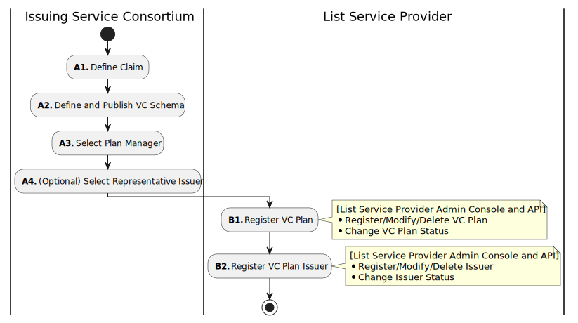
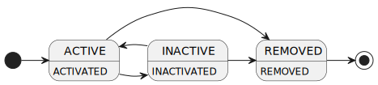
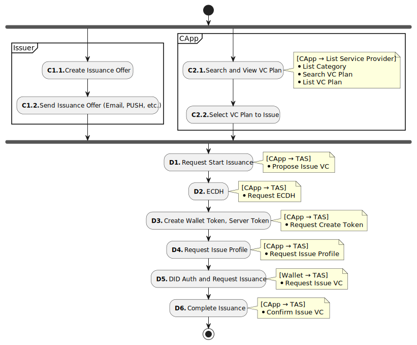
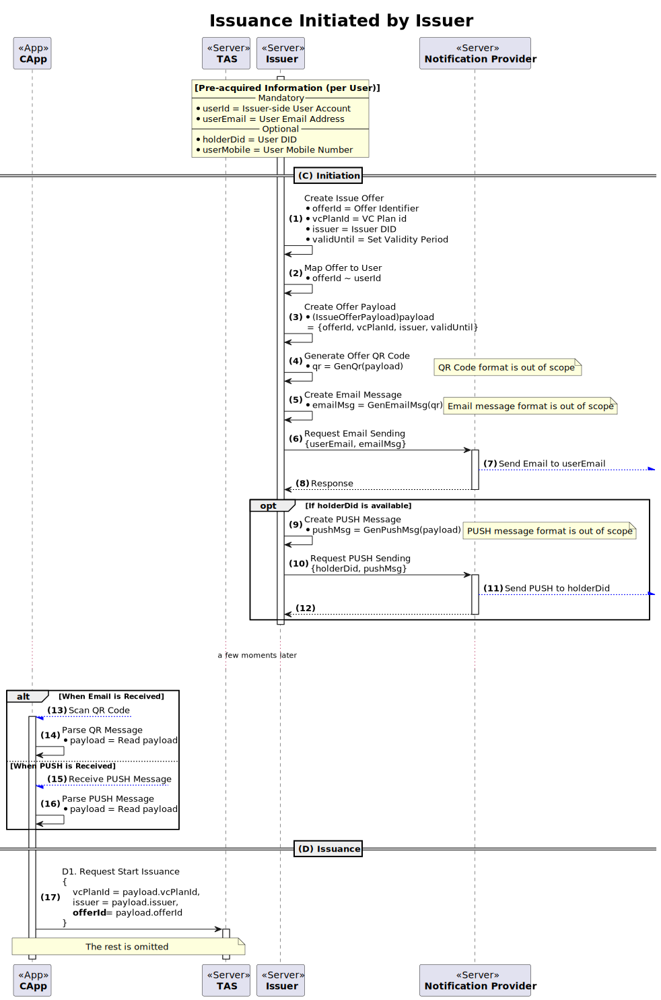
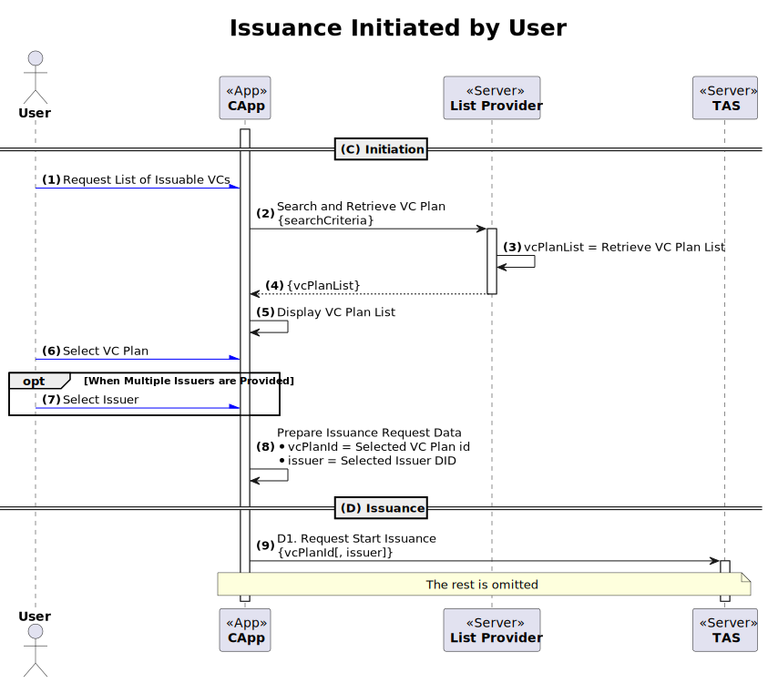
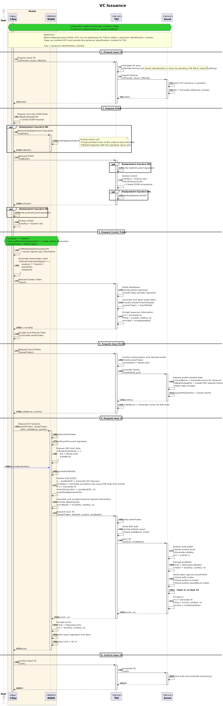

---
puppeteer:
    pdf:
        format: A4
        displayHeaderFooter: true
        landscape: false
        scale: 0.8
        margin:
            top: 1.2cm
            right: 1cm
            bottom: 1cm
            left: 1cm
    image:
        quality: 100
        fullPage: false
---

VC Issuance
==

- Subject: Explanation of VC Issuance Concept
- Author: OpenSource Development Team
- Date: 2024-10-18
- Version: v1.0.0

| Version | Date       | Changes         |
| ------- | ---------- | --------------- |
| v1.0.0  | 2024-10-18 | Initial version |

<br>

Table of Contents
---

<!-- TOC tocDepth:2..4 chapterDepth:2..6 -->

- [1. Overview](#1-overview)
    - [1.1. Reference Documents](#11-reference-documents)
- [2. General Matters](#2-general-matters)
    - [2.1. Data Types and Constants](#21-data-types-and-constants)
- [3. Preliminary Procedures](#3-preliminary-procedures)
    - [3.1. VC Plan](#31-vc-plan)
      - [3.1.1. VC Plan Lifecycle](#311-vc-plan-lifecycle)
      - [3.1.2. VC Plan Data Structure](#312-vc-plan-data-structure)
- [4. Issuance Procedures](#4-issuance-procedures)
    - [4.1. Issuer-Initiated Issuance](#41-issuer-initiated-issuance)
      - [4.1.1. IssueOfferPayload](#411-issueofferpayload)
    - [4.2. User-Initiated Issuance](#42-user-initiated-issuance)
    - [4.3. Issuance](#43-issuance)

<!-- /TOC -->

<div style="page-break-after: always;"></div>

## 1. Overview

This document explains the overall concept of VC issuance for OpenDID.
The VC issuance sequence is as follows:

1. Preliminary Procedures
    - (A) Planning
        - (A1) Define Claim
        - (A2) Define and Publish VC Schema
        - (A3) Select Plan Manager
        - (A4) (Optional) Select Representative Issuer
    - (B) Registration
        - (B1) Register VC Plan
        - (B2) Register VC Plan Issuer
1. Issuance Procedures
    - (C) Initiation 
        - (C1) Issuer Initiated
            - (C1.1) Create Issuance Offer
            - (C1.2) Send Issuance Offer Message (QR, PUSH, etc.)
        - (C2) User Initiated
            - (C2.1) Search and View VC Plan
                - List Category
                - Search VC Plan
                - List VC Plan
            - (C2.2) Select VC Plan to Issue
    - (D) Issuance 
        - (D1) Request to start issuance - `[API] Propose Issue VC`
        - (D2) ECDH (Establish Secure Session) - `[API] Request ECDH`
        - (D3) Create wallet token, server token - `[API] Request Create Token`
        - (D4) Request issue profile - `[API] Request Issue Profile`
        - (D5) DID auth and issuance request - `[API] Request Issue VC`
        - (D6) Issuance complete - `[API] Confirm Issue VC`

### 1.1. Reference Documents

| Reference Name     | Document Name                             | Location |
| ------------------ | ------------------------------------------| -------- |
| [OSD]              | OpenDID Schema Definition Language        |          |
| [DATA-SPEC]        | (OpenDID) Data Specification              |          |
| [VC-SCHEMA-FORMAT] | (OpenDID) VC Schema Format                |          |
| [PROFILE-FORMAT]   | (OpenDID) Profile Format                  |          |

<div style="page-break-after: always;"></div>

## 2. General Matters

### 2.1. Data Types and Constants

Refer to `[DATA-SPEC]` for items not defined here.

```c#
def enum LOGO_IMAGE_TYPE: "logo image type"
{
    "jpg", "png"
}

def enum OFFER_TYPE: "offer type"
{
    "IssueOffer" : "issuance offer information",
    "VerifyOffer": "submission offer information",
}

def object LogoImage: "logo image data"
{
    + LOGO_IMAGE_TYPE "format": "image format"
    + select(1)
    {
        ^ url       "link" : "logo image URL - URL to download image"
        ^ multibase "value": "multibase(image) - multibase of the original image"
    }
}
```

<div style="page-break-after: always;"></div>

## 3. Preliminary Procedures

The preliminary procedures for VC issuance are as follows.



If the issuer is not acting alone, the first step is to form a consortium of issuers. 
If acting alone, the issuer does not share Claims or VC Schema, effectively performing the consortium's role.

The roles of the consortium are as follows:

- Define the VC to be issued
    - Define Claims
    - Define VC Schema
- Select and delegate authority to the VC Plan Manager
- Manage the VC Plan through the Plan Manager
    - Create and register VC Plan
    - Register representative issuers
    - Manage the list of participating issuers
    - Manage the status of the VC Plan

After the VC Plan is registered, each issuer must register their own information.

- Name, description, reference URL, logo image

### 3.1. VC Plan

**VC Plan** includes information about the VC issuance service, containing the following details:

- Basic information such as the name, description, and logo image of the issuance service
- Details of the VC to be issued (VC Schema)
- Who issues the VC (delegator, allowedIssuers)
- Available options (option)
- Who manages the VC Plan (manager)

#### 3.1.1. VC Plan Lifecycle

The lifecycle of a VC Plan is as follows:



- ACTIVE
    - Immediately after the creation of the VC Plan and in a state where issuance is possible
    - Can transition to INACTIVE
- INACTIVE
    - Usage suspended by the Plan Manager
    - Can transition to ACTIVE
- REMOVED
    - Deleted by the Plan Manager

#### 3.1.2. VC Plan Data Structure

##### 3.1.2.1. VcPlan

The data structure for registering a VC Plan from the administrator screen of the list issuer.

```c#
def object VcPlan: "VC plan information"
{
    + vcPlanId      "vcPlanId"   : "VC plan id"
    + string        "name"       : "VC plan name"
    + string        "description": "VC plan description"
    - url           "ref"        : "reference page URL"
    - LogoImage     "logo"       : "logo image"
    - utcDatetime   "validFrom"  : "start date and time for issuance"
    - utcDatetime   "validUntil" : "end date and time for issuance"
    - array(string) "tags"       : "list of hashtags for search"

    + object "credentialSchema": "VC Schema information"
    {
        + url                    "id"  : "VC Schema URL"
        + CREDENTIAL_SCHEMA_TYPE "type": "VC Schema format type"
    }

    + object "option": "option settings"
    {
        + bool "allowUserInit"    : "allow issuance initiation by user"
        + bool "allowIssuerInit"  : "allow issuance initiation by issuer"
        + bool "delegatedIssuance": "allow delegated issuance by representative issuer"
    }

    // ~/option/delegatedIssuance (delegated issuance) value-based selection
    + select(1)
    {
        // When delegated issuance = true
        ^ did "delegator": "DID of the delegated (representative) issuer"

        // When delegated issuance = false
        ^ array(did) "allowedIssuers": "list of allowed issuer DIDs for VC plan"
    }

    // manager denotes the entity authorized to modify the content or issuer information of the plan
    + did "manager": "entity with management authority over the VC plan"
}
```
<div style="page-break-after: always;"></div>

## 4. Issuance Procedures

The VC issuance procedures are shown in the diagram below.



There are two flows in the initiation.

1. Issuer-Initiated Issuance
2. User-Initiated Issuance

### 4.1. Issuer-Initiated Issuance

In this method, the issuer already has the holder's information for the VC to be issued and provides the issuance session information to the user.
This issuance session information is called the **Issue Offer**.
For example, a government employee ID will be issued only to employees of the respective public institution, so the necessary information for issuance is pre-registered and the issuance link is simply delivered.

The following conditions are prerequisites for issuer-initiated issuance.

1. The issuer already has the following information about the user who will receive the VC:
    - (Mandatory) User account, email address
    - (Optional) DID, mobile phone number
2. The issuer has a KYC method to verify the user's identity.
    - Examples: email verification, mobile phone authentication, government employee certificate verification
3. The VC Plan for the VC to be issued is registered.
4. The issuer is registered as an issuer for the respective VC Plan.

The following flowchart explains the issuer-initiated issuance process.
This document defines only the payload content of the Issue Offer, and the following items are outside the scope of this document and thus not defined in detail.

- QR codes and PUSH messages containing the payload
- Email messages containing QR codes
- Other interface messages containing the payload

Therefore, in each implementation, only the payload must follow the standard, and the remaining formats can be freely defined according to individual requirements.



#### 4.1.1. IssueOfferPayload

```c#
def object IssueOfferPayload: "issue offer payload"
{
    + uuid        "offerId"   : "issuance offer id"
    + OFFER_TYPE  "type"      : "offer type", value("IssueOffer")
    + vcPlanId    "vcPlanId"  : "VC plan id"
    + did         "issuer"    : "issuer DID"
    - utcDatetime "validUntil": "expiration date and time for issuance"
}
```
### 4.2. User-Initiated Issuance

In this method, the user selects the VC to be issued and initiates the issuance.



The following items are outside the scope of this document.

- Methods for searching and viewing VC Plans
- Data structure of the viewed VC Plan

However, the following information must be included in the VC Plan data.

- VC Plan id
- Issuer DID

### 4.3. Issuance

After the initiation, the issuance procedures are carried out to complete the issuance.
In this step, the authorization app, wallet, TAS, and issuer perform their respective roles in an integrated manner. The overall flow is explained here, and detailed information can be found in the documents below.

- TAS API
- Issuer API

Signing information for ECDH, E2E requests and acceptances is optional, so the `signKeyAgree(...)` part in the flowchart below can be omitted.

