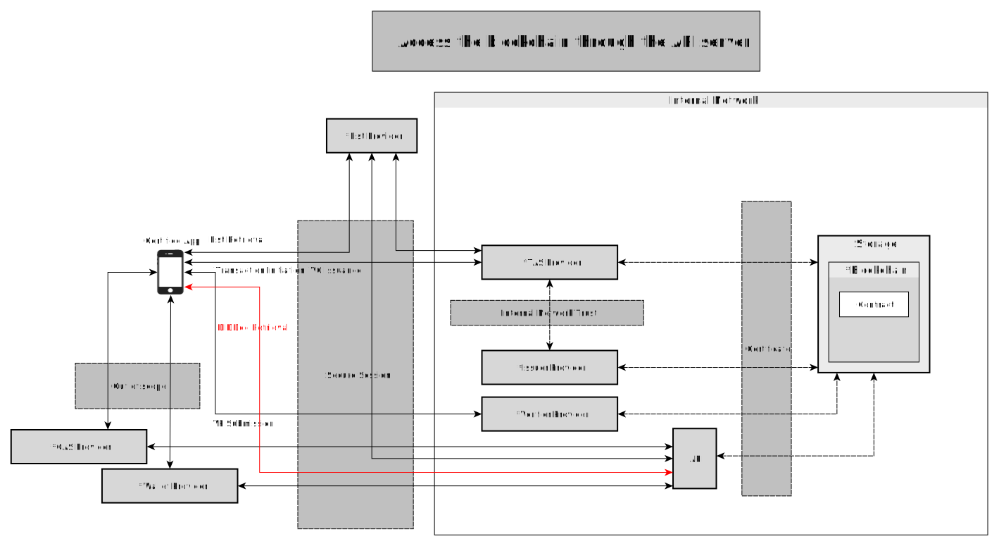
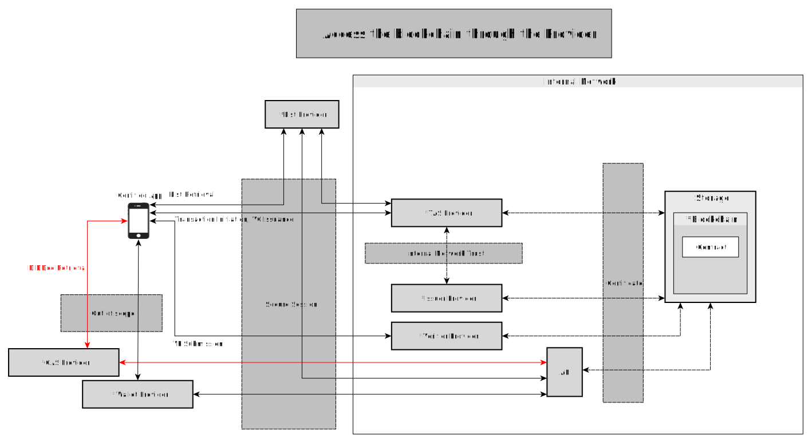

# Blockchain Integration

- Subject: Blockchain Integration
- Author: OpenSource Development Team
- Date: 2024-10-18
- Version: v1.0.0

| Version | Date       | Changes         |
| ------- | ---------- | --------------- |
| v1.0.0  | 2024-10-18 | Initial version |

 

## Connecting to the Blockchain via API Server
- For public blockchains, direct access from external networks to the blockchain is possible.
- In OpenDID, rather than connecting directly from the app to the blockchain, a server-mediated approach is utilized.
- An API server, certified with an authentication certificate, sits in front of the blockchain, enabling access to it.

## Blockchain Integration via Providers
- Assume a trust channel exists between wallet-to-wallet servers and CApp-to-CApp servers.
    - Communication among services provided by different providers is considered out of scope.
- Private blockchains do not allow direct external access.
- A server receiving requests in front of the blockchain is necessary.
    - Each provider assumes this role.
    - Wallets and CApps access the blockchain via their respective servers.
- Security Sessions
    - Security session establishment can be omitted among providers within the intranet.
    - External networks require a security session to access the intranet.

