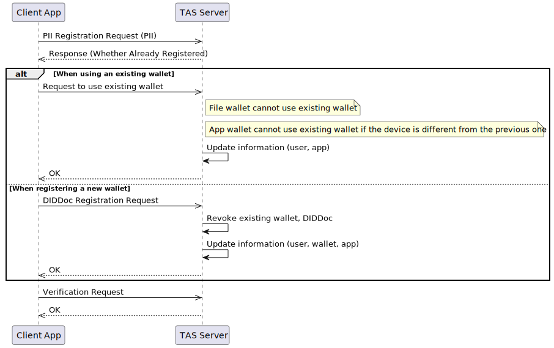
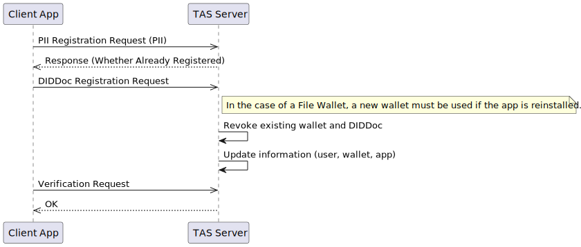
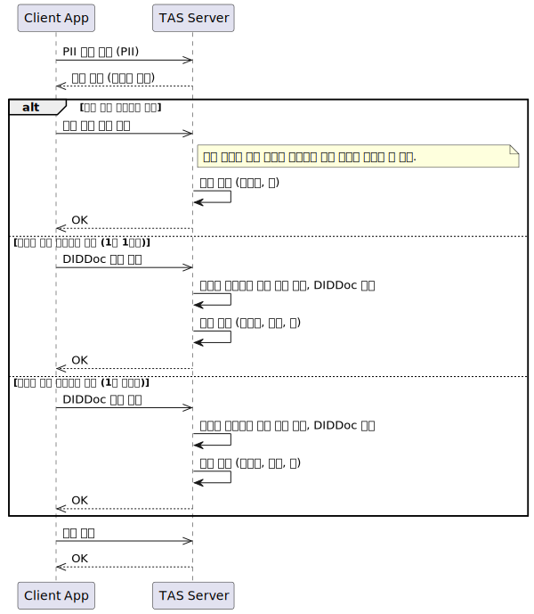
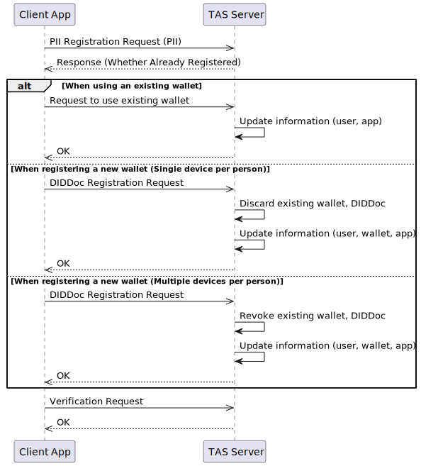

# PII

- Subject: Mange of PII
- Author: OpenSource Development Team
- Date: 2024-10-18
- Version: v1.0.0

| Version | Date       | Changes         |
| ------- | ---------- | --------------- |
| v1.0.0  | 2024-10-18 | Initial version |

 

## Overview
`TAS` must store the User's PII (Personally Identifiable Information). When PII is received, it can be used as follows:

1. During the user registration protocol to verify if the user is already registered.
2. During the VC issuance protocol to provide the PII to the `Issuer`.

However, the process of receiving PII is outside the scope of OpenDID, and thus PII-related content is not included in the TAS API.

Therefore, a clear design is needed on how `TAS` will receive and utilize PII.

## PII Usage Scenarios
### Purpose of PII
#### User Identification
- `[TAS]` can verify if the user is already a registered user.

#### Used in VC Issuance
- `[TAS → Issuer]` PII can be provided during VC issuance.
  - **Accurate Authentication:** PII can be used to accurately verify and authenticate the user's identity.
  - **Enhanced Trustworthiness:** PII manages issued VC identifiers and prevents fraudulent issuance.

### When Should PII be Received?
- `[Wallet → TAS]` PII should be received before sending the DID Document.

## Design Considerations
### Data Collection and Storage
- **Data Protection:** Collected PII must be encrypted and securely stored with restricted access.
- **Legal Compliance:** Data collection and storage processes must comply with relevant laws and regulations.
- **Data Minimization:** Only the minimum necessary PII should be collected to adhere to data protection principles.

### Data Utilization
- **Purpose Limitation:** Collected PII should not be used beyond the specified purposes.
- **User Consent:** Clear consent must be obtained from users for the use of their PII.
- **Transparency:** Users should be informed about how their PII is used to ensure transparency.

### Data Deletion
- **Data Destruction:** Need to establish procedures to securely delete PII upon user request.
- **Data Retention:** If data needs to be retained for a certain period due to legal requirements, users should be clearly informed.

## Sequence Diagram
[wallet.md](./wallet.md) Refer to the policy

### Common

### File Wallet

### App Wallet

### Cloud Wallet
