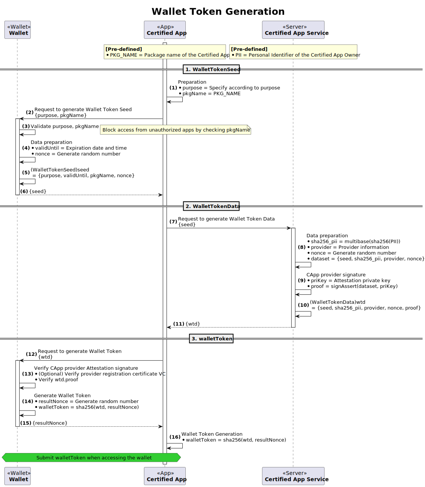
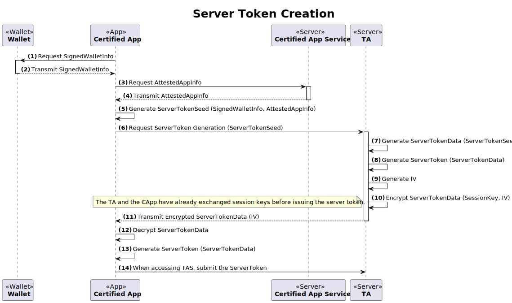
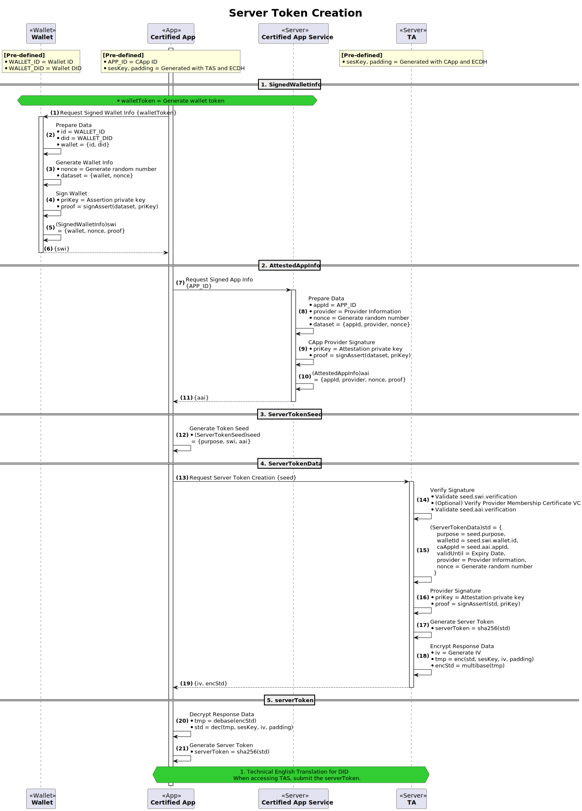

# Open DID Token

- 주제 : Open DID Token
- 작성 : 오픈소스개발팀
- 일자 : 2024-10-18
- 버전 : v1.0.0

| 버전 | 일자       | 변경         |
| ------- | ---------- | --------------- |
| v1.0.0  | 2024-10-18 | 최초 작성 |

<br>

Open DID는 클라이언트의 권한을 확인하기 위해 다양한 토큰들을 사용합니다.
이 장에서는 Open DID에서 사용하는 토큰들의 기능과 데이터 규격을 상세히 정의하고, 토큰의 발급 과정을 체계적으로 정리합니다.

## 참조문서

| 참조명      | 문서명                                               | 위치                                     |
| ----------- | ---------------------------------------------------- | ---------------------------------------- |
| [OSD]       | OpenDID Schema Definition Language                   |                                          |
| [DATA-SPEC] | (OpenDID) 데이터 명세서(Data Specification)          |                                          |

## 토큰의 필요성
토큰은 Open DID 시스템에서 보안과 인증을 유지하는데 필요합니다. 다음은 토큰이 필요한 주요 이유입니다.
- **보안성**: 토큰은 사용자의 자격 증명을 안전하게 전달하고 저장하는 데 사용됩니다. 이를 통해 민감한 정보가 노출되지 않도록 보호합니다.
- **인증**: 토큰을 사용하면 서버와 클라이언트 간의 신뢰 관계를 쉽게 설정하고 유지할 수 있습니다. 발행자는 토큰을 통해 요청을 보낸 클라이언트를 인증할 수 있습니다.
- **권한 부여**: 토큰을 통해 특정 리소스나 기능에 대한 접근 권한을 부여할 수 있습니다. 이는 접근 제어를 세밀하게 관리하는 데 도움이 됩니다.

## 토큰의 종류
Open DID에서 사용하는 토큰은 Wallet Token과 Server Token이 있습니다.

### Wallet Token
Wallet Token은 App이 Wallet에 접근할 수 있게 하는 Token으로 Wallet이 발급합니다.

#### Wallet Token 용어
* **Wallet Token Seed**: Wallet이 생성하여 App에 전달하는 초기 시드 값입니다.
* **Wallet Token Data**: 인가앱 서비스가 생성하여 App에 전달하는 데이터로, WalletTokenSeed를 기반으로 생성됩니다. 이는 Wallet Token 생성을 위한 주요 데이터입니다.
* **Nonce**: Wallet이 생성하는 일회용 값으로, WalletTokenData와 조합하여 Wallet Token을 생성하는 데 사용됩니다.
* **Wallet Token**: Wallet에 접근할 수 있는 권한을 부여하는 토큰으로, App이 Wallet과 상호작용할 때 사용됩니다.

#### Wallet Token 발급 과정
아래는 Wallet Token 발급 과정을 요약하여 그린 다이어그램입니다.


1. 인가앱은 Wallet에 WalletTokenSeed를 요청합니다.
2. Wallet은 WalletTokenSeed를 생성하여 인가앱으로 전달합니다.
3. 인가앱은 인가앱 서비스에게 WalletTokenData를 요청합니다.
4. 인가앱 서비스는 WalletTokenData를 생성하여 인가앱으로 전달합니다.
5. 인가앱은 Wallet에게 월렛토큰 생성을 요청합니다.
6. 월렛은 nonce를 생성합니다. 
7. 월렛은 nonce와 WalletTokenData와 조합하여 Wallet Token을 생성합니다.
8. 월렛은 Wallet Token을 저장합니다.
9. 월렛은 App에 wallet Token을 전달합니다.
10. 인가앱은 WalletTokenData와 nonce를 조합하여 Wallet Token을 생성합니다.
11. 인가앱은 Wallet을 사용할 때마다 WalletToken을 제출합니다.

#### Wallet Token 상세 발급 과정


#### Wallet Token 데이터
아래는 Wallet Token을 생성하기 위해 필요한 데이터 규격입니다. 자세한 내용은 [DATA-SPEC]를 참고해 주세요.

##### WalletTokenSeed

```c#
def object WalletTokenSeed: "wallet token seed"
{
    + WALLET_TOKEN_PURPOSE "purpose"   : "token 사용 목적"
    + utcDatetime          "validUntil": "token 만료 일시"
    + string               "pkgName"   : "인가앱 패키지명"
    + multibase            "nonce"     : "wallet nonce", byte_length(16)
}
```

##### WalletTokenData

```c#
def object WalletTokenData: "wallet token data"
{
    + WalletTokenSeed "seed"      : "wallet token seed"
    + multibase       "sha256_pii": "multibase(sha256(personId)) - hashed PII"
    + Provider        "provider"  : "월렛 사업자 정보"
    + multibase       "nonce"     : "provider nonce", byte_length(16)
    + AssertProof     "proof"     : "provider proof - 월렛 사업자 서명"
}
```

### Server Token
Server Token은 App이 TA 등의 서비스에 접근할 수 있게 하는 Token이며, 서비스 서버가 발급합니다.

#### Server Token 용어
* **Signed Wallet Info**: Wallet이 인가앱에 전달하는 서명된 월렛 정보로서, TA가 Wallet을 검증하는데 사용됩니다.
* **Attested App Info**: 인가앱 서비스가 인가앱에 전달하는 인증된 앱 정보로서, TA가 인가앱을 검증하는데 사용됩니다.
* **Server Token Seed**: 인가앱이 생성하여 TA에 전달하는 초기 시드 값으로, ServerTokenData 생성을 위한 기본 값입니다.
* **Server Token Data**: TA가 생성하여 인가앱에 전달하는 데이터로, ServerTokenSeed를 기반으로 생성됩니다. 이는 Server Token 생성을 위한 주요 데이터입니다.
* **IV**: 초기화 벡터로, 암호화 과정에서 사용되는 값입니다.
* **Session Key**: TA와 인가앱 간의 세션 키로, 서버토큰 발급 전에 이미 교환된 상태입니다.
* **Server Token**: 서버에 접근할 수 있는 권한을 부여하는 토큰으로, 인가앱이 서버와 상호작용할 때 사용됩니다.

#### Server Token 발급 과정



1. 인가앱은 Wallet에 SignedWalletInfo를 요청합니다.
2. Wallet은 SignedWalletInfo를 생성하여 인가앱에 전달합니다.
3. 인가앱은 인가앱 서비스에 AttestedAppInfo를 요청합니다.
4. 인가앱 서비스는 AttestedAppInfo를 생성하여 인가앱에 전달합니다.
5. 인가앱은 ServerTokenSeed를 생성합니다.
6. 인가앱은 TA에게 ServerToken 생성을 요청합니다.
7. TA는 ServerTokenData를 생성합니다.
8. TA는 ServerToken을 생성합니다.
9. TA는 IV를 생성합니다.
10. TA는 ServerTokenData를 암호화합니다.
11. TA는 암호화된 ServerTokenData를 인가앱에 전달합니다.
12. 인가앱은 ServerTokenData를 복호화합니다.
13. 인가앱은 ServerToken을 생성합니다.
14. 인가앱은 TA에 요청할 때마다 ServerToken을 제출합니다.

#### Server Token 상세 발급 과정



#### Server Token 데이터
아래는 Server Token을 생성하기 위해 필요한 데이터 규격입니다. 자세한 내용은 [DATA-SPEC]를 참고해 주세요.

##### SignedWalletInfo

```c#
def object SignedWalletInfo: "signed wallet information"
{
    + object "wallet": "wallet information"
    {
        + walletId "id" : "wallet id"
        + did      "did": "wallet DID"
    }
    + multibase   "nonce": "wallet nonce", byte_length(16)
    + AssertProof "proof": "wallet proof - 월렛 서명"
}
```

##### AttestedAppInfo

```c#
def object AttestedAppInfo: "attested app information"
{
    + appId       "appId"   : "인가앱 id"
    + Provider    "provider": "인가앱 사업자 정보"
    + multibase   "nonce"   : "provider nonce", byte_length(16)
    + AssertProof "proof"   : "provider proof - 인가앱 사업자 서명"
}
```

##### ServerTokenSeed

```c#
def object ServerTokenSeed: "server token seed"
{
    + SERVER_TOKEN_PURPOSE "purpose"   : "token 사용 목적"
    + SignedWalletInfo     "walletInfo": "signed wallet information"
    + AttestedAppInfo      "caAppInfo" : "attested caApp information"
}
```

##### ServerTokenData

```c#
def object ServerTokenData: "server token data"
{
    + SERVER_TOKEN_PURPOSE "purpose"   : "token 사용 목적"
    + walletId             "walletId"  : "wallet id"
    + appId                "caAppId"   : "인가앱 id"
    + utcDatetime          "validUntil": "token 만료 일시"
    + Provider             "provider"  : "사업자 정보"
    + multibase            "nonce"     : "provider nonce", byte_length(16)
    + AssertProof          "proof"     : "provider proof - 사업자 서명"
}
```