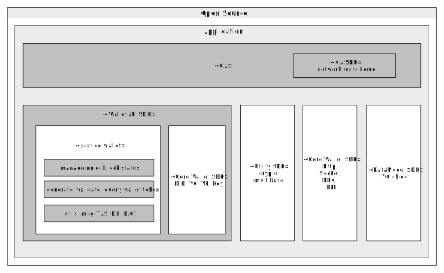

# 월렛
<!-- 개별 문서는 향후에 병합될 수 있으므로, 목차는 사용하지 않습니다. -->

- 주제 : 월렛 인터페이스
- 작성 : 오픈소스개발팀
- 일자 : 2024-10-18
- 버전 : v1.0.0

| 버전 | 일자       | 변경         |
| ------- | ---------- | --------------- |
| v1.0.0  | 2024-10-18 | 최초 작성 |

<br>

사용자는 자신의 지갑을 생성하여, 자신의 디지털 ID 및 신원증명서를 안전하게 저장하고 사용 할 수 있다. 월렛은 아래의 타입을 지원한다.

```code
- Local Wallet : 스마트폰 기반의 앱 월렛을 우선 지원하고 향후 단말기 제조사와의 협업을 통해 TEE 기반의 월렛으로 확장합니다.
- Remote Wallet : 모빌리티 대응 및 기능 확장성, 포용성을 확대하기 위해 클라우드 기반의 월렛을 지원합니다.
```

### 1. 월렛 분류


|          | 인가앱+SDK | 월렛 단독앱 | 클라우드 월렛 |
|----------|----------|----------|----------|
|   형태  |   File   |   File   |   HSM/File   |
|   인가앱과 관계(인가앱: 월렛) |   1:1   |   N:1   |   N:1   |
|   월렛 설치(초기화)  |   embeded 형태이므로 인가앱이 설치 시 생성   |   설치할 월렛앱의 deeplink를 통해 설치, 월렛앱의 호출정보(AOS는 package name, iOS는 url scheme)를 획득   |   월렛의 URL 정보를 획득하며, 별도의 사용자 인증(ex:FIDO)이 필요하면 월렛 사업자가 제공하는 앱 형태의 FIDO인증앱을 호출하여 사용자를 등록하는 과정 (별도의 인증앱이 없으면 클라우드 월렛이 목록 사업자에 추가 될때마다 인가앱의 수정이 필요함)   |
|   월렛 생성  |   인가앱 내부에 월렛파일을 생성 및 디바이스 키쌍을 생성하고 관리 데이터 db테이블 생성   |   월렛앱에 월렛파일을 생성 및 디바이스 키쌍을 생성하고 관리데이터 db테이블 생성   |   파일을 생성하거나 HSM을 통해 디바이스 키쌍을 생성하고 클라우드 월렛 db에 row 추가   |
|   월렛삭제  |   초기화 이전 상태로(월렛파일 삭제, db삭제)   |   월렛앱 삭제   |   월렛관리 테이블(DB)에 등록된 row 삭제   |
<br>


### 2. 월렛 기능(I/F)



#### 월렛 인터페이스에 아래 기능에 대한 함수를 정의하고 월렛의 분류에 따라 함수의 내부 구현이 달라짐
* 월렛의 service영역(월렛잠금, 토큰)과 core영역(Key, DID, VC, VP)에 대한 분리
* cloud wallet의 경우에는 wallet interface를 사용하지 않고 인가앱에서 직접 통신함 (인가앱의 comm SDK 필요)
* 월렛 lock/ unlock
    * DID, VC, VP등의 객체 생성에 대한 접근 권한, 월렛 삭제 권한(lock과 별개로 사용자 인증이 필요)
    * lock일 경우에는 월렛 초기화 및 월렛의 관리데이터 조회만 가능
    * lock이 옵션이면 월렛은 passcode 설정 전까지 unlock 상태
    * 월렛 조회
        * 월렛 관리데이터 조회
    * 월렛 삭제
        * 월렛을 초기화 이전 상태로 변경
        
<br>

### 3. 월렛 관리 데이터
* 모바일 월렛 관리 데이터(토큰, 잠금)는 DB 테이블로 관리함
* 인가앱의 패키지정보 관리
* 월렛 토큰 관리
* 월렛 ID, 인가앱 패키지정보, 월렛 상태(lock, unlock), 월렛토큰 등 DB또는 File로 관리 되어야 함

<br>

### 4. 월렛 토큰 purpose 관리
|  | 월렛 토큰 | 서버 토큰 |
|----------|----------|----------|
|   개인화  |   O   |      |
|   비개인화 |   O   |      |
|   개인화& 월렛잠금  |   O   |      |
|   월렛잠금  |   O   |      |
|   DID발급  |   O   |   O   |
|   DID갱신  |   O   |   O   |
|   VC발급  |   O   |   O   |
|   DID발급& 가입증명서 발급  |   O   |   O   |
|   VC삭제  |   O   |   O   |
|   VP제출  |   O   |   O   |
|   VC목록조회  |   O   |   |
|   VC상세조회  |   O   |      |
|   DID생성& VC발급  |   O   |   O   |

<!-- 한줄 띄기 입니다. -->
<br>
