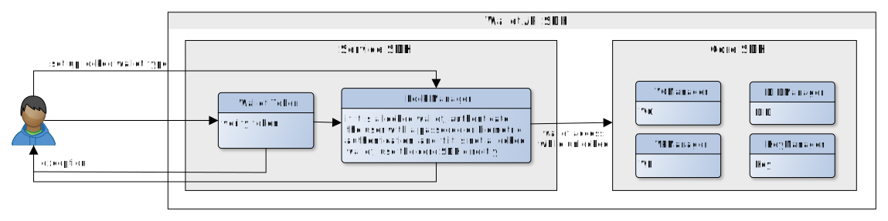
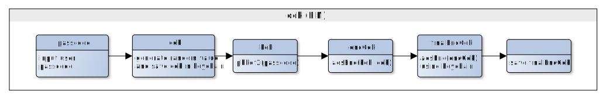
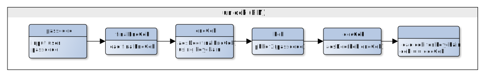
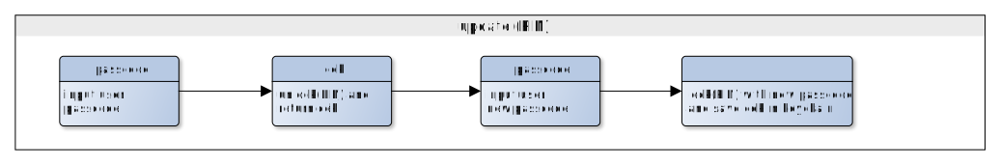

# Wallet Lock
<!-- Individual documents may be merged in the future, so a table of contents is not used. -->

- Subject: Wallet Lock
- Author: OpenSource Development Team
- Date: 2024-10-18
- Version: v1.0.0

| Version | Date       | Changes         |
| ------- | ---------- | --------------- |
| v1.0.0  | 2024-10-18 | Initial version |

<br>

It generates, changes, and retrieves a cek (content encryption key) based on the passcode received from the Certified App (CApp).
<br>
The cek is managed by the service wallet and is used during wallet lock/unlock.
The passcode input screen is implemented in the CApp, and the passcode is matched when registered or changed.

The locked and non-locked wallets operate according to user authentication as follows.



The technical logic for registering and authenticating a user's passcode to set up a locked wallet is explained below.

* Terms
    * cek = content encryption key
    * kek = key encryption key
    * pbkdf = password-based key derivation function

### 1. Wallet Lock (PIN)



### Example
```code
let sacObject = SecAccessControlCreateWithFlags(kCFAllocatorDefault
                                                , kSecAttrAccessibleWhenUnlockedThisDeviceOnly
                                                , []
                                                , &errorRef)
        
let queryForDelete: [CFString: Any] = [kSecClass: kSecClassGenericPassword, kSecAttrService: "KEY_PIN_CHAIN_DATA"]
        
var status = SecItemDelete(queryForDelete as CFDictionary)
WalletLogger.shared.debug("item delete status: \(status)")

var cek: NSMutableData
if self.seedKey == nil {
    cek = NSMutableData(length: 32)!
    _ = SecRandomCopyBytes(kSecRandomDefault, 32, cek.mutableBytes)
}  else {
    cek = NSMutableData(data: self.seedKey!)
}

let salt = try MultibaseUtils.decode(encoded: "f6c646576656c6f7065726c3139383540676d61696c2e636f6d")
 
let kek = try CryptoUtils.pbkdf2(password: passcode.data(using: .utf8)!, salt: salt, iterations: 2048, derivedKeyLength: 32)

WalletLogger.shared.debug("======[H] kek: \(MultibaseUtils.encode(type: MultibaseType.base16, data: kek))")
        
let iv = try MultibaseUtils.decode(encoded: "z75M7MfQsC4p2rTxeKxYh2M")
        
let encCek = try CryptoUtils.encrypt(plain: cek as Data, info: CipherInfo(cipherType: SymmetricCipherType.aes256CBC, padding: SymmetricPaddingType.pkcs5), key: kek, iv: iv)

WalletLogger.shared.debug("======[H] encCek: \(MultibaseUtils.encode(type: MultibaseType.base16, data: encCek))")
        
let finalEncCek = try SecureEncryptor.encrypt(plainData: encCek as Data)
```
<br>

### 2. Wallet Unlock (PIN)


<br>

### Example
```swift
let finalEncCek = try MultibaseUtils.decode(encoded: CoreDataManager.shared.selectUser()!.finalEncKey)

WalletLogger.shared.debug("======[H] finalEncCek: \(MultibaseUtils.encode(type: MultibaseType.base16, data: finalEncCek))")

let encCek = try SecureEncryptor.decrypt(cipherData: finalEncCek)
WalletLogger.shared.debug("======[H] encCek: \(MultibaseUtils.encode(type: MultibaseType.base16, data: encCek))")

let salt = try MultibaseUtils.decode(encoded: "f6c646576656c6f7065726c3139383540676d61696c2e636f6d")
let kek = try CryptoUtils.pbkdf2(password: passcode.data(using: .utf8)!, salt: salt, iterations: 2048, derivedKeyLength: 32)

WalletLogger.shared.debug("======[H] kek: \(MultibaseUtils.encode(type: MultibaseType.base16, data: kek))")

let iv = try MultibaseUtils.decode(encoded: "z75M7MfQsC4p2rTxeKxYh2M")
let decCek = try CryptoUtils.decrypt(cipher: encCek, info: CipherInfo(cipherType: SymmetricCipherType.aes256CBC, padding: SymmetricPaddingType.pkcs5), key: kek, iv: iv)

WalletLogger.shared.debug("======[H] decCek: \(MultibaseUtils.encode(type: MultibaseType.base16, data: decCek))")


var dataTypeRef: CFTypeRef?

let query: [CFString: Any] = [
    kSecClass: kSecClassGenericPassword,
    kSecAttrService: "KEY_PIN_CHAIN_DATA",
    kSecReturnData: true
]

let status = SecItemCopyMatching(query as CFDictionary, &dataTypeRef)
WalletLogger.shared.debug("item matching status : \(status)")


let cek = dataTypeRef as! Data
WalletLogger.shared.debug("======[H] load cek: \(MultibaseUtils.encode(type: MultibaseType.base16, data: cek))")

if cek as Data == decCek {
    return cek as Data
}
```


### 3. Wallet PIN Change (TO-DO)

