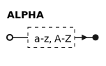
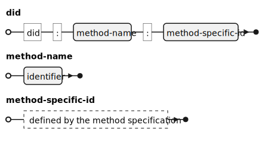
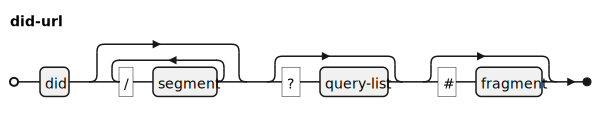
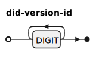
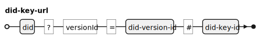
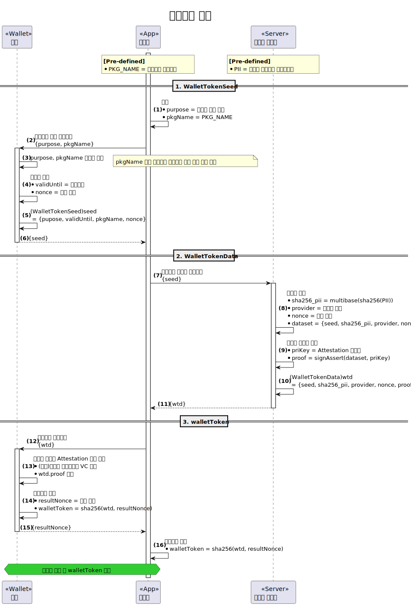
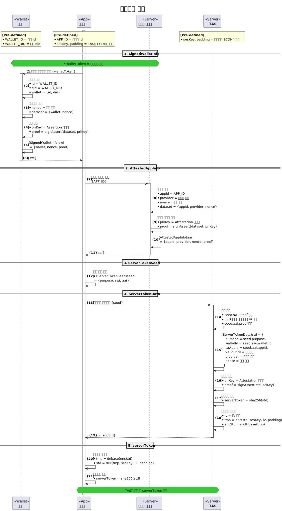

---
puppeteer:
    pdf:
        format: A4
        displayHeaderFooter: true
        landscape: false
        scale: 0.8
        margin:
            top: 1.2cm
            right: 1cm
            bottom: 1cm
            left: 1cm
    image:
        quality: 100
        fullPage: false
---

Data Specification
==

- Subject: Structure and Requirements of Major Data
- Author: Kang Young-ho
- Date: 2024-09-03
- Version: v1.0.0

| Version | Date       | Changes         |
| ------- | ---------- | --------------- |
| v1.0.0  | 2024-09-03 | Initial version |

<div style="page-break-after: always;"></div>

Table of Contents
---

<!-- TOC tocDepth:2..3 chapterDepth:2..6 -->

- [1. Overview](#1-overview)
    - [1.1. Notation](#11-notation)
- [2. Data Types](#2-data-types)
    - [2.1. General](#21-general)
    - [2.2. DID Document](#22-did-document)
    - [2.3. VC, VP](#23-vc-vp)
    - [2.4. OpenDID Implementation](#24-opendid-implementation)
- [3. Constants](#3-constants)
    - [3.1. General](#31-general)
    - [3.2. DID Document](#32-did-document)
    - [3.3. VC, VP](#33-vc-vp)
    - [3.4. Profile](#34-profile)
    - [3.5. OpenDID Implementation](#35-opendid-implementation)
- [4. Data Structures](#4-data-structures)
    - [4.1. General](#41-general)
    - [4.2. DID Document](#42-did-document)
    - [4.3. VC Schema](#43-vc-schema)
    - [4.4. VC, VP](#44-vc-vp)
    - [4.5. Profile](#45-profile)
    - [4.6. OpenDID Implementation](#46-opendid-implementation)

<!-- /TOC -->


<div style="page-break-after: always;"></div>

## 1. Overview

This document defines the major data commonly used by various entities in OpenDID.

- Major data types: UTC datetime, multibase, etc.
- Standard document structures like DID Document, VC Schema, VC, VP, Profile
- Data structures commonly used in API specifications
- Specific data structures like Wallet Token, Server Token

Key data like DID Document, VC, VP formats are detailed in separate documents.
In case of any discrepancy between this document and the individual documents, this document shall prevail.

### 1.1. Notation

#### 1.1.1. OSD

The OSD (OpenDID Schema Definition Language) syntax is used to define data types and data structures.

#### 1.1.2. EBNF Diagram

EBNF (Extended Backus-Naur Form) diagrams are used to intuitively represent data type structures.

The following defines the terminals and non-terminals used in this document.

**■ Terminal**




<div style="page-break-after: always;"></div>

## 2. Data Types

This chapter defines the data types commonly used in OpenDID.

```c#
// General
def string identifier   : "identifier", regex(/[a-zA-Z_][0-9a-zA-Z_]*?/)
def string itemName     : "item name", regex(/[0-9a-zA-Z_\-\.]+/)
def string uuid         : "UUID"
def string utcDatetime  : "UTC datetime"
def string multibase    : "Multibase"
def string url          : "URL"
def string namespaceId  : "namespace id"
def string personId     : "PII - Personally Identifiable Information"

// DID Document
def string did          : "DID id. ex: 'did:omn:12345678abcdefg'"
def string didUrl       : "DID URL"
def string didVersionId : "DID version id. ex: '1', '2'", regex(/[0-9]+/)
def string didKeyId     : "DID key id"
def string didServiceId : "DID service id"
def string didKeyUrl    : "DID key URL"
def string didServiceUrl: "DID service URL"

// VC, VP, Profile
def string vcId      : "VC id"
def string vpId      : "VP id"
def string claimCode : "Claim code"
def string vcAttachId: "VC attachment id"
def string vcDigest  : "W3C subresource integrity"

// OpenDID Implementation
def string messageId       : "Message id"
def string errorCode       : "Error code"
def string appId           : "Client application id", length(20)
def string walletServiceId : "Wallet service id"
def string walletId        : "Wallet id", length(20)
def string refId           : "Reference id", length(20)
def string vcPlanId        : "VC plan id", length(20)
```

### 2.1. General

#### 2.1.1. identifier

An identifier name similar to variable names in Java.
It consists of uppercase and lowercase letters, numbers, and underscores, but the first character cannot be a number.


[Examples]

- "reqMsg123"
- "_res"
- "attach_ref_num"

#### 2.1.2. itemName

`itemName` is used similarly to `identifier` but allows a wider range of characters.
It can consist of the following types of characters, regardless of the first character.

- Uppercase and lowercase letters
- Numbers
- Underscore ("_")
- Dash ("-")
- Dot (".")


[Examples]

- "userDid"
- "DAT_ISSUE_PROFILE"
- "a.b.c.d.1"
- "010-1234-5678"

#### 2.1.3. uuid

UUID (Universally Unique Identifier) is a standard for identifiers used in software construction,
standardized as part of the Distributed Computing Environment (DCE) by the Open Software Foundation (OSF).
Used to create unique identifiers for various purposes in the OpenDID project, such as:

- Device identifiers for certified apps, wallets, etc.
- Transaction codes to identify transactions
- Message identifiers
- Other cases where a unique name is required for a specific item


[Examples]

- "44b70956-cd24-11ed-afa1-0242ac120002"
- "6dcdde42-c0d9-4f79-82fb-128a94ce709b"
- "7148d5c1-31a1-4ecd-87f9-b7b533b80692"

#### 2.1.4. utcDatetime

UTC (Coordinated Universal Time) is a standard for scientific time synchronization that allows the world to maintain a common time.
The time value is expressed with a timezone to represent the same time globally.

The timezone can be represented with a `+` sign like `+09:00`, and `Z` means `+00:00`.
A time value without a timezone represents local time.


[Examples]

- "2021-07-19T17:40:00Z"
- "2021-07-19T17:40:00.000Z"
- "2021-07-19T17:40:00+09:00"

#### 2.1.5. multibase

Multibase standardizes the encoding method of data, used to convert binary data into text.
For example, base16 represents data in hexadecimal, and base58btc is used to create strings like Bitcoin addresses.
Multibase assigns prefixes to each encoding method to distinguish and support them as shown in the table below.

|  Encoding   | Prefix |    Description     |
| ----------- | :----: | ------------------ |
| base16      |   f    | hexadecimal        |
| base16upper |   F    | hexadecimal        |
| base58btc   |   z    | base58 bitcoin     |
| base64      |   m    | rfc4648 no padding |
| base64url   |   u    | rfc4648 no padding |


[Examples]
```
"f4d756c74696261736520697320617765736f6d6521205c6f2f" # f base16
"F4D756C74696261736520697320617765736F6D6521205C6F2F" # F base16upper
"zYAjKoNbau5KiqmHPmSxYCvn66dA1vLmwbt"                 # z base58btc
"mVGhlIHFBvdmVyIDEzIGxhenkgZG9ncy4="                  # m base64
"uaHR0cHM6Ly9rby53aWtpcGVkaWEub3Jn"                   # u base64url
```

#### 2.1.6. url

URL (Uniform Resource Locator) is an address used to access resources on the internet.

[Examples]

- http://example.com/user/12345

#### 2.1.7. namespaceId

Namespace is a logical group of names.
Here, the format is defined without specifying content rules.


[Examples]

- "org.iso.18013.5"
- "org.opendid.v1"
- "kr.ac.myschoool.v1"

#### 2.1.8. personId

`personId` is an identifier used to identify a person, which varies by country or region.
In South Korea, an HMAC hash value called CI (Connected Information) is used.

This document does not specify the form of `personId` but defines the following constraints.

- (Uniqueness) It must be a unique identifier that can identify an individual.
- (Variability) An individual may have more than one identifier throughout their life.
- (Composability) It can be created by combining multiple identifiers such as name and social security number.

[Examples]

- South Korea: "wEi9oYSuekQGxT9MV4rKHG4CO+Zrp+onhLIIuembI8jx/0PLF5Ne3oMBxvUFlN4UmsgjeNErZfmpCVUFHsv8nq=="

### 2.2. DID Document

Data types related to the DID Document are compiled here from the "DID Document format" document.
Refer to the above document for detailed usage.

#### 2.2.1. did

`did` is the id string of the DID.



[Examples]

- "did:omn:userid1234"
- "did:example:abcdefg1234567890"

#### 2.2.2. didUrl

Refer to https://www.w3.org/TR/did-core/#did-url-syntax for more details.
<br>(Some complex parts are omitted for ease of understanding)



[Examples]

- "did:example:123456/path"
- "did:example:123456?versionId=1"
- "did:example:123456#public-key-0"

#### 2.2.3. didVersionId

A value used only in the `versionId` of the DID Document, starting from "1" as a decimal string.
`versionId` manages the change history of individual documents, not the DID Document format version.



#### 2.2.4. didKeyId

`didKeyId` is the name used to identify a key within the DID Document.


[Examples]

- "pin"
- "assert"

#### 2.2.5. didServiceId

`didServiceId` is the name used to identify a service within the DID Document.


[Examples]

- "homepage"
- "certificate-vc"

#### 2.2.6. didKeyUrl

`didKeyUrl` is the DID key locator.
By combining `did`, `versionId`, and `didKeyId`, it can uniquely identify keys even in previous versions.



- Specifying `versionId` to indicate the version of the key.

[Examples]

- "did:example:123456?versionId=2#pin"


#### 2.2.7. didServiceUrl

`didServiceUrl` is the DID service locator.
By combining `did`, `versionId`, and `didServiceId`, it can uniquely identify services even in previous versions.


- Specifying `versionId` to indicate the version of the service.

[Examples]

- "did:example:123456?versionId=2#homepage"

### 2.3. VC, VP

Data types related to VC are compiled here from the "VC format" document.
Refer to the above document for detailed usage.

#### 2.3.1. vcId

A UUID format identifier used to identify an individual VC document.

#### 2.3.2. vpId

A UUID format identifier used to identify an individual VP document.

#### 2.3.3. claimCode

A claim identifier that combines a namespace and a claim name.

[Examples]

- "org.iso.18013.5.1.family_name"
- "org.opendid.v1.pii"
- "just_claim_name" (default namespace)

#### 2.3.4. vcAttachId

An identifier used to identify an attachment item.

#### 2.3.5. vcDigest

Subresource integrity defined by W3C, consisting of a hash algorithm and a hash value.

- Format: "`{hashAlgorithm}`-`{hashBase64}`"
    - `{hashAlgorithm}`: "sha384", "sha512"
    - `{hashBase64}`: Hash value encoded in Base64

[Examples]

- "sha384-PVLvPvchRHSzXhxkQu6GhGYwlJhTf2JV7tuviGmRlFEJP14GXBQd08OeVhC0Y5TA"

### 2.4. OpenDID Implementation

#### 2.4.1. messageId

`messageId` is a message identifier created by the client when sending an API request. The main purpose is to identify specific messages between developers for debugging and inquiry purposes. The following rules are recommended but not mandatory. However, if not followed, clients must apply their own rules to ensure `messageId` is unique.

`messageId` follows these rules:

> Date (8 digits) + Time (6 digits) + Microseconds (6 digits) + Random hex (8 digits)

It consists only of numbers, excluding spaces and symbols. As the same time must be used worldwide, UTC+0 is used.


[Examples]

- "202303241738241234561234ABCD"
- "2023113001001156789088888888"
- "2023121900000122222233333333"

#### 2.4.2. errorCode

A predefined error code is returned when an error occurs during API request processing. Refer to a separate document for detailed error code rules.

#### 2.4.3. appId

A unique identifier used to identify a mobile app, such as a certified app. The `appId` must not be duplicated with other certified apps while a specific certified app is in use. The creation rule is defined by the certified app provider.

The composition is the same as `identifier` but is limited to 20 characters. It is recommended to add a prefix such as "AID" to easily distinguish it as an `appId`.

[Examples]

- "AID202405tH7zLC1vJaobi"

#### 2.4.4. walletServiceId

월렛 종류별 구현체를 식별하기 위한 고유 식별자이다.
월렛 사업자는 월렛 서비스를 구현한 후 목록 사업자에 이를 등록하여야 하며,
해당 월렛 서비스를 이용할 수 있는 인가앱의 목록도 등록하여야 한다.
월렛 서비스 등록 시 목록 사업자가 `walletServiceId` 타입의 식별자를 할당한다.

생성규칙은 목록 사업자가 정의하며, 별도의 제약조건은 본 문서에서 정의하지 않는다.


It is a unique identifier used to identify the implementation of a wallet for each wallet type. 
After implementing a wallet service, the wallet provider must register it with the listing provider, 
along with the list of authorized apps that can use the wallet service. 
When registering the wallet service, the listing provider assigns an identifier of the `walletServiceId` type.

The creation rules are defined by the listing provider, and no additional constraints are defined in this document.

#### 2.4.5. walletId

A unique identifier used to identify a mobile wallet. The `walletId` must not be duplicated with other wallets while a specific wallet is in use. The creation rule is defined by the wallet provider.

The composition is the same as `identifier` but is limited to 20 characters. It is recommended to add a prefix such as "WID" to easily distinguish it as a `walletId`.

[Examples]

- "WID202405RcM2sq3oztWqt"

#### 2.4.6. refId

A reference number issued by TAS and the issuer to uniquely identify the issuance transaction at a specific point in time. The creation rule is defined by TAS and the issuer.

The composition is the same as `identifier` but is limited to 20 characters. It is recommended to add a prefix such as "RID" to easily distinguish it as a `refId`.

[Examples]

- "RID202405qNVgiWgtPLRQ5"

#### 2.4.7. vcPlanId

A unique identifier used to identify a VC Plan. The `vcPlanId` must not be duplicated with other VC Plans while a specific VC Plan is in use. The creation rule is defined by the listing provider.

The composition is the same as `identifier` but is limited to 20 characters. It is recommended to add a prefix such as "VPI" to easily distinguish it as a `vcPlanId`.

[Examples]

- "VPI202405RcM2sq3oztWqt"

<div style="page-break-after: always;"></div>

## 3. Constants

### 3.1. General

```c#
def enum ENCODING: "character encoding"
{
    "UTF-8", // ... 
}

def enum LANGUAGE: "language code"
{
    "ko", "en", "fr", "jp", // ...
}

def enum LOGO_IMAGE_TYPE: "logo image type"
{
    "jpg", "png"
}
```
### 3.2. DID Document

```c#
def enum AUTH_TYPE: "authentication type"
{
    1: "Free - No Authentication",
    2: "PIN - Password Authentication",
    4: "BIO - Biometric Authentication",
}

def enum DID_KEY_TYPE: "DID key type"
{
    "RsaVerificationKey2018",
    "Secp256k1VerificationKey2018",
    "Secp256r1VerificationKey2018",
}

def enum DID_SERVICE_TYPE: "service type"
{
    "LinkedDomains"     : "site URL",
    "CredentialRegistry": "URL to query verifiable credentials",
}
```

### 3.3. VC, VP

```c#
def enum VC_TYPE: "VC type"
{
    "VerifiableCredential": "VC",
    "CertificateVC"       : "Certificate VC issued by TAS",
}

def enum VP_TYPE: "VP type"
{
    "VerifiablePresentation": "VP",
}

def enum CLAIM_TYPE: "claim type"
{
    "text", "image", "document",
}

def enum CLAIM_FORMAT: "claim format"
{
    // text
    "plain", "html", "xml", "csv",
    
    // image
    "png", "jpg", "gif",
    
    // document
    "txt", "pdf", "word",
}

def enum LOCATION: "claim source data location"
{
    "inline": "Value included in 'value' within VC",
    "remote": "External link URL",
    "attach": "Separate attachment file",
}

def enum PROOF_TYPE: "proof type"
{
    "RsaSignature2018",
    "Secp256k1Signature2018",
    "Secp256r1Signature2018",
}

def enum PROOF_PURPOSE: "proof purpose"
{
    "assertionMethod",
    "authentication",
    "keyAgreement",
    "capabilityInvocation",
    "capabilityDelegation",
}

def enum PRESENCE: "evidence presence"
{
    "Physical": "Physical evidence like printed documents",
    "Digital" : "Digitally readable and verifiable evidence",
}

def enum EVIDENCE_TYPE: "evidence type"
{
    "DocumentVerification": "Document verification",
}

def enum CREDENTIAL_SCHEMA_TYPE: "credential schema type"
{
    "OsdSchemaCredential": "OSD VC Schema",
}
```

### 3.4. Profile

```c#
def enum PROFILE_TYPE: "profile type"
{
    "IssueProfile" : "Issuance request information",
    "VerifyProfile": "Verification request information",
}

def enum OFFER_TYPE: "offer type"
{
    "IssueOffer" : "Issuance offer information",
    "VerifyOffer": "Presentation offer information",
    "RestoreDidOffer": "DID restoration offer information",
}

def enum PRESENT_MODE: "VP presentation mode"
{
    "Direct"  : "direct mode",
    "Indirect": "indirect mode",
    "Proxy"   : "proxy mode",    // Currently unsupported
}
```

### 3.5. OpenDID Implementation

Constants required for OpenDID implementation.

```c#
def enum ROLE_TYPE: "role type"
{
    "Tas"                 : "TAS",
    "Wallet"              : "Wallet",
    "Issuer"              : "Issuer",
    "Verifier"            : "Verifier",
    "WalletProvider"      : "Wallet Provider",
    "AppProvider"         : "CApp Provider",
    "ListProvider"        : "List Provider",
    "OpProvider"          : "OP Provider",
    "KycProvider"         : "KYC Provider",
    "NotificationProvider": "Notification Provider",
    "LogProvider"         : "Log Provider",
    "PortalProvider"      : "Portal Provider",
    "DelegationProvider"  : "Delegated Issuer",
    "StorageProvider"     : "Storage Provider",
    "BackupProvider"      : "Backup Provider",
    "Etc"                 : "Other Provider",
}

def enum ECC_CURVE_TYPE: "ECC curve type"
{
    "Secp256k1",
    "Secp256r1",
}

def enum SYMMETRIC_CIPHER_TYPE: "symmetric cipher type"
{
    "AES-128-CBC",
    "AES-128-ECB",
    "AES-256-CBC",
    "AES-256-ECB",
}

def enum SYMMETRIC_PADDING_TYPE: "symmetric padding type"
{
    "NOPAD",
    "PKCS5",
}

def enum VERIFY_AUTH_TYPE: "(u4) authentication type for presentation"
{
    0x00000000: "No authentication type restriction",
    0x00000001: "No Authentication",
    0x00000002: "PIN",
    0x00000004: "BIO",
    0x00000006: "PIN or BIO",
    0x00008006: "PIN and BIO",
}

def enum VC_STATUS: "lifecycle - VC status"
{
    "ACTIVE"  : "Active",
    "INACTIVE": "Inactive",
    "REVOKED" : "Revoked",
}

def enum DIDDOC_STATUS: "lifecycle - DID Document status"
{
    "ACTIVATED"  : "Activated",
    "DEACTIVATED": "Deactivated",
    "REVOKED"    : "Revoked",
    "TERMINATED" : "Terminated",
}

def enum WALLET_TOKEN_PURPOSE: "wallet token purpose"
{
    1: "Personalize",
    2: "Depersonalize",
    3: "PersonalizeAndConfigLock - Personalize + Wallet Lock Setting (PIN/BIO)",
    4: "ConfigLock - Wallet Lock Setting (PIN/BIO)",
    
    5: "CreateDid - DID Issuance",
    6: "UpdateDid - DID Update",
    7: "RestoreDid - DID Restoration",
    8: "IssueVc - VC Issuance",
    9: "RevokeVc - VC Revocation",
    10: "PresentVp - VP Presentation",

    11: "ListVc - VC List Inquiry",
    12: "DetailVc - VC Detail Inquiry",

    13: "CreateDidAndIssueVc - DID Issuance + VC Issuance",
    14: "ListVcAndPresentVp - VC List Inquiry + VP Presentation",
}

def enum SERVER_TOKEN_PURPOSE: "server token purpose"
{
    5: "CreateDid - DID Issuance",
    6: "UpdateDid - DID Update",
    7: "RestoreDid - DID Restoration",
    8: "IssueVc - VC Issuance",
    9: "RevokeVc - VC Revocation",
    10: "PresentVp - VP Presentation",
    13: "CreateDidAndIssueVc - DID Issuance + VC Issuance",
}
```

<div style="page-break-after: always;"></div>

## 4. Data Structures

### 4.1. General

#### 4.1.1. Proof(s)

##### 4.1.1.1. Proof

```c#
def object Proof: "general proof"
{    
    + PROOF_TYPE    "type"              : "proof type"
    + utcDatetime   "created"           : "creation timestamp of the proof"
    + didKeyUrl     "verificationMethod": "key URL used for proof signing"
    + PROOF_PURPOSE "proofPurpose"      : "purpose of the proof"
    + multibase     "proofValue"        : "signature value"
}
```

#### 4.1.1.2. AssertProof
```c#
def object AssertProof: "assertion proof"
{    
    + PROOF_TYPE    "type"              : "proof type"
    + utcDatetime   "created"           : "creation timestamp of the proof"
    + didKeyUrl     "verificationMethod": "key URL used for proof signing"
    + PROOF_PURPOSE "proofPurpose"      : "purpose of the proof", value("assertionMethod")
    + multibase     "proofValue"        : "signature value"
}
```

##### 4.1.1.3. AuthProof
```c#
def object AuthProof: "authentication proof"
{    
    + PROOF_TYPE    "type"              : "proof type"
    + utcDatetime   "created"           : "creation timestamp of the proof"
    + didKeyUrl     "verificationMethod": "key URL used for proof signing"
    + PROOF_PURPOSE "proofPurpose"      : "purpose of the proof", value("authentication")
    + multibase     "proofValue"        : "signature value"
}
```

##### 4.1.1.4. KeyAgreeProof
```c#
def object KeyAgreeProof: "key agreement proof"
{    
    + PROOF_TYPE    "type"              : "proof type"
    + utcDatetime   "created"           : "creation timestamp of the proof"
    + didKeyUrl     "verificationMethod": "key URL used for proof signing"
    + PROOF_PURPOSE "proofPurpose"      : "purpose of the proof", value("keyAgreement")
    + multibase     "proofValue"        : "signature value"
}
```

##### 4.1.1.5. InvokeProof
```c#
def object InvokeProof: "invocation proof"
{    
    + PROOF_TYPE    "type"              : "proof type"
    + utcDatetime   "created"           : "creation timestamp of the proof"
    + didKeyUrl     "verificationMethod": "key URL used for proof signing"
    + PROOF_PURPOSE "proofPurpose"      : "purpose of the proof", value("capabilityInvocation")
    + multibase     "proofValue"        : "signature value"
}
```

##### 4.1.1.6. DelegateProof
```c#
def object DelegateProof: "delegation proof"
{    
    + PROOF_TYPE    "type"              : "proof type"
    + utcDatetime   "created"           : "creation timestamp of the proof"
    + didKeyUrl     "verificationMethod": "key URL used for proof signing"
    + PROOF_PURPOSE "proofPurpose"      : "purpose of the proof", value("capabilityDelegation")
    + multibase     "proofValue"        : "signature value"
}
```

#### 4.1.2. Entity

##### 4.1.2.1. Provider
```c#
def object Provider: "provider information"
{
    + did "did"      : "provider DID"
    + url "certVcRef": "URL of provider's certificate VC"
}
```

##### 4.1.2.2. ProviderDetail
```c#
def object ProviderDetail: "detailed provider information"
{
    @spread(Provider)

    + string     "name"       : "provider name"
    - string     "description": "provider description", default(""), emptiable(true)
    - LogoImage  "logo"       : "provider logo image"
    - url        "ref"        : "provider reference URL (e.g., homepage)"
}
```

#### 4.1.3. Etc
```c#
def object LogoImage: "logo image data"
{
    + LOGO_IMAGE_TYPE "format": "image format"
    + select(1)
    {
        ^ url       "link"      : "logo image URL - URL to download the image"
        ^ multibase "value"     : "multibase(image) - multibase of the original image"
    }
}
```
### 4.2. DID Document

Entities holding a DID Document include:

- Providers: TAS, Issuers, Verifiers, Wallet Providers, etc.
- Wallets
- Users (Holders)

Creating, registering, or modifying a provider's DID Document is beyond the scope of this document. Here, we describe the data structures related to the DID Document for wallets and users.

**Wallet DID Document Registration Procedure**

For user wallets, the DID Document is used as a means of utilizing Device Keys. Since the device cannot prove itself, the provider that distributes and operates the device must vouch for it. Therefore, the following procedure is used to generate data for DID Document registration.

| Step | Device (Wallet)                | Device Provider                         | TAS                                  | Trust Repository     |
| :--: | ------------------------------ | --------------------------------------- | ------------------------------------ | -------------------- |
|  1   | Create Wallet DidDoc<br>(Generate Keys) |                                     |                                      |                      |
|  2   | Create OwnerDidDoc<br>(Sign with Keys) |                                     |                                      |                      |
|  3   |                                | Create AttestedDidDoc<br>(Sign OwnerDidDoc) |                                      |                      |
|  4   |                                |                                         | Verify Provider Signature            |                      |
|  5   |                                |                                         | Verify Key Signatures                |                      |
|  6   |                                |                                         | Create InvokedDidDoc<br>(Sign DidDoc) |                      |
|  7   |                                |                                         |                                      | Verify Controller Signature |
|  8   |                                |                                         |                                      | Register DidDoc      |

**User DID Document Registration/Update Procedure**

For user DID Documents, the wallet signs with the device key and requests registration or restoration with TAS.

| Step | Wallet                                                          | TAS                                   | Trust Repository            |
| :--: | --------------------------------------------------------------- | ------------------------------------- | --------------------------- |
|  1   | (Only during registration)Create User DidDoc<br>(Generate Keys) |                                       |                             |
|  2   | Create OwnerDidDoc<br>(Sign with Keys)                          |                                       |                             |
|  3   | Create SignedDidDoc<br>(Sign OwnerDidDoc)                       |                                       |                             |
|  4   |                                                                 | Verify Wallet Signature               |                             |
|  5   |                                                                 | Verify Key Signatures                 |                             |
|  6   |                                                                 | Create InvokedDidDoc<br>(Sign DidDoc) |                             |
|  7   |                                                                 |                                       | Verify Controller Signature |
|  8   |                                                                 |                                       | Register/Update DidDoc     |


**User DID Document Restoration Procedure**

The restoration of a user's DID Document refers to reactivating a DID that has been deactivated to the `ACTIVATED` state due to a loss report. 
When only the `DidDoc:/~deactivated` attribute is changed, the `versionId` does not change.

| Step | Wallet                 | TAS                                                       | Trust Repository             |
| :--: | ---------------------- | --------------------------------------------------------- | ---------------------------- |
|  1   |                        | Send RestoreDidOffer to the Capp.                         |                              |
|  2   | Request Restore to TAS |                                                           |                              |
|  3   |                        | Retrieve the DidDoc registered in the trusted repository. |                              |
|  4   |                        | Generate InvokedDidDoc (Sign DidDoc)                      |                              |
|  5   |                        |                                                           | Verify Controller Signatures |
|  6   |                        |                                                           | Restore DidDoc               |

#### 4.2.1. DidDoc

The data structure of the original document containing only the pure information of the DID Document.

```c#
def object DidDoc: "DID Document"
{
    //---------------------------------------------------------------------------
    // Meta
    //---------------------------------------------------------------------------
    + array(url)   "@context"   : "JSON-LD context", value(["https://www.w3.org/ns/did/v1"])
    + did          "id"         : "DID owner's did"
    + did          "controller" : "DID controller's did"
    + utcDatetime  "created"    : "created datetime"
    + utcDatetime  "updated"    : "last updated datetime"
    + didVersionId "versionId"  : "DID version id"
    + bool         "deactivated": "true: deactivated, false: activated", default(false)

    //---------------------------------------------------------------------------
    // DID key list
    //---------------------------------------------------------------------------
    + array(object) "verificationMethod": "list of DID keys with public key values", min_count(1)
    {
        + didKeyId     "id"                : "key id. ex: 'pin'"
        + DID_KEY_TYPE "type"              : "key type"
        + did          "controller"        : "key controller's did"
        + multibase    "publicKeyMultibase": "public key value"
        //--- Non-standard fields ---
        + AUTH_TYPE    "authType"          : "required authentication to use the key"
    }

    // Lists of keys by purpose
    // - All 'didKeyId' must be declared in '~/verificationMethod[]/id'
    - array(didKeyId) "assertionMethod"     : "list of assertion key names", emptiable(false)
    - array(didKeyId) "authentication"      : "list of authentication key names", emptiable(false)
    - array(didKeyId) "keyAgreement"        : "list of key agreement key names", emptiable(false)
    - array(didKeyId) "capabilityInvocation": "list of capability invocation key names", emptiable(false)
    - array(didKeyId) "capabilityDelegation": "list of capability delegation key names", emptiable(false)

    //---------------------------------------------------------------------------
    // Service endpoint
    //---------------------------------------------------------------------------
    - array(object) "service": "list of services", min_count(1)
    {
        + didServiceId     "id"             : "service id"  // ex: "homepage"
        + DID_SERVICE_TYPE "type"           : "service type"
        + array(url)       "serviceEndpoint": "list of service URLs", min_count(1)
    }
}
```
#### 4.2.2. OwnerDidDoc

The `OwnerDidDoc` adds the owner's key signatures to the `DidDoc`.

```c#
def object OwnerDidDoc: "DID Document with the owner proofs"
{
    @spread(DidDoc)  // Includes all members from the DidDoc object to avoid redundancy

    //---------------------------------------------------------------------------
    // Proof - Non-standard fields
    //---------------------------------------------------------------------------
    // Required only when the DID owner requests registration/modification with the controller
    + select(1)
    {
        // when the number of keys = 1
        ^ Proof        "proof" : "owner proof"
        // when the number of keys >= 2
        ^ array(Proof) "proofs": "list of owner proofs", min_count(2)
    }
}
```

#### 4.2.3. AttestedDidDoc

In cases where the DID Document owner is not the entity (e.g., a device) directly requesting registration with the controller, the data structure of the document signed by the provider managing the device instead.

```c#
def object AttestedDidDoc: "Provider attested DID Document - Attestation signature attached"
{
    + walletId  "walletId"   : "wallet id"
    + multibase "ownerDidDoc": "multibase(OwnerDidDoc)"
    + Provider  "provider"   : "provider information"
    + multibase "nonce"      : "provider nonce", byte_length(16)
    // Proof from the provider managing the device or user that will use the DID Document
    + AssertProof "proof"    : "provider's attestation proof"
}
```
#### 4.2.4. SignedDidDoc

The data structure of the document signed by the wallet to request registration of the holder's DID Document with the controller.
```c#
def object SignedDidDoc: "Wallet signed DID Document - Wallet signature attached"
{
    + multibase "ownerDidDoc": "multibase(OwnerDidDoc)"
    + object    "wallet"     : "wallet information"
    {
        + walletId "id" : "wallet id"
        + did      "did": "wallet DID"
    }
    + multibase   "nonce": "wallet nonce", byte_length(16)
    + AssertProof "proof": "wallet proof - wallet signature"
}
```

#### 4.2.5. InvokedDidDoc

The data structure of the document used by a controller like TAS to request registration of the DidDoc in a trust repository.
The proof must be signed with a capabilityInvocation key.

```c#
def object InvokedDidDoc: "Controller signed DID Document - Invocation signature attached"
{
    + multibase   "didDoc"    : "multibase(DidDoc)"
    + Provider    "controller": "controller information"
    + multibase   "nonce"     : "controller nonce", byte_length(16)
    + InvokeProof "proof"     : "controller's invocation proof"
}
```

#### 4.2.6. RestoreDidOfferPayload

```c#
def object RestoreDidOfferPayload: "DID restoration offer payload"
{
    + uuid       "offerId": "restoration offer id", emptiable(false)
    + OFFER_TYPE "type"   : "offer type", value("RestoreDidOffer")
    + did        "did"    : "User DID to be restored"
}
```

### 4.3. VC Schema

#### 4.3.1. ClaimDef
```c#
def object ClaimDef: "Claim definition"
{
    + identifier   "id"         : "claim identifier"
    + string       "caption"    : "claim name"
    + CLAIM_TYPE   "type"       : "claim type"
    + CLAIM_FORMAT "format"     : "claim format"
    - bool         "hideValue"  : "whether to hide claim value", default(false)
    - LOCATION     "location"   : "location of claim source", default("inline")
    - bool         "required"   : "whether claim is required", default(true)
    - string       "description": "claim description", default("")
    - object       "i18n"       : "claim name in other languages"
    {
        + string $lang: "claim name in other languages", variable_type(LANGUAGE), min_extend(1)
    }
}
```

#### 4.3.2. VcSchema

Claims must be declared by namespace, and the default namespace has an empty string as `id`.

```c#
def object VcSchema: "VC schema"
{
    + url    "@id"        : "VC schema URL"
    + url    "@schema"    : "VC Schema format URL"
    + string "title"      : "VC Schema title"
    + string "description": "VC Schema description"

    + object "metadata"   : "VC metadata"
    {
        + LANGUAGE "language"     : "VC default language"
        + string   "formatVersion": "VC format version"
    }

    + object "credentialSubject": "Claim information within credentialSubject"
    {
        + array(object) "claims": "claims by namespace"
        {
            + object "namespace": "claim namespace"
            {
                + namespaceId "id"  : "claim namespace id", emptiable(true)
                + string      "name": "namespace name"
                - url         "ref" : "URL for information about the namespace"
            }
            + array(ClaimDef) "items": "list of claim definitions", min_count(1)
        }
    }
}
```

- `~/@id`: JSON encoded VC schema URL
- `~/@schema`: URL of the file defining the VC Schema format
- `~/credentialSubject/claims[]/namespace`
    - `id`: Namespace identifier
        - Within a single VC Schema, namespace `id` must not appear duplicated.
        - An empty string ("") is allowed as a value, referred to as the default namespace.
    - `ref`: URL of an internet page providing detailed information about the namespace

### 4.4. VC, VP

#### 4.4.1. Claim

```c#
def object Claim: "VC claim object"
{
    + claimCode    "code"     : "claim code"
    + string       "caption"  : "claim name"
    + string       "value"    : "claim value"
    + CLAIM_TYPE   "type"     : "claim type"
    + CLAIM_FORMAT "format"   : "claim format"
    - bool         "hideValue": "whether to hide the claim value", default(false)
    - LOCATION     "location" : "location of the claim source", default("inline")
    - vcDigest     "digestSRI": "hash of the claim value", default(null)
    - object       "i18n"     : "multilingual information"
    {
        + object $lang: "information by language", variable_type(LANGUAGE), min_extend(1)
        {
            + string   "caption"  : "claim name"
            - string   "value"    : "claim value"
            - vcDigest "digestSRI": "hash of the claim value"
        }
    }
}
```
#### 4.4.2. VcAttach

```c#
def object VcAttach: "VC attachment"
{
    + object $attachId: "attachment data", variable_type(vcAttachId), min_extend(1)
    {
        + multibase "value": "data converted to multibase"
    }
    
    + AssertProof "proof": "issuer signature for the attachment"
}
```

#### 4.4.3. Vc

```c#
// Verifiable Credentials
def object Vc: "VC object"
{
    //---------------------------------------------------------------------------
    // Credential Metadata
    //---------------------------------------------------------------------------
    + array(url)     "@context": "JSON-LD context", value(["https://www.w3.org/ns/credentials/v2"])
    + vcId           "id"      : "VC id"
    + array(VC_TYPE) "type"    : "list of VC types"
    + object         "issuer"  : "issuer information"
    {
        + did    "id"       : "issuer did"
        - string "name"     : "issuer name", emptiable(false)
    }
    + utcDatetime   "issuanceDate" : "issuance date"
    + utcDatetime   "validFrom"    : "start date of the validity period"
    + utcDatetime   "validUntil"   : "end date of the validity period"
    + ENCODING      "encoding"     : "VC file encoding", default("UTF-8")
    + string        "formatVersion": "VC format version", default("1.0")
    + LANGUAGE      "language"     : "VC file language code"
    + array(object) "evidence"     : "evidence"
    {
        - url           "id"      : "URL for additional information about the evidence"
        + EVIDENCE_TYPE "type"    : "evidence type"
        + did           "verifier": "evidence verifier"

        // Data by evidence type
        + select(1)
        {
            ^ group // when type == "DocumentVerification"
            {
                + string   "evidenceDocument": "name of the evidence document"
                + PRESENCE "subjectPresence" : "presence method of the subject"
                + PRESENCE "documentPresence": "presence method of the document"
                - string   $attribute        : "additional information about the document, e.g., license number", emptiable(false)
                {
                    - string $key: "string type key-value pair", $min_extend(1)
                }
            }
        }
    }
    + object "credentialSchema": "credential schema"
    {
        + url                    "id"  : "VC Schema URL"
        + CREDENTIAL_SCHEMA_TYPE "type": "VC Schema format type"
    }

    //---------------------------------------------------------------------------
    // Claim(s)
    //---------------------------------------------------------------------------
    + object "credentialSubject": "credential subject"
    {
        + did          "id"    : "subject did"
        + array(Claim) "claims": "list of claims", min_count(1)
    }

    //---------------------------------------------------------------------------
    // Proof(s)
    //---------------------------------------------------------------------------
    + object "proof": "issuer signature for the VC"
    {
        @spread(AssertProof)
        + array(multibase) "proofValueList": "signatures for individual claims"
    }
}
```

#### 4.4.4. Vp

```c#
def object Vp: "VP object"
{
    //---------------------------------------------------------------------------
    // Presentation Metadata
    //---------------------------------------------------------------------------
    + array(url)     "@context"     : "JSON-LD context"
        , value(["https://www.w3.org/ns/credentials/v2"])
    + vpId           "id"           : "VP id"
    + array(VP_TYPE) "type"         : "list of VP types"
    + did            "holder"       : "holder did"
    + utcDatetime    "validFrom"    : "start date of the VP validity period"
    + utcDatetime    "validUntil"   : "end date of the VP validity period"
    + multibase      "verifierNonce": "verifier nonce", byte_length(16)

    //---------------------------------------------------------------------------
    // Verifiable Credential(s)
    //---------------------------------------------------------------------------
    + array(object) "verifiableCredential": "list of VCs"
    {
        //--- Credential Metadata ---
        // Includes all metadata of the VC
        // ...omitted...

        //--- Claim(s) ---
        + object "credentialSubject": "credential subject"
        {
            + did          "id"    : "subject did"
            // Includes only selected claims
            + array(Claim) "claims": "list of claims", min_count(1)
        }

        //--- Proof(s) ---
        + object "proof": "issuer signature for the VC"
        {
            + PROOF_TYPE    "type"              : "proof type"
            + utcDatetime   "created"           : "creation timestamp of the proof"
            + didKeyUrl     "verificationMethod": "key URL used for proof signing"
            + PROOF_PURPOSE "proofPurpose"      : "purpose of the proof", value("assertionMethod")
            + select(1)
            {
                // When submitting all claims
                ^ multibase        "proofValue"    : "signatures for individual claims"
                // When submitting only selected claims
                // Include only the individual signatures for the selected claims in sequence
                ^ array(multibase) "proofValueList": "List of signature values for individual claims"
            }
        }
    }

    //---------------------------------------------------------------------------
    // Proof(s)
    //---------------------------------------------------------------------------
    // If VERIFY_AUTH_TYPE requires more than one user authentication, such as "PIN and BIO",
    // it should be included in the "proofs" array instead of "proof".
    + select(1)
    {
        // when number of user authentications = 1
        ^ AssertProof        "proof" : "holder proof = holder's signature for the VP"
        // when number of user authentications >= 2
        ^ array(AssertProof) "proofs": "list of holder proofs", min_count(2)
    }
}
```

#### 4.4.5. VcMeta

```c#
def object VcMeta: "VC Metadata"
{
    + vcId     "id"              : "VC id"
    + Provider "issuer"          : "issuer information"
    + did      "subject"         : "Subject did"
    + object   "credentialSchema": "Credential schema"
    {
        + url                    "id"  : "VC Schema URL"
        + CREDENTIAL_SCHEMA_TYPE "type": "VC Schema format type"
    }
    + VC_STATUS   "status"       : "VC status"
    + utcDatetime "issuanceDate" : "issuance date"
    + utcDatetime "validFrom"    : "start date of the validity period"
    + utcDatetime "validUntil"   : "end date of the validity period"
    + string      "formatVersion": "VC format version", default("1.0")
    + LANGUAGE    "language"     : "VC file language code"
}
```

### 4.5. Profile

#### 4.5.1. IssueProfile

```c#
def object IssueProfile: "Issue Profile"

{
    //--------------------------------------------------------------------------
    // Profile Metadata
    //--------------------------------------------------------------------------
    + uuid         "id"         : "profile id"
    + PROFILE_TYPE "type"       : "profile type", value("IssueProfile")
    + string       "title"      : "profile title"
    - string       "description": "profile description", default(""), emptiable(true)
    - LogoImage    "logo"       : "logo image for issuance"
    + ENCODING     "encoding"   : "encoding", default("UTF-8")
    + LANGUAGE     "language"   : "language code"

    //--------------------------------------------------------------------------
    // Profile Contents
    //--------------------------------------------------------------------------
    + object "profile": "profile contents"
    {
        + ProviderDetail "issuer": "issuer information"

        + object "credentialSchema": "VC Schema information"
        {
            + url                    "id"   : "VC Schema URL"
            + CREDENTIAL_SCHEMA_TYPE "type" : "VC Schema format type"
            - multibase              "value": "VC Schema encoded in multibase"
        }

        + object "process": "issuance procedure"
        {
            + array(url) "endpoints"  : "list of issuance API endpoints"
            + ReqE2e     "reqE2e"     : "E2E request information (no proof)"
            + multibase  "issuerNonce": "issuer nonce", byte_length(16)
        }
    }

    //--------------------------------------------------------------------------
    // Proof
    //--------------------------------------------------------------------------
    + AssertProof "proof": "issuer signature for the profile"
}
```

#### 4.5.2. VerifyProfile

```c#
def object VerifyProfile: "Verify Profile"
{
    //--------------------------------------------------------------------------
    // Profile Metadata
    //--------------------------------------------------------------------------
    + uuid         "id"         : "profile id"
    + PROFILE_TYPE "type"       : "profile type", value("VerifyProfile")
    + string       "title"      : "profile title"
    - string       "description": "profile description", default(""), emptiable(true)
    - LogoImage    "logo"       : "logo image for presentation"
    + ENCODING     "encoding"   : "encoding", default("UTF-8")
    + LANGUAGE     "language"   : "language code"

    //--------------------------------------------------------------------------
    // Profile Contents
    //--------------------------------------------------------------------------
    + object "profile": "profile contents"
    {
        + ProviderDetail "verifier": "verifier information"

        + object "filter": "filter for selecting VCs for presentation"
        {
            + array(object) "credentialSchemas": "claims and issuers by VC Schema for presentation"
            {
                // VC Schema information
                + url                    "id"        : "VC Schema URL"
                + CREDENTIAL_SCHEMA_TYPE "type"      : "VC Schema format type"
                - multibase              "value"     : "VC Schema를 multibase로 인코딩한 값"
                // Claim constraints
                - bool             "presentAll"    : "Whether all claims are submitted", default(false)
                - array(claimCode) "displayClaims" : "List of claims displayed on the screen", emptiable(false)
                - array(claimCode) "requiredClaims": "List of mandatory claims to be submitted", emptiable(false)
                - array(did)       "allowedIssuers": "list of allowed issuer DIDs", emptiable(false)
            }
        }

        + object "process": "VP submission procedure"
        {
            - array(url)       "endpoints"    : "list of submission API endpoints"
            + ReqE2e           "reqE2e"       : "E2E request information (no proof)"
            + multibase        "verifierNonce": "verifier nonce", byte_length(16)
            - VERIFY_AUTH_TYPE "authType"     : "authentication type for presentation"
        }
    }

    //--------------------------------------------------------------------------
    // Proof
    //--------------------------------------------------------------------------
    + AssertProof "proof": "verifier signature for the profile"
}
```

- `~/profile/filter/credentialSchemas`: Submission conditions by VC Schema
    - `presentAll`: Whether all claims are submitted
        - true: Submit all
            - `displayClaims` value is ignored, and all claims should be displayed on the screen
            - `requiredClaims` value is ignored, and all claims must be submitted
        - false: Partial submission allowed.
    - `displayClaims`
        - List of claims to be displayed on the user's screen, regardless of whether they are optional or mandatory
        - If an item is included in `requiredClaims`, it should not be allowed to be deselected
        - The submission of items that are not in `displayClaims` but are included in `requiredClaims` is determined by TAS's policy
        - If unspecified, display all claims on the screen.
    - `requiredClaims`
        - List of claims that must be submitted
        - If unspecified, there are no mandatory claims to submit
    - `allowedIssuers`
        - List of Issuer DIDs eligible for submission
        - If unspecified, all Issuers are allowed
- `~/profile/process/endpoints`: List of verifier API endpoints for VP submission
    - If the submission mode is "Direct", endpoints are mandatory

### 4.6. OpenDID Implementation

#### 4.6.1. ECDH

Signing with the KeyAgreement key for ECDH request and acceptance is optional.

##### 4.6.1.1. ReqEcdh

```c#
def object ReqEcdh: "ECDH request data"
{
    + did            "client"     : "client DID"
    + multibase      "clientNonce": "nonce for symmetric key generation", byte_length(16)
    + ECC_CURVE_TYPE "curve"      : "ECC curve type"
    + multibase      "publicKey"  : "client public key for key exchange"
    - object         "candidate"  : "client-side algorithm candidate"
    {
        + array(SYMMETRIC_CIPHER_TYPE) "ciphers": "cipher type", default(["AES-256-CBC"])
    }
    - KeyAgreeProof "proof": "client's key agreement proof"
```

##### 4.6.1.2. AccEcdh
```c#
def object AccEcdh: "ECDH acceptance data"
{
    + did                    "server"     : "server DID"
    + multibase              "serverNonce": "nonce for symmetric key generation", byte_length(16)    
    + multibase              "publicKey"  : "server public key for key exchange"
    + SYMMETRIC_CIPHER_TYPE  "cipher"     : "cipher type"
    + SYMMETRIC_PADDING_TYPE "padding"    : "padding type"
    - KeyAgreeProof          "proof"      : "server's key agreement proof"
}
```
#### 4.6.2. E2E Encryption

Signing with the KeyAgreement key for E2E request and acceptance is optional.

##### 4.6.2.1. ReqE2e

```c#
def object ReqE2e: "E2E request data"
{
    + multibase              "nonce"    : "nonce for E2E symmetric key generation", byte_length(16)
    + ECC_CURVE_TYPE         "curve"    : "ECC curve type"
    + multibase              "publicKey": "server public key for E2E encryption"
    + SYMMETRIC_CIPHER_TYPE  "cipher"   : "cipher type"
    + SYMMETRIC_PADDING_TYPE "padding"  : "padding type"
    - KeyAgreeProof          "proof"    : "key agreement proof"
}
```

- `proof`: Can be omitted if the parent object performs the signing

##### 4.6.2.2. AccE2e

```c#
def object AccE2e: "E2E acceptance data"
{
    + multibase     "publicKey": "client public key for E2E encryption"
    + multibase     "iv"       : "initial vector for E2E encryption", byte_length(16)
    - KeyAgreeProof "proof"    : "key agreement proof"
}
```

#### 4.6.3. DID Auth

##### 4.6.3.1. DidAuth

```c#
def object DidAuth: "DID Auth Data"
{
    + did       "did"      : "DID of the entity to be authenticated"
    + multibase "authNonce": "nonce for DID Auth", byte_length(16)
    + AuthProof "proof"    : "authentication proof"
}
```

#### 4.6.4. Token
The tokens defined in OpenDID include:

- WalletToken: Used by the authorization app to access the wallet
- ServerToken: Used by the authorization app to access TAS

The token value itself is the result of performing a SHA256 hash on the data exchanged between the parties.
After the token is created, the certified app passes the token value to the wallet or TAS to obtain the corresponding permissions.

The procedure for creating a WalletToken is as follows:



The procedure for creating a ServerToken is as follows:



##### 4.6.4.1. WalletTokenSeed

Data created by the wallet and provided to the certified app when the certified app requests the creation of a WalletToken.

```c#
def object WalletTokenSeed: "wallet token seed"
{
    + WALLET_TOKEN_PURPOSE "purpose"   : "purpose of the token"
    + utcDatetime          "validUntil": "expiration date and time of the token"
    + string               "pkgName"   : "package name of the certified app"
    + multibase            "nonce"     : "wallet nonce", byte_length(16)
}
```

##### 4.6.4.2. WalletTokenData

```c#
def object WalletTokenData: "wallet token data"
{
    + WalletTokenSeed "seed"      : "wallet token seed"
    + multibase       "sha256_pii": "multibase(sha256(personId)) - hashed PII"
    + Provider        "provider"  : "wallet provider information"
    + multibase       "nonce"     : "provider nonce", byte_length(16)
    + AssertProof     "proof"     : "provider proof - wallet provider signature"
}
```

##### 4.6.4.3. SignedWalletInfo

```c#
def object SignedWalletInfo: "signed wallet information"
{
    + object "wallet": "wallet information"
    {
        + walletId "id" : "wallet id"
        + did      "did": "wallet DID"
    }
    + multibase   "nonce": "wallet nonce", byte_length(16)
    + AssertProof "proof": "wallet proof - wallet signature"
}
```

##### 4.6.4.4. AttestedAppInfo

```c#
def object AttestedAppInfo: "attested app information"
{
    + appId       "appId"   : "certified app id"
    + Provider    "provider": "certified app provider information"
    + multibase   "nonce"   : "provider nonce", byte_length(16)
    + AssertProof "proof"   : "provider proof - certified app provider signature"
}
```

##### 4.6.4.5. ServerTokenSeed

```c#
def object ServerTokenSeed: "server token seed"
{
    + SERVER_TOKEN_PURPOSE "purpose"   : "purpose of the token"
    + SignedWalletInfo     "walletInfo": "signed wallet information"
    + AttestedAppInfo      "caAppInfo" : "attested certified app information"
}
```

##### 4.6.4.6. ServerTokenData

Here, the provider is primarily TAS, but other providers can also be included.

```c#
def object ServerTokenData: "server token data"
{
    + SERVER_TOKEN_PURPOSE "purpose"   : "purpose of the token"
    + walletId             "walletId"  : "wallet id"
    + appId                "caAppId"   : "certified app id"
    + utcDatetime          "validUntil": "expiration date and time of the token"
    + Provider             "provider"  : "provider information"
    + multibase            "nonce"     : "provider nonce", byte_length(16)
    + AssertProof          "proof"     : "provider proof - provider signature"
}
```

#### 4.6.5. VC Issuance

##### 4.6.5.1. VcPlan

```c#
def object VcPlan: "VC plan information"
{
    + vcPlanId      "vcPlanId"   : "VC plan id"
    + string        "name"       : "VC plan name"
    + string        "description": "VC plan description"
    - url           "ref"        : "reference page URL"
    - LogoImage     "logo"       : "logo image"
    - utcDatetime   "validFrom"  : "issuance start date and time"
    - utcDatetime   "validUntil" : "issuance end date and time"
    - array(string) "tags"       : "list of hashtags for search"
    
    + object "credentialSchema": "VC Schema information"
    {
        + url                    "id"  : "VC Schema URL"
        + CREDENTIAL_SCHEMA_TYPE "type": "VC Schema format type"
    }

    + object "option": "option settings"
    {
        + bool "allowUserInit"    : "whether user-initiated issuance is allowed"
        + bool "allowIssuerInit"  : "whether issuer-initiated issuance is allowed"
        + bool "delegatedIssuance": "whether issuance by delegated issuer is allowed"
    }

    // Depending on the value of ~/option/delegatedIssuance (delegated issuance)
    + select(1)
    {
        // when delegatedIssuance = true
        ^ did "delegator": "DID of the delegated issuer"

        // when delegatedIssuance = false
        ^ array(did) "allowedIssuers": "list of issuer DIDs allowed to use the VC plan"
    }

    // The manager is the entity with the authority to modify the plan's content or issuer information in the future
    + did "manager": "entity with the authority to manage the VC plan"
}
```

##### 4.6.5.2. IssueOfferPayload

```c#
def object IssueOfferPayload: "issue offer payload"
{
    + uuid        "offerId"   : "issue offer id"
    + OFFER_TYPE  "type"      : "offer type", value("IssueOffer")
    + vcPlanId    "vcPlanId"  : "VC plan id"
    + did         "issuer"    : "issuer DID"
    - utcDatetime "validUntil": "issuance end date and time"
}
```

##### 4.6.5.3. ReqVc

```c#
def object ReqVc: "VC issuance request information"
{
    + refId  "refId"  : "reference number"
    + object "profile": "profile information"
    {
        + uuid      "id"         : "issue profile id"
        + multibase "issuerNonce": "issuer nonce", byte_length(16)
    }
}
```

#### 4.6.6. VC Revocation

##### 4.6.6.1. ReqRevokeVc

```c#
def object ReqRevokeVc: "VC revocation request information."
{
    + vcId      "vcId"       : "VC id"
    + multibase "issuerNonce": "issuer nonce", byte_length(16)

    // When `VERIFY_AUTH_TYPE` involves two or more user authentication methods, such as "PIN and BIO," 
    // the results should be included in a "proofs" array rather than a single "proof".
    + select(1)
    {
        // When the number of user authentications = 1
        ^ AssertProof        "proof" : "holder proof"
        // When the number of user authentications >= 2
        ^ array(AssertProof) "proofs": "list of holder proof", min_count(2)
    }
}
```

#### 4.6.7. VP Presentation

##### 4.6.7.1. VerifyOfferPayload

```c#
def object VerifyOfferPayload: "presentation offer payload"
{
    - uuid         "offerId"   : "presentation offer id", emptiable(false)
    + OFFER_TYPE   "type"      : "offer type", value("VerifyOffer")
    + PRESENT_MODE "mode"      : "presentation mode"
    + itemName     "device"    : "service device identifier"
    + itemName     "service"   : "service identifier"
    - array(url)   "endpoints" : "list of verifier API endpoints"
    - utcDatetime  "validUntil": "end date and time for presentation"
    - bool         "locked"    : "whether the offer is locked", default(false)
}
```
- `offerId`: (Optional) verify offer ID
    - Specify `offerId` for individual transactions or when using dynamic QR
    - `offerId` can be obtained by requesting the start of the presentation transaction from the server
    - In cases where transaction identification is clear, such as pre-payment age verification in a cigarette vending machine, `offerId` may not be necessary, but the verifier decides whether to provide `offerId`
- `device`: Service device identifier
    - Identifier to confirm which device from the verifier provided the verify offer
    - For example, if a vending machine with device number 'W130-213' displays the QR, specify the device number in `device` to allow immediate response to the vending machine upon VP presentation completion
    - If there's no specific service device, use names like "WEB-BROWSER" to indicate the request is from a browser
- `service`: Service name designated by the verifier
    - Identifier for the service provided through VP presentation
    - Examples: "login", "signup", "account-transfer", "login.did"
- `endpoints`: Mandatory if `mode` = "Direct"
- `locked`: Whether a passcode is required when calling the API at the endpoint
    - Used to set a passcode to prevent reuse when using a fixed value without `offerId`
    - For example, to place a static QR at customer service counter "16" for VP presentation, configure as follows:
        - Set QR with {no `offerId`, `device`="16", `locked`=true, ...} and attach to the counter
        - The counter PC requests a verify offer from the server with the `device` value to receive a passcode "1234"
        - The counter staff instructs the customer to "Scan the QR and enter 1234."
        - When the customer requests VerifyProfile from the verifier server, the passcode entered by the customer is sent
        - The verifier server creates and responds with VerifyProfile if the counter number and passcode match


##### 4.6.7.2. VpCandidate

After receiving the (VerifyProfile) profile from the certified app, the wallet searches for VCs matching the filter conditions and responds with an array of VpCandidates.

```c#
def object VpCandidate: "candidate VC for presentation"
{
    + Vc               "vc"            : "candidate VC"
    - array(claimCode) "displayClaims" : "list of candidate claims", emptiable(false)
    - array(claimCode) "requiredClaims": "list of required claims", emptiable(false)
}
```