---
puppeteer:
    pdf:
        format: A4
        displayHeaderFooter: true
        landscape: false
        scale: 0.8
        margin:
            top: 1.2cm
            right: 1cm
            bottom: 1cm
            left: 1cm
    image:
        quality: 100
        fullPage: false
---
Verifiable Presentation format
==

- 주제
    - VP(Verifiable Presentation) 데이터 형식 정의
- 작성: 강영호
- 일자: 2024-09-03
- 버전: v1.0.0

개정이력
---

| 버전   | 일자       | 변경 내용 |
| ------ | ---------- | --------- |
| v1.0.0 | 2024-09-03 | 초안      |


<div style="page-break-after: always;"></div>

목차
---

<!-- TOC tocDepth:2..4 chapterDepth:2..6 -->

- [1. 개요](#1-개요)
    - [1.1. 참조문서](#11-참조문서)
- [2. 공통 규정](#2-공통-규정)
    - [2.1. VP 구조](#21-vp-구조)
        - [2.1.1. 데이터 타입 및 상수](#211-데이터-타입-및-상수)
        - [2.1.2. `Vp` object](#212-vp-object)

<!-- /TOC -->


<div style="page-break-after: always;"></div>

## 1. 개요

본 문서는 OpenDID에서 사용하는 Verifiable Presentation(VP)의 데이터 구성을 정의한다.
기본적인 규정은 W3C의 `[VC-MODEL]` (Verifiable Credentials Data Model v2.0)을 준수한다.


[그림1]

### 1.1. 참조문서

| 참조명      | 문서명                                               | 위치                                     |
| ----------- | ---------------------------------------------------- | ---------------------------------------- |
| [VC-MODEL]  | Verifiable Credentials Data Model v2.0               | https://www.w3.org/TR/vc-data-model-2.0/ |
| [VC-IMPL]   | Verifiable Credentials Implementation Guidelines 1.0 | https://www.w3.org/TR/vc-imp-guide/      |
| [VC-DATA]   | Verifiable Credential Data Integrity 1.0             | https://w3c.github.io/vc-data-integrity  |
| [OSD]       | OpenDID Schema Definition Language                   |                                          |
| [DATA-SPEC] | (OpenDID) 데이터 명세서(Data Specification)          |                                          |
| [VC-FORMAT] | (OpenDID) VC format                                  |                                          |


<div style="page-break-after: always;"></div>

## 2. 공통 규정

### 2.1. VP 구조

여기에 정의되지 않은 항목은 `[DATA-SPEC]`을 참조한다.

#### 2.1.1. 데이터 타입 및 상수

```c#
def string vpId: "VP id"

def enum VP_TYPE: "VP 타입"
{
    "VerifiablePresentation": "VP",
}
```

#### 2.1.2. `Vp` object

`Vp` object는 Holder가 Verifier에게 제출하는 Verifiable Presentation으로서 아래와 같은 구조를 가진다.

- Presentation Metadata
- Verifiable Crendential(s)
- Proof(s)

```c#
def object Vp: "VP object"
{
    //---------------------------------------------------------------------------
    // Presentation Metadata
    //---------------------------------------------------------------------------
    + array(url)     "@context"     : "JSON-LD context"
        , value(["https://www.w3.org/ns/credentials/v2"])
    + vpId           "id"           : "VP id"
    + array(VP_TYPE) "type"         : "VP 타입 목록"
    + did            "holder"       : "Holder did"
    + utcDatetime    "validFrom"    : "VP 유효기간 시작 일시"
    + utcDatetime    "validUntil"   : "VP 유효기간 종료 일시"
    + multibase      "verifierNonce": "verifier nonce", byte_length(16)

    //---------------------------------------------------------------------------
    // Verifiable Crendential(s)
    //---------------------------------------------------------------------------
    + array(object) "verifiableCredential": "VC 목록"
    {
        //--- Credential Metadata ---
        // VC의 모든 Metadata 포함
        // ...생략...

        //--- Claim(s) ---
        + object "credentialSubject": "credential subject"
        {
            + did          "id"    : "subject did"
            // 선택된 클레임만 포함
            + array(Claim) "claims": "클레임 목록", min_count(1)
        }

        //--- Proof(s) ---
        + object "proof": "VC에 대한 이슈어 서명"
        {
            + PROOF_TYPE    "type"              : "proof type"
            + utcDatetime   "created"           : "proof 생성 일시"
            + didKeyUrl     "verificationMethod": "proof 서명에 사용한 key URL"
            + PROOF_PURPOSE "proofPurpose"      : "proof purpose", value("assertionMethod")
            + select(1)
            {
                // when 전체 클레임 제출
                ^ multibase        "proofValue"    : "전체 클레임에 대한 서명값"
                // when 선택된 클레임만 제출
                // 선택된 클레임에 대한 개별서명만 순서대로 포함
                ^ array(multibase) "proofValueList": "개별 클레임에 대한 서명값 목록"
            }
        }
    }

    //---------------------------------------------------------------------------
    // Proof(s)
    //---------------------------------------------------------------------------
    // VERIFY_AUTH_TYPE이 "PIN and BIO"와 같이 2개 이상의 사용자 인증을 수행한 경우
    // "proof"가 아닌 "proofs" 배열에 담아야 한다.
    + select(1)
    {
        // when 사용자인증회수 = 1
        ^ AssertProof        "proof" : "holder proof = VP에 대한 홀더 서명"
        // when 사용자인증회수 >= 2
        ^ array(AssertProof) "proofs": "list of holder proof", min_count(2)
    }
}
```

##### 2.1.2.1. Presentation Metadata

VP에 대한 정보를 포함한다.

- `~/id`: VP id는 UUID 타입을 권장하나 구현에 따라 다양한 형식을 사용할 수 있다.
- `~/type`: VP 타입은 구현에 따른다.
- `~/holder`: VP를 제출하는 홀더의 did
- `~/validFrom`, `~/validUntil`: VP 유효기간으로, UTC offset 0 표현을 사용한다.
- `~/verifierNonce`: verifier nonce
    - Verifier가 `VerifyProfile:~/profile/process/verifierNonce`에 지정한 값과 동일해야 함
    - 다음 두 가지의 목적으로 사용됨
        1. verifier의 요청에 대한 제출임을 확인(verifier가 일치여부 확인 필요)
        2. VP 중복 제출 방지

##### 2.1.2.2. Verifiable Crendential(s)

제출하는 VC와, 해당 VC 내 선택된 클레임에 대한 정보와 서명을 포함한다.

- `~/verifiableCredential[]/`: 제출하는 VC 목록
    - `credentialSubject/claims[]`: 선택된 클레임만 포함
    - `proof`
        - 전체서명인 `proofValue`는 **미포함**
        - `proofValueList`: 선택된 클레임의 개별서명만 제출 클레임 순서대로 포함

##### 2.1.2.3. Proof(s)

VP를 제출하는 홀더의 서명을 포함한다.

- `~/proof`: 홀더 서명

