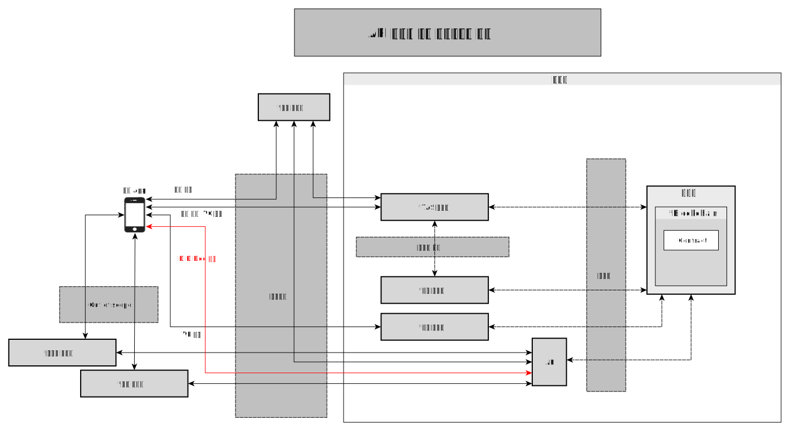
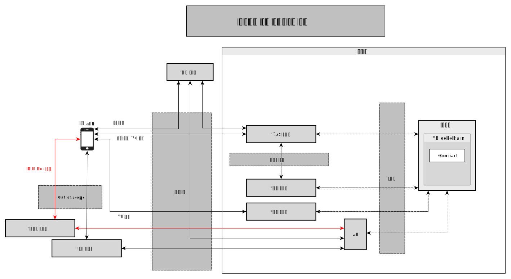

# 블록체인 연동

- 주제 : 블록체인 연동
- 작성 : 오픈소스개발팀
- 일자 : 2024-10-18
- 버전 : v1.0.0

| 버전 | 일자       | 변경         |
| ------- | ---------- | --------------- |
| v1.0.0  | 2024-10-18 | 최초 작성 |

 

## API 서버를 통한 블록체인 연동
- Public 블록체인의 경우 외부망에서 블록체인에 직접 접근할 수 있다.
- OpenDID에선 APP에서 직접 블록체인에 붙는것이 아닌 서버를 통해서 붙는 방식을 사용한다.
- 블록체인 앞단에는 인증서를 발급받은 API 서버가 존재하며 이를 통해 블록체인에 접근할 수 있다.

## 사업자를 통한 블록체인 연동
- 월렛-월렛 서버, 인가앱-인가앱 서버 간에는 신뢰채널이 형성되어 있다고 가정한다.
    - 사업자가 제공하는 서비스들간의 통신은 out of scope로 한다.
- Private 블록체인의 경우 외부에서 직접 접근할 수 없다. 
- 블록체인 앞에서 요청을 받아주는 서버가 필요하다. 이 역할을 각 사업자가 맡아서 진행한다.
    - 월렛은 월렛서버, 인가앱은 인가앱 서버를 통해서 블록체인에 접근한다.
- 보안세션
    - 내부망에 있는 사업자들간에는 보안세션 연결 과정을 생략할 수 있다.
    - 외부망에서 내부망에 접근하기 위해선 보안세션 과정을 진행해야 한다.
    

