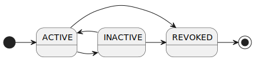

---
puppeteer:
    pdf:
        format: A4
        displayHeaderFooter: true
        landscape: false
        scale: 0.8
        margin:
            top: 1.2cm
            right: 1cm
            bottom: 1cm
            left: 1cm
    image:
        quality: 100
        fullPage: false
---

Verifiable Crendentials format
==

- 주제
    - VC(Verifiable Crendentials) 데이터 형식 정의
    - 엔티티별 가입증명서 VC 데이터 정의
- 작성: 강영호
- 일자: 2024-09-03
- 버전: v1.0.0


개정이력
---

| 버전   | 일자       | 변경 내용                                    |
| ------ | ---------- | -------------------------------------------- |
| v1.0.0 | 2024-09-03 | 초안                                         |


<div style="page-break-after: always;"></div>

목차
---

<!-- TOC tocDepth:2..4 chapterDepth:2..6 -->

- [1. 개요](#1-개요)
    - [1.1. 참조문서](#11-참조문서)
- [2. 공통 규정](#2-공통-규정)
    - [2.1. VC 생애주기](#21-vc-생애주기)
    - [2.2. 클레임 원본의 위치 (location)](#22-클레임-원본의-위치-location)
    - [2.3. VC 구조](#23-vc-구조)
        - [2.3.1. 데이터 타입 및 상수](#231-데이터-타입-및-상수)
        - [2.3.2. `Claim` object](#232-claim-object)
        - [2.3.3. `VcAttach` object](#233-vcattach-object)
        - [2.3.4. `Vc` object](#234-vc-object)
- [3. 가입증명서 VC](#3-가입증명서-vc)
    - [3.1. TAS Certificate VC](#31-tas-certificate-vc)
        - [3.1.1. Crendential Metadata](#311-crendential-metadata)
        - [3.1.2. Claims](#312-claims)
    - [3.2. Provider Certificate VC](#32-provider-certificate-vc)
        - [3.2.1. Crendential Metadata](#321-crendential-metadata)
        - [3.2.2. Claims](#322-claims)

<!-- /TOC -->


<div style="page-break-after: always;"></div>

## 1. 개요

본 문서는 OpenDID에서 사용하는 Verifiable Crendentials(VC)의 데이터 구성을 정의한다.
기본적인 규정은 W3C의 `[VC-MODEL]` (Verifiable Credentials Data Model v2.0)을 준수한다.

아래 사항에 대해서는 본 문서에서 정의한 것을 준수하여야 한다.

- Claim 데이터 구성
- 선택적 제출을 위한 Proof 구조
- 본 문서에 명시한 메타데이터

아래 사항은 _본 문서의 범위 밖_ 이므로 구현체에 따라 자유롭게 정의할 수 있다.

- Evidence 규칙
- 확장 Claim 데이터 형식
- 상수의 추가
- 기타 본 문서의 규정을 기본으로 항목을 추가하는 경우


### 1.1. 참조문서

| 참조명      | 문서명                                               | 위치                                     |
| ----------- | ---------------------------------------------------- | ---------------------------------------- |
| [VC-MODEL]  | Verifiable Credentials Data Model v2.0               | https://www.w3.org/TR/vc-data-model-2.0/ |
| [VC-IMPL]   | Verifiable Credentials Implementation Guidelines 1.0 | https://www.w3.org/TR/vc-imp-guide/      |
| [VC-DATA]   | Verifiable Credential Data Integrity 1.0             | https://w3c.github.io/vc-data-integrity  |
| [OSD]       | OpenDID Schema Definition Language                   |                                          |
| [DATA-SPEC] | (OpenDID) 데이터 명세서(Data Specification)          |                                          |


<div style="page-break-after: always;"></div>

## 2. 공통 규정

### 2.1. VC 생애주기

VC의 생애주기는 VC 저장매체에서 관리된다.
상세한 조회 방법은 본 문서의 범위 밖이므로 생략하고, 여기서는 생애주기의 상태 변화에 대해서만 설명한다.

| 상태값     | 상태명 | 설명                                                                     |
| ---------- | ------ | ------------------------------------------------------------------------ |
| `ACTIVE`   | 정상   | • 사용이 가능한 상태<br>• 중지, 폐기 상태로 전이 가능                    |
| `INACTIVE` | 중지   | • 분실신고 등으로 사용이 일시 중단된 상태이며<br>• 정상 상태로 전이 가능 |
| `REVOKED`  | 폐기   | • 더이상 사용하지 않아 폐기한 상태<br>• 다른 상태로 전이 불가능          |




### 2.2. 클레임 원본의 위치 (location)

클레임 값의 원본 위치는 아래와 같이 다양하게 표현할 수 있다.

| `location` | 원본의 위치      | `value`                         |
| ---------- | ---------------- | ------------------------------- |
| `inline`   | VC 내부          | 원본                            |
| `remote`   | VC 외부 원격     | 원본의 경로                     |
| `attach`   | VC 외부 첨부파일 | 첨부에서 원본을 가리키는 식별자 |

예를 들어, 증명사진 이미지는 상기 3가지로 각각 발급이 가능하다.

- `inline`: `value`에 multibase로 변환된 이미지 저장
- `remote`: 온라인 서버에 저장하고 해당 URL을 `value`에 저장
- `attach`: VC와 함께 배포하는 첨부파일에 저장하고 `value`에는 첨부파일 내 식별자를 저장

단, 상기 3가지 경우 모두 진본성 확인을 위해 증명사진의 해시는 `digestSRI`에 저장하여야 한다.

### 2.3. VC 구조

여기에 정의되지 않은 항목은 `[DATA-SPEC]`을 참조한다.

#### 2.3.1. 데이터 타입 및 상수

```c#
def string vcId      : "VC id in UUID"
def string claimCode : "Claim code"
def string vcAttachId: "VC attachment id"
def string vcDigest  : "W3C subresource integrity"

def enum ENCODING: "character encoding"
{
    "UTF-8", // ... 
}

def enum LANGUAGE: "언어 코드"
{
    "ko", "en", "fr", "jp", // ...
}

def enum VC_TYPE: "VC 타입"
{
    "VerifiableCredential": "VC",
    "CertificateVC"       : "TAS가 발급하는 가입증명서 VC",
}

def enum CLAIM_TYPE: "클레임 타입"
{
    "text", "image", "document",
}

def enum CLAIM_FORMAT: "클레임 포맷"
{
    // text
    "plain", "html", "xml", "csv",
    
    // image
    "png", "jpg", "gif",
    
    // document
    "txt", "pdf", "word",
}

def enum LOCATION: "클레임 원본 데이터 위치"
{
    "inline": "VC 내 'value'에 값 포함",
    "remote": "외부 링크 URL",
    "attach": "별도의 첨부파일",
}

def enum PROOF_TYPE: "proof type"
{
    "RsaSignature2018",
    "Secp256k1Signature2018",
    "Secp256r1Signature2018",
}

def enum PROOF_PURPOSE: "proof purpose"
{
    "assertionMethod",
    "authentication",
    "keyAgreement",
    "capabilityInvocation",
    "capabilityDelegation",
}

def enum PRESENCE: "evidence presence"
{
    "Physical": "인쇄본 서류와 같은 물리적 증거",
    "Digital" : "전자적으로 읽기 및 검증이 가능한 디지털 증거 ",
}

def enum EVIDENCE_TYPE: "evidence type"
{
    "DocumentVerification": "서류 검증",
}

def enum CREDENTIAL_SCHEMA_TYPE: "credential schema type"
{
    "OsdSchemaCredential": "OSD VC Schema",
}

def enum ROLE_TYPE: "role type"
{
    "Tas"                 : "TAS",
    "Wallet"              : "월렛",
    "Issuer"              : "발급 사업자",
    "Verifier"            : "검증 사업자",
    "WalletProvider"      : "월렛 사업자",
    "AppProvider"         : "인가앱 사업자",
    "ListProvider"        : "목록 사업자",
    "OpProvider"          : "OP 사업자",
    "KycProvider"         : "KYC 사업자",
    "NotificationProvider": "알림 사업자",
    "LogProvider"         : "로그 사업자",
    "PortalProvider"      : "포털 사업자",
    "DelegationProvider"  : "위임 사업자",
    "StorageProvider"     : "저장소 사업자",
    "BackupProvider"      : "백업 사업자",
    "Etc"                 : "기타 사업자",
}
```

#### 2.3.2. `Claim` object

`Claim` object는 `code`, `caption`, `value` 및 속성들로 구성된다.

```c#
def object Claim: "VC claim object"
{
    + claimCode    "code"     : "클레임 코드"
    + string       "caption"  : "클레임 이름"
    + string       "value"    : "클레임 값"
    + CLAIM_TYPE   "type"     : "클레임 타입"
    + CLAIM_FORMAT "format"   : "클레임 포맷"
    - bool         "hideValue": "클레임 값 숨김 여부", default(false)
    - LOCATION     "location" : "클레임 원본 위치", default("inline")
    - vcDigest     "digestSRI": "클레임 값의 해시", default(null)
    - object       "i18n"     : "다국어 정보"
    {
        + object $lang: "언어별 정보", variable_type(LANGUAGE), min_extend(1)
        {
            + string   "caption"  : "클레임 이름"
            - string   "value"    : "클레임 값"
            - vcDigest "digestSRI": "클레임 값의 해시"
        }
    }
}
```

- `value`: location에 따라 아래와 같이 값의 종류가 다름
    - "inline": (`string`) 원본 값
    - "remote": (`url`) 원본 URL
    - "attach": (`vcAttachId`) 첨부 식별자
- `digestSRI`
    - location이 "inline" 아니면 필수
- `i18n`: `caption`이나 `value`가 언어마다 다를 경우 언어별 추가


#### 2.3.3. `VcAttach` object

location이 "attach"인 클레임의 값은 VC와 별도의 파일인 `VcAttach` 객체에 저장하여 VC와 함께 전달한다.

```c#
def object VcAttach: "VC 첨부파일"
{
    + object $attachId: "첨부 데이터", variable_type(vcAttachId), min_extend(1)
    {
        + multibase "value": "multibase로 변환한 데이터"
    }
    
    + AssertProof "proof": "첨부파일에 대한 이슈어 서명"
}
```

#### 2.3.4. `Vc` object

`Vc` 객체는 이슈어가 Holder에게 발급하는 Verifiable Credential로서 아래와 같은 구조를 가진다.

- Credential Metadata
- Claim(s)
- Proof(s)

```c#
// Verifiable Credentials
def object Vc: "VC object"
{
    //---------------------------------------------------------------------------
    // Credential Metadata
    //---------------------------------------------------------------------------
    + array(url)     "@context": "JSON-LD context", value(["https://www.w3.org/ns/credentials/v2"])
    + vcId           "id"      : "VC id"
    + array(VC_TYPE) "type"    : "VC 타입 목록"
    + object         "issuer"  : "이슈어 정보"
    {
        + did    "id"  : "이슈어 did"
        - string "name": "이슈어 이름", emptiable(false)
    }
    + utcDatetime   "issuanceDate" : "발급일시"
    + utcDatetime   "validFrom"    : "유효기간 시작 일시"
    + utcDatetime   "validUntil"   : "유효기간 종료 일시"
    + ENCODING      "encoding"     : "VC 파일 인코딩", default("UTF-8")
    + string        "formatVersion": "VC 형식 버전", default("1.0")
    + LANGUAGE      "language"     : "VC 파일 언어 코드"
    + array(object) "evidence"     : "evidence"
    {
        - url           "id"      : "해당 evidence에 대한 (추가)정보 조회를 위한 URL"
        + EVIDENCE_TYPE "type"    : "evidence 타입"
        + did           "verifier": "evidence 검증자"

        // Evidence 타입별 데이터
        + select(1)
        {
            ^ group // when type == "DocumentVerification"
            {
                + string   "evidenceDocument": "증거서류 명칭"
                + PRESENCE "subjectPresence" : "주체의 출현 방식"
                + PRESENCE "documentPresence": "서류의 출현 방식"
                - object   "attribute"       : "서류 부가정보. 예: 면허번호", emptiable(false)
                {
                    - string $key: "string 타입 key-value pair", $min_extend(1)
                }
            }
        }
    }
    + object "credentialSchema": "credential schema"
    {
        + url                    "id"  : "VC Schema URL"
        + CREDENTIAL_SCHEMA_TYPE "type": "VC Schema format type"
    }

    //---------------------------------------------------------------------------
    // Claim(s)
    //---------------------------------------------------------------------------
    + object "credentialSubject": "credential subject"
    {
        + did          "id"    : "subject did"
        + array(Claim) "claims": "클레임 목록", min_count(1)
    }

    //---------------------------------------------------------------------------
    // Proof(s)
    //---------------------------------------------------------------------------
    + object "proof": "VC에 대한 이슈어 서명"
    {
        @spread(AssertProof)
        + array(multibase) "proofValueList": "개별 클레임에 대한 서명"
    }
}
```

**■ 기존과 달라진 점**

- `Vc:~/proof`는 배열이 아닌 단일 객체
- `Vc:~/evidence[]/type`은 배열이 아닌 string

##### 2.3.4.1. Crendential Metadata

- `~/id`: VC id는 UUID 타입을 권장하나 구현에 따라 다양한 형식을 사용할 수 있다.
- `~/type`: VC 타입은 구현에 따른다.
- `~/issuanceDate`, `~/validFrom`, `~/validUntil`: datetime은 모두 UTC offset 0 표현을 사용한다.
- `~/formatVersion`: 본 문서의 주제인 VC format에 대한 버전으로, 구현에 따른다.
- `~/language`: VC의 주언어를 나타낸다. 주언어 외의 언어는 `Claim:~/i18n`에 언어별 객체를 추가한다. 아래 예시 참조.
    ```json
    {
        "language": "ko",

        "credentialSubject": {
            "id": "did:omn:12345678abcdefg",
            "claims": [
                {
                    "code": "name",
                    "caption": "성명",
                    "value": "홍길동",
                    "type": "text",
                    "format": "plain",
                    "i18n": {
                        "en": {
                            "caption": "Name",
                            "value": "Hong Gildong"
                        }
                    }
                }
            ]
        }
    }
    ```
- `~/evidence[]`
    - 현재는 "DocumentVerification" 타입만 정의하였다.
    - `~/evidence[]/$attribute`는 `evidenceDocument`의 값에 따라 다양한 형태 및 개수를 추가할 수 있다.
        - 예: `evidenceDocument`가 운전면허증인 경우 면허번호, 발급일자 등의 추가 속성을 저장할 수 있다.

##### 2.3.4.2. Claims

멀티 subject를 지원하는 경우 `~/credentialSubject`의 구조는 다음과 같이 배열로 변경된다.

```c#
+ array(object) "credentialSubject": "lsit of credential subject"
{
    + did          "id"    : "subject did"
    + array(Claim) "claims": "클레임 목록", min_count(1)
}
```

##### 2.3.4.3. Proofs

VC에 대한 이슈어 서명은 `~/proof` 객체에 저장하며, 다음의 두 가지 방식으로 서명값을 생성한다.

1. 전체서명: 전체 클레임을 포함한 서명
2. 개별서명: `~/credentialSubject/claims[]` 배열에서 1개씩만 포함한 서명

| 서명 구분 | 서명 값                     | 서명 대상 클레임                |
| :-------: | --------------------------- | ------------------------------- |
| 전체서명  | `~/proof/proofValue`        | 전체 클레임                     |
| 개별서명  | `~/proof/proofValueList[0]` | `~/credentialSubject/claims[0]` |
|           | `~/proof/proofValueList[1]` | `~/credentialSubject/claims[1]` |
|           | ...                         | ...                             |
|           | `~/proof/proofValueList[n]` | `~/credentialSubject/claims[n]` |


<div style="page-break-after: always;"></div>

## 3. 가입증명서 VC

"가입증명서 VC"는 DID Document 생성 직후 TAS가 엔티티에게 발급하는 VC 형태의 가입증명서이다.
아래와 같은 종류가 있다.

- TAS Certificate VC
- Provider Certificate VC

### 3.1. TAS Certificate VC

#### 3.1.1. Crendential Metadata

- `~/type`: ["VerifiableCredential", "CertificateVC"]
- `~/issuer`
    - `id`: TAS did
    - `name`: "TAS"
- `~/evidence`
    - `[0]`
        - `type`: "DocumentVerification"
        - `verifier`: TAS did
        - `evidenceDocument`: "BusinessLicense"
        - `subjectPresence`: "Physical"
        - `documentPresence`: "Physical"
        - `licenceNumber`: 해당 문서의 라이선스 번호

#### 3.1.2. Claims

- `~/credentialSubject`
    - `id`: TAS did
    - `claims`: 아래 표 참조

| code                     | caption      | type   | format  | attribute | value(example)       |
| ------------------------ | ------------ | ------ | ------- | --------- | -------------------- |
| `org.opendid.v1.subject` | "Subject DN" | "text" | "plain" |           | "o=YourCompany,c=KR" |
| `org.opendid.v1.role`    | "Role"       | "text" | "plain" |           | "Tas"                |


### 3.2. Provider Certificate VC

#### 3.2.1. Crendential Metadata

- `~/type`: ["VerifiableCredential", "CertificateVC"]
- `~/issuer`
    - `id`: TAS did
    - `name`: "TAS"
- `~/evidence`
    - `[0]`
        - `type`: "DocumentVerification"
        - `verifier`: TAS did
        - `evidenceDocument`: "BusinessLicense"
        - `subjectPresence`: "Physical"
        - `documentPresence`: "Physical"
        - `licenceNumber`: 해당 문서의 라이선스 번호

#### 3.2.2. Claims

- `~/credentialSubject`
    - `id`: Provider did
    - `claims`: 아래 표 참조

| code                     | caption      | type   | format  | attribute | value(example)       |
| ------------------------ | ------------ | ------ | ------- | --------- | -------------------- |
| `org.opendid.v1.subject` | "Subject DN" | "text" | "plain" |           | "o=YourCompany,c=KR" |
| `org.opendid.v1.role`    | "Role"       | "text" | "plain" |           | "WalletProvider"     |

