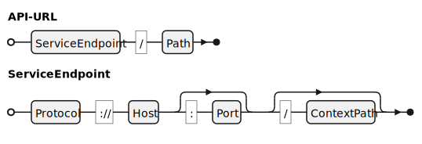

OpenDID API 문서 작성 가이드
==

- 주제: API 문서 작성 가이드
- 작성: 오픈소스개발팀 강영호
- 일자: 2024-09-03
- 버전: v1.0.0

목차
---

<!-- TOC tocDepth:2..4 chapterDepth:2..6 -->

- [1. 개요](#1-개요)
    - [1.1. 표기법](#11-표기법)
        - [1.1.1. Presence Symbol](#111-presence-symbol)
        - [1.1.2. JSON 데이터 스키마](#112-json-데이터-스키마)
    - [1.2. Service endpoint 및 API URL](#12-service-endpoint-및-api-url)
    - [1.3. Message Format](#13-message-format)
        - [1.3.1. Request message](#131-request-message)
        - [1.3.2. Successful response message](#132-successful-response-message)
        - [1.3.3. Error response message](#133-error-response-message)
    - [1.4. Message Mode](#14-message-mode)
    - [1.5. Unit API vs Compound API](#15-unit-api-vs-compound-api)
    - [1.6. 데이터 표준](#16-데이터-표준)
- [2. API reference Sample](#2-api-reference-sample)
    - [2.1. 발급 가능 VC 조회](#21-발급-가능-vc-조회)
        - [2.1.1. Request](#211-request)
        - [2.1.2. Response](#212-response)
        - [2.1.3. Example](#213-example)
    - [2.2. DID Doc 갱신 개시](#22-did-doc-갱신-개시)
        - [2.2.1. Request](#221-request)
        - [2.2.2. Response](#222-response)
        - [2.2.3. Example](#223-example)

<!-- /TOC -->


<div style="page-break-after: always;"></div>

## 1. 개요

본 문서는 OpenDID 프로젝트에서 작성할 API Reference 문서의 형식과 내용에 대하여 정의한다.
인터넷에서 검색한 개발자 대상의 한 설문에 의하면, 개발자가 API 문서에서 보기를 원하는 항목과 비율(복수선택)은 다음과 같다.

| 항목                  | 비율                                                     |
| --------------------- | -------------------------------------------------------- |
| Examples              | <progress id="file" value="70" max="100"></progress> 70% |
| Status and errors     | <progress id="file" value="51" max="100"></progress> 51% |
| Authentication        | <progress id="file" value="50" max="100"></progress> 50% |
| Error messages        | <progress id="file" value="49" max="100"></progress> 49% |
| HTTP requests         | <progress id="file" value="44" max="100"></progress> 44% |
| Parameters            | <progress id="file" value="40" max="100"></progress> 40% |
| Getting started guide | <progress id="file" value="38" max="100"></progress> 38% |
| Methods               | <progress id="file" value="37" max="100"></progress> 37% |
| Code samples          | <progress id="file" value="35" max="100"></progress> 35% |
| Tutorials             | <progress id="file" value="35" max="100"></progress> 35% |
| Resources             | <progress id="file" value="22" max="100"></progress> 22% |
| Sandbox environment   | <progress id="file" value="22" max="100"></progress> 22% |

가장 높은 비율을 차지한 것이 예제와 에러에 대한 정보이다.
이러한 점을 감안하여, API 문서를 작성할 때 개발자가 문서로부터 충분한 정보를
얻을 수 있도록 작성하여야 한다.

### 1.1. 표기법

#### 1.1.1. Presence Symbol

API 정의의 Header나 Parameter의 각 항목 앞에 `+`, `-`로 표시한 것은 필수/선택 여부를 나타낸다.

- `+`: 필수 항목
- `-`: 선택 항목

#### 1.1.2. JSON 데이터 스키마

모든 JSON 데이터의 구조와 형식은 OpenDID Schema Definition Language (이하 OSD)로 정의한다.


### 1.2. Service endpoint 및 API URL

본 문서에서 service endpoint는 "Protocol + Domain + ContextPath"를 의미하며,
API의 URL은 다음과 같이 구성된다.



- ServiceEndpoint: 실제 호출할 대상 서버에 따라 정의
- Path: 각 API 마다 정의
- Protocol: http, https 등
- Host: 도메인 또는 IP 주소
- Port: 포트 번호
- ContextPath: Web application 경로

■ Example

- ServiceEndpoint: `https://opendid.org:9090/tas`
- Path: `api/v1/vcs/list`
- API-URL: `https://opendid.org:9090/tas/api/v1/vcs/list`


### 1.3. Message Format

메시지는 HTTP 전송 시 Body에 해당하는 JSON 데이터를 의미하며, 메시지 포맷의 종류는 아래와 같다.

| Message Format              | Description                                     | Alias  |
| --------------------------- | ----------------------------------------------- | ------ |
| Request message             | 클라이언트가 서버에게 보내는 요청 메시지        | 요청문 |
| Successful response message | HTTP Status가 200인 서버의 응답 메시지          | 응답문 |
| Error response message      | HTTP Status가 400 또는 500인 서버의 응답 메시지 | 오류문 |

#### 1.3.1. Request message

```c#
def object ReqXxx: "XXX request"
{
    // Member definitions
}
```

- 요청 메시지의 명명 규칙: `Req`로 시작하는 CamelCase
- 요청 메시지의 내용은 각 API에서 정의한다.


#### 1.3.2. Successful response message

클라이언트의 요청을 정상적으로 처리하였을 때는 HTTP Status 200과 함께 아래 정상응답 메시지를 응답한다.

```c#
def object ResXxx: "XXX response"
{
    // Member definitions
}
```

- 정상응답 메시지의 명명 규칙: `Res`로 시작하는 CamelCase
- 정상응답 메시지의 내용은 각 API에서 정의한다.


#### 1.3.3. Error response message

클라이언트의 요청을 처리하는 중 에러 발생 시 에러의 종류에 따라 다음과 같은 HTTP Status와 함께
아래에 정의한 오류응답 메시지를 응답한다.

- HTTP Status `400`: 클라이언트 측 사유로 에러 발생
    - 예: 파라미터 누락, 허가받지 않은 요청
- HTTP Status `500`: 서버 측 사유로 에러 발생
    - 예: 저장 실패, 시스템 오류

```c#
def string errorCode: "에러 코드"

def object ResError: "Error response"
{
    + errorCode "code"   : "에러 코드"
    + string    "desc"   : "상세 오류내역 등 개발자용 메시지", emptiable(true)
    - string    "message": "사용자용 에러 메시지", default("")
}
```

- `code`: errorCode는 별도 문서의 정의를 따른다.
- `desc`: 디버깅이나 로깅의 목적으로 사용할 상세 오류 메시지. Call stack을 포함할 수도 있다.
- `message`: 구체적인 오류 내용이 아닌 사용자에게 보여줄 메시지

### 1.4. Message Mode

1. plain
1. mac: approved by MAC
1. enc: encrypted

<span style="color: red">
인증 및 세션관련 정의 완료 후 작성할 예정
</span>

### 1.5. Unit API vs Compound API

OpenDID에서 API의 분류는 다음의 두 가지가 있다.

- Unit API (단위 API)
    - 일반적인 REST API의 형태로, 순서에 무관하게 클라이언트가 원하는 기능을 호출
    - 각 단위 API가 독립적 기능을 수행하며, RESTful 하게 구성
    - 예: DID Document 조회, VC Meta 조회
- Compound API (복합 API)
    - 특정 기능(프로토콜)을 수행하기 위해 정해진 순서대로 호출하는 일련의 API
    - 단위 API에 대한 정의에 앞서 해당 프로토콜에 대한 정의와 호출순서 먼저 정의 필요
    - 예: DID Document 등록, VC 발급, VP 제출

### 1.6. 데이터 표준

데이터 타입은 메시지 정의부의 선언하지 않고 다음의 두 부분에 선언하여 쉽게 찾을 수 있도록 한다.

- 데이터 정의서
    - 모든 API가 공통으로 사용하는 데이터 타입
- API 문서의 데이터 타입 선언부
    - 데이터의 정의서에 선언되지 않고 해당 API에서 개별적으로 사용하는 데이터 타입
    - 별도의 챕터를 두어 데이터 타입을 모아서 정의

여러 API에서 공통으로 사용되는 데이터 구조(예: JSON 객체)도 상기 데이터 타입과 마찬가지로
공통으로 사용하는 것은 데이터 정의서에, 개별적으로 사용하는 것은 API 문서의 별도 챕터에 모아서
정의하여야 한다.

이렇게 하는 이유는 다음과 같다.

1. 여러 API에서 공통된 데이터 형식을 공유함으로써 중복을 방지하고 연동의 편의성 제공
1. 타 시스템에 영향을 미칠 수 있는 변경을 손쉽게 파악하고 전파
1. 권한을 가진 담당자에 의해 공통 부분을 관리하도록 위임 가능

<div style="page-break-after: always;"></div>

## 2. API reference Sample

### 2.1. 발급 가능 VC 조회

목록관리 서비스를 통해 발급가능한 VC 정보 조회 (TAS URL, VC 정보)

| Item          | Description                               | Remarks |
| ------------- | ----------------------------------------- | ------- |
| Method        | `GET`                                     |         |
| Path          | `/api/v1/vcs/{issuer-did}/list`           |         |
| Authorization | Access Token                              |         |
| Message Mode  | • Request: `plain`<br>• Response: `plain` |         |

---

#### 2.1.1. Request

**■ Headers**

| Header              | Value                            | Remarks |
| ------------------- | -------------------------------- | ------- |
| + `Content-Type`    | `application/json;charset=utf-8` |         |
| + `Authorization`   | `Bearer {JWT}`                   |         |
| - `Accept-Language` | `{language}`                     |         |

- Authorization: 인가앱사업자 또는 월렛사업자가 발급한 JWT 형식의 조회용 토큰
- Accept-Language: 오류 메시지는 여기 지정된 언어로 응답한다.

**■ Path Parameters**

| Parameter    | Type   | Description         | Remarks |
| ------------ | ------ | ------------------- | ------- |
| + `issuer-did` | string | 조회할 이슈어의 DID |         |

**■ Query Parameters**

| Parameter     | Type    | Description           | Remarks |
| ------------- | ------- | --------------------- | ------- |
| + `vc-type`   | string  | 조회할 VC의 종류^(1)^ |         |
| - `max-count` | integer | 응답의 최대 레코드 수 |         |

- (1): VC 종류
    - `신분증`
    - `증명서`

**■ Body**

N/A

---

#### 2.1.2. Response

**■ Status 200 - Success**

```c#
def object ResVcList: "VC list response"
{
    + uuid          "txId"      : "transaction id"
    + int           "indexFrom" : "start index of the full list"
    + array(object) "vcInfoList": "list of VC information" {...}
}
```

**■ Status 400 - Client error**

|    Code     | Description             |
| :---------: | ----------------------- |
| SRVTAS00001 | Unauthorized            |
| SRVTAS00002 | 'issuer-did' not exist  |
| SRVTAS00003 | 'vc-type' not available |

**■ Status 500 - Server error**

|    Code     | Description                     |
| :---------: | ------------------------------- |
| SRVTAS10001 | TAS signature generation failed |
|      -      | Some error not listed yet       |

---

#### 2.1.3. Example

**■ Request**

```shell
curl -v -X GET "http://${Host}:${Port}/tas/api/v1/vcs/${ISSUER_DID}/list" \
--data-urlencode "vc-type=신분증" \
--data-urlencode "max-count=10" \
-H "Content-Type: application/json;charset=utf-8" \
-H "Authorization: Bearer ${CA_JWT}"
```

**■ Response**

```http
HTTP/1.1 200 OK
Content-Type: application/json;charset=utf-8
{
    "txId": "9a30541b-c8c6-4c24-9f62-2b11e027cb53",
    "indexFrom": 0,
    "vcInfoList": [
        {...},
        {...}
    ]
}
```

### 2.2. DID Doc 갱신 개시

DID Doc 갱신 개시를 요청한다.

| Item          | Description                               | Remarks |
| ------------- | ----------------------------------------- | ------- |
| Method        | `POST`                                    |         |
| Path          | `/api/v1/common/trx`                      |         |
| Authorization | None                              |         |
| Message Mode  | • Request: `plain`<br>• Response: `plain` |         |


---

#### 2.2.1. Request

**■ Headers**

| Header              | Value                            | Remarks |
| ------------------- | -------------------------------- | ------- |
| + `Content-Type`    | `application/json;charset=utf-8` |         |
| - `Accept-Language` | `{language}`                     |         |

**■ Path Parameters**

N/A

**■ Query Parameters**

N/A

**■ Body**

```c#
def enum TRX_TYPE: "거래 타입"
{
    "register-did": "DID 등록",
    "renewal-did" : "DID 갱신",
}


def object ReqCommonTrx: "DID Doc 갱신 개시 요청문"
{
    + TRX_TYPE "type"        : "거래 타입", value("renewal-did")
    + multibase "clientNonce": "client nonce for signature", byte_length(16)
}
```

- `type`: "renewal-did" 고정
- `clientNonce`: 서명 생성을 위한 클라이언트 측 난수 16 바이트

---

#### 2.2.2. Response

**■ Status 200 - Success**

```c#
def object ResCommonTrx: "Common transaction response"
{
    + uuid      "txId"       : "transaction id"
    + multibase "serverNonce": "server nonce for signature", byte_length(16)
}
```

**■ Status 400 - Client error**

|    Code     | Description                    |
| :---------: | ------------------------------ |
| SRVTAS00004 | item not found - 'clientNonce' |

**■ Status 500 - Server error**

|    Code     | Description                     |
| :---------: | ------------------------------- |
| SRVTAS10001 | TAS signature generation failed |
|      -      | Some error not listed yet       |

---

#### 2.2.3. Example

**■ Request**

```shell
curl -v -X POST "http://${Host}:${Port}/tas/api/v1/common/trx" \
-H "Content-Type: application/json;charset=utf-8" \
-d @"data.json"
```

```json
//data.json
{
    "type": "renewal-did",
    "clientNonce": "uVGhlIHF1aWNrIkgZG9ncy4"
}
```

**■ Response**

```http
HTTP/1.1 200 OK
Content-Type: application/json;charset=utf-8
{
    "txId": "9a30541b-c8c6-4c24-9f62-2b11e027cb53",
    "serverNonce": "uaHR0cHM6LycGVkaWEub3Jn"
}
```
