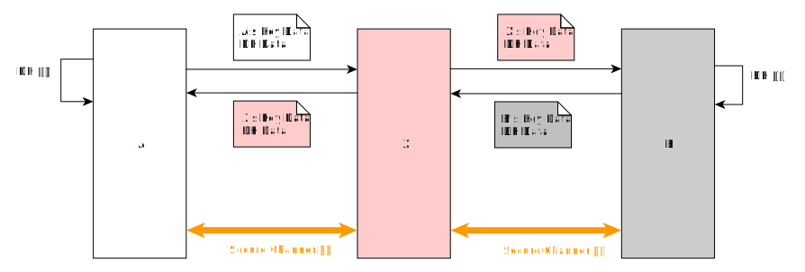
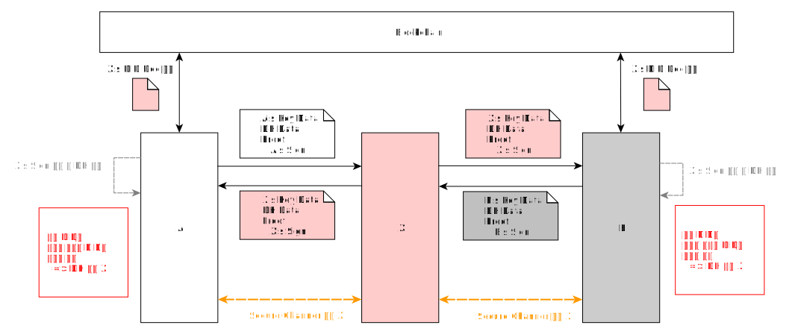

# 중간자 공격(manipulator-in-the-middle attack, MitM)

- 주제 : 중간자 공격
- 작성 : 오픈소스개발팀
- 일자 : 2024-10-18
- 버전 : v1.0.0

| 버전 | 일자       | 변경         |
| ------- | ---------- | --------------- |
| v1.0.0  | 2024-10-18 | 최초 작성 |

 

## ECDH 수행 시 중간자 공격

위 그림은 ECDH 수행 시 중간자 공격에 대한 그림이다.
- 엔티티 A
- 엔티티 B
- 공격자 X

엔티티 A와 엔티티 B가 ECDH를 통해 키 교환을 하고자 할 때 공격자 X 가 중간에서 서로의 상대방인 척 키 교환을 수행할 수 있다. 
엔티티 A에게 공격자 X는 B인 척 키를 전달하고, 
엔티티 B에게 공격자 X는 A인 척 키를 전달한다. 

A와 B는 둘 간의 보안채널이 형성되었다고 생각하고 ECDH를 통한 키로 암호화하여 데이터를 전달한다. 
데이터를 암호화해서 안전하게 전달한다고 생각하지만  
실제로는 A는 X와 B도 X와 통신하게 되기 때문에 X가 중간에서 그 내용을 다 알게 된다.

## 상호인증을 통한 중간자 공격 방어

위 그림은 ECDH 수행 시 상호인증을 통해 중간자 공격을 방어하는 그림이다.
- 엔티티 A
- 엔티티 B
- 공격자 X

A와 B는 각각 키 교환 시 DID가 포함된 자신의 서명을 전달한다. 
만약 공격자 X도 중간에서 A와 B의 상대인 척 키교환을 하려면 자신의 서명을 포함하여 전달할 수 밖에 없다. 
A와 B는 ECDH 수행 시 어떤 DID를 통한 키 교환 요청인지를 확인할 수 있다. 

### A와 B가 상대방의 DID를 모르는 경우
- 공격자 X와 키 교환이 맺어져 공격을 당할 수 있으나 공격자 X를 찾을 수 있다.
- 공격자 X는 자신이 누구인지 모르게 공격을 하는 것이 불가능하다.
- A와 B 중 둘 중 하나라도 상대방의 DID를 아는 경우 X의 ECDH 요청을 거절할 수 있다.
    - RSA암호화의 경우, 상대방의 DID를 안다는 전제가 붙기 때문에 동일한 수준의 보안 적용이 가능하다.

### 좀 더 명시적으로 방어하는 방안
- DID Doc에 해당 엔티티의 롤이 명시된 경우
    - 롤에 맞는 DID 요청인지는 확인 가능하다.  ex) Issuer 인지 TAS 인지 명시된 경우
- 목록사업자에서 DID를 같이 전달해 주는 경우
    - 목록사업자로부터 연결을 요청할 엔티티의 정보를 받을 때 DID를 포함한다.
