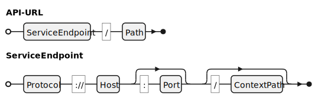

OpenDID API Documentation Writing Guide
==

- Subject: API Documentation Writing Guide
- Author: Open Source Development Team, Kang Youngho
- Date: 2024-09-03
- Version: v1.0.0

Table of Contents
---

<!-- TOC tocDepth:2..4 chapterDepth:2..6 -->

- [1. Overview](#1-overview)
    - [1.1. Notation](#11-notation)
        - [1.1.1. Presence Symbol](#111-presence-symbol)
        - [1.1.2. JSON Data Schema](#112-json-data-schema)
    - [1.2. Service endpoint and API URL](#12-service-endpoint-and-api-url)
    - [1.3. Message Format](#13-message-format)
        - [1.3.1. Request message](#131-request-message)
        - [1.3.2. Successful response message](#132-successful-response-message)
        - [1.3.3. Error response message](#133-error-response-message)
    - [1.4. Message Mode](#14-message-mode)
    - [1.5. Unit API vs Compound API](#15-unit-api-vs-compound-api)
    - [1.6. Data Standards](#16-data-standards)
- [2. API reference Sample](#2-api-reference-sample)
    - [2.1. Retrieving Issuable VCs](#21-retrieving-issuable-vc)
        - [2.1.1. Request](#211-request)
        - [2.1.2. Response](#212-response)
        - [2.1.3. Example](#213-example)
    - [2.2. Initiate DID Doc Update](#22-initiate-did-doc-update)
        - [2.2.1. Request](#221-request)
        - [2.2.2. Response](#222-response)
        - [2.2.3. Example](#223-example)

<!-- /TOC -->


<div style="page-break-after: always;"></div>

## 1. Overview

This document defines the format and content of the API Reference documentation for the OpenDID project.
According to a survey targeted to developers, the items and proportions they want to see in API documentation are as follows.

| Item                  | Proportion                                              |
| --------------------- | --------------------------------------------------------|
| Examples              | <progress id="file" value="70" max="100"></progress> 70% |
| Status and errors     | <progress id="file" value="51" max="100"></progress> 51% |
| Authentication        | <progress id="file" value="50" max="100"></progress> 50% |
| Error messages        | <progress id="file" value="49" max="100"></progress> 49% |
| HTTP requests         | <progress id="file" value="44" max="100"></progress> 44% |
| Parameters            | <progress id="file" value="40" max="100"></progress> 40% |
| Getting started guide | <progress id="file" value="38" max="100"></progress> 38% |
| Methods               | <progress id="file" value="37" max="100"></progress> 37% |
| Code samples          | <progress id="file" value="35" max="100"></progress> 35% |
| Tutorials             | <progress id="file" value="35" max="100"></progress> 35% |
| Resources             | <progress id="file" value="22" max="100"></progress> 22% |
| Sandbox environment   | <progress id="file" value="22" max="100"></progress> 22% |

The highest proportion is examples and information about errors.
Considering this, API documentation should be written in a way that provides developers with sufficient information.

### 1.1. Notation

#### 1.1.1. Presence Symbol

Symbols `+` and `-` before each item in the API definition header or parameter denotes whether the item is required or optional.

- `+`: Required item
- `-`: Optional item

#### 1.1.2. JSON Data Schema

The structure and format of all JSON data are defined using the OpenDID Schema Definition Language (OSD).

### 1.2. Service endpoint and API URL

In this document, the service endpoint means "Protocol + Domain + ContextPath", and the API URL is structured as follows.



- ServiceEndpoint: Defined according to the target server to be called
- Path: Defined for each API
- Protocol: http, https, etc.
- Host: Domain or IP address
- Port: Port number
- ContextPath: Web application path

■ Example

- ServiceEndpoint: `https://opendid.org:9090/tas`
- Path: `api/v1/vcs/list`
- API-URL: `https://opendid.org:9090/tas/api/v1/vcs/list`

### 1.3. Message Format

A message refers to JSON data in the HTTP body during transmission, and the types of message formats are as follows.

| Message Format              | Description                                        | Alias  |
| --------------------------- | -------------------------------------------------- | ------ |
| Request message             | A request message sent from the client to the server | Request |
| Successful response message | A response message from the server with HTTP Status 200 | Response |
| Error response message      | A response message from the server with HTTP Status 400 or 500 | Error |

#### 1.3.1. Request message

```c#
def object ReqXxx: "XXX request"
{
    // Member definitions
}
```
- Naming convention for request messages: CamelCase starting with `Req`
- The content of the request messages is defined for each API.

#### 1.3.2. Successful response message

When the client's request is successfully processed, the following successful response message is returned with HTTP Status 200.

```c#
def object ResXxx: "XXX response"
{
    // Member definitions
}
```
- Naming convention for successful response messages: CamelCase starting with `Res`
- The content of the successful response messages is defined for each API.

#### 1.3.3. Error response message

When an error occurs while processing the client's request, an error response message defined below is returned along with the appropriate HTTP Status depending on the type of error.

- HTTP Status `400`: Error due to client-side issues
    - Example: Missing parameters, unauthorized requests
- HTTP Status `500`: Error due to server-side issues
    - Example: Failure to save, system error

```c#
def string errorCode: "Error code"

def object ResError: "Error response"
{
    + errorCode "code"   : "Error code"
    + string    "desc"   : "Detailed error information for developers", emptiable(true)
    - string    "message": "User-facing error message", default("")
}
```
- `code`: The error code follows the definitions in a separate document.
- `desc`: Detailed error message for debugging or logging purposes. It may include the call stack.
- `message`: User-facing message that does not reveal specific error details.

### 1.4. Message Mode

1. plain
2. mac: approved by MAC
3. enc: encrypted

<span style="color: red">
To be completed after defining authentication and session-related aspects.
</span>

### 1.5. Unit API vs Compound API

In OpenDID, APIs are classified into the following two categories:

- Unit API
    - A typical REST API format, where the client can call the desired function regardless of sequence.
    - Each Unit API performs an independent function and is RESTful.
    - Example: Retrieving DID Document, Retrieving VC Meta
- Compound API
    - A series of APIs called in a predefined order to perform a specific function (protocol).
    - The protocol and call sequence must be defined first before defining Unit APIs.
    - Example: Registering DID Document, Issuing VC, Presenting VP

### 1.6. Data Standards

Data types should not be declared in the message definition section but in the following two sections to make them easily discoverable.

- Data Definition Document
    - Data types commonly used across all APIs
- Data Type Declaration Section in API Documentation
    - Data types not declared in the Data Definition Document and used individually by the API
    - A separate chapter should be dedicated to defining these data types

Common data structures used across multiple APIs (e.g., JSON objects) should also follow the same principle: common structures should be defined in the Data Definition Document, while individual structures should be defined in a separate chapter in the API documentation.

The reasons for this approach are as follows:

1. Sharing common data formats across multiple APIs prevents redundancy and facilitates integration.
2. It allows easy identification and propagation of changes that could affect other systems.
3. It enables delegation of management of common parts to authorized personnel.

<div style="page-break-after: always;"></div>

## 2. API Reference Sample

### 2.1. Retrieving Issuable VCs

Retrieve information on issuable VCs through the list management service (TAS URL, VC information).

| Item          | Description                               | Remarks |
| ------------- | ----------------------------------------- | ------- |
| Method        | `GET`                                     |         |
| Path          | `/api/v1/vcs/{issuer-did}/list`           |         |
| Authorization | Access Token                              |         |
| Message Mode  | • Request: `plain`<br>• Response: `plain` |         |

---

#### 2.1.1. Request

**■ Headers**

| Header              | Value                            | Remarks |
| ------------------- | -------------------------------- | ------- |
| + `Content-Type`    | `application/json;charset=utf-8` |         |
| + `Authorization`   | `Bearer {JWT}`                   |         |
| - `Accept-Language` | `{language}`                     |         |

- Authorization: A JWT token issued by the CApp Provider or Wallet Provider
- Accept-Language: Error messages will be responded in the specified language.

**■ Path Parameters**

| Parameter      | Type   | Description       | Remarks |
| -------------- | ------ | ----------------- | ------- |
| + `issuer-did` | string | DID of the issuer |         |

**■ Query Parameters**

| Parameter     | Type    | Description                     | Remarks |
| ------------- | ------- | ------------------------------- | ------- |
| + `vc-type`   | string  | Type of VC to retrieve^(1)^     |         |
| - `max-count` | integer | Maximum number of records to return | |

- (1): Types of VCs
    - `ID card`
    - `Certificate`

**■ Body**

N/A

---

#### 2.1.2. Response

**■ Status 200 - Success**

```c#
def object ResVcList: "VC list response"
{
    + uuid          "txId"      : "transaction id"
    + int           "indexFrom" : "start index of the full list"
    + array(object) "vcInfoList": "list of VC information" {...}
}
```
**■ Status 400 - Client error**

|    Code     | Description             |
| :---------: | ----------------------- |
| SRVTAS00001 | Unauthorized            |
| SRVTAS00002 | 'issuer-did' not exist  |
| SRVTAS00003 | 'vc-type' not available |

**■ Status 500 - Server error**

|    Code     | Description                     |
| :---------: | ------------------------------- |
| SRVTAS10001 | TAS signature generation failed |
|      -      | Some error not listed yet       |

---

#### 2.1.3. Example

**■ Request**

```shell
curl -v -X GET "http://${Host}:${Port}/tas/api/v1/vcs/${ISSUER_DID}/list" \
--data-urlencode "vc-type=ID card" \
--data-urlencode "max-count=10" \
-H "Content-Type: application/json;charset=utf-8" \
-H "Authorization: Bearer ${CA_JWT}"
```

**■ Response**

```http
HTTP/1.1 200 OK
Content-Type: application/json;charset=utf-8

{
    "txId": "9a30541b-c8c6-4c24-9f62-2b11e027cb53",
    "indexFrom": 0,
    "vcInfoList": [
        {...},
        {...}
    ]
}
```

### 2.2. Initiate DID Doc Update

Request to initiate DID Doc update.

| Item          | Description                               | Remarks |
| ------------- | ----------------------------------------- | ------- |
| Method        | `POST`                                    |         |
| Path          | `/api/v1/common/trx`                      |         |
| Authorization | None                                      |         |
| Message Mode  | • Request: `plain`<br>• Response: `plain` |         |

---

#### 2.2.1. Request

**■ Headers**

| Header              | Value                            | Remarks |
| ------------------- | -------------------------------- | ------- |
| + `Content-Type`    | `application/json;charset=utf-8` |         |
| - `Accept-Language` | `{language}`                     |         |

**■ Path Parameters**

N/A

**■ Query Parameters**

N/A

**■ Body**

```c#
def enum TRX_TYPE: "Transaction type"
{
    "register-did": "Register DID",
    "renewal-did" : "Renew DID",
}

def object ReqCommonTrx: "Request to initiate DID Doc update"
{
    + TRX_TYPE "type"        : "Transaction type", value("renewal-did")
    + multibase "clientNonce": "client nonce for signature", byte_length(16)
}
```

- `type`:  Fixed as "renewal-did"
- `clientNonce`: 16-byte client-side nonce for signature generation

---

#### 2.2.2. Response

**■ Status 200 - Success**

```c#
def object ResCommonTrx: "Common transaction response"
{
    + uuid      "txId"       : "transaction id"
    + multibase "serverNonce": "server nonce for signature", byte_length(16)
}
```

**■ Status 400 - Client error**

|    Code     | Description                    |
| :---------: | ------------------------------ |
| SRVTAS00004 | item not found - 'clientNonce' |

**■ Status 500 - Server error**

|    Code     | Description                     |
| :---------: | ------------------------------- |
| SRVTAS10001 | TAS signature generation failed |
|      -      | Some error not listed yet       |

---

#### 2.2.3. Example

**■ Request**

```shell
curl -v -X POST "http://${Host}:${Port}/tas/api/v1/common/trx" \
-H "Content-Type: application/json;charset=utf-8" \
-d @"data.json"
```

```json
//data.json
{
    "type": "renewal-did",
    "clientNonce": "uVGhlIHF1aWNrIkgZG9ncy4"
}
```

**■ Response**

```http
HTTP/1.1 200 OK
Content-Type: application/json;charset=utf-8
{
    "txId": "9a30541b-c8c6-4c24-9f62-2b11e027cb53",
    "serverNonce": "uaHR0cHM6LycGVkaWEub3Jn"
}
```