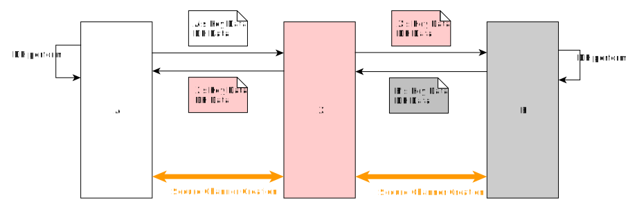
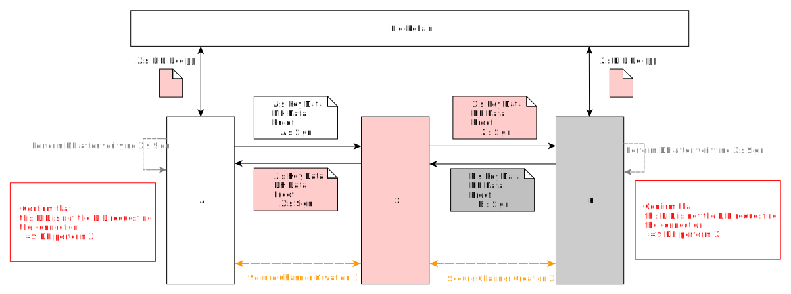

# Man-in-the-middle Attack (manipulator-in-the-middle attack, MitM)
## MitM Attack during ECDH Execution

- Subject: Man-in-the-middle Attack
- Author: OpenSource Development Team
- Date: 2024-10-18
- Version: v1.0.0

| Version | Date       | Changes         |
| ------- | ---------- | --------------- |
| v1.0.0  | 2024-10-18 | Initial version |

 

The diagram above illustrates a Man-in-the-Middle (MitM) attack during ECDH execution.
- Entity A
- Entity B
- Attacker X

When Entity A and Entity B attempt key exchange via ECDH, Attacker X can intercept and impersonate each party to facilitate the key exchange.
Attacker X presents itself as Entity B to Entity A,
and as Entity A to Entity B.

Assuming A and B establish a secure channel between them and encrypt data using keys derived from ECDH,
they may believe their communication is secure. However,
in reality, A communicates with X as well as B, and vice versa, allowing X to intercept all communications.
## MitM Attack Defense through Mutual Authentication

The diagram above depicts defense against MitM attacks during ECDH execution through mutual authentication.
- Entity A
- Entity B
- Attacker X

A and B include their own signatures containing their respective DIDs during key exchange.
If Attacker X attempts to intercept and impersonate A or B, it must include its own signature.
During ECDH execution, A and B can verify the key exchange request based on the included DID.

### When A and B Do Not Know Each Other's DID
- There is a risk of falling victim to an attack where Attacker X attempts to interfere.
- However, identifying Attacker X becomes possible since X cannot conceal its identity.
- If A or B knows the other party's DID, they can reject X's ECDH request.
    - In the case of RSA encryption, knowing the other party's DID enables applying equivalent security measures.

### Explicit Defensive Measures
- When the DID Doc specifies the entity's role,
    - It becomes possible to verify if the DID request aligns with the entity's role (e.g., whether it is an Issuer or TAS).
- When the DID is provided alongside entity information from a directory service provider,
    - Including the DID helps verifying the entity requesting connection.

