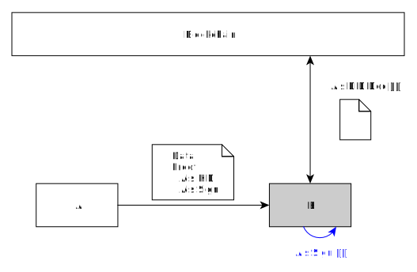
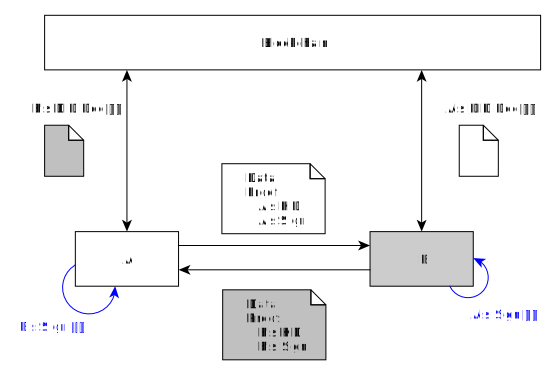
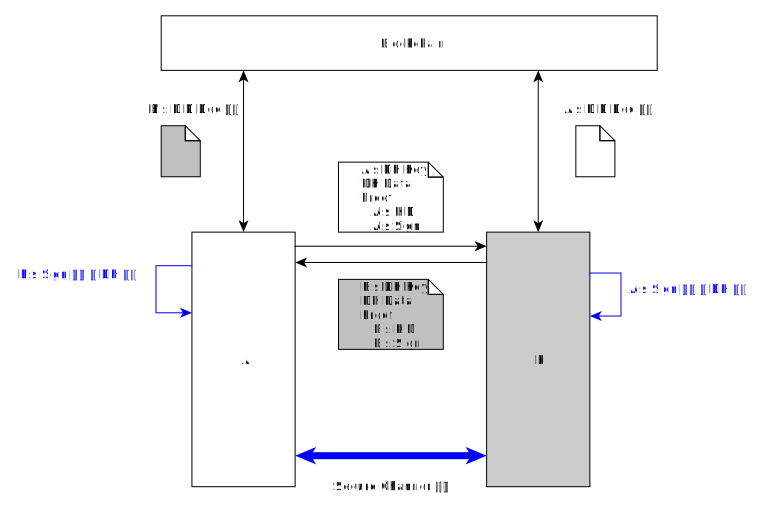
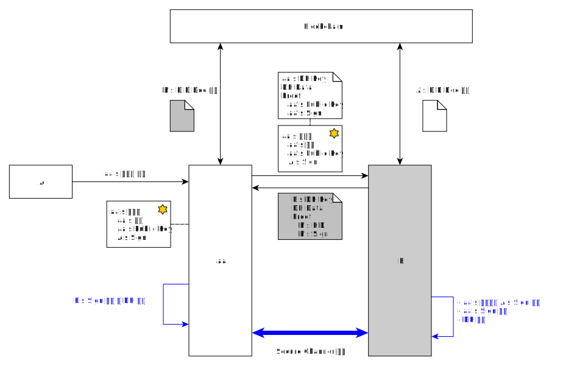

<!-- Individual documents may be merged in the future, so the table of contents is not used. -->

# Authentication and Secure Channel Creation

- Subject: Authentication and Secure Channel Creation
- Author: OpenSource Development Team
- Date: 2024-10-18
- Version: v1.0.0

| Version | Date       | Changes         |
| ------- | ---------- | --------------- |
| v1.0.0  | 2024-10-18 | Initial version |

 

## DID Authentication (DID Auth, DID Assertion): One-way Authentication
Entities may require authentication to trust other entities accessing them. 
To receive authentication, an entity signs the agreed-upon data with its key and requests authentication from the other party. 
The entity which receives the signed data can authenticate and trust the entity through signature verification.
- Use Case
    - In OpenDID, when a user requests VC issuance, TAS verifies the Holder's DID Authentication to perform KYC on their behalf.

### DID-based DID Authentication
If the entity requesting authentication (A) is registered with a DID, it generates a signature with the Key ID (KID) value registered in the DID Doc and sends it.
The recipient verifies the DID Authentication by querying the DID Doc of entity (A) requesting authentication.

### DID + Certificate-based Authentication
For entities (aa) without a DID, applying a certificate is considered.
Entity (aa) without a DID obtains a certificate from the upper entity (A), which is registered with a DID, including its public key details.
Entity (aa), without a DID, signs using its own key and sends the certificate to the recipient.
The recipient queries the DID Doc of the certificate issuer (A) to verify the certificate and uses the public key in the certificate to verify the signature for DID Authentication.

## DID Mutual Authentication: Mutual Authentication
It can be used when two entities need to authenticate each other. 
Each entity signs agreed-upon data with its own key and sends it to the other entity. 
Each entity verifies the other entity's signature to complete mutual authentication.
Through mutual authentication, entities establish mutual trust.
- Use Case
    - In OPEN DID, there is no specific example, but it can be used if entities want to authenticate each other without forming a secure channel.

### DID-based DID Mutual Authentication
A method where two entities registered with DID authenticate each other (Refer to DID-based Authentication).

### DID + Certificate-based Mutual Authentication
A method where two entities not registered with DID authenticate each other (Refer to DID + Certificate-based Authentication).

### Hybrid Mutual Authentication
Mutual authentication is also possible between entities registered with DID and those not registered with DID.

## DID DH-ECDHE: Secure Channel (Mutual Authentication + Key Exchange)
To securely transmit data between two entities, a secure channel is established. 
During the key exchange for the secure channel, the entities can exchange signatures to perform mutual authentication and key exchange simultaneously.
- Use Case
    - Used when forming a secure communication channel between entities.

### DID-based DH-ECDHE
A method where two entities registered with DID form a secure channel. 
Each entity generates a temporary key pair for DH, including DH-related information with its KID signed and sends it to the counterpart. 
The recipient entity queries the DID Doc of the counterpart for signature verification. 

After signature verification, using the received public key and its private key for the temporary key pair, each entity performs DH and generates a symmetric key through KDF. 
The generated symmetric key is used for data encryption and integrity check when communicating with the counterpart.

### DID + Certificate-based DH-ECDHE
For entities not registered with DID forming a secure channel, applying a certificate is considered. 
Entities (aa/bb) without DID obtain a certificate from the upper entities (A/B) registered with DID, including their public key details. 
Each entity signs DH-related information with its private key after generating a temporary key pair for DH and sends it with the certificate to the counterpart. 
The recipient verifies the signature by querying the DID Doc of the upper entity of the counterpart. 
To verify the DH message signature, it verifies the signature with the public key in the certificate.

AAfter signature verification, each entity performs DH and generates a symmetric key through KDF using the received temporary key's public key and its temporary key's private key. 
The generated symmetric key is used for data encryption and integrity check when communicating with the counterpart.

### Hybrid DH
DH between entities registered with DID and those not registered with DID is also possible.

## Certificate
Describes the used certificate when entities not registered with DID form a security channel.
There are methods for registering a DID with a certificate issued by signing with the upper entity's signature, as well as methods for issuing certificates and VCs in the form of certificates. However, it only describes the DID registration method.

### DID Registration Version
Registering a DID involves issuing a certificate signed by the upper entity. 

