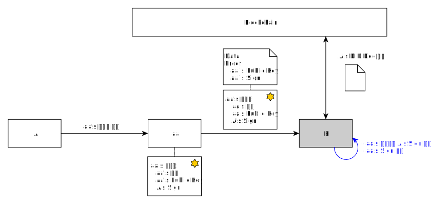
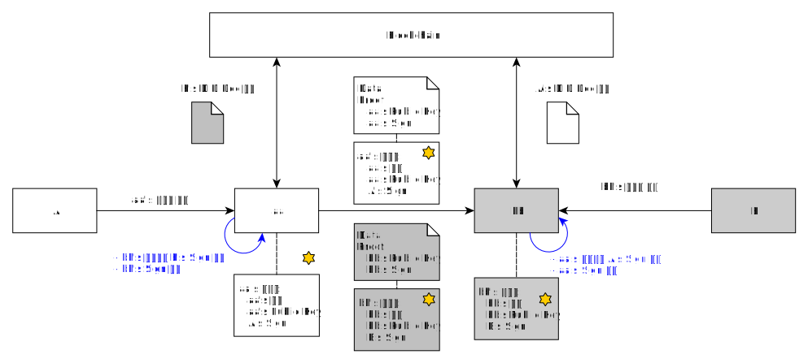
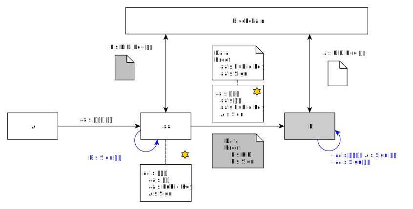
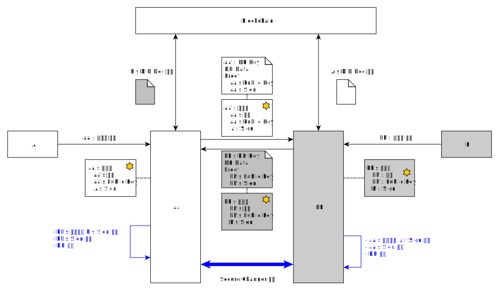
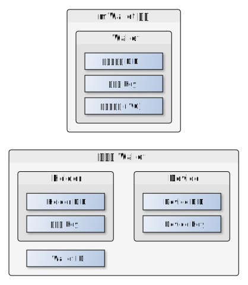

# 인증 및 보안채널 생성
<!-- 개별 문서는 향후에 병합될 수 있으므로, 목차는 사용하지 않습니다. -->

- 주제 : 인증 및 보안채널 생성
- 작성 : 오픈소스개발팀
- 일자 : 2024-10-18
- 버전 : v1.0.0

| 버전 | 일자       | 변경         |
| ------- | ---------- | --------------- |
| v1.0.0  | 2024-10-18 | 최초 작성 |

 

## DID Authentication (DID Auth, DID Assertion) : 단방향 인증
엔티티는 자신에게 접근하는 다른 엔티티를 신뢰하기 위해 인증을 필요로 할 수 있다. 
인증을 받기 위한 엔티티는 약속된 데이터를 자신의 키로 서명하여 상대방에게 인증을 요청한다. 
서명 데이터를 수신한 엔티티는 서명 검증을 통해 해당 엔티티를 인증하고 신뢰할 수 있다.
- 사용 예
    - OpenDID에서는 사용자가 VC 발급 요청 시 TAS가 Holder의 DID Authentication을 검증하여 KYC를 대신한다.
### DID 기반 DID Authentication
인증을 요청하는 엔티티(A)가 DID로 등록되어 있을 경우 DID Doc에 등록된 Key ID(KID)값으로 서명을 생성하여 전달한다. 
상대방은 인증을 요청하는 엔티티(A)의 DID Doc을 조회하여 DID Authentication을 수행한다.

### DID+인증서 기반 Authentication
인증을 요청하는 엔티티(aa)가 DID로 등록된 엔티티가 아닌 경우 인증서를 적용한 방안이다. 
DID가 없는 엔티티(aa)는 DID로 등록된 상위 엔티티(A)로 부터 자신(aa)의 공개키 내용을 포함한 인증서를 발급받는다. 
DID가 없는 엔티티(aa)는 서명 생성 시 자신의 키로 서명을 한 후 상대방에게 인증서를 같이 전달한다. 
상대방은 인증서의 서명자(A)의 DID Doc를 조회하여 인증서를 검증하고 인증서의 공개키롤 DID Authentication의 서명을 검증한다

## DID Mutual Authentication : 상호 인증
두 엔티티가 서로를 인증해야 하는 경우 사용할 수 있다. 
각 엔티티는 인증을 위해 약속된 데이터를 자신의 키로 서명하여 상대방에게 전달한다. 
각 엔티티는 서로 상대방의 서명을 검증하여 서로에 대한 인증을 완료한다. 
상호 인증을 통해 각 엔티티는 서로를 신뢰할 수 있게 된다.
- 사용 예
    - OPEN DID에서의 사용 예는 없으나 만약 엔티티 간에 보안채널을 형성하지 않고 서로에 대한 인증만 수행하고 싶을 경우 사용할 수 있다.

### DID 기반 DID Mutual Authentication
DID로 등록된 두 엔티티가 서로를 인증하는 방식이다.(DID 기반 Authentication 참고)

### DID+인증서 기반 Mutual Authentication
DID 로 등록되지 않은 두 엔티티가 서로를 인증하는 방식이다.(DID+인증서 기반 Authentication 참고)

### 혼합형 Mutual Authentication
DID로 등록된 엔티티와 DID로 등록되지 않은 엔티티간의 상호 인증도 가능하다.

## DID DH-ECDHE : 보안채널 (상호인증 + 키 교환)
두 엔티티 간에 안전하게 데이터를 전송하기 위해 보안채널 형성 후 데이터를 전송할 수 있다. 
보안채널을 위한 키 교환 시 서로의 서명을 같이 교환하여 상호 인증과 키 교환을 동시에 수행할 수 있다.
- 사용 예
    - 엔티티 간의 안전한 통신을 위한 보안채널 형성 시 사용한다.

### DID 기반 DH-ECDHE
DID로 등록된 두 엔티티가 보안채널을 형성하는 방식이다. 
각 엔티티는 자신의 DH 용 임시키 쌍 생성 후 공개키를 포함한 DH 관련 정보를 자신의 KID로 서명하여 상대방에 전달한다. 
DH 메시지를 수신한 엔티티는 데이터 검증을 위해 상대방의 DID Doc 조회하여 서명을 검증한다. 

서명 검증 후 수신한 공개키와 자신의 DH 용 임시키 쌍의 개인키를 이용하여 DH를 수행하고 KDF를 통해 대칭키를 생성한다. 
생성된 대칭키를 이용하여 상대방과 데이터 통신 시 데이터 암호화 및 무결성 체크에 사용한다. 

### DID+인증서 기반 DH-ECDHE
DID로 등록되지 않은 엔티티가 보안채널을 형성 시 인증서를 적용한 방안이다. 
DID가 없는 엔티티(aa/bb)는 DID로 등록된 상위 엔티티(A/B)로 부터 자신(aa/bb)의 공개키 내용을 포함한 인증서를 발급받는다. 
각 엔티티는 자신의 DH 용 임시키 쌍 생성 후 공개키를 포함한 DH 관련 정보를 자신의 개인키로 서명한 후 인증서를 포함하여 상대방에게 같이 전달한다. 
DH 메시지를 수신한 엔티티는 인증서 검증을 위해 상대방의 상위 엔티티의 DID Doc 조회하여 서명을 검증한다. 
DH 메시지 서명을 검증하기 위하여 인증서 내의 공개키로 서명을 검증한다. 

서명 검증 후 수신한 임시키의 공개키와 자신의 임시키의 개인키를 이용하여 DH를 수행하고 KDF를 통해 대칭키를 생성한다. 
생성된 대칭키를 이용하여 상대방과 데이터 통신 시 데이터 암호화 및 무결성 체크에 사용한다.

### 혼합형 DH
DID로 등록된 엔티티와 DID로 등록되지 않은 엔티티 간의 DH도 가능하다.

## 인증서
DID로 등록되지 않은 엔티티가 보안채널 형성 시 사용하는 인증서를 설명한다.
인증서의 종류는 상위 엔티티의 서명을 받아 DID를 등록하는 방식과 인증서 형태로 발급받는 방식 그리고 인증서 형태의 VC 발급 등이 있지만 
DID 등록 버전에 대해서만 서술한다.

### DID 등록 버전
DID를 등록하는 방식의 인증서 형태, 상위 엔티티의 서명을 받아 인증서를 발급한다. 

