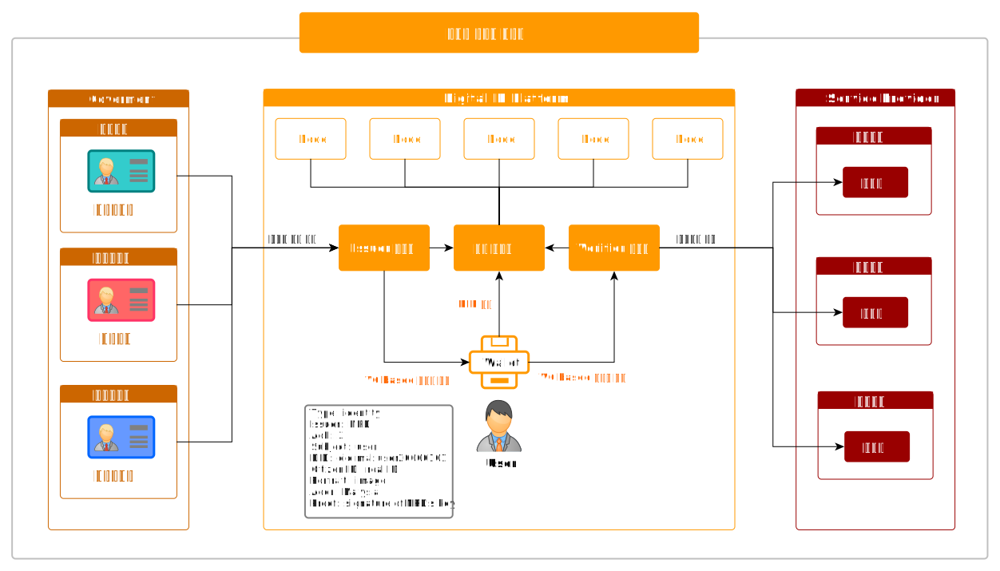
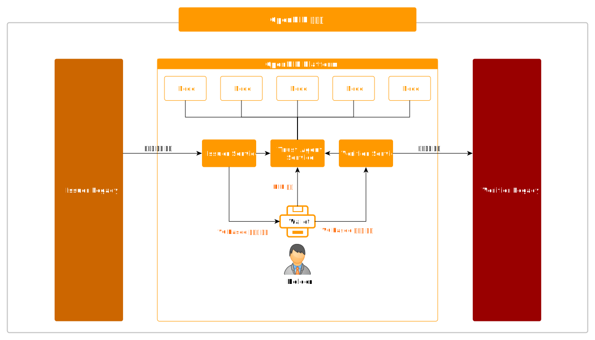
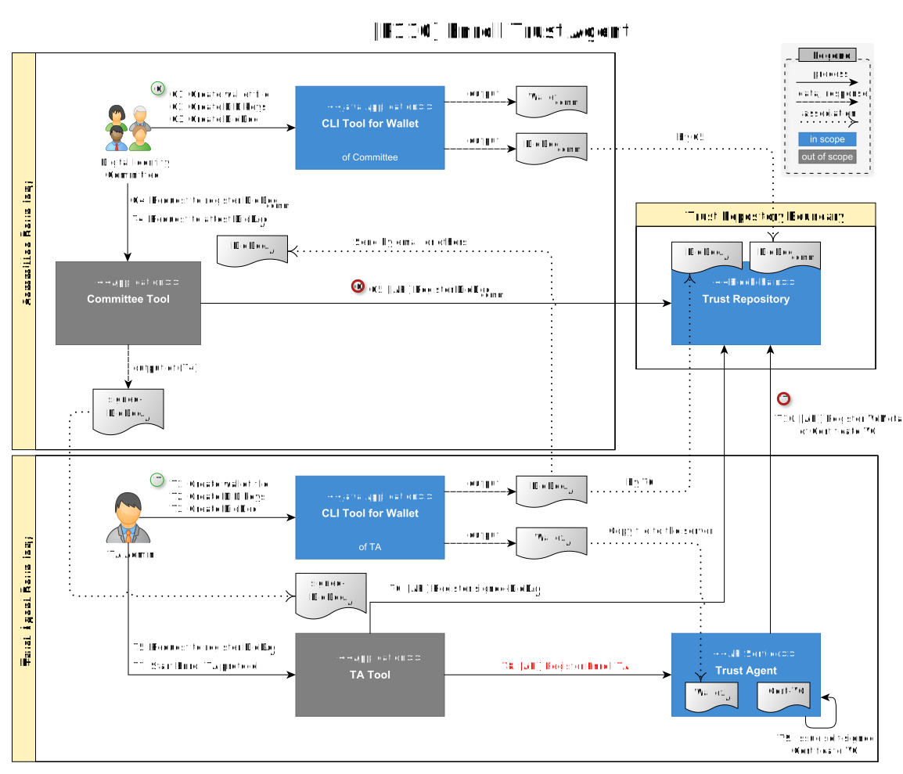
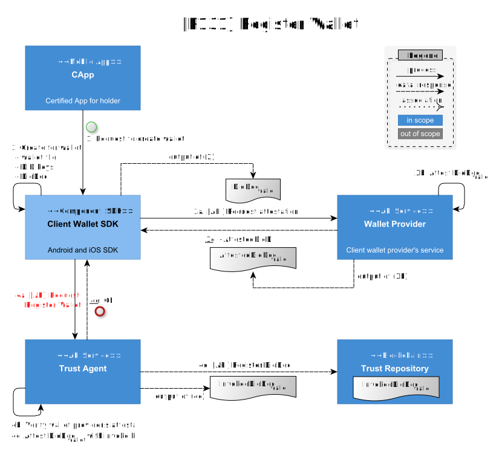
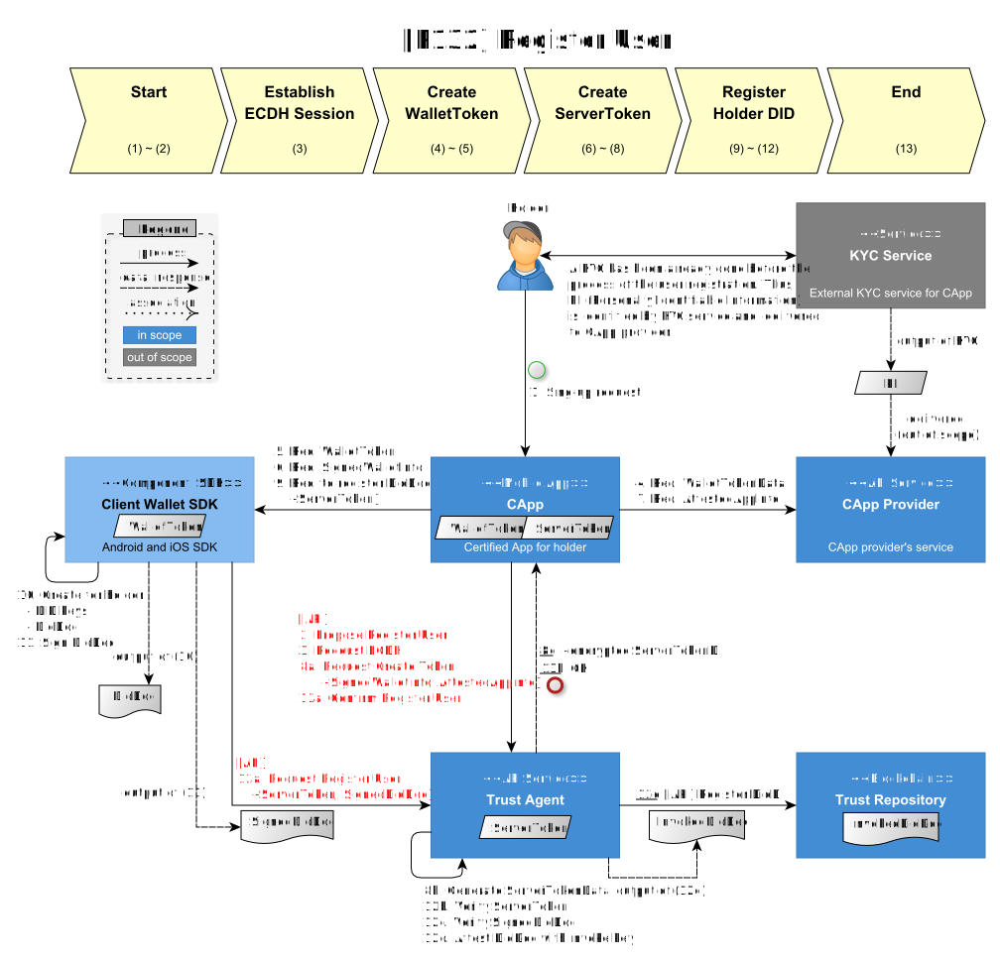
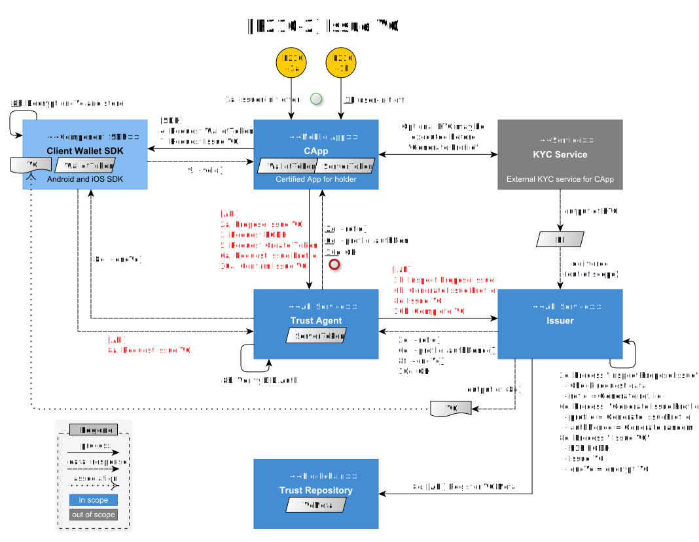
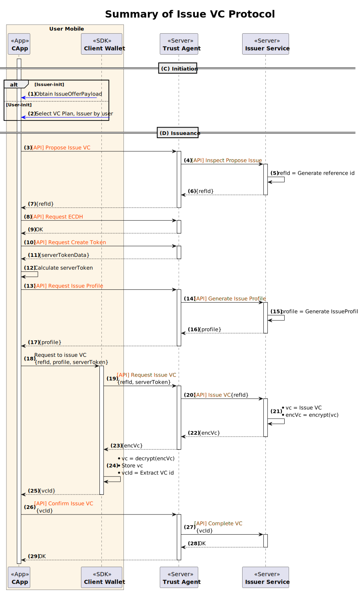
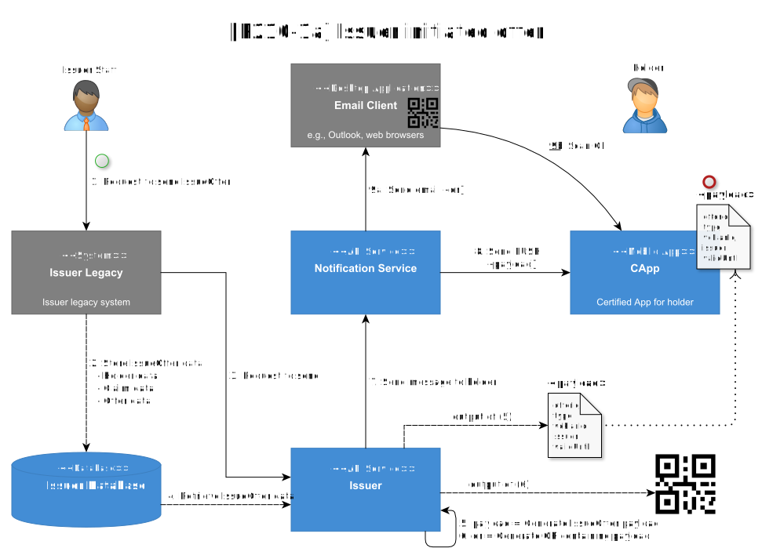
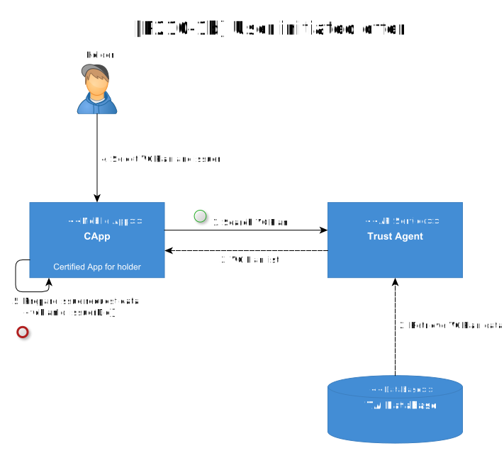
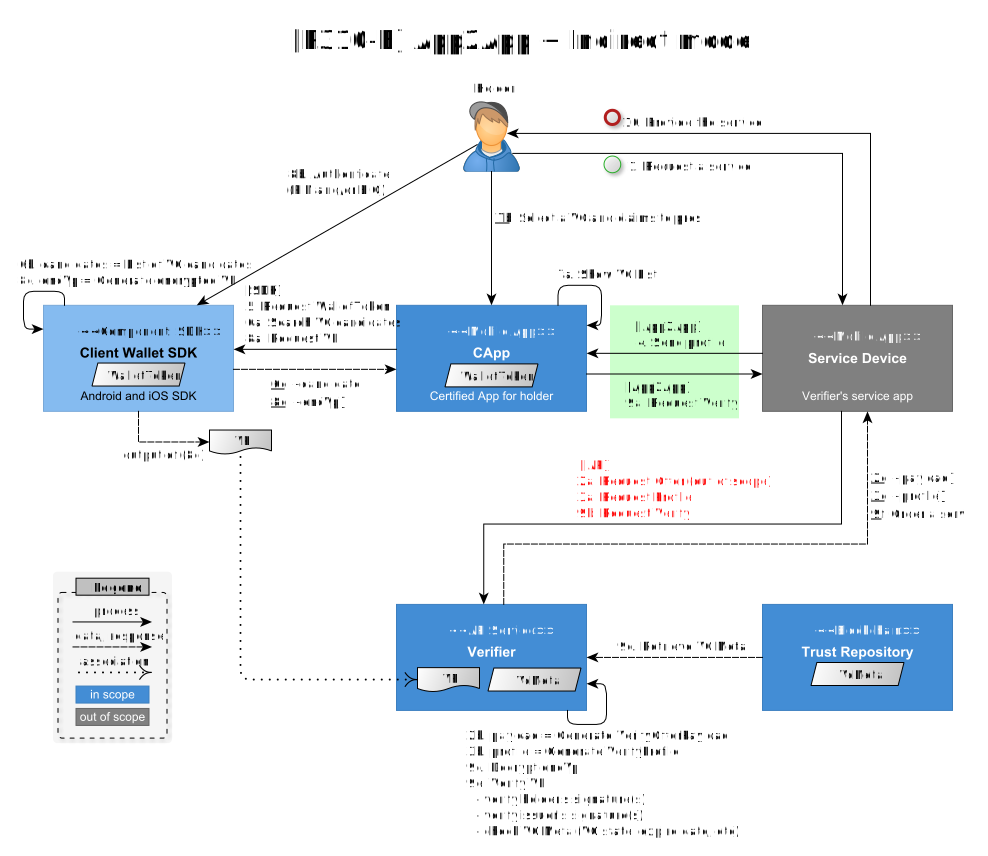

---
puppeteer:
    pdf:
        format: A4
        displayHeaderFooter: true
        landscape: false
        scale: 0.8
        margin:
            top: 1.2cm
            right: 1cm
            bottom: 1cm
            left: 1cm
    image:
        quality: 100
        fullPage: false
---

Software Architecture
==

- 주제: C4 model을 이용한 Software Architecture 설명
- 작성: 강영호
- 일자: 2024-09-03
- 버전: v1.0.0

목차
---

<!-- TOC tocDepth:2..4 chapterDepth:2..6 -->
  - [1. 개요](#1-개요)
    - [1.1. C4 model](#11-c4-model)
    - [1.2. 참조문서](#12-참조문서)
  - [2. Digital ID 플랫폼](#2-digital-id-플랫폼)
    - [2.1. Open DID](#21-open-did)
  - [3. System Context Diagram](#3-system-context-diagram)
    - [3.1. OpenDID](#31-opendid)
    - [3.2. Holder](#32-holder)
    - [3.3. Issuer Legacy](#33-issuer-legacy)
    - [3.4. Issuer](#34-issuer)
    - [3.5. Verifier Legacy](#35-verifier-legacy)
    - [3.6. Verifier](#36-verifier)
  - [4. Container Diagram](#4-container-diagram)
    - [4.1. Core](#41-core)
    - [4.2. Wallet](#42-wallet)
    - [4.3. Certified App](#43-certified-app)
    - [4.4. Issuer](#44-issuer)
    - [4.5. Verifier](#45-verifier)
    - [4.6. Supplements](#46-supplements)
  - [5. Component Diagram](#5-component-diagram)
    - [5.1. Trust Agent](#51-trust-agent)
      - [5.1.1. Enroll Controller](#511-enroll-controller)
      - [5.1.2. Issuance Controller](#512-issuance-controller)
      - [5.1.3. List Controller](#513-list-controller)
    - [5.2. Issuer Service](#52-issuer-service)
      - [5.2.1. Issuance Controller](#521-issuance-controller)
      - [5.2.2. VC Controller](#522-vc-controller)
    - [5.3. Verifier Service](#53-verifier-service)
      - [5.3.1. Verify Controller](#531-verify-controller)
    - [5.4. Certified App (CApp)](#54-certified-app-capp)
      - [5.4.1. DID Module](#541-did-module)
      - [5.4.2. VC Module](#542-vc-module)
      - [5.4.3. VP Module](#543-vp-module)
    - [5.5. Wallet Service](#55-wallet-service)
    - [5.6. CApp Service](#56-capp-service)
    - [5.7. User Service](#57-user-service)
    - [5.8. Notification Service](#58-notification-service)

<!-- /TOC -->

## 1. 개요

본 문서는 OpenDID의 software architecture를 C4 model을 이용하여 설명한다.

### 1.1. C4 model

C4 model은 소프트웨어 시스템의 아키텍처를 시각화하기 위한 다이어그램 작성 방법론이다.
이름에서 알 수 있듯이, C4 모델은 네 가지 주요 다이어그램 유형인 컨텍스트(Context), 컨테이너(Container),
컴포넌트(Component), 코드(Code)를 사용하여 시스템의 다양한 수준에서 구조를 명확하게 표현한다.
각 다이어그램은 특정 관점에서 시스템을 설명하며, 이해 관계자들이 시스템의 구조와 상호작용을 쉽게 이해할 수 있도록 돕는다.

이러한 4단계 접근 방식은 시스템의 전체 구조를 계층적으로 이해할 수 있게 하여, 개발자와 비기술적 이해관계자 모두에게 유용한 도구가 된다.
본 문서에서는 Code 수준의 구조는 생략하였다.

### 1.2. 참조문서

| 참조명       | 문서명                                             | 위치                 |
| ------------ | -------------------------------------------------- | -------------------- |
| [C4-MODEL]   | The C4 model for visualising software architecture | https://c4model.com/ |
| [DATA-SPEC]  | (OpenDID) 데이터 명세서(Data Specification)        |  [데이터 명세서](https://gitlab.raondevops.com/opensourcernd/source/design/did-doc-architecture/-/blob/main/docs/data%20standard/data%20specification/Data%20Specification_ko.md?ref_type=heads)                    |
| [USER-REG]   | (OpenDID) 사용자 등록                              |  [사용자 등록](https://gitlab.raondevops.com/opensourcernd/source/design/did-doc-architecture/-/blob/main/docs/concepts/features/User%20Registration_ko.md?ref_type=heads)                    |
| [ISSUE-VC]   | (OpenDID) VC 발급                                  | [VC 발급](https://gitlab.raondevops.com/opensourcernd/source/design/did-doc-architecture/-/blob/main/docs/concepts/features/VC%20Issuance_ko.md?ref_type=heads)                     |
| [PRESENT-VP] | (OpenDID) vp 제출                                  |  [VP 제출](https://gitlab.raondevops.com/opensourcernd/source/design/did-doc-architecture/-/blob/main/docs/concepts/features/Presentation%20of%20VP_ko.md?ref_type=heads)                    |
| [VC-FORMAT]  | (OpenDID) VC format                                | [VC 포맷](https://gitlab.raondevops.com/opensourcernd/source/design/did-doc-architecture/-/blob/main/docs/data%20standard/verifiable%20credential%20format/VC%20format_ko.md?ref_type=heads)                     |

## 2. Digital ID 플랫폼

Digital ID 플랫폼은 블록체인 기반의 DID(Decentralized Identity) 기술을 활용하여 모바일 신분증(예: 운전면허증, 모바일 유공자증, 모바일 주민등록증)을 발급, 관리, 검증할 수 있는 시스템이다.
이를 통해 사용자들은 자신의 신원을 안전하게 관리하고 필요한 서비스에서 신원을 검증받을 수 있다.

Digital ID 플랫폼은 다음과 같은 주요 구성 요소로 이루어진다.

- **발급 시스템(Issuer)**: 사용자 요청에 따라 신분증을 발급하는 시스템
- **검증 시스템(Verifier)**: 사용자 신분증을 검증하는 시스템
- **신뢰 시스템**: 플랫폼 구성원들이 서로 신뢰할 수 있도록 **신뢰체인을 형성**하도록 돕는 시스템
- **신뢰 저장소(Verifiable Data Registry)**: 블록체인에 기반한 데이터 저장소로, 분산 식별자(DID) 및 자격증명(VC)을 관리하는 시스템
- **사용자(User)**: 신분증을 발급받고 검증받는 개인

Digital ID 플랫폼에서 정부는 사용자의 요청에 따라 검증 가능한 자격증명(VC) 기반의 신분증을 **발급 시스템**을 통해 발급한다.
이후 사용자는 **Service Provider**가 요청하는 신분 정보를 VC 기반 신분증으로 **검증 시스템**에 제출하여 신분을 검증받게 된다.

모든 사용자는 Digital ID 플랫폼에 참여하기 위해 **분산 식별자(DID)** 를 생성하고, 이를 **신뢰 시스템**을 통해 **신뢰 저장소**에 등록해야 한다.

### 2.1. Open DID

**OpenDID**는 이러한 Digital ID 플랫폼을 오픈소스화한 프로젝트이며, 블록체인 기반의 디지털 신원증명 시스템을 누구나 활용하고 확장할 수 있도록 구현하였다.
이를 통해 조직, 개발자, 정부 기관 등이 Digital ID 시스템을 손쉽게 구축하고 사용자에게 신분증을 발급할 수 있다.

## 3. System Context Diagram

System context diagram은 시스템의 전체적인 맥락을 보여준다.
여기서는 시스템과 외부 엔티티들 간의 상호작용을 나타내며, 주요 사용자의 역할과 외부 시스템과의 관계를 파악할 수 있다.

Context Diagram에는 OpenDID의 주요 기능인 **VC 발급**, **VP 제출**, **사용자 등록** 만을 표기하였다.

1. **VC 발급**: Holder가 Issuer Legacy를 통해 VC를 요청하면, Issuer Legacy는 필요한 데이터를 OpenDID에 전달하고, OpenDID는 이를 바탕으로 VC를 생성하여 Holder에게 제공한다.
2. **VP 제출**: Holder가 Verifier Legacy에게 신원 확인을 요구받으면, Holder는 VP를 생성하여 OpenDID에 제출한다. OpenDID는 VP를 검증한 후 Verifier Legacy에게 전달하며, Verifier Legacy는 이를 통해 Holder의 신원을 확인하고 서비스를 제공한다.
3. **사용자 등록**: 모든 Holder는 OpenDID 서비스를 이용하기 전에 사용자 등록 과정을 거쳐야 한다. 이 과정에서 Holder는 분산 식별자(DID)를 생성하고, 생성된 DID와 함께 DID Document를 OpenDID의 신뢰 시스템을 통해 신뢰 저장소에 등록해야 한다.

OpenDID의 핵심 기능은 아래와 같다.
- 신뢰체인의 기반이 되는 DID Document의 생애주기 관리
- 개인키와 문서 등을 안전하게 저장하고 사용
- 신분증으로서의 VC 발급
- VC의 생애주기 관리
- VP 제출 및 검증

Holder가 상기 핵심 기능을 더욱 편리하게 이용하도록 돕는 부가적인 기능들도 있는데 이는 다음과 같다.
- 사용자 등록 (Sign-up, user registration)
- 분실 및 회수 신고 (Report lost and found)
- DID Document 말소 신고 (Request termination)
- VC 삭제 및 재발급
- 회원 탈퇴 (Cancel membership)

부가 기능은 OpenDID 구현체의 정책이나 요구사항에 따라 다양한 방식이 존재할 수 있다.
그러므로 부가 기능은 정해져 있다기 보다는 특정 구현체가 채택한 사례로 보아야 한다.

<!-- DID 기반 digital ID 시스템인 OpenDID의 핵심 기능은 다음과 같다.

- 신뢰체인의 기반이 되는 DID Document의 생애주기 관리
- 개인키와 문서 등을 안전하게 저장하고 사용
- 신분증으로서의 VC 발급
- VC의 생애주기 관리
- VP 제출 및 검증

발급받은 VC를 소지한 사용자를 Holder라고 한다.
Holder가 상기 핵심 기능을 더욱 편리하게 이용하도록 돕는 부가적인 기능들도 있는데 이는 다음과 같다.

- 사용자 등록 (Sign-up, user registration)
- 분실 및 회수 신고 (Report lost and found)
- DID Document 말소 신고 (Request termination)
- VC 삭제 및 재발급
- 회원 탈퇴 (Cancel membership)

부가 기능은 OpenDID 구현체의 정책이나 요구사항에 따라 다양한 방식이 존재할 수 있다.
그러므로 부가 기능은 정해져 있다기 보다는 특정 구현체가 채택한 사례로 보아야 한다. -->

### 3.1. OpenDID

OpenDID는 목표 시스템으로서, 각 참여자에 다음의 서비스를 제공한다.

- to Holder
    - 사용자 등록
    - 신분증 발급 및 제출
    - 모바일 기기 분실 및 회수 신고
    - DID Document 말소 신고
    - 회원 탈퇴
- to Issuer
    - IssueOffer를 Holder에 발송
    - Holder에 VC 발급
    - VC 상태 관리
- to Verifier
    - 응대장치에 VerifyOffer 제공
    - Holder로부터 VP 수신하여 검증

OpenDID의 하위 구성요소는 Container diagram에서 설명한다.

### 3.2. Holder

Holder는 Issuer가 발급한 신분증을 소지한 자를 말하며, 일반적으로 사용자(User)와 같은 의미이다.
넓은 의미에서 사용자는 Holder 뿐만 아니라 Trust Agent, Issuer, Verifier의 관리자도 포함될 수 있다.
그러나 특별히 관리자라고 명시하지 않는 한 사용자는 Holder와 같은 의미이다.

### 3.3. Issuer Legacy
Issuer Legacy는 이전에 사용되던 신원 관리 시스템으로, Holder에게 신분증을 발급하거나 발급을 위해 필요한 신원 정보를 가지고 있는 시스템이다.  이 시스템은 VC를 발급하기 위해 필요한 정보를 OpenDID에 전달하는 역할을 하지만, 그 방식은 구현에 따라 달라진다. 예를 들어, API를 호출하거나 OpenDID에서 제공하는 SDK를 사용할 수 있다.

구체적인 예는 다음과 같다:

- 실물 신분증 발급 시스템: 기존에 주민등록증이나 운전면허증 같은 실물 신분증을 발급하던 정부기관의 신원 관리 시스템이 Issuer Legacy가 될 수 있다. 이런 시스템은 실물 신분증 발급을 위한 데이터를 보유하고 있으며, 이를 통해 OpenDID와 연계하여 모바일 신분증을 발급한다.
- 신원 정보를 보유한 기관: 기존에 신분증을 발급하지는 않았지만, 사용자의 신원 정보(예: 이름, 생년월일, 주민등록번호)를 관리해오던 기관도 Issuer Legacy가 될 수 있다. 이 기관은 OpenDID를 통해 모바일 신분증 발급을 시작할 수 있다.

이처럼 Issuer Legacy는 다양한 조직이나 시스템이 될 수 있으며, 신원 정보를 바탕으로 OpenDID와 상호작용하여 VC 발급을 지원한다

### 3.4. Issuer

본 문서에서 Issuer는 일반적으로 OpenDID 내에서 발급 사업자의 역할을 수행하는 API Service를 의미하지만
넓은 의미에서는 Issuer Legacy(기존 시스템)를 포함하기도 한다.

Issuer Legacy는 발급에 필요한 사용자 정보의 출처이며, 기존 Issuer 관리자(admin)가 사용하던 시스템이므로
신규로 구축할 Issuer Service와 동일체이거나 직접적으로 연관된 엔티티이다.
그러므로 이 둘을 완전히 분리하기보다 필요에 따라 묶어서 하나로 표현하기도 하고 별도로 표현하기도 한다.

중요한 점은, Issuer는 하나의 OpenDID 구현체 별로 단 하나만 존재하는 것이 아니라 최소한 하나 이상이라는 것이다.
또한 시스템 운영 중에 Issuer가 추가되거나 제거될 수도 있다.

### 3.5. Verifier Legacy
Verifier Legacy는 기존에 Holder의 신원을 확인하고 서비스를 제공하는 시스템을 의미한다. 이 시스템은 Holder가 제출한 Verifiable Presentation(VP)을 통해 신원을 검증하며, VP는 OpenDID 시스템에서 검증된 후 Verifier Legacy에 전달된다. Verifier Legacy는 검증된 VP를 바탕으로 Holder의 신원을 확인하고, 그에 따라 서비스를 제공한다.

구체적인 예는 다음과 같다:

- 금융기관의 신원 확인 시스템: 은행이나 보험사 등에서 사용자의 신분을 확인한 후 금융 서비스를 제공하는 기존 시스템이 Verifier Legacy로 작동할 수 있다. 이러한 시스템은 VP를 검증하고 사용자가 신뢰할 수 있는 신원임을 확인한 후에 서비스 제공을 진행한다.
- 정부기관의 신원 확인 시스템: 정부 서비스에서 기존에 사용되던 신원 확인 절차를 진행하는 시스템도 Verifier Legacy의 역할을 할 수 있다. OpenDID를 통해 제출된 VP를 검증하여 신원을 확인하고, 필요한 서비스를 제공한다.

### 3.6. Verifier

본 문서에서 Verifier는 일반적으로 OpenDID 내에서 검증 사업자의 역할을 수행하는 API Service를 의미하지만
넓은 의미에서는 Verifier Legacy(기존 시스템)를 포함하기도 한다.

Verifier 또한 하나가 아니라 최소 하나 이상이며, 시스템 운영 중 Verifier가 추가되거나 제거될 수 있다.

## 4. Container Diagram

Container diagram은 시스템 내부의 주요 container(예: API application, database 등)를 나타내고, 이들 간의 상호작용과 데이터 흐름을 설명한다. 
Docker의 container와는 다른 개념이므로 이에 주의한다.

상기 Container diagram은 OpenDID 시스템의 Container 레벨 구성을 보여준다.
Container를 분류하면 다음과 같다.

| Group                       | Containers                                   | Multiple |
| --------------------------- | -------------------------------------------- | :------: |
| **Core**                    | • Trust Agent                             |          |\
|                             | • Trust Repository (Blockchain network)   |          |\
|                             | • Notification Service                       |          |
| **Wallet**                  | • Client wallet (SDK, Mobile App, Cloud)  |    Y     |\
|                             | • Wallet Service (for client wallet)         |          |
| **Certified App** (CApp) | • CApp (Mobile App for holder)            |    Y     |\
|                             | • CApp Service                               |          |
| **Issuer**                  | • Issuer Service                          |    Y     |\
|                             | • Issuer Legacy                              |          |
| **Verifier**                | • Verifier Service                        |    Y     |\
|                             | • Verifier Legacy                            |          |
| **Supplements**             | • User Service                            |          |\
|                             | • CLI Tool for Wallet                        |          |

### 4.1. Core

Core group은 Digital ID 시스템 운영에 반드시 필요한 다음의 공통 요소를 포함한다.

- Trust Repository
    - Blockchain 기반 저장소로서 해킹 및 위변조 차단
    - DID Document, VC Metadata 등을 저장
- Trust Agent
    - Digital Identity Committee (이하 위원회)로부터 다음의 권한을 위임받아 신뢰체인을 구축하고 운영
        - DID Document 등록
        - Entity(Issuer, Verifier and other providers) 등록 및 가입증명서(Certificate VC) 발급
        - Client Wallet 등록
        - 사용자 등록/탈퇴
    - 기타 부가적인 기능 제공
        - VC Plan 등록 및 조회
        - KYC
- Notification Service
    - 서버로부터 인가앱으로 이메일, PUSH 알림 등 메시지를 전달
    - Issuer나 Verifier는 별도의 Notification Service를 운영할 수도 있음

핵심적인 기능 외에 구현체 정책에 따라 다음의 사업자가 수행하는 기능을 Trust Agent에 구축할 수도 있다.

- KYC provider
- Notification provider
- List provider
- Log and backup provider

### 4.2. Wallet

Walelt group은 사용자용 client wallet과 관련된 다음의 요소를 포함한다.

- Client wallet
    - File wallet
    - Mobile app wallet
    - Cloud wallet
- Wallet Service
    - Client wallet을 Trust Agent에 등록 시 wallet 등록 정보를 서명하며 authenticity 증명
    - Client wallet 등록 용도로만 사용됨

하나의 도메인에는 최소 1개 이상의 wallet group이 필요하다.

여기서 도메인이라 함은 고유의 DID method를 보유하고, Trust Agent를 운영중인 OpenDID 구현체를 의미한다.
하나의 위원회가 여러 개의 도메인을 보유할 수 있다.

### 4.3. Certified App

CApp group은 사용자용 모바일 앱과 관련된 다음의 요소를 포함한다.

- CApp (인가앱)
    - CApp Provider로 등록된 사업자가 운영하는 사용자용 모바일 앱
    - 등록된 Wallet Provider가 제공하는 client wallet을 반드시 사용해야 함
- CApp Service
    - WalletToken 및 ServerToken 생성 시 token seed 정보를 서명하여 인가앱의 authenticity 증명
    - 인가앱이 client wallet이나 TA 서비스 이용 시마다 CApp Service의 서명이 필요함

하나의 도메인에는 최소 1개 이상의 CApp group이 필요하다.

### 4.4. Issuer

Issuer group은 신분증 발급과 관련된 다음의 요소를 포함한다.

- Issuer Service
    - OpenDID에서 제공하는 SDK를 이용하여 Issuer API를 구현한 서버
    - Issuer Legacy에 Issuer API를 추가로 구현하는 것도 가능
- Issuer Legacy
    - 신분증 발급에 필요한 개인정보를 보유하고 관리하는 Issuer의 기존 서버

하나의 도메인에는 최소 1개 이상의 Issuer group이 필요하다.

### 4.5. Verifier

Verifier group은 신분증 제출 및 검증과 관련된 다음의 요소를 포함한다.

- Verifier Service
    - OpenDID에서 제공하는 SDK를 이용하여 Verifier API를 구현한 서버
    - Verifier Legacy에 Verifier API를 추가로 구현하는 것도 가능
- Verifier Legacy
    - 사용자의 신원확인 후 사용자에게 고유의 서비스를 제공하는 Verifier의 기존 서버
    - 다양한 신원확인 서비스가 존재하며, Verifier Service는 그 중의 하나

하나의 도메인에는 최소 1개 이상의 Verifier group이 필요하다.

### 4.6. Supplements

Supplements group은 부가적인 기능이나 임시 기능을 제공하는 다음의 요소를 포함한다.

- User Service
    - 인가앱이 Trust Repository에 접근하는 API 제공
    - 저장소 Blockchain으로 HyperLedger Fabric (이하 HLF)을 사용하는 경우에 한해 필요
        - HLF은 인증서 기반으로 접근통제를 하고 있으며, 읽기/쓰기 권한을 따로 부여할 수 없다.
        - 그러므로 User Serivce에 인증서를 부여하고, User Service는 읽기 서비스만 제공함으로써 상세 접근통제를 가능하게 한다.
- CLI Tool for Wallet
    - Issuer, Verifier를 포함한 사업자(Provider)용 entity를 위한 Wallet 도구
    - 다음의 기능 제공
        - Wallet 생성
        - DID 용 ECC, RSA 키 쌍 생성
        - DID Document 생성
    - 사용 시나리오
        - Entity 관리자가 wallet, DID 용 키 쌍, DID Document 생성
        - Wallet 파일은 Provider Service 서버에 복사하여 server wallet 설정
        - TA 관리자에 DID Document를 전송하여 신뢰 저장소에 등록 요청
        - Provider Service에서 Trust Agent로 Entity 등록 프로토콜을 호출

## 5. Component Diagram

Component diagram은 각 container 내부의 주요 구성요소와 그들 간의 관계를 구체적으로 나타낸다.
여기서는 아주 상세한 관계보다는 구성요소에 치중하여 간략하게 표현하였다.

OpenDID SDK는 모든 container가 공통적으로 사용하며, SDK의 종류와 기능은 다음과 같다.

| SDK                    | 기능                                                        | 비고                       |
| ---------------------- | ----------------------------------------------------------- | -------------------------- |
| Core SDK               | • DID Document 생성                                      | DID, VC, VP                |\
|                        | • VC 생성                                                |                            |\
|                        | • VP 생성, VP 검증                                          |                            |
| Common SDK             | • 공통으로 사용하는 유틸리티                                | 날짜 함수, 문자열 함수 등  |
| Crypto SDK             | • 대칭키 암호화/복호화                                   | 암호화, 서명, 해시, 인코딩 |\
|                        | • 공개키 서명/검증                                       |                            |\
|                        | • 키 쌍 생성 (ECC, RSA)                                  |                            |\
|                        | • Multibase 인코딩/디코딩                                |                            |\
|                        | • Hash 등                                                   |                            |
| Data Model SDK         | • 각종 JSON 문서, API 메시지, 데이터의 모델 제공            | JSON ↔ Java Class 변환     |
| Blockchain SDK         | • DID Document 생애주기 관리 (등록/수정/삭제/폐기/말소)  | Blockchain 등록/조회       |\
|                        | • VC Metadata 등록/조회                                  |                            |\
|                        | • VC 생애주기 관리 (중지/폐기)                           |                            |
| (Server) Wallet SDK | • Wallet 초기화/연결/해제                                | DID 키 관리 및 사용        |\
|                        | • DID 키 쌍 생성                                         |                            |\
|                        | • DID 키로 서명/검증                                     |                            |\
|                        | • 키교환                                                 |                            |
| (Client) Util SDK   | • Crypto SDK와 Common SDK의 기능 포함                       | Utility                    |
| (Client) Wallet SDK | • Client Wallet 초기화/잠금/잠금해제                     | DID 및 VC 관리             |\
|                        | • DID Document 생성/저장/조회                            |                            |\
|                        | • VC 저장/조회                                           |                            |

### 5.1. Trust Agent

Trust Agent는 OpenDID가 제공하는 SDK를 이용하여 등록, 발급, 목록 API를 구현한 container이다.

| API Group           | 기능                                                     | 비고                               |
| ------------------- | -------------------------------------------------------- | ---------------------------------- |
| Enroll Controller   | • DID Document 등록/수정                              | 신뢰체인 형성 및 사용자 관리    |\
|                     | • Entity 등록                                         |                                    |\
|                     | • Wallet 등록                                         |                                    |\
|                     | • 사용자 등록/탈퇴                                    |                                    |\
|                     | • 사용자 모바일 분실/회수 신고                        |                                    |\
|                     | • 사용자 DID Document 말소 신고                          |                                    |
| Issuance Controller | • VC 발급 중개                                        | 발급과 상태변경은 Issuer가 수행 |\
|                     | • VC 상태변경 중개                                       |                                    |
| List Controller     | • 다음의 정보 조회                                    | 목록 사업자의 기능                 |\
|                     | &nbsp;&nbsp;- VC category list                        |                                    |\
|                     | &nbsp;&nbsp;- VC Plan list for a category             |                                    |\
|                     | &nbsp;&nbsp;- VC Plan information                     |                                    |\
|                     | &nbsp;&nbsp;- Allowed CApp package list for a wallet  |                                    |\
|                     | &nbsp;&nbsp;- Certificate VC by DID                      |                                    |

#### 5.1.1. Enroll Controller

Enroll Controller는 등록과 관련된 기능을 담당한다.
등록의 대상이 되는 주체의 종류는 다음과 같다.

1. Entity: Trust Agent, Issuers, Verifiers and the other providers such as Wallet Provider, CApp Provider
2. Client Wallet
3. User (Holder)

아래 표는 각 주체 별로 식별자 타입 (Id type), DID 보유 여부, 가입증명서 보유 여부 등을 설명한다.

| Subject         | Id. Type           | own a DID | own a Certificate VC |
| --------------- | ------------------ | --------- | -------------------- |
| Trust Agent     | did                | Y         | Y (role="Tas")       |
| Issuer          | did                | Y         | Y (role="Issuer")    |
| Verifier        | did                | Y         | Y (role="Verifier")  |
| Other providers | did                | Y         | Y (role=...)         |
| Client Wallet   | walletId, did      | Y         | N                    |
| User            | personId(PII), did | Y         | N                    |
| CApp            | appId              | N         | N                    |

인가앱은 DID를 보유하지 않으므로 인가앱의 authenticity를 증명하기 위해서는
인가앱 사업자(CApp Provider)의 서명(attestation)이 필요하다.

■ Entity의 DID Document 등록 절차

DID를 보유한 주체는 DID Document를 Trust Repository에 먼저 등록하여야 한다.
데모 구현체는 `<<Java Application>> CLI Tool for Wallet`을 제공하여 각 사업자가
자신의 Server wallet과 DID Document를 생성할 수 있도록 한다.
Provider의 DID Document 등록 절차는 다음과 같다.

1. (Provider Admin) CLI Tool for wallet으로 DID Document 생성
2. (Provider Admin) Trust Agent Admin에게 이메일 등의 방식으로 다음의 문서를 전달
    - DID Document
    - Evdidence documents (사업자등록증 등 사업자를 증빙할 서류)
3. (TA Admin) 제출받은 문서 검토 후 TA Tool을 이용하여 시스템에 Provider 정보 입력
4. (TA Admin) TA Tool을 이용하여 Provider의 DID Document를 Trust Repository에 등록

■ 가입증명서 (Certificate VC)

Trust Agent를 포함한 사업자들은 모두 Trust Agent로부터 가입증명서를 발급받는다.
가입증명서는 다음의 claim을 포함한다.

- `subject` (DN = Distinguished Name): 주체의 정보
- `role` (ROLE_TYPE): 주체의 역할. "Tas", "Issuer", "Verifier" 등

DID Document만으로는 해당 주체가 어떤 역할을 수행하는지 알 수가 없다.
그러므로 Trust Agent는 Provider entity 등록 시 가입증명서를 발급하여
해당 주체가 어떤 역할을 수행하는지 증명하는 수단으로 사용하도록 한다.

발급한 가입증명서를 어디에 저장하고 어떻게 조회하는지는 본 문서의 범위 밖이나,
데모 구현체는 provider `did`로 가입증명서를 조회하는 기능을 제공한다.

■ Trust Agent 등록

Trust Agent 등록은 도메인 당 한 차례만 수행하는 특별한 절차이다.
TA Admin이 CLI Tool for Wallet을 이용하여 DID Document를 생성하고,
이를 위원회에 송부하여 위원회가 Trust Repository에 등록한다.
이 부분은 본 문서의 범위 밖이므로 한 가지 사례로 제시한다.

■ Entity 등록

■ 사용자 등록/탈퇴

사용자 등록 과정은 다음과 같다.

1. Client Wallet 등록
    
1. 사용자 등록
    

사용자 등록과 관련한 상세한 내용은 [USER-REG] 문서를 참조한다.

사용자 회원탈퇴는 인가앱이나 TA Portal 사이트를 통해 신청이 가능하다.
회원탈퇴 시 Trust Agent가 처리해야 하는 내용은 본 문서에 명시하지 않는다.
그 이유는 DID 정책 등 구현체의 요구사항에 따라 처리할 내용이 달라지기 때문이다.
다만 여기서는 일반적인 처리내용에 대해 사례만 언급한다.

- 사용자 DID Docment 폐기 (사용자 요구시 말소 가능)
- 사용자에 발급된 모든 VC 폐기
- 사용자 개인정보 삭제

■ 사용자 모바일 분실/회수 신고

사용자가 인가앱이 설치된 모바일 기기를 분실한 경우 TA Portal 사이트를 통해 분실 신고를 할 수 있다.
분실 신고 접수 시 Trust Agent는 다음을 수행한다.

- 사용자 DID Document 비활성화 (ACTIVATED → DEACTIVATED)
- 사용자에 발급된 모든 VC 중지 (ACTIVE → INACTIVE)
- 인가앱과 client wallet 상태를 분실로 변경

분실 신고(Report a lost) 이후 모바일 기기를 되찾은 경우 회수 신고를 하여 정상으로 복구할 수 있다.
회수는 인가앱과 TA Portal 사이트를 통해 신고가 가능하다.
회수 신고(Report a found) 접수 시 Trust Agent는 다음을 수행한다.

- 사용자 DID Document 활성화 (DEACTIVATED → ACTIVATED)
- 사용자에 발급된 모든 VC 정상화 (INACTIVE → ACTIVE)
- 인가앱과 client wallet 상태를 정상으로 변경

■ 사용자 DID Document 말소 신고

말소 신고(Request termination)는 사용자가 자신의 계정이 해킹된 것으로 판단하는 등의 사유로
더이상 해당 DID로 제출된 VP를 검증하지 말기를 요청하는 것이다.
그러므로 말소 신고를 할 때에는 말소 시작일자가 필요하다.
말소 시작일자를 기준으로 그 이전에 제출된 VP는 사용자가 정상적으로 제출한 것으로 볼 수 있다.
말소 신고 접수 시 Trust Agent는 다음을 수행한다.

- 사용자 DID Document 말소 (* → TERMINATED)

#### 5.1.2. Issuance Controller

Issuance Controller는 Holder용 VC 발급 및 상태변경 중개를 담당한다.
VC 발급 및 상태변경은 Issuer가 담당하나 다음과 같은 이유로 인가앱이 직접 Issuer에 요청하는 것이 불가한 경우 많다.

- Issuer 시스템은 공공기관의 내부망에 존재하는 경우가 많아 인터넷망과 단절되어 있음
- 보안이 유지되고 신뢰된 소수의 서버와만 연결됨
- Issuer 시스템과 연결을 위해서는 방화벽 설정, 인증서 설치 등 복잡한 과정이 필요함

이러한 이유로 인터넷망을 이용하는 다수의 인가앱이 Issuer 시스템과 직접 연결하는 것은 사실상 불가능하다.
따라서 Trust Agent가 둘 사이에 발급을 중개하도록 구성하였다.

■ VC 발급 중개

아래 그림에서 CApp이 Trust Agent를 호출하는 API (2a, 3, 5, 6a, 10a) 부분이 VC 발급 중개에 해당한다.
Issuer에 의한 발급 개시(Issuer-init offer) 및 사용자에 의한 발급 개시(User-init offer) 절차는 Issuer Service 부분을 참조한다.

■ VC 상태변경

*[NOT yet documented]*

#### 5.1.3. List Controller

List Controller는 목록 사업자(List Provider)가 수행하는 기능인데,
데모 구현체는 Trust Agent가 이 역할을 대신 수행한다.
향후 List Service를 별도의 Container로 분리할 수도 있다.

VC 발급과 관련한 상세한 내용은 [ISSUE-VC] 문서를 참조한다.

VC 발급을 위해 반드시 필요하나 데모 구현체가 구현하지 않은 부분은 다음과 같다.

- VC Plan 등록
- VC Plan Issuer 등록

상기 정보는 Trust Repository가 아닌 목록 사업자의 데이터베이스에 저장한다.
데모 구현체의 Trust Agent는 목록 사업자를 대신하여 아래의 조회 기능을 제공한다.

1. VC category list
    - 발급 가능한 VC의 category
1. VC Plan list for a category
    - 해당 category에 속하는 VC Plan의 목록
1. VC Plan information
    - VC Plan의 상세 정보
1. Allowed CApp package list for a wallet
    - 특정 client wallet을 사용할 수 있는 인가앱의 package id 목록
1. Certificate VC by DID
    - Provider의 did를 지정하여 가입증명서 원문을 조회

### 5.2. Issuer Service

Issuer Service는 OpenDID가 제공하는 SDK를 이용하여 VC 발급, VC 상태관리 API를 구현한 container이다.

| API Group           | 기능          | 비고 |
| ------------------- | ------------- | ---- |
| Issuance Controller | • VC 발급     |      |
| VC Controller       | • VC 상태변경 |      |

[ISSUE-VC] 문서에 정의된 VC 발급의 전체 절차를 요약하면 다음과 같다.

1. 사전준비 절차
    - (A) 계획 단계 (Planning)
        - Claim, VC Schema 정의 및 게시
    - (B) 등록 단계 (Registration)
        - VC Plan, VC Plan Issuer 등록
2. 발급 절차
    - (C) 개시 단계 (Initiation)
        - Issuer initiated
        - User initiated
    - (D) 발급 단계 (Issueance)

(A) ~ (C) 단계는 데이터 모델만 정의하고 API는 정의하고 있지 않으므로 구현체가 이를
별도로 구현하여야 한다.
또한 Issuer Legacy에 저장되어 있는 사용자 개인정보 및 claim 데이터를 Issuer Database로
어떻게 전달하는지는 본 문서의 범위 밖이다.

#### 5.2.1. Issuance Controller

Issuance Controller는 인가앱이 아닌 Trust Agent에 의해 호출되는 VC 발급 API 이다.
아래 절차도는 인가앱, client wallet, Trust Agent, Issuer Service가 표준 API를 호출하는 순서를 보여준다.
API 호출은 오렌지 색으로 표시하였다.

Trust Agent에 의해 호출되는 아래 4개의 API가 Issuance Contoller가 제공하는 기능이다.

- Inspect Propose Issue: 인가앱의 발급 요청을 검사
- Generate Issue Profile: IssueProfile 생성
- Issue VC: VC 발급
- Complete VC: VC 발급 프로토콜 완료 처리

■ Issuer initiated

아래 그림은 Issuer 직원이 특정 사용자(1명 이상)에게 지정된 VC를 발급하도록 요청하는
정보인 (IssueOfferPayload)payload를 QR과 PUSH 메시지 형태로 사용자에게 전달하는 과정을 설명한다.
이는 데모 구현체에서 구현한 사례이므로 반드시 이렇게 해야 하는 것은 아니다.
다만 payload의 데이터 모델은 표준을 준수하여야 한다.

■ User initiated

아래 그림은 사용자가 발급할 VC와 Issuer를 직접 선택하여 발급을 요청하는 과정을 설명한다.

■ VC 발급

아래 그림은 (D) 발급 단계를 설명한다.
Trust Agent가 수행하는 KYC와는 무관하게 Issuer가 자체적으로 KYC를 수행할 수도 있다.
만약 KYC를 수행한다면 Generate Issue Profile 호출 이전에 하여야 한다.
왜냐하면 IssueProfile을 생성하기 위해서 사용자가 누구인지 식별하여야 하기 때문이다.

#### 5.2.2. VC Controller

VC 생애주기(Lifecyle) 등 상세한 내용은 [VC-FORMAT] 문서를 참조한다.
VC 생애주기 관리를 위한 API는 현재 정의되어 있지 않다.

*[NOT yet documented]*

### 5.3. Verifier Service

Verifier Service는 OpenDID가 제공하는 SDK를 이용하여 VP 제출 API를 구현한 container이다.

| API Group         | 기능                   | 비고 |
| ----------------- | ---------------------- | ---- |
| Verify Controller | • VerifyOffer 생성  |      |\
|                   | • VP 제출받아 검증     |      |

[PRESENT-VC] 문서에 정의된 VP 제출의 전체 절차를 요약하면 다음과 같다.

1. 사전준비 절차
    - (A) 계획 단계 (Planning)
        - 서비스 및 응대장치 정의
        - 제출 Offer 전달매체 및 메시지 형식 정의
2. 제출 절차
    - (B) Offer 단계 (Offering)
    - (C) 제출 단계 (Presentation)

(A) ~ (B) 단계는 데이터 모델만 정의하고 API는 정의하고 있지 않으므로 구현체가 이를
별도로 구현하여야 한다.

VP 제출 절차를 간단하게 요약하면 다음과 같다.

1. 사용자가 Service Provider에 서비스를 요청한다.
2. VerifyOfferPayload를 사용자의 인가앱에 전달한다.
3. 인가앱이 Verifier Service로부터 VerifyProfile을 입수한다.
    - VerifyProfile 내에 VP 암호화를 위한 E2E 요청정보가 포함되어 있음
4. 사용자의 인증을 받아 VP를 생성한다.
5. 인가앱이 Verifier Service에 암호화된 VP를 제출한다.
6. Verifier Service는 VP를 복호화하여 검증한 후 사용자에 서비스를 제공한다.

상기 절차 중 2, 3, 4 항목은 전달매체(Media), 모드, 응대장치의 종류에 다양한 방법이 존재한다.

■ 전달매체, 모드, 응대장치

전달매체는 QR 이미지, PUSH 메시지, App2App 통신, NFC 통신, Bluetooth 통신 등 다양하다.

모드는 다음 세 가지가 있다.

- Direct: 인가앱이 검증 사업자에 직접 제출
- Indirect: 인가앱이 응대장치 등을 통해 간접 제출
- Proxy(현재 미지원): 제3의 서버가 제출을 중계

아래 표는 주요 3가지 전달매체로 VP를 제출하는 사례를 나타낸다.
모든 가능한 케이스가 아니라 주요 케이스임에 주의하여야 한다.

| Media(↓) / Mode(→) | Direct           | Indirect           | Proxy           |
| ------------------ | ---------------- | ------------------ | --------------- |
| QR                 | QR-MPM + Direct  |                    | QR-CPM + Proxy  |
| PUSH               | PUSH + Direct    |                    | PUSH + Proxy    |
| App2App            | App2App + Direct | App2App + Indirect | App2App + Proxy |

- QR-MPM (Merchant Presented Mode)
    - 응대장치가 QR을 표출하고 인가앱이 스캔하는 방식
- QR-CPM (Customer Presented Mode)
    - 인가앱이 QR을 표출하고 응대장치가 스캔하는 방식
    - Verifier에서 인가앱으로 접근할 방법이 없으므로 Proxy 방식만 가능
- App2App
    - 동일한 사용자 모바일에 설치된 앱들 간 통신 방식
    - 인가앱과 Verifer 응대장치에 해당하는 서비스앱이 통신

#### 5.3.1. Verify Controller

Verify Controller는 다양한 경로로 암호화된 VP를 제출하기 위한 API 이다.

- Request Profile: VerifyProfile 요청
- Request Verify: VP를 제출하여 검증을 요청

■ QR-MPM + Direct mode 예시

아래 그림은 QR-MPM 전달매체를 이용하여 Verifier Service로 바로 제출하는 Direct mode의 사례를 보여준다.

■ App2App + Indirect mode 예시

아래 그림은 응대장치가 서비스앱이며, 서비스앱이 VerifyProfile 요청과 VP 제출을 대신해주는 Indirect mode의 사례를 보여준다.
Direct mode인 경우라면 서비스앱이 VerifyOfferPayload만 전달해주며, 나머지는 인가앱이 직접 수행한다.

### 5.4. Certified App (CApp)

CApp은 OpenDID가 제공하는 SDK(Android, iOS 각각)를 이용하여 구현 모바일 응용 프로그램으로서
아래와 같은 모듈로 구성되어 있다.

| Module     | 기능                    | 비고 |
| ---------- | ----------------------- | ---- |
| DID Module | • 사용자 신원 관련 기능 |      |
| VC Module  | • VC 발급, 상태변경     |      |
| VP Module  | • VP 제출               |      |

상기 모듈은 기능적으로 분류한 것이며 실제 소프트웨어 모듈은 더욱 다양하며 서로 유기적으로 연결되어 있다.
또한 client wallet은 파일 형태의 wallet만 고려하였다.

#### 5.4.1. DID Module

DID Module은 사용자 신원과 관련된 다음의 기능을 담당한다.

- Wallet 생성, 잠금/잠금해제(lock/unlock) 및 등록
- 사용자 DID 생성, 사용자 등록/회원탈퇴
- DID 키 사용을 위한 사용자 인증 (PIN, BIO 인증)
- DID 상태변경
- 분실 후 회수 신고
- Trust Repository로부터 DID Document, VC Metadata 등 정보 조회

#### 5.4.2. VC Module

VC Module은 VC와 관련된 다음의 기능을 담당한다.

- VC 발급, 삭제, 재발급
- VC 조회, 상태변경
- VC 발급에 필요한 부가기능 (KYC 등)

#### 5.4.3. VP Module

VC Module은 VP와 관련된 다음의 기능을 담당한다.

- VerifyOffer 입수 (QR Scan, PUSH 메시지 처리 등)
- VP 생성
- VP 제출 (전달매체, 모드, 응대장치 종류별)

### 5.5. Wallet Service

Wallet Service는 OpenDID가 제공하는 SDK를 이용하여 아래 기능을 구현한 container이다.

- Client wallet attestation
    - Client wallet의 DID Document를 서명하여 Trust Agent가 wallet의 authenticity 확인

데이터 모델만 정의하고 API는 정의하고 있지 않으므로 구현체가 이를 별도로 구현하여야 한다.
상세한 내용은 [USER-REG], [DATA-SPEC] 문서를 참조한다.

### 5.6. CApp Service

CApp Service는 OpenDID가 제공하는 SDK를 이용하여 아래 기능을 구현한 container이다.

- CApp attestation
    - WalletToken 생성 시 Client wallet이 제공한 WalletTokenSeed를 서명하여 CApp의 authenticity 증명
    - ServerToken 생성 시 CApp의 appId를 서명하여 CApp의 authenticity 증명

데이터 모델만 정의하고 API는 정의하고 있지 않으므로 구현체가 이를 별도로 구현하여야 한다.
상세한 내용은 [USER-REG], [DATA-SPEC] 문서를 참조한다.

### 5.7. User Service

User Service는 OpenDID가 제공하는 SDK를 이용하여 사용자 모바일 전용 API를 구현한 container이다.

| API Group             | 기능                           | 비고 |
| --------------------- | ------------------------------ | ---- |
| Blockchain Controller | • Blockchain으로부터 정보 조회 |      |

### 5.8. Notification Service

현재 정의된 표준 API가 없다.

[NOT yet documented]

