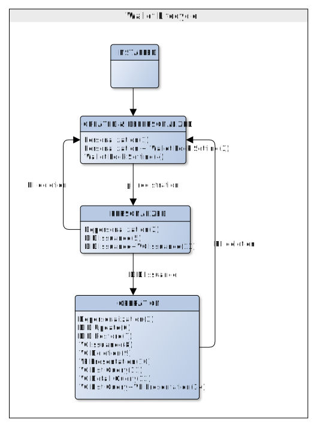
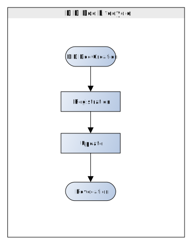
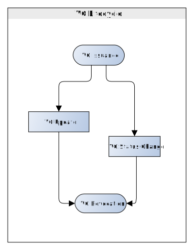

# Wallet Life Cycle

- Subject: Wallet Life Cycle
- Author: OpenSource Development Team
- Date: 2024-10-18
- Version: v1.0.0

| Version | Date       | Changes         |
| ------- | ---------- | --------------- |
| v1.0.0  | 2024-10-18 | Initial version |

 

The diagram below illustrates a typical workflow supported by the OpenDID protocol. Specific workflows are determined by issuance policies, and users proceed through registration steps, service connections, and application execution to securely store DID Documents and VCs within their wallets.

A Wallet, DID Document, and VC each have their own lifecycle. For more details, please refer to the following detailed descriptions.

## Detailed Lifecycle Description
The wallet undergoes a **4-stage lifecycle**.
 

### 1. Wallet Lifecycle States
* `INSTALLED`
* `CREATED & DEPERSONALIZED`
* `PERSONALIZED`
* `OPERATION`

#### - INSTALLED
Indicates the state of wallet app installation.

#### - CREATED & DEPERSONALIZED
Signifies wallet creation (DB, file) without user binding.
 
User binding (PII registration) and wallet locking functionality can be optionally combined.

#### - PERSONALIZED
State where user information is bound, enabling DID issuance and VC issuance.
 
If user information (PII) is deleted, wallet reverts to stage 2 (CREATED & DEPERSONALIZED).

#### - OPERATION
State where DID is issued, allowing all DID/VC related functionalities.
 
Upon deletion of user information (PII), the wallet status changes to stage 2 (CREATED & DEPERSONALIZED).

---

### 2. DID Lifecycle
DID undergoes a **5-stage lifecycle**.
 

<!-- Spacing for line break -->

### * Wallet Lifecycle States
* `DID Document Registration`
* `DID Document Update`
* `DID Document State Change`
* `DID Document Revocation`
* `DID Document Termination`
 

#### - DID Document Registration
Initial issuance of DID Document.
 
This function is requested by CA, Entity.

#### - DID Document Update
Update of DID Document caused by key addition, SEP addition.
 
This function is requested by CA, Entity.

#### - DID Document State Change
Activation/Deactivation of DID Document.
 
This function is requested by TAS.

#### - DID Document Revocation
Revocation of DID Document (used for purposes like denial prevention).
 
This function is requested by TAS.

#### - DID Document Termination
Termination of DID Document (rendering it unusable for any purpose).
 
This function is requested by TAS.

---
### 3. VC Lifecycle
VC (Verifiable Credential) undergoes a **4-stage lifecycle**.
 

<!-- Spacing for line break -->

### * Wallet Lifecycle States
* `VC Issuance`
* `VC Reissuance`
* `VC State Change`
* `VC Revocation`
 

#### - VC Issuance
Initial issuance of VC (Verifiable Credential).
 
This function is requested by CA.

#### - VC Reissuance
Reissuance of VC (Verifiable Credential).
 
This function is requested by CA.

#### - VC State Change
Activation/Deactivation of VC (Verifiable Credential).
 
This function is requested by Issuer.

#### - VC Revocation
Revocation of VC (Verifiable Credential).
 
This function is requested by Issuer.
