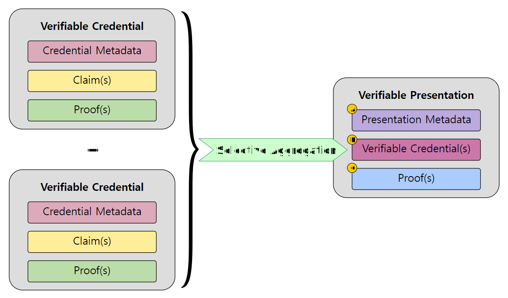

---
puppeteer:
    pdf:
        format: A4
        displayHeaderFooter: true
        landscape: false
        scale: 0.8
        margin:
            top: 1.2cm
            right: 1cm
            bottom: 1cm
            left: 1cm
    image:
        quality: 100
        fullPage: false
---
Verifiable Presentation format
==

- Subject
    - Definition of VP (Verifiable Presentation) data format
- Author: Kang Young-ho
- Date: 2024-09-03
- Version: v1.0.0

Revision History
---

| Version | Date       | Changes         |
| ------- | ---------- | --------------- |
| v1.0.0  | 2024-09-03 | Initial version |


<div style="page-break-after: always;"></div>

Table of Contents
---

<!-- TOC tocDepth:2..4 chapterDepth:2..6 -->

- [1. Overview](#1-overview)
  - [1.1. Reference Documents](#11-reference-documents)
- [2. General Regulations](#2-general-regulations)
  - [2.1. VP Structure](#21-vp-structure)
        - [2.1.1. Data Types and Constants](#211-data-types-and-constants)
        - [2.1.2. `Vp` Object](#212-vp-object)

<!-- /TOC -->


<div style="page-break-after: always;"></div>

## 1. Overview

This document defines the data structure of Verifiable Presentation (VP) used in OpenDID.
The basic regulations comply with W3C's `[VC-MODEL]` (Verifiable Credentials Data Model v2.0).


[Figure 1]

### 1.1. Reference Documents

| Reference   | Document Name                                        | Location                                 |
| ----------- | ---------------------------------------------------- | ---------------------------------------- |
| [VC-MODEL]  | Verifiable Credentials Data Model v2.0               | https://www.w3.org/TR/vc-data-model-2.0/ |
| [VC-IMPL]   | Verifiable Credentials Implementation Guidelines 1.0 | https://www.w3.org/TR/vc-imp-guide/      |
| [VC-DATA]   | Verifiable Credential Data Integrity 1.0             | https://w3c.github.io/vc-data-integrity  |
| [OSD]       | OpenDID Schema Definition Language                   |                                          |
| [DATA-SPEC] | (OpenDID) Data Specification                         |                                          |
| [VC-FORMAT] | (OpenDID) VC Format                                  |                                          |


<div style="page-break-after: always;"></div>


## 2. General Regulations

### 2.1. VP Structure

Refer to `[DATA-SPEC]` for items not defined here.

#### 2.1.1. Data Types and Constants

```c#
def string vpId: "VP id"

def enum VP_TYPE: "VP Type"
{
    "VerifiablePresentation": "VP",
}
```

#### 2.1.2. `Vp` object

The `Vp` object is a Verifiable Presentation submitted by the Holder to the Verifier, structured as follows:

- Presentation Metadata
- Verifiable Credential(s)
- Proof(s)

```c#
def object Vp: "VP object"
{
    //---------------------------------------------------------------------------
    // Presentation Metadata
    //---------------------------------------------------------------------------
    + array(url)     "@context"     : "JSON-LD context"
        , value(["https://www.w3.org/ns/credentials/v2"])
    + vpId           "id"           : "VP id"
    + array(VP_TYPE) "type"         : "List of VP types"
    + did            "holder"       : "Holder DID"
    + utcDatetime    "validFrom"    : "VP validity start date-time"
    + utcDatetime    "validUntil"   : "VP validity end date-time"
    + multibase      "verifierNonce": "verifier nonce", byte_length(16)

    //---------------------------------------------------------------------------
    // Verifiable Credential(s)
    //---------------------------------------------------------------------------
    + array(object) "verifiableCredential": "List of VCs"
    {
        //--- Credential Metadata ---
        // Includes all metadata of the VC
        // ...omitted...

        //--- Claim(s) ---
        + object "credentialSubject": "Credential subject"
        {
            + did          "id"    : "Subject DID"
            // Includes only selected claims
            + array(Claim) "claims": "List of claims", min_count(1)
        }

        //--- Proof(s) ---
        + object "proof": "Issuer signature for VC"
        {
            + PROOF_TYPE    "type"              : "Proof type"
            + utcDatetime   "created"           : "Proof creation date-time"
            + didKeyUrl     "verificationMethod": "Key URL used for proof signature"
            + PROOF_PURPOSE "proofPurpose"      : "Proof purpose", value("assertionMethod")
            + select(1)
            {
                // When all claims are to be submitted
                ^ multibase        "proofValue"    : "Signature values for all claims"
                // When only selected claims are submitted
                // When only selected claims are submitted, include the individual signatures for each selected claim in order
                ^ array(multibase) "proofValueList": "The list of signature values for individual claims"
            }
        }
    }

    //---------------------------------------------------------------------------
    // Proof(s)
    //---------------------------------------------------------------------------
    // If VERIFY_AUTH_TYPE involves multiple user authentications (e.g., "PIN and BIO"),
    // it should be included in the "proofs" array instead of "proof".
    + select(1)
    {
        // when number of user authentications = 1
        ^ AssertProof        "proof" : "Holder proof = Holder signature for VP"
        // when number of user authentications >= 2
        ^ array(AssertProof) "proofs": "List of holder proofs", min_count(2)
    }
}
```

##### 2.1.2.1. Presentation Metadata

Contains information about the VP.

- `~/id`: The VP id, recommended to be UUID type, but various formats can be used depending on implementation.
- `~/type`: The VP type depends on the implementation.
- `~/holder`: The DID of the holder presenting the VP.
- `~/validFrom`, `~/validUntil`: The validity period of the VP, expressed in UTC offset 0.
- `~/verifierNonce`: The verifier nonce
    - Must match the value specified in `VerifyProfile:~/profile/process/verifierNonce` by the verifier.
    - Used for two purposes:
        1. To confirm that the submission is in response to the verifier's request (the verifier needs to verify the match).
        2. To prevent the duplicate submission of the VP.

##### 2.1.2.2. Verifiable Credential(s)

Contains the submitted VCs, the selected claims within those VCs, and the signatures for those claims.

- `~/verifiableCredential[]/`: List of submitted VCs
    - `credentialSubject/claims[]`: Includes only the selected claims
    - `proof`
        - Does **not** include the full signature `proofValue`
        - `proofValueList`: Includes only the individual signatures for the selected claims in the order of the submitted claims

##### 2.1.2.3. Proof(s)

Contains the signature of the holder presenting the VP.

- `~/proof`: Holder's signature