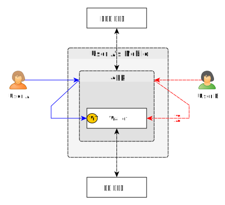
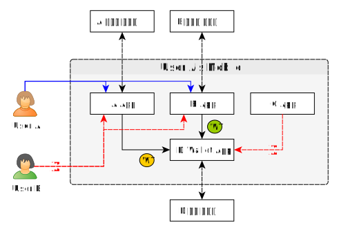
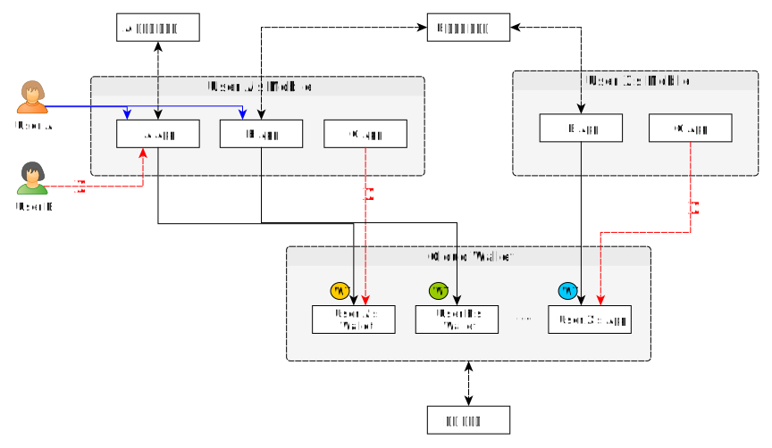
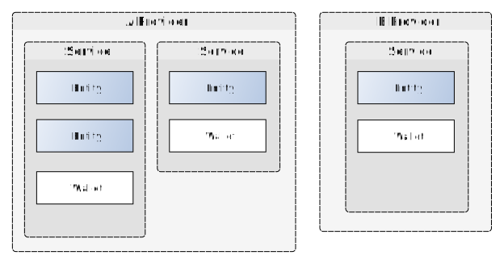
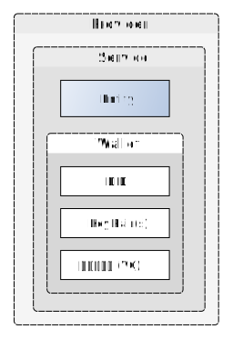
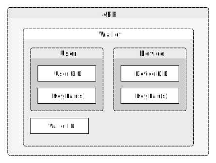

# Wallet

- 주제 : 월렛 설명
- 작성 : 오픈소스개발팀
- 일자 : 2024-10-18
- 버전 : v1.0.0

| 버전 | 일자       | 변경         |
| ------- | ---------- | --------------- |
| v1.0.0  | 2024-10-18 | 최초 작성 |

 

Wallet은 디지털 신원, 자격 증명, 암호화 키 등의 중요한 데이터를 안전하게 저장하고 관리하는 소프트웨어 또는 하드웨어 기반의 저장소입니다. Wallet은 개인 또는 조직이 디지털 세계에서 신뢰할 수 있는 신원을 유지하고, 다양한 서비스에 안전하게 접근하거나 거래를 수행할 수 있도록 지원합니다.

본 문서에서는 Open DID에서 사용하는 월렛에 대해 설명합니다.

## Open DID의 Wallet
Open DID의 Wallet은 Open DID 시스템에 등록한 Wallet 사업자가 제공한 Wallet을 말합니다. Wallet 사업자는 다음 세 가지의 형태로 Wallet을 제공할 수 있습니다.
* File : 각 앱마다 별도로 존재하는 파일 형태의 Wallet 입니다.
* App : 별도의 App으로 제공하는 Wallet 으로, 한 단말의 여러 App에서 공동으로 사용할 수 있습니다.
* Cloud : Cloud 기반으로 제공하는 Wallet 입니다.

## Wallet Token
Wallet 안에는 User의 키와 모바일 신분증 같은 민감한 정보가 저장됩니다. Wallet 내부의 데이터가 안전하게 보관되고 사용되려면, 먼저 Wallet에 대한 접근을 제어할 수 있어야 합니다. Wallet은 App이 인가되었는지와 User가 누구인지 검증을 하고, Wallet Token을 App에 전달합니다. App은 전달받은 Wallet Token을 사용하여 Wallet에 접근할 수 있습니다.

Wallet Token을 발급하는 과정은 다음과 같습니다.
1. App 검증: Wallet은 App이 인가된 App인지 인가앱 서비스를 통해서 확인합니다. (인가앱 서비스는 Open DID 시스템에 등록되어 있어야 합니다)
2. User 검증: Wallet은 User가 Wallet에 접근할 수 있는지 인가앱 서비스를 통해서 확인합니다.
3. Wallet Token 생성: Wallet은 Wallet Token을 생성합니다.

Wallet Token은 유효시간이 있으며, 해당 시간 내에만 사용할 수 있습니다. 

Wallet은 App이 Wallet을 사용하려고 하는 목적별로 Wallet Token을 발급해야 하며, 이 목적을 Wallet Purpose 라고 합니다. Wallet Token은 Wallet Purpose별로 lifecicle이 관리되어야 하며, 이와 관련된 제한 사항은 아래와 같습니다.
* 단일 Token 사용: Wallet은 동시에 여러 개의 Wallet Token을 발급할 수 없으며, 오직 한 개의 Wallet Token만 유효합니다.
* Token 갱신: 다른 Wallet Purpose의 Wallet Token을 발급하려면 기존에 발급된 Wallet Token을 폐기한 후, 새로운 Wallet Token을 발급해야 합니다.

## Wallet 종류별 동작
### File Wallet
File Wallet은 Server나 App이 Wallet을 파일 형태로 가지고 있는 것을 말합니다. App마다 별도로 Wallet을 가지고 있어야 하며, 다른 App의 월렛에는 접근할 수 없습니다.

아래 그림은 User A의 모바일 단말에서 File Wallet에 접근하는 예시입니다. User A가 App에 로그인하여 Wallet에 접근하면 Wallet Token을 발급받아서 Wallet에 접근할 수 있습니다. 반면에, User B는 App에 로그인하더라도 Wallet의 User 검증을 통과하지 못하므로 Wallet Token을 발급받지 못하여 Wallet에 접근할 수 없습니다.

### App Wallet
App Wallet은 App 형태로 Wallet을 제공하는 것을 말합니다. 단일 단말에서 여러 App이 동일한 App Wallet을 사용할 수 있습니다. 이를 통해 사용자는 App마다 별도의 Wallet을 설정할 필요 없이, 하나의 Wallet을 통해서 데이터를 관리할 수 있습니다.

아래 그림은 User A의 모바일 단말에서 App Wallet에 접근하는 예시입니다. 인가된 App(A app, B app)과 허용된 사용자(User A)만 Wallet에 접근할 수 있습니다.

### Cloud Wallet
Cloud Wallet은 클라우드 기반으로 제공되는 Wallet입니다. Cloud Wallet은 사용자가 어디서나 접근할 수 있도록 하여, 높은 유연성과 편의성을 제공합니다. 

아래 그림은 User A의 모바일 단말에서 Cloud Wallet에 접근하는 예시입니다. 인가된 App(A app, B app)과 허용된 사용자(User A)만 Wallet에 접근할 수 있습니다.

## Wallet Data
Open DID를 구성하는 서버와 App은 Wallet을 가지고 있습니다. 이 장에서는 Wallet에 저장되어 있는 데이터에 대해 설명합니다.

**주의:** Wallet Data에 초점을 맞추기 위하여 **이 장에서는 Filw Wallet이라 가정하고 설명합니다.**

### Server Wallet
서버의 Wallet은 서비스의 정보를 안전하게 저장하고 관리하는 역할을 합니다. 서버는 서비스 단위로 Wallet을 가지고 있습니다. 
아래 그림에서 A 사업자는 두 개의 서비스를 제공하므로 총 두 개의 Wallet을 가지고 있으며, B 사업자는 한 개의 서비스를 제공하므로 한 개의 Wallet을 가지고 있습니다.

#### Wallet Data
서버의 Wallet에는 서비스의 DID Document에 명시되어 있는 DID와 키쌍이 저장됩니다. 또한 TA를 통해 Open DID에 등록한 후 받은 가입증명서도 저장합니다.

* DID: Open DID 시스템에 등록한 서비스의 DID 입니다.
* Key Pair(s): 서비스의 DID Document에 명시된 공개키와 이에 매핑되는 개인키를 말합니다.
* 가입증명서(VC): 가입증명서는 TA를 통해 발급 받은 VC를 말하며, Open DID 시스템에 등록된 사실을 증명합니다. 이 증명서는 서비스의 신뢰성과 무결성을 보장하는 중요한 역할을 합니다.

### App Wallet
App의 Wallet은 사용자와 디바이스 정보를 안전하게 저장하고 관리하는 역할을 합니다.

#### Wallet Data
App의 Wallet에는 두 종류의 데이터가 저장되어 있습니다. 
첫 번째는 사용자의 DID Document에 명시되어 있는 DID와 키쌍이고, 두 번째는 Device의 DID Document에 명시되어 있는 DID와 키쌍입니다. Device는 월렛을 의미하며, 월렛 또한 사용자와 마찬가지로 Open DID 시스템에 등록되어야 합니다.

* User DID: Open DID 시스템에 등록한 사용자의 DID 입니다.
* User Key Pair(s): 사용자의 DID Document에 명시된 공개키와 이에 매핑되는 개인키를 말합니다.
* Device DID: Open DID 시스템에 등록한 Device(=Wallet)의 DID 입니다.
* Device Key Pair(s): Wallet의 DID Document에 명시된 공개키와 이에 매핑되는 개인키를 말합니다.
* Wallet ID: Wallet의 고유한 식별자입니다.