---
puppeteer:
    pdf:
        format: A4
        displayHeaderFooter: true
        landscape: false
        scale: 0.8
        margin:
            top: 1.2cm
            right: 1cm
            bottom: 1cm
            left: 1cm
    image:
        quality: 100
        fullPage: false
---

OpenDID Schema Definition Language
==

- 주제: JSON 데이터 형식을 표현하는 문법 정의
- 작성: 오픈소스개발팀 강영호
- 일자: 2024-09-03
- 버전: v1.0.0

개정이력
---

| 버전   | 일자       | 변경 내용               |
| ------ | ---------- | ----------------------- |
| v1.0.0 | 2024-09-03 | 최초 작성               |


<div style="page-break-after: always;"></div>

목차
---

<!-- TOC tocDepth:2..4 chapterDepth:2..6 -->

- [1. 개요](#1-개요)
- [2. 기본 규칙](#2-기본-규칙)
    - [2.1. 데이터 타입](#21-데이터-타입)
    - [2.2. 사용자 정의 타입](#22-사용자-정의-타입)
    - [2.3. 메시지 정의](#23-메시지-정의)
        - [2.3.1. 멤버 정의](#231-멤버-정의)
        - [2.3.2. 멤버 집단 정의](#232-멤버-집단-정의)
        - [2.3.3. 배타적 선택 정의](#233-배타적-선택-정의)
    - [2.4. Annotation](#24-annotation)
    - [2.5. 주석](#25-주석)
    - [2.6. 예시](#26-예시)
        - [2.6.1. Request Message](#261-request-message)
        - [2.6.2. Response Message](#262-response-message)
        - [2.6.3. 다른 예시](#263-다른-예시)
- [3. 권고사항](#3-권고사항)
    - [3.1. 명명 규칙 권고](#31-명명-규칙-권고)
- [4. 문법](#4-문법)
    - [4.1. 타입](#41-타입)
    - [4.2. 리터럴 및 식별자](#42-리터럴-및-식별자)
    - [4.3. 사용자 타입 선언](#43-사용자-타입-선언)
        - [4.3.1. `string` 사용자 타입 선언](#431-string-사용자-타입-선언)
        - [4.3.2. `int` 사용자 타입 선언](#432-int-사용자-타입-선언)
        - [4.3.3. `float` 사용자 타입 선언](#433-float-사용자-타입-선언)
        - [4.3.4. `bool` 사용자 타입 선언](#434-bool-사용자-타입-선언)
        - [4.3.5. `enum` 타입 선언](#435-enum-타입-선언)
        - [4.3.6. `object` 사용자 타입 선언](#436-object-사용자-타입-선언)
        - [4.3.7. `array` 사용자 타입 선언](#437-array-사용자-타입-선언)

<!-- /TOC -->


<div style="page-break-after: always;"></div>

## 1. 개요

JSON (JavaScript Object Notation)은 Javascript 객체 문법으로 구조화된 데이터를 표현하기 위한 문자 기반의 포맷이다.
XML의 번거로움을 해소하고 사람이 읽기 쉬운 형태여서 웹개발 등에 많이 사용되고 있다.

그러나 다음과 같은 단점도 존재한다.

- 데이터의 양이 늘어난다.
- 표현할 수 있는 데이터 타입이 제한적이다.
- 제약조건을 명시하기 어렵다.

본 문서는 이러한 단점을 완화하고, 개발·운영 시스템에서 주고받는 JSON 데이터 포맷에 대한 개발자·운영자 간 혼란을
최소화할 목적으로 JSON으로 표현된 데이터의 표기법에 대하여 정의하고자 한다.
JSON 문법 자체로는 표현하기 힘든 아래와 같은 부분을 명확히 정의한다.

- optional/mandatory attribute (선택·필수 여부)
- data grouping (data group 별 선택·필수 여부 포함)
- default value (기본값)
- array cardinality (배열의 기수성)
- value range (값의 범위, 예: 1~100)
- enumeration
- variable item names (가변 항목명)
- select & multiple select (정해진 대상 중에서 단일선택 또는 복합선택)


<div style="page-break-after: always;"></div>

## 2. 기본 규칙

### 2.1. 데이터 타입

| 타입     | 설명        | 예시             |
| -------- | ----------- | ---------------- |
| `string` | 문자열      | `"abcABC가나다"` |
| `int`    | 정수        | `123`            |
| `float`  | 부동소수점  | `10.5`           |
| `bool`   | 참거짓      | `true`, `false`  |
| `enum`   | enumeration |                  |
| `object` | 객체        | `{...}`          |
| `array`  | 배열        | `[...]`          |

### 2.2. 사용자 정의 타입

사용자 타입은 `def` 구문으로 선언할 수 있다.

1. 기본 타입(string, int, float, bool)
2. enum 타입
3. 객체 타입
4. 배열 타입

```c#
def string uuid : "UUID string", length(36)
def int    score: "Score", min_value(0), max_value(100)

def enum COLOR: "Selectable colors"
{
    "FF0000": "Red",
    "00FF00": "Green",
    "0000FF": "Blue",
}

def enum AUTH_TYPE: "인증 수단"
{
    1: "무인증", 2: "PIN", 3: "BIO"
}

def object Proof: "Proof object"
{
    + string "kid"  : "Key id"
    + string "alg"  : "signature algorithm"
    + string "sig"  : "signature value"
    - int    "nonce": "nonce"
}

def object SampleObject: "Sample object"
{
    + array(object) "aList": "List of something"
    {
        + string "a": "A"
        - string "b": "B"
        + string "c": "C"
    }
    - array(Proof) "proof": "List of proof", min_count(1), max_count(3)
}
```

### 2.3. 메시지 정의

JSON 메시지는 아래 두 가지 중 하나로 정의한다.

- 사용자 정의 객체 타입: `def object ...`
- 사용자 정의 배열 타입: `def array(?) ...`

#### 2.3.1. 멤버 정의

객체 내의 자식 항목을 멤버(member) 라고 하며, 멤버의 종류는 다음과 같다.

- simple member: 기본 타입 또는 기본 타입으로부터 유도된 사용자 정의 타입
- object member
- array member
- group: 2개 이상의 멤버를 하나의 집단으로 묶음
- select: 1개 이상의 멤버 중 배타적으로 선택

모든 member 정의 가장 앞에 mandatory/optional 여부를 나타내는 기호인 presence symbol을 표시한다.

- Presence symbol
    - `+`: mandatory
    - `-`: optional

#### 2.3.2. 멤버 집단 정의

2개 이상의 멤버를 하나의 집단으로 묶을 때는 `group` 구문을 이용한다.

```c#
def object Obj: "sample object"
{
    + string "address": "user's home address"
    - group
    {
        + string "given_name" : "given name"
        + string "family_name": "family name"
        - int    "age"        : "age"
    }

}
```

#### 2.3.3. 배타적 선택 정의

1개 이상의 멤버 중 1~n개가 배타적으로 출현함으로 나타내고자 할 때는 `select` 구문을 이용한다.
`select` 구문 내에서는 멤버가 배타적임을 나타내기 위해 presence symbol 대신 `^` 기호를 표시한다.

```c#
def object Obj: "sample object"
{
    + select(1)   // select(1..2)는 1~2개를 의미
    {
        ^ string "mobile": "mobile phone number"
        ^ string "email" : "email address"
    }
}
```

### 2.4. Annotation

Java 언어의 annotation과 비슷하게 동작하는 정적 프로그램 주석이다.
이는 언어를 좀 더 유연하게 확장하는 용도로 사용된다.
현재 정의된 annotation은 다음과 같다.

- `@spread(ObjectType)`: 기존 객체 상속. 즉, 현재 객체 내에 기존 정의된 객체의 멤버 풀어놓기

■ @spread 예시

```c#
// 모든 도형이 공통적으로 갖는 속성인 x, y 좌표를 가진 도형 객체 정의
def object Shape: "도형"
{
    + int "x": "x 좌표"
    + int "y": "y 좌표"
}

// 도형 객체의 x, y 좌표를 포함하고, 너비와 높이 속성을 추가한 사각형 객체 정의
def object Rectangle: "사각형"
{
    @spread(Shape)  // 도형 객체 상속

    + int "width" : "너비"
    + int "height": "높이"
}

// 도형 객체의 x, y 좌표를 포함하고, 반지름 속성을 추가한 원형 객체 정의
def object Circle: "원형"
{
    @spread(Shape)

    + float "radius": "반지름"
}
```

객체 지향 프로그래밍에서 상속의 쓰임과 같이 부모 객체 정의를 기본적으로 포함하며
추가적인 속성을 정의할 때 유용하게 사용할 수 있다.

### 2.5. 주석

주석의 사용법은 Java 문법과 동일하다.

- 한 줄 주석: `//`
- 여러 줄 주석: `/*` ~ `*/`


### 2.6. 예시

#### 2.6.1. Request Message

**기존 표기법**

```json
{
    // <Header>
    "id"          : "<message-id> message id",
    "type"        : "<message-type> message type",
    "txId?"       : "<uuid> transaction id",
    "cmdId?"      : "<uuid> command id",
    "callbackUrl?": "<multibase-string> 응답문을 비동기로 전송할 주소",
    "expireDate?" : "<utc-datetime> 만료일시",

    // <Body>
    "data": {
        // ...
    },

    // <Footer>
    "supplements?": [
        {
            "supId"     : "<string> supplement item id",
            "desc?"     : "<string> description of the content",
            "mediaType?": "<media-type>",
            "format?"   : "<string>",
            "data": {
                "multibase?": "<multibase-string>",
                "links?"    : ["<multibase-string[]> URL to fetch data"],
                "json?"     : {}
            }
        }
        // ...
    ]
}
```

**신규 표기법**

```c#
// 사용자 정의 타입
def string messageId  : "message id string", length(28)
def string messageType: "message type string"
def string uuid       : "UUID string"
def string multibase  : "multibase string"
def string utcDatetime: "UTC datetime string"

def enum MEDIA_TYPE: "media type enum"
{
    "image"   : "images such as png, jpg, gif",
    "video"   : "videos such as mp4",
    "document": "documents such as pdf, doc, xls",
    "etc"     : "the others",
}

def object Supplement: "additional information"
{
    + string     "supId"    : "supplement item id"
    - string     "desc"     : "description of the contents"
    - MEDIA_TYPE "mediaType": "media type"
    - string     "format"   : "data format"
    + object     "data"     : "contents"
    {
        + select(1)
        {
            ^ multibase        "multibase": "contents in multibase"
            ^ array(multibase) "links"    : "URL to fetch data", min_count(1)
            ^ object           "json"     : "contents in JSON", emptiable(false) {...}
        }
    }
}

// 요청문
def object RequestMessage: "request message"
{
    // Header
    + messageId   "id"        : "message id"
    + messageType "type"      : "message type"
    - uuid        "txId"      : "transaction id"
    - uuid        "cmdId"     : "command id"
    - utcDatetime "expireDate": "expiration date"

    // Body
    + object "data": "message body", emptiable(true) {...}

    // Footer
    - array(Supplement) "supplements": "list of additional items", min_count(1)
}
```

#### 2.6.2. Response Message

**기존 표기법**

```json
{
    // <Header>
    "status": "<enum-res-status> ['success', 'command', 'error']",
    "txId?" : "<uuid> transaction id",

    // <Body>
    "data?": { /* ... */ },
    "command?": {
        "cmdId"   : "<uuid> command id",
        "protoId" : "<string> protocol id",
        "protoUrl": "<multibase-string> URL to invoke",
        "param"   : { /* parameters */ }
    },
    "error?": {
        "code": "<string> error code",
        "desc": "<string> error description",
        "message": "<string> error message for end users"
    },

    // <Footer>
    "supplements?": [ { /* ditto */ } ]
}
```

**신규 표기법**

```c#
// 사용자 정의 타입
def enum RES_STATUS: "response status"
{
    "success", "command", "error"
}

// 응답문
def object ResponseMessage: "response message"
{
    // Header
    + RES_STATUS "status": "response status"
    - uuid       "txId"  : "transaction id"
    
    // Body
    + select(1)
    {
        // status is 'success'
        ^ group
        {
            + object            "data"       : "normal response", emptiable(true) {...}
            - array(Supplement) "supplements": "list of supplement", min_count(1)
        }

        // status is 'command'
        ^ object "command": "command response"
        {
            + uuid      "cmdId"    : "command id"
            + string    "protoId"  : "protocol id"
            + multibase "protolUrl": "URL to invoke"
            + object    "param"    : "command parameters", emptiable(true) {...}
        }

        // status is 'error'
        ^ object "error": "error response"
        {
            + string "code"   : "error code"
            + string "desc"   : "error description"
            + string "message": "error message for end users"
        }
    }
}
```


#### 2.6.3. 다른 예시

**propose-dh-ecies**

```c#
def enum AES_TYPE: "AES key length"
{
    "AES128", "AES256"
}

def enum ECC_ALG_TYPE: "ECC algorith type"
{
    "secp256k1", "secp256r1"
}

def object RequestProposeDhEcies: "request of propose-dh-ecies"
{
    + messageId   "id"   : "message id"
    + messageType "type" : "message type", value("omn-di/1.0/propose-dh-ecies")
    + uuid        "cmdId": "command id"
    + object      "data" : "message body"
    {
        - object "candidate": "available algorithm list of the client"
        {
            + array(AES_TYPE)     "aesTypeList": "available AES alg list", default(["AES256"])
            + array(ECC_ALG_TYPE) "algTypeList": "available ECC alg list", default(["secp256r1"])
        }
    }
}

def object ResponseProposeDhEcies: "response of propose-dh-ecies"
{
    // Header
    + RES_STATUS "status": "response status", value("success")
    + uuid       "txId"  : "transaction id"

    // Body
    + object "data": "response data"
    {
        + bool "useDidKey": "false: create temp key, true: use DID key of client"
        + select(1)
        {
            // when using DID key
            ^ group
            {
                + string "da" : "server's DA"
                + string "kid": "ECC key id in the DID Document"
            }

            // when using temporary key
            ^ multibase "pubKey": "server's temporary key"
        }
        + multibase "nonce": "nonce", byte_length(16)
    }
}
```

**VC claim object**

```c#
def string claimCode: "Claim code"
def string vcDigest : "W3C subresource integrity"

def enum CLAIM_TYPE: "클레임 타입"
{
    "text", "image", "document",
}

def enum CLAIM_FORMAT: "클레임 포맷"
{
    // text
    "plain", "html", "xml", "csv",
    
    // image
    "png", "jpg", "gif",
    
    // document
    "txt", "pdf", "word",
}

def enum LOCATION: "클레임 원본 데이터 위치"
{
    "inline": "VC 내 'value'에 값 포함",
    "remote": "외부 링크 URL",
    "attach": "별도의 첨부파일",
}

def object Claim: "VC claim object"
{
    + claimCode    "code"     : "클레임 코드"
    + string       "caption"  : "클레임 이름"
    + string       "value"    : "클레임 값"
    + CLAIM_TYPE   "type"     : "클레임 타입"
    + CLAIM_FORMAT "format"   : "클레임 포맷"
    - bool         "hideValue": "클레임 값 숨김 여부", default(false)
    - LOCATION     "location" : "클레임 원본 위치", default("inline")
    - vcDigest     "digestSRI": "클레임 값의 해시", default(null)
    - object       "i18n"     : "기타 언어의 클레임 이름"
    {
        + object $lang: "기타언어 클레임 이름", variable_type(LANGUAGE), min_extend(1)
        {
            + string   "caption"  : "클레임 이름"
            - string   "value"    : "클레임 값"
            - vcDigest "digestSRI": "클레임 값의 해시"
        }
    }
}
```

<div style="page-break-after: always;"></div>

## 3. 권고사항

### 3.1. 명명 규칙 권고

사용자 정의 타입의 이름은 다음의 규칙을 따를 것을 권고하나 필수는 아니다.

| 종류   | 명명 규칙                   | 예시                                                 |
| ------ | --------------------------- | ---------------------------------------------------- |
| Basic  | lowerCamelCase              | `def string didKeyId: "DID key id"`                  |
| Enum   | UPPER_SNAKE_CASE            | `def enum CLAIM_TYPE: "claim type" {...}`            |
| Object | UpperCamelCase(=PascalCase) | `def object RequestMessage: "request message" {...}` |
| Array  | ^^                          | `def array(int) AuthType: "auth type"`               |


<div style="page-break-after: always;"></div>

## 4. 문법

### 4.1. 타입

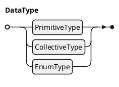

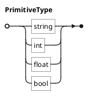

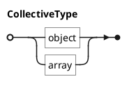

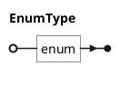

### 4.2. 리터럴 및 식별자

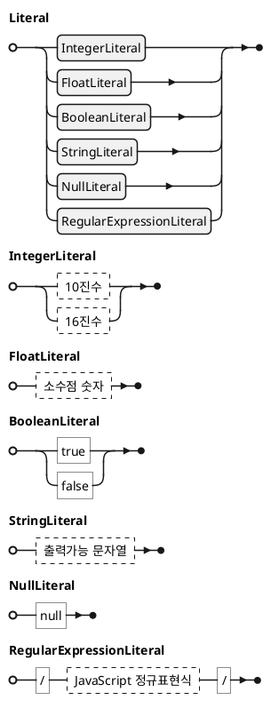

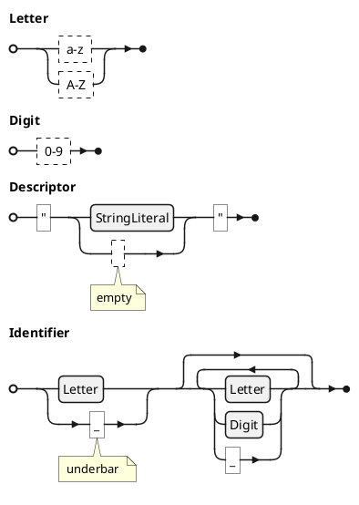


### 4.3. 사용자 타입 선언

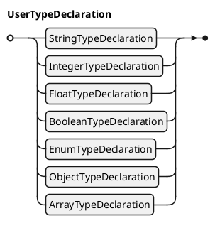

#### 4.3.1. `string` 사용자 타입 선언

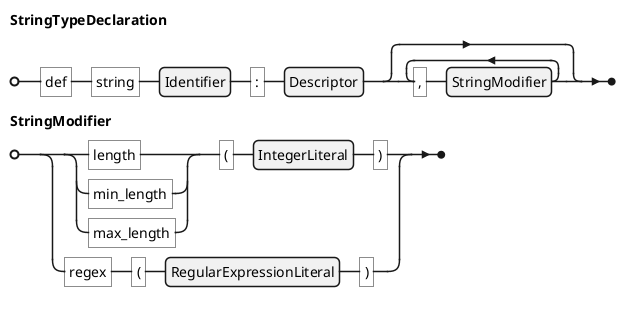

- `length`: 고정된 글자수
- `min_length`: 최소 글자수
- `max_length`: 최대 글자수
- `regex`: 정규표현식

**예시**

```c#
def string messageId: "message id string", length(28)

def string userId: "user ID",
    min_length(4), max_length(30),  // 허용 길이는 4-30
    regex(/[a-z,A-Z,0-9]+/)         // 알파벳, 숫자만 허용
```

#### 4.3.2. `int` 사용자 타입 선언

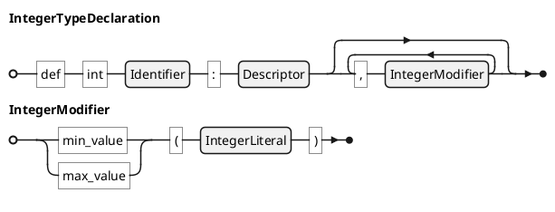

- `min_value`: 최소값
- `max_value`: 최대값

#### 4.3.3. `float` 사용자 타입 선언

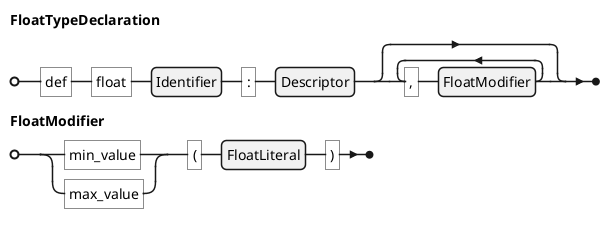

- `min_value`: 최소값
- `max_value`: 최대값

#### 4.3.4. `bool` 사용자 타입 선언

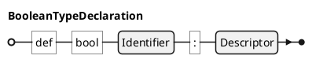

#### 4.3.5. `enum` 타입 선언

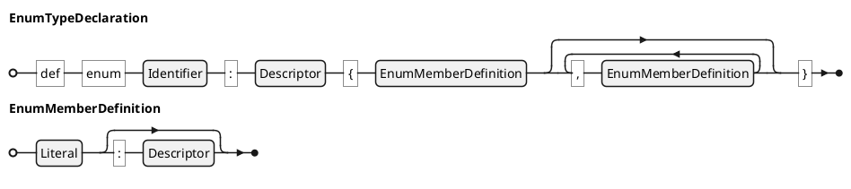

#### 4.3.6. `object` 사용자 타입 선언

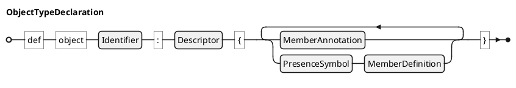

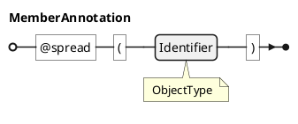

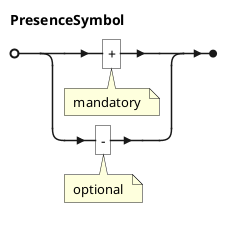

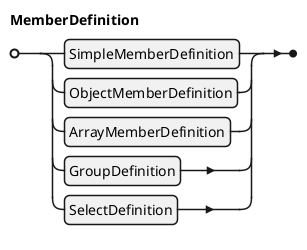

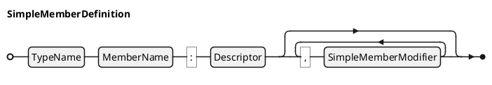

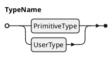
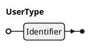
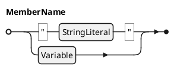
```plantuml
@startebnf
Variable = "$", Identifier;
@endebnf
```
<br>

```plantuml
@startebnf
SimpleMemberModifier = ("default" | "value" | "min_value" | "max_value") , "(", Literal, ")"
    | ("length" | "byte_length" | "min_length" | "max_length" | "min_byte_length" | "max_byte_length"), "(", IntegerLiteral, ")"
    | "regex", "(", RegularExpressionLiteral, ")"
    | ("min_extend" | "max_extend"), "(", IntegerLiteral, ")"
    | "variable_type", "(", UserName, ")"
    ;
@endebnf
```

- `default`: 기본값
- `value`: 고정값
- `min_value`, `max_value`: 최소, 최대값
- `length`: 고정 길이
- `byte_length`: 바이트 단위 고정 길이
- `min_byte_length`, `max_byte_length`: 바이트 단위 최소, 최대 길이
- `regex`: 정규표현식 조건
- `mix_extend`, `max_extend`: 확장 부분에서 나타날 수 있는 객체의 최소, 최대 빈도
- `variable_type`: 확장변수의 명시적 타입을 지정. 기본은 "string"


```plantuml
@startebnf
ObjectMemberDefinition = "object", MemberName, ":", Descriptor
                       , {",", ObjectMemberModifier}
                       , "{"
                       , ("..." | {PresenceSysmbol, MemberDefinition}-)
                       , "}"
                       ;
@endebnf
```

```plantuml
@startebnf
ObjectMemberModifier = ("default" | "value"), "(", "{", ? object value expression ? , "}", ")"
                     | "emptiable", "(", BooleanLiteral, ")"
                     | ("min_extend" | "max_extend"), "(", IntegerLiteral, ")"
                     | "variable_type", "(", UserName, ")"
                     ;

@endebnf
```

- `default`: 기본값
    - 예: default({"age": 16, "name": "James"})
- `value`: 고정값
- `emptialbe`: 빈 값(`{}`) 허용 여부
- `mix_extend`, `max_extend`: 확장 부분에서 나타날 수 있는 객체의 최소, 최대 빈도
- `variable_type`: 확장변수의 명시적 타입을 지정. 기본은 "string"

```plantuml
@startebnf
ArrayMemberDefinition = ObjectArrayMemberDefinition | TypedArrayMemberDefinition;
@endebnf
```

```plantuml
@startebnf
ObjectArrayMemberDefinition = "array", "(", "object", ")", MemberName, ":", Descriptor
                            , {",", ArrayMemberModifier}
                            , "{"
                            , ("..." | {PresenceSysmbol, MemberDefinition}-)
                            , "}"
                            ;
@endebnf
```

```plantuml
@startebnf
TypedArrayMemberDefinition = "array", "(", TypeName, ")", MemberName, ":", Descriptor
                           , {",", TypedArrayMemberModifier}
                           ;
@endebnf
```

```plantuml
@startebnf
ArrayMemberModifier = ("count" | "min_count" | "max_count"), "(", IntegerLiteral, ")"
                    | "emptiable", "(", BooleanLiteral, ")"
                    | ("min_extend" | "max_extend"), "(", IntegerLiteral, ")"
                    | "variable_type", "(", UserName, ")"
                    ;
@endebnf
```

- `count`: 고정 배열 항목 개수
- `min_count`, `max_count`: 최소, 최대 항목 개수
- `emptiable`: 빈 배열(`[]`) 허용 여부
- `mix_extend`, `max_extend`: 확장 부분에서 나타날 수 있는 객체의 최소, 최대 빈도
- `variable_type`: 확장변수의 명시적 타입을 지정. 기본은 "string"

```plantuml
@startebnf
TypedArrayMemberModifier = ArrayMemberModifier
                         | ("default" | "value"), "(", "[", Literal, {",", Literal}, "]", ")"
                         | "oneof", "(", Literal, {",", Literal}, ")"
                         ;
@endebnf
```

- `default`: 기본값
- `value`: 고정값
- `oneof`: 배열의 값으로 나타날 수 있는 후보 목록(enum 정의 대신 값만 나열하는 경우 사용)

```plantuml
@startebnf
GroupDefinition = "group", "{", {PresenceSysmbol, MemberDefinition}-, "}";
@endebnf
```

```plantuml
@startebnf
SelectDefinition = "select", "(", IntegerLiteral, ["..", IntegerLiteral] , ")"
                 , "{", {"^", MemberDefinition}-, "}"
                 ;
@endebnf
```

```c#
select(1)  // 1개만 포함 가능. 멤버가 1개 이상이어야 함.
{
    ^ string "a": "A"
    ^ string "b": "B"
}

select(1..3)  // 1~3개 포함 가능. 멤버가 3개 이상이어야 함
{
    ^ string "a": "A"
    ^ string "b": "B"
    ^ string "c": "C"
}
```

#### 4.3.7. `array` 사용자 타입 선언


```plantuml
@startebnf
ArrayTypeDeclaration = ObjectArrayTypeDeclaration | TypedArrayTypeDeclaration;
@endebnf
```

```plantuml
@startebnf
ObjectArrayTypeDeclaration = "def", "array", "(", "object", ")", Identifier, ":", Descriptor
                           , {",", ArrayModifier}
                           , "{"
                           , ("..." | {PresenceSysmbol, MemberDefinition}-)
                           , "}"
                           ;
@endebnf
```

```plantuml
@startebnf
TypedArrayTypeDeclaration = "def", "array", "(", TypeName, ")", Identifier, ":", Descriptor
                          , {",", TypedArrayModifier}
                          ;
@endebnf
```

```plantuml
@startebnf
ArrayModifier = ("count" | "min_count" | "max_count"), "(", IntegerLiteral, ")";
@endebnf
```

- `count`: 고정 배열 항목 개수
- `min_count`, `max_count`: 최소, 최대 항목 개수

```plantuml
@startebnf
TypedArrayModifier = ArrayModifier
                   | "oneof", "(", Literal, {",", Literal}, ")"
                   ;
@endebnf
```

**예시**

```c#
def array(object) UserInfoList: "사용자 정보 배열", min_count(1)
{
    + string "name"      : "이름"
    + string "birth_date": "생년월일"
    - string "ci"        : "CI"
}

def array(string) SelectedColors: "선택된 색상", count(2), oneof("RED", "GREEN", "BLUE", "YELLOW")
```
